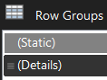
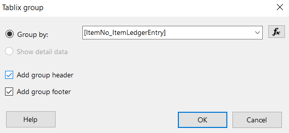
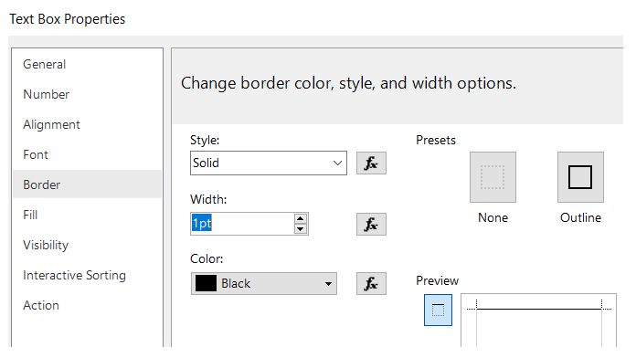
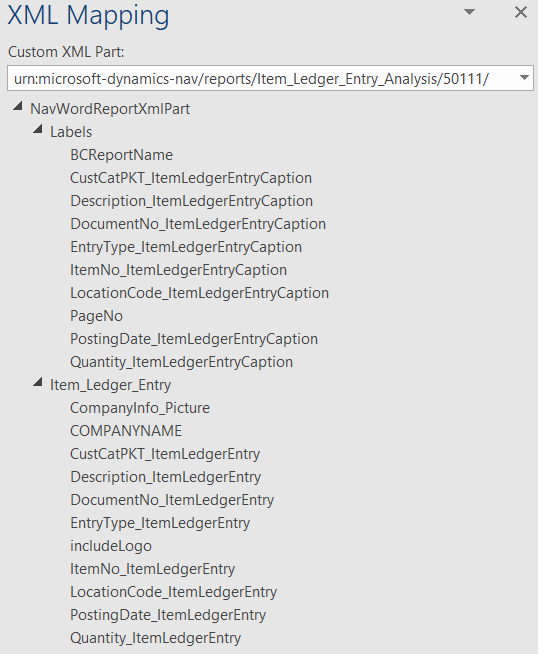

# 使用 AL 进行报告开发

在本书中，我们介绍并分析了各种 AL 语言对象，并且展示了如何使用它们开发从简单到复杂的扩展。

在本章中，我们将深入研究一个特定对象，查看其属性、触发器和方法，并学习如何熟练使用它。这个对象就是**报告对象**。

我们将提供有关使用哪些工具来设计和开发数据集和布局的概述，包括 Microsoft Word 用于 Word 布局，以及 Microsoft Report Builder 用于**报告定义语言**（**RDL**）布局，并且会讨论与使用 Visual Studio Code 进行数据集开发以及 Word 和 RDL 布局相关的主要快捷键、技巧和窍门。

在本章中，我们旨在为您提供必要的信心，以便您能够开发 Dynamics 365 Business Central 报告扩展，解释如何使其性能达到最佳，并帮助您排查这一领域最常见的问题。

在本章中，我们将讨论以下主题：

+   AL 报告对象的结构

+   用于 Word 和 RDL 布局的工具

+   将现有的 C/AL 报告转换为 AL

+   开发 RDL 或 Word 布局报告时的功能限制

+   理解报告性能的考虑因素

# AL 报告对象的结构

新报告的请求来自各个部门，并且以多种不同的形式呈现。大多数时候，用户心中已经有了他们希望数据呈现方式的构想。

然而，报告开发人员应始终牢记一些重要的要点。一切都与数据相关：

+   **检索**：一个优秀的报告开发人员应具备良好的业务流程知识（数据是如何创建、修改和删除的）和数据拓扑知识（数据存储的位置）。数据可以从无法直接存储在 Dynamics 365 Business Central 表中的异构资源中检索。例如，您可能希望通过 HTTP 调用一个 Web 服务，收集数据库外部的一些数据，并将其存储在物理表或临时表中，然后再进行处理。

+   **处理**：一些呈现的数据可能是数据聚合的结果，可能是从不同字段计算得到的，甚至可能是不同表格中值的连接结果。数据的检索和处理结果生成数据集。

+   **呈现**：数据集从应用程序发送到报告查看器组件，报告查看器负责数据的呈现和显示。与数据集一起，一个报告定义文件（`Report.rdlc`）也会发送给报告查看器，以构建报告的内容。报告定义文件包含用于呈现报告的元数据结构和规则。尽管它的扩展名是（`.rdlc`），但这实际上是一个 XML 格式的平面文件。诸如报告生成器或 Visual Studio 之类的工具可以解析该 XML 文件，并以更易于人类阅读的方式创建报告结构的呈现。在此设计器中进行的每个操作都会导致编辑和更改 XML 文件。

使用 Dynamics 365 Business Central，还可以设计报告仅执行数据检索和处理，通常会在处理过程中提交对表的更改。没有数据呈现给用户，因此不需要布局，也不会创建数据集。

报告可以分为两大类：仅处理和基于数据集。

仅处理的报告没有任何布局。它们通常也没有在数据集中定义任何列，只用于处理数据。通常，使用代码单元对象也可以实现相同的结果，因为这些只是简单的代码库，并没有任何图形或**用户界面**（**UI**）交互。举个简单的例子，你可以创建一个仅处理的报告，数据项会循环所有客户记录，并打印一个包含客户编号、姓名和电子邮件的扁平 JSON 文件。同样的结果也可以通过实现一个代码单元来完成，该代码单元包含一个声明为`IF CustomerRec FINDSET THEN REPEAT UNTIL NEXT=0`的循环。在这个循环中，可以编写一个包含完全相同信息的扁平 JSON 文件。

使用仅处理报告或代码单元的优缺点已经在这里列出：

|  | **仅处理报告** | **代码单元** |
| --- | --- | --- |
| **易于实现** | 它更快。数据项循环结构是预定义的。 | 构建一个循环需要更多的开发活动。 |
| **灵活性** | 它仅限于数据项触发器。 | 它更灵活。 |
| **性能** | 它的性能较差。 | 它的性能更好。 |

一个报告对象具有以下树结构：

+   **请求页面**：

    +   **列**：

        +   **分组**：

            +   **字段**

    +   **操作**

+   **数据集**：

    +   **数据项**：

        +   **属性**

        +   **触发器**

        +   **列**：

            +   **属性**

            +   **触发器**

    +   **标签**：

        +   **属性**

    +   **布局**：

        +   **RDL**

        +   **词汇**

安装标准的**AL Language 扩展**和**CRS AL Language 扩展工具**后，我们可以使用`treport`或`treport`（CRS）代码片段来创建报告的原型，并检查与主内容区域相关的所有不同项：数据集和请求页面。布局仅是报告对象中对应输出（RDL 和/或 Word 文件）的引用，这些是通过其他工具而非 Visual Studio Code 创建的。我们将在本章稍后部分与它们一起工作。

在探索 AL 中报告对象的结构后，是时候了解用于 Word 和 RDL 布局的工具了。

# 用于 Word 和 RDL 布局的工具

Visual Studio Code 目前没有有效的扩展——尚未发布——来替代由 Dynamics 365 Business Central 开发团队支持的顶级 RDL 报告编辑器。该应用程序每六个月发布一次，始终保持最新状态，并且在撰写本文时，它部署了 Report Viewer 2017 和最新的基于 RDL 2016 模式的语法。

要开发 RDL 布局报告，你有两个选择：

+   **SQL Server 2016 报告生成器**: [`www.microsoft.com/en-us/download/details.aspx?id=53613`](https://www.microsoft.com/en-us/download/details.aspx?id=53613)

+   **已安装 Microsoft RDLC 报告设计器的 Visual Studio 2017**: [`marketplace.visualstudio.com/items?itemName=ProBITools.MicrosoftRdlcReportDesignerforVisualStudio-18001`](https://marketplace.visualstudio.com/items?itemName=ProBITools.MicrosoftRdlcReportDesignerforVisualStudio-18001)

要了解更多信息，请访问以下官方参考资料和这个有用的博客：

+   [`docs.microsoft.com/en-us/dynamics365/business-central/dev-itpro/deployment/system-requirement-business-central`](https://docs.microsoft.com/en-us/dynamics365/business-central/dev-itpro/deployment/system-requirement-business-central)

+   [`thinkaboutit.be/2019/01/how-do-i-configure-my-rdlc-layout-designers-for-vscode/`](https://thinkaboutit.be/2019/01/how-do-i-configure-my-rdlc-layout-designers-for-vscode/)

Word 布局功能是基于最新的 Aspose.Words ([`products.aspose.com/words`](https://products.aspose.com/words)) 组件构建的，并由后端服务器团队在应用程序中实现。设计和编辑必须使用支持 XML 映射的 Microsoft Word 版本。最低系统要求规定我们应使用**Microsoft Word 2016**或更高版本。

# RDL 和 Word 布局功能

为了解释和展示 Dynamics 365 Business Central 支持的一些最重要的 RDL 和 Word 布局功能，我们将通过一个逐步示例进行讲解。

在第五章，*为 Dynamics 365 Business Central 开发定制解决方案*中，我们通过创建“客户类别”字段来扩展了项目账目表。现在是时候创建一个使用此扩展字段进行销售分析的报告了。请在扩展中创建一个名为`.\Src\CustomerCategory\report`的新目录。让我们学习如何实现。

# 第一部分 – 设计数据集

数据集通过指定数据项字段的列及其属性在报告中进行设计。它们从定性角度（数据以何种格式导出？）和定量角度（处理了多少行？）都有较大影响。这两者对报告性能都有明显的影响。

一个简短的示例是由十进制数据类型表示的。当在数据集中特定十进制数据类型时，始终会包括两个字段：十进制数据及其格式化方式。这意味着，在十进制字段的同时，你总是会有一个与之紧密绑定的重复文本变量。这将增加数据集的维度，从而影响报告性能。

什么是 Dynamics 365 Business Central 数据集的定义？这是我的定义：

“数据集就像是客户端内存中的一张表，其列由数据集部分中定义的所有列字段组成，而行则是所有有效的（未跳过的）记录，这些记录在 DataItems 中进行处理。”

让我们设计/创建我们的报告数据集：

1.  在`.\Src\CustomerCategory\report`文件夹中创建一个名为`Rep50111.ItemLedegerEntryAnalysis.al`的新文件。

1.  输入`treport`或`treport`（CRS）以启用报告片段。

1.  添加以下数据项和列：

```
report 50111 "Item Ledger Entry Analysis"
{
    Caption ='Item Ledger Entry Analysis';
    UsageCategory=ReportsAndAnalysis;
    ApplicationArea = All;
dataset
{
    dataitem("Item Ledger Entry";"Item Ledger Entry")
    {
        column(ItemNo_ItemLedgerEntry;"Item Ledger Entry"."Item No.")
        {
            IncludeCaption = true;
        }
        column(PostingDate_ItemLedgerEntry;"Item Ledger Entry"."Posting Date")
        {
            IncludeCaption = true;
        }
        column(EntryType_ItemLedgerEntry;"Item Ledger Entry"."Entry Type")
        {
            IncludeCaption = true;
        }
        column(CustCatPKT_ItemLedgerEntry;"Item Ledger Entry"."Customer Category_PKT")
        {
            IncludeCaption = true;
        }
        column(DocumentNo_ItemLedgerEntry;"Item Ledger Entry"."Document No.")
        {
            IncludeCaption = true;
        }
        column(Description_ItemLedgerEntry;"Item Ledger Entry".Description)
        {
            IncludeCaption = true;
        }
        column(LocationCode_ItemLedgerEntry;"Item Ledger Entry"."Location Code")
        {
            IncludeCaption = true;
        }
        column(Quantity_ItemLedgerEntry;"Item Ledger Entry".Quantity)
        {
           IncludeCaption = true;
        }
        column(COMPANYNAME;CompanyName)
        {
        }
        column(includeLogo;includeLogo)
        {
        }
        column(CompanyInfo_Picture;CompanyInfo.Picture)
        {
        }
    }
}    
```

之后，我们添加标签：

```
labels
    {
        PageNo = 'Page';
        BCReportName ='Item Ledger Entry Analysis';
    }
    var
        CompanyInfo: Record "Company Information";
        includeLogo: Boolean;
}
```

1.  按照原样构建并发布扩展，在你的在线或 Docker 容器沙箱中进行。

1.  转到报告布局选择，并根据报告的 ID 或名称进行筛选。

1.  选择“操作 | 自定义布局”。

1.  单击“新建”，选择“插入 RDLC 布局”，然后单击“确定”。这将为报告添加一个空的 RDL 布局，并引用数据集结构。

1.  选择“处理 | 导出布局”，并将`Default.rdl`报告保存到`.\Src\CustomerCategory\report`文件夹中。你可以将报告布局命名为`Rep50111.ItemLedgerEntryAnalysis.rdl`。

1.  将报告绑定到扩展中的 RDL 布局，并通过在 AL 报告对象中指定以下参数，使 RDL 成为默认布局：

```
report 50111 "Item Ledger Entry Analysis"
{
    DefaultLayout = RDLC;
    RDLCLayout = './Src/CustomerCategory/report/Report50111.ItemLedgerEntryAnalysis.rdl';
  Caption = 'Item Ledger Entry Analysis';
```

1.  在 Visual Studio Code 中，右键单击 RDL 文件并选择“外部打开”。它将默认在你选择的程序中打开该`.rdl`文件。在此示例中，我们将使用 Microsoft SQL Server Report Builder 2016。

1.  如果尚未启用，请确保在 Report Builder 2016 实例的“视图 | 显示/隐藏”功能区菜单中勾选了“报告数据”选项。在“报告数据”窗格中，展开`参数`和`数据集`。

你会注意到 `Parameters` 项是标签和字段标题（由数据集中的 `IncludeCaption=true` 属性指定）。`DataSet_Results` 显示了整个数据集的定义，并转置到 Report Builder IDE 中。以下是报告数据窗格的截图：


# 第二部分 – 创建简单的 RDL 布局

RDL 布局开发是 Dynamics 365 Business Central 提供的两种布局设计选项之一。与 Report Builder 相比，使用 Visual Studio 2017（加上 Microsoft RDLC Report Designer for Visual Studio 扩展）进行报告布局设计提供了更完整的开发体验。一个例子是“文档大纲”窗口，它显示了布局中控件的层次视图，并让你可以快速从一个控件跳转到另一个控件。

专门针对 RDL 布局开发，你可以从 SQL Server Reporting Services 的官方文档、官方课程资料或第三方书籍中找到非常详尽的资料。如果你希望彻底掌握 Dynamics 365 Business Central 的 RDL 布局，本部分包含了一些非常好的开发参考资料。即使它们大多来自较早版本的 Dynamics NAV 或 SQL Server Reporting Services，它们仍然包含了许多有用的提示，你应该在个人资料库中留一个位置给它们。

这里有一些 RDL 布局开发的参考资料：

| *Microsoft Dynamics NAV 2015 专业报告* | Renders (Packt) |
| --- | --- |
| *Microsoft Dynamics NAV 2009: 专业报告* | Renders (Packt) |
| *Microsoft Dynamics NAV 2009 INSIDE 报告* | Gayer (Mbst) |
| *专业的 Microsoft SQL Server 2008 报告服务* | Misner (Microsoft) |

# 第 2.1 部分 – 创建 RDL 报告头部

在这一部分，我们将一步步创建报告头部：

1.  在 Report Builder 中，让我们设置报告属性：右键点击灰色开发区域的任意位置，选择“报告属性”：


1.  修改“页面设置”参数，如下所示：


1.  让我们添加一个页面头部：右键点击灰色开发区域的任意位置，选择“添加页面头部”。

1.  右键点击页面头部的任意位置，选择“头部属性”。

1.  按如下方式编辑页面头部属性：


1.  点击正文部分并按如下方式修改正文大小属性：

    +   宽度：7.21205 英寸

    +   高度：1.93403 英寸

1.  现在，让我们直接将一些报告项控件添加到头部。右键点击报告头部的任意位置，选择“插入 | 文本框”到页面头部。执行此操作六次。

1.  修改文本框的以下属性：

| **名称** | **值** | **大小** | **位置** | **字体** | **填充** | **是否可增长** | **文本对齐** | **垂直对齐** |
| --- | --- | --- | --- | --- | --- | --- | --- | --- |
| `txtReportName` | `=Parameters!BCReportName.Value` | `7.5 cm; 0.423 cm` | `0 cm; 0.0005 cm` | `Arial; 8 pt; Default; Bold; Default` | `0 pt; 0 pt; 0 pt; 0 pt` | `False` | `Default` | `Middle` |
| `txtCompanyName` | `=Fields!COMPANYNAME.Value` | `7.5 cm; 0.423 cm` | `0 cm; 0.45878 cm` | `Arial; 7 pt; Default; Default; Default` | `0 pt; 0 pt; 0 pt; 0 pt` | `False` | `Default` | `Middle` |
| `txtExecutionTime` | `=Globals!ExecutionTime` | `3.15 cm; 0.423 cm` | `15 cm; 0.0005 cm` | `Arial; 7 pt; Default; Default; Default` | `0 pt; 0 pt; 0 pt; 0 pt` | `False` | `Right` | `Middle` |
| `txtPageNoLabel` | `=Parameters!PageNo.Value` | `1.25271 cm; 0.423 cm` | `16.44729 cm; 0.4235 cm` | `Arial; 7 pt; Default; Default; Default` | `0 pt; 0 pt; 0 pt; 0 pt` | `False` | `Left` | `Middle` |
| `txtPageNumber` | `=Globals!PageNumber` | `0.45 cm; 0.423 cm` | `17.7 cm; 0.45878 cm` | `Arial; 7 pt; Default; Default; Default` | `0 pt; 0 pt; 0 pt; 0 pt` | `False` | `Right` | `Middle` |
| `txtUserID` | `=User!UserID` | `3.15 cm; 0.423 cm` | `14.8868 cm; 0.91298 cm` | `Arial; 7 pt; Default; Default; Default` | `0 pt; 0 pt; 0 pt; 0 pt` | `False` | `Right` | `Middle` |

这就是报表标题部分的样子：


# 第二部分 2.2 – 向 RDLC 报表主体添加表格控件

在本节中，我们将在报表主体中添加一个表格控件，以便以表格格式显示数据：

1.  在报表主体中某个位置右键点击并选择插入。然后从菜单中选择“表格控件”。保持表格较小，因为我们将需要添加一些额外的列并手动调整宽度。

1.  选择最后一列，右键点击并选择插入列，选择右侧：


1.  重复*步骤 2*三次，以便总共添加七列。

1.  通过更改以下表格属性保持表格对齐：

    +   位置：0.02584 in; 0.18403in

    +   尺寸：7.06693 in; 0.48958in

1.  更改每列的列宽属性，从左到右如下：

| **列** | **1** | **2** | **3** | **4** | **5** | **6** | **7** |
| --- | --- | --- | --- | --- | --- | --- | --- |
| 宽度 (cm) | 1,905 | 2,222 | 2,593 | 2,990 | 3,373 | 2,620 | 1,798 |

这应该是当前布局结果：


1.  现在是时候适当设置表格属性，并将它们绑定到 Dynamics 365 Business Central 数据集。选择表格（点击表格后，会出现一个灰色的列/行区域，类似 Microsoft Excel 风格，只需点击该区域的左上角即可选择整个表格）。

1.  在属性窗口中，点击属性页面按钮。

1.  在常规选项卡中更改以下值，并点击确定：

    +   名称：`tableItemLedgerEntry`

    +   数据集名称：`Dataset_Result`

现在，表格已绑定到相应的数据集，并且具有自解释的名称。为 RDL 布局中的每个控件命名是非常有用的，因为你可以一眼看出控件的用途及其位置。现在，让我们将每个表格控件绑定到数据集的标题和字段值。

1.  对表格的第一行（表头行）中的每个文本框，打开属性页面窗口并按如下方式更改前七个表头文本框的值属性：

| `txtItemNoCap` | `=Parameters!ItemNo_ItemLedgerEntryCaption.Value` |
| --- | --- |
| `txtPostingDateCap` | `=Parameters!PostingDate_ItemLedgerEntryCaption.Value` |
| `txtCustCatPKTCap` | `=Parameters!CustCatPKT_ItemLedgerEntryCaption.Value` |
| `txtDocumentNoCap` | `=Parameters!DocumentNo_ItemLedgerEntryCaption.Value` |
| `txtDescriptionCap` | `=Parameters!Description_ItemLedgerEntryCaption.Value` |
| `txtLocationCodeCap` | `=Parameters!LocationCode_ItemLedgerEntryCaption.Value` |
| `txtQuantityCap` | `=Parameters!Quantity_ItemLedgerEntryCaption.Value` |

1.  让我们将表格主体文本框控件绑定到数据集字段。对于表格第二行（表格主体）中的每个文本框，打开属性页面窗口并更改以下属性：

| **名称** | **值** | **格式** |
| --- | --- | --- |
| `txtItemNo` | `=Fields!ItemNo_ItemLedgerEntry.Value` |  |
| `txtPostingDate` | `=Fields!PostingDate_ItemLedgerEntry.Value` |  |
| `txtCustCatPKT` | `=Fields!CustCatPKT_ItemLedgerEntry.Value` |  |
| `txtDocumentNo` | `=Fields!DocumentNo_ItemLedgerEntry.Value` |  |
| `txtDescription` | `=Fields!Description_ItemLedgerEntry.Value` |  |
| `txtLocationCode` | `=Fields!LocationCode_ItemLedgerEntry.Value` |  |
| `txtQuantity` | `=Fields!Quantity_ItemLedgerEntry.Value` | `=Fields!Quantity_ItemLedgerEntryFormat.Value` |

1.  创建交替行颜色，使其更易于阅读。在表格详细信息中，选择之前表格中提到的七个文本框，并在每个文本框的相应属性中添加以下值：

    +   背景颜色: `=iif(RowNumber(Nothing) mod 2, "AliceBlue", "White")`

    +   TextAlign: 右对齐

1.  条件格式化`txtQuantity`文本框的颜色属性。选择`txtQuantity`并按如下方式更改颜色属性：

    +   颜色: `=iif(Fields!Quantity_ItemLedgerEntry.Value <= 0,"Red","Black")`

1.  启用在每一页的开头显示表头的功能，以提高报告的可读性。点击列组中的小箭头并启用高级模式。

1.  选择行组中的(Static)组：



更改(Static)组的属性如下：

+   保持在一起: True

+   RepeatOnNewPage: True

# 第三部分 – 理解分组

在“**分组**”一词中，我们指的是基于一个或多个判别元素的聚合结果集的能力。分组通常用于显示每组的总计和/或聚合并计算总计（通常使用求和公式）。分组功能通常用于实现数据区域范围的控件中，如表格、矩阵、列表、图表和仪表。

在本节中，我们将为报告的表格控件创建组总计：

1.  在“行组”部分，右键点击（详细信息）静态行组并选择添加组。选择父组...。

1.  应该出现一个弹出窗口，要求您提供一个分组元素。选择 [ItemNo_ItemLedgerEntry] 字段值，并选择同时添加组头和组尾。然后点击确定：



1.  选择我们刚刚创建的分组（默认情况下通常命名为 `ItemNo_ItemLedgerEntry`），右键点击，选择“组属性...”。

1.  在“组属性”窗口中，将名称更改为 `ItemNoGroup`，然后点击确定。

1.  选择 `ItemNoGroup`，右键点击，选择“添加组和子组...”。

1.  弹出窗口出现，要求您提供一个分组元素。选择 `CustCatPKT_ItemLedgerEntry`，选择仅添加组头（不添加组尾），然后点击确定。

1.  选择我们刚刚创建的分组，右键点击，选择“组属性...”。

1.  在“组属性”窗口中，将名称更改为 `CustCatPKTNoGroup`。然后，转到高级选项卡并在递归父项框中设置 `CustCatPKT_ItemLedgerEntry`。点击确定确认：


1.  所有这些操作应该默认创建了两个额外的不需要的列以显示分组元素。选择前两列，右键点击并选择删除列***s***。

1.  添加两个额外列的自动操作应该自动放大了报告正文：将其恢复到原始大小。设置以下值：

    +   大小: 7.21205 英寸; 1.93403 英寸

1.  现在让我们添加组标题标签。选择 `ItemNoGroup` 头行中的第一个文本框，如下图所示：


修改其属性如下：

+   +   **名称**: `txtItemNoGroup`

    +   **值**: `=Fields!ItemNo_ItemLedgerEntry.Value`

    +   **背景颜色**: `LightBlue`

1.  选择 `SourceNoGroup` 头列中的第三个文本框，并修改其属性如下：

    +   **名称**: `txtCustCatPKTGroup`

    +   **值**: `=Fields!CustCatPKT_ItemLedgerEntry.Value`

    +   **背景颜色**: `LightSteelBlue`

1.  选择底部右侧 `ItemNoGroup` 页脚行中的最后一个文本框，并修改其属性如下：

    +   **名称**: `txtSumQuantity`

    +   **值**: `=Sum(Fields!Quantity_ItemLedgerEntry.Value)`

    +   **颜色**: `=iif(Sum(Fields!Quantity_ItemLedgerEntry.Value) <= 0,"红色","黑色")`

    +   **字体**: `Arial; 10pt; 默认; 粗体; 默认`

    +   **格式**: `` `=Fields!Quantity_ItemLedgerEntryFormat.Value` ``

1.  现在，对于所有分组行中的其余文本框（包括页头和页脚），请删除自动从详细信息组复制过来的`BackgroundColor`公式，`=iif(RowNumber(Nothing) mod 2, "AliceBlue", "White")`。当从属性窗口中删除公式时，BackgroundColor 将默认为无颜色。

1.  我们几乎完成了分组工作。让我们为总计部分添加最后的修饰。在 ItemNoGroup 页脚行中选择第六个文本框，点击该文本框的属性页面弹出窗口，并更改边框属性，如下图所示：



1.  对第七个文本框（`txtSumQuantity`）重复*步骤 15*。

1.  启用在呈现多页时显示表头的功能。点击列组中的小下拉箭头并启用高级模式。选择行组中的（静态）组，并更改静态成员的属性，如下所示：

+   +   ****KeepTogether: `True`****

    +   **KeepWithGroup**：`After`

    +   **RepeatOnNewPage**：`True`

# 第四部分 – 构建一个简单的请求页面

如果报告对象已设置`UseRequestPage = true;`（默认值），那么将显示一个请求页面，让用户可以设置过滤器、收集用户信息，并填充影响报告处理和输出的 AL 变量或参数。

在请求页面中，您还可以添加动作以在运行报告之前执行一些额外的活动。典型示例包括运行一个页面的快捷方式以检查某些特定设置，或者在设置请求页面变量之前执行预处理任务的动作。

在 Visual Studio Code 中，添加（或如果您使用过`treport`片段，则更改）`requestpage`部分和`OnPreReport()`触发器部分。参考以下代码：

```
requestpage
{
    layout
    {
        area(content)
        {
            group(Options)
            {
                Caption = 'Options';
                field(includeLogo;includeLogo)
                {
                    Caption = 'Include company logo';
                }
            }
        }
    }
    actions
    {
    }
}
trigger OnPreReport()
begin
    if includeLogo then begin
    CompanyInfo.Get;  //Get Company Information record           
    CompanyInfo.CalcFields(Picture);  //Retrieve company logo
    end;
end;
```

# 第五部分 – 添加数据库图片

在本节中，我们将为报告添加在运行时显示图像的功能：

1.  返回到报告生成器和 RDL 布局。在报告头部的中间，右键单击并选择“插入 | 图像”。

1.  “图像属性”弹出窗口将加载。在“常规”选项卡中，将名称更改为`imgCompanyLogo`，并输入下图所示的参数：


1.  在“可见性”选项卡中，将显示选项更改为基于表达式显示或隐藏，并添加以下公式：

```
=iif(Fields!includeLogo.Value,iif(Len(Convert.ToString(Fields!CompanyInfo_Picture.Value))>0,False,True),True)
```

此表达式设置图像控件的可见性，如果用户选择包含公司徽标，并且从二进制格式转换为文本的结果返回大于 0 字节的值（简而言之，如果数据集中有图像数据）。

1.  点击“确定”以确认您所做的修改。

1.  设置图像控件的位置和大小如下：

    +   位置：3.29875 英寸；0 英寸

    +   大小：2.42708 英寸；0.56578 英寸

最终的报告布局应如下所示：


RDL 报告及其布局现已准备好进行部署。编译扩展（*Ctrl* + *Shift* + *B*）并将包部署到您的在线或容器化沙箱中（*F5*）。一旦网页客户端加载完成，只需搜索（*Alt* + *Q*）项目分类账条目分析报告，如果您希望在报告输出中包括公司徽标，可以填写请求页面：


如果点击预览，输出应如下所示：


# 第六部分 – 添加 Word 布局

在本节中，除了 RDL 布局，我们还将向报告中添加一个 Word 布局：

1.  转到报告布局选择并筛选报告 ID 50111。

1.  选择操作 | 自定义布局。

1.  点击新建，选择插入 Word 布局，然后点击确定。这将向报告中添加一个空的 Word 布局，并将数据集结构作为 XML 映射进行引用。

1.  选择处理 | 导出布局并将 `Default.docx` 报告保存到 `.\Src\CustomerCategory\report` 文件夹中。您可以将报告布局命名为 `Rep50111.ItemLedgerEntryAnalysis.docx`。

1.  将报告绑定到扩展中的 RDL 布局，改变默认布局为 Word，并通过在 AL 报告对象中指定以下报告属性来更改记录排序。考虑以下代码：

```
report 50111 "Item Ledger Entry Analysis"
{
DefaultLayout = Word;
RDLCLayout = './Src/CustomerCategory/report/Rep50111.ItemLedgerEntryAnalysis.rdl';
WordLayout = './Src/CustomerCategory/report/Rep50111.ItemLedgerEntryAnalysis.docx';
Caption = 'Item Ledger Entry Analysis';
UsageCategory = ReportsAndAnalysis;
ApplicationArea = All;
dataset
{
dataitem("Item Ledger Entry";"Item Ledger Entry")
{
 DataItemTableView=SORTING("Item No.") ORDER(Ascending);
```

1.  在 Visual Studio Code 中，右键点击 DOCX 文件并选择外部打开。这将打开 Microsoft Word。

1.  如果您还没有启用开发人员选项卡，请确保已启用。点击文件 | 选项 | 自定义功能区。在主选项卡中，勾选开发人员（自定义）功能区选项并点击确定：


1.  返回 Word 布局，选择开发人员选项卡并点击 XML 映射窗格。

1.  在自定义 XML 部分框中，从下拉菜单中选择最后一个条目，并展开 NavWorldReportXMLPart 根目录下的标签和 Item_Ledger_Entry 节点。

它应如下所示：



让我们为扩展添加一个 Word 布局列表报告：

1.  在 XML 映射窗格中右键点击，选择 Item_Ledger_Entry 下拉菜单，并选择 CompanyInformation_Picture。右键点击它，选择插入内容控件 | 图片。这将为公司信息徽标在 Word 布局中添加占位符。

1.  添加一行。在 XML 映射窗格中右键点击，选择标签，并选择 BCReportName**。**右键点击它，选择插入内容控件 | 纯文本。

1.  添加一行。在 XML 映射窗格中右键点击，选择 Item_Ledger_Entry 下拉菜单，并选择 COMPANYNAME。右键点击它，选择插入内容控件 | 纯文本。

1.  添加一行。在 Word 功能区，点击插入 | 表格，并创建一个 7 行 2 列的表格。

1.  在第一行，对于每个单元格，将光标放在 XML 映射窗格中，选择标签，右键点击每个标题元素，选择插入内容控件 | 纯文本。以下是列标题的列表：

    +   ItemNo_ItemLedgerEntryCaption

    +   PostingDate_ItemLedgerEntryCaption

    +   CustCatPKT_ItemLedgerEntryCaption

    +   DocumentNo_ItemLedgerEntryCaption

    +   Description_ItemLedgerEntryCaption

    +   LocationCode_ItemLedgerEntryCaption

    +   Quantity_ItemLedgerEntryCaption

1.  选择表格的第二行。在 XML 映射窗格中，选择 Item_Ledger_Entry 元素，右键单击它，然后选择“插入内容控件 | 重复”。这将使行元素在 Item Ledger Entry 数据集中的每个记录上重复。

1.  在第二行的重复元素内，在 XML 映射窗格中的每个单元格中放置光标，展开“Item_Ledger_Entry”下拉菜单，右键单击字段元素，然后选择“插入内容控件 | 纯文本”。以下是列字段的列表：

    +   ItemNo_ItemLedgerEntry

    +   PostingDate_ItemLedgerEntry

    +   CustCatPKT_ItemLedgerEntry

    +   DocumentNo_ItemLedgerEntry

    +   Description_ItemLedgerEntry

    +   LocationCode_ItemLedgerEntry

    +   Quantity_ItemLedgerEntry

结果如下：


保存并关闭 Word 文件。

现在，Word 布局已经准备好部署。构建扩展（*Ctrl* + *Shift* + *B*），并将包部署到在线或容器化沙箱中（*F5*）。当 Web 客户端加载后，搜索（*Alt* + *Q*）“报告布局选择”，筛选当前报告，并将所选布局更改为 Word（内置），如下所示：


在搜索“Item Ledger Entry Analysis”报告后，选择将公司 logo 包含在报告输出中，并将其打印到 Microsoft Word。以下是结果：


本节结束，我们从零开始创建并美化了一个报告。在下一节，我们将看看开发者最常见的任务：复制并重构一个现有的报告，以应对客户的功能需求。

# 将现有的 C/AL 报告转换为 AL

对现有报告进行小的修改是非常常见的任务。与创建新页面和代码单元一起，这可能是开发者最频繁且重复性最高的工作之一。

假设我们希望对标准销售订单报告进行以下更改：

+   在销售订单头中显示客户类别字段

+   在销售行中，对于 100%折扣的项目行，打印 *GIFT*。

当前版本的 AL 语言扩展没有类似于`ReportExtension`对象的工件，无法用于修改或合并现有报告。因此，即使我们只需要对数据集和/或布局做很小的修改，也总是需要从头开始创建一个全新的报告。

完成此任务的最简单方法是复制一个现有的报告，并在将其从 C/AL 转换为 AL 后，赋予其不同的 ID。

任务的第一部分（复制现有报告）在 Dynamics 365 Business Central 2019 年 10 月更新中非常简单，因为所有遗留的 C/AL 报告都已转换为其等效的 AL 对象，并已包含在基础应用程序扩展中。

对于本地版，你可以在 DVD 安装文件夹的 `\Applications\BaseApp\Source` 目录中找到它们。只需解压名为 `Base Application.Source.zip` 的文件，并搜索你需要复制的标准报告，以及它的 `.rdl` 和 `.docx` 文件。

如果你使用的是 Docker 容器化沙盒，可能会想到使用一个由 `NavContainerHelper` 库实现的强大 cmdlet，该 cmdlet 特别适用于 Dynamics 365 Business Central 2019 年 10 月更新：`Create-AlProjectFolderFromBcContainer`。这个 cmdlet 会将基础应用程序源代码解压到你选择的本地文件夹中。以下是一个非常简单的代码片段：

```
#Set local variables
#####################
$alFolder = 'C:\APP\BaseApp'
$existingContainerName = "BC15ITCU1"

#Extract Base Application into a folder of your choice
############################################################
Create-ALProjectFolderFromBcContainer -containerName $existingContainerName `
-useBaseLine `
-useBaseAppProperties
```

在 `$alFolder` 中，你可以选择所需的 AL 报告项，并重新编号和自定义它们。

在 2019 年 4 月或更早的 Dynamics 365 Business Central 更新中，微软提供了一个非常有用且强大的命令行工具 `txt2al.exe`，它帮助将 C/AL 对象转换为 AL 语法。但还有更多功能。

`New-NavContainer` cmdlet 是包含在 `NavContainerHelper` PowerShell 库中的，我们在第三章 *在线和基于容器的沙盒*中讨论过，它还实现了一个非常有用的开关（`-includeAL`），该开关可以从容器中提取所有 C/AL 对象的 TXT 格式，并使用 `txt2.al.exe` 逐个转换它们。

自从 Dynamics 365 Business Central 2019 年 10 月更新后，微软已停止支持 C/AL 和 CSIDE 开发环境，因此 `txt2al.exe` 仅存在于基于 Dynamics 365 Business Central 2019 年 4 月更新或更早版本的部署中。

这是一个非常有用的脚本，它将所有标准的基础 C/AL 对象转换为其 AL 对应项：

```
#Set local variables
#####################
$mylicense = 'C:\DOCKER\LICENSE\BC14.flf'
$imageName = "mcr.microsoft.com/businesscentral/sandbox:1904"
$containerName = "BC14W1-LATEST"
#Create a Docker sandbox container with converted AL objects
############################################################
New-NavContainer -accept_eula `
-imageName $imageName `
-containerName $containerName `
-licenseFile $mylicense `
-auth NavUserPassword `
-shortcuts None `
-includeAL
```

以下是 PowerShell 标准输出的一个片段，显示当启用 `-includeAL` 开关时发生的情况：

```
…
*Export Objects with filter 'Id=1..1999999999' (new syntax) to C:\ProgramData\NavContainerHelper\Extensions\Original-14.1.33107.0-W1-newsyntax\objects.txt (container path)* *Split C:\ProgramData\NavContainerHelper\Extensions\Original-14.1.33107.0-W1-newsyntax\objects.txt to C:\ProgramData\NavContainerHelper\Extensions\Original-14.1.33107.0-W1-newsyntax (container paths)* *Converting objects file from OEM(437) to UTF8 before splitting* *Converting object files from UTF8 to OEM(437) after splitting* *Converting files in C:\ProgramData\NavContainerHelper\Extensions\Original-14.1.33107.0-W1-newsyntax to .al files in C:\ProgramData\NavContainerHelper\Extensions\Original-14.1.33107.0-W1-al with startId 50100 (container paths)* *Converting my delta files from OEM(437) to UTF8 before converting* *txt2al.exe --source="C:\ProgramData\NavContainerHelper\Extensions\Original-14.1.33107.0-W1-newsyntax" --target="C:\ProgramData\NavContainerHelper\Extensions\Original-14.1.33107.0-W1-al" --rename --extensionStartId=50100 --dotNetAddInsPackage="C:\ProgramData\NavContainerHelper\Extensions\BC14W1-LATEST\coredotnetaddins.al"* *Converting my delta files from UTF8 to OEM(437) after converting* *Creating .net Assembly Reference Folder for VS Code* *Copying DLLs from C:\Windows\assembly to assemblyProbingPath* *Copying DLLs from C:\Program Files\Microsoft Dynamics NAV\140\Service to assemblyProbingPath* *Copying DLLs from C:\Program Files (x86)\Microsoft Dynamics NAV\140\RoleTailored Client to assemblyProbingPath* *Copying DLLs from C:\Program Files (x86)\Open XML SDK to assemblyProbingPath* …
```

输出文件位于 `C:\ProgramData\NavContainerHelper\Extensions\Original-<ApplicationVersion>-<localization>-al` 目录中。

在此目录中，我们需要查找已转换的订单确认的 AL 标准对象。只需在文件资源管理器的搜索框中输入 `Standard Sales Order`，即可找到三个可复制并重命名的对象：

+   `Report 1305 - Standard Sales – Order Conf..al`

+   `Standard Sales – Order Conf..docx`

+   `` `Standard Sales – Order Conf..rdlc` ``

以下截图显示了这一点：


将这些文件复制到 `.\Src\CustomerCategory\report` 目录，并按照以下方式重命名它们：

+   `Rep50115.PacktSalesOrderConf.al`

+   `Rep50115.PacktSalesOrderConf.docx`

+   `Rep50115.PacktSalesOrderConf.rdl`

下一步是重新编号 AL 报告，在允许的自定义范围内，以避免重复的对象 ID，然后更改其属性，使用适当的 `.docx` 和 `.rdl` 文件。

在 Visual Studio Code 中编辑 `Rep50115.PacktSalesOrderConf.al`，并按以下代码更改名称和属性：

```
report 50115 "Packt Sales - Order Conf."
{
    WordLayout = './Src/CustomerCategory/report/Rep50115.PacktSalesOrderConf.docx';
    RDLCLayout = './Src/CustomerCategory/report/Rep50115.PacktSalesOrderConf.rdl';
    Caption = 'Packt Sales-Confirmation';
    UsageCategory=ReportsAndAnalysis;
    ApplicationArea=All;
    AdditionalSearchTerms='Packt Sales Order report';

    DefaultLayout = Word;
    PreviewMode = PrintLayout;
    WordMergeDataItem = Header;
```

现在，我们必须让应用程序理解，每次调用标准报告 1305 时，都应该用自定义报告 50115 替代。这可以通过订阅一个名为 `OnAfterSubstituteReport` 的特定事件轻松实现，该事件是通过 `ReportManagement` 代码单元发布的。

编辑 `Cod50100.CustomerCategoryMgt_PKT.al` 文件，该文件位于 `.\Src\CustomerCategory\codeunit`，并添加以下代码：

```
[EventSubscriber(ObjectType::Codeunit, Codeunit::ReportManagement, 'OnAfterSubstituteReport', '', false, false)]
local procedure OnAfterSubstituteReport(ReportId: Integer; var NewReportId: Integer)
begin
    if ReportId = Report::"Standard Sales - Order Conf." then
        NewReportId := Report::"Packt Sales - Order Conf.";
    end;
```

此时，如果你构建 (*Ctrl* + *Shift* + *B*) 并发布 (*F5*) 扩展，整个（代码和布局）标准销售订单报告将自动在后台被自定义报告替代。

现在，是时候对自定义销售订单报告代码和 Word 布局进行适当的修改，以便在文档头部打印客户类别字段，并且对于每个有 100% 折扣的项行打印 GIFT。

在 Visual Studio Code 中编辑 `Rep50115.PacktSalesOrderConf.al`，并在 Header 数据项的数据集部分添加以下列：

```
column(CustomerCategory_PKT;Cust."Customer Category_PKT")
{
}           
column(CustomerCategory_PKT_Lbl;Cust.FIELDCAPTION("Customer Category_PKT"))
{
}
```

为礼品描述添加标签：

```
GiftLbl: Label 'GIFT';
```

然后，更改 `OnAfterGetRecord` 触发器中与折扣百分比相关的 IF 条件语句，以便 `Line` 数据项使用：

```
if "Line Discount %" = 0 then
    LineDiscountPctText := ''
else
    LineDiscountPctText := StrSubstNo('%1%',-Round("Line Discount %",0.1));
Replace the preceding code with the following case statement:
case "Line Discount %" OF
    0    : LineDiscountPctText := '';
    100  : LineDiscountPctText := GiftLbl;
    ELSE
    LineDiscountPctText := StrSubstNo('%1%',-Round("Line Discount %",0.1));
END;
```

一切已经准备好，可以按预期工作了。我们只需在报告布局中显示客户类别列。

只需构建应用程序 (*Ctrl* + *Shift* + *B*) 并在在线沙盒中发布 (*F5*) 它。

转到报告布局选择，筛选报告 50115 的列表，然后点击自定义布局*.* 以下截图显示了筛选后的报告布局选择：


创建一个新布局并选择插入 Word 布局：


导出我们刚刚创建的自定义 Word 布局。在 Word 布局中，删除 `CustomerAddress8` 字段，并添加以下内容：

+   CustomerCategory_PKT_Lbl 作为纯文本

+   一个空格，一个冒号（:），再加一个空格

+   CustomerCategory_PKT 作为纯文本

这是它的显示方式：


保存布局并将其导入回客户布局记录。

如果你打算将此版本作为标准扩展部署的一部分使用，你也可以在标准扩展中使用此 Word 布局，并用此布局替换原始报告 50115 的 `.docx` 文件。

运行任何包含礼品行和客户类别的销售订单，检查结果。它应该如下所示：


这部分内容是关于将 C/AL 报告转换为 AL 的最后一个环节。接下来，我们来学习 RDL 和 Word 报告的功能限制如何工作。

# 开发 RDL 或 Word 布局报告时的功能限制

基本上——而且历史上——专业的报告开发应该通过使用 Visual Studio 和已安装的 RDLC 报告扩展来开发 RDL 报告布局。Word 文档布局的限制比 RDL 更多，其主要优点是它非常流行，并且易于被高级用户采用。

在开发布局时，您可能会遇到的主要痛点通常与文档相关。最常见的问题如下：

+   **始终保留页眉和页脚空间**：报告的页眉和页脚具有静态内容，并且已经设计为如果存在，它们将在每个页面上始终显示。然而，在 RDL 中，您可以在主体部分使用典型的 `SetData` 函数，在页眉中使用 `GetData` 函数。这个技巧的一个示例可以在标准对象 206 销售发票的 RDL 布局中找到。

+   **无法轻松模拟旧经典客户端报告中的** `PlaceInBottom` **属性**：在开发文档时，您可能会被要求生成整个文档，但总计（如增值税、每组总计等）必须始终打印在最后一页的底部，并且总是在相同的位置。这个问题出现的原因是，Dynamics 365 Business Central 文档报告可以被视为*一批多个文档和多个副本*，而不是单一报告。这意味着重新编号页面的拆分必须针对每个文档编号和副本编号进行。一个例子是*报告 205 销售订单*。

    在标准的文档报告中，总计通常不会放在页面底部；它们是在最后一条文档线之后打印的。这意味着它们可能打印在页面的任何位置，甚至可能出现在额外的页面上。没有可行的方法可以将文档批次及其总计始终打印在最后一页的底部。

+   **实现汇总总计的复杂性**：通常，在文档中，您可能希望在页面底部实现运行总计，并在下一页的顶部报告这些总计，例如打印账簿或一些交易条目时的“待续”或“继续”标签。

    使用旧经典客户端报告设计器时，您可以通过添加 `transheader` / `transfooter` 来解决这个问题。随着 RDL 或 Word 布局报告的出现，这些元素不再存在。使用 Word 布局报告时，没有可行的解决方案。使用 RDL，您可能会实现运行总计，但仅限于页眉和页脚部分。这是一个旧的但有用的开发参考：[`blogs.msdn.microsoft.com/nav/2011/06/06/transfooter-and-transheader-functionality-in-rdlcssrs-reports-revisited/`](https://blogs.msdn.microsoft.com/nav/2011/06/06/transfooter-and-transheader-functionality-in-rdlcssrs-reports-revisited/)。

仅考虑 Word 布局时，您可能经常遇到的设计限制如下：

+   **没有条件格式化**：如果你需要设置控件的可见性、更改布局中的字段值或设置任何条件格式化，这是在 Word 中无法实现的。一个典型的例子是当你需要打印一个空白字符而不是零时。这必须在数据集中完成，且值必须已经以字符串形式（空白或数值）发送到文档。

+   **没有合计公式**：没有等同于 RDL 的 `=SUM` 函数或类似的功能。值的计算必须通过 AL 代码完成，然后将结果添加到数据集中。

+   **在同一个表格中嵌套重复项是一个挑战**：由于无法有条件地触发表格行的可见性，因此在表格中创建一个既美观又能展示不同数据项的布局是一个折中方案。一个典型的例子是在销售行下的评论行，或者在销售出货行下的额外描述/条形码行。

    这些可能通过在行重复项中添加一个嵌套的表格结构重复项来实现，这样可以映射额外的附加信息。嵌套表格结构可以自由定义，只要它横跨外部表格中合并的单元格集合。当你开发时，要注意，如果没有额外的附加信息，至少会包含一个空的嵌套结构实例。

最佳的解决方案是使用数据集中的缓冲区表，并创建与布局中需要打印的精确行结构相同的结构。

如果你遇到一个或多个这样的限制，那么可能最好的和最简单的解决方案是开发一个 RDL 布局报告。

# 理解报告的性能考虑因素

使用 Dynamics 365 Business Central 在线时，有一些性能考虑因素需要考虑。

目前，Word 和 RDL 内置布局在使用 `SAVEASPDF` 或 `SAVEAS` 语句时，都在同一应用程序域进程中渲染。

由于 RDL 布局可能会启用一些外部代码构件，这些构件可能会影响同一应用程序域中的数据，因此决定以隔离模式运行每个自定义 RDL 报告布局。值得注意的是，如果你开发了一个报告并声明 `DefaultLayout` 为 RDL 和 `RDLLayout` 属性，这被视为内置布局，应在同一应用程序域中渲染。

无论是内置的还是自定义制作的，Word 布局都不会在隔离模式下运行。

启用自定义 RDL 布局的应用程序域隔离提供了一个更加安全和可靠的处理环境。然而，缺点是可能会显著增加渲染时间。

每当你为 Dynamics 365 Business Central 在线开发 RDL 报告时，必须在在线沙箱或使用 `customsettings.config` 文件服务器参数 `ReportAppDomainIsolation` 设置为 `true` 的 Docker 容器沙箱中，测试使用 `SAVEASPDF` 或 `SAVEAS` 语句的性能。

其他适用于 Word 和 RDL 报表布局的性能考虑因素基于数据集优化。

这些是开发 AL 报表数据结构时需要牢记的公式。我们假设数据集是一个内存表（`X 轴 = 列` 和 `Y 轴 = 行`）：

```
Smaller Dataset = Better Performance
Smaller Dataset = Reduce X axis (columns) + Reduce Y axis (rows)
Better Performance = Optimize (reduce) the number of columns in Dataset + Optimize (reduce) the number of records processed in DataItems
```

你可以使用以下链接来优化标准报表或你自定义的报表：

+   [`blogs.msdn.microsoft.com/nav/2014/03/09/rdlc-report-and-performance-in-microsoft-dynamics-nav/`](https://blogs.msdn.microsoft.com/nav/2014/03/09/rdlc-report-and-performance-in-microsoft-dynamics-nav/)

+   [`blogs.msdn.microsoft.com/nav/2016/05/20/rdlc-report-and-performance-in-microsoft-dynamics-nav-2015-and-2016/`](https://blogs.msdn.microsoft.com/nav/2016/05/20/rdlc-report-and-performance-in-microsoft-dynamics-nav-2015-and-2016/)

+   [`blogs.msdn.microsoft.com/nav/2015/03/17/a-couple-of-rdlc-performance-optimization-tips/`](https://blogs.msdn.microsoft.com/nav/2015/03/17/a-couple-of-rdlc-performance-optimization-tips/)

# 总结

在本章中，我们学习了如何使用哪些工具来开发 AL 报表。我们了解了如何创建 RDL 和 Word 布局，以及支持的工具。我们对报表的创建和使用有了更深入的理解。我们还解释了如何使用`txt2al.exe`将 C/AL 报表转换为 AL 报表，并通过实际示例重构它以便在标准应用中重用。

最后，我们了解到在 AL 报表开发中存在一些报表限制，几种解决方法，以及一些性能考虑因素，这些都能帮助你成为 AL 报表开发的高手。

在下一章中，我们将学习如何为 Dynamics 365 Business Central 构建自动化测试，以检查应用程序的业务流程一致性，并提高我们开发解决方案的健壮性。
