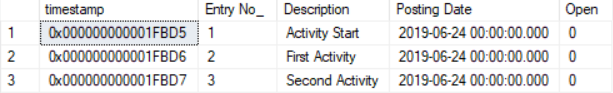

# 第八章：安装和升级扩展

获取扩展的安装状态是一个四步过程：发布、同步、升级（如果需要）、安装。在本章中，我们将详细讲解这些步骤。

安装一个简单的或甚至复杂的扩展，可能比其维护要简单得多，即使是最复杂的代码组件。扩展的维护是通过扩展的升级过程完成的。可能需要进行升级，原因包括引入新功能、修复漏洞，或在 SaaS 环境中，通常是由于基础应用的依赖关系发生了变化。

在本章中，我们将探讨基础扩展安装和复杂依赖关系升级，帮助 AL 开发人员更好地理解如何检查他们的`SaaSified`私有知识产权。

由于 Dynamics 365 Business Central 在线产品每月大约进行一次持续的升级，因此它是一个不断变化和演化的产品。因此，合作伙伴和客户应该准备好升级他们的扩展，以应对平台和应用程序的每月更新。

在本章中，你将学习如何执行以下操作：

+   在在线沙箱和生产环境中部署扩展

+   检查已发布、已同步和已安装扩展的状态

+   处理安装代码单元

+   通过升级代码单元处理破坏性更改

+   定义应用程序依赖关系

+   处理一个简单的升级场景

+   升级带有依赖关系的扩展

# 部署扩展

就像在任何其他编程语言中一样，术语非常重要。明确理解和区分扩展的不同部署阶段和状态，对于针对适当的故障排除非常关键，必要时进行相应的处理。

根据开发生命周期和部署情况，扩展分为两类：

+   **每租户扩展（PTE）**：这类似于老式的定制开发，为每个客户量身定制。开发通常在包含生产配置和数据副本的沙箱环境中进行。CSP 合作伙伴和/或其经销商与客户共同管理开发和部署生命周期。

    尽管从历史上看，这是本地部署 ERP 开发中最常见的场景，但我们鼓励合作伙伴创建自己的标准扩展，通过 Dynamics 365 Business Central Marketplace 进行部署和/或销售。

+   **AppSource 扩展**：这些扩展发布在 AppSource 上，其目的是供任何/所有租户在特定系统上使用，通过官方的 Dynamics Marketplace 获取。AppSource 扩展在被批准并作为全球（全球）可用于生产租户部署之前，必须经过严格的技术和市场验证流程。

    与 PTE 不同，AppSource 认证的扩展已经由 Microsoft 发布在每个应用程序数据库中，随时可以按需为每个租户安装。这使得扩展的部署过程更快速、更可靠、更专业。

PTE 可以通过两种方式进行部署：

+   自动

+   手动

让我们在这里看看这两种部署方式。

# 自动

在 Visual Studio Code 中，你需要设置`launch.json`来针对特定的目标沙盒租户环境（`"tenant": ""`）工作，并提供适当的凭证来建立连接。

由于你可能在同一环境中有多个沙盒，你还可以指定你希望连接的租户，以便下载符号和/或发布扩展（`"sandboxName": ""`）。

在在线生产环境中这是不可能的，只能在沙盒中进行。这仅适用于 PTE。通过这种方式部署的 PTE 通常被称为开发者扩展，因为它们只能针对开发者沙盒进行部署。

默认情况下，部署是通过对现有架构应用同步来执行的（`"schemaUpdateMode": "Synchronize"`）。因此，默认选项有助于保留数据，以防开发者做出的一些更改不涉及破坏性更改。然而，也可以完全清理任何先前的扩展部署，并从头开始进行部署（`"schemaUpdateMode": "Recreate"`），甚至强制同步（`"schemaUpdateMode": "ForceSync"`），以保证快速部署并进一步测试扩展。

ForceSync 必须小心使用，并应尽可能避免。即使它加快了部署和测试速度，它也无法在需要升级代码单元作业的生产环境中工作。有时候，懒惰的开发者可能会使用 ForceSync，并忘记在生产环境中处理适当的升级和同步。

# 手动

典型的生产部署是手动进行的。从 2019 年 4 月的更新开始，在在线沙盒中也可以进行部署，具体如下：

1.  连接到你的生产或沙盒租户。

1.  搜索（*Alt* + *Q*）进入扩展管理页面。

1.  在扩展管理页面中，点击管理操作组（如果需要，可以将其固定），选择上传扩展，然后选择你开发的扩展（`.app`）。下图显示了上传和部署页面：


在截图中，我们可以看到，Deploy to 参数非常重要，因为它触发平台何时需要部署扩展。

通过指定当前版本，部署会立即执行，扩展会尝试进行同步。开发人员可以检查任务是否成功完成，或者在部署状态页面中查看是否有失败的错误。

选择下一个次要版本或下一个主要版本将推迟部署，直到下一个次要或主要更新发生时。

若想了解更多有关此主题的信息，请访问 [`demiliani.com/2019/04/29/dynamics-365-business-central-and-per-tenant-extensions-check-page-control-names-between-platform-upgrades/`](https://demiliani.com/2019/04/29/dynamics-365-business-central-and-per-tenant-extensions-check-page-control-names-between-platform-upgrades/)。

# 一些部署提示

开发人员必须牢牢记住，Dynamics 365 Business Central 是一个多租户环境，声明了以下范式：

+   应用程序和数据是解耦的，并存储在不同的数据库中。

+   单个应用数据库，与应用服务绑定，可以为数百个租户（客户数据数据库）提供服务。这是多租户一对多概念的支柱。

+   在应用程序中，数据库存储为扩展清单（存储扩展定义的记录，定义以`app.json`文件中的形式出现）。

+   在与应用数据库绑定的服务中挂载并同步租户，会将这些扩展暴露给租户。

+   租户扩展随后可以由用户选择进行安装。

每当发生次要更新（通常为每月更新）或主要更新（通常为每六个月更新）时，扩展将会被卸载。随后，租户将从旧的应用服务中卸载，并挂载到与新应用版本绑定的另一个应用服务中。

即使新的应用服务尚未发布 PTE，租户结构及其数据也会完全保留。

每当此操作发生时，开发人员只需要重新发布并安装扩展，以重新同步所有内容。正如前面提到的，这适用于所有在线沙箱。

部署在生产环境中的 PTE 具有更广泛的作用域，扩展会自动移植到新的应用服务中。在这种情况下，如果选择将扩展与下一个次要/主要版本一起部署，当升级发生时，将会触发安装新扩展。

若想深入了解此主题，请访问 [`demiliani.com/2019/01/24/dynamics-365-business-central-tenant-upgrade-extensions-disappeared-in-sandbox-environment/`](https://demiliani.com/2019/01/24/dynamics-365-business-central-tenant-upgrade-extensions-disappeared-in-sandbox-environment/)。

PTE 必须保持在整个生态系统中的唯一性，开发人员不应违反这一原则。PTE 或任何扩展的一般唯一性由以下值的组合定义，在`app.json`文件中：

+   **包 ID**：每次扩展构建时分配给.app 文件的新 GUID（*Ctrl* + *Shift* + *B*）。

+   **应用 ID**：定义扩展的唯一 GUID。

+   **名称**

+   **发布者**

+   **版本**：以`x.x.x.x`的形式表示。

只要更改其中一个值，该扩展就被视为新扩展。如果开发人员考虑重用 PTE 用于另一个客户租户，则必须处理此独特性模式。

尝试在另一个租户中部署完全相同的 PTE，甚至在重新构建包后再次部署，可能会导致失败，并显示类似于此处所示的错误：


在这种情况下，可能只需增加应用程序版本（bump）即可使部署顺利进行。

如果这发生在 PTE 从未安装过的租户中，则根本原因可能是在同一应用程序服务中存在重复项。为解决此问题，开发人员必须更改应用程序 ID 和名称，并重新部署以成功安装 PTE。

深入了解此问题，请访问 [`demiliani.com/2019/03/14/dynamics-365-business-central-online-sandbox-makes-you-crazy-maybe-remember-these-points/`](https://demiliani.com/2019/03/14/dynamics-365-business-central-online-sandbox-makes-you-crazy-maybe-remember-these-points/)。

部署扩展时可能会出现另外两个错误消息。这些是：

+   由于租户 `<Tenant` Id> 已经使用其它版本，因此无法安装扩展 `<name>` by `<publisher>`。

+   应用程序扩展与应用程序 ID `'<Extension Id>'` 已配置为全局租户使用。

第一个错误是因为尝试发布具有与系统中另一个 Per tenant 扩展相同的应用程序 ID 和版本参数，但可能内容不同。解决此错误的最简单方法是增加扩展的版本。

第二个错误是因为尝试使用与分配给 AppSource 扩展或标准 Microsoft 拥有的扩展相同的 ID 来上传 Per tenant 扩展。在这种情况下，解决方案非常简单：更改扩展 ID 并重新发布。

在下一节中，我们将看到在部署扩展时在幕后发生了什么。

# 部署在幕后进行

在在线沙箱中部署任何类型的扩展意味着以下情况：

+   该扩展发布在特定的应用程序服务中，具有特定的应用程序版本。

+   相同的扩展已在沙箱租户中同步（Azure SQL 数据库结构与对象元数据定义相匹配）并安装。

扩展部署可以总结为四个阶段：

+   **发布**: 扩展已上传到应用程序数据库中，在发布过程中将其挂载到参考租户。在租户数据库中的表的物理结构没有任何更改。

    发布意味着声明对象内容（元数据）和需要特定租户按需应用的数据库结构更改。这些内容和相关更改由 AL 对象（例如表、页面和页面扩展）定义。

+   **同步**：发布的内容可能会直接传输到租户（例如页面或代码单元），或者它们可能需要对租户数据结构进行额外的操作（例如表或表扩展）。同步过程中的最重要步骤是对基础数据库进行更改，通常是根据 AL 对象定义的表结构。这一步是创建表或在租户数据库中添加或修改新字段的步骤。

+   **数据升级**：如果应用程序版本发生更改，则在同步后必须进行数据升级。在运行数据升级时，应用程序将搜索升级代码单元并执行其中的代码。

    当你需要处理破坏性更改时（例如更改字段的数据类型），或者当你正在增强已经部署的现有扩展功能时，通常需要进行数据升级。

+   **安装**：当元数据更改和数据升级成功完成后，租户中一切就绪，用户可以提供所有功能。此最后操作将扩展的状态更改为“已安装”，应用程序已经扩展并准备好与新功能一起使用。

为了在原型现实开发场景中演示这些阶段，让我们创建一个简单的扩展，并使用 Docker 容器环境仔细检查背后的过程。

在我们编写本文时，Dynamics 365 Business Central 2019 春季版是最新的可用版本，因此，以下内容基于该主要版本。

我们有一个 PowerShell 脚本，将执行以下活动：

+   安装或更新`NavContainerHelper`库到最新版本。

+   提示你提供一个用于容器内部的用户名和密码。

+   使用最新版本的 Dynamics 365 Business Central 生成一个 Docker 容器化沙盒并更新。

+   在桌面上创建一个与容器同名的文件夹，并将所有由`New-NAVContainer` cmdlet 创建的相关快捷方式移动到该文件夹中。

脚本如下所示：

```
#Set local variables
####################
$imageName = "mcr.microsoft.com/businesscentral/sandbox:1904" 
$containerName = "BC14MTW1" 
$createDirectory = $true #move shortcuts into a directory
$checkHelper = $true #install navcontainerhelper
#Install or update NavContainerHelper
#####################################
Clear-Host
if ($checkHelper)
{
Write-Host 'Installing navcontainerhelper module, please wait...'
install-module navcontainerhelper -force
      Write-Host 'Checking navcontainerhelper module updates, please wait...'
   update-module navcontainerhelper -force
   Get-InstalledModule navcontainerhelper | Format-List -Property name, version   
}
#Create a new container  
#######################
New-NavContainer -accept_eula `
           -containerName $containerName `
           -useBestContainerOS `
           -imageName $imageName `
           -auth NavUserPassword `
           -alwaysPull `
           -updateHosts `
           -licenseFile $mylicense `
           -assignPremiumPlan `
           -doNotExportObjectsToText `
           -multitenant `
           -includeCSide
#Create a desktop directory and move all the shortcuts  
######################################################
if ($createDirectory)
{
    $desktop = [System.Environment]::GetFolderPath('Desktop')
    New-Item -Path $desktop -Name $containerName -ItemType 'directory' -Force
    Get-ChildItem $desktop -Filter "$containerName*" -File | Move-Item -Destination "$desktop\$containerName"
    $code = @'
[System.Runtime.InteropServices.DllImport("Shell32.dll")]
private static extern int SHChangeNotify(int eventId, int flags, IntPtr item1, IntPtr item2);
public static void Refresh()  {
 SHChangeNotify(0x8000000, 0x1000, IntPtr.Zero, IntPtr.Zero);   
}
'@
    Add-Type -MemberDefinition $code -Namespace WinAPI -Name Explorer
    [WinAPI.Explorer]::Refresh()
}
```

运行脚本后，桌面上应该会出现一个名为`BC14MTW1`的新目录，里面有六个快捷方式，具体如下：


通过运行 SQL Server Management Studio（SSMS - 参见 [`docs.microsoft.com/en-us/sql/ssms/download-sql-server-management-studio-ssms?view=sql-server-2017`](https://docs.microsoft.com/en-us/sql/ssms/download-sql-server-management-studio-ssms?view=sql-server-2017)），我们可以使用 SQL Server 身份验证连接到容器中的 BC14MTW1\SQLEXPRESS 服务器。以下截图显示了 BC14MTW1\SQLEXPRESS 实例中的数据库列表：


值得注意的是，在多租户 Docker 容器化环境中有三个分配的数据库：

+   CRONUS：这是一个应用程序数据库，包含所有管理应用程序对象所需的系统表（如对象和对象元数据），这些对象是通过客户租户共享的。

+   default 和 tenant：default 是挂载到 CRONUS 应用程序上的沙盒，tenant 只是 default 的一个卸载副本。

在这个环境中，我们将重点关注以下部署：

+   主要扩展，其中包含一个新表和一个表扩展

+   依赖于主要扩展的第二个扩展

+   包含破坏性更改（影响架构同步的更改）的主要扩展的新版本

+   这是第二个扩展的新版本，用于应对主要扩展的破坏性更改。

理解如何执行上述部署对于掌握简单和复杂的扩展部署至关重要。

要从这个多租户、内部部署的、容器化的 Docker 环境中下载符号，我们将使用以下 `launch.json` 文件参数：

```
{
 "version": "0.2.0",
 "configurations": [
 {
 "type": "al",
 "request": "launch",
 "name": "Your own server",
 "server": "http://BC14MTW1",
 "serverInstance": "NAV",
 "authentication": "UserPassword",
 "tenant": "default"
 }
 ]
}
```

使用这个非常简单的脚本，我们创建了自己的 Docker 容器化多租户环境，以模拟一个沙盒 SaaS 部署。我们现在准备好开始我们的扩展部署之旅，并分析数据库级别和应用程序中的发生情况。

# 部署主要扩展

为了简化，我们将创建一个全新的表（`Tab50105.NewTable.al`），并在其中添加一些字段：

```
table 50105 "NewTable"
{
    DataClassification = ToBeClassified;
   fields
     {
        field(1;"Entry No."; Integer)
        {
          DataClassification = ToBeClassified;
        }
        field(2;"Description"; Text [30] )
        {
           DataClassification = ToBeClassified;
        }
        field(3; "Posting Date"; Date) 
        {
           DataClassification = ToBeClassified;  
        }
        field(4; "Open"; Boolean)
        {
          DataClassification = ToBeClassified;  
        }
     }
      keys
      {
         key(PK; "Entry No.")
          { 
             Clustered = true;
          }
      }
}
```

然后，我们创建一个表扩展（`Tab-Ext50105.NewTableExtension.al`），它扩展了标准的 `Item` 表，并添加了一个名为 `Catalogue No***.***` 的新字段：

```
tableextension 50105 "New Table Extension" extends Item
{
   fields
      {
       field(50105;"Catalogue No.";Integer)
          {
             DataClassification = ToBeClassified;  
          }
      }
}
```

这将是扩展的第一个版本，清单文件（`app.json`）中包含以下参数，这些参数定义了扩展：

```
  "id": "15ecd2e5-b7a8-4612-ae6f-d722af29c0c0",
  "name": "MainExtension",
  "publisher": "DTacconi Inc.",
  "version": "1.0.0.0",
```

通常（但不是强制的），扩展使用一个特殊的代码单元，称为安装代码单元。安装代码单元通过 `Subtype = Install` 定义，并且每次安装扩展时都会触发它的执行。它的主要目的是在安装过程中配置扩展，通过在设置表中创建记录或用默认值填充表来实现。

在下面的代码示例中，我们将设计一个安装代码单元（`Cod50100.MainExtensionInstall.al`）：

1.  我们首先在新表中创建一条记录：

```
codeunit 50100 "MainExtensionInstall"
{
    Subtype = Install;

    trigger OnInstallAppPerCompany();
    var
        NewTable : Record NewTable;
    begin       
        if NewTable.IsEmpty() then
          InsertDefaultValues();
    end;

    local procedure InsertDefaultValues();
    begin
        InsertValue(1,'Activity Start',TODAY,false);
        InsertValue(2,'First Activity',TODAY,false);
        InsertValue(3,'Second Activity',TODAY,false);
    end;

    local procedure InsertValue(EntryNo : Integer; Desc : Text[30]; PostingDate : 
    Date; isOpen : Boolean);
    var
        NewTable : Record NewTable;
    begin
        NewTable.Init();
        NewTable."Entry No." := EntryNo;
        NewTable.Description := Desc;
        NewTable."Posting Date" := PostingDate;
        NewTable.Open := isOpen;
        NewTable.Insert();
    end;
}
```

由于你可以随意安装和卸载扩展，无论多少次，关键是检查`NewTable.IsEmpty()`是否仅在第一次安装时执行此操作。该代码片段将确保仅在需要时填充表格中的一些默认值。

卸载一个扩展时，使用 Dynamics 365 Business Central SaaS 将始终在保留数据的情况下进行。数据不会被清除，而只是变得不可见，当扩展卸载时，数据不会被删除。重新安装扩展时，旧的保存数据将会恢复。云计算范式是在所有方面保持保守，任何数据都不会在后台被删除。

1.  在构建扩展（*Ctrl* + *Shift* + *B*）之后，我们准备好使用以下 PowerShell 命令序列部署应用文件，这些命令包含在`NavContainerHelper` PowerShell 库中：

    +   `Publish-BCContainerApp`

    +   `Sync-BCContainerApp`

    +   `Start-BCContainerAppDataUpgrade`

    +   `Install-BCContainerApp`

1.  每执行一个 PowerShell 命令，我们将检查与扩展部署、同步和升级机制相关的系统表中的内容。我们将通过以下简单的 T-SQL 脚本来执行，方法是将`DECLARE`部分中的`[Name]`和`[Version Major]`替换为适当的扩展名称和主版本号：

```
-- Application database
USE "CRONUS"
GO

DECLARE @PackageID uniqueidentifier
SELECT @PackageID = NavApp.[Package ID]
FROM [CRONUS].[dbo].[NAV App] NavApp
WHERE (([Name] = 'MainExtension') and ([Version Major] = 1))

SELECT * FROM [NAV App] WHERE [Package ID] = @PackageID
SELECT * FROM [NAV App Dependencies] WHERE [Package ID] = @PackageID
SELECT * FROM [NAV App Object Metadata] WHERE [App Package ID] = @PackageID
SELECT * FROM [NAV App Object Prerequisites] WHERE [Package ID] = @PackageID 
SELECT * FROM [NAV App Publish Reference] WHERE [App Package ID] = @PackageID
SELECT * FROM [NAV App Resource] WHERE [Package ID] = @PackageID
SELECT * FROM [NAV App Tenant App] WHERE [App Package ID] = @PackageID

-- Tenant database
USE "default"
GO

DECLARE @AppID uniqueidentifier
DECLARE @PackageID uniqueidentifier
SELECT @AppID = NavApp.ID, @PackageID = NavApp.[Package ID]
FROM [CRONUS].[dbo].[NAV App] NavApp
WHERE (([Name] = 'MainExtension') and ([Version Major] = 1))

SELECT * FROM [$ndo$navappschemasnapshot] WHERE appid = @AppID
SELECT * FROM [$ndo$navappschematracking] WHERE appid = @AppID
SELECT * FROM [$ndo$navappuninstalledapp] WHERE appid = @AppID
SELECT * FROM [NAV App Data Archive] WHERE [App ID] = @AppID
SELECT * FROM [NAV App Installed App] WHERE ([App ID] = @AppID) and ([Package ID] = @PackageID)
SELECT * FROM [NAV App Published App] WHERE ([App ID] = @AppID) and ([Package ID] = @PackageID)
SELECT * FROM [NAV App Setting] WHERE [App ID] = @AppID
SELECT * FROM [NAV App Tenant Add-In] WHERE [App ID] = @AppID
```

1.  接下来，你将在以下代码中看到，发布操作将在`[NAV App]`表中声明扩展清单，并在应用程序数据库（称为`CRONUS`）中声明其包 ID 和应用程序 ID：

```
Publish-BCContainerApp -containerName 'BC14MTW1' `
    -appFile 'C:\TEMP\UPGRADE\MainExtension\DTacconi Inc._MainExtension_1.0.0.0.app' `
    -skipVerification
```

`Publish-BCContainerApp`脚本的源代码可以在此找到：[`github.com/Microsoft/navcontainerhelper/blob/master/AppHandling/Publish-NavContainerApp.ps1`](https://github.com/Microsoft/navcontainerhelper/blob/master/AppHandling/Publish-NavContainerApp.ps1)

然后，扩展中包含的对象会被提取并填充到应用程序数据库中的`[NAV App Object Metadata]`表中。

一个元数据记录也会在`[NAV App Resource]`表中创建，并包含权限对象。

在此阶段，租户数据库（名为`default`）中不会执行任何操作。以下截图显示了主扩展发布后相关查询结果的片段：


1.  在发布主扩展之后，我们需要同步其内容，并根据需要将元数据更改应用到数据库结构中。请参考以下代码：

```
Sync-BCContainerApp -containerName 'BC14MTW1' `
    -tenant 'default' `
    -appName 'MainExtension' `
    -Mode Add
```

`Sync.BCContainerApp`脚本的源代码可以在此找到：[`github.com/microsoft/navcontainerhelper/blob/master/AppHandling/Sync-NavContainerApp.ps1`](https://github.com/microsoft/navcontainerhelper/blob/master/AppHandling/Sync-NavContainerApp.ps1)。

此操作将同步应用数据库（在此示例中为 CRONUS）中主扩展的扩展元数据内容到特定挂载的租户（在此示例中为默认租户）。实际上，它将在租户`[$ndo$navappschemasnapshot]`表中为每个影响数据库层级架构更改的对象（如表和/或表扩展）创建记录。

1.  在`[$ndo$navappschematracking]`表中还会创建一条记录，用于将快照表中的对象与扩展 ID、名称、发布者和版本相关联。以下截图显示了主应用程序同步后相关查询结果片段：


当扩展同步完成后，下一步是执行数据升级，如果需要的话。请考虑以下代码：

```
Start-BCContainerAppDataUpgrade -containerName 'BC14MTW1' `
    -tenant 'default' `
    -appName 'MainExtension' `
    -appVersion '1.0.0.0'
```

`Start-BCContainerAppDataUpgrade`脚本的源代码可以在这里找到：[`github.com/microsoft/navcontainerhelper/blob/master/AppHandling/Start-NavContainerAppDataUpgrade.ps1`](https://github.com/microsoft/navcontainerhelper/blob/master/AppHandling/Start-NavContainerAppDataUpgrade.ps1)。

1.  如果你现在运行数据升级，这不会有任何效果，因为没有先前的扩展可供升级。PowerShell cmdlet 将返回如下所示的错误：

```
"Cannot upgrade the extension 'MainExtension by DTacconi Inc. 1.0.0.0' because no previous version was found."
```

1.  最后一步是安装扩展：

```
Install-BCContainerApp -containerName 'BC14MTW1' `
-tenant 'default' `
-appName 'MainExtension' `
-appVersion '1.0.0.0'
```

`Install-BCContainerApp`脚本的源代码可以在这里找到：[`github.com/microsoft/navcontainerhelper/blob/master/AppHandling/Install-NavContainerApp.ps1`](https://github.com/microsoft/navcontainerhelper/blob/master/AppHandling/Install-NavContainerApp.ps1)。

在安装任务期间，会在应用数据库`[NAV App Tenant App]`表中插入一条记录，以报告并链接租户 ID（在此示例中为`default`）和应用包 ID。在租户数据库中也会反映这一点，其中在`[NAV App Installed App]`表中插入一条记录，报告包 ID 和应用 ID。

在此阶段，应用数据库和租户数据库之间的同步机制已完成，元数据结构的更改也已应用到 SQL Server 数据库结构中。

在此示例中，你将会在租户数据库中找到以下内容：

+   一个名为`$item$<appID>`的新表，其中包含新的字段`Catalogue No.`。

+   一个名为`$NewTable$<appID>`的新表，包含为该表在 AL 表对象中定义的所有相关字段。

以下截图展示了在安装过程中创建的两个新表的概览：


安装过程还执行了安装代码单元中的代码，在此示例中，它将`New Table`填充了三条记录。你可以通过运行以下代码轻松检查表中的内容：

```
SELECT * FROM [My Company$NewTable$15ecd2e5-b7a8-4612-ae6f-d722af29c0c0]
```

结果输出如下：



现在主扩展已经安装，让我们继续在示例中创建并部署另一个依赖于主扩展声明的对象的扩展。

# 部署依赖扩展

对主扩展的依赖关系在`app.json`文件中声明：

```
"id": "6d527590-711f-410c-b233-d267d192b13b",
"name": "SecondExtension",
"publisher": "DTacconi Inc.",
"version": "1.0.0.0",
"dependencies": [
    {
    "appId": "15ecd2e5-b7a8-4612-ae6f-d722af29c0c0",
    "name": "MainExtension",
    "publisher": "DTacconi Inc.",
    "version": "1.0.0.0"
    }
],
```

在前面的代码中，我们可以看到依赖项必须定义四个参数：应用程序 ID、名称、发布者和版本。如果我们想定义一个独特的扩展目标，这些参数是必须的。

一旦在`app.json`文件中定义了依赖关系，就必须从租户下载适当的符号。要执行此操作，只需运行命令面板（*Ctrl* + *Shift* + *P*），然后选择 AL：下载符号。

为了简化，我们将创建第二个扩展，如下所示：

1.  第二个扩展将仅包含一个页面扩展对象，该对象基于与主扩展一起实现的表扩展字段（`Pag-Ext50115.NewTablePageExtension.al`）。因此，第二个扩展必须声明对主扩展的依赖关系。请参考以下代码：

```
pageextension 50115 "New Table Page Extension" extends "Item Card"
{
    layout
    {
        addafter(Description)
        {
            field("Catalogue No.";"Catalogue No.")
            {
                ApplicationArea = All;
            }
        }
    }   
}
```

1.  现在我们准备好使用以下 PowerShell 代码片段发布第二个扩展：

```
Publish-BCContainerApp -containerName 'BC14MTW1' `
    -appFile 'C:\TEMP\UPGRADE\SecondExtension\DTacconi Inc._SecondExtension_1.0.0.0.app' `
    -skipVerification
```

1.  与主扩展类似，发布操作将在`[NAV App]`表中声明扩展清单，且扩展中包含的对象将提取到应用程序数据库中的`[NAV App Object Metadata]`表。

1.  在`[NAV App Resource]`表中也会创建一条类型为元数据的记录。

1.  相比于先前的扩展，显著的变化是在`[NAV App Dependencies]`表中新增了一条记录，将第二个扩展包 ID 与主扩展的应用程序 ID、名称、发布者和版本关联起来。以下截图显示了相关的查询结果片段，依赖的应用程序发布后：


不执行任何操作，因此租户数据库中没有任何变化。

1.  发布后，我们需要同步第二个扩展：

```
Sync-BCContainerApp -containerName 'BC14MTW1' `
    -tenant 'default' `
    -appName 'SecondExtension' `
    -Mode Add
```

此操作将同步第二个扩展在应用程序数据库中的元数据内容，与特定挂载的租户进行同步。在这种情况下，由于扩展中只有一个页面对象且没有其他内容，因此在租户数据库中的 NAV 应用架构快照表中不会创建记录。

然而，将会在`[$ndo$navappschematracking]`表中创建一条记录，用于将快照表中的扩展对象与扩展 ID、名称、发布者和版本关联起来，无论是否有需要跟踪的对象。以下截图显示了主应用程序同步后相关查询结果的片段：


1.  在同步第二个扩展后，我们可以检查是否有需要升级的数据。然后，我们可以使用以下 PowerShell 脚本：

```
Start-BCContainerAppDataUpgrade -containerName 'BC14MTW1' `
    -tenant 'default' `
    -appName 'SecondExtension' `
    -appVersion '1.0.0.0'
```

与主扩展一样，将会抛出一个错误，表示没有内容可升级。

1.  最后一步是安装第二个扩展：

```
Install-BCContainerApp -containerName 'BC14MTW1' `
-tenant 'default' `
-appName 'SecondExtension' `
-appVersion '1.0.0.0'
```

在这种情况下，它将是一个超级快速的任务，因为我们没有任何会导致架构更改的对象（我们在第二个扩展中只有一个页面扩展）。

一条记录会插入到应用程序数据库的`[NAV App Tenant App]`表中，用于报告并链接租户 ID 和应用包 ID，同样的记录会插入到租户数据库的`[NAV App Installed App]`表中，报告包 ID 和应用 ID。

一切准备就绪，可以在我们的解决方案中工作（即，两个相互依赖的扩展的组合），在`BC14MTW1`文件夹中，只需运行`BC14MTW1 Web Client`快捷方式。

在提供访问凭证并创建 30 天的试用版之后，前往项目列表，创建三个名为 ITEM1、ITEM2 和 ITEM3 的项目，或者您喜欢的任何名称，并分别将它们的 Catalogue No.赋值为`111`、`222`和`333`。以下截图显示了项目卡片：


这将确保我们现在有一些数据可以进行升级，如下一节所要求的。

# 部署主扩展的新版本

为了简化起见，我们将创建主扩展的第二个版本，其中一个字段，`Catalogue No.`，将其数据类型从整数更改为`text 30`。这是一个数据类型转换，构成数据架构中的破坏性更改。然后，第二个版本的扩展必须处理以下内容：

+   **增加（提高）扩展版本**：按如下方式更改`app.json`文件中的版本字段：

```
     "version": "2.0.0.0",
```

+   **表或表扩展对象的更改**：我们应该将原始的`Catalogue No.`字段声明为`ObsoleteState`属性设置为`Removed`（有关`ObsoleteState`的定义及其用法概述，请访问[`docs.microsoft.com/en-us/dyn`](https://docs.microsoft.com/en-us/dynamics365/business-central/dev-itpro/developer/properties/devenv-obsoletestate-property)[amics365/business-central/dev-itpro/developer/properties/devenv-obsoletestate-propert](https://docs.microsoft.com/en-us/dynamics365/business-central/dev-itpro/developer/properties/devenv-obsoletestate-property)**[y](https://docs.microsoft.com/en-us/dynamics365/business-central/dev-itpro/developer/properties/devenv-obsoletestate-property)**)。我们还应该声明一个全新的字段，数据类型为`text 30`，并将其`Caption`设置为与`Catalogue No.`字段相同，以便实现平滑过渡。以下代码展示了这一点：

```
tableextension 50105 "New Table Extension" extends Item
{
    fields
    {
        field(50105;"Catalogue No.";Integer)
        {
            DataClassification = ToBeClassified; 
            ObsoleteState = Removed;
        }
        field(50106;NewCatalogueNo;Text[30])
        {
            CaptionML=ENU='Catalogue No. 2';
            DataClassification = ToBeClassified; 
        }
    }
}
```

+   **安装代码单元的更改**：如果在初始安装阶段有一些代码引用了`Catalogue No.`并预填充值，这些需要根据新的数据类型在安装代码单元中进行更改。我们的示例中没有这种情况，但在实际场景中可能会遇到。

+   **升级代码单元**：表或表扩展对象中声明的代码更改可能涉及数据处理。现在需要一个全新的代码单元，并将`Subtype`属性设置为`Upgrade`，以处理从旧字段到新字段的数据迁移。

要了解更多关于升级代码单元的信息，请查看在线文档：[`docs.microsoft.com/en-us/dynamics365/business-central/dev-itpro/developer/devenv-upgrading-extensions`](https://docs.microsoft.com/en-us/dynamics365/business-central/dev-itpro/developer/devenv-upgrading-extensions)。

在这个代码单元内的特定函数中，可以编写升级代码，检查是否已安装特定版本的扩展，并根据此信息执行可操作的任务。所有这些信息都可以通过在升级代码单元中使用`NavApp`和`ModuleInfo`数据类型的组合来获取。

这将使得升级代码单元变得非常强大和灵活。

在我们的案例中，我们将检索当前安装版本的信息（`NavApp.GetCurrentModuleInfo(Module)`），并将`Catalogue No.`字段的现有整数值转换为以`C`为前缀的文本。请参考以下代码：

```
codeunit 50105 "Upgrade Catalogue No."
{
    Subtype = Upgrade;

    trigger OnUpgradePerCompany();
    var
        ItemRec : Record Item;
        Module : ModuleInfo;
    begin

        NavApp.GetCurrentModuleInfo(Module);

        if (Module.DataVersion.Major = 1) then begin
            ItemRec.Reset();
            IF ItemRec.FindSet(true,false) then repeat
              if (ItemRec."Catalogue No." > 0) THEN begin
                ItemRec.NewCatalogueNo := 'C' +
                  FORMAT(ItemRec."Catalogue No.");
                ItemRec.Modify(true);
              end;
            until ItemRec.Next() = 0;           
        end;
    end;
}
```

我们现在能够发布主扩展的新版本：

```
Publish-BCContainerApp -containerName 'BC14MTW1' `
-appFile 'C:\TEMP\UPGRADE\MainExtensionV2\DTacconi Inc._MainExtension_2.0.0.0.app' `
-skipVerification
```

版本 2 的扩展清单将加载到`[NAV App]`表中，扩展中包含的对象将提取到应用程序数据库中的`[NAV App Object Metadata]`表中。同时，在`[NAV App Resource]`表中也会创建一个元数据记录。以下截图显示了在发布新版本主扩展后相关查询结果的片段：


不会对租户数据库执行任何操作。

让我们使用以下 PowerShell 代码同步主扩展的新版本：

```
Sync-BCContainerApp -containerName 'BC14MTW1' `
-tenant 'default' `
-appName 'MainExtension' `
-appVersion '2.0.0.0' `
-Mode Add
```

对于每个影响数据库级别架构更改的对象，都会在租户的`[$ndo$navappschemasnapshot]`表中创建记录。

在`[$ndo$navappschematracking]`表中创建的记录已被更新，以关联快照表中的对象与扩展 ID、名称、发布者和新版本。该记录将`version`字段更新为 2.0.0.0，并将`baselineversion`字段更改为`1.0.0.0`。

这是应用元数据更改的关键阶段。我们可以通过 SSMS 运行一个简单的查询，如下所示：

```
SELECT * FROM [default].[dbo].[My Company$Item$15ecd2e5-b7a8-4612-ae6f-d722af29c0c0]
```

上述查询将显示新的`NewCatalogueNo`字段已经创建。以下截图显示了查询在扩展项表中的结果：


值得注意的是，用户仍然能够无缝地继续工作，且不会遇到任何问题，可以继续给旧的`Catalogue No.`字段赋值。

部署主扩展 2.x 版本的下一步是执行数据升级：

```
Start-BCContainerAppDataUpgrade -containerName 'BC14MTW1' `
    -tenant 'default' `
    -appName 'MainExtension' `
    -appVersion '2.0.0.0'
```

上一步在数据库层级同步了元数据结构，并创建了新字段，同时保持旧字段的值不变。

正是在这一步，所有的升级操作发生，数据被迁移到新字段中。再次运行以下查询：

```
SELECT * FROM [default].[dbo].[My Company$Item$15ecd2e5-b7a8-4612-ae6f-d722af29c0c0]
```

你会注意到，`NewCatalogueNo`中的值已根据升级的代码单元代码进行了更新。以下截图展示了在扩展的商品表中运行查询的结果：


应用数据库中`[NAV App Tenant App]`表格中记录了租户 ID 和应用包 ID 的关联，这些记录也会更新为版本 2 的包 ID。这一点也会通过更新租户数据库中`[NAV App Installed App]`表格中的相关记录，反映出版本 2 的新包 ID。

在这个阶段，依赖扩展会被破坏，因为它绑定到了一个实际上已被标记为删除的字段；因此，与旧的`Catalogue No.`字段相关的页面文本框控件将不再在客户端显示。下图展示了主扩展升级到新版本后，Item 卡片的一部分：


最后一步是检查在使用以下 PowerShell 语句安装扩展时是否有变化：

```
Install-BCContainerApp -containerName 'BC14MTW1' `
-tenant 'default' `
-appName 'MainExtension' `
-appVersion '2.0.0.0'
```

在这种情况下，没有执行任何操作，因为扩展已经安装，只是升级到了另一个版本。

然后，在运行 PowerShell cmdlet 时，我们应该收到以下消息：

```
"WARNING: Cannot install extension MainExtension by DTacconi Inc. 2.0.0.0 for the tenant default because it is already installed."
```

接下来，我们来看一下如何部署到新的独立版本。

# 部署依赖扩展的新版本

在对主扩展进行数据升级到新版本后，我们看到依赖扩展已经被破坏。在这个阶段，至关重要的是让用户从客户端读取或更新新的`NewCatalogueNo.`字段。

首先，我们必须将依赖扩展的`app.json`版本提升到 2.0.0.0，并更新对主扩展适当版本的依赖。请参阅以下更新的代码片段：

```
"version": "2.0.0.0",
"dependencies": [
    {
        "appId": "15ecd2e5-b7a8-4612-ae6f-d722af29c0c0",
        "name": "MainExtension",
        "publisher": "DTacconi Inc.",
        "version": "2.0.0.0"
    }
],
```

更新`app.json`文件后，我们必须从我们的多租户环境中下载新的符号，以确保它们适当设置。下载符号后，`.alpackages`目录中的内容结果如下截图所示。这展示了构建依赖扩展新版本所需的符号列表：


更新后的页面扩展对象将会正确地引用新的`NewCatalogueNo`字段：

```
pageextension 50115 "New Table Page Extension" extends "Item Card"
{
    layout
    {
        addafter(Description)
        {
            field(NewCatalogueNo;NewCatalogueNo)
            {
                ApplicationArea = All;
            }
        }
    }   
}
```

然后，我们可以使用以下脚本发布第二个扩展的新版本：

```
Publish-BCContainerApp -containerName 'BC14MTW1' `
-appFile 'C:\TEMP\UPGRADE\DependentExtensionV2\DTacconi Inc._SecondExtension_2.0.0.0.app' `
-skipVerification
```

与主扩展版本 2 一样，清单将加载到`[NAV App]`表中，扩展中包含的对象会被提取到应用程序数据库中的`[NAV App Object Metadata]`表中。同时，在`[NAV App Resource]`表中也会创建一个元数据记录，并且在`[NAV App Dependency]`表中也会创建一个记录，反映第二个扩展版本 2 对主扩展版本 2 的依赖关系。

在租户数据库中没有执行任何操作。

然后，我们应该使用以下 PowerShell 脚本在租户中同步应用程序：

```
Sync-BCContainerApp -containerName 'BC14MTW1' `
    -tenant 'default' `
    -appName 'SecondExtension' `
    -appVersion '2.0.0.0' `
    -Mode Add
```

一旦运行同步，原始记录（在`[$ndo$navappschematracking]`表中创建的）将被更新，以便将快照表中的对象与扩展 ID、名称、发布者和新版本相关联。

依赖扩展的`version`字段将为`2.0.0.0`，而`baselineversion`字段保持为`1.0.0.0`。以下截图显示了在同步了新版本的依赖扩展后查询的结果：


如果我们现在停止，我们将处于一个混合的半部署状态，其中新版本的模式同步已经启用，但已安装的版本仍然是旧版本。

现在是时候开始为第二个扩展进行数据升级了。请看下面的简单脚本：

```
Start-BCContainerAppDataUpgrade -containerName 'BC14MTW1' `
    -tenant 'default' `
    -appName 'SecondExtension' `
    -appVersion '2.0.0.0'
```

应用程序数据库中`[NAV App Tenant App]`表中的记录，该记录将租户 ID 和应用程序包 ID 关联起来，将被更新为新版本的包 ID。租户数据库中也发生了同样的事情，通过更新`[NAV App Installed App]`表中的相关记录为新版本的包 ID。

此时，依赖扩展是一致的，新的页面扩展用于读取和更新`NewCatalogueNo`字段。以下截图显示了在升级到新版本的依赖扩展后的商品卡：


仅为了在四个部署阶段中保持一致，我们还可以执行安装语句：

```
Install-BCContainerApp -containerName 'BC14MTW1' `
-tenant 'default' `
-appName 'SecondExtension' `
-appVersion '2.0.0.0'
```

说这很简单，我们会收到以下信息：

```
"WARNING: Cannot install extension SecondExtension by DTacconi Inc. 2.0.0.0 for the tenant default because it is already installed."
```

这就结束了我们简单扩展的生命周期，该扩展涵盖了复杂的升级场景。剩下的部分作为练习交给你，手动在在线 Dynamics 365 Business Central 生产环境中部署所有四个扩展，并查看是否有任何不同。

最终，你可以过滤出已经部署到线上扩展，并且你可能会注意到，你会在扩展管理列表中找到它们：两个已安装（版本 2）和两个未安装（版本 1）。以下截图解释了这一情况：


处理安装和升级操作是你需要处理应用程序的两个重要步骤。特别是如果你想在不丢失数据的情况下升级扩展，升级是必须的。

# 总结

在本章中，我们详细了解了针对 Dynamics 365 Business Central 沙箱或生产环境部署扩展的各种选项。我们还详细介绍了扩展部署的四个阶段：发布、同步、数据升级和安装。

本章结束了开发部分，现在你已经准备好开始在实际项目中使用扩展（你知道如何创建扩展、如何部署它们以及如何扩展它们）。

在下一章，我们将开始一个全新的部分，讨论调试和测试扩展。最后一章将涉及源代码管理及其生命周期。
