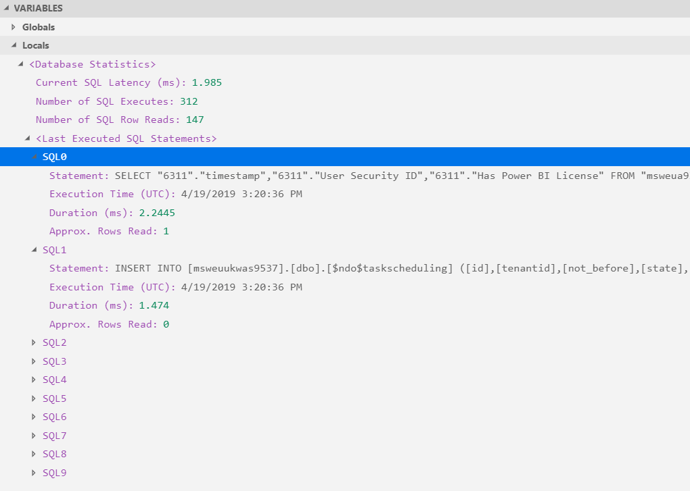

# 第九章：调试

Dynamics 365 Business Central AL 语言扩展提供了一个调试器，帮助开发者检查、修正或修改代码，以确保自定义扩展能够成功构建、顺利部署并按预期运行。

追踪潜在逻辑错误的另一种方式是编写测试单元代码，但这将是另一个章节的内容。现在，我们将看到如何轻松调试扩展并为报告创建测试。

本章将涵盖以下主题：

+   以调试模式运行 AL 语言扩展

+   定义特定的不可调试函数或变量

+   掌握调试器和代码编辑器问题（*调试调试器*）

+   与代码分析器一起工作

+   使用事件记录器跟踪事件可用性信息

# 以调试模式运行

调试的基本概念是 *断点*，它是你可以在语句上设置的标记。当程序执行到该语句时，调试器会被触发并暂停执行（从技术上讲，它会中断），直到指示继续执行。如果没有断点，只要调试器处于活动状态，代码就会正常运行。

调试器仅在遇到错误时，或在 `launch.json` 文件中指示在记录更改时停止代码执行。

开发者还可以使用调试器来查找潜在的逻辑错误，因为调试器使他们能够一次执行一条 AL 代码语句，同时检查每个运行步骤中变量的内容。通过这种方式，开发者可以在设计应用扩展时检查并匹配预期的结果。

您可以通过三种方式从 Visual Studio Code 运行调试器：

+   点击调试 | 开始调试。

+   按下 *F5* 快捷键。

+   转到 DEBUG 视图（*Ctrl* + *Shift* + *D*），并按下顶部栏中的绿色右箭头。顶部栏还会显示 `launch.json` 文件中指定的调试会话名称。如果点击齿轮图标，将打开该文件。最右边的图标启用并显示调试控制台，通常会显示上下文调试信息。以下截图展示了调试器顶部栏：


这些操作将导致构建你的扩展（相当于 *Ctrl* + *Shift* + *B*），如果这还没有完成，然后将扩展发布到目标在线沙箱租户中。

自从 Dynamics 365 Business Central 2019 春季版发布以来，现在可以在不需要反复构建和发布扩展的情况下运行调试会话。这有助于减少调试周期并提高开发生产力。要尝试此功能，只需在 Visual Studio Code 中按 *Ctrl* + *Shift* + *F5*，或者运行命令面板（*Ctrl* + *P*），并搜索 `AL: Debug without publishing`。

`launch.json` 文件包含一些影响调试行为及其目标的元素。以下是它们及其作用的列表：

+   `BreakOnError`：指定当遇到错误时，调试器是否应停止。

+   `BreakOnRecordWrite`：指定调试器是否应在记录更改时停止（通常是记录创建或更新）。

+   `Tenant`：指定**Azure Active Directory**（**AAD**）租户，用于创建调试会话。

+   `SandboxName`：自 2019 年 4 月更新以来，可以拥有多个沙箱租户。此参数允许开发人员指定要连接调试会话的沙箱名称。

此外，`app.json`文件包含一个对于调试器作用于特定扩展代码至关重要的参数：`ShowMyCode`。

如果你发布并调试该扩展，且没有显式设置此值，它将作为隐式设置为`true`进行工作。

然而，如果需要调试来自其他扩展的代码（以及不同的 Visual Studio Code 会话），由于`ShowMyCode`的默认值是`false`，必须明确声明该参数并将其设置为`true`。

在处理`ShowMyCode`参数时需要小心，因为它不仅允许你调试代码，还使用户能够下载扩展的源代码。此参数启用或禁用客户端扩展管理菜单中的下载源代码操作。

# Visual Studio Code 调试器区域

DEBUG 视图提供了多个部分和输出窗口，用于逐步检查当前执行的内容、变量分配状态以及代码流程。此外，自 Dynamics 365 Business Central 2019 春季版发布以来，还可以通过收集最长运行的数据库查询来获得代码性能的某些见解。

请参考以下截图：


调试器基本上分为四个区域：侧边栏、工具栏、编辑器和输出窗口。编辑器窗口会高亮显示当前代码停止的位置，通常用黄色标记。调试控制台则显示调试信息，位于输出窗口部分。

接下来我们将分别查看这些区域。

# 调试器侧边栏

侧边栏默认启用，位于调试器的左侧。可以与编辑器交换位置（右键点击其中一个区域并选择“移动侧边栏到右侧”），隐藏它（*Ctrl* + *B*），或者仅隐藏某些区域（右键点击其中一个区域并取消勾选需要隐藏的区域）。

侧边栏分为四个区域，用于提供与当前代码流相关的信息。我们将在这里逐一介绍它们。

# 变量

VARIABLES 部分提供了全局和局部变量分配的概览：


在本地变量（Locals）部分，还可以检查与代码执行相关的性能计数器：



特别地，可以测量以下内容：

+   当前 SQL 延迟（毫秒）：当调试器命中断点时，Dynamics 365 Business Central Server 服务将向 Azure SQL 数据库发送一个探测 SQL 语句，并跟踪接收答复的时间。此信息对了解租户的沙箱节点是否具有健康的延迟或是否存在基础设施问题非常有帮助。

+   SQL 执行次数：自调试器启动以来会话中执行的 SQL 语句的总次数。

+   SQL 行读取数量：自调试器启动以来读取的数据库行的总数。

+   前 10 个长时间运行的查询：展开“最近执行的 SQL 语句”部分，你可以观察到最多 10 条 SQL Server 语句条目（编号从 0 到 9）。这些语句表示自会话启动以来至第一次命中断点的 10 个执行时长最久的查询。这些由以下元素定义：

    +   **语句**：已执行的 T-SQL 语句。

    +   **执行时间（UTC）**：定义 SQL 语句执行时间的时间戳。

    +   **持续时间（毫秒）**：SQL 语句的总执行时间。若在开发扩展时缺少索引，这一点非常有用。

    +   **读取的行数**：显示 SQL 语句读取的近似行数。在开发扩展时查找缺失的过滤器时，这可能非常有用。

# 观察

*观察*部分用于在调试时监视特定感兴趣的变量。可以在`变量`窗口中或在调试时在代码编辑器中右键单击要观察的变量名称，这将显示被观察变量的值。在此窗口中，还可以将要监视的变量名称插入到调试时的观察列表中。

# 调用堆栈

变量值和表达式评估相对于选定的堆栈帧。这将报告一个按执行顺序降序排列的对象级联/堆栈。

# 断点

这显示了可启用、禁用或随意重新应用的可用断点列表。可以通过单击左侧边距或按下*F9*在选定行中切换断点。显示在编辑器边距中的断点显示为红色实心圆。禁用的断点为灰色实心圆。

无法分配给调试器会话中的任何代码的断点显示为灰色空心圆。

# 调试器工具栏

工具栏包含暂停、停止、重启或控制调试过程的命令。以下截图展示了调试器工具栏：


可执行的操作如下：

+   继续 (*F5*)。

+   暂停 (*F6*)。

+   重启 (*Shift* + *F11*)：由绿色圆形箭头表示。

+   停止（*Shift* + *F5*）：由红色方块表示：调试器工具栏命令允许您继续（*F5*）进程，直到结束。通过这种方式，开发人员可以继续其迭代过程并在不启动新的 Web 客户端调试会话的情况下重新开始操作。该过程还可以被暂停（*F6*）——调试会话仍然存在；重新启动（*Shift* + *F11*）——它将创建一个新的调试会话；或彻底停止（*Shift* + *F5*）——调试会话被关闭。

+   步过（*F10*）：所有语句逐个执行。如果使用此命令，当遇到函数调用时，函数将被执行而不进入该函数的调试步骤。如果在其被指示跳过的函数中有断点，调试器仍会在该断点处中断。

+   步入（*F11*）：所有语句逐个执行。如果使用此命令，当遇到函数调用时，调试器将逐步执行该函数的所有指令。

+   跳出（*Shift* + *F11*）：它会跳过当前函数并进入下一个函数。

# 附加模式调试

随着 Dynamics 365 Business Central 2019 年 10 月更新，引入了调试功能，不仅可以通过启动新的调试会话进行调试，还可以通过将调试器附加到应用程序创建的下一个新会话来进行调试。

该功能当前有一些限制，以下表格说明了其支持场景：

| **部署类型** | **Web 客户端** | **Web 服务** | **后台会话** |
| --- | --- | --- | --- |
| 本地部署 | 支持 | 支持 | 支持 |
| 在线沙箱 | 不支持 | 支持 | 不支持 |

要启用附加过程，必须在扩展的 `launch.json` 文件中添加一个新的配置参数。

需要指定的关键参数如下：

+   `"request": "attach"`：在典型的调试场景中，此参数默认值为 `launch`。

+   `"breakOnNext" : "WebServiceClient"`：在在线沙箱中，唯一允许的选项是 `"WebServiceClient"`，而在本地和基于 Docker 的沙箱中，也可以将调试器附加到 `"WebClient"` 或 `"Background"` 会话。

要了解更多关于如何附加调试器的信息，请访问 [`demiliani.com/2019/10/25/dynamics-365-business-central-debugging-the-base-application/`](https://demiliani.com/2019/10/25/dynamics-365-business-central-debugging-the-base-application/)。

# 不可调试项

通常，开发人员希望在每个扩展代码行上都能进行完整的调试体验。在某些情况下，某些特定的变量或函数不应显示其当前值。这些情况通常与存储私人信息的变量或返回私密值（如用户密码或许可证检查）的函数相关。

在开发扩展时，有一个特殊的属性可以与函数和/或变量一起使用，阻止它们被处理（调试器无法逐步进入它们）或在调试器中不可见（变量和/或函数输出值不显示）。在函数或变量声明之前编写`[NonDebuggable]`语句意味着它们不可检查，并且无法在其上设置断点。

在第七章中创建的`报告 50111 项总账分录分析`，*AL 报告开发*，在`OnPreReport`触发器中的第一条语句`if includeLogo then begin`处添加一个断点，如下所示：


然后，再次发布扩展（*F5*）。

当客户端加载时，搜索`packt report`，当`项总账分录分析`报告记录显示时，点击它，选择在请求页面中包含徽标，然后点击预览。

调试器将在刚刚添加的`OnPreReport`断点处准确停止。

现在，按*F11*两次，将代码执行移到运行`公司信息`表中的`Get`语句：


如果你在调试器活动窗格中展开**变量**部分，你可能会注意到可以展开`公司信息`（命名为`CompanyInfo`）记录，并且可以看到它的所有值：


停止调试器（*Shift* + *F5*），并在`公司信息`全局变量之前添加非调试属性，如下所示：

```
...
  var
        [NonDebuggable]
        CompanyInfo: Record "Company Information";
        includeLogo: Boolean;
...
```

再次发布扩展（*F5*）。

当客户端加载时，搜索`packt report`并执行与之前相同的操作来预览报告：调试器会再次在相同位置停止。

按*F11*两次，将代码执行移到运行`公司信息`表中的`Get`语句，并检索记录数据。现在，如果你展开**变量**部分，你可能会注意到`公司信息`记录甚至没有显示：


在代码编辑器中，将鼠标悬停在任何`CompanyInfo`语句上，将会显示`<Out of Scope>`消息，这是由于运行时操作中存在`[NonDebuggable]`属性。

# 精通调试器问题

在一些实际应用场景中，可能会出现某些原因导致调试器无法启动，并且会在输出窗口中报告未处理的错误消息；或者你可能只是需要跟踪调试器服务进程。换句话说，你可能需要调试调试器。毕竟，调试器也是另一种软件工具。

若要获得更多的调试信息和详细诊断，有一个未记录的功能，你需要通过在`settings.json`文件中输入特定的参数来启用它：

```
"al.editorServicesLogLevel": "Debug".
```

一旦启用，你需要重新启动 Visual Studio Code，以便使更改在整个应用程序中生效。

此参数将指示 AL 语言扩展在以下目录`C:\Users\<USER>\.vscode\extensions\ms-dynamics-smb.al-3.0.121490\bin`中为代码编辑器(`EditorServices.log`)和调试器(`DebuggerServices.log`)创建详细的日志活动。

`ms-dynamics-smb.al-3.0.121490`表示在当前 Visual Studio Code 会话中注册的 AL 语言扩展的名称和版本。

以下是调试器服务的活动日志片段，显示其处理过程：

```
...
04/19/2019 16:53:15 [/6] Process:
launch 04/19/2019 16:53:24 [/14] Process:
setBreakpoints 04/19/2019 16:53:24 [/14] Parsing Report 50111 "Item Ledger Entry Analysis". 04/19/2019 16:53:25 [/14] Parsing Codeunit 50100 "Customer Category Mgt_PKT". 04/19/2019 16:53:25 [/14] Parsing Page 50100 "Customer Category List_PKT". ...
```

在下一部分，我们将看到如何在使用 AL 进行开发时使用代码分析器。

# 了解代码分析器

AL 语言的主动调试体验通过代码分析器得到了极大的增强。代码分析器是标准 AL 语言扩展的一部分，是一组应用于扩展开发的上下文规则。这些规则在开发扩展时可以生成错误或警告。

代码分析器可以随时在每个工作区和全局范围内启用或禁用。

要启用代码分析器，请执行以下步骤：

转到文件|首选项|设置（工作区设置）|扩展|AL 语言扩展，并选择编辑`settings.json`文件。

您也可以选择通过选择用户设置来编辑`settings.json`文件。然而，由于您可能会在同一环境中开发每租户扩展和 AppSource 应用程序，因此在每个工作区启用这些功能比在每个用户设置中启用更为合理。

在`settings.json`文件中，可以指定以下参数：

```
al.enableCodeAnalysis (default: false)
```

将此参数更改为`true`时，将启用在 JSON 数组参数`al.codeAnalyzers`中指定的分析器。如果没有指定分析器，或者没有`al.codeAnalyzers`条目，则假定启用所有分析器。

# al.codeAnalyzers[]

`al.codeAnalyzers[]`参数表示一个代码分析器数组。目前，支持的值及其官方链接，按 ID 排序如下：

+   `"${AppSourceCop}"`：在开发面向 AppSource 市场的应用程序时，必须启用此项。要了解更多信息，请访问[`docs.microsoft.com/en-us/dynamics365/business-central/dev-itpro/developer/analyzers/appsourcecop`](https://docs.microsoft.com/en-us/dynamics365/business-central/dev-itpro/developer/analyzers/appsourcecop)。

+   `"${CodeCop}"`：此项加强了标准 AL 语言开发指南，建议在每种开发目标中启用。要了解更多信息，请访问[`docs.microsoft.com/en-us/dynamics365/business-central/dev-itpro/developer/analyzers/codecop`](https://docs.microsoft.com/en-us/dynamics365/business-central/dev-itpro/developer/analyzers/codecop)。

+   `"${PerTenantExtensionCop}"`：与`CodeCop`一起，应该在每个在线开发目标上启用，除非是在为 AppSource 市场开发扩展，此时应使用`AppSourceCop`。欲了解更多信息，请访问[`docs.microsoft.com/en-us/dynamics365/business-central/dev-itpro/developer/analyzers/pertenantextensioncop`](https://docs.microsoft.com/en-us/dynamics365/business-central/dev-itpro/developer/analyzers/pertenantextensioncop)。

+   `"${UICop}"`：这是代码分析器的最新添加项，它检查代码是否符合现代客户端支持的功能，并避免出现用户界面的限制。欲了解更多信息，请访问[`docs.microsoft.com/en-us/dynamics365/business-central/dev-itpro/developer/analyzers/uicop`](https://docs.microsoft.com/en-us/dynamics365/business-central/dev-itpro/developer/analyzers/uicop)。

# al.ruleSetPath

这是一个规则集文件的路径，文件中包含通过标准代码分析器提供的规则变更。

规则集文件采用 JSON 表示法，并引用了一个在标准 AL 语言扩展中实现的现有规则集项 ID。这个文件通常用于重新定义规则在特定扩展项目或工作区中的重要性。

如果我们在所创建的示例扩展项目中实现代码分析器，它将帮助我们获取更多关于代码风格的信息，以及是否有改进之处。让我们通过更改`workspace`设置中的`settings.json`文件来启用相关的分析器：

```
{
    "al.enableCodeAnalysis": true,
    "al.codeAnalyzers": [
        "${CodeCop}",
        "${PerTenantExtensionCop}",
        "${UICop}"
    ]
}
```

在“问题”窗口中，现在可能会有许多包含错误、警告和信息的记录。如果只考虑与`Report 50111 ItemLedgerEntryAnalysis.al`相关的记录，应该会有一个错误、两个警告和一条有用的信息。请看下面的截图：


看看错误信息，问题很明显：`includeLogo`列定义没有定义其`ApplicationArea`属性。因此，它在应用程序中将不可见，因为`ApplicationArea`属性必须显式声明。

只需点击“问题”窗口中的错误行，即标记为 ID AL(PTE0008)的那一行。此操作会将光标聚焦在代码编辑器中的`includeLogo`字段定义上。

为请求页面中的`includelogo`列添加`ApplicationArea`属性，如下所示：

```
field(includeLogo;includeLogo)
{
Caption = 'Include company logo';
ApplicationArea = All;
}
```

你可能会注意到，“问题”窗口中的错误突然消失了。而且，报告在“问题”窗口中的对象堆栈中向下移动了：


这种情况发生是因为问题记录堆栈按优先级降序排列，因此包含错误的`Table 50103 Packt Extension Setup`被移到对象列表的顶部，首先进行审核，而警告和信息则排在其后。

规则的重要性值可以通过创建一个 JSON 文件来随意更改，该文件包含需要更改的规则 ID，以及根据公司开发规则如何设置它们。

在扩展的主文件夹中创建一个名为`.ruleset`的目录，并创建一个名为`demo.ruleset.json`的文件：


打开`demo.ruleset.json`，并调用`truleset`标准代码片段，编写以下内容：

```
{
    "name": "PacktDemoExtensionRuleSet",
    "description": "Rule Set for Packt Demo Extension (PTE)",
    "rules": [
        {
            "id": "AA0008",
            "action": "Hidden",
            "justification": "Open and Close parenthesis warning is kept hidden"
        }
    ]
}
```

这样，我们希望指示 AL 语言代码分析器避免为 ID 为`AA008`的规则在问题窗口中添加警告记录。逐字翻译，该规则是<q>"函数调用应该有括号，即使没有参数。"</q>

使其生效的最后一步是将`.alRuleSetPath`参数指向新创建的文件：

```
{
  "al.enableCodeAnalysis": true,
    "al.codeAnalyzers": [
        "${CodeCop}",
        "${PerTenantExtensionCop}",
       "${UICop}"
    ],
   "al.ruleSetPath": "./.ruleset/demo.ruleset.json"
}
```

当你为规则集文件分配路径时，建议保存所有文件并关闭并重新打开 Visual Studio Code，以确保没有权限错误，并且当前进程能够访问规则集文件。

一旦规则集文件到位，PROBLEMS 窗口中不应再出现与打开和关闭括号相关的警告，问题中显示的记录数应该会减少。可以通过以下方式查看：


仍然有 19 个元素需要评估，以便符合 AL 最佳编码实践。此阶段的要点是，他们应该在自己的公司中充分利用这些规则，并讨论需要提升、保持现状或完全关闭的规则。

启用代码分析器时要小心，因为它们可能会增加开发机器的内存消耗（RAM）。

我们在这里展示了如何通过激活 AL 代码分析器来提高代码质量。在下一部分，我们将看到如何在使用 Dynamics 365 Business Central 开发扩展时使用*事件记录器*。

# 理解事件记录器

我们都知道，Dynamics 365 Business Central 的在线开发只能通过扩展进行。访问代码库的可扩展性通过订阅标准事件发布者来保证。

考虑到应用程序中有数千个标准事件发布者，并且随着每次在线更新，这个数字还在增加，找到一个合适的地方来挂接标准发布者有时就像是试图在大海捞针一样困难。

查找适当的订阅入口点的推荐方法是使用事件记录器。

如果您不了解标准对象是什么，或者没有访问第三方源代码的权限（以查看发布者定义，假设您订阅的代码是第三方扩展或私有知识产权的一部分），那么这个应用功能是必须的。

有两种方式启用此功能：

+   从 Visual Studio Code：打开定义了合适沙盒连接的扩展源代码项目，在`launch.json`文件中。运行命令面板（*Ctrl* + *Shift* + *P*），然后选择 AL: 打开事件记录器。

+   连接到您的生产或沙盒租户，并搜索 `Event Recorder`：事件记录器页面提供了一个非常简单的操作菜单，名为 **记录事件**，具有“开始”和“停止”按钮。

只需按下“开始”，事件记录器将被激活并准备跟踪代码处理流程。

需要明确理解的是，事件记录器会捕获代码执行的所有内容；因此，建议您采取以下其中一种措施：

+   在一个浏览器标签页中转到事件记录器页面（我们称之为 TAB 1），然后创建一个新标签页（TAB 2），在其中浏览到您希望开始记录事件的页面。然后，在 TAB 1 中启动事件记录器，并开始在 TAB 2 中执行所需的操作，以跟踪业务流程。当完成时，返回 TAB 1 停止事件记录器。

+   浏览到您希望开始记录事件的页面（TAB 1），然后在新标签页（TAB 2）中转到事件记录器页面并启动它。返回 TAB 1，执行需要跟踪流程的操作，完成后，在 TAB 2 停止事件记录。

页面将刷新并按代码执行顺序显示插入临时表中的记录，如下所示：


事件记录器正在运行

由于这些记录存储在临时表中，它们在内存中是易失的，并且不会存储在数据库中。现在，您已经拥有了在业务过程中触发的所有事件的完整列表，从这里您可以找到适合自定义的正确入口点。

# 摘要

在本章中，我们已经学习了如何运行调试器并掌握其界面。我们还看到了如何固定不可调试的函数和变量，以避免在需要时显示私人数据。我们还检查了许多有用的标准功能，这些功能让我们的调试和开发工作变得更轻松：代码分析器和事件记录器。

现在，您已经准备好调试扩展、检查事件并分析您的 AL 代码。

在本章中，我们还展示了如何在检查代码流程时捕获运行时错误。在下一章中，我们将掌握如何通过开发自动化测试来检测应用代码中的逻辑问题（漏洞）。
