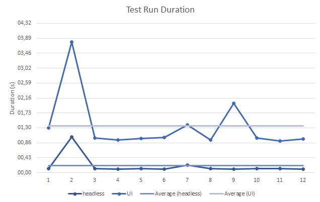
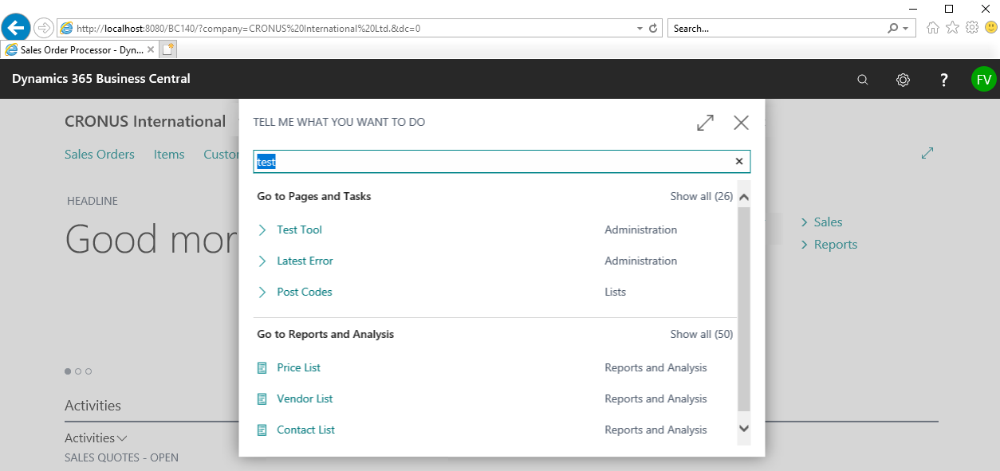
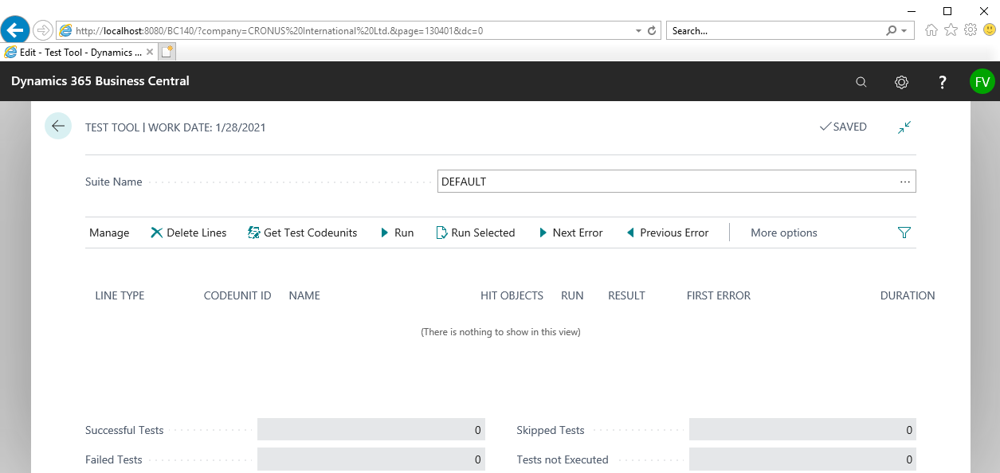
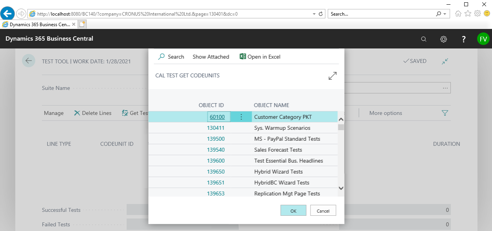
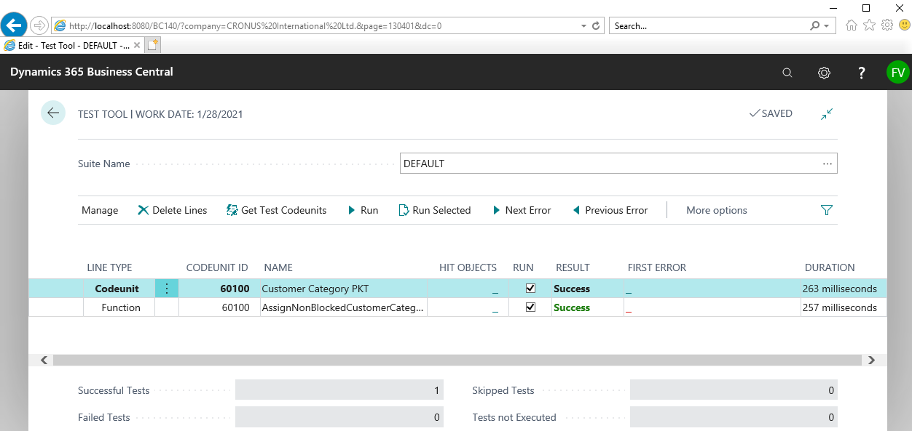
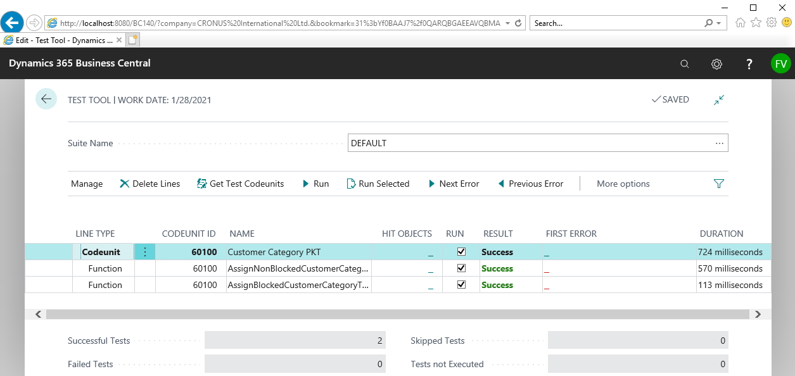
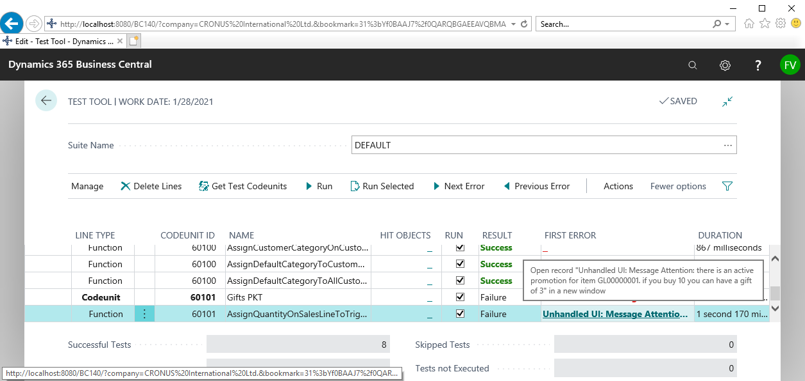

# 第十章：使用 AL 进行自动化测试开发

在上一章中，我们学习了如何使用 Visual Studio Code 调试 AL 扩展。

在本章中，我们将讨论如何为 AL 扩展编写自动化测试。我们需要这样做，才能拥有现代的开发生命周期，如果你想在 AppSource 上发布扩展，这也是强制要求的。

使用在第五章中开发的演示扩展，*为 Dynamics 365 Business Central 开发定制解决方案*，我们将讨论以下主题：

+   使用验收测试驱动开发模式设计测试

+   设置测试扩展

+   测试代码背后的技术

+   实现测试代码

# 测试自动化和测试设计原则

应用程序测试并不是火箭科学，自动化应用程序测试也不是。它只是另一种可以学习的技能。然而，从开发人员的角度来看，你需要转变思维方式，编写与通常不同目的的代码。大家都知道，开发人员不应该测试自己的代码，因为他们无论有意还是无意，都知道如何使用软件并规避问题。他们编写代码是为了让某个功能工作。

然而，测试并不是关于*如何做成*，而是关于*如何让它崩溃*。但这一知识适用于手动的探索性测试，其中测试是根据知识和经验来执行的，而非脚本。而自动化测试是脚本。

要将这些脚本编写成自动化测试，我们需要开发人员。往往，进行应用程序编码的开发人员也是编写自动化测试的开发人员。

为了让开发人员能够编写自动化测试代码，他们需要提供明确定义的脚本。如果没有**设计**，就没有**测试**。这是我们在本章中的方法——我们将首先设计测试，然后展示如何编写它们。

# 使用 ATDD 设计测试

在他的书《*Microsoft Dynamics 365 Business Central 中的自动化测试*》中，Luc van Vugt 深入探讨了如何设计和实现你的测试。基于所谓的**验收测试驱动开发**（**ATDD**）方法论，他展示了如何像编写测试设计一样编写需求，使用 ATDD 模式。这种模式引入了五个标签：

+   FEATURE: 定义测试或测试用例集正在测试的功能。

+   SCENARIO: 定义单个测试的测试场景。

+   GIVEN: 定义所需的数据设置；当数据设置较为复杂时，一个测试用例可以包含多个 GIVEN 标签。

+   WHEN: 定义被测试的动作；每个测试用例应该只有一个 WHEN 标签。

+   THEN: 定义该动作的结果，或者更具体地说，定义结果的验证。如果有多个结果，可能需要多个 THEN 标签。

以下是我们客户类别功能的 ATDD 场景示例：

+   **[FEATURE]** 客户类别

+   **[SCENARIO #0002]** 将被阻止的客户类别分配给客户

+   **[给定]** 一个被阻止的客户类别

+   **[给定]** 一个客户

+   **[当]** 设置客户的客户类别

+   **[然后]** 抛出被阻止类别错误

你可以在以下网址获取 Luc 的书：

[`www.packtpub.com/automated-testing-in-microsoft-dynamics-365-business-central`](https://www.packtpub.com/automated-testing-in-microsoft-dynamics-365-business-central)。

在学习如何设计之后，我们现在来看一下如何准备环境。

# 准备环境

为了开始在你的 AL 扩展上编写自动化测试，你需要将 *Microsoft Test Framework* 导入到你的 Dynamics 365 Business Central 环境中。如果你使用的是 Dynamics 365 Business Central 本地版（独立安装），可以从产品 DVD 中导入。如果你使用的是基于 Docker 的开发沙盒，可以通过将 `-includeTestToolkit` 开关参数添加到 `New-BcContainer` cmdlet 中，使用 `navcontainerhelper` 模块自动导入测试工具包。

如果你已经有一个运行中的 Docker 容器，并且正在使用 Dynamics 365 Business Central，你可以通过以下 cmdlet 导入测试工具包：

```
Import-TestToolkitToBcContainer -containerName d365bcdev
Generate-SymbolsInNavContainer -containerName d365bcdev
```

测试工具包测试库包括以下五个应用（包含在 `C:\Applications folder` 目录下的最新 Docker 镜像中）：

+   `Microsoft_Any.app`

+   `Microsoft_Library Assert.app`

+   `Microsoft_System Application Test Library.app`

+   `Microsoft_Tests-TestLibraries.app`

+   `Microsoft_Test Runner.app`

现在你的环境已经包含了编写和执行自动化测试所需的一切。在接下来的章节中，我们将看到如何为你的扩展设置测试。

# 为扩展设置测试开发环境

如果我们采用最为严格的扩展要求（即微软认为在批准你的扩展发布到 AppSource 时是强制性的要求），应用和测试代码应该放在不同的扩展中。因此，测试扩展应依赖于应用扩展。

然而，这种分离可能会限制应用和测试代码的并行开发，因为对应用扩展的任何更改都会导致它的重新部署。这也可能导致测试扩展的更新和重新部署。

不知不觉中，你会不断地在管理扩展之间切换，从而降低开发团队的生产力。在开发过程中，最好的做法是将应用和测试代码放在同一个扩展中。一旦准备好，你可以通过自动化构建脚本或特定的合并策略拆分代码并创建两个必需的扩展。

如果你的扩展不打算发布到 AppSource，我仍然强烈建议你不要在应用扩展中发布测试代码，以防止在生产环境中运行自动化测试。

在我们演示扩展的具体案例中，由于应用代码已经完成，我们可以在一个独立的依赖扩展中设置我们的测试。在接下来的章节中，我们将看到如何在实践中操作。

# 设置我们的 Visual Studio Code 测试项目

要为我们的测试自动化设置一个新项目，请执行我们在第五章中进行的操作，*为 Dynamics 365 Business Central 开发定制化解决方案*，当时我们启动了演示扩展。确保我们的新测试项目的 `app.json` 文件已按如下所示更新：

```
{
  "id": "7737ab78-c872-4bca-b9f8-2de788818c21",
  "name": "TestPacktDemoExtension",
  "publisher": "fluxxus.nl",
  "brief": "Tests for Customer Category, Gift Campaigns and Vendor Quality Management",
  "description": "Tests for Customer Category, Gift Campaigns and Vendor Quality Management",
  "version": "1.0.0.0",
  "privacyStatement": "",
  "EULA": "",
  "help": "https://www.packtpub.com/business/automated-testing-microsoft-dynamics-365-business-central",
  "url": "http://www.fluxxus.nl",
  "logo": "./Logo/ExtLogo.png",
  "dependencies": [
    {
      "appId": "63ca2fa4-4f03-4f2b-a480-172fef340d3f",
      "publisher": "Microsoft",
      "name": "System Application",
      "version": "1.0.0.0"
    },
    {
      "appId": "437dbf0e-84ff-417a-965d-ed2bb9650972",
      "publisher": "Microsoft",
      "name": "Base Application",
      "version": "15.0.0.0"
    },
    {
      "appId": "dd03d28e-4dfe-48d9-9520-c875595362b6",
      "name": "PacktDemoExtension",
      "publisher": "SD",
      "version": "1.0.0.0"
    },
    {
      "appId": "dd0be2ea-f733-4d65-bb34-a28f4624fb14",
      "publisher": "Microsoft",
      "name": "Library Assert",
      "version": "15.0.36560.0"
    },
    {
      "appId": "e7320ebb-08b3-4406-b1ec-b4927d3e280b",
      "publisher": "Microsoft",
      "name": "Any",
      "version": "15.0.36560.0"
    },
    {
      "appId": "9856ae4f-d1a7-46ef-89bb-6ef056398228",
      "publisher": "Microsoft",
      "name": "System Application Test Library",
      "version": "15.0.36560.0"
    },
    {
      "appId": "5d86850b-0d76-4eca-bd7b-951ad998e997",
      "publisher": "Microsoft",
       "name": "Tests-TestLibraries",
       "version": "15.0.36560.0"
    }
  ],
  "screenshots": [],
  "platform": "15.0.0.0",
  "idRanges": [
  {
    "from": 60100,
    "to": 60150
  }],
  "runtime":"4.0",
  "showMyCode": true
}
```

如你所见，我们已经将扩展中的依赖项添加到测试中，并且加入了所有需要用于测试的*测试工具库*应用。

# 了解测试代码背后的技术

在我们开始编写测试之前，我们需要了解一些关于测试代码背后技术的内容，也就是所谓的**可测试性框架**。

自 NAV 2009 Service Pack 1 起，微软允许平台通过*测试函数*在*测试代码单元*中构建测试套件。当执行测试代码单元时，平台会执行以下操作：

+   运行 `OnRun` 触发器和每个测试函数，按从上到下的顺序，在测试代码单元中依次执行

+   记录每个测试函数的结果

这就是 Luc van Vugt 所称的**可测试性框架的第一支柱**。我们的第一个测试示例将实现这一点。

**第二个支柱**允许你创建所谓的*正向-负向*，或者*异常路径*测试，在这些测试中，我们测试导致失败的情况。为了实现这一点，我们使用 AL `asserterror` 关键字，该关键字应放在调用语句前，以捕获错误并使测试通过：

```
asserterror <calling statement>
```

我们的第二个场景，之前的示例中已使用，将利用这个可测试性功能。

在我们代码的各个部分，我们会与用户互动，询问他们确认某个操作，或者仅仅是显示一条消息。在自动化测试时，我们需要能够处理这些用户交互。

为此，**第三个支柱**，即**用户界面**（**UI**）*处理函数*应运而生。*处理函数*是只能在测试代码单元中创建的一种特殊类型的函数，旨在处理测试代码中存在的用户界面交互。它们使我们能够完全自动化测试，而无需真实用户的交互。我们的第三个测试示例将展示如何实现这一点。

**第四个支柱**是*测试运行器*。这是一个特定的代码单元，能够执行以下操作：

+   运行存储在多个代码单元中的测试，控制它们的执行，并收集和保护结果

+   在隔离的环境中运行，以确保写入事务最终不会改变我们运行测试时所使用的数据库，并确保每次重新运行测试时都使用相同的初始数据设置

在我们将要构建的测试中，我们将利用存储在 Dynamics 365 Business Central 中的标准测试运行器。

向平台添加可测试性框架的初始触发点是为了避免通过 UI 测试业务逻辑。因此，启用可测试性框架时是无头的，从而可以更快速地测试业务逻辑，但无法测试 UI。

继续前进时，显而易见，单独的无头测试排除了太多内容。我们如何测试通常存在于页面上的业务逻辑，例如产品配置器，在其中选项会根据用户输入的值显示或隐藏？因此，后来，微软为可测试性框架添加了**第五个支柱**：*测试页面*。

测试页面是页面的逻辑表示，并严格在内存中处理，不显示 UI。它添加了允许你编写用户行为的功能，包括访问页面及其子部分、读取和更改数据、执行操作等。第四个测试示例（在*UI 处理器 – 测试示例 4*部分）将包含一个测试页面。那么，让我们看看如何进行测试。

了解更多关于可测试性框架五个支柱的详细信息，请参阅 Luc 的书：[`www.packtpub.com/business/automated-testing-microsoft-dynamics-365-business-central`](https://www.packtpub.com/business/automated-testing-microsoft-dynamics-365-business-central)。

# 设计我们的测试场景

正如我们之前提到的，我们将在一个测试示例中演示可测试性框架的五个支柱中的四个：

+   测试代码单元和测试函数

+   `asserterror`

+   测试页面

+   UI 处理器

我们需要设计每个场景，以便能够高效有效地编写测试。这是我们在下一节中首先要做的。

在他的书中，Luc 详细展示了如何从需求到自动化测试，或者说他所称的*从客户需求到测试自动化*。

# 测试代码单元和测试函数 – 测试示例 1

由于测试代码单元和测试函数是 AL 中测试编码的基础，我们可以以任何场景作为例子。但为了简单起见，我们从演示扩展的基本需求开始：公司希望根据客户可以随时间定义的自定义类别来对客户进行分类，这些类别将来可能会发生变化。

通过添加一个名为*客户类别*的新表格，并在*客户*表中添加一个名为*客户类别代码*的新字段，已实现此功能。

在测试这个需求的基本部分时，第一个测试场景将如下：

+   **[功能]** 客户类别

+   **[场景 #0001]** 为客户分配非阻塞客户类别

+   **[给定]** 一个未被阻塞的客户类别

+   **[给定]** 一个客户

+   **[当]** 设置客户类别到客户

+   **[然后]** 客户的客户类别代码字段已填充

由于每个场景应该是自解释的，我们不会详细讨论每个标签。

# asserterror – 测试示例 2

我们可以通过前面讨论的场景，轻松地演示 asserterror 关键字的使用：

+   **[功能]** 客户类别

+   **[场景 #0002]** 将阻止的客户类别分配给客户

+   **[给定]** 一个被阻止的客户类别

+   **[给定]** 一个客户

+   **[当]** 在客户上设置客户类别

+   **[然后]** 抛出阻止类别错误

这测试了与需求中定义的客户分类功能相同的功能。然而，尽管需求中没有提到应用于*客户类别*的阻止模式，但它已在扩展中实现，当将阻止的客户类别分配给客户时会抛出错误，因此需要进行测试。

# 测试页面 – 测试示例 3

根据第五章中描述的业务需求，*为 Dynamics 365 Business Central 开发定制解决方案*，用户必须是<q>“能够创建一个默认客户类别，并自动将此默认值分配给客户。”</q>

这完美地展示了使用以下场景的测试页面：

+   **[功能]** 客户类别 UI

+   **[场景 #0007]** 从客户卡分配默认类别给客户

+   **[给定]** 一个非阻止的默认客户类别

+   **[给定]** 客户的客户类别不等于默认客户类别

+   **[当]** 在客户卡上选择分配默认类别操作

+   **[然后]** 客户拥有默认客户类别

应该注意的是，我们在 `[功能]` 标签中使用了*UI*，这表示该功能通过使用 UI 进行测试。理想情况下，测试自动化是指创建所谓的*无头*测试；即不使用 UI 的测试，因为 UI 测试比无头测试和非 UI 测试慢 5 到 10 倍。Luc 在他的书中通过以下截图展示了这一点，比较了类似的无头测试和 UI 测试：



UI 测试的平均执行时长为 1.35 秒，而无头测试的平均执行时长几乎快七倍：0.20 秒。

# UI 处理程序 – 测试示例 4

你可能已经在 GitHub 上检查了我们演示扩展的所有应用程序代码，因此你可能已经看到一些由代码触发的 UI 元素需要处理程序函数。实际上，在 `50101 GiftManagement_PKT` 代码单元的 `DoGiftCheck` 函数中只找到一个：

```
if (SalesLine.Quantity < GiftCampaign.MinimumOrderQuantity) and
    (GiftCampaign.MinimumOrderQuantity - SalesLine.Quantity <=
        PacktSetup."Gift Tolerance Qty")
then
    Message(
        GiftAlert, SalesLine."No.",
        Format(GiftCampaign.MinimumOrderQuantity),
        Format(GiftCampaign.GiftQuantity));
```

触发它并不像其他示例那么简单，因为需要满足很多条件。因此，它作为第四个也是最后一个示例出现。

如你所见，场景确实要广泛一些：

+   **[功能]** 赠品

+   **[场景 #0010]** 分配销售行的数量以触发活动促销消息

+   **[给定]** 配置了赠品容忍数量的 Packt 设置

+   **[给定]** 非阻止客户类别的客户，并且有可用的赠品

+   **[给定]** 商品

+   **[给定]** 设置了最小订单数量的商品和客户类别赠品活动

+   **[给定]** 带有商品项目行的客户销售发票

+   **[When]** 设置发票行上的数量小于最小订单数量，并且在赠品容差数量范围内。

+   **[Then]** 显示活跃的促销信息。

这里，我们已经设计好了所需的测试场景。接下来的部分，我们将看到如何有效地实现这些场景。

# 实现我们的测试场景

给定一个 ATDD 场景，我们可以通过以下四个步骤有效地实现测试代码：

1.  创建一个基于`[FEATURE]`标签命名的测试代码单元。

1.  将需求嵌入到一个基于`[SCENARIO]`标签命名的测试函数中。

1.  基于`[GIVEN]`、`[WHEN]`和`[THEN]`标签编写测试故事。

1.  构建真正的代码。

# 测试代码单元和测试函数 - 测试示例 1

让我们根据以下 ATDD 场景，按四步法进行第一个测试示例：

+   **[FEATURE]** 客户类别

+   **[SCENARIO #0001]** 将非阻止客户类别分配给客户

+   **[GIVEN]** 一个非阻止的客户类别

+   **[GIVEN]** 一个客户

+   **[WHEN]** 设置客户类别到客户

+   **[THEN]** 客户已填充客户类别代码字段。

# 创建一个测试代码单元

使用`[FEATURE]`标签并应用我们扩展的唯一后缀是我们代码单元的基本结构，结构如下所示：

```
codeunit 60100 "Customer Category PKT"
{
    // [FEATURE] Customer Category
    SubType = Test;
}
```

如你所见，测试代码单元是通过将其`SubType`设置为`Test`来定义的。

# 嵌入需求

现在，我们创建一个基于 SCENARIO 描述命名的测试函数，并将场景（`GIVEN-WHEN-THEN`部分）嵌入到该函数中。我称这种嵌入为`green`，因为它是被注释掉的`GIVEN-WHEN-THEN`语句，在你开始编写`black`部分（`.al`测试代码）之前。

看看代码单元现在变成了什么样子：

```
codeunit 60100 "Customer Category PKT"
{
    // [FEATURE] Customer Category
    SubType = Test;
    [Test]
    procedure AssignNonBlockedCustomerCategoryToCustomer()
    // [FEATURE] Customer Category
    begin
        // [SCENARIO #0001] Assign non-blocked customer category
         //                  to customer
        // [GIVEN] A non-blocked customer category
        // [GIVEN] A customer
        // [WHEN] Set customer category on customer
        // [THEN] Customer has customer category code field
         //        populated
    end;
}
```

测试函数由`[Test]`标签标识。如果忘记给一个函数添加此标签，它将变成普通函数。

# 编写测试故事

编写第一部分`black`内容时，实际上是在编写伪英语，定义测试需要达到的目标。这使得任何非技术同行都能轻松阅读测试，如果需要他们的支持，他们读取测试的门槛就远低于如果代码是技术性代码时的难度。更强的论点可能是，代码将嵌入到可重用的辅助函数中。

所以，开始吧；让我们编写`black`部分：

```
codeunit 60100 "Customer Category PKT"
{
    // [FEATURE] Customer Category
    SubType = Test;
    [Test]
    procedure AssignNonBlockedCustomerCategoryToCustomer()
    begin
        // [SCENARIO #0001] Assign non-blocked customer category
         //                  to customer
        // [GIVEN] A non-blocked customer category
        CreateNonBlockedCustomerCategory();
        // [GIVEN] A customer
        CreateCustomer();
        // [WHEN] Set customer category on customer
        SetCustomerCategoryOnCustomer();
        // [THEN] Customer category on customer
        VerifyCustomerCategoryOnCustomer();
    end;
}
```

这个`story`设置了四个辅助函数，内容将在下一步中构建。请注意，这些辅助函数的名称与它们所属标签的描述有多么接近，而且还没有定义任何参数或返回值。

# 构建真正的代码

编写测试故事让我们了解到我们需要四个辅助函数，如下所示：

+   `CreateNonBlockedCustomerCategory`

+   `CreateCustomer`

+   `SetCustomerCategoryOnCustomer`

+   `VerifyCustomerCategoryOnCustomer`

让我们构建并讨论它们。

# CreateNonBlockedCustomerCategory

`CreateNonBlockedCustomerCategory`是一个多用途的可重用辅助函数，用于创建一个伪随机的`Customer Category`记录。在稍后的阶段，我们可以将其提升为库代码单元。其实现如下：

```
local procedure CreateNonBlockedCustomerCategory(): Code[20]
var
    CustomerCategory: Record "Customer Category_PKT";
begin
    with CustomerCategory do begin
        Init();
        Validate(
            Code,
            LibraryUtility.GenerateRandomCode(FIELDNO(Code),
            Database::"Customer Category_PKT"));
        Validate(Description, Code);
        Insert();
        exit(Code);
    end;
end;
```

为了填充主键字段，我们使用标准测试库`LibraryUtility`代码单元（`131000`）中的`GenerateRandomCode`函数。`LibraryUtility`变量像 Microsoft 在他们的测试代码单元中那样被全局声明，使其在其他辅助函数中可重用。

我们可以从前面的代码中观察到以下几点：

+   伪随机意味着每当我们的测试在相同的上下文中执行时，`GenerateRandomCode`函数将产生相同的值，从而有助于测试的可重复性。

+   `Description`字段由与`Code`字段相同的值填充，因为`Description`的具体值没有意义，这样做是最有效的。

+   在辅助函数中使用`with-do`结构可以方便地将代码用于类似的目的，只需要改变记录变量（以及它引用的表），就能将代码应用到其他表上。

# CreateCustomer

使用标准库`LibrarySales`代码单元（`130509`）中的`CreateCustomer`函数，我们的`CreateCustomer`创建一个可用的客户记录，使得这个辅助函数变得非常简便。看看以下代码：

```
local procedure CreateCustomer(var Customer: record Customer)
begin
    LibrarySales.CreateCustomer(Customer);
end;
```

和`LibraryUtility`变量一样，我们将全局声明`LibrarySales`变量。

你可能会问，为什么我们创建一个只有一行语句的辅助函数。正如我们之前提到的，使用辅助函数可以让测试对非技术同事更具可读性，并且使其可重用。我们没有提到的一点是，它还使得代码更易于维护和扩展。如果我们需要更新`Library - Sales`代码单元中`CreateCustomer`函数创建的客户记录，我们只需将其添加到本地的`CreateCustomer`函数中。

# SetCustomerCategoryOnCustomer

看一下`SetLookupValueOnCustomer`的实现：

```
local procedure SetCustomerCategoryOnCustomer(
         var Customer: record Customer;
         CustomerCategoryCode: Code[10])
begin
    with Customer do begin
        Validate(
            "Customer Category Code_PKT",
            CustomerCategoryCode);
        Modify();
    end;
end;
```

在这里调用`Validate`是至关重要的。`SetLookupValueOnCustomer`不仅仅是将一个值分配给`Customer Category Code_PKT`字段，还要确保它与`Customer Category`表中现有的值进行验证。请注意，`Customer Category Code_PKT`字段的`OnValidate`触发器没有代码。

# VerifyCustomerCategoryOnCustomer

每个测试都需要验证其结果。直白地说，没有验证的测试就不是测试。对于当前的测试，我们需要验证分配给客户记录中`Customer Category Code_PKT`字段的客户类别代码确实是`Customer Category`表中创建的值。因此，我们从数据库中检索记录，并验证`Customer Category Code_PKT`字段的内容如下：

```
local procedure VerifyCustomerCategoryOnCustomer(
        CustomerNo: Code[20]; CustomerCategoryCode: Code[20])
var
    Customer: Record Customer;
    FieldOnTableTxt: Label '%1 on %2';
begin
    with Customer do begin
        Get(CustomerNo);
        Assert.AreEqual(
            CustomerCategoryCode,
            "Customer Category Code_PKT",
            StrSubstNo(
                FieldOnTableTxt,
                FieldCaption("Customer Category Code_PKT"),
                TableCaption())
        );
    end;
end;

```

为了验证预期值（第一个参数）和实际值（第二个参数）是否相等，我们使用标准库 `Assert` 代码单元（`130000`）中的 `AreEqual` 函数。当然，我们也可以使用错误系统函数构建自己的验证逻辑，而 `AreEqual` 实际上就是这样做的。请看以下代码：

```
[External] procedure AreEqual(Expected: Variant;
     Actual: Variant;Msg: Text)
 begin
     if not Equal(Expected,Actual) then
         Error(
             AreEqualFailedMsg,
             Expected,
             TypeNameOf(Expected),
             Actual,
             TypeNameOf(Actual),
             Msg)
 end;
```

通过使用 `AreEqual` 函数，我们确保在预期值和实际值不相等时，能够得到一个标准化的错误信息。随着时间的推移，当你查看任何失败测试的错误时，由于你的验证辅助函数使用了 `Assert` 库，你将能够轻松识别发生的错误类型。

完成的测试函数如下所示，已经准备好执行：

```
[Test]
procedure AssignNonBlockedCustomerCategoryToCustomer()
// [FEATURE] Customer Category
var
    Customer: Record Customer;
    CustomerCategoryCode: Code[20];
begin
    // [SCENARIO #0001] Assign non-blocked customer category to
    //                  customer
    // [GIVEN] A non-blocked customer category
    CustomerCategoryCode := CreateNonBlockedCustomerCategory();
    // [GIVEN] A customer
    CreateCustomer(Customer);
    // [WHEN] Set customer category on customer
    SetCustomerCategoryOnCustomer(Customer, CustomerCategoryCode);
    // [THEN] Customer has customer category code field populated
    VerifyCustomerCategoryOnCustomer(
        Customer."No.",
        CustomerCategoryCode);
end;
```

请注意，已经添加到测试代码单元和函数中的变量和参数。

前往本书的 GitHub 仓库查看完整的测试代码单元实现：[`github.com/PacktPublishing/Mastering-Microsoft-Dynamics-365-Business-Central`](https://github.com/PacktPublishing/Mastering-Microsoft-Dynamics-365-Business-Central)。

# 运行测试

正如人们常说的，“实践出真知”，让我们运行我们的测试。最简单且最具指导性的方法是通过应用程序中的**测试工具**。你可以通过 Dynamics 365 Business Central 中的“告诉我...”功能轻松访问测试工具：



在一个干净的数据库中，或者至少在没有使用过测试工具的数据库或公司中，测试工具的界面如下所示，显示为一个名为 DEFAULT 的套件，其中没有任何记录：



要将我们的测试添加到测试套件中，请按照以下步骤操作：

1.  选择**获取测试代码单元**操作。

1.  在弹出的对话框中，你有两个选项：

    1.  **选择测试代码单元**：这将打开一个页面，列出数据库中所有存在的测试代码单元，你可以从中选择特定的测试代码单元；选择后点击确定，这些代码单元将被添加到套件中。

    1.  **所有测试代码单元**：这将把数据库中所有现有的测试代码单元添加到测试套件中。

让我们选择第一个选项，**选择测试代码单元**。这将打开 CAL TEST GET CODEUNITS 页面。页面显示了我们刚刚创建的测试代码单元以及数据库中存在的一堆测试，主要是由于标准扩展的存在：



1.  选择测试代码单元并点击**确定**。现在，套件中会显示每个测试代码单元，在“行类型”列中显示`Codeunit`，并且与该行（并且缩进）关联的所有测试函数将在“行类型”列中显示为`Function`。

1.  要运行测试，在打开的对话框中选择**运行**操作，并选中活动代码单元和所有选项。由于在`DEFAULT`测试套件中只有一个代码单元，因此选择哪个选项无关紧要，所以点击**确定**。现在，我们的测试代码单元将会运行，每个测试都会产生`成功`结果：



如果我们选择了**活动代码单元**选项，那么只有选定的代码单元会被执行。

对于每个失败，"第一个错误"字段将显示导致失败的错误。如您所见，第一个错误是`FlowField`。如果进一步查看，会打开 CAL 测试结果窗口，显示特定测试的整个测试运行历史。

通过点击**运行**来运行测试，将调用标准测试运行器代码单元，CAL 测试运行器（130400），并确保从测试工具运行的测试会在隔离状态下执行，每个测试函数的结果将被记录。

# asserterror – 测试示例 2

如前所述，我们将使用*asserterror*来说明场景#0002：

+   **[功能]** 客户类别

+   **[场景#0002]** 将被阻止的客户类别分配给客户

+   **[给定]** 一个被阻止的客户类别

+   **[给定]** 一个客户

+   **[当]** 设置客户的客户类别

+   **[然后]** 抛出阻止类别错误

# 创建测试代码单元

与测试示例 1 共享相同的`[功能]`标签值，我们的新测试用例也将共享相同的测试代码单元，即`60100 Customer Category PKT`。

# 嵌入需求

根据之前的要求，我们需要在`60100`代码单元中创建以下新的测试函数：

```
procedure AssignBlockedCustomerCategoryToCustomer()
// [FEATURE] Customer Category
begin
    // [SCENARIO #0002] Assign blocked customer category to
    //                  customer
    // [GIVEN] A blocked customer category
    // [GIVEN] A customer
    // [WHEN] Set customer category on customer
    // [THEN] Blocked category error thrown
end;
```

# 编写测试用例

基于测试示例 1，编写测试用例并不是一个困难的练习。请查看以下代码：

```
procedure AssignBlockedCustomerCategoryToCustomer()
// [FEATURE] Customer Category
var
    Customer: Record Customer;
    CustomerCategoryCode: Code[20];
begin
    // [SCENARIO #0002] Assign blocked customer category to
    //                  customer
    // [GIVEN] A blocked customer category
    CustomerCategoryCode := CreateBlockedCustomerCategory();
    // [GIVEN] A customer
    CreateCustomer(Customer);
    // [WHEN] Set customer category on customer
    asserterror SetCustomerCategoryOnCustomer(
                    Customer,
                    CustomerCategoryCode);
    // [THEN] Blocked category error thrown
    VerifyBlockedCategoryErrorThrown();
end;
```

首先，请注意`asserterror`是如何应用的——在调用`SetCustomerCategoryOnCustomer`辅助函数之前。这确保了平台期望`SetCustomerCategoryOnCustomer`抛出一个错误。`asserterror`使得测试可以继续执行下一个语句，并且不会检查错误。因此，我们需要验证预期的错误是否确实发生。如果在`asserterror`之后没有验证特定错误，任何错误都会使测试通过。

接下来，请注意，基于测试示例 1，所需的变量已经提供。

# 构造真实的代码

如果我们重用测试示例 1 中的`CreateCustomer`和`SetCustomerCategoryOnCustomer`函数，我们只需要创建两个新的辅助函数：

+   `CreateBlockedCustomerCategory`

+   `VerifyBlockedCategoryErrorThrown`

接下来，我们将深入了解它们俩。

# CreateBlockedCustomerCategory

目标是`CreateBlockedCustomerCategory`与测试示例 1 中的`CreateNonBlockedCustomerCategory`辅助函数非常相似，因此其构造也非常简单，如下所示：

```
local procedure CreateBlockedCustomerCategory(): Code[20]
var
    CustomerCategory: Record "Customer Category_PKT";
begin
    with CustomerCategory do begin
           Get(CreateNonBlockedCustomerCategory());
           Blocked := true;
           Modify();
           exit(Code);
    end;
end;
```

# VerifyBlockedCategoryErrorThrown

之前提到过，当 `asserterror` 使测试继续执行到下一个语句时，它不会检查错误。因此，这正是此辅助函数需要做的事情，如下代码所示：

```
local procedure VerifyBlockedCategoryErrorThrown()
var
    CategoryIsBlockedTxt: Label 'This category is blocked.';
begin
    Assert.ExpectedError(CategoryIsBlockedTxt);
end;
```

# 运行测试

让我们重新部署扩展并通过选择 **操作 | 函数 | 获取测试方法** 将第二个测试添加到测试工具中。获取测试方法会通过将代码单元中的所有当前测试函数作为行添加到测试工具中来更新所选的测试代码单元。请注意，RESULT 列将被清除。现在，运行测试代码单元并查看两个测试是否都成功。

请看下一个截图，显示了测试结果：



运行测试代码单元将显示两个测试都已成功执行。

# 测试测试

我们如何验证成功是真正的成功？我们可以通过简单的方式做到这一点——通过为测试案例的验证函数提供一个不同的期望值。所以我们来做：

```
Assert.ExpectedError('Testing the test.');
```

运行第二个测试时，当前将出现失败，并显示以下错误文本：

```
*Assert.ExpectedError failed. Expected: Testing the test. Actual: This category is blocked.*
```

*实际错误*确实是应该发生的错误。完成此步骤后，我们继续测试示例 3。

# 测试页面 – 测试示例 3

我们将在下一个场景中展示如何使用测试页面：

+   **[功能]** 客户类别

+   **[场景 #0007]** 从客户卡片为客户分配默认类别

+   **[假设]** 非阻止的默认客户类别

+   **[假设]** 客户的客户类别与默认客户类别不相等

+   **[当]** 在客户卡片上选择分配默认类别操作

+   **[假设]** 客户有默认客户类别

现在你应该知道四步法中的第一步，让我们加快速度，一次性*创建*、*嵌入*和*编写*。

# 创建测试代码单元

与测试示例 1 和 2 共享相同的 `[功能]` 标签值，我们的新测试案例将共享相同的测试代码单元，即 `60100 Customer Category PKT`。

# 嵌入和编写

在已经存在的 `60100 Customer Category PKT` 代码单元中，我们嵌入了需求并编写了测试故事，这引导我们到了以下的测试功能：

```
[Test]
procedure AssignDefaultCategoryToCustomerFromCustomerCard()
// [FEATURE] Customer Category UI
var
    Customer: Record Customer;
    CustomerCategoryCode: Code[20];

begin
    // [SCENARIO #0007] Assign default category to customer from
    //                  customer card
    // [GIVEN] A non-blocked default customer category
    CustomerCategoryCode :=
        CreateNonBlockedDefaultCustomerCategory();
    // [GIVEN] A customer with customer category not equal to
    //         default customer category
    CreateCustomerWithCustomerCategoryNotEqualToDefault(Customer);
    // [WHEN] Select "Assign Default Category" action on customer
    //        card
    SelectAssignDefaultCategoryActionOnCustomerCard(
        Customer."No.");
    // [THEN] Customer has default customer category
    VerifyCustomerHasDefaultCustomerCategory(
        Customer."No.",
 CustomerCategoryCode);
end;
```

# 构建实际代码

为了使 `#0007` 场景正常工作，我们需要创建以下四个辅助函数：

+   `CreateNonBlockedDefaultCustomerCategory`

+   `CreateCustomerWithCustomerCategoryNotEqualToDefault`

+   `SelectAssignDefaultCategoryActionOnCustomerCard`

+   `VerifyCustomerHasDefaultCustomerCategory`

但是，正如你将看到的，并且在编写更多测试时你也会体会到，这些辅助函数大部分都可以通过利用之前开发的辅助函数轻松构建。

# CreateNonBlockedDefaultCustomerCategory

`CreateNonBlockedDefaultCustomerCategory` 类似于为测试示例 2 创建的 `CreateBlockedCustomerCategory` 辅助函数。我们可以使用那里使用的相同方法。看看以下代码：

```
local procedure
    CreateNonBlockedDefaultCustomerCategory(): Code[20]
var
    CustomerCategory: Record "Customer Category_PKT";
begin
    with CustomerCategory do begin
           SetRange(Default, true);
           if not FindFirst() then begin
            Get(CreateNonBlockedCustomerCategory());
            Default := true;
            Modify();
        end;
        exit(Code);
    end;
end;
```

请注意，已添加`FindFirst`构造，以确保只会添加一个默认客户类别。

# CreateCustomerWithCustomerCategoryNotEqualToDefault

调用`CreateCustomer`助手函数即可，因为创建的客户记录将会有一个空的`Customer Category Code`字段。这使得构建这个助手函数变得非常简单，正如你在以下代码中看到的：

```
local procedure
    CreateCustomerWithCustomerCategoryNotEqualToDefault(
         var Customer: Record Customer)
begin
    CreateCustomer(Customer);
end;
```

# SelectAssignDefaultCategoryActionOnCustomerCard

使用这个助手函数，我们触及了这个测试示例的核心——利用测试页面实现`#0007`，即测试用户能否将默认客户类别分配给特定客户。以下是这个助手函数的样子：

```
local procedure
    SelectAssignDefaultCategoryActionOnCustomerCard(
        CustomerNo: Code[20])
var
    CustomerCard: TestPage "Customer Card";
begin
    CustomerCard.OpenView();
    CustomerCard.GoToKey(CustomerNo);
    CustomerCard."Assign default category".Invoke();
end;
```

请注意，我没有使用`with-do`结构，以明确展示该函数中的三个语句是引用了你只能在测试页面对象上找到的方法，而不是普通页面上的方法：

+   `OpenView`：以查看模式打开测试页面

+   `GoToKey`：在数据集中查找由指定值标识的行

+   `Invoke`：在测试页面上调用一个动作

要查看所有测试页面方法的完整列表，请查看以下网址：

+   `TestPage`：[`docs.microsoft.com/en-us/dynamics365/business-central/dev-itpro/developer/methods-auto/testpage/testpage-data-type`](https://docs.microsoft.com/en-us/dynamics365/business-central/dev-itpro/developer/methods-auto/testpage/testpage-data-type)

+   `TestField`：[`docs.microsoft.com/en-us/dynamics365/business-central/dev-itpro/developer/methods-auto/testfield/testfield-data-type`](https://docs.microsoft.com/en-us/dynamics365/business-central/dev-itpro/developer/methods-auto/testfield/testfield-data-type)

+   `TestAction`：[`docs.microsoft.com/en-us/dynamics365/business-central/dev-itpro/developer/methods-auto/testaction/testaction-data-type`](https://docs.microsoft.com/en-us/dynamics365/business-central/dev-itpro/developer/methods-auto/testaction/testaction-data-type)

你可以在 Luc 的书中找到更多关于测试页面的详细信息：[`www.packtpub.com/business/automated-testing-microsoft-dynamics-365-business-central`](https://www.packtpub.com/business/automated-testing-microsoft-dynamics-365-business-central)

# VerifyCustomerHasDefaultCustomerCategory

由于默认客户类别的代码存储在测试示例 4 中的本地`CustomerCategoryCode`变量中，验证`CustomerCategoryCode`字段是否确实已经填充了默认客户类别，只需调用已存在的`VerifyCustomerCategoryOnCustomer`助手函数，正如以下代码所示：

```
local procedure
    VerifyCustomerHasDefaultCustomerCategory(
        CustomerNo: Code[20];
        DefaultCustomerCategoryCode: Code[20])
begin
    VerifyCustomerCategoryOnCustomer(
        CustomerNo,
        DefaultCustomerCategoryCode)
end;
```

# 运行测试

运行这两个测试代码单元会显示所有测试都已成功执行。

# 客户类别功能的更多示例

在本书的 GitHub 仓库中，你将找到一些关于客户类别功能的额外测试场景。去那里学习它们，看看如何重用各种辅助函数，这表明构建一个更大的测试套件通常涉及到现有元素的重用。你可能会想知道为什么测试示例没有连续编号。检查 GitHub 上的其他场景，你会明白为什么。

# UI 处理器 – 测试示例 4

为了向你展示如何实现`UI handler`函数，我们将尝试以下场景：

+   **[Feature]** 礼品

+   **[Scenario #0010]** 在销售行上分配数量以触发激活的促销消息

+   **[Given]** 设置了礼品容差数量的 Packt 设置

+   **[Given]** 具有免费礼品可用的非阻塞客户类别的客户

+   **[Given]** 商品

+   **[Given]** 为商品和客户类别设置了最小订购数量的礼品活动

+   **[Given]** 客户的销售发票，包含商品的行

+   **[When]** 设置发票行上的数量小于最小订购数量，并且在礼品容差数量范围内

+   **[Then]** 显示激活的促销消息

由于这是一个相当广泛的场景，你还将探索并学习一个相对复杂的测试代码示例。

# 创建一个测试代码单元

通常，一个测试代码单元可以看作是一个测试套件，用于测试某个功能。由于此功能`Gifts`与前面测试示例中处理的功能不同，我们应该将此测试包含在一个新的测试代码单元中，如下所示：

```
codeunit 60101 "Gifts PKT"
{
    // [FEATURE] Gifts
    SubType = Test;
}
```

# 嵌入和编写

嵌入和编写现在将导致一个具有以下伪代码的测试函数：

```
codeunit 60101 "Gifts PKT"
{
    // [FEATURE] Gifts
    SubType = Test;

    [Test]
    procedure AssignQuantityOnSalesLineToTriggerActive
            PromotionMessage()
    // [FEATURE] Gifts
    begin
        // [SCENARIO #0010] Assign quantity on sales line
        //[GIVEN] Packt setup with "Gift Tolerance Qty" set
        CreatePacktSetupWithGiftToleranceQty();
        // [GIVEN] Customer with non-blocked customer category
        //         with "Free Gifts Available"
        CreateCustomerWithNonBlockedCustomerCategoryWith
            FreeGiftsAvailable();
        // [GIVEN] Item
        CreateItem();
        // [GIVEN] Gift campaign for item and customer category
        //          with "Minimum Order Quantity" set
        CreateGiftCampaignForItemAndCustomerCategory
            WithMinimumOrderQuantity();
        // [GIVEN] Sales invoice for customer with line for item
        CreateSalesInvoiceForCustomerWithLineForItem();
        // [WHEN] Set quantity on invoice line smaller than
        //        "Minimum Order Quantity" and within
        //        "Gift Tolerance Qty"
        SetQuantityOnInvoiceLineSmallerThanMinimumOrderQuantity
            AndWithinGiftToleranceQty();
        // [THEN] Active promotion message is displayed
        VerifyActivePromotionMessageIsDisplayed(); 
 end;
}
```

这是描述分配礼品过程的伪代码。在下一节中，我们将看到实际的实现。

请注意，由于函数名称较长，部分函数名称已被拆分并分布在两行。

# 构建真实代码

基于*书面故事*（在前一节中），我们现在需要创建以下七个辅助函数，以便有效地实现真实的测试代码：

+   `CreatePacktSetupWithGiftToleranceQty`

+   `CreateCustomerWithNonBlockedCustomerCategoryWith`

    `FreeGiftsAvailable`

+   ``` `` `CreateItem` `` ```

+   `CreateGiftCampaignForItemAndCustomerCategory`

    ``` `` `WithMinimumOrderQuantity` `` ```

+   `` `CreateSalesInvoiceForCustomerWithLineForItem` ``

+   `AssignQuantityOnInvoiceLineSmallerThanMinimumOrderQuantity`

    `AndWithinGiftToleranceQty`

+   `VerifyActivePromotionMessageIsDisplayed`

让我们跳过*真实代码*，看看几个具体细节。

# CreatePacktSetupWithGiftToleranceQty

`CreatePacktSetupWithGiftToleranceQty` 辅助函数的主要目的是在扩展设置中设置`GiftToleranceQty`，其代码如下：

```
local procedure
    CreatePacktSetupWithGiftToleranceQty(
        GiftToleranceQtySet: Decimal)
var
    PacktExtensionSetup: Record "Packt Extension Setup";
begin
    with PacktExtensionSetup do begin
        if not Get() then
            Insert();
        Validate("Gift Tolerance Qty", GiftToleranceQtySet);
        Modify();
    end;
end;
```

# CreateCustomerWithNonBlockedCustomerCategoryWithFreeGiftsAvailable 辅助函数

`CreateCustomerWithNonBlockedCustomerCategoryWithFreeGiftsAvailable` 是一个辅助函数，用于创建一个具有非阻塞客户类别设置的客户，其实现如下：

```
local procedure
    CreateCustomerWithNonBlockedCustomerCategory
        WithFreeGiftsAvailable(var Customer: record Customer)
begin
    LibrarySales.CreateCustomer(Customer);
    with Customer do begin
        Validate(
            "Customer Category Code_PKT",
            CreateNonBlockedCustomerCategory
                WithFreeGiftsAvailable());
        Modify();
    end;
end;
```

请注意，像我们之前的辅助函数`CreateCustomer`（参见测试示例 1 和 2）一样，这个测试函数也使用了标准库`LibrarySales`代码单元（`130509`）中的标准`CreateCustomer`函数。

# CreateItem

`CreateItem`是一个类似于`CreateCustomer`函数的构造，它利用标准库`LibraryInventory`代码单元（`132201`）中的`CreateItem`函数。实际上，它只是对它的封装，如以下代码所示：

```
local procedure CreateItem(var Item: Record Item)
begin
    LibraryInventory.CreateItem(Item);
end;
```

# CreateGiftCampaignForItemAndCustomerCategoryWithMinimumOrderQuantity

`CreateGiftCampaignForItemAndCustomerCategoryWithMinimumOrderQuantity`必须创建一个赠品活动记录，结合刚刚创建的项目和与新创建的客户关联的客户类别，并定义活动有效和激活的时间段。看看这些函数的样子：

```
local procedure CreateGiftCampaignForItemAndCustomerCategoryWith
    MinimumOrderQuantity(
        NewItemNo: Code[20]; NewCustomerCategoryCode: code[20];
        NewMinimumOrderQuantity: Decimal; NewGiftQuantity: Decimal)
var
    GiftCampaign: Record GiftCampaign_PKT;
begin
    with GiftCampaign do begin
        Init();
        Validate(CustomerCategoryCode, NewCustomerCategoryCode);
        Validate(ItemNo, NewItemNo);
        Validate(MinimumOrderQuantity, NewMinimumOrderQuantity);
        Validate(EndingDate, DMY2Date(31, 12, 9999));
        Validate(GiftQuantity, NewGiftQuantity);
        Insert();
    end;
end;
```

# CreateSalesInvoiceForCustomerWithLineForItem

当提供我们项目和客户的编号时，`CreateSalesInvoiceForCustomerWithLineForItem`辅助函数必须创建一个新的销售发票，其中包含一行，并利用标准库`Library - Sales`代码单元（`130509`）中的`CreateSalesDocumentWithItem`辅助函数。以下是它的实现方式：

```
local procedure CreateSalesInvoiceForCustomerWithLineForItem(
        CustomerNo: Code[20]; ItemNo: Code[20]): Code[20]
var
    SalesHeader: Record "Sales Header";
    SalesLine: Record "Sales Line";
begin
    with SalesHeader do begin
        LibrarySales.CreateSalesDocumentWithItem(
            SalesHeader,
            SalesLine,
            "Document Type"::Invoice,
            CustomerNo,
            ItemNo,
            0,
            '',
            0D);
        exit("No.");
    end;
end;
```

请注意，行上尚未设置数量，正如在调用`CreateSalesDocumentWithItem`时的第六个参数所示。`CreateSalesDocumentWithItem`的最后两个参数表示一个未定义的位置和发货日期。

# SetQuantityOnInvoiceLineSmallerThanMinimumOrderQuantityAndWithinGiftToleranceQty

这个辅助函数的主要目的是设置和验证销售发票行上的数量，以便当数量小于赠品活动中的最小订购数量，且一切都在设置中定义的赠品容差范围内时，调用`Validate`将触发消息。

看看以下代码：

```
local procedure
    SetQuantityOnInvoiceLineSmallerThanMinimumOrderQuantity
        AndWithinGiftToleranceQty(
            SalesInvoiceNo: Code[20]; NewQuantity: Decimal)
var
    SalesLine: Record "Sales Line";
begin
    with SalesLine do begin
        SetRange("Document Type", "Document Type"::Invoice);
        SetRange("Document No.", SalesInvoiceNo);
        if FindFirst() then begin
            Validate(Quantity, NewQuantity);
            Modify();
        end;
    end;
end;
```

在编写`[THEN]`部分之前，做一个非常有用的练习就是运行测试。在这个测试的情况下，它将展示一些非常相关的内容。但在我们进行之前，我们需要更新测试函数中的最后细节，因为我们在调用辅助函数时没有指定各种参数。因此，以下是新的测试代码单元的样子：

```
codeunit 60101 "Gifts PKT"
{
    // [FEATURE] Gifts
    SubType = Test;

    [Test]
    procedure AssignQuantityOnSalesLineToTriggerActive
            PromotionMessage()
    // [FEATURE] Gifts
    var
        Customer: Record Customer;
        Item: Record Item;
        SalesInvoiceNo: Code[20];
    begin
        // [SCENARIO #0010] Assign quantity on sales line
        // [GIVEN] Packt setup with "Gift Tolerance Qty" set
        CreatePacktSetupWithGiftToleranceQty(6);
        // [GIVEN] Customer with non-blocked customer category
        //         with "Free Gifts Available"
        CreateCustomerWithNonBlockedCustomerCategoryWith
            FreeGiftsAvailable(Customer);
        // [GIVEN] Item
        CreateItem(Item);
        // [GIVEN] Gift campaign for item and customer category
        /          with "Minimum Order Quantity" set
        CreateGiftCampaignForItemAndCustomerCategory
            WithMinimumOrderQuantity (
                Item."No.", Customer."Customer Category Code_PKT",
                10, 3);
        // [GIVEN] Sales invoice for customer with line for item
        SalesInvoiceNo :=
            CreateSalesInvoiceForCustomerWithLineForItem(
                Customer."No.", Item."No.");
        // [WHEN] Set quantity on invoice line smaller than
        //        "Minimum Order Quantity" and within
        //        "Gift Tolerance Qty"
        SetQuantityOnInvoiceLineSmallerThanMinimumOrderQuantity
            AndWithinGiftToleranceQty(SalesInvoiceNo, 5);
        // [THEN] Active promotion message is displayed
        //VerifyActivePromotionMessageIsDisplayed();
    end;
}
```

# 运行测试

所以，让我们运行测试，尽管它还没有准备好。正如截图所示，存在一个`未处理的 UI`元素，`消息`：



如果我们仔细阅读错误消息，我们会看到这是我们想要触发的消息：

```
*Attention: there is an active promotion for item GL00000001\. if you buy 10 you can have a gift of 3*
```

这向我们展示了两件事：

+   我们已经成功触发了消息。

+   我们需要实现一个所谓的`MessageHandler`函数。

以下是最简单的`MessageHandler`函数的样子：

```
[MessageHandler]
procedure MessageHandler(Msg: Text[1024])
begin
end;
```

这将处理消息；也就是说，它将模拟用户按下消息对话框中的**确定**按钮。请注意，这个函数的名称不一定需要是`MessageHandler`。

拥有一个`MessageHandler`函数是不够的。它还需要绑定到触发消息的测试函数。这是通过以下方式设置测试函数的`HandlerFunctions`属性来完成的：

```
    [Test]
    [HandlerFunctions('MessageHandler')]
    procedure AssignQuantityOnSalesLineToTriggerActive
            PromotionMessage()
    // [FEATURE] Gifts
```

再次运行测试表明现在测试是成功的，但请记住：*没有验证的测试就不是测试*。`MessageHandler`函数可能会被任何消息触发。我们需要处理的最后一个辅助函数`VerifyActivePromotionMessageIsDisplayed`，需要验证我们的测试确实触发了正确的消息。

# VerifyActivePromotionMessageIsDisplayed

让我们留点东西给你去发现吧。去 GitHub 看一下这是如何实现的。

在本节中，我们学习了如何根据业务场景为扩展创建自动化测试。自动化测试在 Dynamics 365 Business Central 中绝对是必不可少的（它对于 AppSource 应用是强制要求的，但总的来说它也是一个最佳实践）。

# 总结

在这一章，我们讨论了如何在 Dynamics 365 Business Central 中创建自动化测试的基础知识。

我们使用了 ATDD 测试用例模式来设计每个测试，然后在我们的四步流程中将其作为基础结构：创建测试代码单元、将客户选择嵌入到测试中、编写测试故事，最后构建你的实际代码。现在你应该能根据业务需求轻松编写扩展测试了。

在下一章，我们将探索在开发 Dynamics 365 Business Central 解决方案时需要掌握的另一个重要方面：源代码管理和 DevOps 实践。
