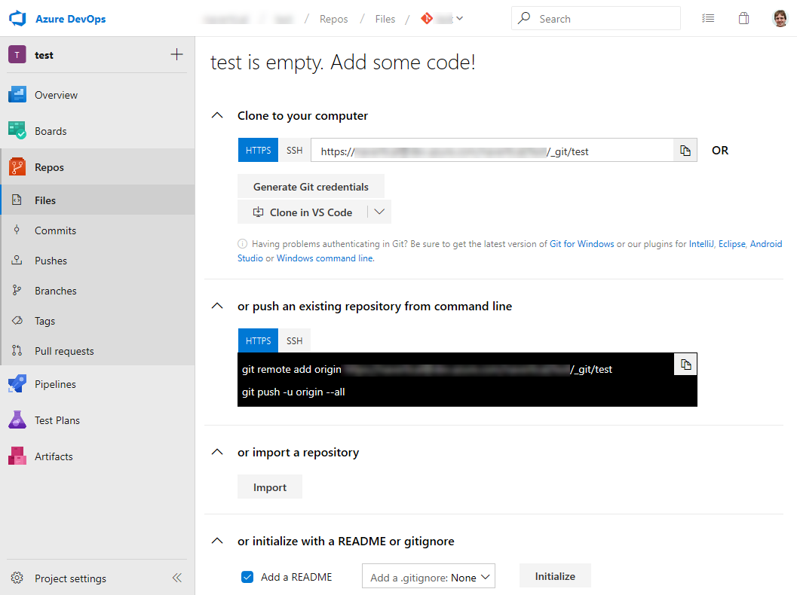
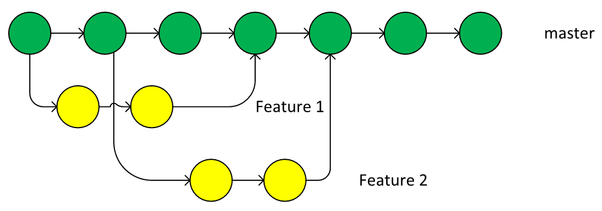
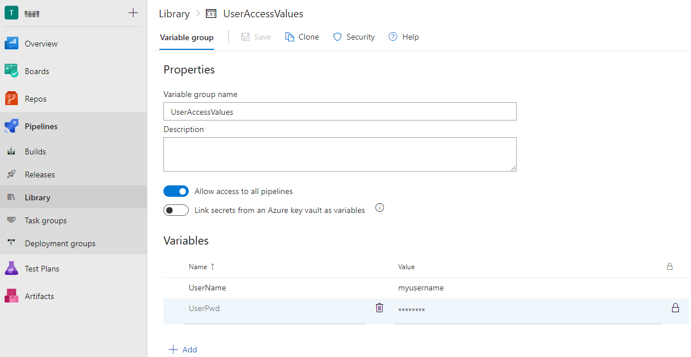
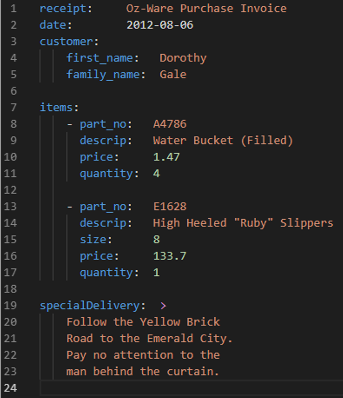
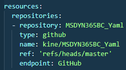

# 第十一章：与 Business Central 的源代码管理和 DevOps

在没有使用源代码管理的情况下开发应用程序，就像开车时没有系安全带。创建一个必须支持多年的应用，并且需要根据新的需求进行扩展和修改，而不知道是谁写了哪些代码以及为何这样写，就像在没有地图和指南针的情况下进入荒野。也许你能勉强度过一天，但再也没有人和你在一起。

通过使用 Visual Studio Code 来开发我们的应用程序，我们拥有所需的所有工具。工具包括**Git**用于源代码管理，**Azure DevOps**用于管理应用开发，这将加强开发与运维之间的合作。

在本章中，我们将讨论以下主题：

+   理解 Azure DevOps 及其提供的功能

+   在 Azure DevOps 中管理任务、冲刺和看板

+   为你的代码创建一个代码库

+   管理仓库

+   分支策略

+   分支策略

+   理解 Git 合并策略

+   使用 Visual Studio Code 探索 Git

+   理解 Azure DevOps 管道

+   理解 YAML 管道

# 理解 Azure DevOps 及其提供的功能

也许你听过像*Team Foundation Server*、*Team Foundation Service*、*TFS*或*Visual Studio Team Services*这样的术语——这些现在统称为**Azure DevOps**。在 Azure DevOps 中，你可以找到开发团队所需的一切，例如：

+   **Azure Pipelines**：它为任何语言、平台和云提供 CI/CD。它看起来像这样：


+   **Azure Boards**：这是你可以通过使用看板、待办事项、团队仪表板和报告来跟踪项目活动的区域。它看起来像这样：


+   **Azure Artifacts**：这是一个用于保存和分发包的工具。它看起来像这样：


+   **Azure Repos**：这提供云托管的私有和公共 Git 仓库。它看起来像这样：


+   **Azure Test Plans**：这提供用于计划和探索性测试的工具。它看起来像这样：


当然，你不需要使用所有可用的工具。你可以从 Azure Repos 开始，然后添加 Azure Pipelines 并将所有这些连接到 Azure Boards。

由于你可以免费获得五个用户，因此使用这些工具没有任何费用。如果你的开发人员有 MSDN 订阅，他们已经包括了 Azure DevOps 的许可证。如果这对你来说还不够，你可以购买额外的许可证（每个用户每月从$6 起—请参见[`azure.microsoft.com/en-us/pricing/details/devops/`](https://azure.microsoft.com/en-us/pricing/details/devops/))。

如果你的公司域连接到**Azure Active Directory**（**AAD**），你可以通过这些账户和组来管理 Azure DevOps 的访问。这意味着你的用户无需额外的账户即可处理所有相关事务。

# 创建 Azure DevOps 账户和项目

在**Azure DevOps**中，你可以拥有多个账户。在每个账户下，你可以有多个项目。当你使用 Azure DevOps 创建一个新项目时，生成的项目 URL 会如下所示：

[`dev.azure.com/myaccount/myproject`](https://dev.azure.com/myaccount/myproject)

让我们从创建一个新的 Azure DevOps 账户开始。你可以选择使用 Microsoft 账户访问 Azure DevOps，或使用公司的 AAD 账户。

如果你使用个人账户创建 Azure DevOps 账户，之后可以将所有权转移到公司账户。

创建新的 Azure DevOps 账户，请按照以下步骤进行：

1.  访问 [`go.microsoft.com/fwlink/?LinkId=307137`](https://go.microsoft.com/fwlink/?LinkId=307137) 并使用你的 Microsoft 或 AAD 账户登录。

1.  阅读并接受《服务条款》、《隐私声明》和《行为准则》。点击继续。

1.  如果你已经使用你的账户在 Azure DevOps 上工作，你可以通过点击“新建组织”按钮来创建一个新的组织。

1.  输入你的组织名称并选择托管项目的区域。

1.  现在，你可以创建你的第一个项目。选择该项目是公开的（任何人都可以访问）还是私有的（仅限你授权的用户访问）。

1.  你现在是新 Azure DevOps 账户和项目的拥有者，恭喜！以下截图展示了这一点：


如果你拥有多个 Azure DevOps 账户，你可以在它们之间自由切换，并在其中创建项目，前提是你拥有相应的权限。

默认情况下，新的项目将使用**Git** 仓库和**敏捷**工作项流程模板。如果你更倾向于将产品待办事项视为用户故事，将障碍视为问题（以及其他一些差异，详见[`docs.microsoft.com/en-us/azure/devops/boards/work-items/guidance/choose-process`](https://docs.microsoft.com/en-us/azure/devops/boards/work-items/guidance/choose-process)），你可以将流程更改为**Scrum**。

你可以为每个产品/客户创建一个项目，或者你也可以将所有内容放在一个项目中，并使用其他工具按产品/客户将内容分组。这取决于是否有不同的团队在各自的项目上工作，或者你是否在项目之间共享资源。

我建议从一个项目开始，该项目包含一个待办事项列表（队列），用来为团队优先安排工作。如果你有两个队列或两个独立的团队，可以使用不同的项目。

# 在 Azure DevOps 中管理任务、冲刺和看板

**Azure DevOps** 是管理 Dynamics 365 Business Central 项目的一个重要工具，从项目的早期阶段开始。通过使用 Boards 功能，你可以开始集中管理项目的任务、功能、缺陷和一般活动。

在你的 Azure DevOps 项目中，如果你点击 Boards，你会看到以下选项：


以下是可用选项的简要描述（我们稍后会详细查看）：

+   Work Items：在这里，你可以管理你的活动列表（分配给你或你跟踪的活动，或你团队的活动）。

+   Boards：在这里，你可以访问你的看板视图。

+   Backlogs：在这里，你可以访问你的产品待办事项，它是一个项目团队计划开发和交付的工作项列表。

+   Sprints：在这里，你可以管理项目的迭代（在 Scrum 方法论中，冲刺通常定义为一个不超过三周的时间段，其中任务被分组并必须完成）。

+   Queries：这是一个可以设置查询来查找和列出工作项的区域。

作为项目经理，你可以做的第一件事是选择 Backlogs，并为你的项目创建一个产品待办事项（产品待办事项对应你的项目计划——你的团队计划交付的路线图）。

在这里，你可以创建阶段和工作项（任务、缺陷等），并将任务分配给团队的用户。下图显示了这一点：


在下图中，我们定义了一些类型为产品待办事项（Product Backlog Item）的工作项。这些工作项对应一组活动。在每个产品待办事项下，我们有相应的任务。每个任务都有自己的**状态**（待办、进行中或完成），描述，以及一个优先级：


在 Backlog 页面右侧，你有一个 Sprint 面板。

根据 Scrum 方法论，团队以固定的时间间隔计划和跟踪工作，这个时间间隔被称为 *冲刺节奏*。你可以定义冲刺，以对应你的团队在项目中使用的节奏。

在 Azure DevOps 中，你可以选择一个 **冲刺**，定义开始和结束日期，然后通过拖放活动将来自 Backlog 的活动分配到特定的冲刺（例如，在上图中，我将“客户类别开发”活动分配到了 Sprint 2）。

在为你的项目安排活动和冲刺后，还有一些其他有趣的视图可供使用。如果你点击 Work Items，你可以查看工作项的状态（例如，分配给你的工作项、所有工作项和最近创建的工作项）：


如果你点击 Boards，你可以看到项目的看板（以卡片形式按状态排序的任务视图；你可以拖放任务来更改其状态）：


如果你选择冲刺（Sprints），你可以查看项目中定义的每个冲刺（迭代路径）的详细信息。在这里，你可以查看任务板（Taskboard）视图，并查看冲刺待办事项和容量：


在这里，你可以监控每个冲刺的进度以及与每个任务相关的活动。

在查询页面，你可以定义自定义查询来检索工作项。在这里，我定义了一个查询，用于立即查看我项目中已声明完成的所有任务：


执行时，查询返回所需的结果（可以以不同的格式查看）：


另一个有趣的功能是所谓的 Delivery Plans。Delivery Plans 将工作项以卡片形式展示，并配有时间线或日历视图。它非常有用，可以查看团队活动的预期发布或交付日期。

Delivery Plans 不是一个标准功能，要获取它，你需要从市场下载并安装 Azure DevOps 扩展（点击页面右上角的袋子图标）。扩展如下所示：


安装完成后，你会在左侧看到一个名为 Plans 的新菜单，点击它，你可以在时间线上查看你的项目交付计划：


最酷的部分是，所有这些项目管理功能都可以在一个工具中使用，并且与日常使用的开发工具（例如 Visual Studio Code）完全集成。在 Visual Studio Code 中，你可以例如提交代码并将该提交关联到分配给你的任务。通过这种方式，你可以拥有完整的产品生命周期，项目经理可以查看为开发或解决特定任务或问题所做的代码修改。

例如，如果我们选择已完成的客户类别开发任务，并点击链接，我们可以看到任务的所有详细信息。特别是，通过历史（History）链接，我们可以查看任务的整个历史：


如果我们点击链接，我们可以看到与该任务相关的所有提交。在这里，我们可以看到，对于此任务，我们有三个提交和一个拉取请求：


如果你选择特定的提交，你可以查看代码修改的详细信息：


如你所见，你可以从单一门户和统一界面中完全控制项目的各个方面。

# 创建代码库

仓库的目的是为了将你的源代码保存在安全、可靠并且在需要时可以访问的地方。Azure DevOps 提供了无限制的仓库。拥有这样一个安全的存储空间，并且不限空间，免费提供，这对于当笔记本被盗或硬件损坏时，可以大大缓解你的焦虑。而且你可以随时随地访问它；不需要 VPN。此外，你还可以轻松地将更改与需求（工作项）连接起来，了解某些操作的原因以及是谁完成的。

创建新仓库，按照以下步骤操作：

1.  转到 Azure DevOps 的 Repos 部分。

1.  展开顶部的仓库选择（你可以管理现有仓库，导入仓库或创建新仓库）。

1.  选择新仓库。

1.  输入名称。

1.  点击创建。

不久后，你的新仓库就可以使用了，主页面会提供你所需要的所有信息，帮助你将代码填充到仓库中。以下截图展示了这一点：



在我们刚创建的仓库主页面上，你可以找到以下功能的链接：

+   克隆到你的计算机：你可以使用项目的 URL 和 Git 来克隆仓库，或者点击 VS Code 中的 Clone 按钮来打开 Visual Studio Code（或其他支持的开发工具），选择目标文件夹，然后让 Visual Studio Code 将仓库克隆到本地磁盘。然后，你可以根据需要将源代码填充进去。

+   从命令行推送现有仓库：复制命令，转到你的本地仓库并运行这些命令，你的本地仓库将与这个新的 Azure DevOps 仓库连接，并将推送到其中。

+   导入仓库：如果你在其他地方有一个 Git 仓库，想要将其导入，只需输入 URL，当前状态将被导入。

+   使用 `README` 或 `gitignore` 初始化：如果你愿意，可以只创建一个包含项目描述的 `README` 文件，或者仅创建一个 `.gitignore` 文件，稍后再向仓库中添加其他内容。

接下来，我们来看一下如何管理仓库。

# 管理仓库

在你创建的每个仓库中，你可以设置多个设置。我们将介绍其中最有趣的设置。你可以通过点击项目设置 | Repos | 仓库来管理仓库：


在仓库的设置页面中，我们可以管理主要设置，我们将在接下来的章节中查看这些设置。

# 安全

你可以为所有仓库分配组并设置权限，也可以根据需要为每个仓库、每个分支或标签进行细化设置。我建议检查哪些用户可以执行以下操作：

+   删除仓库

+   强制推送（这可能会重写仓库中的历史记录）

+   创建仓库

+   跳过策略

如果你设置了正确的配置，可以防止代码丢失。

# 选项

在所有 Git 仓库和每个单独的仓库中，你可以设置以下内容：

+   **跨平台兼容性**：这确保设置能够防止因文件/文件夹名称仅因大小写不同而导致的问题。Git 是区分大小写的，允许开发者将 `File.txt` 和 `file.txt` 作为两个独立的文件添加。但 Windows 和 iOS 不区分大小写，因此在这方面会出现问题。最佳实践是命名保持一致，避免创建此类文件。启用仓库中的选项将强制开发者保持名称唯一。因为即使标签和分支在 Git 内部也是文件，所以标签和分支名称也可能存在冲突。

+   **Fork**：如果您不希望允许用户从仓库创建 Fork，您可以禁用此功能。Fork 是仓库的副本，并保持与原始仓库的连接。开发者可以使用 Fork 创建拉取请求，将更改从一个仓库传输到另一个仓库。Git 是一个分布式系统，一个仓库可以存在于多个地方（多个服务器或同一服务器上的多个仓库——都可以）。

+   **工作项管理（每个仓库）**：保持此设置开启，以便将提交与现有工作项连接。通过这种方式，您将获得每个需求所做的工作的信息，甚至可以知道哪些更改是每个构建或发布版本的一部分。这有助于为每个版本创建变更日志。

+   **代码搜索分支（每个仓库）**：您可以为每个仓库选择最多五个分支进行代码搜索索引。这些分支中的文件将可以通过 Azure DevOps 的搜索功能进行搜索。只需输入您想搜索的文本，Azure DevOps 将在所有仓库中快速找到它。这是一个非常方便的工具。

+   **分支策略（每个分支）**：请参见*Branching policies*部分。

我们将在下一节中查看这些分支策略。

# 分支策略

为了保持应用程序的质量，您可以定义一些必须满足的政策，才能将开发者的更改合并到选定的分支中。

通常，政策是在*master*分支上定义的，但它也可以是您希望保持健康的任何分支。如果您为某个分支定义了策略，则不能直接将更改推送到该分支，只能通过 Pull Request（PR）进行。有关更多详细信息，请参见*Pull request*部分。通过这种方式，每个更改都会被检查和测试，如果不符合政策，该更改将无法进入分支。您可以在策略中定义以下内容：

+   **最少审阅者数量**：这是指必须有多少位审阅者批准 PR 才能被接受。

+   **检查关联的工作项**：这强制开发者将 PR 与工作项关联，以建立需求和更改之间的链接。

+   **检查评论是否解决**：如果审阅者写了评论，则必须在接受 PR 之前解决这些评论。

+   **强制合并策略**：你可以禁止快速前进合并（虽然失去了一些细节，但得到了简化），或者强制使用压缩合并，这将把开发者的所有提交合并为目标分支上的一个新提交。

+   **构建验证**：你可以定义一个构建管道，用来构建和测试更改。如果构建成功，PR 可以被接受。构建失败可能会阻止 PR 被接受（可选行为）。通过这种方式，你可以保持分支的健康状态。

+   **自动包括代码审查员**：这定义了将默认作为审查员的用户组或用户。审查员可以根据特定的更改来选择，例如，当脚本文件或应用程序的设置发生更改时，负责人将被自动添加为审查员。

一些开发者倾向于将分支策略视为增加的障碍，但这是一个很好的机会，可以通过代码审查提升团队成长和质量。它为团队提供了相互学习的机会，并帮助彼此传授新知识。额外的代码审查人员总是有益的。

# 分支策略

我们已经为分支设置了策略，以便进行规则和技术检查，但问题是，如何在 Git 中使用分支来支持你的工作？你应该使用哪种策略？什么时候应该创建新分支？什么时候应该合并分支？

你可以使用许多策略，而且没有万能的解决方案。适合你团队的最佳策略可能对另一个团队来说并不合适，或者你可能会为你的 **AppSource** 应用程序使用一种策略，为你的 **PerTenant** 应用程序使用另一种策略。

在你决定采用哪种方式之前，考虑一下**KISS 原则**（**Keep It Simple, Stupid**）。

在本章的所有示例中，我们将主分支视为最稳定的分支，它代表着已发布到生产环境的应用程序。你可以决定将该分支命名为其他名称，这不会影响策略本身。你只需要定义名称并确保全团队保持一致。接下来，我们将讨论各类分支。

# 仅有一个主分支

拥有一个分支是你可以使用的最简单策略。如果只有一个开发者在开发应用程序，就不需要创建分支。即使有更多的开发者，他们也可以继续在一个分支上工作，每次出现冲突时将更改合并到该分支中。但由于未完成的更改可能被推送到分支中，这会使产品很难保持稳定：


为了稳定应用程序，你需要暂停开发。不过，当你看到需要时，仍然可以稍后将策略更改为其他方案。

# 功能/开发分支

为了将一个功能或者一个开发者的变更隔离开来，你可以为每个功能或者开发者创建一个分支。这样，开发者们就可以在各自的分支上进行工作，直到完成工作并将变更集成回主分支之前，不会与其他人的工作产生冲突。

当功能完成并集成回主分支后，功能分支可以被删除。如果分支是按开发者分的，那么可以预期分支将长时间存在。从长远来看，这可能会成为一个问题。以下图表描述了这一点：



每个开发者使用一个分支会将不同功能的不同变更混合在一起，以后选择性地释放选定的功能可能会成为问题。

使用功能分支可以让你有可能仅发布选定的功能或在流程后期取消功能开发而无需付出成本。

# 发布分支

下一个策略是为你正在准备的每个发布创建一个分支。它使你能够在发布之前稳定产品并将其与正在进行的开发隔离开来：


正如我们在前面的图表中所看到的，它非常适合适用于 AppSource 的应用程序，因为你可以根据 AppSource 验证程序修复问题，而应用程序不会受到在此期间进行的新开发的影响。修复可以随时集成回主分支。

# 其他策略

即使为了服务创建一个新的分支（例如，通过另一个团队完成已发布版本的支持并长期支持时，例如创建服务包），或者为了热修复而创建热修复分支时，也可以创建一个新分支并将其与发布和开发分离开来。

如你所见，分支的唯一目的是为了将其变更与其他为不同目的进行的变更隔离开来，以防需要长时间保持隔离状态。

每种策略都可以与其他策略结合使用，这样你可以根据自己的需求创建自己的策略。其中一种组合被命名为`Git flow`，我们将在接下来探讨它。

# Git flow

**Git flow** 是一种工作流程，结合了特性分支和 bug 和发布分支。它被广泛使用，你甚至可以找到支持此流程的工具，通过自动化不同部分来支持它。在 Git flow 中，主分支代表已发布的版本，即其中的每个提交代表产品的一个发布版本。

第二个分支是开发分支，用作从中创建每个功能分支的集成分支。

当准备发布新版本时，首先从开发分支创建一个新的发布分支。在发布分支上进行稳定性和微调，直到版本准备好发布。发布通过将发布分支与主分支合并来完成。

如果发布的版本有 bug，可以从主分支创建一个新的 bug 修复分支。所有修复都在这个分支上进行，然后将其合并回主分支（创建一个新的修复版本的应用）并合并到开发分支（以便在下一个发布版本中保留 bug 修复）。

以下图示展示了这一点：


这种流程适用于开发 AppSource 应用，因为发布可以被隔离，并且你可以轻松地支持多个版本的应用。

# GitHub flow

GitHub flow 是一种用于 GitHub 上开发的工作流。它基于两个规则：

+   主分支中的一切都可以随时发布。

+   发布可以随时进行，甚至一天多次。

它本质上是特性分支。修复 bug 的方式与开发其他任何特性相同：


正如我们在前面的图示中看到的，它需要产品的自动化发布，因此可能仅适用于 Business Central 中的 PerTenant 或 OnPrem 应用。AppSource 的发布周期较长，因此此流程不适合它。它甚至假设只有一个版本的产品会发布，但对于 AppSource 来说，这并不真实。

# 分支考虑因素

在公司中可以使用多种分支策略，因为每种策略适用于不同的情况。但不要忘记 KISS（保持简单！）。采用复杂的策略而对团队没有任何帮助，只会导致捷径和团队不遵守规则。采用单一分支也是一种策略。可以从一个分支开始，根据需要再添加其他分支。随着团队的成长，策略也可以不断发展。

对于 AppSource 开发，你可以使用任何策略，但最适合的策略是 Git flow，因为它允许你分离每个发布并支持多个版本。不要忘记，客户租户上的应用只有在进行重大版本发布或因出现关键 bug 时（这是在合作伙伴请求之后）才会自动更新。这意味着多个版本可以一起在云中共存。

对于 PerTenant 应用开发，因为在这种情况下，你只会向客户租户发布一个版本的产品，所以你可以使用任何策略，包括 GitHub flow。

# 理解 Git 合并策略

我们不会深入探讨 `git merge` 命令的所有可能性，但我们会解释一些与 Git 和合并相关的术语。

# 快进合并

当你在 Git 中合并两个分支，其中一个分支是另一个分支提交的子集时，结果将是**快进合并**，此时根本不会进行合并。请参考以下图示：


分支将重置到一个新的位置。

# Squash 提交

使用 **squash commit** 可以帮助你保持分支的简洁。当你想要将一个分支合并到另一个分支时，使用 squash commit 可以将分支中的提交合并成一个新的提交，并附上新的提交信息，并将这个新的提交连接到目标分支。下图展示了这一过程：


分支之间不会有真正的合并。你只需丢弃旧分支，因为所有的更改现在都已经提交到目标分支。你会失去一些细节，但获得了简洁性。这取决于你的优先级是什么。

# Rebase

你可以使用`rebase`命令代替`merge`。顾名思义，你将分支从树上剪切下来，并将其重新基于另一个提交。通过这种方式，你可以在不进行合并的情况下将更改基于新版本。下图展示了这一过程：


所有从原始基点到分支头（分支的起始点）之间的提交都会被获取并重新应用到新的基点上。同样，你获得了简洁性，但失去了现实，因为你在影响历史。

# Git 合并的考虑事项

当你需要将更改合并回目标分支时，你可以选择使用快速前进合并、常规合并或 rebase，或者使用 squash 提交。通过结合这些技巧，你可以在 Git 中保持简单的历史记录，但可能会丢失一些必要的细节。但再次强调，不要害怕做出选择。只需从最简单的方式开始，如果你觉得这会有所帮助，可以以后再修改规则。

接下来，我们继续看看如何在 Visual Studio Code 中使用 Git。

# 使用 Visual Studio Code 探索 Git

**Git** 是 Visual Studio Code 的默认版本控制系统，你可以通过 Visual Studio Code 的 GUI 执行基本的 Git 操作（如 push、pull、fetch 和 clone）。你还可以通过安装扩展来丰富集成体验。

我推荐这些扩展：

+   **Azure Repos**：连接到 Azure DevOps 仓库，包括工作项和构建流水线

+   **GitLens**：为 Git 历史记录添加不同的视图，如 blame 功能

让我们来看看 Git 能为我们提供什么。

# Visual Studio Code 中的 Git GUI

Visual Studio Code 提供了一个与 Git 和版本控制管理系统（SCM）完全集成的体验。以下是 Visual Studio Code 的界面：


截图左侧的数字表示以下详细信息：

1.  当前分支：点击此处，你可以创建一个新分支或切换到另一个现有分支。

1.  仓库状态：我们与远程仓库保持同步。如果不同步，你可以看到当前分支的进出提交数量。点击它们时，你将执行同步操作，即从远程仓库拉取和合并。

1.  在 Azure DevOps 中的项目名称（Azure Repo 扩展）：点击此项将打开 Azure DevOps 门户。

1.  拉取请求的数量（Azure Repo 扩展）：点击此项可以选择并浏览拉取请求。

1.  上次构建状态（Azure Repo 扩展）：点击此项可以查看仓库的最后一次构建。

1.  工作项的数量（Azure Repo 扩展）：点击此项可以浏览工作项并在 Web 门户中打开它们。

1.  源代码控制活动栏：你可以看到更改文件的数量。你可以切换到源代码控制活动，在哪里你可以提交这些更改。

1.  提交消息文本框：在提交更改之前，输入提交信息。

1.  更改列表：你可以选择你希望撤销或暂存以便提交的更改。如果你双击此项，你可以打开差异窗口，查看当前状态与最后一次提交状态之间的差异。

1.  源代码控制菜单：你将在这里找到更多关于源代码控制的命令。

完成这些之后，我们来探索 Git/Visual Studio Code 的工作流。

# Git 工作流

当你在 Visual Studio Code 和 Git 中工作时，以下是你常见的工作流：

1.  第一步是将你想要工作的仓库获取到本地系统中。

1.  如果你想处理现有的代码，你需要获取远程仓库的 URL。然后，你可以使用 `Git: Clone` 命令，输入 URL，并选择仓库克隆到的文件夹（它会被克隆到一个以仓库名命名的子文件夹中）。

1.  如果你正在创建一个新的应用程序，你可以先创建文件夹，打开它并在 Visual Studio Code 中创建基本结构（使用 `AL: GO!` 或其他命令），然后使用 `Git: Initialize Repository` 将文件夹变成一个 Git 仓库。之后，你可以通过命令提示符将本地仓库连接到新的远程仓库。请参见 *如何为你的代码创建仓库* 部分。

1.  检出现有分支或创建一个你想进行开发的新分支。你可以通过点击底部的分支按钮来完成此操作。别忘了检查你正在工作的是正确的分支。

1.  在你进行了一些更改后，转到**源代码管理活动栏**（按 *Ctrl* + *Shift* + *G* 打开 Git），写下有意义的消息（例如 `My first commit`），然后提交更改（点击消息上的勾号或按 *Ctrl* + *Enter*）。如果你还没有暂存一些更改（即在更改列表中选择已更改的文件并将其移动到暂存区），Visual Studio Code 会询问你是否想提交所有更改。我建议你逐一查看更改并手动检查和暂存它们，因为修复已经提交的内容并不简单或方便。通过暂存更改，你可以选择所有修改中的一部分进行提交。你甚至可以在行级别上进行暂存/取消暂存，方法是打开差异窗口，右键点击行并选择“暂存/取消暂存选中的范围”。通过这种方式，你可以将更改拆分为独立的提交，例如，如果它们与不同的需求相关。

1.  如果你想撤销更改，只需点击已更改行中的“放弃更改”。

1.  提交更改后，如果你想让其他人能够使用这些更改，你可以点击窗口底部的**同步**按钮，它将把提交推送到远程仓库（如果有更改，它还会从远程仓库拉取更改）。这就是按钮的样子：


1.  如果你想将更改合并到开发分支（或任何你不负责的其他分支），请在 Azure DevOps 门户中创建一个拉取请求。你可以通过点击状态栏中的“拉取请求”按钮（在*Visual Studio Code Git 图形界面*部分中的第 4 项），然后选择“浏览你的拉取请求”选项进入。如果你需要修复某些问题，例如在拉取请求期间发生冲突，只需进行修改、提交并推送，拉取请求将会自动更新为新的提交。

1.  如果所有内容都在远程仓库中，并且更改已经合并，你可以在不再需要该文件夹时直接删除磁盘上的该文件夹。

制定关于提交信息格式的规则是一种良好的实践，以确保公司内部的一致性。掌握写好提交信息的技能应该是每个开发者持续改进的一部分。你可以通过写 `#1234` 来引用工作项，其中 1234 是工作项的 ID。你可以在网上找到一些示例和规则，了解如何写出好的 Git 提交信息。以下是一个示例：

```
Fix error "Value is incorrect" in Sales posting
Error text was changed to give more context to user and
in some cases, solved by finding correct value automatically.
Fix bug #1234
Related to #1258
```

你可以通过点击“创建新分支”直接从 Azure DevOps 中的工作项创建一个新分支：


这样，分支将与工作项关联，大家都知道更改是在哪里开发的。当你使用特性分支策略时，这种做法是非常好的。

# 合并

在某些情况下，你需要将远程仓库中的更改与本地更改合并。在这种情况下，同步仓库后，你将在源代码控制部分看到一个名为 MERGE CHANGES 的新部分（在正常开发工作中会有 CHANGES 和 STAGED CHANGES 部分）。

当你点击每一行/文件时，Visual Studio Code 会打开一个编辑窗口，显示更改，你可以接受这些更改或手动修正它们。所有冲突解决后，将更改暂存并提交为新的合并提交，并将更改同步（推送）到远程仓库。

学习了 Git 之后，让我们来看一下 Azure DevOps Pipelines 是如何工作的。

# 理解 Azure DevOps Pipelines

由于业务案例应用程序的生命周期较短，并且你发布新版本的频率应该比过去（AL 时代之前）要高得多，你不能手动构建、测试和部署应用程序。

为了自动化生命周期的这一部分，你可以使用 Azure DevOps Pipelines，它将为你构建、测试和部署。你将生成的源代码作为输入提供给管道，而在管道的另一端，你将获得一个经过测试的应用程序，甚至可以自动交付或部署。现在，管道有两种类型：

+   **构建**管道：输入是源代码，输出是应用程序和其他工件。

+   **发布**管道：输入是构建管道生成的输出，输出是经过测试的应用程序，已交付或部署到选定位置。

计划是将会有一个多阶段管道，覆盖整个过程。请参考以下图表：


在构建阶段，你将与源代码进行工作，生成产品/应用并进行测试。通常，运行应用程序的测试不需要将应用程序部署到某个地方。对于 Dynamics 365 Business Central，它有所不同，你需要将应用部署到服务器上才能进行测试——是否使用容器并不重要。

在发布管道中，你尝试将应用程序交付或部署到不同的环境中（当前版本、下一个版本、不同的本地化、新环境，或者是包含先前版本的环境以测试数据升级等），在该环境中进行测试，并执行交付/部署应用程序所需的其他步骤。这使得你可以随时以尽可能少的人工干预交付或部署应用程序。

你在提交或拉取请求中添加的与工作项相关的所有内容都会通过管道传输，并且在每次发布时，你都能看到与该发布相关的所有工作项。这帮助你识别和描述属于应用特定版本的更改，并且这个列表可以随应用程序一起自动交付。

# 代理

你创建的管道必须在某个地方执行。执行由名为**代理**的应用程序完成。

你可以使用托管代理，这些代理由微软在 Azure 上维护，并运行在不同操作系统上，安装了不同的附加软件（如 macOS、Ubuntu 和带有 Visual Studio 2019 的 Windows 2019）。对于这些托管代理，你可以在 Azure DevOps 组织中使用一些免费的分钟数（你可以在“组织设置”的“计费”部分查看使用的分钟数）。但是，由于不能安装附加软件，使用这些托管代理是有限制的。

如果你愿意，也可以使用自己的代理。这意味着你可以在自己的服务器上安装并配置一个小应用程序，该应用程序通过 RESTful API 连接到 Azure DevOps，并在你的服务器上执行管道中的任务。如何安装代理的详细信息，在点击“下载代理”按钮时，会在设置中的“代理池”部分显示，如下所示：


关于如何配置代理并获取认证代理所需的访问令牌的详细信息，可以在下载代理页面点击“详细说明”找到 ([`go.microsoft.com/fwlink/?LinkID=825113`](http://go.microsoft.com/fwlink/?LinkID=825113))。不要忘记以管理员身份运行代理，这样才能在执行 Dynamics 365 Business Central 任务时做必要的操作。

用于执行管道的代理由代理的能力（你可以在“代理池”部分设置）和所需的代理任务能力（你可以稍后在管道定义中的代理任务上设置）决定。这意味着，如果有多个具有相同能力的代理可用，每次运行管道时都可以由不同的代理处理。接下来，让我们看看如何创建构建管道。

# 创建构建管道

要创建你的第一个构建管道，请打开 Azure DevOps 门户中的管道部分，然后点击“新建管道”：


现在，你可以选择要构建的代码源。首先，我们将使用**经典编辑器**，这意味着我们将手动创建管道，只是为了查看管道设置的不同部分。稍后，我们将使用**Azure Repos Git**从 YAML 文件一步创建整个管道。

点击“使用经典编辑器”后，你可以选择代码的来源（选择 Azure Repos Git | 团队项目，然后选择源代码的存储库和该存储库的分支）。选择正确的值后点击“继续”。

因为没有预定义的 Dynamics 365 Business Central 管道模板，我们需要从空工作开始：


现在您已经进入了管道编辑器，您可以添加管道代理作业，这些作业代表了您需要执行的构建和测试应用程序的管道步骤。在右侧，您可以看到您在左侧选择的实际步骤的参数。

在参数中，您可以使用变量，这些变量可以在“变量”标签中定义，也可以由系统定义。您可以在 Azure DevOps 文档中找到有关变量的详细解释。

要在任务的参数中使用变量，请使用 `$(variablename)` 语法。在 PowerShell 脚本中使用时，请使用 `$env:VARIABLENAME` 语法。所有可作为环境变量访问的变量都是大写的，且点被替换为下划线。

注意查看“查看 YAML”按钮。当我们研究 YAML 构建管道时，它会很有用。

在为 Business Central 构建应用程序时，您通常会使用可以运行现有脚本（例如，如果它们是源代码的一部分）或运行内联定义脚本的 PowerShell 任务。

在定义了所有所需任务后，您可以为新的构建管道定义触发器。您可以选择以下几种方式：

+   **持续集成**：每当新的提交被推送到服务器时，这将会运行。检查分支过滤器，只为您希望节省计算时间的分支运行构建。您甚至可以为仓库中的路径指定过滤器，只有当路径发生变化时，才会触发管道（例如，当`readme.md`被修改时不触发）。

+   **定时**：管道将在设定的时间自动触发。您可以选择仅在上次有变化时触发它。

+   **构建完成**：当另一个管道完成时，会触发该管道。这在您有应用程序之间的依赖关系时非常有用，可以在依赖项构建完成后，触发应用程序的构建。

当一切准备就绪后，保存管道并尝试运行它。在大多数情况下，您需要多次运行和修改，才能获得第一次成功的构建。

常见的构建任务包括以下步骤：

1.  准备构建环境（安装脚本、下载工具、创建 Docker 容器等）。

1.  编译应用程序（下载符号，使用 `ALC.exe` 编译应用程序等）。

1.  安装应用程序（将其发布并安装到 Docker 容器中）。

1.  运行应用程序的测试并下载结果。

1.  发布测试结果（即使测试失败，也应该执行此操作）。

1.  发布构件（将应用程序推送到 Azure DevOps 商店或共享文件夹）。

1.  清理环境（例如，删除 Docker 容器；无论管道中是否存在失败的步骤，都应该进行此操作）。

# 变量组和安全文件

在创建管道时，您主要需要定义在构建之间共享的值（例如用户名、密码、密钥等）。为此，您可以创建**变量组**。要定义新的变量组，请打开库：



在创建变量组时，定义名称和描述。为了更好的安全性，你可以选择将变量存储在 Azure 密钥库中，或者仅创建变量名称/值对，并在密码字段上使用锁图标来隐藏值。此外，你还可以为每个变量组定义安全性。

要能够使用变量组中的变量，你需要将该变量组链接到你的流水线。只需打开编辑器，转到“变量”标签，选择变量组，然后使用“链接变量组”按钮。变量组链接后，你就可以在任务中使用这些变量。

如果你在构建流水线中需要使用证书或其他文件，你可以将其存储为库中的安全文件。你可以通过流水线中的“下载安全文件”任务来下载这个文件。这样，用户不需要访问该文件，并且该文件也不需要能够访问网络资源。该过程将从 Azure DevOps 存储中下载该文件，在那里它是被保护的。

接下来，我们来看看什么是 YAML 流水线。

# 理解 YAML 流水线

在上一节中，我们使用经典编辑器创建了一个流水线，向你展示流水线的不同部分，并让你对流水线有一个初步了解。但在编辑器中创建流水线并不方便，而且你无法对定义进行版本控制。这就是**YAML 流水线**的存在意义。它们与经典流水线有相同的属性和部分，但它们是通过 YAML 文件定义的，作为源代码的一部分。这意味着你可以将流水线定义为代码（你可以直接编写流水线代码），并且可以使用你正在使用的所有工具来处理代码。

首先，下面是一些关于**YAML**的信息。YAML 是一种类似于 XML 和 JSON 的文件语法，但它主要是为了让人类阅读（而 XML 和 JSON 是为了计算机读取）。这意味着 YAML 的语法非常易于理解。它不像 XML 和 JSON 那样使用人工标记来传达意义，而是使用缩进和一些符号，比如`-`来表示列表项，`:`用来分隔名称和值：



如果你查看示例，你应该能够识别出属性（格式为`name: value`）、包含属性的对象（例如前面截图中的`customer`）以及带有对象的列表（例如前面截图中的`items`）。

通过使用 YAML，你可以定义流水线编辑器中看到的所有部分：

+   带有参数和属性的作业和任务

+   变量，包括变量组

+   触发器

如果你在编辑器中创建了某些流水线，你可以使用编辑器中的“查看 YAML”按钮来查看定义相同内容的 YAML 文件。这样，你就可以开始创建你的 YAML 流水线。只需在你的项目中创建一个`azure-pipelines.yaml`文件，将流水线描述写入其中，然后将该文件提交到你的代码仓库中。

当您想要更改管道中的内容时，只需更改 YAML 文件，提交并推送。管道将自动更改。

# 创建 YAML 管道

若要基于 YAML 文件创建管道，请转到 Pipelines | Builds 部分并执行以下操作：

1.  点击“New Pipeline”。

1.  选择 Azure Repos Git（YAML）。

1.  选择仓库。

1.  Azure DevOps 将自动检测仓库中的 YAML 管道文件并打开它。

1.  点击“Run”。

完成了。您的新管道已创建！是不是很简单？

# YAML 管道模板

为了使其更加通用，您可以在 YAML 管道中使用模板。这意味着您将每个任务的 YAML 文件定义作为单独的文件存储在仓库中，并且可以从 YAML 管道中引用这些模板。这些定义与所有在其 YAML 管道中使用它们的应用程序共享，如果您需要修复某些内容，您只需在一个地方进行修复。当然，这样做的结果是，您可能会从一个地方影响到所有管道。请注意！

这是创建管道的方法：

1.  为您的模板创建一个新的仓库。

1.  将包含任务定义的 YAML 文件放入其中：


1.  将仓库引用添加到 YAML 管道文件中：



引用参数如下：

+   +   **Repository**：在 YAML 管道文件中使用的名称

    +   **Type**：源仓库类型

    +   **Name**：仓库名称

    +   **Ref**：要使用的模板版本的分支或引用

    +   **Endpoint**：在 Azure DevOps Service connections 部分中定义的端点名称

1.  在 Azure DevOps Service connections 中添加与您的仓库同名的服务连接：


1.  更改 YAML 文件以将这些模板作为步骤引用：


在 YAML 文件中，我们有这些引用：

+   **Template**：`@MSDYN365BC_Yaml`仓库中的文件路径和名称

+   **Parameters**：任务的参数值

所有特定于仓库的设置应保留在您的 YAML 管道文件中。所有共享的内容，如步骤定义，应放在模板仓库中。

您可以在[`github.com/kine/MSDYN365BC_Yaml`](https://github.com/kine/MSDYN365BC_Yaml)找到模板和管道文件的示例。

要使用此模板交换新应用程序，您可以将应用程序克隆为模板，网址为[`github.com/kine/MSDyn365BC_AppTemplate`](https://github.com/kine/MSDyn365BC_AppTemplate)。

仅供将来参考，作为 Dynamics 365 Business Central 的通用 YAML 管道，您还可以参考以下 YAML 定义：

```
variables:
 build.clean: all
 platform: x64

trigger: none

steps:
- task: PowerShell@2
  displayName: 'Install NAVContainerHelper module'
  inputs:
    targetType: filePath
    filePath: 'BuildScripts\InstallNAVContainerHelper.ps1'

- task: PowerShell@2
  displayName: 'Create a Docker Container for the build'
  inputs:
     targetType: filePath
     filePath: 'BuildScripts\CreateDockerContainer.ps1'
     arguments: '-credential ([PSCredential]::new("$(DockerContainerUsername)", (ConvertTo-SecureString -String "$(DockerContainerPassword)" -AsPlainText -Force)))'

- task: PowerShell@2
  displayName: 'Copy Files to Docker Container'
  inputs:
    targetType: filePath
    filePath: 'BuildScripts\CopyFilesToDockerContainer.ps1'

- task: PowerShell@2
  displayName: 'Compile extension stored in the repository'
  inputs:
    targetType: filePath
    filePath: 'BuildScripts\CompileApp.ps1'
    arguments: '-Credential ([PSCredential]::new("$(DockerContainerUsername)", (ConvertTo-SecureString -String "$(DockerContainerPassword)" -AsPlainText -Force))) -BuildFolder "$(Build.Repository.LocalPath)" -BuildArtifactFolder "$(Build.ArtifactStagingDirectory)"'
 failOnStderr: true

- task: PowerShell@2
  displayName: 'Publish extension'
  inputs:
     targetType: filePath
     filePath: 'BuildScripts\PublishApp.ps1'
     arguments: '-Credential ([PSCredential]::new("$(DockerContainerUsername)", (ConvertTo-SecureString -String "$(DockerContainerPassword)" -AsPlainText -Force))) -BuildArtifactFolder "$(Build.ArtifactStagingDirectory)"'
    failOnStderr: true

- task: PublishBuildArtifacts@1
  displayName: 'Publish Artifacts'
  inputs:
     PathtoPublish: '$(Build.ArtifactStagingDirectory)'
     ArtifactName: FinalApp
```

该管道模型使用一组 PowerShell 脚本，您可以将其存储在名为`BuildScripts`的文件夹中。它可以与您的扩展文件一起存储，如下图所示：


如果成功执行，此管道将发布你的 Dynamics 365 Business Central 扩展的最终 `.app` 文件作为工件（管道输出），你可以从构建摘要页面下载。

# 发布管道

在**构建**管道完成后，你可以使用**发布**管道来交付或部署构建工件，或者执行你想做的其他操作。要创建一个新的发布管道，请进入发布部分并点击新建发布管道。由于没有 Business Central 发布管道的模板，请从空作业开始。

每个发布管道的创建包括以下内容：

+   **工件**：这可以是构建管道的输出，Azure DevOps Git 仓库，GitHub 仓库，TFVC 仓库，Azure 工件，Azure 容器，Docker Hub 仓库，或 Jenkins 作业。

+   **阶段**：每个阶段是一个独立的过程，可以在不同的代理上执行，并且可以由不同的事件触发。

+   **变量**：这些与构建管道中的变量相同。

对于每个**工件**，你可以定义触发器来启动管道。可以是每次工件更新时（持续部署），或者按照给定的时间表（例如每晚发布）。

在每个阶段，你可以设置预部署条件和后部署条件：

+   预部署条件：这些包括以下内容：

    +   发布后：当选定的工件被部署或按照给定的时间表时，会触发此操作。

    +   阶段结束后：当另一个阶段完成时会触发此操作。

    +   仅手动：必须有人在门户中触发部署。

    +   预部署审批：选定的用户必须批准部署到此阶段。

    +   闸门：这些是可以根据某些条件批准部署的自动化过程（例如，在发布到上一个阶段后没有错误时）。

+   后部署条件：这些包括以下内容：

    +   后部署审批：选定的用户必须批准发布阶段成功，并且发布可以继续。

    +   闸门：自动化过程可以批准阶段发布。

    +   自动重新部署触发器：你可以在需要时触发重新部署；例如，在阶段失败后，你可以重新部署上次成功的部署。这对于恢复到最后一个已知的工作版本非常有用。

以下是 Dynamics 365 Business Central 的**发布管道**示例：


每个阶段将应用程序（并运行测试）部署到 Business Central 沙盒的不同版本（当前版本、未来版本和主版本）。如果一切正常，应用程序将部署到 QA 环境进行用户测试。如果测试成功，应用程序将由证书签名并存储在服务器上以供以后使用（发送到 AppSource）或部署到目标环境（每租户应用）。这就是 YAML 管道的意义所在。

# 概述

在本章中，我们了解了 Azure DevOps 的概念以及它所提供的功能，然后在 Azure DevOps 上创建了我们的账户。我们查看了如何使用 Azure DevOps 来管理和规划我们的工作。我们为我们的代码创建了一个仓库，并学习了可以设置哪些内容来支持我们的开发周期。

在*分支策略*部分，我们学习了如何在项目中使用分支来保持开发的稳定性和可追溯性。在*Git 合并策略*和*在 Visual Studio Code 中使用 Git*部分，我们查看了一些与 Git 源代码控制相关的特定方面，并了解了如何通过 Visual Studio Code 使用 Git SCM 来确保我们的代码安全。

我们学习了 Azure DevOps Pipelines，如何使用它们以及如何通过经典设计器创建它们。在上一节中，我们查看了 YAML 文件，并了解了如何使用它们将管道定义为我们代码的一部分。

在下一章中，我们将深入探讨 Dynamics 365 Business Central APIs，并探索如何创建新的 API 以及如何使用现有的 API 来执行集成操作。
