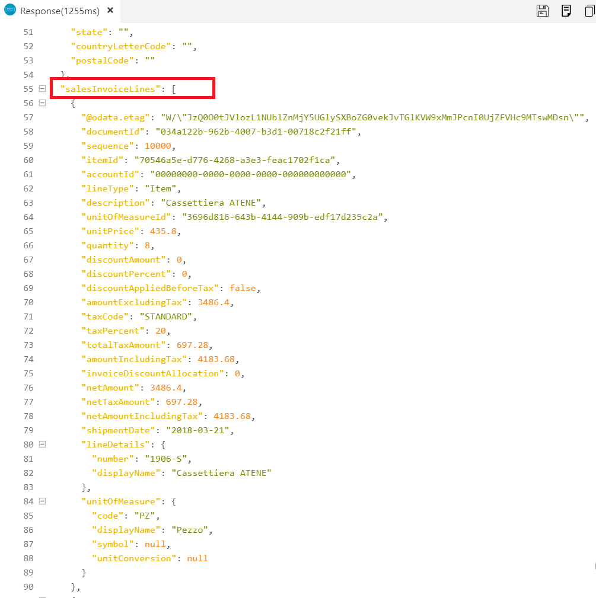
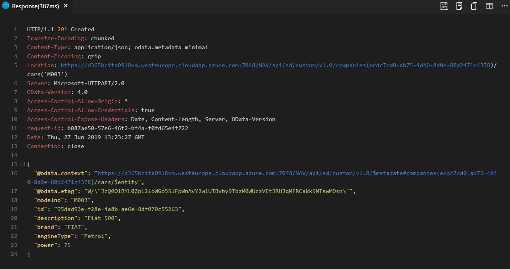
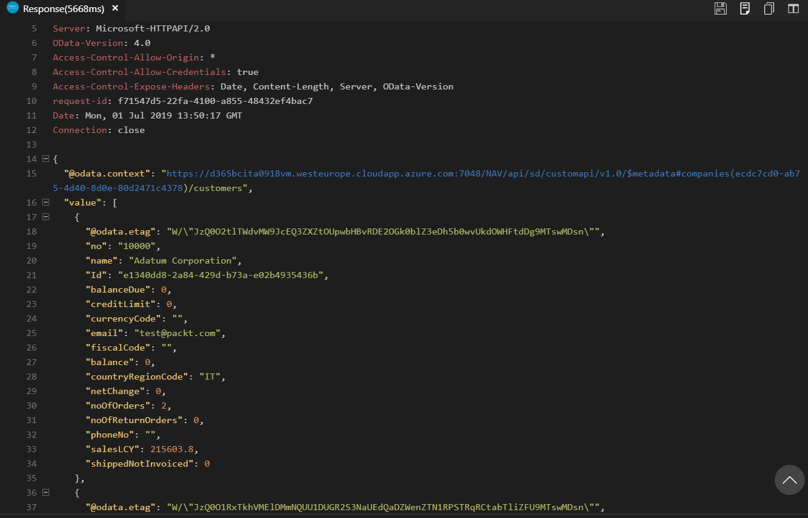
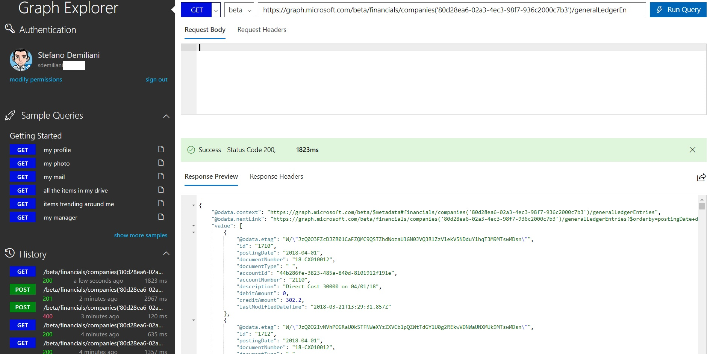

# 第十二章：Dynamics 365 Business Central API

在上一章中，我们学习了如何在 Dynamics 365 Business Central 项目中使用 DevOps 技术，并重点讨论了源代码管理和 CI/CD 管道等方面。

在本章中，我们将学习如何通过使用平台暴露的 RESTful API，将 Dynamics 365 Business Central 与外部应用集成，重点将放在以下主题：

+   比较 OData 和 RESTful API

+   使用 Dynamics 365 Business Central 标准

+   为新实体和现有实体创建自定义 API

+   创建使用 Dynamics 365 Business Central API 的应用程序

+   使用绑定动作

+   使用 Dynamics 365 Business Central Webhook

+   在 Microsoft Graph 自动化 API 中使用 Dynamics 365 Business Central API

到本章结束时，你将能够为 Dynamics 365 Business Central 创建 RESTful API，并使用它们与外部应用集成。

# 比较 Dynamics 365 Business Central 中的 OData 和 API

每个能够发出 HTTP 调用的客户端都可以使用 RESTful API。通过使用 HTTP 协议的 GET、POST、PATCH 和 DELETE 动词，实体可以**创建、读取、更新和删除**（**CRUD**）。为了与 Dynamics 365 Business Central 进行集成，OData 和 RESTful API 是推荐的工具。

**开放数据协议**（**OData**）是一个 Web 协议，允许你使用 URI 进行资源标识，通过 HTTP 调用对表格数据执行 CRUD 操作。在 Dynamics 365 Business Central 中将对象暴露为 OData 非常简单：打开 Web 服务页面，插入一个新记录，选择你想要暴露的页面类型，然后点击*发布*。

Dynamics 365 Business Central 会自动为发布的实体分配 OData 和 OData V4 URL，然后你可以通过执行 HTTP REST 调用（GET、POST、PUT、DELETE 和 PATCH）到提供的端点（如下面的截图所示），将此发布的实体（我们的页面）作为 Web 服务使用：


当调用 OData 端点时，你可以应用过滤器、使用分组、使用流过滤器，并通过使用绑定动作调用业务逻辑（我们将在本章稍后的*使用绑定动作*部分进行讨论）。

Dynamics 365 Business Central 中的 API 在后台使用相同的 OData 栈，但在我们谈论集成时，它们有三个主要优势：

+   它们有**版本控制**（在进行服务集成时，这是最重要的事情之一，因为你需要一个稳定的合同）。

+   它们**支持 Webhook**（你可以发布你的 API 页面，然后调用`/api/microsoft/runtime/beta/webhookSupportedResources`来验证该实体是否支持 Webhook）。

+   它们有**命名空间**，因此你可以根据作用域或功能领域来隔离和分组你的 API：`{{shortUrl}}/api/APIPublisher/APIGroup/v1.0/mycustomers('01121212')`。

固定合同是微软阻止扩展标准 API 页面的主要原因。如果您尝试扩展标准 API 页面（例如 `Customer Entity` 页面），Visual Studio Code 会抛出错误：


欲了解如何使用 RESTful API 的更多信息，我推荐以下链接：[`www.odata.org/getting-started/basic-tutorial/`](https://www.odata.org/getting-started/basic-tutorial/)。

现在我们已经解释了 OData Web 服务和 RESTful API 之间的主要区别，在接下来的章节中，我们将看到如何在应用程序中使用 Dynamics 365 Business Central API。

# 使用 Dynamics 365 Business Central 标准 API

Dynamics 365 Business Central 平台将一些标准实体暴露为 RESTful API。暴露的实体总结如下表：


Dynamics 365 Business Central API 端点具有以下格式：

| **端点 URL 部分** | **描述** |
| --- | --- |
| `https://api.businesscentral.dynamics.com` | Dynamics 365 Business Central 基础 URL（标准 API 和自定义 API 相同） |
| `/v2.0` | API 版本 |
| `/your tenant domain` | Dynamics 365 Business Central 租户的域名或 ID |
| `/environment name` | 环境名称（生产、沙盒等）。可以从 Dynamics 365 Business Central 管理门户中检索 |
| `/api` | 固定值 |
| `/beta ` | 表示正在使用的 API 版本 |

截至撰写本文时，Dynamics 365 Business Central API 正在使用端点版本 2.0，API `version_number = 1.0`。

在使用基本身份验证时需要租户 ID。操作方法如下：

```
GET https://api.businesscentral.dynamics.com/v2.0/{tenant Id}/{environment name}/api/v1.0/$metadata
```

如果您使用 OAuth 认证，则不需要租户 ID：

```
GET https://api.businesscentral.dynamics.com/v2.0/{environment name}/api/v1.0/$metadata
```

Dynamics 365 Business Central API 的版本 1.0 仅支持生产和主要沙盒环境。如果您需要在与默认沙盒环境（即 `Sandbox`）不同的沙盒环境或不同的生产环境中使用 API，则需要使用版本 2.0 的 API，如下所示的端点：

```
https://api.businesscentral.dynamics.com/v2.0/{tenant Id}/OtherSandboxName/api/
```

使用 API 时，首先要做的是使用特定的公司 ID。要检索您在 Dynamics 365 Business Central 租户中可用的公司列表，您需要向 `/companies` API 端点发送 HTTP GET 请求。以下是此 API 调用的示例：

```
GET https://api.businesscentral.dynamics.com/v2.0/<tenantID>/production/api/beta/companies
Content-Type: application/x-www-form-urlencoded
Authorization: Basic sdemiliani <YourWebServiceAccessKey>
```

这是我们收到的响应：


如果我们想要检索特定公司（例如 `Cronus IT`）的 `Customer` 记录列表，我们需要向以下 API 端点发送 HTTP GET 请求：

```
GET https://api.businesscentral.dynamics.com/v2.0/<tenantID>/production/api/beta/companies(80d28ea6-02a3-4ec3-98f7-936c2000c7b3)/customers
Content-Type: application/x-www-form-urlencoded
Authorization: Basic sdemiliani <YourWebServiceAccessKey>
```

这是我们从中收到的响应：


您在调用 API 时还可以应用过滤器。例如，在这里，我们检索所有 `Item` 记录，其中 `unitPrice` 大于 100：

```
GET https://api.businesscentral.dynamics.com/v2.0/<tenantID>/production/api/beta/companies(80d28ea6-02a3-4ec3-98f7-936c2000c7b3)/items?$filter=unitPrice%20gt%20100
Content-Type: application/x-www-form-urlencoded
Authorization: Basic sdemiliani <YourWebServiceAccessKey>
```

这是响应：


Dynamics 365 Business Central 标准 API 还支持**expand**等功能，在一次调用中，您可以扩展实体之间的关系，并检索主实体及其相关实体。例如，要在一次 HTTP 调用中检索销售发票及其所有销售发票行记录，您可以执行对以下 API 端点的 HTTP GET 调用：

```
GET https://api.businesscentral.dynamics.com/v2.0/<tenantID>/production/api/beta/companies(80d28ea6-02a3-4ec3-98f7-936c2000c7b3)/salesInvoices(034a122b-962b-4007-b3d1-00718c2f21ff)?$expand=salesInvoiceLines
Content-Type: application/x-www-form-urlencoded
Authorization: Basic sdemiliani <YourWebServiceAccessKey>
```

结果是，您将得到一个包含销售发票头信息及其相关销售发票行详细信息的单一 JSON 响应对象。以下是头部对象：


此外，这里是相关行的详细信息：



现在，您可以解析这个 JSON 对象，并根据需要使用其数据。

在下一节中，我们将看到如何为 Dynamics 365 Business Central 中新增的自定义实体创建 API 页面，以及如何为现有实体创建新的 API 页面。

# 在 Dynamics 365 Business Central 中创建自定义 API

通过 Dynamics 365 Business Central 扩展，您可以创建自定义实体，并且可以将自定义实体作为 RESTful API 对外暴露。

要在 Dynamics 365 Business Central 中创建一个新的 API，您需要定义一个新的`Page`对象，`PageType = API`。为此，您可以使用` tpage`代码段，然后选择类型为 API 的页面，如下所示：


创建 API 页面时，请记住以下几点：

+   字段必须具有符合 REST-API 规范的名称格式（仅限字母数字字符，且不能包含空格或特殊字符（`camelCase`））。

+   您应使用实体的 ID（`SystemId`）。

+   当您通过 API 插入、修改或删除实体时，底层表的触发器不会执行。您需要通过在页面级别处理相应的触发器来调用表的触发器。

+   在 API 页面中的`OnModify`触发器中，您需要处理重命名记录的可能性（通过记录 ID 进行 API 调用可能会触发主键重命名）。

在这里，我们将看到两种主要情况：

+   如何为自定义实体实现 API（假设有一个扩展将`Car`实体添加到 Dynamics 365 Business Central 中，以便在 ERP 中管理汽车详细信息）

+   如何为现有实体实现新 API

我们将在以下章节中详细讨论每种情况。

# 为自定义实体实现新的 API

在此示例中，我们将在 Dynamics 365 Business Central 中创建一个新的实体来处理`Cars`的详细信息，并且该实体还将作为 API 对外暴露，供外部应用程序使用：

1.  为了实现这一点，我们首先创建一个新的`Car`表，如下所示：

```
table 50111 Car
{
    DataClassification = CustomerContent;
    Caption = 'Car';
    LookupPageId = "Car List";
    DrillDownPageId = "Car List";
    fields
    {
        field(1; ModelNo; Code[20])
        {
            Caption = 'Model No.';
            DataClassification = CustomerContent;
        }
        field(2; Description; Text[100])
        {
            Caption = 'Description';
            DataClassification = CustomerContent;
        }
        field(3; Brand; Code[20])
        {
            Caption = 'Brand';
            DataClassification = CustomerContent;
        }
        field(4; Power; Integer)
        {
            Caption = 'Power (CV)';
            DataClassification = CustomerContent;
        }
        field(5; "Engine Type"; Enum EngineType)
        {
            Caption = 'Engine Type';
            DataClassification = CustomerContent;
        }
        field(10; ID; Guid)
        {
            Caption = 'ID';
            DataClassification = CustomerContent;
        }
    }

    keys
    {
        key(PK; ModelNo)
        {
            Clustered = true;
        }
    }

    trigger OnInsert()
    begin
        ID := CreateGuid();
    end;
}
```

`Car`表包含所需的字段，并且它有一个`ID`字段，定义为`Guid`，该字段会在`OnInsert`触发器中自动分配。

1.  `Engine Type`字段是`Enum EngineType`类型，`enum`定义如下：

```
enum 50111 EngineType
{
    Extensible = true;
    value(0; Petrol)
    {
        Caption = 'Petrol';
    }
    value(1; Diesel)
    {
        Caption = 'Diesel';
    }
    value(2; Electric)
    {
        Caption = 'Electric';
    }
    value(3; Hybrid)
    {
        Caption = 'Hybrid';
    }
}
```

1.  我们还创建了一个 `Car List` 页面（标准列表页面），用于在 Dynamics 365 Business Central 中管理 `Car` 数据。`Car List` 页面定义如下：

```
page 50112 "Car List"
{   
    PageType = List;
    SourceTable = Car;
    Caption = 'Car List';
    ApplicationArea = All;
    UsageCategory = Lists;

    layout
    {
        area(content)
        {
            repeater(General)
            {
                field(ModelNo;ModelNo)
                {
                    ApplicationArea = All;
                }
                field(Description;Description)
                {
                    ApplicationArea = All;
                }
                field(Brand;Brand)
                {
                    ApplicationArea = All;
                }
                field("Engine Type";"Engine Type")
                {
                    ApplicationArea = All;
                }
                field(Power;Power)
                {
                    ApplicationArea = All;
                }
            }
        }
    }   
}
```

1.  现在，我们需要创建 API 页面（通过使用 `tpage` 代码片段并选择 API 类型的页面）。`CarAPI` 页面定义如下：

```
page 50111 CarAPI
{
    PageType = API;
    Caption = 'CarAPI';
    APIPublisher = 'sd';
    APIGroup = 'custom';
    APIVersion = 'v1.0';
    EntityName = 'car';
    EntitySetName = 'cars';
    SourceTable = Car;
    DelayedInsert = true;
    ODataKeyFields = ID;

    layout
    {
        area(Content)
        {
            repeater(GroupName)
            {
                field(id; ID)
                {
                    Caption = 'id', Locked = true;
                }
                field(modelno; ModelNo)
                {
                    Caption = 'modelNo', Locked = true;
                }
                field(description; Description)
                {
                    Caption = 'description', Locked = true;
                }
                field(brand; Brand)
                {
                    Caption = 'brand', Locked = true;
                }
                field(engineType; "Engine Type")
                {
                    Caption = 'engineType', Locked = true;
                }
                field(power; Power)
                {
                    Caption = 'power', Locked = true;
                }
            }
        }
    }

    trigger OnInsertRecord(BelowxRec: Boolean): Boolean
    begin
        Insert(true);
        Modify(true);
        exit(false);
    end;

    trigger OnModifyRecord(): Boolean
    var
        Car: Record Car;
    begin
        Car.SetRange(ID, ID);
        Car.FindFirst();
        if ModelNo <> Car.ModelNo then begin
            Car.TransferFields(Rec, false);
            Car.Rename(ModelNo);
            TransferFields(Car);
        end;
    end;

    trigger OnDeleteRecord(): Boolean
    begin
        Delete(true);
    end;
}
```

此页面暴露了我们希望在 API 中展示的字段，按照 OData 规范应用命名规则。

然后我们处理 `OnInsertRecord`、`OnModifyRecord` 和 `OnDeleteRecord` 页面触发器，以调用表的触发器并处理记录重命名。

1.  现在，在 Visual Studio Code 中按 *F5* 并发布你的扩展。当发布完成后，搜索 `Car List`，然后插入一些示例 `Car` 记录，例如以下内容：


1.  现在，我们可以测试我们的自定义 API。当它在 SaaS 租户中发布时，自定义 API 端点的格式如下：

```
{BaseURL}/v2.0/<your tenant id>/<environment name>/api/<api publisher>/<api group>/<api version>
```

如果你是在基于 Docker 的沙盒环境中进行测试（例如，我在这里使用的是 Azure 虚拟机），API 端点如下所示：

```
{BaseServerUrl:ODATA_Port}/{ServerInstance}/api//<api publisher>/<api group>/<api version>
```

你可以通过以下 URL 检查已发布 API 的元数据（这里，`d365bcita0918vm` 是托管容器的 Azure 虚拟机的名称）：

```
https://d365bcita0918vm.westeurope.cloudapp.azure.com:7048/BC/api/sd/custom/v1.0/$metadata
```

API 按公司调用。要获取数据库中公司的列表，你必须发送一个 GET 请求到以下 URL：

```
{baseUrl}/{D365BCInstance}/api/sd/custom/v1.0/companies
```

要获取所选公司车辆的列表，你需要发送一个 GET 请求到以下 URL（通过传递前面调用中检索到的公司 ID）：

```
{baseUrl}/{D365BCInstance}/api/sd/custom/v1.0/companies({id})/cars
```

在我们的环境中，URL 如下所示：

```
GET https://d365bcita0918vm.westeurope.cloudapp.azure.com:7048/BC/api/sd/custom/v1.0/companies(ecdc7cd0-ab75-4d40-8d0e-80d2471c4378)/cars
```

这是我们收到的响应：


如你所见，我们有已插入记录的 JSON 表示，每个字段（JSON token）都具有我们在 API 定义中分配的名称。

要通过我们之前发布的自定义 `cars` API 插入一条新的 `Car` 记录，你需要发送一个 POST 请求到以下 URL，并将 JSON 记录作为请求体传递：

```
{baseUrl}/{D365BCInstance}/api/sd/custom/v1.0/companies({id})/cars
```

这是我们发送的 HTTP 请求：


返回的响应如下所示：



我们收到 `HTTP/1.1 201 Created` 响应，并且 `Car` 记录的 JSON 详情被添加到 Dynamics 365 Business Central 中。

如果你查看 Dynamics 365 Business Central 中的 `Car List`，你可以看到新记录已被创建：


发送 POST 请求时，记得正确设置请求的内容类型为 `application/json`*.* 否则，你可能会在响应消息中收到一个相当困惑的错误，如 `{"error":{"code":"BadRequest","message":"Cannot create an instance of an interface."}}`。

要检索特定汽车记录的详细信息，只需发送一个 GET 请求到以下 URL：

```
{baseUrl}/{D365BCInstance}/api/sd/custom/v1.0/companies({id})/cars({id})
```

这是通过传递要检索的汽车记录的 GUID 来完成的。

在我们的示例中，如果我们想要检索 Mercedes 记录的详细信息，我们必须向以下 URL 发送 HTTP GET 请求：

```
https://d365bcita0918vm.westeurope.cloudapp.azure.com:7048/BC/api/sd/custom/v1.0/companies(ecdc7cd0-ab75-4d40-8d0e-80d2471c4378)/cars(0237f4af-3422-41b3-94aa-81196346460e)
```

这是我们收到的响应：


正如你所看到的，我们已经检索到了 `Car` 记录的 JSON 表示。

# 为现有实体实现一个新的 API

正如我们在 *比较 Dynamics 365 Business Central 中的 OData 和 API* 部分中讨论的，你不能扩展现有的标准 Dynamics 365 Business Central API 页面。如果需要检索标准 Dynamics 365 Business Central 实体的新字段，你需要在你的命名空间中创建一个新的 API 页面。

例如，在这里，我正在创建一个简单的新 API，用于检索客户的详细信息，这些信息在标准的 `Customer` API 中并未原生暴露。API 页面定义如下：

```
page 50115 MyCustomerAPI
{
    PageType = API;
    Caption = 'customer';
    APIPublisher = 'SD';
    APIVersion = 'v1.0';
    APIGroup = 'customapi';
    EntityName = 'customer';
    EntitySetName = 'customers';
    SourceTable = Customer;
    DelayedInsert = true;
    ODataKeyFields = SystemId;
    //URL: https://api.businesscentral.dynamics.com/v2.0/TENANTID/sandbox/api/SD/customapi/v1.0/customers

    layout
    {
        area(Content)
        {
            repeater(GroupName)
            {
                field(no; "No.")
                {
                    Caption = 'no', Locked = true;
                }
                field(name; Name)
                {
                    Caption = 'name', Locked = true;
                }
                field(Id; SystemId)
                {
                    Caption = 'Id', Locked = true;
                }
                field(balanceDue; "Balance Due")
                {
                    Caption = 'balanceDue', Locked = true;
                }
                field(creditLimit; "Credit Limit (LCY)")
                {
                    Caption = 'creditLimit', Locked = true;
                }
                field(currencyCode; "Currency Code")
                {
                    Caption = 'currencyCode', Locked = true;
                }
                field(email; "E-Mail")
                {
                    Caption = 'email', Locked = true;
                }
                field(fiscalCode; "Fiscal Code")
                {
                    Caption = 'fiscalCode', Locked = true;
                }
                field(balance; "Balance (LCY)")
                {
                    Caption = 'balance', Locked = true;
                }
                field(countryRegionCode; "Country/Region Code")
                {
                    Caption = 'countryRegionCode', Locked = true;
                }
                field(netChange; "Net Change")
                {
                    Caption = 'netChange', Locked = true;
                }
                field(noOfOrders; "No. of Orders")
                {
                    Caption = 'noOfOrders', Locked = true;
                }
                field(noOfReturnOrders; "No. of Return Orders")
                {
                    Caption = 'noOfReturnOrders', Locked = true;
                }
                field(phoneNo; "Phone No.")
                {
                    Caption = 'phoneNo', Locked = true;
                }
                field(salesLCY; "Sales (LCY)")
                {
                    Caption = 'salesLCY', Locked = true;
                }
                field(shippedNotInvoiced; "Shipped Not Invoiced")
                {
                    Caption = 'shippedNotInvoiced', Locked = true;
                }
            }
        }
    }   
}
```

当我们将其发布到 Dynamics 365 Business Central 租户时，可以通过以下端点访问此 API：

```
{baseUrl}/{D365BCInstance}/api/sd/customapi/v1.0/companies({id})/customers
```

如果我们向此端点发送 HTTP GET 请求以检索 `Customer` 记录，我们将获得以下 API 响应：



正如你所看到的，自定义 API 显示了我们已添加到 API 页面中的所有 `Customer` 字段（包括 `Normal` 和 `Flowfields` 字段）。

在下一节中，我们将看到如何从外部应用程序使用 Dynamics 365 Business Central API。

# 创建一个使用 Dynamics 365 Business Central API 的应用程序

正如我们在本章中提到的，API 对于将外部应用程序与 Dynamics 365 Business Central 集成非常有用（它们允许我们使用简单的 HTTP 调用来管理 ERP 实体和业务逻辑）。例如，在这里，我们将创建一个 C# .NET 应用程序，用于在 Dynamics 365 Business Central SaaS 租户中创建 `Customer` 记录。

这个场景非常适用于实现自定义数据加载程序。通过使用 API，你可以创建非常强大的数据传输例程，避免使用标准工具，如配置包，从而加载大量数据。

该应用程序是一个 .NET 控制台应用程序，执行以下操作：

+   使用基本身份验证（用户名和 Web 服务访问密钥）连接到 Dynamics 365 Business Central 租户

+   读取此租户中的公司并检索公司 ID

+   创建一个 JSON 对象，表示一个 `Customer` 记录

+   通过向 `Customer` API 端点发送 POST 请求，传递要创建的 `Customer` 记录的 JSON 数据

本书的完整源代码可以在该书的 GitHub 仓库中找到。

该应用程序的主要功能定义如下：

```
static HttpClient client = new HttpClient();
static string baseURL, user, key;
static string workingCompanyID;

static void Main(string[] args)
{
   GetSettingsParameters();
   RunAsync().GetAwaiter().GetResult();
}

static async Task RunAsync()
{
   client.BaseAddress = new Uri(baseURL);
   client.DefaultRequestHeaders.Accept.Clear();
   client.DefaultRequestHeaders.Accept.Add(
        new MediaTypeWithQualityHeaderValue("application/json"));
   string userAndPasswordToken =
        Convert.ToBase64String(Encoding.UTF8.GetBytes(user + ":" + key));
   client.DefaultRequestHeaders.TryAddWithoutValidation("Authorization",
        $"Basic {userAndPasswordToken}");
   try
   {               
      //Reads D365BC tenant companies
      await GetCompanies(baseURL);
      //Creates a D365BC customer
      await CreateCustomer(baseURL, workingCompanyID);
   }
   catch (Exception e)
   {
      Console.WriteLine(e.Message);
   }
   Console.ReadLine();
}
```

在 `Main` 方法中，我们通过调用 `GetSettingsParameters` 函数读取应用程序设置参数，然后异步启动读取公司（`GetCompanies`）和通过 API 创建 `Customer` 记录（`CreateCustomer`）的任务。

`GetSettingsParameters` 函数定义了使用 Dynamics 365 Business Central API 所需的必填参数（例如租户 ID、API URL、用户和访问密钥），并按如下方式定义：

```
static void GetSettingsParameters()
{
   string tenantID = "<YourTenantIDHere>";
   baseURL = "https://api.businesscentral.dynamics.com/v2.0/" + tenantID +    
      "/production/api/beta";
   user = "<YourUsernameHere>";
   key = "<YourUserWebServiceAccessKeyHere>";
}
```

我们在 `GetCompanies` 和 `CreateCustomer` 方法中调用了 Dynamics 365 Business Central 的 API。

在 `GetCompanies` 方法中，我们向以下端点发送一个 HTTP GET 请求：

```
https://api.businesscentral.dynamics.com/v2.0/{tenantID}/production/api/{APIversion}/companies
```

然后，我们检索指定租户中的公司列表。响应是 JSON 格式的，因此我们需要解析它（我们正在检索 `id` 和 `name` 字段）。相关代码如下：

```
static async Task GetCompanies(string baseURL)
{
   HttpResponseMessage response = await client.GetAsync(baseURL + "/companies");
   JObject companies = JsonConvert.DeserializeObject<JObject>   
         (response.Content.ReadAsStringAsync().Result);
   JObject o = JObject.Parse(companies.ToString());
   foreach (JToken jt in o.Children())
   {
      JProperty jProperty = jt.ToObject<JProperty>();
      string propertyName = jProperty.Name;
      if (propertyName == "value")
      {
         foreach (JToken jt1 in jProperty.Children())
         {
            JArray array = new JArray(jt1.Children());
            for (int i = 0; i < array.Count; i++)
            {
               string companyID = array[i].Value<string>("id");
               string companyName = array[i].Value<string>("name");
               Console.WriteLine("Company ID: {0}, Name: {1}", companyID, companyName);
               if (companyName == "CRONUS IT")
               {
                  workingCompanyID = companyID;
               }
            }
         }
      }
   }
}
```

在这里，我们希望与特定公司合作，因此我们将所需的公司 ID 保存到一个名为 `workingCompanyID` 的全局变量中，以便在整个应用程序中使用该公司 ID。

在 `CreateCustomer` 方法中，我们向以下 API 端点发送一个 POST 请求：

```
https://api.businesscentral.dynamics.com/v2.0/{tenantID}/production/api/{APIversion}/customers
```

这是通过在请求体中传递一个 JSON 对象来完成的。这个对象是一个表示 `Customer` 记录的 JSON（请求的内容类型必须是 `application/json`）。然后，读取 API 响应。

`CreateCustomer` 方法的代码如下：

```
static async Task CreateCustomer(string baseURL, string companyID)
{                       
   JObject customer = new JObject(           
      new JProperty("displayName", "Stefano Demiliani API"),
      new JProperty("type", "Company"),
      new JProperty("email", "demiliani@outlook.com"),
      new JProperty("website", "www.demiliani.com"),
      new JProperty("taxLiable", false),
      new JProperty("currencyId", "00000000-0000-0000-0000-000000000000"),
      new JProperty("currencyCode", "EUR"),
      new JProperty("blocked", " "),
      new JProperty("balance", 0),
      new JProperty("overdueAmount", 0),
      new JProperty("totalSalesExcludingTax", 0),
      new JProperty("address",
         new JObject(
            new JProperty("street", "Viale Kennedy 87"),
            new JProperty("city", "Borgomanero"),
            new JProperty("state", "Italy"),
            new JProperty("countryLetterCode", "IT"),
            new JProperty("postalCode", "IT-28021")
            )
       )
   );
   HttpContent httpContent = new StringContent(customer.ToString(), Encoding.UTF8,    
       "application/json");
   HttpResponseMessage response = await client.PostAsync(baseURL + 
       "/companies("+companyID+")/customers", httpContent);
   if (response.Content != null)
   {
      var responseContent = await response.Content.ReadAsStringAsync();
      Console.WriteLine("Response: " + responseContent);
   }
}
```

在这里，我们创建一个表示 `Customer` 实体的 JSON 对象，异步发送该 JSON 对象作为 HTTP POST 请求的正文到 Dynamics 365 Business Central `/customers` API，并读取 API 响应。当此操作被调用时，`Customer` 记录将在 Dynamics 365 Business Central 中创建。

请记住，Dynamics 365 Business Central 限制您在一定时间窗口内可以执行的 API 调用数量。如果外部服务对租户发起了过多请求，可能会收到 HTTP 429 错误（`请求过多`）：

```
{
   "error":
   {
     "code": "Application_TooManyRequests",
     "message": "Too many requests reached. Actual (101). Maximum (100)."
   }
}
```

这样做的主要目的是避免例如**拒绝服务**（**DoS**）攻击和租户资源不足等问题。

实际允许的每分钟最大请求数如下：

+   沙盒环境：OData 每分钟 300 次请求（每秒 5 次请求），SOAP 每分钟 300 次请求。

+   生产环境：OData 每分钟 600 次请求（每秒 10 次请求），SOAP 每分钟 600 次请求。

为避免这种情况，您应该处理如何向 Dynamics 365 Business Central API 端点发出请求，如果收到此错误，您应采取类似重试策略等措施，来处理外部应用中的 API 调用。

这是一个如何在自定义应用中使用 Dynamics 365 Business Central API 的示例。所提供的示例使用了 .NET 和 C#，但您可以在任何支持 HTTP 调用的平台和语言中使用这些 API。

# 使用绑定操作

我们可以使用**绑定操作**，不仅通过 RESTful API 执行 CRUD 操作，还可以调用应用中定义的标准业务逻辑（包括自定义和标准代码）。

绑定操作可以在 OData V4 端点中使用（如在[`demiliani.com/2019/06/12/dynamics-365-business-central-using-odata-v4-bound-actions/`](https://demiliani.com/2019/06/12/dynamics-365-business-central-using-odata-v4-bound-actions/)中所述）以及标准的 Dynamics 365 Business Central API 中。

假设你有一个代码单元（在这里描述的示例中，它被称为`CustomerWSManagement`），该代码单元定义了一些业务逻辑（函数集合），用于操作`Customer`实体，并且你想从 API 调用其中的一些方法。我们的代码单元有两个业务函数：

+   `CloneCustomer`：这将基于现有的客户记录创建一个新客户。

+   `GetSalesAmount`：这会返回给定客户的总销售金额。

`CustomerWSManagement`代码单元的代码定义如下：

```
codeunit 50102 CustomerWSManagement
{
   procedure CloneCustomer(CustomerNo: Code[20])
   var
      Customer: Record Customer;
      NewCustomer: Record Customer;
   begin
      Customer.Get(CustomerNo);
      NewCustomer.Init();
      NewCustomer.TransferFields(Customer, false);
      NewCustomer.Name := 'CUSTOMER BOUND ACTION';
      NewCustomer.Insert(true);
   end;

   procedure GetSalesAmount(CustomerNo: Code[20]): Decimal
   var
      SalesLine: Record "Sales Line";
      total: Decimal;
   begin
      SalesLine.SetRange("Document Type", SalesLine."Document Type"::Order);
      SalesLine.SetRange("Sell-to Customer No.", CustomerNo);
      SalesLine.SetFilter(Type, '<>%1', SalesLine.Type::" ");
      if SalesLine.FindSet() then
      repeat
         total += SalesLine."Line Amount";
      until SalesLine.Next() = 0;
      exit(total);
   end;
}
```

要使用 OData V4 绑定操作，你需要在页面中声明一个函数，并且这个函数必须具有`[ServiceEnabled]`属性。

如果在`pageextension`对象中声明了一个`[ServiceEnabled]`函数，并且尝试访问 OData 端点的元数据（`baseurl/ODataV4/$metadata`），你将看不到已发布的操作。

要发布与`Customer`实体相关联的操作，你需要创建一个新的页面，如下所示，然后将其发布为 Web 服务：

```
page 50102 "My Customer Card"
{
   PageType = Card;
   ApplicationArea = All;
   UsageCategory = Administration;
   SourceTable = Customer;
   ODataKeyFields = "No.";
   layout
   {
      area(Content)
      {
         group(GroupName)
         {
            field(Id; Id)
            {
               ApplicationArea = All;
            }
            field("No."; "No.")
            {
               ApplicationArea = All;
            }
            field(Name; Name)
            {
               ApplicationArea = All;
            }
         }
      }
   }
}
```

在这里，`ODataKeyFields`属性指定了在调用 OData 端点时作为键使用的字段（我想要的是`Customer`记录的`No.`字段）。

在这个页面中，我声明了两个过程来调用我们 AL 代码单元中定义的两个方法：

```
[ServiceEnabled]
procedure CloneCustomer(var actionContext: WebServiceActionContext)
var
   CustomerWSMgt: Codeunit CustomerWSManagement;
begin
   CustomerWSMgt.CloneCustomer(Rec."No.");
   actionContext.SetObjectType(ObjectType::Page);
   actionContext.SetObjectId(Page::"My Customer Card");
   actionContext.AddEntityKey(Rec.FIELDNO("No."), Rec."No.");
   //Set the result code to inform the caller that the record is created
   actionContext.SetResultCode(WebServiceActionResultCode::Created);
end;

[ServiceEnabled]
procedure GetSalesAmount(CustomerNo: Code[20]): Decimal
var
   actionContext: WebServiceActionContext;
   CustomerWSMgt: Codeunit CustomerWSManagement;
   total: Decimal;
begin
   actionContext.SetObjectType(ObjectType::Page);
   actionContext.SetObjectId(Page::"My Customer Card");
   actionContext.AddEntityKey(Rec.FIELDNO("No."), rec."No.");
   total := CustomerWSMgt.GetSalesAmount(CustomerNo);
   //Set the result code to inform the caller that the result is retrieved
   actionContext.SetResultCode(WebServiceActionResultCode::Get);
   exit(total);
end;
```

从前面的代码中，我们可以看到以下内容：

+   `CloneCustomer`是一个无参数调用的过程。它获取调用的上下文，并调用我们代码单元中定义的`CloneCustomer`方法。

+   `GetSalesAmount`是一个过程，它接受一个代码参数，调用我们代码单元中定义的`GetSalesAmount`过程，并将结果作为响应返回。

当我们将`MyCustomerCard`页面发布为 Web 服务（在这里称为`MyCustomerCardWS`）时，这些过程定义会发生什么？

如果我们访问 OData V4 元数据端点，现在可以看到操作已经发布：


现在，我们可以尝试通过 OData 调用绑定的操作。作为第一步，我们想要调用`CloneCustomer`函数。为此，我们需要向以下端点发送 HTTP POST 请求：

```
https://yourbaseurl/ODataV4/Company('CRONUS%20IT')/MyCustomerCardWS('10000')/NAV.CloneCustomer
```

以下是我们在调用后获得的输出：


我们代码单元中的代码被调用，并且创建了一个`Customer`记录（即通过编号为`"No." = 10000`的客户进行克隆）：


我们要调用的第二个函数（`GetSalesAmount`）需要一个`Code[20]`参数作为输入（这不是严格要求的，仅仅是为了展示如何将参数传递给绑定操作）。我们需要向以下端点发送 POST 请求：

```
https://yourbaseurl/ODataV4/Company('CRONUS%20IT')/MyCustomerCardWS('10000')/NAV.GetSalesAmount
```

如我们所见，这是通过传递包含所需参数的 JSON 正文来完成的。

发送的 POST 请求如下：

```
POST https://d365bcita0918vm.westeurope.cloudapp.azure.com:7048/NAV/ODataV4/Company('CRONUS%20IT')/MyCustomerCardWS('10000')/NAV.GetSalesAmount
Content-Type: application/json
Authorization: Basic admin Z1JkubB/3epQOtfnBph04rcNgyFpaEuB9OVTnrd0VPs=

{
 "customerno": "10000"
}
```

发送 POST 请求后收到的响应如下：


正如您所见，响应是一个 JSON 对象，其值为给定客户的总销售金额（通过调用我们的代码单元方法获取）。

要在 JSON 对象中传递的参数名称必须与 OData 元数据匹配，而不是您函数的参数。

在下一节中，我们将探讨 Dynamics 365 Business Central 中 Webhooks 的概念，并探讨如何订阅从 Dynamics 365 Business Central 实体发送的通知。

# 使用 Dynamics 365 Business Central Webhooks

**Webhooks** 是创建事件驱动服务集成的一种方法：客户端不需轮询其他系统以检查实体是否有更改，而是订阅将从源系统推送到其的事件。Dynamics 365 Business Central 支持 Webhooks，因此客户端可以订阅 Webhook 通知（事件），并将自动接收到 Dynamics 365 Business Central 实体更改的通知。

要使用 Dynamics 365 Business Central 的 Webhooks，我们需要执行以下步骤：

1.  订阅者必须通过向 **subscription** API 发送 POST 请求并在请求主体中传递通知 URL 来向 Dynamics 365 Business Central 注册 Webhook 订阅。端点 URL 如下：

```
https://api.businesscentral.dynamics.com/v2.0/TENANTID/production/api/v1.0/subscriptions
```

建立订阅的请求主体如下（这里，我们以 `customers` 实体为例）：

```
{
  "notificationUrl": "YourAplicationUrl",
  "resource": "https://api.businesscentral.dynamics.com/v2.0/TENANTID/production/api/v1.0/companies(COMPANYID)/customers",
  "clientState": "SomeSharedSecretForTheNotificationUrl"
}
```

1.  Dynamics 365 Business Central 向订阅者返回验证令牌。

1.  订阅者需要在响应主体中返回验证令牌，并提供状态码 `200`（这是强制性的握手阶段）。

1.  如果 Dynamics 365 Business Central 在响应主体中收到验证令牌，则注册订阅并将通知发送到通知 URL。

订阅建立后，订阅者将收到有关已订阅实体每次更新的通知。如果在此之前不续订，Webhook 订阅将在 3 天后过期。

要续订 Webhook 订阅，订阅者必须向订阅端点发送 PATCH 请求（此请求也需要握手阶段）。用于续订 Webhook 订阅的请求端点如下：

```
https://api.businesscentral.dynamics.com/v2.0/TENANTID/production/api/v1.0/subscriptions('SUBSCRIPTIONID')
```

要更新 Webhook 订阅，您需要在 PATCH 请求头中作为 `If-Match` 块传递之前建立的订阅的 `@odata.etag` 标签。

当订阅建立时收到的 HTTP 响应如下：


如果尝试再次向已建立活动订阅的同一端点发出订阅请求，将收到以下错误：


当建立订阅时，订阅者可以在 Dynamics 365 Business Central 中的订阅实体被修改时接收通知。这是发送给订阅者的通知示例（该通知是一个包含所有修改实体的 JSON 对象）：

```
{
  "value": [
    {
      "subscriptionId": "customers",
      "clientState": "someClientState",
      "expirationDateTime": "2019-07-20T07:52:31Z",
      "resource": "api/beta/companies(80d28ea6-02a3-4ec3-98f7-
                   936c2000c7b3)/customers(26814998-936a-401c-81c1-0e848a64971d)",
      "changeType": "updated",
      "lastModifiedDateTime": "2019-07-19T12:54:20.467Z"
    },
    {
      "subscriptionId": "webhookCustomersId",
      "clientState": "someClientState",
      "expirationDateTime": "2019-07-20T07:52:31Z",
      "resource": "api/beta/companies(80d28ea6-02a3-4ec3-98f7-
                   936c2000c7b3)/customers(130bbd17-dbb9-4790-9b12-2b0e9c9d22c3)",
      "changeType": "created",
      "lastModifiedDateTime": "2019-07-19T12:54:26.057Z"
    }
  ]
}
```

Webhooks 也可用于我们的扩展中的自定义对象。具有`PageType = API`的页面将暴露具有以下限制的 Webhooks（这些限制也适用于标准 API 页面）：

+   页面不能使用复合键。

+   页面不能使用临时表或系统表作为`SourceTable`。

可以通过向`/subscriptions({id})`端点发送 DELETE 请求来删除 Webhook 的订阅。此外，要删除订阅，您需要发送包含`@odata.etag`的`If-Match`头信息的请求。

有关 Dynamics 365 Business Central Webhooks 的更多信息，我建议查看这篇文章：

[`demiliani.com/2019/12/10/webhooks-with-dynamics-365-business-central/`](http://demiliani.com/2019/12/10/webhooks-with-dynamics-365-business-central/)

在本节中，您了解了 Dynamics 365 Business Central 中 Webhook 的工作原理。在下一节中，我们将展示如何使用 Microsoft Graph API 与 Dynamics 365 Business Central 配合使用。

# 在 Microsoft Graph 中使用 Dynamics 365 Business Central API

**Microsoft Graph** ([`graph.microsoft.io/`](https://graph.microsoft.io/)) 是一个有趣的平台，提供了一个独特的网关，用于跨多个 Microsoft 服务的 RESTful API。现在，Dynamics 365 Business Central 是 Microsoft Graph 中可用的端点之一。

要在 Graph 中使用 Dynamics 365 Business Central，您首先需要更改 Dynamics 365 Business Central 用户在 Graph 中的权限，然后启用`Financials.ReadWrite.All`权限范围。您可以通过使用 Graph Explorer 工具来完成：


设置权限后，您可以开始使用在 Graph 中可用的 Dynamics 365 Business Central API（实际上，您需要使用 BETA API 端点）。

例如，要检索您 Dynamics 365 Business Central 租户中的可用公司，您需要向`https://graph.microsoft.com/beta/financials/companies`发送 HTTP GET 请求，如下所示：


您可以解析此 JSON 响应并检索公司 ID，之后将在所有后续 API 调用中使用此 ID。

要检索某个公司`Customer`记录的列表，您需要向以下 URL 发送 HTTP GET 请求（并传递该公司的 ID）：

```
https://graph.microsoft.com/beta/financials/companies('80d28ea6-02a3-4ec3-98f7-936c2000c7b3')/customers
```

作为响应，您将收到包含所有客户列表的 JSON 数据：


要按降序`posting date`检索某个公司的一般账簿条目，可以向以下 URL 发送 HTTP GET 请求：

```
https://graph.microsoft.com/beta/financials/companies('80d28ea6-02a3-4ec3-98f7-936c2000c7b3')/generalLedgerEntries?$orderby=postingDate desc
```

这是从 API 接收到的响应：



例如，要获取某个`Currency`（例如 USD）的详细信息，你需要向以下 URL 发送 HTTP GET 请求：

```
https://graph.microsoft.com/beta/financials/companies('80d28ea6-02a3-4ec3-98f7-936c2000c7b3')/currencies?$filter=code eq 'USD'
```

获取的响应将如下所示：


从这个响应中，我们可以获取货币的 ID，因为我们可以稍后使用它，通过 Graph API 在 Dynamics 365 Business Central 中创建新的`Customer`记录。

要在公司中创建一个`Customer`记录，并将`Currency` `Code`设置为 USD，你需要向以下端点发送 HTTP POST 请求，并将`Content-type`设置为`application/json`：

```
https://graph.microsoft.com/beta/financials/companies('80d28ea6-02a3-4ec3-98f7-936c2000c7b3')/customers
```

该 POST 请求的请求体必须是包含我们想要创建的客户详细信息的 JSON 内容，如下所示：

```
{
 "displayName": "Graph Customer",
 "type": "Company",
 "address": {
 "street": "V.le Kennedy 8",
 "city": "Novara",
 "state": "IT",
 "countryLetterCode": "IT",
 "postalCode": "28021"
 },
 "phoneNumber": "",
 "email": "graph@packtpub.com",
 "website": "",
 "currencyId": "12902bb7-4938-41b9-8617-33492bcac8b3",
 "currencyCode": "USD",
 "blocked": " ",
 "overdueAmount": 0
}
```

作为响应，我们将得到一些包含已创建的`Customer`记录的 JSON 数据：


如果你现在打开 Dynamics 365 Business Central，你会看到新创建的`Customer`记录：


在 Graph 中可用的 Dynamics 365 Business Central API 列在[`docs.microsoft.com/en-us/graph/api/resources/dynamics-graph-reference?view=graph-rest-beta`](https://docs.microsoft.com/en-us/graph/api/resources/dynamics-graph-reference?view=graph-rest-beta)。

目前将其视为 Beta 版本，因为它们将在未来得到改进。

我们已经介绍了如何使用 Graph API 与 Dynamics 365 Business Central 进行交互。在接下来的章节中，我们将概述自动化 API。

# Dynamics 365 Business Central 中的自动化 API

Dynamics 365 Business Central 还暴露了用于自动化租户相关任务的 API，例如以下内容：

+   创建公司

+   管理用户、组和权限

+   处理扩展（租户扩展的安装/卸载）

+   导入和应用配置包

自动化 API 位于`/microsoft/automation`命名空间下。例如，要在 Dynamics 365 Business Central 租户中创建公司，你可以向以下端点发送 HTTP POST 请求：

```
POST https://api.businesscentral.dynamics.com/v2.0/api/microsoft/automation/{apiVersion}/companies({companyId})/automationCompanies
Authorization: Bearer {token}
Content-type: application/json
{
    "name": "PACKT PUB",
    "displayName": "PACKT Publishing",
    "evaluationCompany": false,
    "businessProfileId": ""
}
```

要获取你租户中的用户信息，你需要向以下端点发送 GET 请求：

```
GET https://api.businesscentral.dynamics.com/v1.0/api/microsoft/automation/beta/companies({id})/users
```

当你获取到用户的详细信息后，要通过自动化 API 为用户分配权限集，你需要向以下端点发送 POST 请求：

```
POST https://api.businesscentral.dynamics.com/v1.0/api/microsoft/automation/{apiVersion}/companies({companyId})//users({userSecurityId})/userGroupMembers
Authorization: Bearer {token}

{ 
  "code": "D365 EXT. ACCOUNTANT",
  "companyName" :"CRONUS IT"
}
```

要修改 Dynamics 365 Business Central 用户的详细信息，你需要向以下端点发送 HTTP PATCH 请求：

```
PATCH https://api.businesscentral.dynamics.com/v1.0/api/microsoft/automation/beta/companies({id})/users({userSecurityId})
Content-type: application/json
If-Match:*
{
 "state": "Enabled",
 "expiryDate": "2021-01-01T21:00:53.444Z"
}
```

要获取已安装在租户上的扩展列表，你可以向以下端点发送 GET 请求：

```
GET https://api.businesscentral.dynamics.com/v1.0/api/microsoft/automation/{apiVersion}/companies({{companyid}})/extensions
```

要处理扩展的安装和卸载，你可以向以下绑定的操作发送 POST 请求：

+   `Microsoft.NAV.install`

+   `Microsoft.NAV.uninstall`

例如，要卸载一个之前安装的扩展，你可以向以下端点发送 POST 请求：

```
POST https://api.businesscentral.dynamics.com/v1.0/api/microsoft/automation/{apiVersion}/companies({companyId})//extensions({extensionId})/Microsoft.NAV.uninstall
Authorization: Bearer {token}
```

AppSource 扩展必须先在租户上安装，然后你可以通过自动化 API 安装/卸载它们。

如果您有一个每租户扩展，可以通过向以下端点发送 PATCH 请求将其上传并安装到 SaaS 租户上：

```
PATCH https://api.businesscentral.dynamics.com/v1.0/api/microsoft/automation/beta/companies({companyId})/extensionUpload(0)/content
Authorization : Bearer {token}
Content-type : application/octet-stream
If-Match:-*
```

在这里，请求体内容必须包含要上传到租户的 `.app` 包文件（二进制）。使用自动化 APIs 进行身份验证时，必须使用 OAuth 2.0 授权（Bearer Token）。

关于 Dynamics 365 Business Central APIs 的更多信息，请访问[`docs.microsoft.com/en-us/dynamics365/business-central/dev-itpro/administration/itpro-introduction-to-automation-apis`](https://docs.microsoft.com/en-us/dynamics365/business-central/dev-itpro/administration/itpro-introduction-to-automation-apis)。

如果需要激活 CI/CD 流水线并且需要为租户提供初始数据，自动化 APIs 就显得极其重要和强大。

# 概要

在本章中，我们概述了如何使用 OData 栈（特别是 RESTful APIs）与 Dynamics 365 Business Central 进行集成。我们看到了如何使用标准 APIs，创建自定义 APIs，创建使用 Dynamics 365 Business Central APIs 的应用程序，以及如何使用 Webhooks 和 Graph APIs 等高级概念。然后，我们概述了自动化 APIs。

本章结束时，您已经全面了解了如何暴露 Dynamics 365 Business Central 的业务逻辑和实体，并如何通过使用 REST HTTP 调用处理与外部应用程序的集成。APIs 是 Dynamics 365 Business Central 集成的未来，您已经学会了如何在您的应用程序和扩展中使用它们。

在下一章中，我们将看到如何在 Dynamics 365 Business Central 扩展中使用 Azure Functions 和其他无服务器服务。
