# 第十三章：使用 Business Central 和 Azure 实现无服务器业务流程

在第十二章*《Dynamics 365* *Business Central APIs》*中，我们回顾了由 Dynamics 365 Business Central 提供的各种 API 的概述。我们学习了如何在应用程序中使用这些 API，以及如何创建自定义 API。

本章将介绍一个在云环境中架构业务应用时出现的重要概念：*无服务器处理*。正如你所知，在 SaaS 环境中，你不能使用所有本地环境中可用的功能（如文件和 .NET DLLs）。在云环境中，你需要重新思考这些功能，使用云基础设施提供的服务。

本章将学习以下内容：

+   Azure 平台提供的无服务器功能概览

+   使用 Azure Functions 与 Dynamics 365 Business Central 集成

+   Dynamics 365 Business Central 在现实应用中的无服务器处理场景

到本章结束时，你将清楚地理解如何通过使用 Azure Functions 在 Dynamics 365 Business Central 中实现无服务器流程。

# 技术要求

为了跟上本章内容，你需要准备以下内容：

+   一个有效的 Azure 订阅（可以是付费订阅，或者是可以免费激活的试用订阅，访问 [`azure.microsoft.com/free/`](https://azure.microsoft.com/free/)）

+   Visual Studio 或 Visual Studio Code

+   Visual Studio 或 Visual Studio Code 的 Azure Functions 扩展

# Microsoft Azure 无服务器服务概览

无服务器技术在云计算世界中至关重要。它们使你能够专注于业务应用和代码，而不必处理资源的配置和管理、扩展以及更广泛地说，处理运行应用所需的基础设施。

Azure 提供了一整套托管的无服务器服务，你可以将其作为构建应用程序的基础，这些服务包括计算资源、数据库、存储、编排、监控、智能和分析。

Azure 无服务器服务可以分为以下几类：

+   计算：

    +   无服务器函数（Azure Functions）

    +   无服务器应用环境（Azure 应用服务）

    +   无服务器 Kubernetes（Azure Kubernetes 服务）

+   存储：

    +   Azure 无服务器存储（Blob 存储）

+   数据库

+   工作流和集成：

    +   Azure 逻辑应用

    +   Azure API 管理

    +   Azure 事件网格

+   监控：

    +   Azure Monitor

+   分析：

    +   Azure 流分析

+   人工智能和机器学习：

    +   Azure 认知服务

    +   Azure 机器学习服务

    +   Azure Bot 服务

+   DevOps：

    +   Azure DevOps

处理服务所需的基础设施由 Microsoft 在全球数据中心全面管理。使用 Azure 无服务器处理时，你将享有以下三个主要优势：

+   **您可以根据需要扩展服务**：您可以扩展服务的实例数量（增加或减少实例），或者您可以扩展服务的资源（增加或减少资源）。

+   **按需付费**：您只需为代码运行时或执行代码时所使用的资源付费。

+   **集成安全性和监控**：由 Azure 平台管理的功能。

有关 Azure 提供的无服务器服务的更多信息，请访问 [`azure.microsoft.com/en-us/solutions/serverless/`](https://azure.microsoft.com/en-us/solutions/serverless/)。

现在我们已经了解了 Microsoft Azure 无服务器服务的概述，接下来让我们看看 Azure Functions 的概览。

# 获取 Azure Functions 概览

**Azure Functions** 是 Azure 提供的一项服务，提供函数即服务。您可以编写代码（使用不同的编程语言），无需担心基础设施问题，您的代码将在云端执行。使用 Azure Functions，您可以按需执行代码（在请求函数后），按计划执行，或自动响应不同的事件。

您可以通过 Azure 门户直接编写 Azure 函数，或者在本地开发机器上进行开发。您还可以在将其部署到云端之前，本地调试和测试 Azure 函数。

Azure Functions 的以下是主要功能：

+   使用您最熟悉的编程语言进行开发，或将现有代码重用到云端。

+   集成安全性；您可以指定所需的安全设置，平台将自动处理。

+   可扩展性管理；您可以根据负载和使用情况选择服务等级。

+   按需付费定价模型

在撰写本文时，以下 Azure 函数类型可用：

+   **HTTPTrigger**：这是经典的函数类型，您的代码执行是通过 HTTP 请求触发的。

+   **TimerTrigger**：您的代码将在预定的时间表上执行。

+   **BlobTrigger**：当一个 Blob 被添加到 Azure Blob 存储容器时，您的代码将被执行。

+   **QueueTrigger**：当消息到达 Azure 存储队列时，您的代码将被执行。

+   **EventGridTrigger**：当事件被传递到 Azure Event Grid 中的订阅时，您的代码将被执行（基于事件的架构）。

+   **EventHubTrigger**：当事件被传递到 Azure Event Hub 时，您的代码将被执行（通常用于物联网场景）。

+   **ServiceBusQueueTrigger**：当消息到达 Azure 服务总线队列时，您的代码将被执行。

+   **ServiceBusTopicTrigger**：当订阅主题的消息到达 Azure 服务总线时，您的代码将被执行。

+   **CosmosDBTrigger**：当文档被添加或更新到存储在 Azure Cosmos DB 中的文档集合时，您的代码将被执行。

Azure Functions 提供以下定价计划：

+   **Consumption plan**：您为代码在云端执行的时间付费。

+   **应用服务计划**：你为托管计划付费，就像正常的 Web 应用一样。你可以在同一个应用服务计划上运行不同的函数。

正如我们之前提到的，直接使用 .NET DLLs（AL 中的 .NET 变量）在 SaaS 环境中不可用。Azure Functions 是在 SaaS 环境中将 .NET 代码与 Dynamics 365 Business Central 结合使用的推荐方式。

在接下来的章节中，我们将查看一个验证邮箱地址的 Azure 函数的实现。我们将使用这个函数来验证 Dynamics 365 Business Central 中客户记录关联的邮箱地址。这个函数将使用 Visual Studio 开发，然后使用 Visual Studio Code 开发。

# 使用 Visual Studio 开发 Azure 函数

要使用 Visual Studio 创建 Azure 函数，你需要安装 Azure SDK 工具。这些工具可以在安装 Visual Studio 时直接安装，也可以稍后通过访问 [`azure.microsoft.com/en-us/downloads/`](https://azure.microsoft.com/en-us/downloads/) 安装。

现在，按照以下步骤学习如何开发 Azure 函数：

1.  使用 Visual Studio（我使用的是 2019 版本），创建一个新项目并选择 Azure Functions 模板：

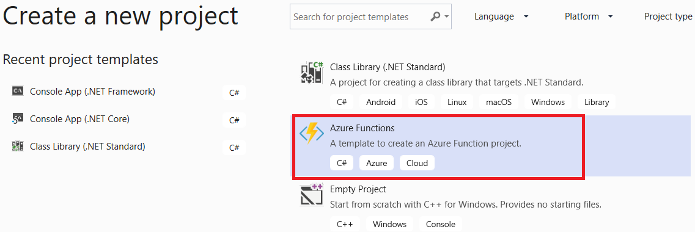

1.  为你的项目选择一个名称（在这里，我使用 EmailValidator），选择一个保存项目文件的位置，并点击创建：

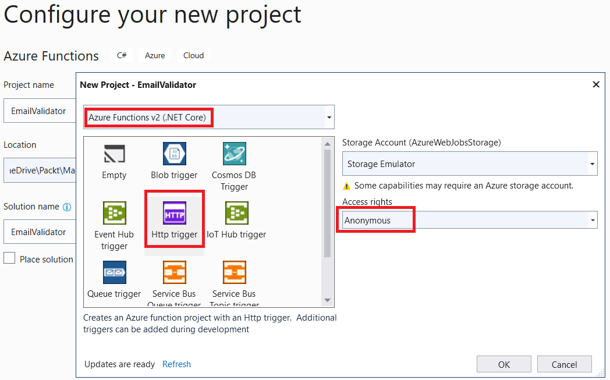

1.  接下来，你需要选择你的 Azure 函数的运行时版本：

    +   Azure Functions v2 (.NET Standard)：基于 .NET Core（跨平台），这是新的可用运行时。

    +   Azure Functions v1 (.NET Framework)：基于 .NET Framework，仅支持在 Azure 门户或 Windows 计算机上进行开发和托管。

在这里，我选择了 Azure Functions v2 (.NET Core)。

1.  然后，你需要选择 Azure 函数类型（我选择了 Http 触发器，因为我希望创建一个可以通过 HTTP 调用的函数），为了简单起见，我选择了*匿名*作为我们函数的访问权限（无需身份验证，任何人都可以使用；我们将在本章的 *管理 Azure 函数密钥* 部分讨论这一点）。

1.  现在，点击 OK 来创建解决方案。这是你在 Visual Studio 中看到的项目树：

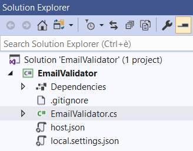

在这里，你会看到以下文件：

+   `host.json`：这个文件包含影响项目中所有函数的全局配置选项。在我们的项目中，我们有运行时版本（2.0）。

+   `local.settings.json`：这个文件包含你的项目设置。

+   `EmailValidator.cs`：这是你函数的源代码（C#）。

我们函数的实现非常简单。它接收一个 `email` 参数作为输入（通过 GET 或 POST 请求），验证邮箱地址，然后返回一个 JSON 响应，说明该地址是否有效（这是一个名为 `EmailValidationResult` 的自定义对象）。

函数代码定义如下：

```
[FunctionName("EmailValidator")]
public static async Task<IActionResult> Run(
    [HttpTrigger(AuthorizationLevel.Anonymous, "get", "post", Route = null)] HttpRequest req,
     ILogger log)
{
     log.LogInformation("C# HTTP trigger function processed a request.");
     string email = req.Query["email"];
     string requestBody = await new StreamReader(req.Body).ReadToEndAsync();
     dynamic data = JsonConvert.DeserializeObject(requestBody);
     email = email ?? data?.email;

     //Validating the email address
     EmailValidationResult jsonResponse = new EmailValidationResult();
     jsonResponse.Email = email;
     jsonResponse.Valid = IsEmailValid(email);
     string json = JsonConvert.SerializeObject(jsonResponse);

     return email != null
           ? (ActionResult)new OkObjectResult($"{json}")
           : new BadRequestObjectResult("Please pass a email parameter on the query string or in the request body");
}
```

这个函数从输入中获取 `email` 参数，并调用 `IsEmailValid` 函数。

这个函数通过使用 `System.Net.Mail.MailAddress` 类来验证电子邮件地址，如下所示：

```
static bool IsEmailValid(string emailaddress)
{
    try
    {
        System.Net.Mail.MailAddress m = new System.Net.Mail.MailAddress(emailaddress);
        return true;
    }
    catch (FormatException)
    {
        return false;
    }
}
```

在电子邮件验证后，函数会创建一个 `EmailValidationResult` 对象，并用响应值进行序列化，最后返回 JSON 响应。这个 `EmailValidationResult` 对象定义如下：

```
public class EmailValidationResult
{
    public string Email { get; set; }
    public bool Valid { get; set; }
}
```

现在我们已经测试了函数，是时候将其本地发布了。

# 本地测试 Azure 函数

Visual Studio 提供了一个模拟器，我们可以使用它来测试和调试我们的 Azure 函数，直到它部署到 Azure。如果你运行这个项目，模拟器会启动并为你提供一个本地 URL 用于测试你的函数：

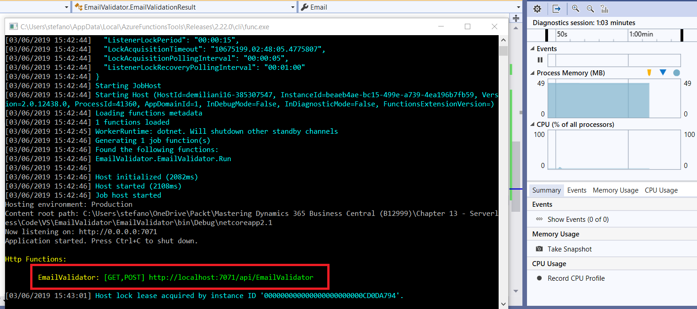

我们可以通过打开浏览器并调用一个 URL 来测试我们的函数，例如 [`localhost:7071/api/EmailValidator?email=masteringd365bc@packt.com`](http://localhost:7071/api/EmailValidator?email=masteringd365bc@packt.com)。

当被调用时，模拟器会显示请求详情：

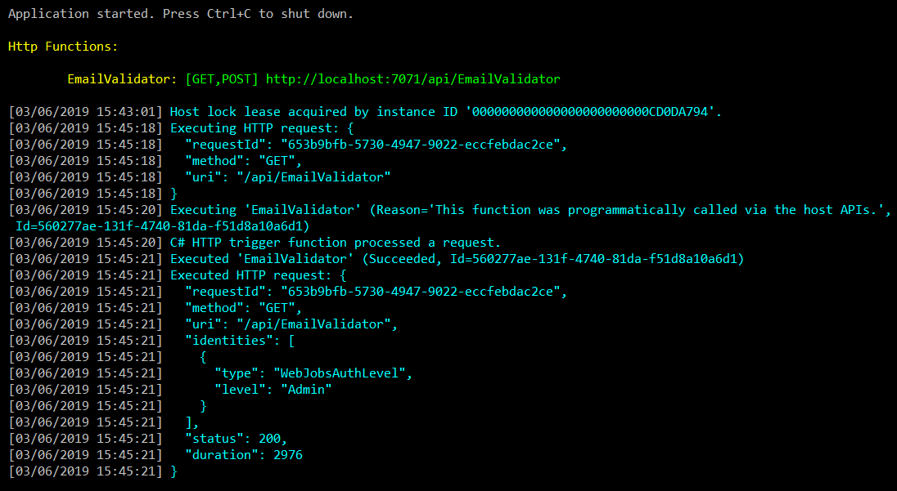

我们可以在浏览器中看到 JSON 响应。之前的调用返回以下响应对象：

```
{"Email":"masteringd365bc@packt.com","Valid":true}
```

如果我们用一个无效的电子邮件地址调用这个函数，比如 `http://localhost:7071/api/EmailValidator?email=masteringd365bc`，我们会得到以下响应对象：

```
{"Email":"masteringd365bc","Valid":false}
```

我们的函数运行正常。

现在我们已经测试了 Azure 函数，准备将其部署。

# 部署函数到 Azure

现在，我们需要将函数部署到 Azure。我们可以直接从 Visual Studio 进行部署，步骤如下：

1.  右键点击项目并选择 发布...：

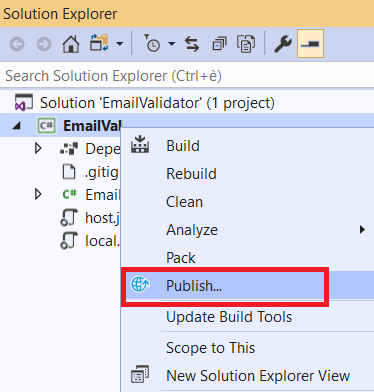

1.  我们需要选择一个 Azure 应用服务来部署函数。为此，我们可以选择一个现有的，或者创建一个新的。这里，我为这个函数创建了一个新的 Azure 应用服务实例：

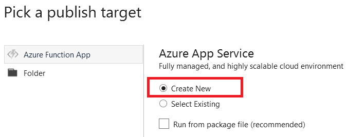

点击发布。

1.  然后，我们选择订阅、资源组（创建一个新组或使用现有的）、托管计划以及用于部署的存储账户：

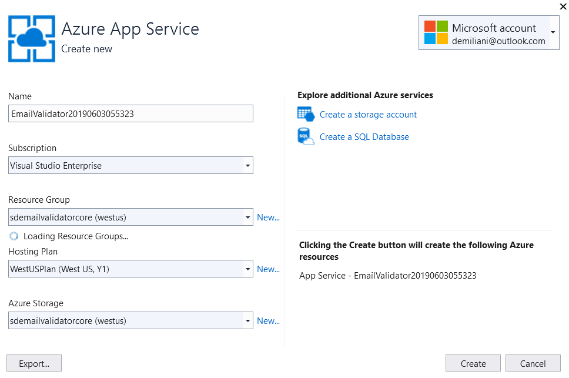

现在，点击 创建 – 我们的函数（以及所有相关资源）将被部署到 Azure。

1.  现在，我们的函数已经发布到 Azure 数据中心，并且我们有了一个公共 URL，以便使用，如下所示的截图所示：

+   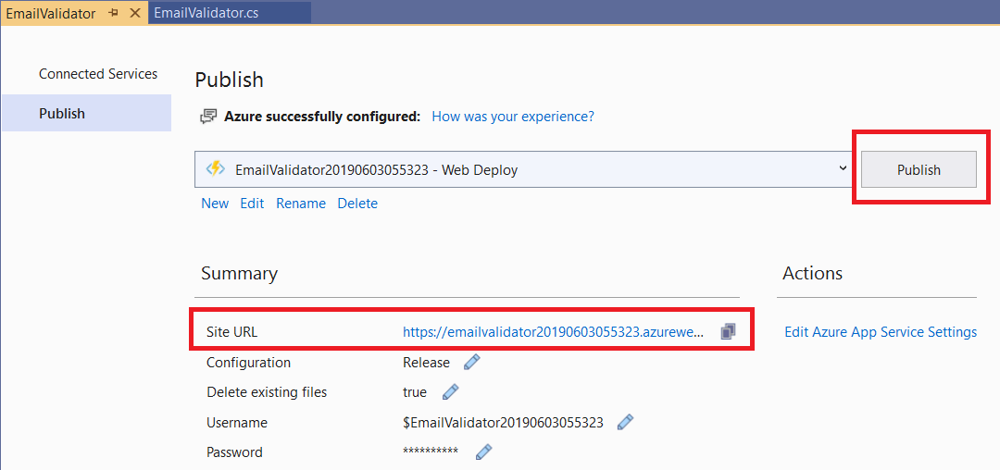

在我的示例中，公共 URL 为 [`emailvalidator20190603055323.azurewebsites.net`](https://emailvalidator20190603055323.azurewebsites.net)（你可以自定义它）。

要测试你的函数，使用以下 URL： `https://emailvalidator20190603055323.azurewebsites.net/**api/EmailValidator?email=masteringd365bc****@packt.com**`**。

现在，函数已在 Azure 云中运行，你可以使用它了。

还有一种替代的 Azure 函数开发方式，对于任何 Dynamics 365 Business Central 开发者来说，这非常重要。我们将在下一节中查看这个方法。

# 使用 Visual Studio Code 开发 Azure 函数

要开始使用 Visual Studio Code 开发 Azure 函数，您需要安装以下扩展：

+   Azure 帐户，您可以从[`marketplace.visualstudio.com/items?itemName=ms-vscode.azure-account`](https://marketplace.visualstudio.com/items?itemName=ms-vscode.azure-account)下载。

+   您可以从[`marketplace.visualstudio.com/items?itemName=ms-azuretools.vscode-azurefunctions`](https://marketplace.visualstudio.com/items?itemName=ms-azuretools.vscode-azurefunctions)下载 Azure Functions。

您还需要安装 Azure Functions Core Tools，这是一个工具集，允许您在本地机器上开发和测试您的函数。

您需要安装支持您正在使用的 Azure Functions 运行时的版本。您可以在[`github.com/Azure/azure-functions-core-tools`](https://github.com/Azure/azure-functions-core-tools)安装此版本。

要使用 Visual Studio Code 开发 Azure 函数，请按照以下步骤操作：

1.  您需要做的第一件事是通过 Visual Studio Code 命令面板中的 Azure: Sign In 命令登录到您的 Azure 订阅：

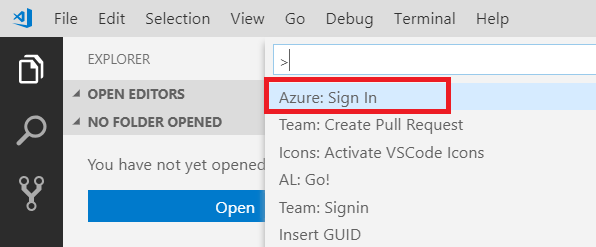

输入凭据后，您将在 Visual Studio Code 的底部栏看到与您的订阅关联的帐户。

1.  现在，在 Visual Studio Code 侧边栏中，选择 Azure Functions 扩展并点击“创建新项目”按钮：

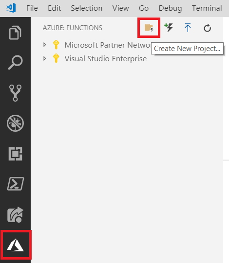

选择一个文件夹，将您的 Azure Functions 项目放在其中。

1.  然后，系统会提示您选择用于开发函数的语言。在支持的语言列表中，我选择了 C#，如图所示：

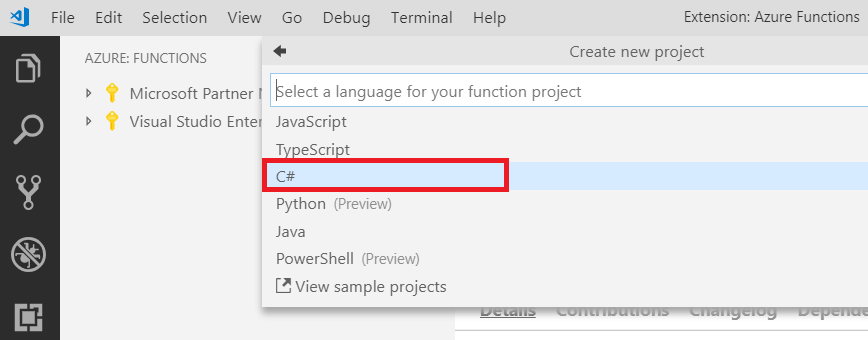

1.  接下来，您需要为您的 Azure 函数选择以下任一运行时版本：

    +   Azure Functions v2（.NET Standard）：基于 .NET Core（跨平台），这是新的可用运行时。

    +   **A**zure Functions v1（.NET Framework）：基于 .NET Framework，仅支持在 Azure 门户或 Windows 计算机上进行开发和托管。

在这里，我选择了 Azure Functions v2（.NET Standard）：

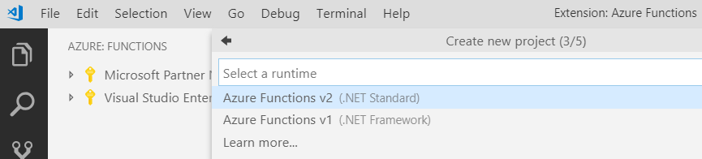

1.  现在，为您的 Azure Functions 项目设置一个名称（在这里，我将其命名为`EmailValidatorCore`）：

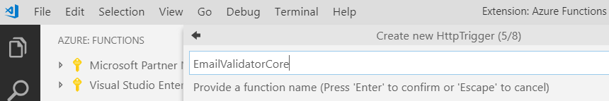

1.  命名项目后，提供一个命名空间：

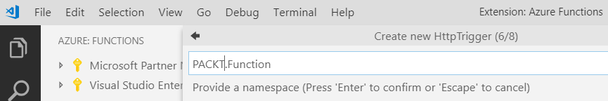

1.  现在，您需要选择函数的认证类型。为了简便起见，我选择了匿名（每个人都可以调用我们的函数）：

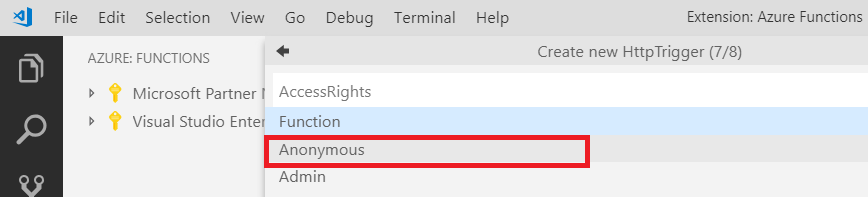

1.  现在，选择打开将创建的项目的位置（当前窗口、新窗口和添加到工作区是可用的选项）。

Visual Studio Code 将开始下载你的 Azure Functions 项目所需的包，下载完成后，将创建一组文件。以下是你的 Azure 函数的模板：

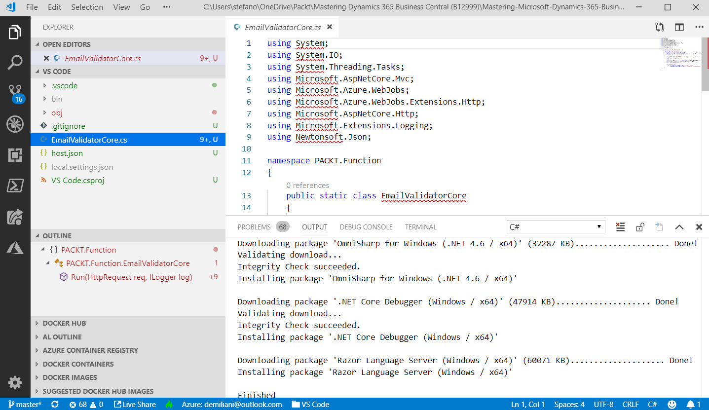

在这里，你会看到以下文件：

+   `host.json`：此文件包含影响项目中所有函数的全局配置选项。在我们的项目中，我们有运行时版本（2.0）。

+   `local.settings.json`：此文件包含你的项目设置。

+   `EmailValidatorCore.cs`：这是你的函数源代码（C#）。

请注意，你的代码中可能会出现一些临时错误（缺少引用）。这种情况发生在 Visual Studio Code 需要下载所有 .NET Core 包时。为了获取正确的引用，你需要从命令面板执行 .NET: Restore Project 命令，具体操作如下：

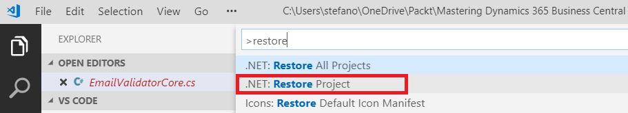

选择推荐的选项并点击确定，如下所示：

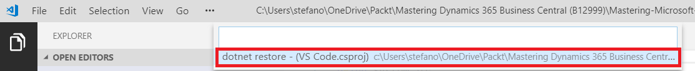

现在你的项目引用已修复，你可以开始编写函数代码了。

如同之前的示例一样，我们要创建一个用于验证电子邮件地址的函数，并且可以重用相同的 C# 代码。这里，你已经了解了如何通过直接使用 Visual Studio Code 来开始创建一个 Azure Functions 项目。

# 本地测试你的 Azure 函数

为了在本地测试你的函数，你需要安装 Azure Functions Core Tools。你可以在命令提示符（或 Visual Studio Code 终端）中使用以下命令安装：

```
npm i -g azure-functions-core-tools --unsafe-perm true
```

要在 Visual Studio Code 中使用 npm，你需要在机器上安装 Node.js。你可以从 [`nodejs.org/en/`](https://nodejs.org/en/) 安装它。

当你运行 `npm` 命令时，某些包会被下载并安装到你的本地机器上：

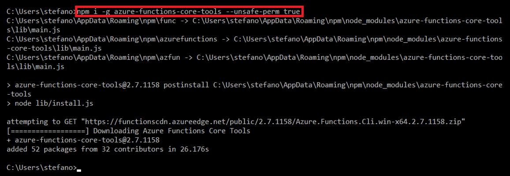

安装工具后，你需要重启 Visual Studio Code 以使其生效。

要开始在本地测试你的函数，你可以直接在 Visual Studio Code 中按 *F5* 键。此时本地的 Azure Function Host 环境将启动，Visual Studio Code 会提供一个本地 URL，供你调用你的函数：

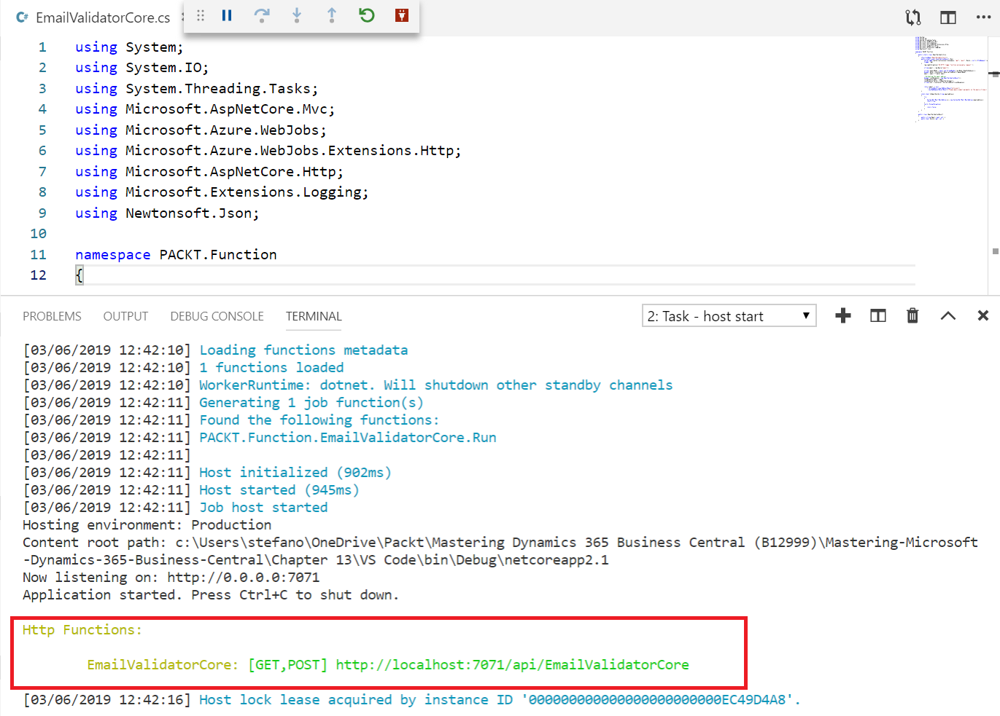

现在，我们可以通过浏览器中的 URL 传递电子邮件参数来测试该函数（就像我们在 *将函数部署到 Azure* 部分所做的那样）。

同时，我们可以通过在 Visual Studio Code 中设置断点、逐步调试、检查变量和输出等，直接调试代码，如下图所示：

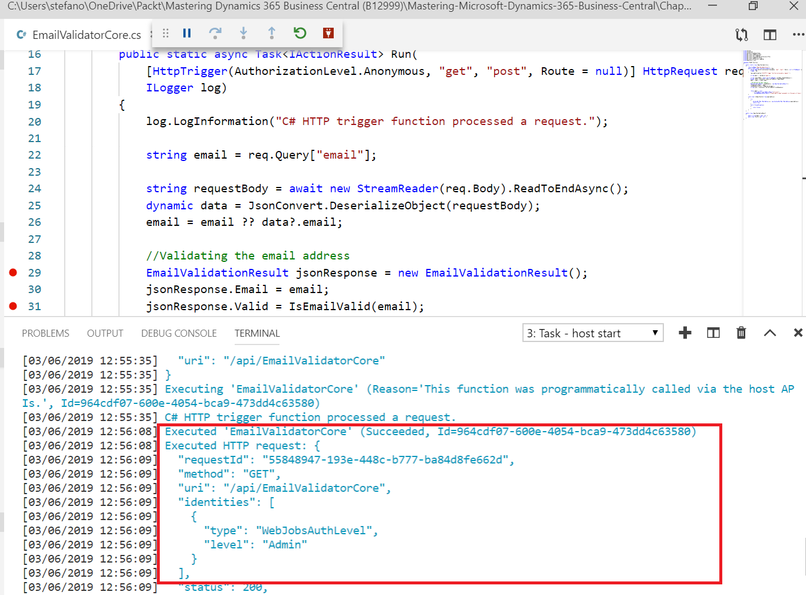

现在，你已经在本地环境中调试并测试了你的 Azure 函数。在下一部分，我们将学习如何将函数发布到 Azure 云端。

# 将你的函数发布到 Azure

要将你的 Azure 函数部署到 Azure，按照以下简单步骤进行：

1.  点击 Visual Studio Code 侧边栏中的 Azure Functions 图标，然后点击名为“部署到 Function App”的蓝色箭头图标，如下所示：

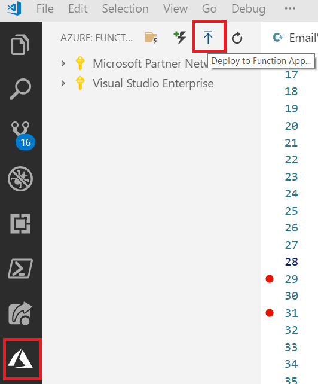

1.  Visual Studio Code 将要求您从帐户的可用订阅列表中选择一个 Azure 订阅作为部署函数的目标位置，如下所示：

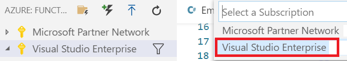

1.  现在，选择在 Azure 中创建新的 Function App 并为其指定一个全球唯一的名称：

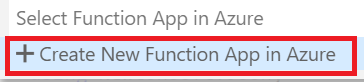

我称之为`SDEmailValidatorCore`*。

1.  从这里，您可以创建一个新的资源组和一个新的存储帐户。选择您希望部署函数的区域。然后，资源部署将开始。

1.  部署过程完成后，Visual Studio Code 将在右下角显示确认消息。你可以在左侧的订阅树视图中看到已部署的功能：

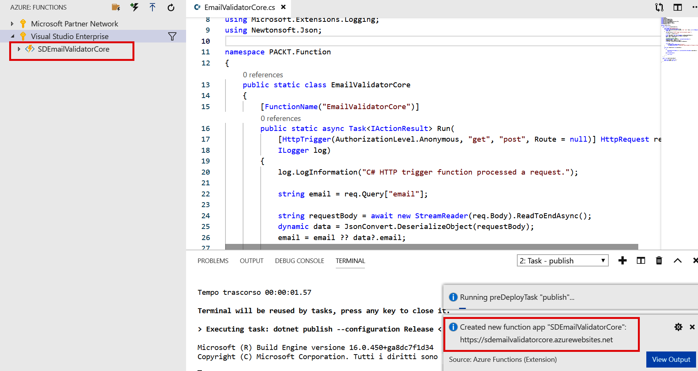

现在，您的 Azure 函数已在 Azure 数据中心运行，您可以开始在 AL 代码中使用它。我们将在下一节中更详细地讨论这一点。

# 从 AL 调用 Azure 函数

现在我们已将函数部署到 Azure，可以在扩展中的 AL 代码中使用它。

正如我们在第六章《*高级 AL 开发*》中的*从 AL 调用 Web 服务和 API*一节所解释的那样，我们可以通过使用`HttpClient`数据类型来调用 Azure 函数，该数据类型提供了一种发送 HTTP 请求和接收来自通过 URI 标识的资源的 HTTP 响应的方式。

为了测试我们的 Azure 函数，我们将创建一个简单的扩展（一个使用**AL:Go!**的新项目），它允许我们验证与客户记录关联的电子邮件地址。我们的`CustomerEmailValidation`扩展由一个代码单元对象组成，我们在其中定义了一个事件订阅者来监听`Customer`表中电子邮件字段的`OnAfterValidate`事件。在这个`EventSubscriber`过程（名为`ValidateCustomerEmail`）中，我们做了以下操作：

+   使用`HttpClient`对象调用 Azure 函数。

+   使用`HttpResponse`对象读取 Azure 函数的响应。

+   解析 JSON 响应以提取`Valid`标记。

+   如果`Valid = false`，则抛出错误。

这段代码如下所示：

```
codeunit 50100 EmailValidation_PKT
{
    [EventSubscriber(ObjectType::table, Database::Customer, 'OnAfterValidateEvent', 'E-Mail', false, false)]
    local procedure ValidateCustomerEmail(var Rec: Record Customer)
    var
        httpClient: HttpClient;
        httpResponse: HttpResponseMessage;
        jsonText: Text;
        jsonObj: JsonObject;
        funcUrl: Label 'https://sdemailvalidatorcore.azurewebsites.net/api/emailvalidatorcore?email=';
        InvalidEmailError: Label 'Invalid email address.';
        InvalidJonError: Label 'Invalid JSON response.';
        validationResult: Boolean;
    begin
        if rec."E-Mail" <> '' then begin
            httpClient.Get(funcUrl + rec."E-Mail", httpResponse);
            httpResponse.Content().ReadAs(jsonText);
            //Response JSON format: {"Email":"test@packt.com","Valid":true}
            if not jsonObj.ReadFrom(jsonText) then
                Error(InvalidJonError);
            //Read the Valid token from the response
            validationResult := GetJsonToken(jsonObj, 'Valid').AsValue().AsBoolean();
           if not validationResult then
                Error(InvalidEmailError);
        end;
    end;

    local procedure GetJsonToken(jsonObject: JsonObject; token: Text) jsonToken: JsonToken
    var
        TokenNotFoundErr: Label 'Token %1 not found.';
    begin
        if not jsonObject.Get(token, jsonToken) then
            Error(TokenNotFoundErr, token);
    end;
}
```

按下*F5*并部署你的扩展。

如果打开客户卡，转到地址和联系方式标签页，并在电子邮件字段中插入一个值，您将收到以下消息：

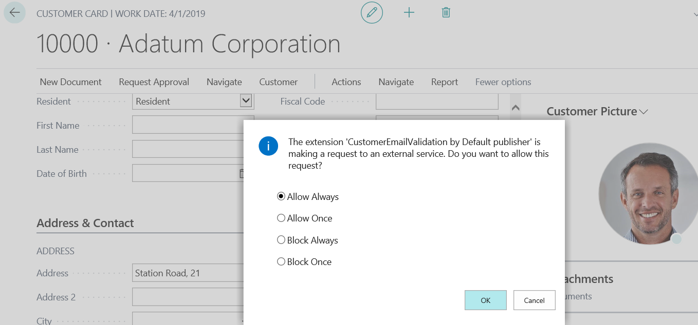

这是您第一次这样做时发生的，因为默认情况下，沙箱环境会阻止外部 HTTP 调用。请选择“允许一次”并点击“确定”。

然后，我们的 Azure 函数被调用，JSON 响应被检索并解析，验证过程开始。如果你插入一个有效的电子邮件地址，值会正确插入到电子邮件字段中；否则，你将收到一个错误，如下图所示：

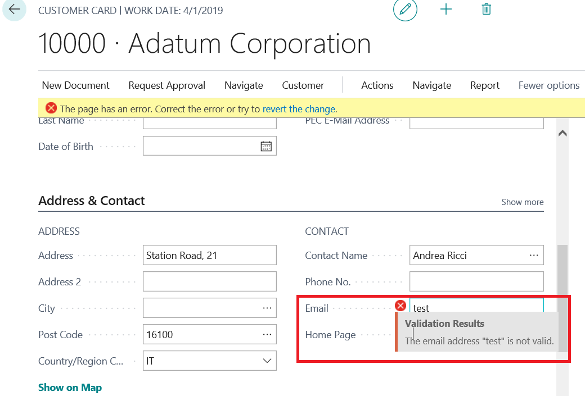

为了自动允许沙盒环境中的外部调用，在 `NAV App Settings` 表中，有一个名为 `Allow HttpClient Requests` 的布尔字段，当用户选择其中一个始终选项（始终允许或始终阻止）时，会在此表中插入一条记录，并将字段设置为 `true` 或 `false`。

你还可以通过 AL 代码以编程方式控制此设置。在我们的扩展中，我们添加了以下过程：

```
local procedure EnableExternalCallsInSandbox()
    var
        NAVAppSetting: Record "NAV App Setting";
        EnvironmentInformation: Codeunit "Environment Information";
        ModInfo: ModuleInfo;
    begin
        NavApp.GetCurrentModuleInfo(ModInfo);
        if EnvironmentInformation.IsSandbox() then begin
            NAVAppSetting."App ID" := ModInfo.Id();
            NAVAppSetting."Allow HttpClient Requests" := true;
            if not NAVAppSetting.Insert() then
                NAVAppSetting.Modify();
        end;
    end;
```

上述代码检索当前扩展的信息（`ModuleInfo`），然后检查扩展是否在沙盒环境中运行。如果是，它将 `Allow HttpClient Requests` 字段设置为 `true`。

在我们之前的事件订阅者（`ValidateCustomerEmail` 过程）中，当需要时，我们通过调用 `EnableExternalCallsInSandbox` 过程来启用外部调用，如下所示：

```
begin
    if rec."E-Mail" <> '' then begin
        EnableExternalCallsInSandbox();
        httpClient.Get(funcUrl + rec."E-Mail", httpResponse);
```

这样可以避免在每次外部 HTTP 调用时看到确认请求。

在下一节中，我们将学习如何使用 Azure Functions 和 Azure Blob 存储来处理云中的文件。

# 与 Azure Blob 存储交互以处理云中的文件

我们在 Dynamics 365 Business Central 的云环境中遇到的主要问题之一与文件保存有关。正如我们之前提到的，在云环境中，你没有文件系统，无法访问本地资源，如网络共享或本地磁盘。

如果你想在 Dynamics 365 Business Central SaaS 中保存文件，解决方案是调用 Azure 函数并将文件存储到基于云的存储中。你可以创建一个将文件保存到 Azure Blob 存储的函数，之后你可以将 Azure 存储共享为网络驱动器。这是我们将在本节中介绍的场景。

# 创建 Azure Blob 存储帐户

实现我们解决方案的第一步是需要在 Azure 上拥有一个存储帐户，并且我们需要在该存储帐户中创建一个 Blob 容器。

要手动创建一个 Azure 存储帐户（在本例中为 `d365bcfilestorage`），请按照以下步骤操作：

1.  在 Azure 门户中选择存储帐户，点击创建，并按照屏幕上的指示操作。要在此存储帐户中创建 Blob 容器，请从服务部分选择 Blobs：

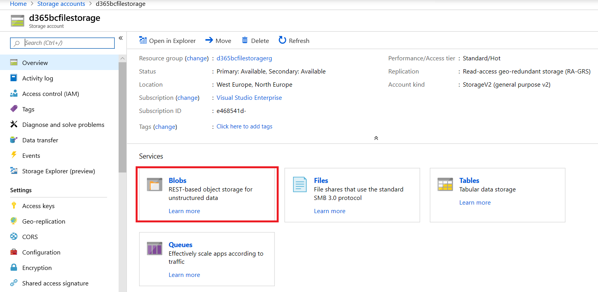

1.  然后，点击容器，给它命名（在这里，我选择了 `d365bcfiles`），选择公共访问级别（默认情况下，容器数据对帐户所有者是私密的），然后点击确定：

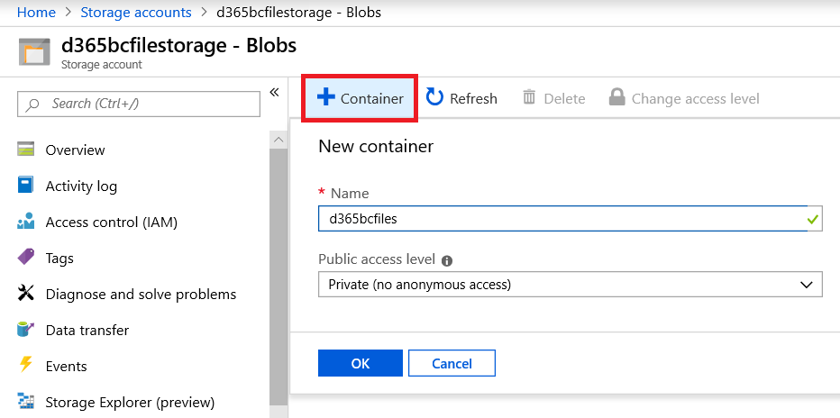

现在，Blob 容器已经在你的 Azure 存储帐户中创建。

访问 Azure 存储账户的连接字符串（必须在 Azure 函数中使用）可以通过选择存储账户并点击“访问密钥”来获取：

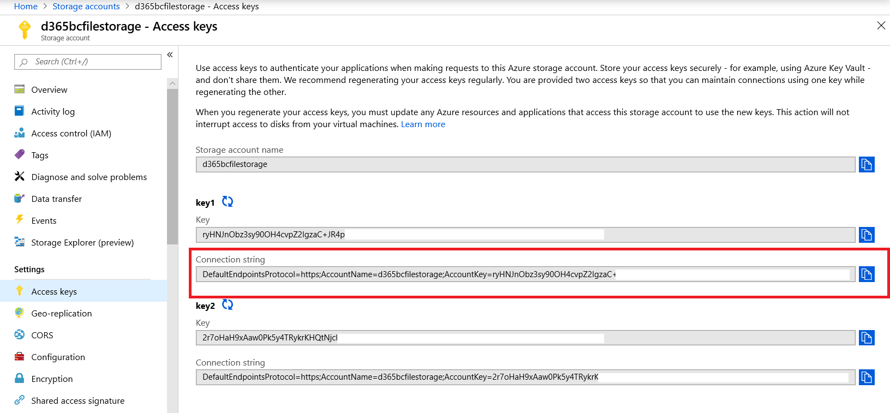

在这里，我们将把连接字符串嵌入到函数项目中，但在生产环境中，您可以将其存储在 Azure Key Vault 中，并从中检索以提高安全性。

在我们的 Blob 容器中，我手动上传了一个文件（PNG 图片）用于存储文件：

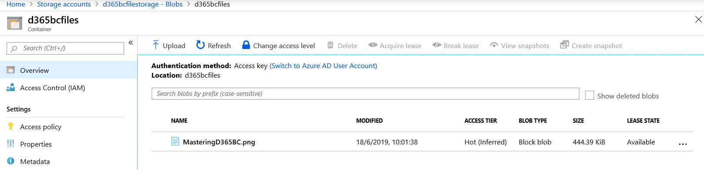

现在，我们已经在 Azure 存储上创建了一个 Blob 容器，以便托管我们的文件。在接下来的部分，我们将创建一个 Azure 函数，用于保存和检索这个 Blob 存储中的文件。

# 使用 Visual Studio 创建 Azure 函数

打开 Visual Studio，选择 HttpTrigger 模板并创建一个新的 Azure 函数项目。将函数命名为 `SaaSFileMgt`。

在我们的项目中，我们想要创建以下几个函数：

+   `UploadFile`：此函数将通过 HTTP POST 请求接收一个包含二进制数据（文件内容）和一些元数据（文件详细信息）的对象。它会将文件存储在 Azure Blob 存储账户的容器中。

+   `DownloadFile`：此函数将接收一个包含要下载文件的 URI 和其详细信息的对象（通过 HTTP POST 请求），并返回存储在 Azure Blob 存储容器中的文件的二进制数据。

+   `ListFiles`：此函数将通过 HTTP GET 请求检索存储在 Azure Blob 存储容器中的所有文件的 URI 列表。这些文件将在接下来的部分中解释。

上传/下载文件的函数必须只支持 HTTP POST 方法，因此，在 `HttpTrigger` 定义模板中，我们已经移除了 `get` 参数。这些函数的签名如下：

```
[FunctionName("UploadFile")]
public static async Task<IActionResult> Upload(
   [HttpTrigger(AuthorizationLevel.Function, "post", Route = null)] HttpRequest req, ILogger    
   log)

[FunctionName("DownloadFile")]
public static async Task<IActionResult> Download(
    [HttpTrigger(AuthorizationLevel.Function, "post", Route = null)] HttpRequest req, ILogger 
    log)
```

列出 Blob 存储中文件的函数必须只支持 GET 方法，函数签名如下：

```
[FunctionName("ListFiles")]
public static async Task<IActionResult> Dir(
    [HttpTrigger(AuthorizationLevel.Function, "get", Route = null)] HttpRequest req,
 ILogger log)
```

让我们逐一探索这些函数。

# `UploadFile` 函数

`UploadFile` 函数通过 HTTP POST 请求接收一个 JSON 对象，具体如下：

```
{
    "base64": "data:image/png;base64,iVBORw0KGgoAAAANSUhEUgAAAJAAAACVCAYAAAC3i3MLAA",
    "fileName": "MyFile.png",
    "fileType": "image/png",
    "fileExt": "png"
}
```

`UploadFile` 函数解析请求体中的 JSON，然后调用 `UploadBlobAsync` 函数。在此函数中，我们将文件上传到 Azure Blob 存储容器，并返回上传文件的 URI。

`UploadFile` 函数的代码如下：

```
[FunctionName("UploadFile")]
public static async Task<IActionResult> Upload(                
    [HttpTrigger(AuthorizationLevel.Function, "post", Route = null)] HttpRequest req,
    ILogger log)
    {
        log.LogInformation("C# HTTP trigger function processed a request.");
        string requestBody = await new StreamReader(req.Body).ReadToEndAsync();
        dynamic data = JsonConvert.DeserializeObject(requestBody);
        string base64String = data.base64;
        string fileName = data.fileName;
        string fileType = data.fileType;
        string fileExt = data.fileExt;
        Uri uri = await UploadBlobAsync(base64String, fileName, fileType,     
                    fileExt);           
        return fileName != null
            ? (ActionResult)new OkObjectResult($"File {fileName} stored. URI = {uri}")
            : new BadRequestObjectResult("Error on input parameter (object)");
}
```

`UploadBlobAsync` 是一个将文件上传到 Azure 存储账户中的 `d365bcfiles` 容器的函数。其代码如下：

```
public static async Task<Uri> UploadBlobAsync(string base64String, string fileName, string fileType, string fileExtension)
{
    string contentType = fileType;           
    byte[] fileBytes = Convert.FromBase64String(base64String);
    CloudStorageAccount storageAccount =     
        CloudStorageAccount.Parse(BLOBStorageConnectionString);
    CloudBlobClient client = storageAccount.CreateCloudBlobClient();
    CloudBlobContainer container = client.GetContainerReference("d365bcfiles");
    await container.CreateIfNotExistsAsync(
        BlobContainerPublicAccessType.Blob,
        new BlobRequestOptions(),
        new OperationContext());
    CloudBlockBlob blob = container.GetBlockBlobReference(fileName);
    blob.Properties.ContentType = contentType;
    using (Stream stream = new MemoryStream(fileBytes, 0, fileBytes.Length))
    {
        await blob.UploadFromStreamAsync(stream).ConfigureAwait(false);
    }
    return blob.Uri;
}
```

# `DownloadFile` 函数

`DownloadFile` 函数通过 HTTP POST 请求接收一个 JSON 对象，具体如下：

```
{
    "url": "https://d365bcfilestorage.blob.core.windows.net/d365bcfiles/MasteringD365BC.png",
    "fileType": "image/png",
    "fileName": "MasteringD365BC.png"
}
```

该函数从请求体中检索文件的详细信息，然后调用 `DownloadBlobAsync` 函数。接着，它返回下载文件的内容（`Base64 编码` 字符串）：

```
[FunctionName("DownloadFile")]
public static async Task<IActionResult> Download(
    [HttpTrigger(AuthorizationLevel.Function, "post", Route = null)] HttpRequest req,
    ILogger log)
{
    log.LogInformation("C# HTTP trigger function processed a request.");
    try
    {
        string requestBody = await new StreamReader(req.Body).ReadToEndAsync();
        dynamic data = JsonConvert.DeserializeObject(requestBody);
        string url = data.url;
        string contentType = data.fileType;
        string fileName = data.fileName;
        byte[] x = await DownloadBlobAsync(url, fileName);
        //Returns the Base64 string of the retrieved file
        return (ActionResult)new OkObjectResult($"{Convert.ToBase64String(x)}");            
    }
    catch(Exception ex)
    {
        log.LogInformation("Bad input request: " + ex.Message);
        return new BadRequestObjectResult("Error on input parameter (object): " + 
            ex.Message);
    }
}
```

`DownloadBlobAsync` 是连接到 Azure 存储 Blob 容器、检查文件并（如果文件存在）返回该文件的字节数组（流）的函数：

```
public static async Task<byte[]> DownloadBlobAsync(string url, string fileName)
{
    CloudStorageAccount storageAccount =
        CloudStorageAccount.Parse(BLOBStorageConnectionString);
    CloudBlobClient client = storageAccount.CreateCloudBlobClient();
    CloudBlobContainer container = client.GetContainerReference("d365bcfiles"); 
    CloudBlockBlob blob = container.GetBlockBlobReference(fileName);
    await blob.FetchAttributesAsync();
    long fileByteLength = blob.Properties.Length;
    byte[] fileContent = new byte[fileByteLength];
    for (int i = 0; i < fileByteLength; i++)
    {
        fileContent[i] = 0x20;
    }
    await blob.DownloadToByteArrayAsync(fileContent, 0);
    return fileContent;
}
```

# ListFiles 函数

`ListFiles` 函数通过 HTTP GET 请求（无参数）调用。它调用 `ListBlobAsync` 函数，然后返回存储在 Blob 容器中的文件 URI 列表（JSON 格式）。

它的代码定义如下：

```
[FunctionName("ListFiles")]
        public static async Task<IActionResult> Dir(
            [HttpTrigger(AuthorizationLevel.Function, "get", Route = null)] HttpRequest req,
            ILogger log)
        {
            log.LogInformation("C# HTTP trigger function processed a request.");
            string requestBody = await new StreamReader(req.Body).ReadToEndAsync();
            dynamic data = JsonConvert.DeserializeObject(requestBody);
            var URIfileList = await ListBlobAsync();
            string json = JsonConvert.SerializeObject(URIfileList);
            return URIfileList != null
                ? (ActionResult)new OkObjectResult($"{json}")
               : new BadRequestObjectResult("Bad request.");
       }
```

`ListBlobAsync` 函数连接到 Azure 存储容器，并使用 `ListBlobsSegmentedAsync` 方法检索存储在其中的 Blob 文件列表。

此方法通过使用 `BlobContinuationToken` 分段返回文件列表。当此令牌为 `null` 时，所有文件都会被检索：

```
public static async Task<List<Uri>> ListBlobAsync()
{
    CloudStorageAccount storageAccount = 
        CloudStorageAccount.Parse(BLOBStorageConnectionString);
    CloudBlobClient client = storageAccount.CreateCloudBlobClient();
    CloudBlobContainer container = client.GetContainerReference("d365bcfiles");
    List<Uri> URIFileList = new List<Uri>();
    BlobContinuationToken blobContinuationToken = null;
    do
    {
        var resultSegment = await container.ListBlobsSegmentedAsync(prefix: null,
                                           useFlatBlobListing: true,
                                           blobListingDetails: BlobListingDetails.None,
                                           maxResults: null,
                                           currentToken: blobContinuationToken,
                                           options: null,
                                           operationContext: null);
        // Get the value of the continuation token returned by the listing call.
        blobContinuationToken = resultSegment.ContinuationToken;
        foreach (IListBlobItem item in resultSegment.Results)
        {
            URIFileList.Add(item.Uri);
        }
    } while (blobContinuationToken != null); //Loop while the continuation token is not null.

    return URIFileList;
}
```

现在，我们已经创建了 Azure 函数，是时候部署它们了。在下一部分，我们将学习如何进行部署。

# 部署 Azure 函数

我们的 Azure 函数可以直接从 Visual Studio 部署到我们的 Azure 订阅。要将这些函数部署到 Azure，你需要创建一个新的 Azure App Service 实例，如下所示：

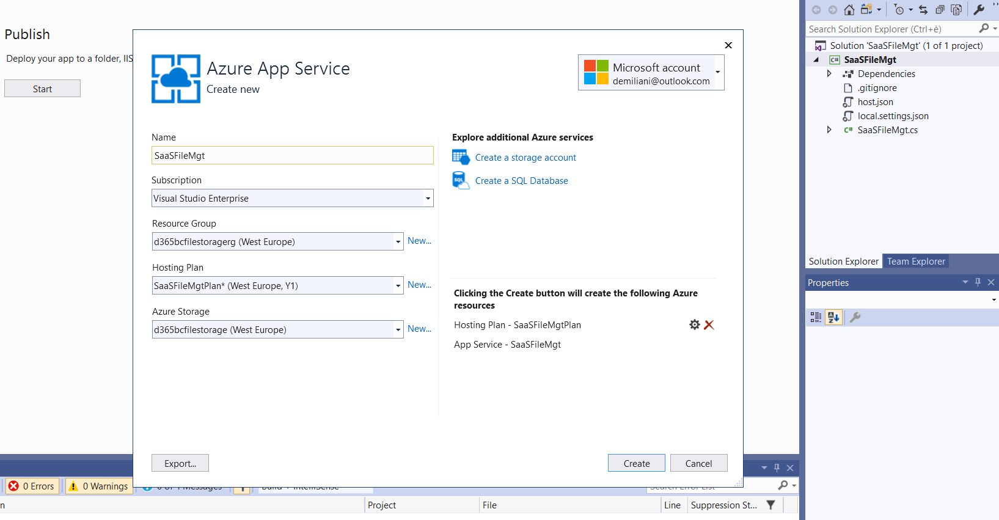

之后，将你的函数发布到这个 Azure App Service：

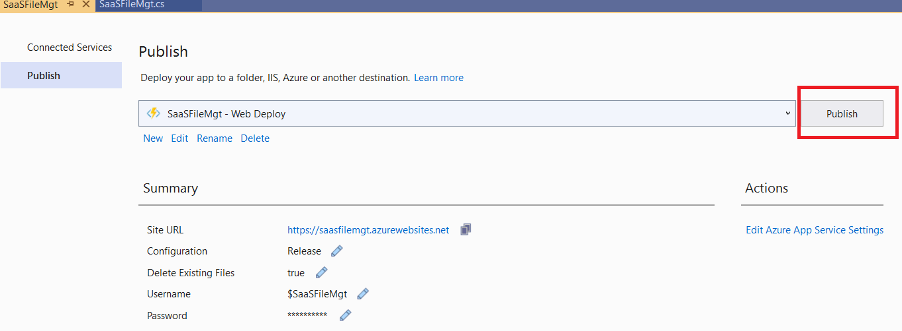

如果你进入 Azure 门户，你将看到这些函数已经发布，并且你现在有一个公共 URL 来测试它们：

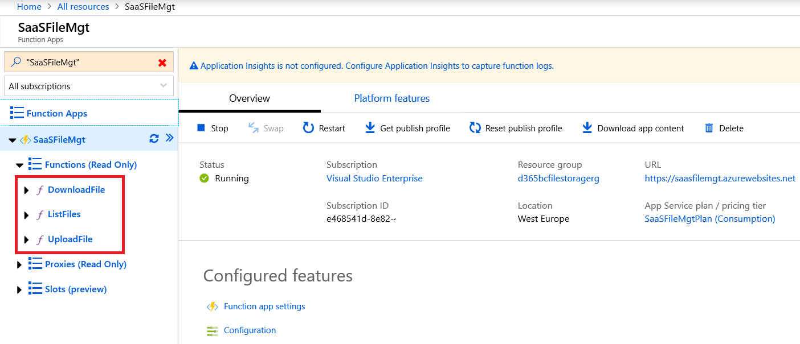

现在，函数运行在 Azure 数据中心。在下一部分，我们将学习如何管理已部署函数的访问密钥（授权）。

# 管理 Azure Functions 密钥

Azure Functions 使用授权密钥来保护对 HTTP 触发的函数的访问。当你部署一个函数时，可以在以下授权级别之间进行选择：

+   匿名：无需访问密钥。

+   函数：访问该函数需要特定的访问密钥。

+   管理员：需要主机密钥。

你可以通过从 Azure 门户选择你的函数并点击“管理”来直接管理这些访问密钥：

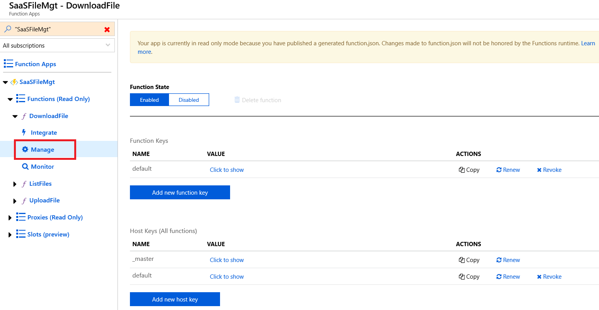

如果你想以编程方式管理密钥，还可以使用密钥管理 API（[`github.com/Azure/azure-functions-host/wiki/Key-management-API`](https://github.com/Azure/azure-functions-host/wiki/Key-management-API)）。

关于如何管理 Azure Functions 授权密钥的更多信息可以在这里找到：[`docs.microsoft.com/en-us/azure/azure-functions/functions-bindings-http-webhook#authorization-keys`](https://docs.microsoft.com/en-us/azure/azure-functions/functions-bindings-http-webhook#authorization-keys)。

在本节中，你已经学会了如何处理 Azure 函数的访问密钥。在下一部分，我们将学习如何测试我们之前部署的 Azure 函数（从 Blob 存储上传和下载文件）。

# 测试 Azure 函数

在我们的场景中，Azure 函数已使用 Function 授权级别部署，因此我们需要通过传递一个 `code` 参数和从门户中获取的函数密钥来调用所需的函数。例如，要测试 `ListFiles` 函数，我们需要调用以下 URL：[`saasfilemgt.azurewebsites.net/api/ListFiles?code=FUNCTIONKEY`](https://saasfilemgt.azurewebsites.net/api/ListFiles?code=FUNCTIONKEY)。

这是我们收到的响应（我们的 Blob 文件的 URI 列表）：

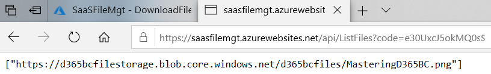

要测试 `DownloadFile` 函数，我们需要通过传递以下参数的 JSON 对象（用于标识要检索的文件）发送 POST 请求到函数的 URL。

```
{
    "url": "https://d365bcfilestorage.blob.core.windows.net/d365bcfiles/MasteringD365BC.png",
    "fileType": "image/png",
    "fileName": "MasteringD365BC.png"
}
```

从 Visual Studio Code 启动 HTTP 请求，我们得到以下响应：

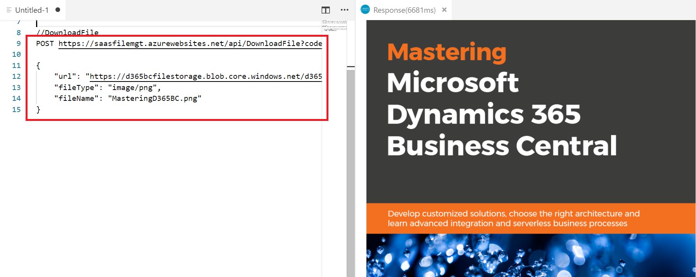

如您所见，该函数从 Azure Blob 存储下载请求的文件（函数返回 Base64 字符串）。

在下一节中，我们将学习如何从 Dynamics 365 Business Central 的 AL 扩展中调用我们的 Azure 函数。

# 编写 Dynamics 365 Business Central 扩展

我们想在此创建的扩展是一个简单的应用程序，用于在 *项目列表* 页面上添加两个操作，用于上传和下载文件到/从 Azure Blob 存储。

此 AL 扩展将定义两个对象：

+   `codeunit` 对象具有调用处理 Azure Blob 存储文件的 Azure 函数的逻辑

+   一个 `pageextension` 对象，为项目列表页面添加操作，并调用我们代码单元中定义的相关过程。

让我们更详细地查看这些内容。

# Codeunit 定义

代码单元称为 `SaaSFileMgt`，包含两个过程：

+   `UploadFile`：此函数将处理上传到 Azure Blob 存储的文件。

+   `DownloadFile`：此函数将处理从 Azure Blob 存储下载文件。

在代码单元中，我们有两个全局变量，均包含要调用的 Azure 函数的 URL：

```
var
        BaseUrlUploadFunction: Label 'https://saasfilemgt.azurewebsites.net/api/UploadFile?code=YOURFUNCTIONKEY';
        BaseUrlDownloadFunction: Label 
                'https://saasfilemgt.azurewebsites.net/api/DownloadFile?code=YOURFUNCTIONKEY';
```

这里，`YOURFUNCTIONKEY` 是我们用于访问 Azure 函数的密钥（从 Azure 门户中选择函数并单击管理获取）。

`UploadFile` 过程定义如下：

```
    procedure UploadFile()
    var
      fileMgt: Codeunit "File Management";
      selectedFile: Text;
      httpClient: HttpClient;
      httpContent: HttpContent;
      jsonBody: text;
      httpResponse: HttpResponseMessage;
      httpHeader: HttpHeaders;
      fileName: Text;
      fileExt: Text;
      base64Convert: Codeunit "Base64 Convert";
      instr: InStream;
    begin
        UploadIntoStream('Select a file to upload','','',selectedFile,instr);
        fileName := delchr(fileMgt.GetFileName(selectedFile), '=', '.' + 
                fileMgt.GetExtension(selectedFile));
        fileExt := fileMgt.GetExtension(selectedFile);
        jsonBody := ' {"base64":"' + tempblob.ToBase64String() +
                '","fileName":"' + fileName + '.' + fileExt +
                '","fileType":"' + GetMimeType(selectedFile) + '", "fileExt":"' + 
                 fileMgt.GetExtension(selectedFile) + '"}';
        httpContent.WriteFrom(jsonBody);
        httpContent.GetHeaders(httpHeader);
        httpHeader.Remove('Content-Type');
        httpHeader.Add('Content-Type', 'application/json');
        httpClient.Post(BaseUrlUploadFunction, httpContent, httpResponse);
        //Here we should read the response to retrieve the URI
        message('File uploaded.');
    end;
```

从前述代码可以看到以下内容：

1.  我们要求上传文件。

1.  我们将文件读入 `Stream` 对象中。

1.  我们检索与文件相关的一些参数（名称和扩展名）。

1.  我们按照函数请求创建 JSON 消息（如前所述）。

1.  然后，我们通过使用 `HttpClient` 对象向我们的 Azure 函数发送 HTTP POST 请求，将 JSON 放在主体中。

`DownloadFile` 过程定义如下：

```
    procedure DownloadFile(fileName: Text; blobUrl: Text)
    var
        tempblob: Codeunit "Temp Blob";
        httpClient: HttpClient;
        httpContent: HttpContent;
        jsonBody: text;
        httpResponse: HttpResponseMessage;
        httpHeader: HttpHeaders;
        base64: Text;
        fileType: Text;
        fileStream: InStream;
        base64Convert: Codeunit "Base64 Convert";
        outstr: OutStream;
    begin
        fileType := GetMimeType(fileName);
        jsonBody := ' {"url":"' + blobUrl + '","fileName":"' + fileName + '", "fileType":"' + 
                    fileType + '"}';
        httpContent.WriteFrom(jsonBody);
        httpContent.GetHeaders(httpHeader);
        httpHeader.Remove('Content-Type');
        httpHeader.Add('Content-Type', 'application/json');
        httpClient.Post(BaseUrlDownloadFunction, httpContent, httpResponse);
        httpResponse.Content.ReadAs(base64);
        base64 := DelChr(base64, '=', '"');
        base64Convert.FromBase64(base64);
        tempblob.CreateOutStream(outstr);
        outstr.WriteText(base64);
        tempblob.CreateInStream(fileStream);
        DownloadFromStream(fileStream, 'Download file from Azure Storage', '', '', fileName);
    end;
```

此过程接收要检索的文件名称作为输入。其工作方式如下：

1.  它调用一个自定义函数（`GetMimeType`），返回此文件的内容类型，然后我们为请求组合 JSON 消息。

1.  然后，我们发送一个 HTTP POST 请求到我们的 Azure 函数（通过使用`HttpClient`对象），并将 JSON 放入请求体中。

1.  我们读取`HttpResponse`对象（获取文件的 Base64 编码），并通过使用`InStream`对象并调用`DownloadFromStream`方法将其下载到客户端：

`GetMimeType`工具的定义如下：

```
local procedure GetMimeType(selectedFile: Text): Text
var
    fileMgt: Codeunit "File Management";
    mimeType: Text;
begin
    case lowercase(fileMgt.GetExtension(selectedFile)) of
        'pdf':
            mimeType := 'application/pdf';
        'txt':
            mimeType := 'text/plain';
        'csv':
            mimeType := 'text/csv';
        'png':
            mimeType := 'image/png';
        'jpg':
            mimeType := 'image/jpg';
        'bmp':
            mimeType := 'image/bmp';
        'gif':
            mimeType := 'image/gif';
        else
            Error('File Format not supported!');
    end;
    EXIT(mimeType);
end;
```

这个操作只是接收一个文件名作为输入，获取文件扩展名，然后返回与文件关联的 MIME 类型。

# `pageextension`定义

`pageextension`对象通过添加我们之前描述的两个操作来扩展 Item List 页面。该对象的定义如下：

```
pageextension 50103 ItemListExt extends "Item List"
{
    actions
    {
        addlast(Creation)
        {
            Action(Upload)
            {
                ApplicationArea = All;
                Caption = 'Upload file to Azure Blob Storage';
                Image = Add;
                Promoted = true;
                trigger OnAction();
                var
                    SaaSFileMgt: Codeunit SaaSFileMgt;
                begin
                    SaaSFileMgt.UploadFile();
                end;
            }

            Action(Download)
            {
                ApplicationArea = All;
                Caption = 'Download file from Azure Blob Storage';
                Image = MoveDown;
                Promoted = true;
                trigger OnAction();
                var
                    SaaSFileMgt: Codeunit SaaSFileMgt;
                begin
                    SaaSFileMgt.DownloadFile('TEST.txt', 'https://d365bcfilestorage.blob.core.windows.net/d365bcfiles/TEST.txt');
                end;
            }
        }
    }
}
```

这两个操作简单地通过传递所需的参数调用我们代码单元中定义的方法。

在下一节中，我们将测试集成的解决方案（由 Dynamics 365 Business Central 调用的 Azure 函数）。

# 测试我们的应用程序

现在，是时候测试我们的应用程序并查看它是如何工作的了。发布后，我们的扩展将在*Item List*页面上添加两个文件上传/下载的功能：

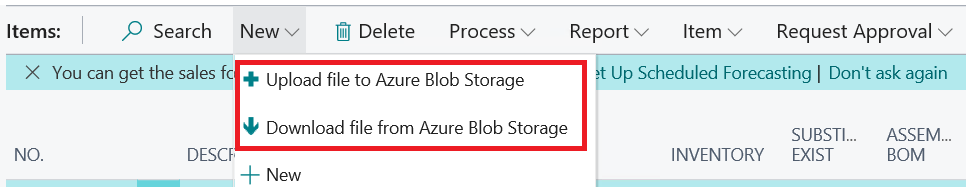

如果你点击“上传文件到 Azure Blob 存储”操作，你可以从本地计算机选择一个文件：

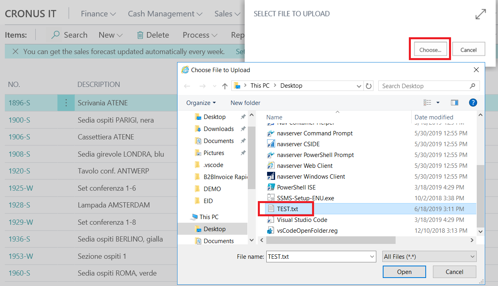

这个文件将通过 HTTP POST 请求上传到我们的 Azure Blob Storage 容器。我们可以调试`httpResponse`对象，看到它返回`HttpStatusCode = 200 (成功)`：

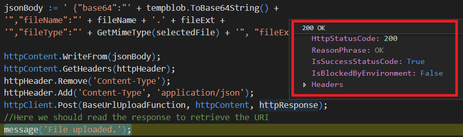

我们将收到一条消息，告诉我们文件已成功上传到 Azure Blob Storage，如下所示：

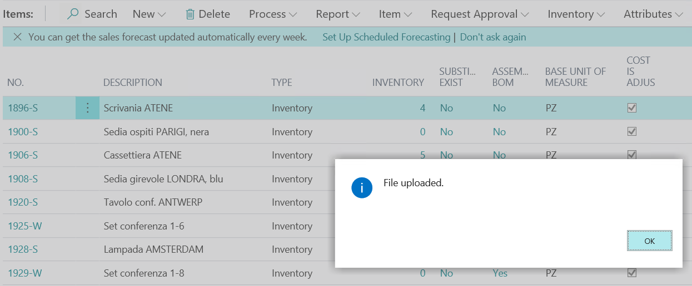

如果我们检查 Azure 存储账户中的 blob 容器，我们会看到文件已经正确上传到 blob 存储中：

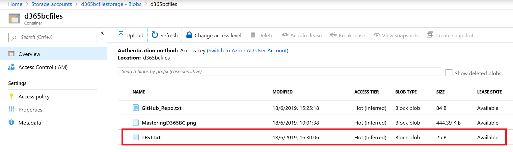

当你点击“从 Azure Blob Storage 下载文件”操作时，将执行一个 HTTP POST 请求到`DownloadFile` Azure 函数（通过传递 JSON 请求体，如我们之前所描述的），并且`httpResponse`对象返回`HttpStatusCode = 200 (成功)`。

`httpResponse`对象是获取的文件的 Base64 编码。在这里，Base64 字符串被解码，文件通过使用`InStream`下载到客户端：

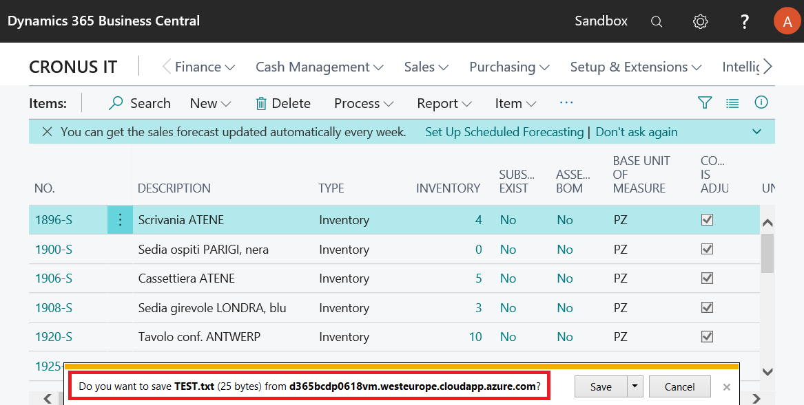

如你所见，文件是从流中获取的，浏览器提示用户将其下载到本地。

现在，你可以在云环境中处理文件（上传和下载）。Azure 还允许我们将 Blob 存储映射到我们的本地网络，从而实现一个对最终用户完全透明的无服务器文件系统。

# 总结

在本章中，我们了解了什么是 Azure 函数，以及如何在我们的 Dynamics 365 Business Central 扩展中使用它们，以便在云环境中执行.NET 代码，并实现无服务器的流程。

我们学习了如何使用 Visual Studio 和 Visual Studio Code 创建一个简单的 Azure 函数，以及如何将 Azure Functions 与其他 Azure 服务一起使用（特别是如何结合 Azure Functions 和 Azure Blob Storage，在 Dynamics 365 Business Central 中实现云端文件系统）。

阅读本章后，你应该理解如何开发、部署和使用 Azure 函数，在完全无服务器的方式下在云中实现业务任务。在现代基于云的 ERP 中，这是一个非常重要的功能，需要掌握以扩展平台功能并融入其他云服务。

在下一章，我们将学习如何在云中监控和扩展我们的函数，并通过使用 Azure DevOps，将 DevOps 技术（持续集成和持续部署）应用到我们的 Azure Functions 项目中。
