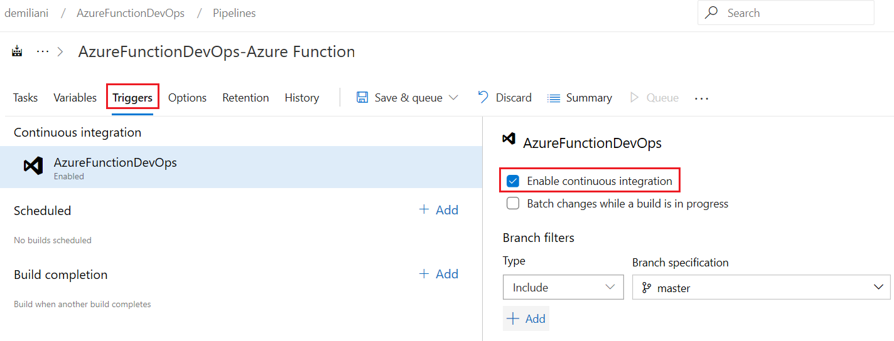

# 第十四章：监视、扩展和 CI/CD 与 Azure 函数

在上一章中，我们学习了如何使用 Visual Studio 和 Visual Studio Code 创建 Azure 函数，如何在 Azure 上发布函数，以及如何从 Dynamics 365 Business Central 扩展中调用 Azure 函数。

我们还学习了如何在 Azure 上使用 Azure 函数来实现无服务器流程，并通过实际示例了解了在 SaaS 环境中处理文件的.NET 代码的执行。理解这些主题非常重要，以便您能够在云环境中执行自定义代码，并以无服务器方式与外部服务交互。

在本章中，我们将探讨与 Azure 函数相关的其他重要方面，包括以下内容：

+   监视发布在 Azure 云中的函数

+   扩展 Azure 函数

+   将 DevOps 和 CI/CD 应用于 Azure 函数

到本章结束时，您将对 Azure 函数服务有一个完整深入的概述，并且您将对在 Microsoft Dynamics 365 Business Central 项目中使用此服务执行复杂代码和无服务器任务充满信心。

# 技术要求

要遵循本章内容，您需要具备以下条件：

+   有效的 Azure 订阅（您可以在[`azure.microsoft.com/free/`](https://azure.microsoft.com/free/)上免费激活付费或试用订阅）

+   在 Azure DevOps 中具有有效的帐户（[`azure.microsoft.com/en-in/services/devops/`](https://azure.microsoft.com/en-in/services/devops/)）

# 监视 Azure 函数

在 Azure 上管理无服务器服务时，监视 Azure 函数是一项重要任务。如果您希望拥有始终正常工作的可靠服务，您需要制定一个策略来检查函数的传入调用、错误、特定函数的可伸缩性需求等。

从 Azure 门户中选择您的 Azure 函数。通过单击*监视*，您将能够查看已记录的请求（成功和错误）。以下屏幕截图显示了这一点：


如果您选择单个请求，您可以查看其调用详细信息：


对于更高级的日志记录，您可以单击在应用洞察中运行（必须从门户激活）：


在这里，您还可以在函数的遥测中执行自定义查询。例如，这是一个关于遥测日志的查询，显示过去 20 分钟内每个工作角色（函数）的请求次数：

```
requests
| where timestamp > ago(20m)
| summarize count() by cloud_RoleInstance, bin(timestamp, 1m)
| render timechart
```

以下是此内容的输出：


下面是一个在应用洞察中执行的有用查询，用于检索函数中的错误：

```
traces 
| where customDimensions.LogLevel == "Error"
```

当配置了应用程序洞察（Application Insights）时，你将拥有一个漂亮的面板，能够立即查看函数中的所有事件（失败的请求、服务器响应时间、服务器请求次数、可用性等）：


应用程序洞察是一个重要的检查部分，如果你希望发现故障并确定函数是否表现良好或需要扩展，可以查看此功能。以下截图展示了这一点：


有关如何高效使用应用程序洞察的更多信息，请访问[`docs.microsoft.com/en-us/azure/azure-functions/functions-monitoring`](https://docs.microsoft.com/en-us/azure/azure-functions/functions-monitoring)。

正如你所看到的，应用程序洞察是一个极其强大的工具，能帮助你监控实时服务并管理函数日志。我建议你始终启用它，以便将 Azure 上的无服务器平台保持在可控状态。接下来，我们来了解 Azure Functions 的工作原理。

# 扩展 Azure Functions

在生产环境中使用 Azure Functions 时，扩展性是一个重要的检查方面，因为它允许你优化服务，避免瓶颈或资源短缺。

Azure Functions 在两个不同的计划上执行：

+   **消费计划**：你为所消耗的资源付费。应用根据功率需求自动扩展或缩减。计费依据是执行次数、执行时间和应用使用的内存。

+   **高级计划**：这与消费计划非常相似（根据请求的功率自动处理扩展）。你的计费取决于每秒核心数和每秒使用的内存 GB 总量，涵盖了所有实例。高级计划增加了以下功能：

    +   始终预热实例以避免冷启动

    +   VNet 连接

    +   无限执行时长

    +   高级实例大小（一个核心、两个核心和四个核心实例）

    +   可预测的定价选项

    +   高密度应用分配，适用于包含多个函数应用的计划

你可以通过 Azure 门户中的概述选项卡查看函数使用的托管计划：


你的 Azure 函数还可以在与其他云应用程序（如 App Service 应用）相同的专用环境中运行。这被称为**应用服务计划**，你为同一应用服务计划中的所有函数支付相同的配额。当你使用应用服务计划时，可以手动扩展（例如通过添加更多虚拟机实例）或自动扩展（通过启用自动扩展）。

有关此计划的更多信息，请参见[`docs.microsoft.com/en-us/azure/app-service/overview-hosting-plans`](https://docs.microsoft.com/en-us/azure/app-service/overview-hosting-plans)。

现在，您清楚地了解了在将函数部署到 Azure 时可用的扩展和相关计费选项。根据您的业务需求，您应选择您希望使用的计划。

# Azure Functions 和 DevOps

在本节中，我们将讨论 DevOps 技术，特别是如何使用 Azure DevOps 为您的 Azure Functions 创建 CI/CD 过程。

首先，为了实现源代码管理，您的函数代码必须托管在 Git 仓库中。这里，我们使用 Azure DevOps 作为我们的 CI/CD 过程的仓库：

1.  首先，在 Azure DevOps 中创建一个新项目。此项目将包含您的源代码的 Git 仓库。点击左侧的**Repos**菜单，您将看到此仓库的 URL。使用以下命令将其克隆到您的本地文件夹：

```
Git clone https://demiliani@dev.azure.com/demiliani/AzureFunctionDevOps/_git/AzureFunctionDevOps
```

1.  在这个本地仓库中，我已将我们之前使用 Visual Studio 开发并提交的 `EmailValidator` Azure 函数的所有项目文件放置其中。然后，我们将所有文件推送到我们的在线 Azure DevOps 仓库，如下图所示：


我们的代码现在已在 Azure DevOps 上。

1.  现在，我们想为我们的 Azure Functions 项目创建一个构建管道。从 Azure DevOps 项目页面，选择 Pipelines | Builds 并点击新建管道（New Pipeline）。在“您的代码在哪里？”页面，点击使用经典编辑器（Use the classic editor）以在没有 YAML 的情况下创建管道：


1.  现在，您需要选择代码将托管在哪里。选择 Azure Repos Git，并从列表中选择一个仓库（您应该只为所选项目拥有一个仓库）以及一个分支：


1.  点击继续（Continue）。在选择模板页面上，您需要为构建管道选择一个模板。向下滚动列表，选择适用于 .NET 的 Azure Functions，然后点击应用（Apply）：


您的构建管道将根据您选择的模板创建。

1.  点击保存并排队（Save & queue）：


1.  现在，会出现一个新的保存构建管道和排队窗口。在这里，再次点击保存并排队（Save & queue）：


1.  现在，您的构建管道已排队。在屏幕顶部，您应该看到类似以下的消息：


1.  如果点击构建号，您将看到已执行的构建步骤：


构建过程正在进行，而且好的一点是，您还会收到一封电子邮件，通知您构建结果。

我们手动触发了构建，但一个优秀的开发者通常是个懒开发者，因此我们希望在每次提交到主分支时自动触发构建。让我们来看一下如何做到这一点：

1.  要定义构建触发器，选择构建管道并点击**编辑**（Edit）：


1.  在这里，选择触发器并点击启用持续集成：



1.  点击“保存并排队”并选择“保存”选项。

现在，当您向代码库推送新的代码修改时，构建会自动触发。

如果我们希望在每次提交时自动部署 Azure 上的函数项目，我们必须创建一个发布流水线。让我们来学习如何做到这一点：

1.  要在 Azure DevOps 上创建发布流水线，请选择“流水线”|“发布”，然后点击“新建流水线”。接着，选择“Azure 应用服务部署”并点击“应用”：


1.  在下一屏幕中，点击左侧“工件”部分的“添加”：


1.  在“添加工件”页面上，选择“构建”作为源类型。然后，选择您的构建流水线并点击“添加”：


1.  现在，点击“阶段 1”上的红色感叹号查看构建任务：


在这里，您需要选择一个 Azure 订阅，并将应用类型设置为 Windows 上的“函数应用”。

1.  要使用 Azure 订阅，您需要在做出选择后点击“授权”按钮（如果弹出窗口拦截器已开启，需要禁用它）：


1.  当您的订阅已被授权后，选择应用服务名称：


1.  然后，点击“保存”。这样，您的发布流水线将被保存并准备好：


1.  要在 Azure DevOps 上手动创建一个新发布，请选择“流水线”|“发布”，然后点击“创建发布”。在“创建新发布”页面上，不要更改任何内容，只需点击“创建”：


1.  新的发布将会被排队：


1.  如果您点击发布名称，您将被重定向到发布进度页面：


1.  如果您的发布流水线成功，您的函数将被自动部署到 Azure 应用服务：


1.  最后，为了完全启用持续部署流程，我们需要再次编辑发布流水线，并点击持续部署图标：


1.  在这里，我们需要启用“持续部署触发器”选项：


就这样！我们已经为我们的 Azure 函数设置了 CI/CD 流程。

使用此过程，并通过 Azure DevOps，您可以自动构建并发布（部署）一个 Azure 函数到您的云环境中，整个过程都在一个托管平台上完成。

# 概要

在本章中，我们学习了如何监视 Azure 函数，如何监控传入的调用和日志，以及如何使用 Application Insights 进行高级分析。

总的来说，我们学习了如何为我们将在云端部署的功能选择最佳的服务计划，接着我们又学习了如何实施 CI/CD 技术，以创建一个智能的云端功能部署流程。

现在，您已经清楚地了解了可用于在 Azure 上部署和监控服务的选项，并且学会了如何为您的业务案例选择最佳的部署模型。您还学会了如何在开发流水线中激活 CI/CD 流程，从而在 Azure 上构建和部署功能。

在下一章中，我们将讨论如何将 Dynamics 365 Business Central 与*Microsoft Power Platform*集成，特别是如何使用*Flow*和*PowerApps*与 Dynamics 365 Business Central 配合，实施“零编码”业务流程。
