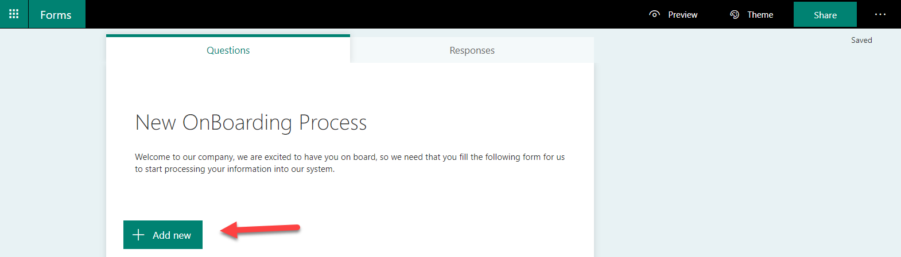
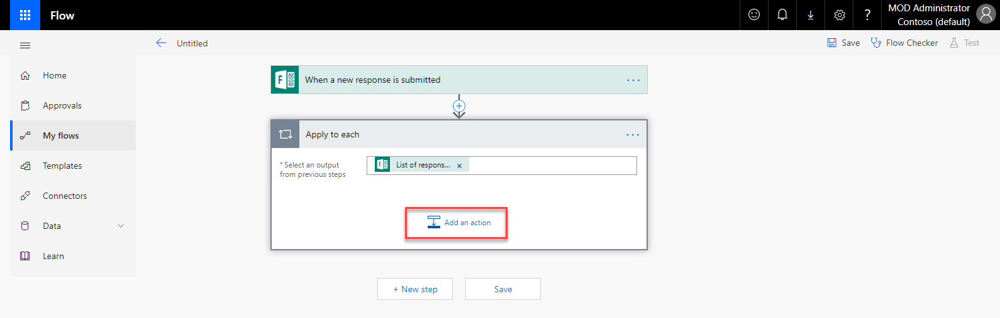
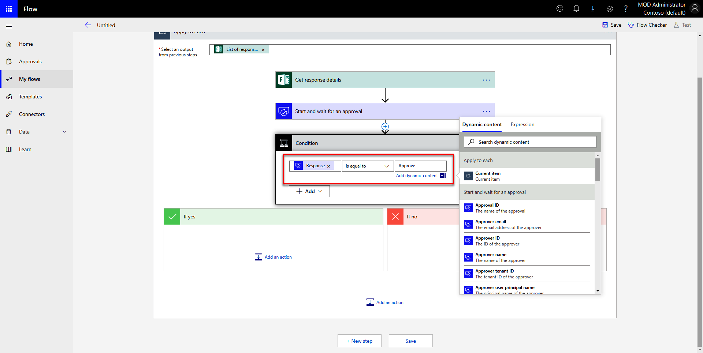
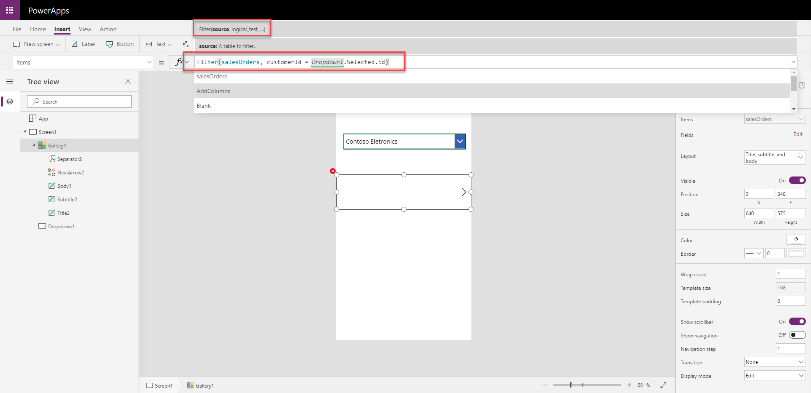

# 第十五章：Business Central 与 Power Platform 的集成

在上一章中，我们看到如何使用 Azure 服务结合 Dynamics 365 Business Central 来实现现代无服务器业务流程，并且我们对如何从 AL 中使用 Azure Functions 进行了广泛的概述。

在本章中，我们将介绍 Dynamics 365 系列中的一个重要部分：*Microsoft Power Platform*。我们将涵盖以下主题：

+   Microsoft Power Platform 介绍

+   Microsoft Flow 和 PowerApps 概述

+   使用 Flow 和 PowerApps 与 Dynamics 365 Business Central 生态系统集成来实施现实场景的实现

本章结束时，您将对 Power Platform 有一个完整的概览，并能够以低代码方式使用 Flow 和 PowerApps 来实现与 Dynamics 365 Business Central 的自定义解决方案和工作流。

# 技术要求

为了跟随本章中的示例，您需要以下内容：

+   具有 Flow 和 PowerApps 访问权限的 Office 365 订阅

+   一个活跃的 Dynamics 365 Business Central 在线租户

# Power Platform 介绍

**Power Platform** 将 **Flow**、**PowerApps** 和 **PowerBI** 等应用程序的功能结合成一个统一的商业应用平台。Satya Nadella 在他的演讲中多次直接解释了这个平台在 Microsoft 生态系统中的重要性。在现代商业应用程序的实现中，我们需要认真考虑 Power Platform。

该平台采用 *分析、行动和自动化* 范式。Power Platform 的每个组件都建立在 *应用程序的通用数据服务*（一个允许用户快速集成程序、构建新的自定义应用程序并创建自动化工作流的平台）之上，并且该平台将数据汇聚到一个叫做 *通用数据模型* 的结构中。

该平台的架构如以下图所示：


**Flow** 和 **PowerApps** 是基于低代码开发的平台，由 Microsoft 制造，为我们所说的 **强大用户** 提供强大的工具——这些用户通常没有技术背景，但完全参与并深入了解业务，他们熟知所有的业务规则、流程例外和其他业务方面，能够从最终用户的角度了解系统可以做什么。

所以，我们已经解释了 Power Platform 是什么以及它的构建块是什么。由于这些工具已经可以使用，为什么不将其与 Dynamics 365 Business Central 结合起来，为那些强大用户提供更多的能力，来创建应用程序、集成和业务逻辑工作流，并为我们的企业构建一个完全集成和管理的平台呢？

在接下来的部分中，我们将回顾 Flow 和 PowerApps 的概述，并展示一些涉及 Dynamics 365 Business Central 与 Power Platform 联动的真实世界解决方案。

# 了解 Flow

**Flow** 是一个平台，旨在通过连接器和触发器提供创建自动化工作流的方式，并将 Microsoft 和非 Microsoft 技术集成在一起。这些工具对最终用户开放，使他们可以以可视化的方式构建业务流程。更多信息请参见 [`us.flow.microsoft.com/en-us/`](https://us.flow.microsoft.com/en-us/)。

Flow 拥有超过 180 个不同的连接器，您可以通过操作和触发器使用它们来构建自动化工作流。这些连接器之一是 **Dynamics 365 Business Central 连接器**，它是从 Flow 与 Dynamics 365 Business Central 交互的标准连接器。该连接器可通过 [`us.flow.microsoft.com/en-us/connectors/?filter=business+central&category=all`](https://us.flow.microsoft.com/en-us/connectors/?filter=business+central&category=all) 获取。

使用 Flow 的最大优势之一是，它为我们提供了一种可视化的方式来构建自动化工作流，使我们能够将 Dynamics 环境中的数据与外部平台交互、创建审批流程、发送通知操作等应用程序，且操作简便。

如下图所示，Microsoft 还为我们提供了许多现有模板，帮助我们快速创建第一个 Flow 工作流：


更多信息请参见 [`us.flow.microsoft.com/en-us/templates/`](https://us.flow.microsoft.com/en-us/templates/)。

通过按 `business central` 筛选模板，您可以看到所有可用的模板（您也可以提交您为技术社区创建的模板），如下所示：


通过这些模板，您可以玩转与其他平台集成的工作流，并且可以轻松地开始使用一个可以根据您的需求进行更改的模板。

这些模板始终由社区和 Flow 团队持续改进和开发。

开始使用模板创建工作流，了解其工作原理，然后通过添加其他操作和集成来根据您的需求进行更改。

如您所见，使用 Flow，您可以立即在现有的 Dynamics 365 Business Central 解决方案中使用大量现成的任务（工作流），而无需编写一行代码。只需使用连接器并通过几次点击即可启动工作流。

在下一部分，我们将概览 PowerApps，看看它在实现您的解决方案时能提供什么。

# 了解 PowerApps

**PowerApps** 是一个平台，旨在创建可在手机、平板电脑和网页浏览器上使用的商业应用程序，所有这些都使用非常简便的用户界面。它还通过连接器将这些应用程序与 Microsoft 和非 Microsoft 平台集成。

这些应用的分发、权限、许可和身份验证基于 Microsoft 365 许可证，因此它已经与您的 Microsoft 365 环境完全集成。

关于 PowerApps 及其许可的更多信息，请访问[`powerapps.microsoft.com/`](https://powerapps.microsoft.com/)。

在**PowerApps Studio** ([`web.powe`](https://web.powerapps.com)[r](https://web.powerapps.com)[apps.com](https://web.powerapps.com))中，你可以轻松创建应用：


由于 PowerApps 也使用与 Flow 相同的连接器概念，我们还可以创建与 Dynamics 365 Business Central 环境中的数据连接并交互的应用，从而为我们提供了一种方式，创建可以在浏览器和移动设备上运行的业务应用，并且能够在 Dynamics 365 Business Central 中执行业务逻辑。

在接下来的部分中，我们将学习如何在实际场景中使用 Flow 和 PowerApps 与 Dynamics 365 Business Central 结合，并实现一个现代化的业务解决方案。

# 与 Power Platform 的集成场景

现在我们已经概览了**Flow**和**PowerApps**，并且知道它们可以让我们与 Dynamics 365 Business Central 结合，构建强大的集成解决方案，从而提供更多的控制、集成和扩展性，接下来让我们讨论并学习如何将这些技术结合起来，充分发挥环境的潜力。

以下场景仅为一些帮助你头脑风暴的想法，并展示了你可以使用的一些功能。然而，这些平台非常灵活，可以适应不同的使用场景，甚至需要一本完整的书籍才能涵盖所有内容，因此请记得利用这些场景为你的日常需求提取一些想法。

# 场景 1 – 创建人力资源招聘/入职流程

在这个场景中，我们将创建一个招聘/入职流程，便于人力资源部门将表单发送给新员工，让他们填写。此数据经过审批流程后，将自动注册到 Dynamics 365 Business Central。

**使用的技术：** Microsoft Forms、Flow、Teams 和 Dynamics 365 Business Central。

首先，让我们在 Microsoft Forms 上创建表单。目标是为人力资源经理提供一种方式，生成一个外部表单，通过链接发送给新员工，员工可以在上面填写他们的数据，从而避免了需要员工亲自填写表单的繁琐程序。

创建此表单的步骤如下：

1.  使用你的 Office 365 帐户打开 Forms，[`forms.microsoft.com`](http://forms.microsoft.com)，然后点击“新建表单”。

1.  添加表单的名称和描述。

1.  现在，让我们在表单中添加一些字段，考虑到我们在 Dynamics 365 Business Central 中需要/想要的所有字段。要创建一个新字段，只需点击“+ 添加新字段”按钮：



1.  然后，选择要创建的字段类型（在这里，我选择了“选项”）：


1.  然后，选择标签：


让我们创建以下字段：

+   +   名字 (文本)

    +   姓氏 (文本)

    +   电子邮件 (文本)

    +   地址 (文本)

    +   地址城市 (文本)

    +   地址状态 (文本)

    +   地址邮政编码 (文本)

    +   电话号码 (文本)

    +   生日 (日期)

1.  最终的表单将如下所示：


在 Forms 上创建表单后，我们可以创建我们的 Flow 工作流：

1.  打开 Microsoft Flow 网站（[`flow.microsoft.com`](https://flow.microsoft.com)），使用您的 Office 365 账户登录，然后进入我的流程（My Flows）。

1.  点击“+ 新建 | 从空白创建”：


1.  让我们寻找更多的触发器。点击“搜索数百个连接器和触发器”。

1.  搜索`Microsoft Forms`，然后选择**当提交新响应时**触发器：


1.  在触发器操作中，从“表单 Id”字段中选择你的表单（新的入职流程）：


1.  现在，让我们添加一个新步骤。点击“+ 新步骤”：


1.  选择“内置”然后选择**应用于每个**：


我们将选择**当提交新响应时**触发器中的表单响应作为此“应用于每个”操作的输出。基本上，对于每个提交的响应（在此情况下，总是一个响应，这是 Flow 执行方式），我们将在工作流执行时做一些操作：


1.  现在，我们可以创建一个审批流程，在响应提交到 Dynamics 365 Business Central 之前进行验证。点击“添加一个操作”：



1.  搜索`Microsoft Forms`，并选择**获取响应详情**：


1.  在“表单 Id”字段中选择我们创建的表单，并将“响应 Id”添加为响应 Id。此操作将填写表单上的所有字段：


1.  现在，点击“添加一个操作”添加一个新步骤：


1.  搜索`Approvals`，然后选择**开始并等待审批**：


1.  审批类型将是“批准/拒绝 - 第一个回应者”（如果你愿意，可以更改为其他选项）：


1.  你可以个性化审批信息，发送给负责做出审批决策的人力资源人员：


在“分配给”字段中，我使用了固定的人员，但如果你愿意，你可以与其他应用程序创建集成，自动设置审批人。

1.  配置完批准后，我们需要处理批准人完成审批流程时的情况。在此示例中，如果得到批准，我们将在 Dynamics 365 Business Central 中创建该条目。如果被拒绝，我们将向员工发送电子邮件要求重新填写表单。为此，添加一个动作：


1.  然后，选择条件：


1.  条件必须使用来自响应的值（这是当审批流程处理多个审批时的响应集合）：


1.  我们需要检查该响应的值是否等于“批准”：



1.  如果条件为真，我们将在 Dynamics 365 Business Central 中创建该条目，并将消息发布到我们的入职 Teams 频道。在 "如果是" 框中，我们添加一个动作：


1.  搜索 `Dynamics 365 Business Central` 然后选择创建项：


1.  选择你的公司名称。在 "表格名称" 下，你可以看到我们可以使用 Flow 交互的所有表格。对于此场景，我们将使用员工表：


1.  选择员工表后，我们将能够看到所有可用的字段（所有可以通过 Flow 发送信息的字段）：


1.  让我们开始从表单响应中提取数据，并将其添加到 Dynamics 365 Business Central 动作的正确位置：


1.  现在，我们将在 Teams 频道中创建一条信息，通知人力资源团队，新的入职流程已提交并获得批准，且该条目已在 Dynamics 365 Business Central 中创建。点击添加一个动作：


1.  搜索 `Microsoft Teams` 然后点击 "以 Flow 机器人身份在频道中发布消息"。*这将自动以 Flow 机器人用户身份发布到 Teams 频道：*


1.  选择你要发布的团队和频道：


1.  在 "消息" 下，你可以添加要发布到 Teams 的文本：


1.  完成！现在，让我们添加一个动作，当审批流程被拒绝时。点击 "如果不是"，然后点击添加一个动作：


1.  之后，搜索 `Office 365 Outlook` 然后选择发送电子邮件：


在 "收件人" 字段中，添加表单上的电子邮件（记住，我们是要给员工发送电子邮件，要求他们重新填写表单）：


你可以更改 "主题" 和 "正文" 使其包含你想要的内容：


你也可以通过将“Is HTML”选项设置为“是”来更改配置，使该电子邮件能够处理 HTML 格式。

现在，我们已经有了最终的工作流，如下图所示。要保存它，请在顶部栏中为此工作流命名，并点击保存*。*如下所示：


现在，让我们试一下：

1.  打开我们以预览模式创建的表单，填写内容并点击提交：


提交后，这是你将获得的响应：


1.  访问人力资源帐户（你选择负责审批表单的帐户）以检查是否已收到审批电子邮件：


如果你点击批准，工作流将继续在 Dynamics 365 Business Central 中创建该员工，并将表单中的所有数据添加进去，同时会发布到 Teams 上：


1.  如果你可以访问你的 Dynamics 365 Business Central 租户，你将能够看到已创建的员工记录：


1.  然后，如果你访问你的 Teams 渠道，你将能够看到审批通知已经发布，如下所示：


1.  如果你点击拒绝，系统将向员工发送电子邮件，要求他们重新填写表单：


这是发送给员工的电子邮件：


这样，我们就有了一个完全自动化的员工入职流程工作流，它可以与招聘流程连接。它可以在 ERP 系统中注册新员工，通知 IT 经理等。

创建 Dynamics 365 Business Central 中表格项的相同方法也可以用于销售订单信息、采购、税务和其他你在 Dynamics 365 Business Central 中拥有的数据类型。

在这一节中，你已经看到通过使用 Flow 与 Dynamics 365 Business Central，创建自定义工作流是多么简单。我们在没有编写一行代码的情况下成功完成了这个场景。

在接下来的章节中，我们将学习如何使用 Flow 在 Dynamics 365 Business Central ERP 中实现销售订单审批工作流。

# 场景 2 – 创建一个简单的销售订单审批工作流

在这个场景中，我们将在 Dynamics 365 Business Central 中使用 Microsoft 提供的模板创建一个简单的销售订单审批工作流来处理我们的销售订单审批。

**使用的技术：** Flow 和 Dynamics 365 Business Central。

要开始创建自定义审批工作流，你可以直接从 ERP 端开始，方法如下：

1.  在 Dynamics 365 Business Central 上，进入销售菜单并点击销售订单。现在，点击新建，在新订单页面上点击请求审批，然后点击创建工作流：


1.  会向你展示流程模板，你可以选择最适合你流程的模板。我们选择名为“请求审批”的工作流模板，用于 Dynamics 365 Business Central 销售订单：


1.  你可以更改工作流，使其完全符合你的流程需求，包括与销售订单相关的信息、审批流程中的审批人，以及工作流将采取的路径（取决于回复）：


1.  在这里，我们可以选择请求的详细信息（请参见以下截图中的字段）：


1.  然后，我们可以选择行动（如果批准）并保存工作流：


1.  现在，回到销售订单界面。我们选择一个现有的销售订单，选择请求审批，然后点击*发送审批请求*（Dynamics 365 Business Central 会检查是否已经配置了工作流，并在用户点击发送审批请求时使用它）：


1.  工作流已经启动，审批人应该会收到通知以批准/拒绝该销售订单：


最终结果是，我们通过几个简单的步骤创建了一个工作流，允许通过电子邮件直接审批 Dynamics 365 Business Central 文档（如销售订单）。如前所述，我们可以通过几次点击更改整个审批流程的行为，并使这个工作流按照最适合我们业务需求的方式运作。

这是创建销售订单工作流的一种简单方法，也可以轻松地应用于 Dynamics 365 Business Central 上的其他数据类型。

# 场景 3 – 创建一个简单的应用来列出所有客户和销售报价

在这个场景中，我们将在 PowerApps 上创建一个应用，它将连接到我们的 Dynamics 365 Business Central 环境，列出所有客户，并为选定的客户列出他们的销售报价。这个应用可以在浏览器或移动设备上使用。

**使用的技术**：PowerApps 和 Dynamics 365 Business Central。

要开始创建我们的应用，执行以下步骤：

1.  使用你的 Office 365 账户打开 PowerApps Studio，访问 [`web.powerapps.com`](http://web.powerapps.com)。在 PowerApps 中有不同的应用构建方式；我们将使用**Canvas**应用从空白模板开始构建一个适用于手机布局的应用。点击从空白开始的 Canvas 应用：


1.  给你的应用起个名字，选择你想要的格式（在此示例中，我们将使用“电话格式”），然后点击“创建”：


一旦应用创建完成，你将被重定向到 PowerApps Studio，在这里我们将开始构建应用的组件。

我们需要通过使用现有连接器在 PowerApps 中将我们的应用与 Dynamics 365 Business Central 连接。这里的*连接器*概念与 Flow 中的相同。Microsoft 在所有 Power Platform 应用中都使用相同的概念。

1.  在顶部导航菜单中，选择“视图”，然后点击“数据源”：


1.  现在，添加数据源。如果你已经在任何其他 Power Platform 应用中与 Dynamics 365 Business Central（或其他平台）创建了连接，你可以直接从出现的列表中选择该连接。

1.  如果你之前没有在任何其他 Power Platform 应用中与 Dynamics 365 Business Central（或其他平台）创建连接，点击+ 新建连接，搜索`Business Central`，然后选择 Business Central 连接器，如下所示：


1.  现在，点击“创建”。通过创建连接（或选择现有连接）与 Dynamics 365 Business Central 连接，你需要选择要使用的数据集：


1.  现在，我们可以选择要在应用中使用的 Dynamics 365 Business Central 中的哪个表格。在我们的示例中，我们将选择客户表和销售报价表，然后点击“连接”：


连接已完成。现在，我们可以开始向应用中添加控件，以使用这些连接。

1.  在顶部导航菜单中，进入“插入”选项卡，在“控件”中选择“下拉控件”：


1.  默认情况下，这个下拉菜单的数据源将是一个示例，但我们可以通过进入右侧面板，进入“项目”属性，然后选择来自 Dynamics 365 Business Central 的客户表来更改它：


1.  在“值”属性中，我们可以选择从客户表中显示给最终用户的值；我们选择`displayName`：


1.  此时，我们将添加一个新控件，以显示所有针对选定客户的销售订单，这样每次我们在下拉菜单中更改客户时，它都会加载该客户的所有销售订单。在“插入”选项卡中，点击“画廊”并选择“垂直画廊”：


选择画廊后，你需要为该画廊选择数据源。这与我们之前为下拉菜单介绍的概念几乎相同。

1.  在`Items`属性中，选择`salesOrder`数据源：


1.  现在，我们可以选择画廊将使用的布局以及显示在哪些字段。在`Layout`属性中，选择名为“标题、副标题和正文”的模板：


1.  在数据部分，选择`number`作为`Title2`属性。在`Subtitle2`属性中，选择`status`：


同样，在 Body1 属性中，选择`totalAmountExcludingTax`。

现在，我们需要确保应用筛选器，以便只显示从下拉框中选择的客户的销售订单。默认情况下，当我们选择数据源时，数据将被检索而不应用任何筛选。

要做到这一点，请参考以下截图：


点击画廊。在控制属性面板中，选择`Items`属性。在函数条中，我们需要使用名为`Filter()`的命令来筛选数据源中的数据。

你可以在[`docs.microsoft.com/en-us/powerapps/maker/canvas-apps/functions/function-filter-lookup`](https://docs.microsoft.com/en-us/powerapps/maker/canvas-apps/functions/function-filter-lookup)找到更详细的信息。

让我们使用以下`Filter`公式：

```
Filter(salesOrders, Text(customerId) = Text(Dropdown1.Selected.id))
```

过滤器公式如下所示：



让我们看看这个公式到底是怎么回事。

`Filter`函数要求数据源作为第一个参数，在这种情况下，数据源将是 Dynamics 365 Business Central 中的`salesOrder`表。

`Filter`函数的第二个参数是逻辑测试。在这种情况下，我们将检查`customerId`是否等于从`salesOrder`表中选择的`Dropdown1`中的`item`，即我们在 Dynamics 365 Business Central 的客户表中选择的项目。

在这种情况下，我们使用`Text()`函数将两个参数转换为文本，以便进行比较。

现在，每当用户更改下拉框时，筛选器将会被应用，销售订单将按下拉框中选择的值进行筛选。

现在，我们只需要保存应用程序。为此，请按照以下步骤操作：

1.  在顶部导航菜单中，进入文件，输入你的应用程序名称，改变图标（如果需要），然后点击保存：


1.  现在，返回到应用程序并运行我们的应用程序。要启动应用程序，请点击右上角的播放图标：


1.  从下拉框中选择其他客户，以检查筛选器是否已应用：


这样，我们就有了一个与 Dynamics 365 Business Central 集成的应用程序，可以根据我们业务的其他流程和需求进行更改。

使用 PowerApps，我们迅速实现了一个可以在浏览器和移动设备上运行的应用程序，能够与整个组织共享，并且可以由我们的 IT 管理员进行安全管理。

# 摘要

在本章中，我们概览了 Microsoft Power Platform，特别关注了两个重要的应用程序：Microsoft Flow 和 Microsoft PowerApps。

我们看到了通过将 Microsoft Dynamics 365 Business Central 与 *Flow* 和 *PowerApps* 集成，实现三个真实世界业务场景的应用，且这一切都在零编码的情况下完成。这就是这个商业平台的强大之处！

我们还学习了如何利用整个 Dynamics 365 平台，扩展我们的 ERP 解决方案并创建现代化的业务应用程序。

在下一章中，我们将探讨另一个有趣的集成场景：如何将 Dynamics 365 Business Central 与机器学习结合使用。
