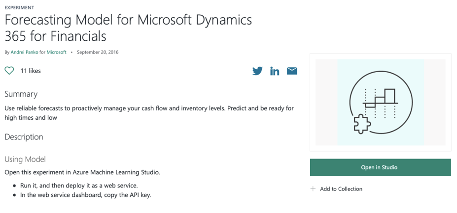
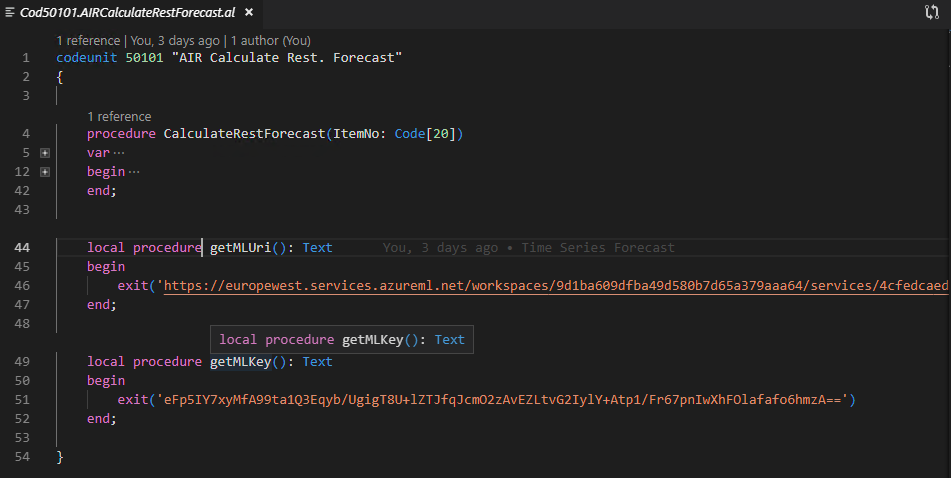
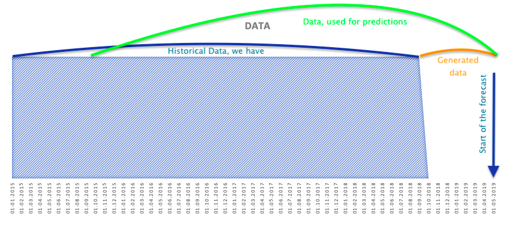
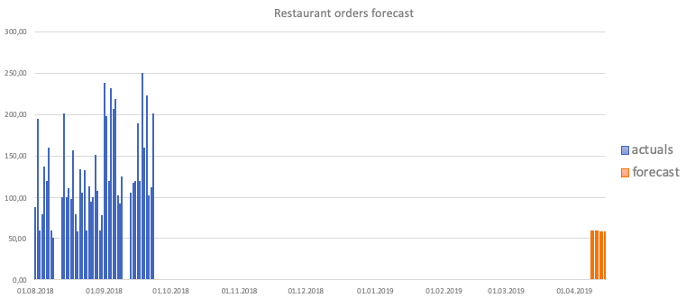
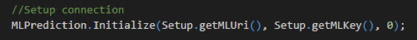

# 第十六章：将机器学习集成到 Dynamics 365 Business Central 中

在上一章中，我们概述了 Microsoft Power Platform，并且我们看到了如何结合 Flow 和 PowerApps 使用 Dynamics 365 Business Central 来解决无需编码的业务任务。

在本章中，我们将讨论一个近年来逐渐兴起的话题：**机器学习**（**ML**）与 Dynamics 365 Business Central。2019 年是**人工智能**（**AI**）的年份。你到处都能听到关于人工智能的讨论。世界告诉我们：*如果你想保持领先，应用人工智能*。但是，什么是人工智能？它与经典编程有何不同？幕后发生了什么？

本章的目标不是让你成为一名真正的数据科学家或机器学习大师，而是让你清晰理解人工智能的基础知识，并获得如何将人工智能嵌入 Dynamics 365 Business Central 项目中的一些经验。

本章将涉及以下主题：

+   机器学习是什么以及其主要过程概述

+   Dynamics 365 Business Central 机器学习框架概述

+   在你的 Dynamics 365 Business Central 应用程序中使用机器学习

+   了解预测 API

# 什么是人工智能（AI）和机器学习（ML）？

人工智能包含了人类智慧特征的任务，例如语言和语音理解、物体和声音识别以及规划。之所以使用*任务*这个词，是因为从技术上讲，你可以通过两种不同的方法来完成这些任务：经典编程和机器学习。

在 1990 年初，一些公司推出了**光学字符识别**（**OCR**）软件。他们投资了数百万美元，雇用了数百名开发人员编写代码以识别手写文本。这是使用简单工具（如`if-else`）的经典编程方法。该方法有效，但结果相当糟糕。准确率低，错误率高。

为什么这种方法失败了？因为对人类大脑来说自然的事情对于编程来说非常困难。

那么，我们如何以另一种方式解决这个任务呢？答案是机器学习！

"机器学习是机器（计算机）展示未被明确编程的行为的过程"

– 阿瑟·塞缪尔，1959 年

或者换句话说：计算机从数据中学习以执行预测分析。

正如你所看到的，创建机器学习功能时，我们需要的不是编写代码，而是数据。

所以，让我们在接下来的章节中详细讲解这个过程。

# 机器学习过程概述

根据其定义，机器学习（ML）是人工智能（AI）的一种应用，它赋予系统从经验中自动学习和改进的能力，而不是通过显式编程来实现。

这是经典的机器学习过程。当你尝试根据先前的经验预测答案时：

让我们详细了解前面的图示：

1.  **定义问题**：机器学习不是一个魔法盒子。要获得答案，你应该知道问题，并构建一个能回答这个确切问题的模型。

记住：正确的问题是获得正确答案的关键！

1.  **查找数据**：你需要找到能回答你问题的数据。数据在机器学习术语中通常被称为 *数据集*，它应当是相关的、完整的、准确的并且足够充分。在本章节中，我们将使用 Dynamics 365 Business Central 作为与业务相关的数据存储。

1.  **准备数据**：为了使机器学习训练过程可行，你应该将所有表格合并成一个表格（数据集）。你需要定义你希望预测的字段（标签）以及哪些字段会影响预测（特征）。

1.  **训练机器学习模型**：在这个步骤中，你通过将训练数据集应用到机器学习算法中来创建机器学习模型。

1.  **测试训练好的机器学习模型**：为了了解预测质量并计算机器学习模型的准确度，你还需要一个 *测试数据集*。测试数据集应该与训练数据集不同，但具有相同的结构。

例如，以下是我们的训练数据集：

| **日期** | **销售金额** |
| --- | --- |
| 01.11.17 | 100 |
| 18.11.17 | 150 |
| 08.12.17 | 250 |
| 17.12.17 | 260 |

这是我们用来创建 `F(day) = "销售金额"` 机器学习模型的内容，以下是我们的测试数据集：

| **日期** | **销售金额** |
| --- | --- |
| 05.11.17 | 140 |
| 15.12.17 | 240 |

我们从测试数据集中提取特征，并将它们应用到训练好的机器学习模型中，以预测标签：

| **日期** | **销售金额** | **预测销售金额** |
| --- | --- | --- |
| 05.11.17 | 140 | 137 |
| 15.12.17 | 240 | 245 |

然后，我们将销售金额与预测销售金额进行比较，得出模型的准确性：

| **日期** | **销售金额** | **预测销售金额** | **差异，%** |
| --- | --- | --- | --- |
| 05.11.17 | 140 | 137 | 2.1% |
| 15.12.17 | 240 | 245 | 2.1% |

因此，我们的模型准确度为 97.9%。

1.  **将机器学习模型发布为 web 服务**：当你对模型的准确度感到满意时，可以将模型发布为 web 服务，并可以从任何地方使用它来预测未来的新增特征。如果我调用发布的模型来预测未来日期，结果会显示未来日期的预测值，如下表所示：

| **日期** | **预测销售金额** |
| --- | --- |
| 06.11.18 | 115 |
| 16.12.18 | 255 |

使用经过良好训练的机器学习模型，你可以轻松地使用数据进行预测。

接下来，让我们看看 Business Central 机器学习框架是如何工作的。

# 理解 Business Central 机器学习框架

从头开始构建自己的（自定义）机器学习模型可能会比较复杂。通常需要在 Python、R 或者像 Azure ML Studio 这样的服务中具有一定的经验。如果你不想在这方面投资，但仍然希望利用 AI 和你的数据，你可以使用 **Dynamics 365 Business Central 机器学习框架**。

从技术上讲，它可以分为四个不同的框架：

+   时间序列 API

+   机器学习预测 API

+   自定义 Azure ML API

+   自定义视觉 API

每种框架都旨在完成各自的任务，并使用不同的算法：

+   例如，通过 **时间序列 API**，你可以使用回归算法的强大功能，仅凭过去的日期和数字来预测数字（如销售额和数量）。

+   使用 **ML 预测 API**，你可以预测类别，例如是/否或颜色。

+   **自定义 Azure ML API** 允许你连接到你在 **Azure ML Studio** 中构建的自定义模型。

+   **自定义视觉 API** 允许你连接到你在 **自定义视觉** 中构建的自定义模型。

在接下来的部分，我们将重点关注 **时间序列** 和 **ML 预测 API**，因为它们是最简单的，不需要 ML 经验，但依然强大。

# 时间序列 API

在这个例子中，假设你是一个餐厅的老板，你想预测客户在接下来 7 天内将从菜单中点多少个菜品。

你有以下销售历史记录：

在这个数据集中，你有 38,325 行和 11 列。销售历史记录从 2015 年 1 月 10 日到 2018 年 12 月 9 日。数据集可以在 [`dkatsonpublicdatasource.blob.core.windows.net/machinelearning/AML-restaurant-sales-by-menu-item.csv`](https://dkatsonpublicdatasource.blob.core.windows.net/machinelearning/AML-restaurant-sales-by-menu-item.csv) 找到。

你可以使用 AL 语言代码调用 **时间序列 API**，以获得关于 **订单** 的预测。然后，我们可以在显示给最终用户之前，程序化地检查预测的质量。让我们看看如何操作。

# 步骤 1 – 下载数据集到 Dynamics 365 Business Central

执行以下步骤将数据集下载到 Business Central 中：

1.  在 Visual Studio Code 中创建一个新的 AL 项目，并克隆这个 GitHub 仓库：[`github.com/dkatson/BC-ML-Framework`](https://github.com/dkatson/BC-ML-Framework)。你将获得一个新的 `RestSalesEntry` 表（以及一个页面），在其中保存该数据集，并获得一个新的代码单元 `RefreshRestSales`，它将从外部源上传该数据集：

1.  当你发布这个应用程序时，你将看到这个页面：

1.  点击“刷新餐厅销售”按钮，你将看到该数据集出现在 Dynamics 365 Business Central 中：

现在，你已经有了数据，但要进行预测，你需要将一个 ML 模型发布为 web 服务，通过该服务你可以发送数据并返回预测结果。所以，为此我们将进入第二步。

# 步骤 2 – 从公共模板发布模型为 web 服务

只需几次点击，你就可以从公共模板创建一个模型，并发布一个仅满足你需求的端点。请在你喜欢的浏览器中输入以下网址：

[`gallery.cortanaintelligence.com/Experiment/Forecasting-Model-for-Microsoft-Dynamics-365-for-Financials-1`](https://gallery.cortanaintelligence.com/Experiment/Forecasting-Model-for-Microsoft-Dynamics-365-for-Financials-1)

这是一个由 Microsoft ERP 团队准备的公开可用模型，旨在进行时间序列预测：

现在，按照以下步骤操作：

1.  点击**在 Studio 中打开**按钮。

1.  选择**免费工作区**或**标准工作区**。

1.  登录到你的 Microsoft 账户。

1.  点击**确定**按钮将实验从画廊复制。

1.  保持**区域**和**工作区**字段的默认值，除非你是 Azure ML 的高级用户。

1.  点击实验画布底部的**运行**按钮。

1.  点击实验画布底部的**部署 Web 服务 | 部署 Web 服务（经典版）**按钮。

系统将 Azure ML 实验部署为 Web 服务，并提供可以被广泛设备和平台（包括 Dynamics 365 Business Central）消费的 RESTful API：

部署完成后，将打开 Web 服务仪表盘。

在这里，你可以看到 API 密钥和两个可用的 API：请求/响应和批量执行。当前与 Dynamics 365 Business Central 一起发布的时间序列 API 仅支持请求/响应 API。在 API 帮助页面底部，你可以找到输入输出定义和代码示例。然而，对于这个示例，你只需要请求 URI。

现在，按照以下步骤操作：

1.  复制并粘贴 API 密钥到文本文件中保存，尽管你以后也可以再次访问它。

1.  点击**请求/响应**链接打开 API 帮助页面：

1.  之后，复制并粘贴请求 URI 到文本文件中保存，尽管你以后也可以访问它：

就这样。这个 ML 模型可以预测任何数据，包括我们示例中的*订单*，现在已发布，你可以通过 Dynamics 365 Business Central 时间序列 API 调用它。

# 第 3 步 – 将数据从 Business Central 发送到 ML 端点以获取预测

下一步是将数据发送到端点以接收预测。让我们看看这是如何发生的：

1.  在 Visual Studio Code 中打开你的 AL 项目，该项目是从 [`github.com/dkatson/BC-ML-Framework`](https://github.com/dkatson/BC-ML-Framework) 克隆的，然后切换到`Time-Series-API`分支。在这里，按*Ctrl* + *Shift* + *P* 并输入`checkout`：

1.  现在，选择一个分支：

这是餐厅示例扩展的升级版。

这个版本与之前的版本的区别如下：

+   安装应用时，演示数据（演示项和销售历史）会自动加载。

+   在物料卡中会出现一个新操作——`Update Rest. Forecast`。

让我们看看它是如何工作的。

有一个新的代码单元，名为 `Calculate Rest. Forecast`，其主要函数是 `CalculateRestForecast`，并且有两个附加函数，`getMLUri` 和 `getMLKey`*。*将你的 URI 和密钥（从 *第 2 步* 中复制）插入到这些函数中：

让我们调查一下 `CalculateRestForecast` 函数的变量：

从前面的截图中，我们可以理解以下内容：

+   `TimeSeriesMgt` 是一个时间序列库，它准备数据，将其提交给 Azure ML，并获取预测结果。

+   `RestSalesEntry` 是我们的历史数据集，我们将用它来准备数据，并将其发送到 Azure ML 网络服务以获取预测结果。

+   `TempTimeSeriesForecast` 是我们将发送到 Azure ML 网络服务以获取预测结果的准备数据。

+   `TimeSeriesModel` 是回归算法的名称（或组合），它将在 Azure ML 网络服务中应用于准备好的数据，以获取预测结果。

+   `TempTimeSeriesBuffer` 是我们从 Azure ML 网络服务获得的预测结果。

让我们调查一下 `CalculateRestForecast` 函数的业务逻辑。整个任务可以通过 `Time Series Management` 变量中的四个函数来完成。在这里，`Initialize` 用于建立连接：

现在，准备你将用于预测的历史数据。在我们的案例中，我们将按项预测 `orders`，这意味着一次调用 ML 网络服务将返回一个项的 `orders` 预测。因此，将销售历史数据集按单个项进行过滤是有意义的：

`PrepareData` 将任何表格数据转换为可提交的数据集。指定源表格和用于分组的字段。请记住，时间序列 API 需要将日期作为第二个分组字段。选择一个标签——你希望预测的字段。它应该包含数值——小数或整数。

在我们的案例中，我们将指定 `RestSalesEntry` 中的 `date` 字段作为日期，`menu_item_id` 作为分组字段，`orders` 作为预测字段。

此外，我们指定 `Period type` 等于 `day`（因为我们有每一天的历史交易数据），预测的 `start day` 将是当前的 `work date`，用于计算 `orders` 预测的历史条目数量将是我们所拥有的所有条目：

历史周期的数量告诉系统应该从过去获取多少个周期，从预测日期开始。这意味着，如果你的历史数据集存在空缺，它也将包含在计算中。

在我们的例子中，我们的历史数据截止于 2018-12-09，且我们希望从 2019-01-05 开始进行预报。我们有约 6 个月的缺失数据。这意味着`PrepareData`函数将用零填充这段缺失数据，因此会排除掉 6 个月的历史数据，从最开始（2015-01-10）算起：

你可以通过调整`ObservationPeriod`参数来避免这种情况。

一旦数据准备好，你可以在将数据发送到 Azure 机器学习服务之前读取并修改它。例如，这里我们的`RestSalesEntry`数据集中有一段缺失的时期。在`PrepareData`阶段，会生成系统默认的零（0）条目。如果我们直接发送这个数据集，机器学习服务会认为这段时期没有销售，这将极大影响未来的销售预测。为避免这种情况，我们需要从准备好的数据集中排除零条目：

`Forecast`函数将最终准备好的数据集发送到 Azure ML Web 服务，后者根据指定的参数计算预报并返回预报结果。让我们来调查一下输入参数：

+   `ForecastingPeriods`：这是你希望获得的未来预报天数/月数/年数——它对应于你在`PrepareData`函数中指定的特定时间段类型。

+   `ConfidenceLevel`：这是预报结果的最低概率。如果指定为 0，则会使用 80%的概率，或者你可以指定一个确切的百分比。你可以尝试不同的值，看看它如何变化。我们不建议使用高于 95 的值。

+   `TimeSeriesModel`*：* 这是 Azure ML Web 服务使用的统计算法，用于根据你发送的历史数据集来创建预报。它可以是 ARIMA、ETS 或 STL，也可以是 ETS + ARIMA、ETS + STL，或三者的组合。

在我们的例子中，我们将计算未来 7 天的`orders`预报，最低概率为 80%，并将应用所有统计算法计算平均结果：

`GetForecast`将预报结果填充到`TempTimeSeriesForecast`表中，之后你可以在任何地方使用这些结果：

调查结果最简单的方式是创建一个包含`TempTimeSeriesForecast`表的列表页面：

让我们发布这个应用并调查结果。进入米布丁项目，字段 No. 2 为 34，点击操作 | 项目 | 餐厅 | 更新餐厅预报*：*

结果将存储在临时表中，并显示在屏幕上：

增量约为 140%，这相当大。原因在于我们是从 2019 年 4 月计算的预测，但我们过去的最后一个数据条目来自 2018 年 9 月，如下所示：

如果我们将工作日期更改为 2018 年 9 月 24 日（即我们最后一次实际预测后的第二天），并运行预测，我们会看到增量减少到 65%：

但增量百分比仍然相当大。为什么？那是因为预测中使用的特征过少。

时间序列预测仅使用两个特征，`item no.` 和 `date`。但通常需要使用更多影响预测的特征。

在了解时间序列 API 框架如何工作的基础上，接下来让我们探索其预测 API。

# 理解 ML 预测 API

在上一节中，我们基于时间序列 API 训练了一个机器学习模型。由于仅有两个特征， resulting 模型的准确率较差。使用**ML 预测 API**，您可以设置任意数量的特征。这种方法为您提供了更多的灵活性和实验机会，让您可以通过改变特征和生成新特征来提高模型质量。

同时，**ML 预测 API** 允许您直接从 AL 训练一个自定义的 ML 模型。

如果您正在构建行业解决方案，可以将 `train-ml-model` 功能直接添加到您的 Dynamics 365 Business Central 应用中。

该 API 可在代码单元 2003 中找到，名为 ML 预测管理。让我们来看一下它是如何工作的。

在 Visual Studio Code 中，打开您从 [`github.com/dkatson/BC-ML-Framework`](https://github.com/dkatson/BC-ML-Framework) 克隆的项目，并切换到 `Train-ML-Model-From-AL-API` 分支。这是之前餐厅示例扩展的升级版。

这与之前的不同之处如下：

+   我们不使用时间序列 API。

+   我们训练了一个具有八个特征的机器学习模型，直接从 AL 中获得**订单**预测。

# 步骤 1 – 从公共模板发布一个通用预测模型为 Web 服务

作为从 Business Central 进程进行训练的前提，您仍然需要将通用预测 ML Web 服务发布到您的 Azure 订阅中。

访问 [`gallery.azure.ai/Experiment/Prediction-Experiment-for-Dynamics-365-Business-Central`](https://gallery.azure.ai/Experiment/Prediction-Experiment-for-Dynamics-365-Business-Central) 在您喜欢的浏览器中。

这是微软 ERP 团队准备的一个公开可用的模型，专门为 ML 预测管理使用而设计：

要发布它，请按照以下步骤操作：

1.  在 Azure ML Studio 中打开此实验。

1.  运行它，然后将其作为 Web 服务部署。

1.  在 Web 服务仪表板中，复制 API 密钥。

# 步骤 2 – 从 AL 训练机器学习模型

在你之前克隆的 Visual Studio Code 项目中，有一张名为 **Rest. ML Forecast Setup** 的表格，包含两个额外的函数：`getMLUri` 和 `getMLKey`*.* 

将你的 URI 和密钥（从前一步复制）插入这些函数：

打开 `Train Rest. Forecast ML` 代码单元，找到 `Train()` 函数*.* 我们来看看它是如何工作的。定义的变量如下：

从上面的截图中，我们观察到以下内容：

+   `ML Prediction Management`：这是主要的代码单元，包含用于训练、保存和使用机器学习模型的功能。

+   `MyModel`：这是训练后的模型，采用编码文本格式。

+   `MyModelQuality`：这是训练模型的质量。

+   `Setup`：这是存储训练模型的表格。

+   `RestSalesEntry`：这是用于训练机器学习模型的历史数据。

如下所示，指定与你发布的预测机器学习 web 服务的连接：

现在，为训练过程准备历史数据。你可以过滤数据或添加新的列。

这里需要注意的要点如下：

+   训练数据集不应有空字段。如果有空字段，请用任何值填充它们，例如 `0` 或 `NA`。

+   如果你有 `Date` 字段，请将其拆分为两个字段（至少）：日和月。通常，预测依赖于这些字段，而非日期本身。此 API 不支持日期格式。

请参考以下截图：

为模型指定特征。在这里，你指定影响预测的字段：

然后，我们指定标签。在这里，你指定你要预测的字段：

接下来，我们将训练模型。在这里，你将请求发送到 web 服务，并使用历史数据进行训练。作为结果，你将获得一个 Base64 文本格式的训练模型和模型质量：

保存你的训练模型。它将在后续的预测过程中使用：

# 第 3 步 – 使用训练好的模型进行预测

打开 `Calculate Rest. Forecast ML` 代码单元，找到 `Predict()` 函数。让我们看看它是如何工作的：

1.  检查是否已有训练好的模型：

1.  指定与你发布的预测机器学习 web 服务的连接：

1.  生成一个包含数据（特征）的临时表，用于获取 **订单**（预测）。该表的结构应与训练过程中使用的表相同，否则 `Prediction` web 服务将无法正常工作。

1.  然后，将此表传递到 ML 网络服务输入。重要的是要理解，预测将针对传递表的每条记录（行）进行计算：

1.  指定表中将成为特征的字段。按照训练模型时的相同顺序列出它们。否则，`Prediction`网络服务将无法正常工作：

1.  指定从传递表中将成为标签的字段。使用训练模型时使用的相同字段。这里只能提及一个字段：

ML 预测 API 可以使用分类或回归算法进行预测。您无法控制。如果标签字段的类型为整数或小数，则将应用回归树算法`annova`。否则，它将使用分类算法。

如果使用分类算法预测值，那么还可以指定一个字段来保存预测的置信百分比。这对于回归算法不支持。

使用`Predict`函数预测值并传递训练好的 ML 模型：

保存预测结果：

现在您有预测数据要检查。

# 第 4 步 - 深入了解 ML 的工作原理

当您从 ML 网络服务获取预测时，了解模型为何给出某些结果或作出这些决策总是很有趣。由于 ML 预测 API 使用基于树的 ML 算法，我们可以看到决策树：

重要的是要理解，决策树是训练模型的产物，而不是训练模型所做出的预测的产物。

打开 Train Rest. Forecast ML 代码单元并找到`DownloatPlotOfTheModel`函数。让我们看看它是如何工作的：

1.  连接到您发布的 ML 网络服务。

1.  使用`PlotModel`函数获取带有决策树的`.pdf`文件。您将以 Base64 文本格式获得它。

1.  然后，使用`DownloadPlot`函数将`.pdf`文件保存在本地。如果不需要保存它，只需跳过这行代码：

您将拥有您的 ML 模型的绘图。

# 第 5 步 - 发布和运行预测

当您从 Item 卡发布和运行预测时，您将得到此屏幕截图：

如果您要将预测结果与先前的模型进行比较，您会注意到该模型比定制的 ML 模型结果差，但比时间序列 API 结果好：

本节介绍了 ML 预测的工作原理及执行它所涉及的步骤。

# 摘要

在本章中，我们回顾了与 Dynamics 365 Business Central 一起使用的 ML API。我在下表中对三种 ML API 进行了对比分析：

|  | **时间序列 API** | **ML 预测 API** | **自定义 Azure ML API** |
| --- | --- | --- | --- |
| **所需 ML 经验** | 低 | 中 | 高 |
| **ML 模型** | 微软 | 微软 | 定制 |
| **数据准备水平** | 低 | 中 | 高 |
| **最大特征数** | 2 | 无限 | 无限 |
| **训练服务** | - | Business Central | Azure ML Studio |
| **训练模型存储** | - | Business Central | Azure ML Studio |
| **ML 模型质量** | 低 | 中 | 高 |
| **ML 模型使用水平** | 一般 | 行业 | 公司 |

此比较基于本章提供的示例。使用此表格作为指南，帮助你选择在应用程序中应用 AI 的最佳方式。

如我们在这里所学，构建定制的 ML 模型是一门艺术，需要创造力、时间和一定的数学技能。

在下一章，我们将探讨架构概述，并了解将现有 ISV 解决方案迁移到扩展中的最佳实践。
