# 将现有的 ISV 解决方案迁移到新的扩展模型

本章我们将重点介绍现有的 ISV 解决方案（主要基于 C/AL 语言）。我们还将探讨在将这些解决方案迁移到 Dynamics 365 Business Central 及新扩展编程范式时应采纳的技巧、窍门和最佳实践。

本章我们将涵盖的主题如下：

+   将 C/AL 解决方案迁移到基于扩展的架构的最佳实践

+   将现有 C/AL 代码转换为 AL

+   在 SaaS 环境中重新设计解决方案时需要检查和记住的事项

到本章结束时，你将更好地理解将现有 C/AL 解决方案迁移到 AL 所需的步骤，转换单体 C/AL 解决方案为扩展时的架构选择（这将影响你的最终应用程序以及如何销售它），以及在迁移过程中可以帮助你的工具（代码转换工具）。

# 准备从 C/AL 迁移到 AL 和扩展的过渡

毋庸置疑，Dynamics NAV 是国际市场上拥有最活跃的合作伙伴和用户社区之一。如果你是想实施 Dynamics NAV 的客户，实际上很容易找到符合并量身定制的解决方案。为此，只需搜索通过合作伙伴或 **独立软件供应商**（**ISVs**）多年来开发的多个附加组件。

所有这些解决方案都是使用 C/AL 语言编写的。通常，它们包含以下内容：

+   新对象（为满足客户业务需求而创建的对象）

+   修改过的标准对象（从标准应用基础代码中修改过的对象，以满足客户需求）

这些解决方案始终是单体解决方案（所有内容都打包成一个数据库内的单一代码库，其中一个对象可以引用解决方案中的所有其他对象）。

在 Dynamics 365 Business Central 中，CSIDE 开发环境和 C/AL 语言仅适用于版本 14.x，并且仅适用于本地部署环境。从版本 15（wave 2）开始，Microsoft 已移除这些开发工具，因此现有解决方案必须迁移到 AL 并转换为新的扩展模型。

将现有的 C/AL 基础解决方案迁移到 AL 扩展并不仅仅是一个简单的 *代码转换* 过程；通常，它需要重新设计并重新思考整个应用程序（这始终是 Microsoft 推荐的方法）。

在计划将现有 C/AL 解决方案迁移到 AL 扩展时，从技术角度来看，有三个主要方面需要考虑：

+   我应该编写多少个扩展才能最好地拆分 C/AL 解决方案？

+   如何重用我现有的 C/AL 代码？

+   针对基于 SaaS 的解决方案，哪些是允许的，哪些是不允许的？

在接下来的章节中，我们将学习这些方面如何影响从现有解决方案到新编程模型和新平台的过渡。

# 规划扩展的数量

正如我们在第五章中提到的，*为 Dynamics 365 Business Central 开发定制解决方案*，扩展 A 不能引用扩展 B 所暴露的对象和方法。只有当扩展 A 明确声明依赖于扩展 B 时，这才是可能的。

在将现有解决方案迁移到扩展时，您有两个主要选择：

+   创建一个单一的整体扩展

+   创建 N 个依赖扩展

让我们更详细地探索这些概念。

单一的整体扩展是一个更简单的选择，因为开发人员不需要考虑独立模块。相反，他们只需在一个巨大的 AL 扩展项目中创建所有对象和业务逻辑。最终，将会生成一个 `.app` 文件，该文件执行以下操作：

+   添加新对象

+   扩展标准对象

+   添加新的业务逻辑

+   触发事件

+   订阅由标准业务逻辑触发的事件

下图展示了这个解决方案：

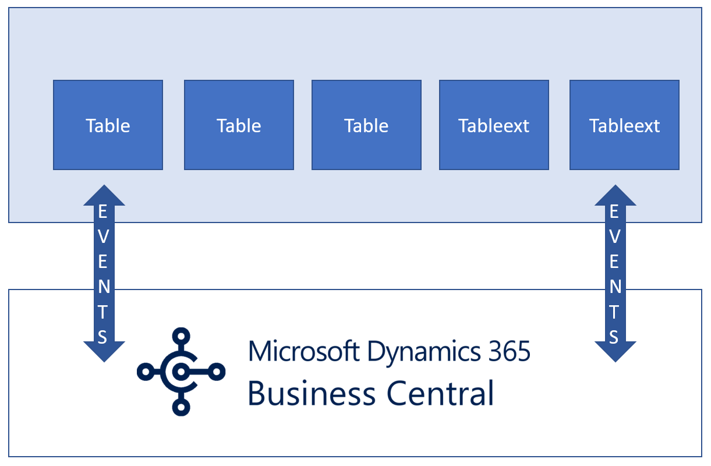

在这种情况下，开发人员无需考虑依赖关系（所有代码都在一个对象中）。然而，这种解决方案的缺点是，即使是扩展的小更新（比如增加一点代码变化）也需要撤销发布并重新发布整个应用程序。这意味着我们在 Dynamics 365 Business Central 中更新扩展：撤销发布旧版本并发布新版本。

其次，这不是一个可以拆分并作为模块销售的解决方案。然而，如果你希望拥有一个模块化的解决方案，将解决方案拆分为 N 个独立的扩展是一个不错的选择。在将现有的 C/AL 解决方案迁移到 N 个独立的扩展时，通常会有以下情况：

+   独立或独立运行的扩展（不依赖于其他模块的模块）

+   依赖扩展（需要其他模块的依赖的模块）

该解决方案的示意图如下：

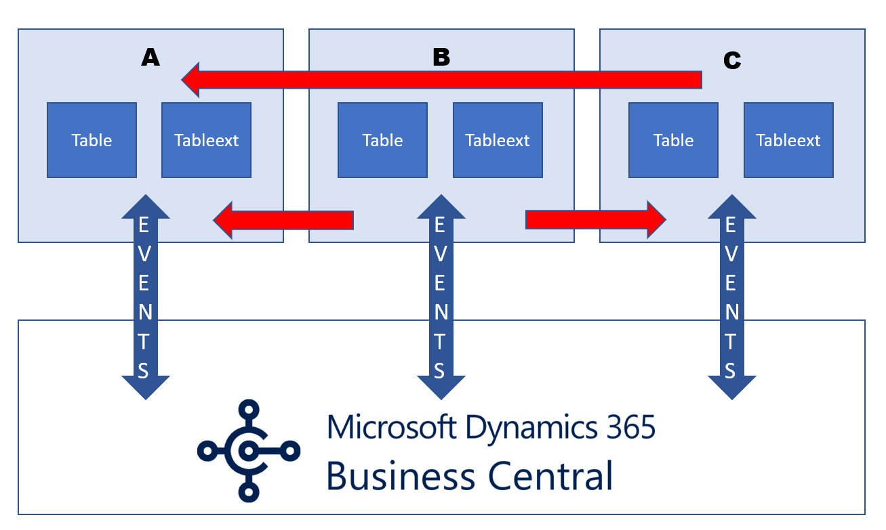

这里，扩展 A 是一个独立扩展（它只能引用基础模块中的对象）。扩展 C 依赖于扩展 A，而扩展 B 依赖于 A 和 C。

依赖关系有一些优点，例如：

+   它们帮助我们构建更复杂的部署场景

+   它们提高了代码和业务逻辑的可重用性（避免冗余）

+   它们增加了维护成本

+   它们增强了部署的灵活性

依赖关系的缺点如下：

+   当你发布扩展时，必须先发布没有任何依赖关系的扩展（所谓的主扩展或父扩展）。例如，如果你尝试先发布带有依赖关系的扩展（子扩展），它将抛出一个错误，指出数据库中不存在对象引用。

+   当你删除扩展时，必须先删除依赖的扩展（例如子扩展），然后再删除父扩展。

因此，我们可能会想知道哪种选择更好。

这是每个微软合作伙伴目前都在思考的问题。关于这个话题没有固定的规则，你想要实现的对象模块化目标以及你的市场营销策略，很大程度上取决于你现有的解决方案。

一个最佳实践和建议是不要跳过或避免依赖关系。将现有的 C/AL 解决方案迁移到 N 个不同的依赖扩展中是一个不错的选择，因为它保证了模块化和灵活性，但也建议不要创建过多的微型扩展。开发人员应该思考宏功能，并尝试将其隔离到可以在客户需要时安装的特色模块中。

在这个过程中需要记住的一点是，始终添加事件，以便让其他人能够钩取你现有的代码库。

只有通过引发事件（*集成*或*业务*事件），你才能拥有一个能够与系统中已安装的其他扩展进行交互的解决方案，并且该解决方案也可以被第三方（其他微软合作伙伴）扩展。

在接下来的章节中，我们将学习如何加速将现有基于 C/AL 的解决方案转换为 AL 的过程（在可能的情况下！）。

# 将现有解决方案转换为 AL

许多实际使用 Dynamics NAV 的微软合作伙伴多年来开发了大量的自定义解决方案（附加组件、客户解决方案等）。为了准备迎接新的 Dynamics 365 Business Central 平台，这些解决方案必须迁移到 AL 代码。

如果你有现有的代码库或现有的解决方案，关于将该解决方案迁移到扩展世界，首先可以做的事情是尝试将你的 C/AL 对象转换为 AL。

请记住，转换并不总是最好的做法，它只是一个起点（你可以照原样转换所有新的对象，但你应该注意并重构你现有解决方案中修改过的标准对象，这些对象是你现有解决方案中一定会有的）。

那么，你如何将 C/AL 解决方案转换为 AL 呢？

正如我们在第七章中提到的，*使用 AL 进行报表开发*，Dynamics 365 Business Central 本地版和 Docker 镜像自带一个工具，可以轻松帮助将 C/AL 对象转换为 AL 对象：`Txt2AL.exe`。

使用此工具，你可以指定一系列任何类型的 C/AL 对象，将它们导出为 TXT 格式，并自动转换为 AL 格式。

为了熟练使用此工具，你应该执行以下步骤：

1.  使用以下命令，将你新数据库中的所有基础对象导出为 TXT 文件（这里称为`MyBaseline.txt`）：

```
finsql.exe Command=ExportToNewSyntax, File=MyBaseline.txt, Database="<databasename>", ServerName=<servername> ,Filter=Type=table;ID=<tableID>
```

ExportToNewSyntax 命令的详细信息请参见：[`docs.microsoft.com/en-us/dynamics-nav/exporttonewsyntax`](https://docs.microsoft.com/en-us/dynamics-nav/exporttonewsyntax)。

1.  将你的 C/AL 解决方案导入到新创建的数据库中，编译对象，并使用前面的语法将所有新建和/或修改的对象导出到 TXT 文件中（例如，命名为`MyCustomObjects.txt`）。

1.  执行`Set-ObjectPropertiesFromMenuSuite` cmdlet，以便从 MenuSuite 信息转换为生成的 AL 文件中的页面和报表（记住：MenuSuite 对象在 Dynamics 365 Business Central 中不可用）。

1.  执行`Compare-NAVApplicationObject` cmdlet，以比较基础对象和修改后的对象，并创建包含它们之间差异的`.DELTA`文件：

```
Compare-NAVApplicationObject -OriginalPath "C:\MyBaseline.txt " -ModifiedPath "C:\ MyCustomObjects.txt " -ExportToNewSyntax
```

1.  执行`Txt2AL.exe`工具，使用以下语法：

```
txt2al –source=<DELTAFilePath> --target=<ALOutputFilesPath> --rename --type --extensionStartId --injectDotNetAddIns --dotNetAddInsPackage --dotNetTypePrefix --translationFormat –addLegacyTranslationInfo
```

以下表格包含了所有`Txt2AL.exe`命令参数的描述（其中一些是可选的）。我们来看看每个参数是如何工作的：

| **参数名称** | **描述** |
| --- | --- |
| `--source=Path` | 包含`.delta`文件的文件夹路径。此参数是必填的。 |
| `--target=Path` | 包含生成的`.AL`文件的文件夹路径。此参数是必填的。 |
| `--rename` | 如果使用此选项，输出文件将自动重命名为`.txt`对象。 |
| `--type=ObjectType` | 要转换的对象类型。允许的值包括 Codeunit、Table、Page、Report、Query 和 XmlPort。 |
| `--extensionStartId` | 这个选项允许你定义生成的扩展对象的起始 ID（默认值是 70,000,000）。每生成一个对象，该 ID 会递增 1。 |
| `--injectDotNetAddIns` | 这个选项会在生成的.NET 包中添加标准.NET 插件的定义（这些插件是一组嵌入到平台中的插件）。 |
| `--dotNetAddInsPackage=Path` | 这个选项指定包含.NET 类型声明的 AL 文件的路径，这些类型声明应该包含在转换生成的.NET 包定义中。 |
| `--dotNetTypePrefix` | 这个选项允许你为转换过程中创建的所有.NET 类型别名定义一个前缀。 |
| `--translationFormat=ObjectType` | 这个选项允许你指定翻译文件的格式。允许的值包括 Xliff 和 Lcg。 |
| `--addLegacyTranslationInfo` | 这个选项允许你向翻译文件添加信息。在转换过程中，应用程序中所有`CaptionML`属性的 XLIFF 文件都会被提取。如果设置了此选项，生成的 XLIFF 文件中将添加一个注释，指定翻译项在 C/SIDE 中的 ID。这充当了一个映射，允许你将现有的翻译资源转换到你的应用程序中。 |

现在我们已经解释了将代码从 C/AL 转换为 AL 的工具（Txt2AL），那么我们如何以半自动化的方式将现有的 C/AL 解决方案迁移到基于扩展的架构（AL 语言）中呢？

第一部并且良好的做法是，将现有的 C/AL 解决方案迁移到支持 CSIDE 开发环境和 C/AL 语言的最后一个**累积更新**（**CU**）的 Dynamics 365 Business Central 版本：Dynamics 365 Business Central 2019 年春季更新（平台 14.x）。

为了展示半自动化过程，我们将使用带有*NavContainerHelper* PowerShell 库的 Docker 容器，库可在[`github.com/microsoft/navcontainerhelper`](https://github.com/microsoft/navcontainerhelper)获取。

创建一个新的 Docker 容器，使用你的 C/AL 解决方案所基于的 Dynamics NAV 版本（在此示例中，我们将使用 Dynamics NAV 2018 CU 16），并将自定义或修改过的 TXT 对象导入此容器。脚本可能如下所示：

```
# Environment Settings
$auth = "NavUserPassword"
$credential = New-Object pscredential 'admin', (ConvertTo-SecureString -String 'P@ssword1' -AsPlainText -Force)
$licenseFile = "C:\temp\license.flf"
$demoSolutionPath = "C:\ProgramData\NavContainerHelper\MyNAVSolution.txt"
*New-NavContainer -accept_eula `
* *-imageName "mcr.microsoft.com/dynamicsnav:2018-cu16" `* *-containerName "nav2018" `* *-licenseFile $licenseFile `* *-auth $auth `* *-Credential $Credential `* *-updateHosts `* *-includeCSide* *# Import and compile objects* *Import-ObjectsToNavContainer -containerName "nav2018" -objectsFile $demoSolutionPath* *Compile-ObjectsInNavContainer -containerName "nav2018" -filter "Modified=Yes"*
```

现在，运行以下命令：

```
Export-ModifiedObjectsAsDeltas -containerName "nav2018" -openFolder
```

这将打开一个本地文件夹（通常是`C:\ProgramData\NavContainerHelper\Extensions\nav2018\delta`），该文件夹包含所有对基础代码的修改（称为*deltas*）。特别是，运行上述命令后，你将在这个文件夹中找到两种类型的文件：

+   **.TXT**文件是你的新对象（你可以直接使用它们）。

+   **.DELTA**文件是修改后的对象。

你应该始终检查`.DELTA`文件，因为它们可能包含一些在 AL 中不再支持的自定义代码修改。一个不支持的自定义示例可能是之前直接插入到标准表触发器中的代码，或者写在标准过账程序中的代码。这些代码必须移动并封装在由 Dynamics 365 Business Central 平台本地触发的事件订阅者中（正如我们在第五章中解释的，*为 Dynamics 365 Business Central 开发定制解决方案*）。

在进行这个（强制性）代码重构之后，我们需要创建一个 Dynamics 365 Business Central 容器（在这里称为`d365bc`），并且我们需要导入对象的增量。

脚本如下：

```
*# Environment Settings* *$imageName = "mcr.microsoft.com/businesscentral/onprem:ltsc2019"**$auth = "NavUserPassword"* *$credential = New-Object pscredential 'admin', (ConvertTo-SecureString -String 'P@ssword1' -AsPlainText -Force)* *$licenseFile = "C:\temp\license.flf"* *# Create Dynamics 365 Business Central container* *New-NavContainer -accept_eula `
* *-imageName $imageName `* *-containerName "d365bc" `* *-licenseFile "C:\temp\license.flf" `* *-auth $auth `* *-Credential $Credential `* *-updateHosts `* *-includeCSide**# Import and compile Delta files* *Import-DeltasToNavContainer -containerName "d365bc" -deltaFolder "C:\ProgramData\NavContainerHelper\Extensions\nav2018\delta"* *Compile-ObjectsInNavContainer -containerName "d365bc" -filter "Modified=Yes"*
```

现在，你有了一个包含 C/AL 解决方案的容器，在其中你可以测试你的代码，并且（最终）反复重构它。之前创建的 NAV 容器现在可以通过执行以下命令从系统中移除：

```
Remove-NavContainer -containerName nav2018
```

现在，我们准备好开始处理我们的基于 AL 的新解决方案。

在为 Dynamics 365 Business Central 开发（或迁移现有解决方案）应用程序时，我们现在有两种可能的情况：

+   C/AL 到 AL 的转换（不需要对标准基础对象进行修改，以支持产品的 SaaS 版本）

+   C/AL 到 AL 的代码自定义（基础 AL 对象将被更改；这仅适用于本地环境）

在接下来的章节中，我们将学习如何在这两种 C/AL 到 AL 的情况下进行操作。

# C/AL 到 AL 转换

在这里，我们需要创建一个包含我们 AL 解决方案的 Dynamics 365 Business Central 开发容器。这个容器不再支持 C/AL。创建这个容器的脚本如下：

```
*# Environment Settings* *$imageName = "mcr.microsoft.com/businesscentral/onprem-ltsc2019"* *$auth = "NavUserPassword"* *$credential = New-Object pscredential 'admin', (ConvertTo-SecureString -String 'P@ssword1' -AsPlainText -Force)* *$licenseFile = "C:\temp\license.flf"
**# Create Business Central container* *New-NavContainer -accept_eula `
* *-imageName $imageName `* *-containerName "d365bcdev" `* *-licenseFile $licenseFile `* *-auth $auth `* *-Credential $Credential `* *-updateHosts*
```

现在，你已经有了一个可用的 Dynamics 365 Business Central 容器，不再包含我们将在接下来的步骤中使用的 C/AL 工具。

现在，打开 Visual Studio Code，创建一个新的 AL 项目（*CTRL* + *Shift* + *P*，然后选择**AL:GO!**），给它命名（这里命名为`MyALSolution`），并修改你的解决方案中的`launch.json`文件，以便连接到这个容器（这里容器名为`d365bcdev`）。

在 PowerShell 中执行以下命令：

```
Convert-ModifiedObjectsToAl -containerName "d365bc" -sqlCredential $credential -alProjectFolder "C:\Packt\MyALSolution"
```

`NavContainerHelper`模块有一个名为`Convert-ModifiedObjectsToAl`的功能，允许你从选定的容器中导出所有修改过的对象（如果需要，你也可以应用对象过滤器），然后对结果文件运行`Convert-Txt2Al`命令。执行该命令后，你将得到一个文件夹（由`-alProjectFolder`参数指定），其中包含许多在从 C/AL 基础解决方案转换过程中生成的`.al`文件。

输出结果不会始终达到 100%的完美；你需要做一些重构，并且需要为你的对象添加`ApplicationArea`和`UsageCategory`属性，但主要工作已经完成。现在，你可以编译你的 AL 解决方案并将其部署到你的`d365bcdev`容器中。因此，你的解决方案是一个 100%的 AL 扩展，运行在 Dynamics 365 Business Central 上。

# C/AL 到 AL 代码自定义

在将 C/AL 解决方案转换为 AL 时，你可能还会遇到一些必须严格修改标准 AL 代码的情况（我们建议尽量避免这样做，因为如果修改了微软的基础代码，你的解决方案将无法迁移到 Dynamics 365 Business Central 的 SaaS 环境中）。让我们开始吧：

1.  如果你遇到这种情况，可以通过`-includeAL`选项创建一个 Dynamics 365 Business Central 开发容器（`d365bcdev`）：

```
*# Environment Settings* *$imageName = "mcr.microsoft.com/businesscentral/onprem-ltsc2019"* *$auth = "NavUserPassword"* *$credential = New-Object pscredential 'admin', (ConvertTo-SecureString -String 'P@ssword1' -AsPlainText -Force)* *$licenseFile = "C:\temp\license.flf"
**# Create Business Central container* *New-NavContainer -accept_eula `
* *-imageName $imageName `* *-containerName "d365bcdev" `* *-licenseFile $licenseFile `* *-auth $auth `* *-Credential $Credential `* *-updateHosts `*                 *-includeAL*
```

执行该命令时，你将会在一个新的文件夹中找到包含 AL 对象基线的文件夹，文件夹名称为`Original-<version>-<country>-al`（例如，`C:\ProgramData\NavContainerHelper\Extensions\Original-14.0.29537.0-W1-al`）。

1.  现在，你可以使用从上一步中获取的所有基础 AL 对象创建一个新的 AL 项目。你可以通过执行以下脚本自动完成这一步：

```
Create-AlProjectFolderFromNavContainer -containerName "d365bcdev" -alProjectFolder "C:\ProgramData\NavContainerHelper\AL\MyALSolution" -useBaseLine -addGIT
```

在前面的代码中，我们使用了以下两个参数：

+   +   `-useBaseline`选项用于将`.AL`基础文件复制到我们的 AL 解决方案项目中。

    +   `-addGit`选项会在该文件夹创建一个离线 Git 仓库，并提交所有对象（你需要先安装 Git）。

1.  现在，你可以使用 Visual Studio Code 打开这个文件夹，并在不发布的情况下编译解决方案（或者使用*Ctrl* + *Shift* + *B*快捷键）。这个编译过程可能需要几分钟。你也可以通过执行以下命令在不打开 Visual Studio Code 的情况下编译解决方案：

```
Compile-AppInNavContainer -containerName "d365bcdev" -credential $credential -appProjectFolder "C:\ProgramData\NavContainerHelper\AL\MyALSolution"
```

在编译过程中，你可能会看到一些弃用警告。编译后，你需要将这些修改提交到本地 Git 仓库。

现在你拥有一个完整的 AL 应用（包含所有标准 AL 对象）。

在下一步中，你需要将容器数据库中的 C/AL 对象替换为这个新编译的 AL 应用。为此，执行以下命令：

```
Publish-NewApplicationToNavContainer -containerName "d365bcdev" -appDotNetPackagesFolder "C:\ProgramData\NavContainerHelper\AL\MyALSolution\.netpackages" -appFile "C:\ProgramData\NavContainerHelper\AL\MyALSolution\output\SD_myalapp_1.0.0.0.app" -credential $credential -useCleanDatabase
```

`Publish-NewApplicationToNavContainer` 是一个 cmdlet，卸载数据库中的所有应用，移除所有 C/AL 对象，并使用容器的开发端点发布新的 `.app` 文件。我们使用 `-useCleanDatabase` 标志来移除 C/AL 对象并卸载现有的应用。

现在你已经有了运行完整 AL 基础应用的 Docker 容器，你需要导入你的 AL 自定义解决方案（扩展）。为此，执行以下命令：

```
Convert-ModifiedObjectsToAl -containerName "d365bc" -sqlCredential $credential -doNotUseDeltas -alProjectFolder "C:\Packt\MyALSolution" -alFilePattern "*.al,*.xlf"
```

这将在你之前导入自定义 C/AL 解决方案的容器上运行（这里称为`d365bc`）。现在，转换将作用于所有对象（完整的数据库，报表布局文件除外）。

完成此步骤后，你将拥有一个完整的基础应用，里面包含你的自定义对象和修改的标准 `.AL` 对象。你现在可以编译这些对象并将它们部署到你的 Dynamics 365 Business Central 容器中进行测试。你现在拥有一个代码定制的 AL 解决方案（再次建议如果可能的话避免这样做）。

这是如果你希望开始代码转换所需的步骤。通常，请记住始终以 SaaS 环境作为参考和目标点。

# 从 Dynamics 365 Business Central 版本 14 升级到版本 15

微软推荐的迁移路径是从已迁移到版本 14 的解决方案开始（迁移到版本 14 和 AL 是第一步），将你的解决方案迁移到新的重构版 Dynamics 365 Business Central 版本 15。

微软的官方迁移路径如下图所示：

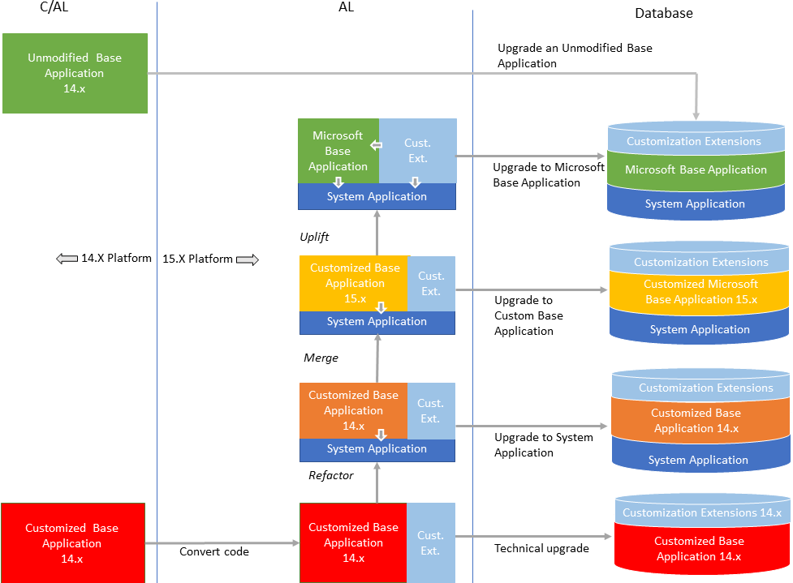

更多信息可以参考 [`docs.microsoft.com/en-us/dynamics365/business-central/dev-itpro/upgrade/upgrade-overview-v15`](https://docs.microsoft.com/en-us/dynamics365/business-central/dev-itpro/upgrade/upgrade-overview-v15)。

要从版本 14 数据库开始进行技术升级到版本 15，你可以执行以下 PowerShell 命令：

```
Invoke-NAVApplicationDatabaseConversion -DatabaseServer <database server name>\<database server instance> -DatabaseName "<database name>"
```

转换将更新数据库的系统表到新的模式（数据结构），并提供最新的平台功能和性能提升。

对于迁移到版本 15，详细步骤可以参考以下官方 Microsoft 页面：

+   将未修改的应用程序升级到 Dynamics 365 Business Central 2019 Release Wave 2: [`docs.microsoft.com/en-us/dynamics365/business-central/dev-itpro/upgrade/upgrade-unmodified-application`](https://docs.microsoft.com/en-us/dynamics365/business-central/dev-itpro/upgrade/upgrade-unmodified-application)。

+   升级到 Dynamics 365 Business Central 2019 Wave 2 的技术升级：[`docs.microsoft.com/en-us/dynamics365/business-central/dev-itpro/upgrade/upgrade-technical-upgrade-v14-v15`](https://docs.microsoft.com/en-us/dynamics365/business-central/dev-itpro/upgrade/upgrade-technical-upgrade-v14-v15)。

在下一节中，我们将探讨在为新的 Dynamics 365 Business Central 平台架构解决方案时需要考虑的另一个重要方面：如何处理客户定制需求。

# 处理客户特定的个性化需求

你已经付出了很大的努力，现在你的解决方案已经完成了从旧的 C/AL 到新扩展架构的迁移。现在，通常的商业场景是你将解决方案卖给客户：他们希望对你的解决方案做一些特定的定制，以满足他们的特定业务需求。在这里，我们立刻遇到一个问题：你如何处理客户的定制需求？

扩展模型有一些规则，你需要绝对避免以下图示所代表的情况：

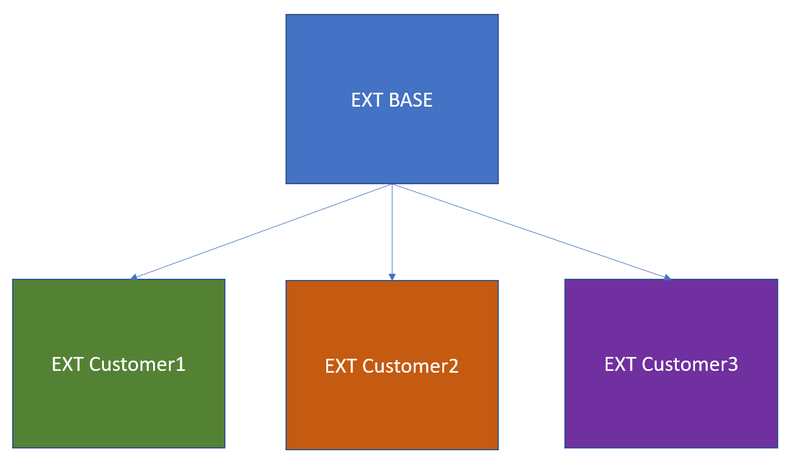

在前面的图示中，我们可以看到 EXT BASE 是标准解决方案，它的基础代码为每个购买该解决方案的客户所修改。

你不需要为每个客户直接定制你的扩展代码。分叉（Forking）你的解决方案基础代码绝对是一个坏习惯（它违反了扩展的原则；也就是说，基础代码永远不应被修改）。

你需要做的事情如以下图所示：

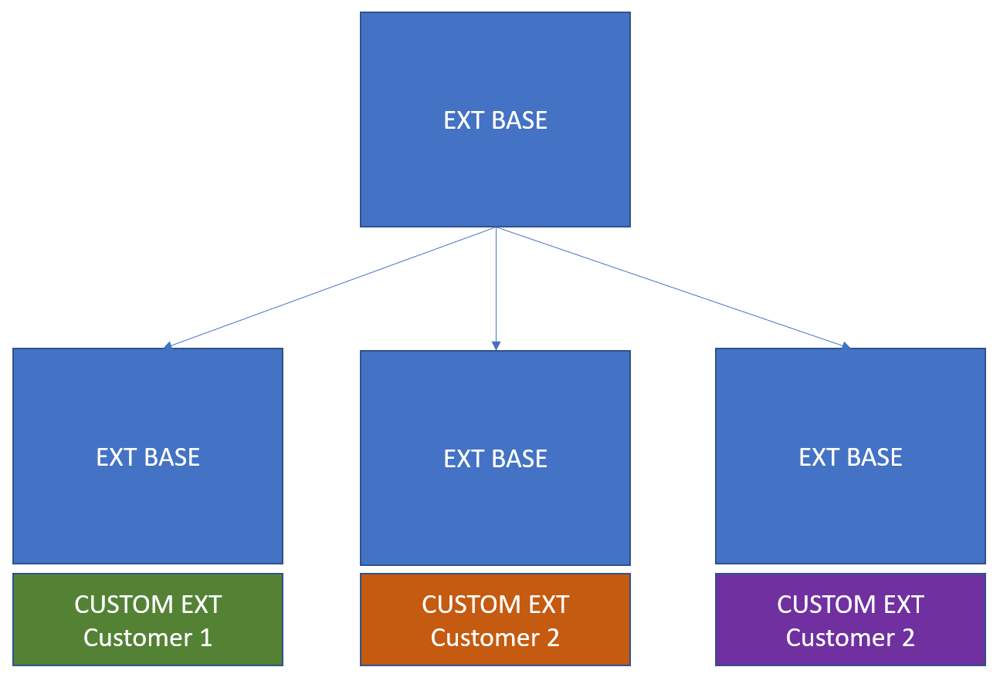

在这里，你的扩展基础代码（在前面的图示中称为 EXT BASE）对于每个客户都是相同的。为了处理每个客户的定制需求，你需要为每个客户创建一个新的扩展（在前面的图示中称为 CUSTOM EXT），该扩展将会*依赖*于你的基础扩展（它将是标准层之上的新一层）。这是最佳实践，也是扩展模型的要求：你不修改基础代码，而是*扩展*基础代码。那么，除了这些，我们还需要记住其他哪些扩展方案呢？让我们一起来看看。

# 其他需要记住的事项

在将解决方案迁移到扩展时，还有其他需要记住的事项，以及你需要处理或重新考虑的方面。在接下来的章节中，你将看到一些最常见事项的总结。

# 处理 MenuSuite

在 Dynamics NAV 中，通过将页面和报告添加到 *MenuSuite* 对象（一个定义应用程序功能菜单的标准对象）中，Web 客户端可以对其进行搜索。而在 Dynamics 365 Business Central 中，`MenuSuite` 对象不再受支持，页面和报告可以通过设置 `UsageCategory` 和 `ApplicationArea` 属性来进行搜索和显示。

如果您从 C/AL 转换对象，则需要在转换的对象上设置这些属性。您可以使用名为`TransitionMenuSuiteObjectsForSearch.psm1`的 PowerShell 模块自动设置对象上的这些属性，该模块可以在 Dynamics 365 Business Central DVD 映像中找到。

您可以在 PowerShell 中导入此模块，如下所示：

```
Import-Module -Name c:\dvd\WindowsPowerShellScripts\WebSearch\TransitionMenuSuiteObjectsForSearch.psm1
```

然后，执行以下命令：

```
Set-ObjectPropertiesFromMenuSuite -RoleTailoredClientFolder "C:\Program Files (x86)\Microsoft Dynamics NAV\140\RoleTailored Client" -DataBaseName "YourDatabase" -OutPutFolder "C:\temp"
```

现在，在所有转换的对象上设置了`UsageCategory`和`ApplicationArea`。

# .NET 变量和插件

如果您的现有代码使用.NET 变量，则这些对象不支持在 SaaS 环境中使用。如果要在 SaaS 上使用.NET，您需要将 DLL（或您的.NET 代码）包装到 Azure 函数中，并从 AL 代码中调用该函数。第六章中描述的*高级 AL 开发*和第十三章中描述的*Serverless Business Processes with Business Central and Azure*展示了如何处理这些情况。

如果你的扩展目标是在本地环境中（在`app.json`文件中`Target = Internal`），那么你可以在 AL 代码中使用.NET 程序集（但这些代码永远不能移到 SaaS 环境中）。关于如何在本地环境中使用.NET 变量的更多信息，请参见[`docs.microsoft.com/zh-cn/dynamics365/business-central/dev-itpro/developer/devenv-get-started-call-dotnet-from-al`](https://docs.microsoft.com/zh-cn/dynamics365/business-central/dev-itpro/developer/devenv-get-started-call-dotnet-from-al)和[`demiliani.com/2019/06/04/dynamics-365-business-central-using-dotnet-assemblies-on-a-docker-container-sandbox/`](https://demiliani.com/2019/06/04/dynamics-365-business-central-using-dotnet-assemblies-on-a-docker-container-sandbox/)。

如果您的解决方案使用.NET 可视化插件，可能会遇到另一个问题，比如以下的销售订单页面：

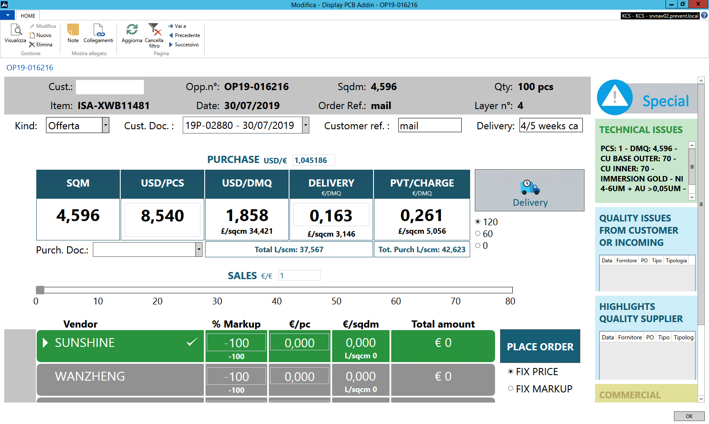

下面是我们实施的自定义销售订单页面，它使用了在 C/AL 中声明的.NET **Windows Presentation Foundation**（**WPF**）插件：

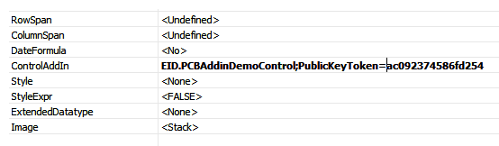

要将此解决方案移植到 Dynamics 365 Business Central，您需要将可视化插件重做为 JavaScript 插件，如第六章中描述的*高级 AL 开发*。

# 文件管理

在 Dynamics 365 Business Central 中，仅支持本地环境中的文件处理。如果您的目标是 SaaS 环境，您应该通过使用*流*（如第六章中描述的*高级 AL 开发*的*处理文件*部分）或通过使用*Azure Functions*进行文件存储（在第十三章中描述的*Serverless Business Processes with Business Central and Azure*中提供了一个完整的解决方案）来处理文件。

# 打印

在 SaaS 环境中，无法进行直接打印（将文档直接发送到本地网络上的打印机）。一个可能的解决方案在这里描述：[`demiliani.com/2019/01/29/dynamics-365-business-central-and-direct-printing/`](https://demiliani.com/2019/01/29/dynamics-365-business-central-and-direct-printing/)。

微软也在努力支持在不久的将来在 SaaS 环境中进行直接打印。wave 2 发布将包含一个名为 `OnDocumentReady` 的新报告事件，该事件暴露了文档的数据流和上下文。文档随后可以由能够处理打印的扩展程序拾取。

在下一节中，我们将学习 Dynamics 365 Business Central wave 2 发布架构如何在不久的将来影响你扩展的开发。

# Dynamics 365 Business Central wave 2 发布变更

Dynamics 365 Business Central Wave 2 发布（平台 15）仅支持 AL 和 Web 客户端。你将不再找到对 C/AL 和 CSIDE 的支持。相反，如果你访问 Dynamics 365 Business Central 平台 15 中的 *扩展管理* 页面，你将看到以下两个微软扩展：

+   **基础应用程序**（版本 15.0.<build>.0）：此扩展包含所有已迁移到 AL 的业务逻辑。

+   **系统应用程序**（版本 15.0.<build>.0）：此扩展处理系统层。

除了简化整个代码库外，这种新结构的主要好处是，你可以摆脱代码定制，开始基于 Dynamics 365 Business Central 平台进行垂直或水平解决方案的开发。你可以设置一个预备环境，并通过以下两个官方文章来练习新版本中将正式引入的破坏性变更：

+   [`freddysblog.com/2019/07/31/preview-of-dynamics-365-business-central-2019-release-wave-2/`](https://freddysblog.com/2019/07/31/preview-of-dynamics-365-business-central-2019-release-wave-2/)

+   [`freddysblog.com/2019/08/02/organizing-your-al-files/`](https://freddysblog.com/2019/08/02/organizing-your-al-files/)

所有你为 Dynamics 365 Business Central 创建的新扩展必须依赖这些微软应用。在 Visual Studio Code 中，当你启动一个新的扩展项目时，你需要将以下依赖项添加到扩展的 `app.json` 文件中：

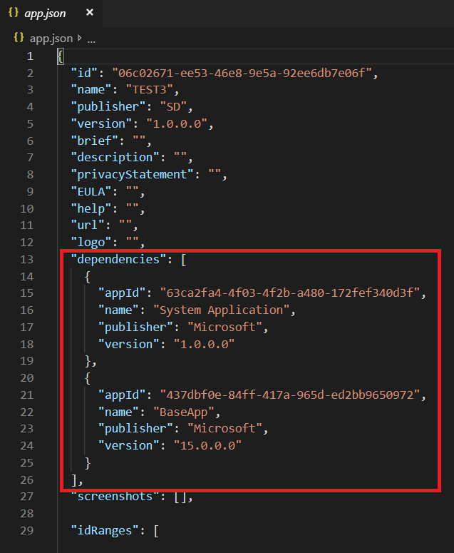

如果你在 Visual Studio Code 中选择 **4.0** 作为目标平台，这些依赖项将自动添加。

之后，你可以从你的环境中下载符号并开始编码：

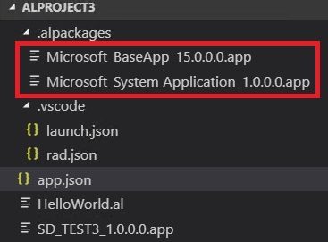

这是为 SaaS 和本地环境开发扩展的推荐方式。

在 Dynamics 365 Business Central 的第二波发布中，微软允许你修改基础代码（现在，所有代码已完全转换为 AL），本节开头的链接解释了如何将.al 文件提取到本地文件夹，并开始在这些文件上工作，以创建你自己的自定义*BaseApp*。

作为一个例子，这里我直接通过添加一个自定义函数来修改标准的*Sales-Post*代码单元：

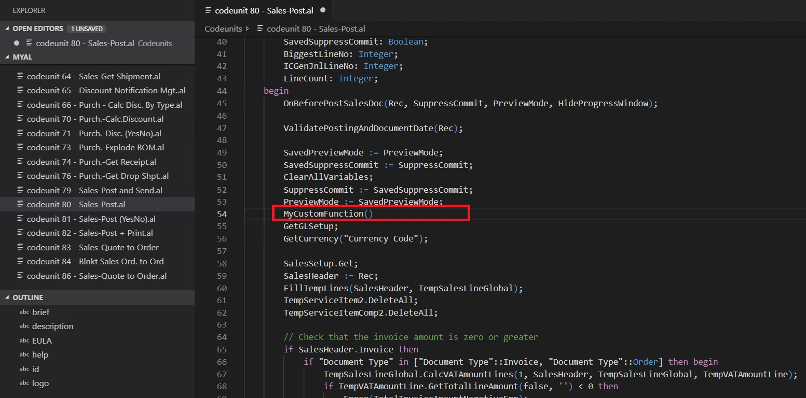

更多关于如何修改*Base Application*的信息可以在这里找到：[`demiliani.com/2019/09/24/dynamics-365-business-central-wave-2-customizing-the-base-application/`](https://demiliani.com/2019/09/24/dynamics-365-business-central-wave-2-customizing-the-base-application/)。

正如我们之前提到的，许多社区专家的来源中提到，*仅仅因为你可以，并不意味着你应该*。修改基础代码实际上是被允许的，以帮助合作伙伴尽快将解决方案迁移到 AL 和新平台，但从长远来看，本地部署将遵循云规则，因此，微软的基础代码修改在未来可能会变得更加严格。

在新平台上，你还可以在*System Application*本身之上构建扩展。只需移除*BaseApp*的依赖，下载一些符号，就可以开始了。如下面的截图所示，现在，你只下载了两个应用包（没有 BaseApp）：

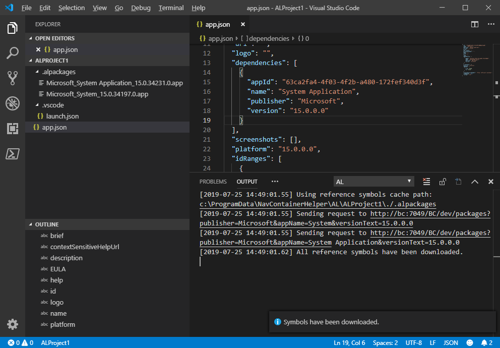

现在，你可以开始编写仅依赖于*System Application*的扩展。

*System Application*实际上是一个正在进行的工作，未来可能会有所变化（将添加新的模块）。最新版本始终可以在 GitHub 上找到：[`github.com/Microsoft/alappextensions`](https://github.com/Microsoft/alappextensions)。

如你在本节中看到的，从 Dynamics 365 Business Central 15.x 平台开始，所有的基础代码都已经迁移到 AL，你需要使用 AL 和 Visual Studio Code 来创建扩展，从 Microsoft 的基础和系统应用开始。

# 总结

在本章中，我们研究了将现有的单体 C/AL 解决方案迁移到新的扩展架构和 AL 语言的最佳实践。我们还看到了架构你的解决方案的最佳实践，比如如何以半自动化的方式将现有的 C/AL 代码转换为 AL，以及在迁移现有解决方案的过程中如何处理常见问题。

在本章的末尾，你学习了如何迁移到新的 Dynamics 365 Business Central 平台，以及在开始新解决方案的项目时应采用的最佳实践。现在，你已经清楚地了解了迁移现有代码到 AL 的工具，并知道了开始这一迁移活动所需的步骤。

在下一章，我们将学习第三方工具如何帮助我们使用 AL 和扩展，也将帮助我们将现有解决方案迁移到新的 Dynamics 365 Business Central 架构。
