# 第十九章：对 AL 开发者有用且高效的工具

在上一章中，我们提供了将现有 ISV 解决方案迁移到基于扩展的全新 Dynamics 365 Business Central 开发模型的一些指导和最佳实践。

在使用扩展和 Visual Studio Code 时，拥有正确的工具可以节省大量的时间和精力。在本章中，我们将概述一些你可以在日常开发中使用的第三方开发工具，帮助你在 AL 开发中更加高效。我们将重点介绍微软 Dynamics ERP 世界中著名人物 Waldo 开发的工具。

本章将涵盖以下内容：

+   Waldo 是谁？

+   使用哪些工具

# Waldo 是谁？

Waldo 的真实姓名是 Eric Wauters，他是 *iFacto Business Solutions* 和 *Cloud Ready Software* 的创始合伙人之一。凭借 18 年的技术经验，他每天都为开发团队提供灵感。作为开发经理，他持续推动 iFacto 和 CRS 的技术准备工作。

除此之外，Eric 还非常活跃于 Microsoft Dynamics 365 Business Central 社区，他在其中尝试解决技术问题，并与其他 Dynamics 爱好者分享知识。相信很多人都读过 Eric 的帖子，他通常都会署名 `waldo`。

许多人使用并且还为他在 MiBuSo、GitHub、PowerShell Gallery 和 Visual Studio Marketplace 上免费分享的工具做出了贡献。

他凭借卓越的成绩，每年自 2007 年以来都获得了 **微软最有价值专家** (**MVP**) 奖项。

了解了 Waldo 后，在下一部分中，我们将概述他为 AL 开发者提供的大多数工具。

# 使用哪些工具

多年来，Waldo 创建了许多工具。Waldo 第一个上线的工具是在 2004 年发布的 `WaldoNavPad`，它是一个帮助在 Microsoft Dynamics NAV 中处理大文本的工具。它帮助将代码拆分成更小的部分，因为当时我们在一个字段中只能输入最多 250 个字符。

该工具在 MiBuSo 上已被下载超过 11,000 次。由于它的受欢迎程度，Waldo 将工具更新到了一个适用于 RTC 和作为 AL 扩展的版本，并在功能上进行了扩展，使其在 Business Central 内部拥有了一个 HTML 编辑器。

紧随其后的是一些较小的工具，它们被添加到了 MiBuSo 的下载列表中，你可以在 [`mibuso.com/downloads/results?keywords=waldo`](https://mibuso.com/downloads/results?keywords=waldo) 找到这些工具。

自 2013 年微软发布越来越多的 PowerShell 构建模块以来，Waldo 决定深入研究，帮助社区的采用。这导致了一些非常广泛的辅助功能库，这些库经过分类并发布在 PowerShell Gallery 上。只需搜索`waldo` ([`www.powershellgallery.com/packages?q=waldo`](https://www.powershellgallery.com/packages?q=waldo))，你将找到六个 PowerShell 模块：

+   `Ready.Software.SQL`：这些包括一些帮助你与 SQL Server（和 Business Central）一起工作的功能，例如备份和恢复。

+   `Ready.Software.PowerShell`：这是一个非常小的函数集合，用于一些 PowerShell 相关的挑战。

+   `Ready.Software.Windows`：这些包括与 Windows 相关的功能，如压缩和解压缩文件。

+   `Ready.Software.NAV`：这个模块包含了大多数功能，全部与 NAV（Business Central）相关：

    +   与对象的工作（升级、版本列表、语言等）

    +   与服务器的工作（例如权限和公司）

+   `RemoteNAVDockerHostHelper`：这是一个帮助你在`DockerHost`不在本地 PC 上的时候使用`DockerHost`的模块（因此`Remote`出现在`RemoteNAVDockerHost`中）。

+   `NavContainerHelperExtension`：这只是 Waldo 为了与 Docker 一起工作而创建的一组功能。类似于`NavContainerHelper`，这些功能在当时创建时并不属于那个模块。

所有这些功能在 Waldo 作为开发人员的生活中都有一定的目的。他使用这些模块的每个脚本都在线上 GitHub 上： [`github.com/waldo1001/Cloud.Ready.Software.PowerShell`](https://github.com/waldo1001/Cloud.Ready.Software.PowerShell)。你可以在这里找到所有模块和他将这些模块应用到的脚本。

许多这些 PowerShell 脚本的创建是为了帮助开发 V1 扩展。然而，当这些扩展被终止（为了更好的发展）时，一个新的工具出现了：Visual Studio Code，在这里我们可以开发我们称之为扩展 V2 的东西。在 Waldo 看来，这个工具在以下方面需要一些帮助：

+   自动命名文件

+   运行对象

+   代码片段

所以，Waldo 开始为 Visual Studio Code 构建一个扩展，帮助 AL 开发人员更加高效地完成工作。**CRS AL 语言扩展**应运而生：[`marketplace.visualstudio.com/items?itemName=waldo.crs-al-language-extension`](https://marketplace.visualstudio.com/items?itemName=waldo.crs-al-language-extension)。

这只是对 Waldo 工具的一个简短介绍，以及他是如何构建这些工具的。以下是一些你可以找到他工具的资源：

+   MiBuSo：[`mibuso.com/downloads/results?keywords=waldo`](https://mibuso.com/downloads/results?keywords=waldo)

+   PowerShell Gallery：[`www.powershellgallery.com/packages?q=waldo`](https://www.powershellgallery.com/packages?q=waldo)

+   GitHub：[`github.com/waldo1001`](https://github.com/waldo1001)

+   DevOps: [`dev.azure.com/waldo1001/WaldoDemos`](https://dev.azure.com/waldo1001/WaldoDemos)

在这一章中，我们将讨论他的一些工具，重点是让你作为 AL 开发者的工作变得更加轻松。

# AL 扩展包

Waldo 曾经构建的最小工具是 Visual Studio Code | 扩展包。事实上，它是 Waldo 在日常开发任务中使用并重视的所有 Visual Studio Code 扩展的集合。

你可以在 Marketplace 中找到这个扩展包，名称为 AL 扩展包。这里是直接链接：

[`marketplace.visualstudio.com/items?itemName=waldo.al-extension-pack`](https://marketplace.visualstudio.com/items?itemName=waldo.al-extension-pack)

这是主页的样子：

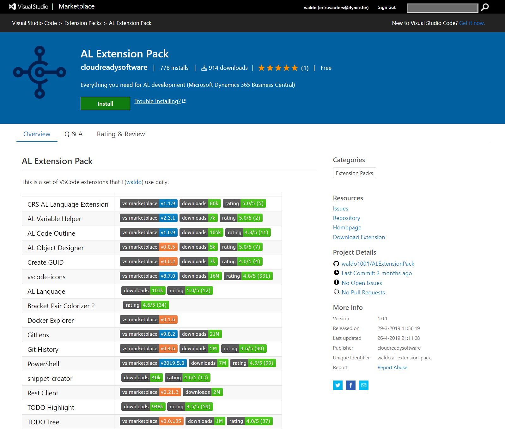

只需安装此扩展，它将自动安装包中的所有扩展，当 Waldo 添加新的扩展时，它也会自动安装到你的系统中。

如果你想拥有一个功能完备的 Visual Studio Code 环境，我们强烈推荐安装一个类似的包：

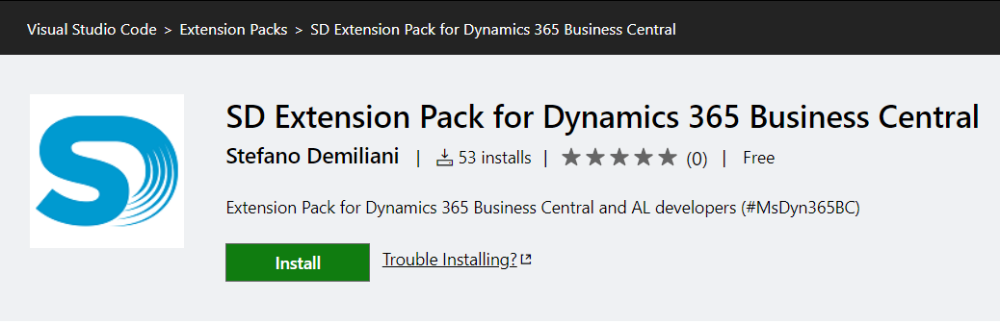

你可以通过以下链接找到这个工具：

[`marketplace.visualstudio.com/items?itemName=StefanoDemiliani.sd-extpack-d365bc`](https://marketplace.visualstudio.com/items?itemName=StefanoDemiliani.sd-extpack-d365bc)

# CRS AL 语言扩展

Waldo 为社区编写的一个稍大的扩展是**CRS AL 语言扩展**：

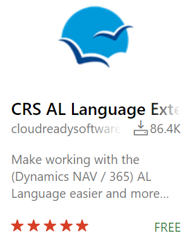

可以通过以下链接找到此扩展：

[`marketplace.visualstudio.com/items?itemName=waldo.crs-al-language-extension`](https://marketplace.visualstudio.com/items?itemName=waldo.crs-al-language-extension)

许多人使用它的主要原因是它管理文件名约定：开发人员不再需要担心如何命名文件——这个扩展可以自动处理这个问题。但它还做了很多其他事情。

让我们来概览一下它的功能。

# 运行对象

我们都知道，我们可以通过修改`launch.json`文件中的一些设置，在发布应用时运行表或页面，但这并不方便。

从某种意义上讲，我们需要能够做到以下几点：

+   运行 Windows、Web、平板或手机客户端中的任何对象。

+   直接运行一些工具，例如以下内容：

    +   测试工具

    +   事件订阅者

    +   数据库锁定页面

+   运行当前在客户端中打开的对象。

`launch.json`方式运行对象在这里帮不上忙。

CRS AL 语言扩展带有这些新命令，可以在命令面板中找到：

+   CRS: 运行对象（Web 客户端）。

+   CRS: 运行对象（平板客户端）。

+   CRS: 运行对象（手机客户端）。

+   CRS: 运行对象（Windows 客户端）。

+   CRS：运行当前对象（Web 客户端）（*Ctrl* + *Shift* + *R*）——此命令会运行打开文件中的对象（扩展需要先发布）。你也可以从状态栏（在 Web 客户端中运行）和资源管理器的上下文菜单运行此命令。

+   CRS：在 Web 客户端中运行 CAL 测试工具。

+   CRS：在 Web 客户端中运行事件订阅页面。

+   CRS：在 Web 客户端中运行数据库锁页面。

好的一点是，它会在 `launch.json` 中找到设置并使用这些设置来运行实际的对象。

# 重命名/重新组织文件

如前所述，这是该工具最广泛使用的功能：

+   `重命名` 是仅重命名文件。

+   `重新组织` 是重命名文件 `并且` 将其放入与对象类型匹配的子文件夹中。

本质上，这些命令被归纳为四个命令，可以通过 Visual Studio Code 命令面板再次访问：

+   CRS：重命名 - 当前文件。

+   CRS：重命名 - 所有文件。

+   CRS：重新组织 - 当前文件。

+   CRS：CRS：重新组织 - 所有文件——请注意，`重新组织` 将会把测试代码单元移动到测试文件夹。

还有一个设置，可以在保存 `.al` 文件时自动启动文件重命名/重新组织：

```
"CRS.OnSaveAlFileAction": "Rename"
```

重命名/重新组织的另一个有趣功能是能够更改文件名模式：

```
"CRS.FileNamePattern": "<ObjectNameShort>.<ObjectTypeShort><ObjectId>.al",
 "CRS.FileNamePatternExtensions": "<ObjectNameShort>.<ObjectTypeShort><BaseId>-Ext<ObjectId>.al",
 "CRS.FileNamePatternPageCustomizations": "<ObjectNameShort>.<ObjectTypeShort><BaseId>-PageCust.al"
```

这是所有可用工具设置的概览：

+   `CRS.nstfolder`：这是 NST 的文件夹。

+   `CRS.WebServerInstancePort`：这是 Web 客户端的端口号。

+   `CRS.WinServer`：这是 Windows 客户端连接的服务器。

+   `CRS.WinServerInstance`：这是 Windows 客户端连接的服务器实例。

+   `CRS.WinServerInstancePort`：这是 Windows 客户端连接的服务器实例的端口号。

+   `CRS.PublicWebBaseUrl`：如果需要运行来自 VS Code 的对象，可以通过此设置覆盖 `Launch.json` 设置。

+   `CRS.ExtensionObjectNamePattern`：这是对象名称的模式；如果设置了（默认未设置），它将为扩展对象执行自动命名：

    +   `<Prefix>`

    +   `<Suffix>`

    +   `<ObjectType>`

    +   `<ObjectTypeShort>`：对象类型的简短表示

    +   `<ObjectTypeShortUpper>`：与 `ObjectTypeShort` 相同，但为大写字母

    +   `<ObjectId>`

    +   `<BaseName>`：移除奇怪的字符——不包括前缀或后缀

    +   `<BaseNameShort>`：不包括前缀或后缀

    +   `<BaseId>`：如果你希望此功能正常工作，你需要在基本名称后加上 `Id` 注释

+   `CRS.FileNamePattern`：这是非扩展对象文件名的模式。可以使用以下变量：

    +   `<Prefix>`：仅单独的前缀

    +   `<Suffix>`：仅单独的后缀

    +   `<ObjectType>`

    +   `<ObjectTypeShort>`：对象类型的简短表示

    +   `<ObjectTypeShortUpper>`：与 `ObjectTypeShort` 相同，但为大写字母

    +   `<ObjectId>`

    +   `<ObjectName>`：移除奇怪的字符，包括前缀和后缀

    +   `<ObjectNameShort>`

+   `CRS.FileNamePatternExtensions`：这是扩展对象文件名的模式。可以使用以下变量：

    +   `<Prefix>`：仅单独的前缀

    +   `<Suffix>`: 仅后缀部分

    +   `<ObjectType>`

    +   `<ObjectTypeShort>`: 对象类型的简短表示

    +   `<ObjectTypeShortUpper>`: 与`ObjectTypeShort`相同，但为大写字母

    +   `<ObjectId>`

    +   `<ObjectName>`: 移除奇怪字符，包括前缀和后缀

    +   `<ObjectNameShort>`

    +   `<BaseName>`: 移除奇怪字符，但不包括前缀和后缀

    +   `<BaseNameShort>`: 不包括前缀和后缀

    +   `<BaseId>`: 如果希望此功能生效，您需要在基本名称后面加上`Id`注释，如本例所示：

```
tableextension 50100 "Just Some Table Extension" extends Customer //18
{
    fields
    {
        // Add changes to table fields here
        field(50100;"Just Some field";Code[10]){
            TableRelation="Just Some Table"."No.";
        }
    }   
}
```

+   `CRS.FileNamePatternPageCustomizations`: 这是页面自定义文件名的模式。可以使用以下变量：

    +   `<Prefix>`: 仅前缀部分

    +   `<Suffix>`: 仅后缀部分

    +   `<ObjectType>`

    +   `<ObjectTypeShort>`: 对象类型的简短表示

    +   `<ObjectTypeShortUpper>`: 与`ObjectTypeShort`相同，但为大写字母

    +   `<ObjectName>`: 移除奇怪字符——包括前缀和后缀

    +   `<ObjectNameShort>`: 包含前缀和后缀

    +   `<BaseName>`: 移除奇怪字符，不包括前缀和后缀

    +   `<BaseNameShort>`: 不包括前缀和后缀

    +   `<BaseId>`: 与之前的说明相同

+   `CRS.ObjectNamePrefix`: 使用重组/重命名命令时，此设置将确保对象名称（和文件名）有前缀：

    +   提示 1：将其用作工作区设置

    +   提示 2：如果希望前缀与后缀之间有空格，请使用结束空格

+   `CRS.ObjectNameSuffix`: 使用重组/重命名命令时，此设置将确保对象名称（和文件名）有后缀：

    +   提示 1：将其用作工作区设置

    +   提示 2：如果希望后缀与前缀之间有空格，请使用起始空格

+   `CRS.RemovePrefixFromFilename`: 使用重组/重命名命令时，此设置将移除文件名中的任何前缀（但保留在对象名称中）。提示：将其用作工作区设置。

+   `CRS.RemoveSuffixFromFilename`: 使用重组/重命名命令时，此设置将移除文件名中的任何后缀（但保留在对象名称中）。提示：将其用作工作区设置。

+   `CRS.AlSubFolderName`: 这是可变子文件夹名称。“None”表示您希望禁用将文件移动到子文件夹的命令。

+   `CRS.OnSaveAlFileAction`: 此操作将自动重命名/重组您正在编辑的文件。它也会考虑前缀和后缀。

+   `DisableDefaultAlSnippets`: 禁用随`Microsoft.al-language`扩展提供的默认片段。更改此设置后，您需要重启 Visual Studio Code 两次——第一次是禁用激活时的片段（此时片段仍然加载），第二次是彻底不再加载片段。

+   `DisableCRSSnippets`: 禁用随此扩展提供的 CRS 片段。更改此设置后，您需要重启 Visual Studio Code 两次——第一次是禁用激活时的片段（此时片段仍然加载），第二次是彻底不再加载片段。

+   `RenameWithGit`：使用`git mv`重命名文件。这样可以保留文件的历史记录，但会暂存重命名，你应该单独提交它。**该功能仍处于预览模式，因此默认值为**`false`**。**

# 在 Google/Microsoft 文档上搜索

一个小的新增功能，但在编码时非常方便，能够通过命令面板中的两个新命令轻松查找文档：

+   CRS：搜索 Microsoft 文档

+   CRS：搜索 Google

它将获取选中的单词，并在 Google 或 Microsoft Docs 上搜索该单词，以 Business Central 作为主要话题。

# 代码片段

最后但绝对不容忽视的是，多个代码片段已包含在 CRS AL 语言扩展中。

首先，Microsoft 的代码片段已经得到了改进：

+   删除了未使用的触发器

+   改进了制表符停靠

+   改进了无法编译的代码

+   删除了默认全局变量

还有一些新的代码片段实现了某些默认设计模式：

+   `tmynotifications` (CRS)：为你自己的通知实现我的通知功能

+   `tassistedsetup` (CRS)：为你自己的向导实现辅助设置功能

+   `tcodeunit` (CRS 方法)：用于实现默认封装方法设计模式的代码片段，默认实现`OnBefore`和`OnAfter`事件

探索所有代码片段并熟悉它们是件好事。

# 反馈

如果你有反馈，或者你想为这个项目做贡献，请不要犹豫，分叉或者在 GitHub 上的 CRS AL 语言扩展的代码库中创建问题，你可以在[`github.com/waldo1001/crs-al-language-extension`](https://github.com/waldo1001/crs-al-language-extension)找到它。

# WaldoNavPad

`WaldoNavPad`的目标一直是能够轻松处理无限量的文本，通过将文本轻松分割成多个片段，以便将其保存在 Business Central（或 NAV）数据库中（不仅仅是将其作为 BLOB 保存，而是以文本形式保存），这样你仍然可以过滤和搜索文本的部分内容。

在此基础上，文本应该智能地分割，保留段落、换行符和完整的单词。这仍然尽可能地保留文本格式，使其在 NAV 所能使用的小字段长度中尽可能可读。

# 如何使其正常工作

`WaldoNavPad`的最新版本可以在 Waldo 的 GitHub 上找到：

[`github.com/waldo1001/Waldo.NAV.Pad`](https://github.com/waldo1001/Waldo.NAV.Pad)

它可以轻松地从那里下载、分叉或克隆。

如果你这么做，你将拥有一个实现了`WaldoNavPad`的应用程序的 AL 代码：

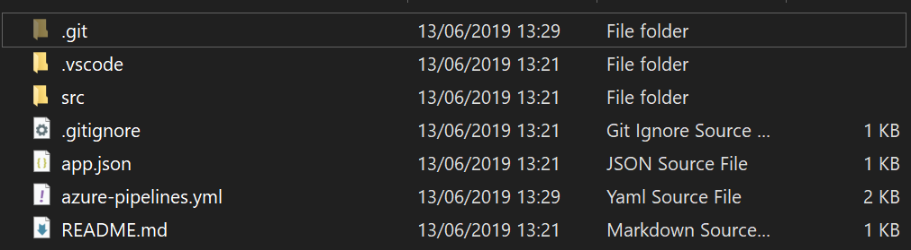

这组文件旨在允许你复制、重新编号、重命名，并对自己的项目进行更多操作。它并不打算作为一个应用程序创建，也没有上传到 AppSource，因此你可以将它作为你自己应用程序的依赖项使用。

# 第一次运行应用程序

一旦进入 Visual Studio Code，应用程序按原样构建并发布。你只需创建 `launch.json`，下载符号，并立即构建应用程序。这将带你到客户列表页面，其中有以下两个新操作：

+   打开 WaldoNAVPad 文本：一个常规页面，包含一个多行文本框来处理大文本

+   打开 WaldoNAVPad HTML：一个基于 JavaScript 的 HTML 编辑器（基于 TinyMCE）

操作显示如下：

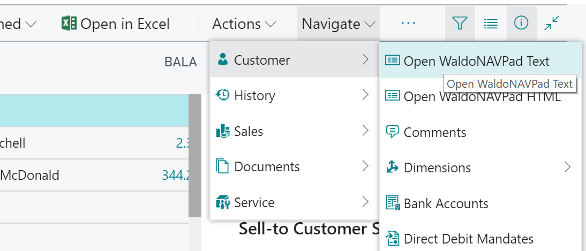

这是常规页面上的文本编辑器：

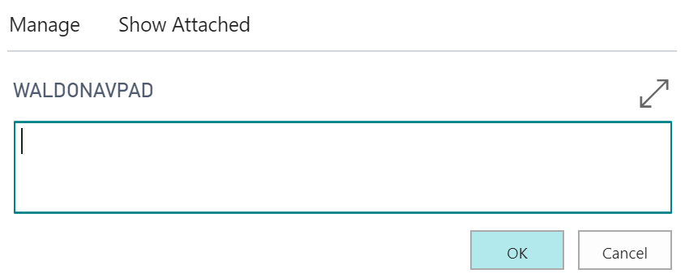

HTML 文本编辑器如下：

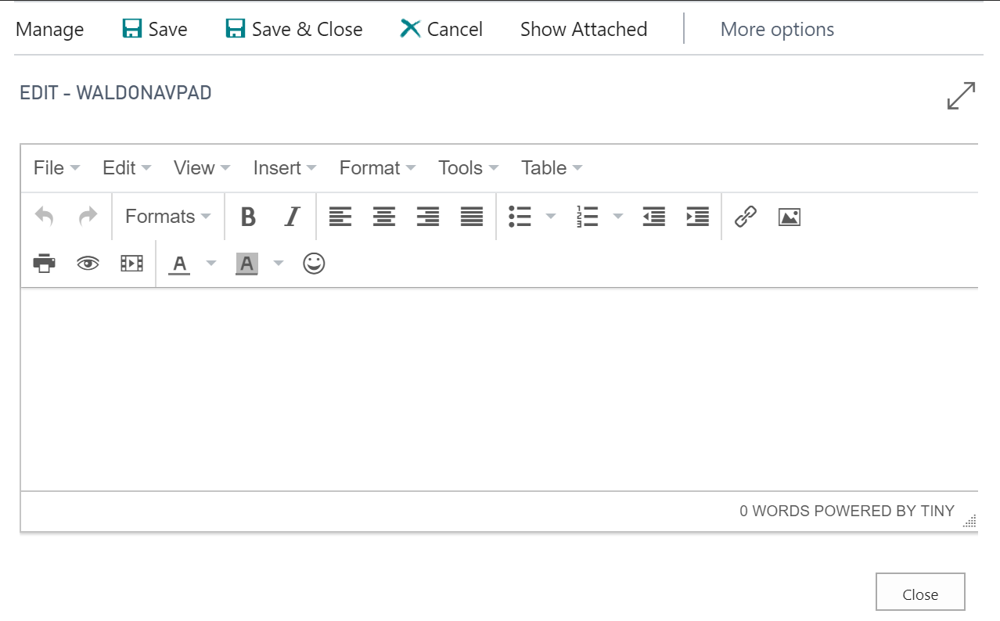

接下来，让我们看看文本的背景是如何显示的。

# 背景

当你深入查看代码时，你会看到应用程序由两部分组成：

+   **NAVpad 处理**：此子文件夹包含处理 NAVpad 的代码。其思路是你只使用 `WaldoNAVPad` 类代码单元，在其中你可以展示/保存/获取来自 NAVpad 的文本。为了保存文本，它将使用文本处理功能。

+   **文本处理**：此子文件夹包含用于智能处理需要保存到数据库或从数据库加载的文本的代码。如果你想使用 NAVPad 文本表格，则无需使用这些方法。然而，如果你想将文本保存到自己的表格中，你可以直接使用 `WaldoNAVPad` 文本类代码单元中的函数，这些函数允许你获取文本并循环处理它，将其保存到你自己的表格中。

通过循环处理文本，系统会在空格或回车符处切割句子，尽量保留文本的格式。

在下面的示例中，你可以看到 NAVPad 处理程序通过循环文本来保存文本：

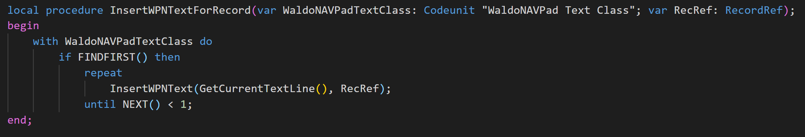

默认情况下，系统将文本保存到两个表格中：

+   `WaldoNAVPad` 二进制大对象存储：这是一个包含格式化 HTML 标签的表格，用于保留用户对文本所做的所有格式化。

+   `WaldoNAVPad` 文本存储：这是一个表格，其中所有 HTML 标签都被去除，以便能够在 Business Central 中体面地显示。

为了显示这些表格的内容，应用程序在 `_JustForTexting` 文件夹中有两个页面：

+   页面 82,150 WaldoNAVPad 二进制大对象

+   页面 82,149 WaldoNAVPad 文本

这是运行名为 WaldoNAVPad 文本的页面时，记录如何被保存的示例：

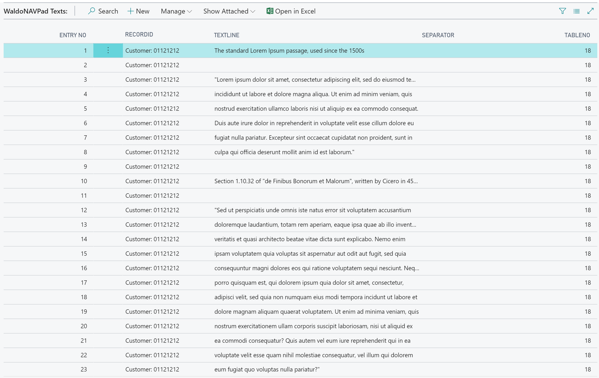

接下来，我们将看到如何实现这些操作。

# 实现逻辑

为了向你展示如何在自己的业务逻辑中实现这一点，应用程序有一个 `_JustForTesting` 子文件夹，包含页面 22（客户列表）的页面扩展，展示了如何在页面上简单地创建一个操作，并通过调用类函数实现 `WaldoNAVPad`：

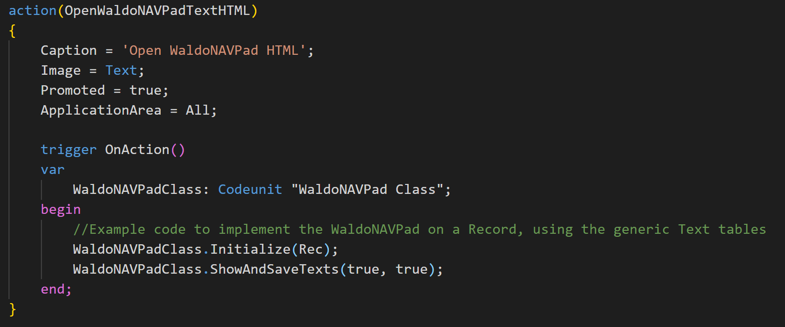

`Initialize` 函数将加载与当前记录关联的文本。`ShowAndSaveTexts` 方法将在用户选择查看时，显示文本（在这种情况下，是在 HTML 编辑器中）。

# MostUselessAppEver

Waldo 有一个并非特别重要，但相当有趣的仓库，名为 *最无用的应用程序*。它是一个 AL 应用程序，旨在用于演示、原型设计、试验或测试——你可以任意定义。它包含了 AL 开发中许多不同部分和主题的尝试和演示。

以下是几个示例：

+   翻译

+   不同的 .NET 封装

+   一些与 Visual Studio Code 配合使用的编辑技巧

+   包含 SQL 文件以检查应用程序的表

+   发布 Web 服务

+   包含用于检查 Web 服务的 HTTP 文件

+   函数重载

+   租户管理代码单元

你可以在 Waldo 的 GitHub 上找到 `MostUselessAppEver`：[`github.com/waldo1001/MostUselessAppEver`](https://github.com/waldo1001/MostUselessAppEver)。

你可以简单地克隆仓库并开始使用。这里没有一块有用的业务逻辑，但它会向你展示一些关于 AL 开发的技巧。

# PowerShell 工具

如前所述，Waldo 已经深入使用 PowerShell 进行开发。虽然重点放在 C/AL 上，包括合并、升级等，但在 AL 上，PowerShell 的使用需求目前还不大（暂时）。

但让我们指出他脚本中一些在 AL 开发中可能有用的地方。

# GitHub

Waldo 的所有 PowerShell 模块和脚本都可以在 GitHub 上找到：[`github.com/waldo1001/Cloud.Ready.Software.PowerShell`](https://github.com/waldo1001/Cloud.Ready.Software.PowerShell)。

你将看到两个文件夹：

+   `PSModules`：此文件夹包含所有模块的代码。这些模块也可以在 PowerShell Gallery 上找到：[`www.powershellgallery.com/packages?q=waldo`](https://www.powershellgallery.com/packages?q=waldo)。

+   `PSScripts`：此文件夹包含大多数使这些模块功能得以实现的脚本。

# Docker 脚本

Waldo 在多种方式中使用 Docker。首先，他在自己的笔记本电脑上运行了一个 Windows 2016 服务器虚拟机，并在其中安装了 Docker——因此，从某种程度上说，它是一个远程 Docker 主机。接着，他转向了在自己 PC 上使用 Docker，这使得开发体验有所简化。他管理 Docker 的所有脚本都位于 `PSScripts`/`NAVDocker` 文件夹中。

在这里，你会找到创建容器的脚本，也有一些在 Docker 容器中与应用程序交互的脚本，例如：

+   `CleanApp`：这将从 Docker 容器中移除所有应用程序。

+   `InstallApp`：这将使用 PowerShell 安装一个应用程序。

+   `ExportObjectsAsAL`：这将把对象导出为 AL 文件。它对于报告非常方便，可以轻松导出、重命名和替换。

# 发布者

在另一个代码库（`blog.CALAnalysis`）中，Waldo 记录了从某个版本的 NAV 或 Business Central 中的所有发布者，这将生成一个列出所有事件发布者及其调用位置的文件。

以下是发布者的示例：

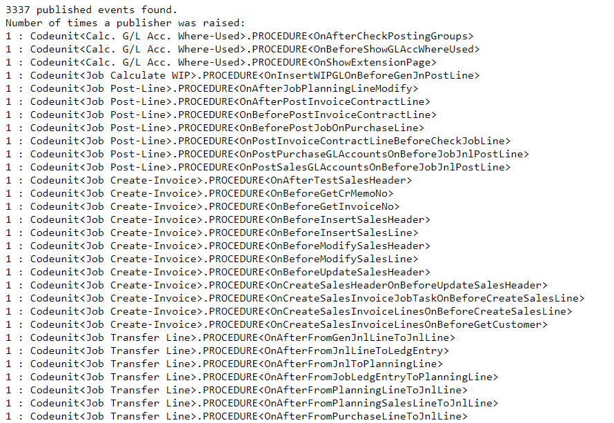

这些是它们被调用的地方：

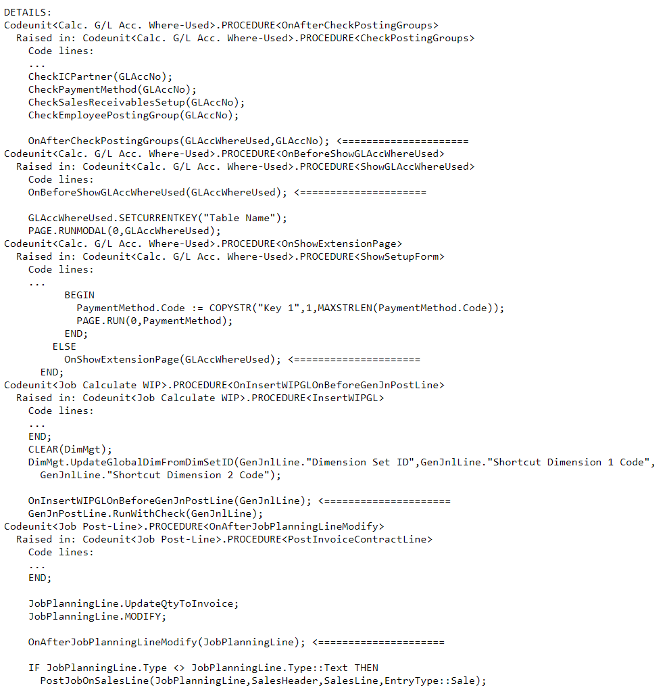

很多人会参考这个内容，试图确认他们即将使用的事件是否在预期的位置被调用。

# ALOps

**ALOps** 是 Waldo 当前正在开发的工具。该工具的目标是为 Dynamics 365 Business Central 合作伙伴提供一种尽可能简单的方式，以便在 Azure DevOps 中设置构建和发布管道。

本质上，构建和发布管道是 **持续集成/持续部署**（**CI/CD**）的重要组成部分，但这离 AL 开发者的日常知识相去甚远。`ALOps` 的作用就是弥合这座桥梁：即使知识有限，你也可以在几分钟内设置自己的构建管道。

# DevOps 扩展

**ALOps** 是一个可在 Azure DevOps 市场上获取的 DevOps 扩展：

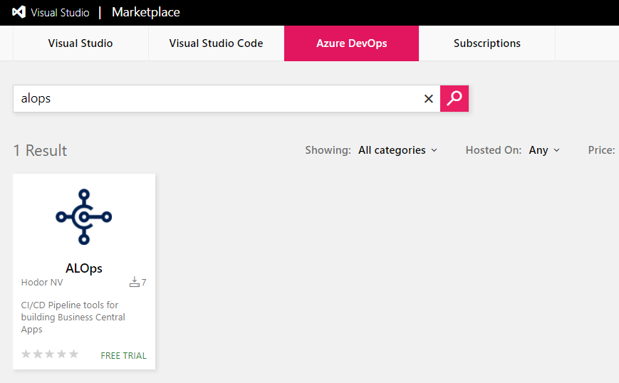

对于任何开源代码库，都是免费的。

该扩展实际上是一个结构化的 PowerShell 脚本集合。更棒的是，用户无需具备任何 PowerShell 知识即可设置最复杂的构建管道，包括应用签名、编译、测试等。

# 步骤

`ALOps` 用于设置管道，它包含我们所称的步骤。今天它包含的步骤如下：

+   编译应用

+   签名应用

+   验证已签名的应用

+   发布应用

+   测试应用

+   从环境中清除应用

+   在不同环境之间复制应用

+   导入 RapidStart 包

+   导入许可证

+   构建 Docker 容器

+   等待 Docker 容器构建完成

+   移除 Docker 容器

+   导入 **用于并行开发**（**fob**）

+   导出对象（`txt` 或 `fob`）

+   编译（C/AL）

所有这些步骤都可以在 Docker 或非 Docker 环境中运行，视你需要而定。

# GitHub 上的文档

Waldo 在 GitHub 上记录 ALOps，代码库也用于收集问题或其他反馈。你可以在 [`github.com/HodorNV/ALOps`](https://github.com/HodorNV/ALOps) 找到它。

该代码库实际上只是描述 DevOps 扩展的一组文档。

# 应用模板

为了让应用开发者更容易设置构建和发布管道，已有一个不断发展的代码库，里面有模板应用和构建管道，应用开发者可以直接使用这些模板导入，这样他们就可以从一套现成的文件开始，包括一个可工作的构建管道。

所有代码库都托管在这个公共 DevOps 项目中：

[`dev.azure.com/HodorNV/ALOps%20Templates`](https://dev.azure.com/HodorNV/ALOps%20Templates)

# 使用 ALOps 的示例

我们之前提到的`WaldoNavPad`应用实际上已经在 Azure DevOps 中设置了一个有效的构建管道，即使`WaldoNavPad`的仓库是在 GitHub 上。Waldo 已在这个公共仓库中进行了设置：

[`dev.azure.com/msdyn365bc/WaldoGitHubBuilds/`](https://dev.azure.com/msdyn365bc/WaldoGitHubBuilds/)

只需导航到构建页面并点击其中一个构建，就可以查看详细信息：

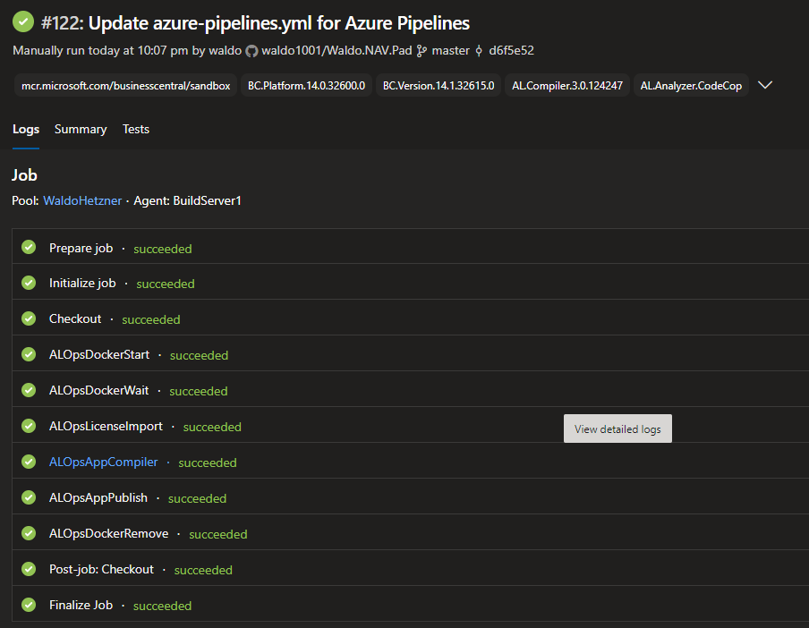

对于此构建的设置，你需要在仓库中打开`azure-pipelines.yml`文件：

[`github.com/waldo1001/Waldo.NAV.Pad`](https://github.com/waldo1001/Waldo.NAV.Pad)

它为你提供了一个可读的、即刻可用的构建管道，并且它是仓库的一部分。所有构建应用所需的设置和步骤都在那里：

```
name: $(Build.BuildId)
variables:
- group: 'ALOps Build Pipeline Variables'
- name: 'AppVersion'
 value: '1.0.[yyyyWW].*'
- name: 'dockerimage'
 value: 'mcr.microsoft.com/businesscentral/sandbox'

pool:
 name: WaldoHetzner

steps:
- checkout: self
 clean: true

- task: ALOpsDockerStart@1
  inputs:
    docker_image: $(dockerimage)
    docker_pull: true
    docker_login: 'Insider Docker Registry'

- task: ALOpsDockerWait@1
  inputs:
     search_string: 'Ready for connections!'

- task: ALOpsLicenseImport@1
  inputs:
    usedocker: true
    license_path: $(bc.license)

- task: ALOpsAppCompiler@1
  inputs:
    usedocker: true
    nav_app_version: $(AppVersion)
    failed_on_warnings: true

- task: ALOpsAppPublish@1
  inputs:
     usedocker: true
     nav_artifact_app_filter: '*.app' 
     skip_verification: true

- task: ALOpsDockerRemove@1
  enabled: true
  condition: always()
  inputs:
     docker_login: 'Insider Docker Registry'

- task: PublishBuildArtifacts@1
  enabled: false
  inputs:
    PathtoPublish: '$(Build.ArtifactStagingDirectory)'
    ArtifactName: 'Base'
    publishLocation: 'Container'
```

关于如何设置的更多信息，请查看市场上的应用或之前提到的 GitHub 仓库，它们可以为你提供所有需要的设置信息。

# 摘要

在本章中，我们看到了一些有趣的第三方工具，可以帮助你在为 Dynamics 365 Business Central 开发扩展时提高生产力。

这是本书的最后一章。在所有这些章节中，我们涵盖了掌握每个 Dynamics 365 Business Central 实施所需的所有主题，从基础到最复杂的内容。现在轮到你了：开始开发扩展，拥抱 SaaS，并将这些主题付诸实践。
