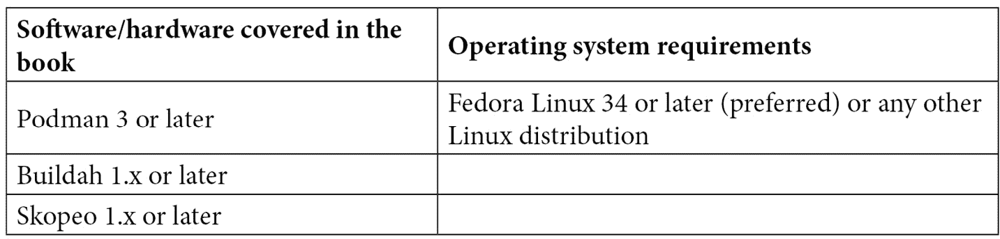

# 序言

DevOps 最佳实践鼓励将容器作为云原生生态系统的基础。由于容器已经成为打包应用程序及其依赖项的新标准，了解如何实现、构建和管理它们已成为开发人员、系统管理员以及 SRE/运维团队的必要技能。Podman 及其配套工具 Buildah 和 Skopeo，构成了一个强大的工具集，有助于提升容器化应用程序的开发、执行和管理。从容器化及其底层技术的基本概念开始，本书将帮助你用 Podman 启动第一个容器。本书探索了完整的工具集，展示了新容器的开发、生命周期管理、故障排除和安全性方面。

到了《Podman for DevOps》一书的结尾，你将掌握将应用程序构建和打包到容器中，以及部署、管理和与系统服务集成所需的技能。

# 本书适用人群

本书面向希望学习如何在容器内构建和打包应用程序的云开发人员，以及希望将容器与系统服务和编排解决方案集成、部署和管理的系统管理员。本书详细比较了 Docker 和 Podman，帮助你快速学习 Podman。

# 本书内容

*第一章*，*容器技术介绍*，涵盖了容器技术的关键概念、一些历史背景以及使容器技术得以运行的基础要素。

*第二章*，*Podman 与 Docker 的比较*，带你了解 Docker 与 Podman 的架构，查看高层概念以及它们之间的主要区别。

*第三章*，*运行第一个容器*，教你如何设置运行和管理第一个 Podman 容器的前提条件。

*第四章*，*管理运行中的容器*，帮助你理解如何管理容器的生命周期，启动/停止/杀死容器，以正确管理服务。

*第五章*，*为容器的数据实现存储*，涵盖了容器的存储需求基础、可用的各种存储选项，以及如何使用它们。

*第六章*，*认识 Buildah——从零构建容器*，是你开始学习 Buildah 基本概念的章节，Buildah 是 Podman 的配套工具，帮助系统管理员和开发人员在容器创建过程中提供帮助。

*第七章*，*与现有应用构建过程集成*，教你如何将 Buildah 集成到现有应用的构建过程中。

*第八章*，*选择容器基础镜像*，详细讲解了容器基础镜像格式、可信源及其底层特性。

*第九章*，*将镜像推送到容器注册表*，教你容器注册表是什么，如何认证它们，以及如何通过推送和拉取镜像进行操作。

*第十章*，*容器故障排查与监控*，展示了如何检查正在运行或失败的容器，如何查找问题，并监控容器的健康状态。

*第十一章*，*容器安全性*，深入探讨了容器的安全性、主要问题以及在运行时更新容器镜像的重要步骤。

*第十二章*，*实现容器网络概念*，教你关于**容器网络接口**（**CNI**），如何将容器暴露给外部世界，最后，如何在同一机器上互联多个容器。

*第十三章*，*Docker 迁移技巧*，将带领你学习如何通过使用 Podman 的一些内置功能，以及一些可能在迁移过程中帮助的技巧，以最简单的方式从 Docker 迁移到 Podman。

*第十四章*，*与 systemd 和 Kubernetes 的互动*，展示了如何将容器集成作为基础操作主机中的系统服务，从而使其能够通过常见的系统管理员工具进行管理。还将探讨 Podman 与 Kubernetes 的交互功能。

# 为了最大限度地利用本书

在本书中，我们将引导你安装和使用 Podman 3 或更高版本，以及其伴随工具 Buildah 和 Skopeo。书中使用的默认 Linux 发行版是 Fedora Linux 34 或更高版本，但也可以使用其他任何 Linux 发行版。所有命令和代码示例都是在 Fedora 34 或 35 和 Podman 3 或 4 上测试的，但它们也应适用于未来的版本发布。



**如果你使用的是本书的数字版，我们建议你自己输入命令或从本书的 GitHub 仓库访问代码（链接将在下一节提供）。**

**这样做将帮助你避免与代码复制和粘贴相关的潜在错误。**

# 下载示例代码文件

你可以从 GitHub 下载本书的示例代码文件，网址是[`github.com/PacktPublishing/Podman-for-DevOps`](https://github.com/PacktPublishing/Podman-for-DevOps)。如果代码有更新，它将会在 GitHub 仓库中更新。

我们还提供了来自我们丰富书籍和视频目录的其他代码包，可以在[`github.com/PacktPublishing/`](https://github.com/PacktPublishing/)查看！

# 下载彩色图像

我们还提供了一个 PDF 文件，其中包含本书中使用的截图和图表的彩色图像。你可以在这里下载：[`static.packt-cdn.com/downloads/9781803248233_ColorImages.pdf`](https://static.packt-cdn.com/downloads/9781803248233_ColorImages.pdf)。

# 使用的约定

本书中使用了许多文本约定。

`文本中的代码`：表示文本中的代码词、数据库表名、文件夹名称、文件名、文件扩展名、路径名、虚拟网址、用户输入以及 Twitter 用户名。举个例子：“我们刚刚为我们的代码库定义了一个名字，`ubi8-httpd`，并选择将该代码库与 GitHub 代码库进行推送关联。”

一段代码设置如下：

```
[Unit]
Description=Podman API Socket
Documentation=man:podman-system-service(1)
```

当我们希望特别引起你对代码块中某部分的注意时，相关的行或项目会以**粗体**显示：

```
$ podman ps
CONTAINER ID IMAGE
COMMAND CREATED STATUS PORTS
NAMES
685a339917e7 registry.fedoraproject.org/f29/httpd:latest /
usr/bin/run-http... 3 minutes ago Up 3 minutes ago
clever_zhukovsky
```

任何命令行输入或输出都如下所示：

```
$ skopeo login -u admin -p p0dman4Dev0ps# --tls-verify=false localhost:5000
Login Succeeded!
```

**粗体**：表示新术语、重要单词或屏幕上出现的单词。例如，菜单或对话框中的词汇会以**粗体**显示。以下是一个例子：“…并且在收到 GET /请求时，打印一个带有**Hello World!**消息的 HTML 页面。”

提示或重要说明

显示如下。

# 联系我们

我们始终欢迎读者的反馈。

**一般反馈**：如果你对本书的任何方面有疑问，请通过电子邮件联系我们：customercare@packtpub.com，并在邮件主题中注明书名。

**勘误表**：尽管我们已尽一切努力确保内容的准确性，但错误难免发生。如果你在本书中发现错误，请向我们报告。请访问[www.packtpub.com/support/errata](http://www.packtpub.com/support/errata)并填写表单。

**盗版**：如果你在互联网上发现我们的作品的任何非法复制品，我们将非常感激你提供具体的位置或网站名称。请通过版权@packt.com 与我们联系，并提供相关资料的链接。

**如果你有兴趣成为作者**：如果你在某个领域有专业知识，并且有兴趣写书或为书籍做贡献，请访问[authors.packtpub.com](http://authors.packtpub.com)。

# 分享你的想法

阅读后，我们希望听听你的想法！[请点击这里直接跳转到本书的亚马逊评论页面](https://packt.link/r/1-803-24823-8)并分享你的反馈。

你的评论对我们和技术社区非常重要，将帮助我们确保提供优质的内容。
