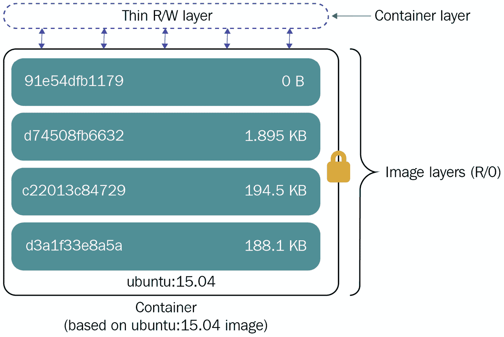

# 第一章：容器技术简介

**容器技术**在操作系统历史中有着悠久的根基。例如，你知道容器技术的部分内容是在 1970 年代就诞生了吗？尽管它们的方式简单直观，但容器背后有许多值得深入分析的概念，只有完全理解和欣赏它们，才能明白它们是如何在 IT 行业中崭露头角的。

我们将探索这项技术，以更好地理解它的工作原理、背后的理论以及基本概念。了解工具背后的机制和技术将使你能够轻松地掌握并学习整个技术的关键概念。

然后，我们还将探讨容器技术的目的，以及它为何如今已经在每家公司得到广泛应用。你知道吗，现在世界上 50%的组织在生产环境中运行着一半以上的应用程序作为容器？

让我们深入了解这项伟大的技术！

在本章中，我们将提出以下问题：

+   什么是容器？

+   我为什么需要容器？

+   容器来自哪里？

+   今天容器在哪里被使用？

# 技术要求

本章不要求任何技术前提，因此可以放心阅读，无需担心在工作站上安装或设置任何软件！

无论如何，如果你是容器的新手，在这里你会发现许多技术概念有助于理解后续章节。我们建议仔细阅读，并在需要时再回来查看。了解 Linux 操作系统的基础知识有助于理解本书中的技术概念。

# 本书约定

在接下来的章节中，我们将通过实践示例学习许多新概念，这些示例将需要与 Linux shell 环境进行积极互动。在实践示例中，我们将使用以下约定：

+   对于任何以`$`字符开头的 shell 命令，我们将使用 Linux 系统的标准用户（非 root 用户）。

+   对于任何以`#`字符开头的 shell 命令，我们将使用 Linux 系统的 root 用户。

+   任何输出或 shell 命令，如果代码块中显示的内容太长而无法在一行中显示，将会通过`\`字符中断，并继续到新的一行。

# 什么是容器？

本节从基础概念入手，逐步介绍容器技术，从进程、文件系统、系统调用、进程隔离，到容器引擎和运行时。该节的目的是描述容器如何实现进程隔离。我们还将描述容器与虚拟机的区别，并强调这两种场景的最佳使用案例。

在问容器是什么之前，我们应该先回答另一个问题：什么是进程？

根据*《Linux 编程接口》*（作者：*Michael Kerrisk*）一书，*进程*是一个正在执行的程序的实例。程序是一个包含执行进程所需信息的文件。程序可以动态链接外部库，或者可以在程序本身中静态链接（Go 编程语言默认使用这种方式）。

这引出了一个重要概念：进程在机器的 CPU 中执行，并分配一部分内存，包含程序代码和代码本身使用的变量。进程实例化在机器的用户空间中，其执行由操作系统内核协调。当进程被执行时，它需要访问不同的机器资源，如 I/O（磁盘、网络、终端等）或内存。当进程需要访问这些资源时，它会执行系统调用进入内核空间（例如，读取磁盘块或通过网络接口发送数据包）。

进程通过文件系统间接与主机磁盘交互，文件系统是一种多层存储抽象，方便对文件和目录的读写访问。

一台机器通常运行多少个进程？很多。它们由操作系统内核进行调度，通过复杂的调度逻辑使得这些进程像是在独立的 CPU 核心上运行一样，尽管同一个核心是多个进程共享的。

同一个程序可以实例化多个相同类型的进程（例如，在同一台机器上运行多个 Web 服务器实例）。冲突，如多个进程尝试访问相同的网络端口，必须相应地进行管理。

没有什么可以阻止我们在主机上运行同一个程序的不同版本，假设系统管理员需要承担管理潜在的二进制文件、库及其依赖项的冲突的任务。这可能会变得非常复杂，通常使用常见的实践并不容易解决。

这段简短的介绍是为了设定背景。

容器是一个简单而聪明的答案，解决了运行隔离进程实例的需求。我们可以安全地断言，容器是一种在多个层面上有效的应用隔离形式：

+   **文件系统隔离**：容器化进程具有独立的文件系统视图，它们的程序是从隔离的文件系统中执行的。

+   **进程 ID 隔离**：这是在独立的**进程 ID**（**PIDs**）集下运行的容器化进程。

+   **用户隔离**：**用户 ID**（**UIDs**）和**组 ID**（**GIDs**）是容器内隔离的。一个进程的 UID 和 GID 在容器内可能不同，并且只能在容器内部以特权的 UID 或 GID 运行。

+   **网络隔离**：这种隔离与主机网络资源相关，例如网络设备、IPv4 和 IPv6 栈、路由表和防火墙规则。

+   **IPC 隔离**：容器为主机的 IPC 资源提供隔离，例如 POSIX 消息队列或 System V IPC 对象。

+   **资源使用隔离**：容器依赖于 Linux **控制组**（**cgroups**）来限制或监控某些资源的使用，如 CPU、内存或磁盘。我们将在本章后面讨论更多关于 cgroups 的内容。

从采纳的角度来看，容器的主要目的是，或者说最常见的用例，是在隔离的环境中运行应用程序。为了更好地理解这个概念，我们可以看一下下面的图示：


图 1.1 – 原生应用与容器化应用对比

在不提供容器化功能的系统上本地运行的应用程序共享相同的二进制文件和库，以及相同的内核、文件系统、网络和用户。这可能在部署更新版本的应用程序时引发许多问题，尤其是冲突的库问题或未满足的依赖关系。

另一方面，容器为应用程序及其相关依赖提供了一致的隔离层，确保它们在同一主机上无缝共存。新的部署仅由执行新容器化版本组成，因为它不会与其他容器或原生应用程序互动或冲突。

Linux 容器通过不同的本地内核特性启用，其中最重要的是 **Linux 命名空间**。命名空间抽象了特定的系统资源（特别是前面描述的资源，如网络、文件系统挂载、用户等），并使它们对隔离的进程显得是唯一的。通过这种方式，进程看似在与主机资源交互，例如主机文件系统，实际上暴露的是一个替代的、隔离的版本。

目前，我们有总共八种命名空间：

+   **PID 命名空间**：这些命名空间将进程 ID 号隔离到一个独立的空间中，允许不同 PID 命名空间中的进程保持相同的 PID。

+   **用户命名空间**：这些命名空间隔离用户和组 ID、根目录、密钥环和权限。这允许一个进程在容器内具有特权的 UID 和 GID，同时在命名空间外部具有非特权的 UID 和 GID。

+   **UTS 命名空间**：这些命名空间允许主机名和 NIS 域名的隔离。

+   **网络命名空间**：这些命名空间允许隔离网络系统资源，如网络设备、IPv4 和 IPv6 协议栈、路由表、防火墙规则、端口号等。用户可以创建名为 **veth 对** 的虚拟网络设备，在网络命名空间之间构建隧道。

+   **IPC 命名空间**：这些命名空间隔离 IPC 资源，如 System V IPC 对象和 POSIX 消息队列。在 IPC 命名空间中创建的对象只能由命名空间中的进程访问。进程使用 IPC 在客户端-服务器机制中交换数据、事件和消息。

+   **cgroup 命名空间**：这些命名空间隔离 cgroup 目录，提供进程 cgroup 的虚拟化视图。

+   **挂载命名空间**：这些命名空间提供了隔离进程在命名空间中看到的挂载点列表。

+   **时间命名空间**：这些命名空间提供了系统时间的隔离视图，允许命名空间中的进程在与主机时间的偏移下运行。

现在，让我们继续讨论资源使用情况。

## 使用 cgroups 管理资源

cgroups 是 Linux 内核的本地功能，目的是将进程组织成一个层级树，并限制或监控它们的资源使用。

内核的 cgroups 接口，与 `/proc` 的情况类似，通过 `cgroupfs` 伪文件系统暴露出来。这个文件系统通常挂载在主机的 `/sys/fs/cgroup` 下。

cgroups 提供了一系列控制器（也叫子系统），可用于不同的目的，例如限制进程的 CPU 时间配额、内存使用、冻结和恢复进程等。

控制器的组织层次结构随着时间的推移发生了变化，目前有两个版本，V1 和 V2。在 cgroups V1 中，不同的控制器可以挂载到不同的层级上。而 cgroups V2 提供了一个统一的控制器层级结构，进程位于树的叶节点上。

cgroups 被容器用来限制 CPU 或内存的使用。例如，用户可以限制 CPU 配额，这意味着限制容器在给定时间段内可以使用的 CPU 微秒数，或者限制 CPU 配额，容器占用的 CPU 周期的加权比例。

现在我们已经展示了进程隔离的工作原理（无论是对于命名空间还是资源），接下来我们可以举几个基本示例。

## 运行隔离的进程

了解一个有用的事实是，GNU/Linux 操作系统提供了运行容器所需的所有功能。这个结果可以通过使用特定的系统调用（特别是 `unshare()` 和 `clone()`）以及如 `unshare` 命令等工具来实现。

例如，要在隔离的 PID 命名空间中运行一个进程（比如 `/bin/sh`），用户可以依赖 `unshare` 命令：

```
# unshare --fork --pid --mount-proc /bin/sh 
```

结果是在隔离的 PID 命名空间中执行一个新的 shell 进程。用户可以尝试监控该进程视图，并将获得类似以下的输出：

```
sh-5.0# ps aux
USER         PID %CPU %MEM    VSZ   RSS TTY      STAT START   TIME COMMAND
root           1  0.0  0.0 226164  4012 pts/4    S    22:56   0:00 /bin/sh
root           4  0.0  0.0 227968  3484 pts/4    R+   22:56   0:00 ps aux
```

有趣的是，前面例子中的 shell 进程正在以 PID 1 运行，这是正确的，因为它是在新的隔离命名空间中运行的第一个进程。

无论如何，PID 命名空间将是唯一被抽象的命名空间，而所有其他系统资源仍然保持为原主机资源。如果我们希望增加更多的隔离，例如在网络栈上，我们可以向之前的命令添加`--net`标志：

```
 # unshare --fork --net --pid --mount-proc /bin/sh
```

结果是一个在 PID 和网络命名空间上都被隔离的 shell 进程。用户可以检查网络 IP 配置，并意识到主机原生设备不再被 unshared 进程直接看到：

```
sh-5.0# ip addr show
1: lo: <LOOPBACK> mtu 65536 qdisc noop state DOWN group default qlen 1000
    link/loopback 00:00:00:00:00:00 brd 00:00:00:00:00:00
```

前面的示例有助于理解一个非常重要的概念：容器与 Linux 原生特性紧密相关。操作系统提供了一个坚实而完整的接口，帮助容器运行时的开发，而隔离命名空间和资源的能力是开启容器应用的关键。容器运行时的作用是抽象底层隔离机制的复杂性，而挂载点隔离可能是其中最关键的。因此，它值得更详细的解释。

## 隔离挂载

到目前为止，我们看到的示例是没有影响挂载点和进程端文件系统视图的 unsharing。为了获得能够防止二进制文件和库冲突的文件系统隔离，用户需要为暴露的挂载点创建另一个抽象层。

这个结果是通过利用挂载命名空间和绑定挂载实现的。挂载命名空间最早在 2002 年随 Linux 内核 2.4.19 版本引入，它隔离了进程所看到的挂载点列表。每个挂载命名空间暴露一个独立的挂载点列表，从而使不同命名空间中的进程能够感知到不同的目录层级结构。

通过这种技术，可以向执行进程暴露一个包含所有必要的二进制文件和库的替代目录树。

尽管看似简单，挂载命名空间的管理并非直截了当，也不容易掌握。例如，用户需要处理来自不同发行版的目录树的不同归档版本，提取它们，并在独立的命名空间上进行绑定挂载。我们稍后会看到，Linux 中最初的容器方法遵循了这种方法。

容器的成功还与一种创新的、多层次的写时复制方法密切相关，该方法用于管理目录树，介绍了一种简单而快速的复制、部署和使用容器所需树的方法——容器镜像。

## 容器镜像来拯救

我们必须感谢 Docker 引入了这种存储容器数据的智能方法。随后，镜像将成为**开放容器倡议**（**OCI**）标准规范的一部分（[`github.com/opencontainers/image-spec`](https://github.com/opencontainers/image-spec)）。

镜像可以被视为一种文件系统捆绑包，它在运行容器之前会被下载（拉取）并解压到主机中。

镜像从名为`quay.io`或`docker.io`的仓库以及可以在客户私有基础设施、内部部署或云环境中执行的私有注册中心下载。

镜像可以由 DevOps 团队构建，以满足特殊需求或嵌入必须在主机上部署和执行的工件。

在镜像构建过程中，开发人员可以注入预构建的工件或源代码，这些代码可以在构建容器中进行编译。为了优化镜像大小，可以创建多阶段构建，第一阶段使用包含必要编译器和运行时的基础镜像来编译源代码，第二阶段则将构建好的工件注入到一个精简、轻量级的镜像中，优化启动速度和存储占用。

构建过程的*配方*定义在一个特殊的文本文件中，称为**Dockerfile**，它定义了组装最终镜像所需的所有步骤。

在构建完成后，用户可以将自己的镜像推送到公共或私有注册中心，供以后使用或进行复杂的编排部署。

以下图表总结了构建工作流：


图 1.2 – 镜像构建工作流

我们将在本书后续部分更详细地讨论构建主题。

是什么让容器镜像如此特别？镜像的智能理念在于，它们可以被视为一种打包技术。当用户构建自己的镜像，并在操作系统目录树中安装所有二进制文件和依赖项时，他们实际上是在创建一个自洽的对象，可以在任何地方部署，而无需进一步的软件依赖。从这个角度来看，容器镜像是对长期争论的“*它在我的机器上能运行*”这一说法的答案。

开发团队喜欢它们，因为他们可以确保其应用程序的执行环境，而运维团队喜欢它们，因为它们通过消除维护和更新服务器库依赖的繁琐任务简化了部署过程。

容器镜像的另一个智能特点是它们的写时复制、多层次方法。镜像不是由单一的大型二进制归档组成，而是由多个名为*blobs*或*layers*的`tar`归档文件组成。各层通过镜像元数据组合在一起，并压缩成一个单一的文件系统视图。这个结果可以通过多种方式实现，但目前最常见的方式是使用**联合文件系统**。

**OverlayFS**（[`www.kernel.org/doc/html/latest/filesystems/overlayfs.html`](https://www.kernel.org/doc/html/latest/filesystems/overlayfs.html)）是目前使用最广泛的联合文件系统。它被维护在内核树中，尽管它并不完全符合 POSIX 标准。

根据内核文档，*"一个覆盖文件系统结合了两个文件系统——一个是'上层'文件系统，另一个是'下层'文件系统。"* 这意味着它可以结合多个目录树，提供一个独特的、压缩的视图。这些目录就是层，分别称为 `lowerdir` 和 `upperdir`，用于定义低级目录和位于其上层的目录。统一视图被称为 *merged*。它最多支持 128 层。

OverlayFS 并不意识到容器镜像的概念；它仅作为一种基础技术，用于实现 OCI 镜像所使用的多层解决方案。

OCI 镜像也实现了 **不可变性** 的概念。镜像的所有层都是只读的，无法修改。更改下层内容的唯一方法是重新构建镜像并进行适当的修改。

不可变性是云计算方法的重要支柱。它意味着基础设施（如实例、容器或甚至复杂的集群）只能通过不同版本替换，而不能修改以实现目标部署。因此，我们通常不会修改正在运行的容器内部的任何内容（例如手动安装软件包或更新配置文件），即使在某些情况下可能是可行的。相反，我们会用新的更新版本替换其基础镜像。这也确保了每个运行中的容器副本与其他副本保持同步。

当容器执行时，会在镜像上创建一个新的读/写薄层。这个层是短暂的，因此在容器销毁后，所有在其上的更改都会丢失：



图 1.3 – 容器的层

这引出了另一个重要的观点：我们不在容器内部存储任何东西。它们的唯一目的是为我们的应用程序提供一个稳定一致的运行时环境。数据必须通过外部访问，使用容器内部的绑定挂载或网络存储（如 **网络文件系统** (**NFS**)、**简单存储服务** (**S3**)、**互联网小型计算机系统接口** (**iSCSI**) 等）。

容器的挂载隔离和镜像的分层设计提供了一致的、不可变的基础设施，但仍然需要更多的安全限制，以防止具有恶意行为的进程逃离容器沙箱，窃取主机的敏感信息或利用主机攻击其他机器。以下小节介绍了安全性考虑因素，展示容器运行时如何限制这些行为。

## 安全性考虑

从安全角度来看，有一个硬性事实需要分享：如果一个进程正在容器内运行，这并不意味着它比其他进程更安全。

恶意攻击者仍然能够通过主机的文件系统和内存资源进行攻击。为了实现更好的安全隔离，可以使用以下附加功能：

+   **强制访问控制**：*SELinux* 或 *AppArmor* 可用于加强容器与宿主机之间的隔离。这些子系统及其相关命令行工具使用基于策略的方法，在文件系统和网络访问方面更好地隔离正在运行的进程。

+   `0`)，它会根据进程凭证（其有效的 UID）进行权限检查。这些权限或特权称为能力，可以独立启用，赋予一个无特权进程有限的特权权限以访问特定资源。在运行容器时，我们可以添加或删除能力。

+   **安全计算模式**（**Seccomp**）：这是一个原生内核特性，可用于限制进程从用户空间到内核空间所能发出的系统调用。通过识别进程运行所需的严格必要权限，管理员可以应用 seccomp 配置文件来限制攻击面。

手动应用前述安全特性并不总是容易和直接的，因为其中一些需要一定的学习曲线。自动化并简化（可能是声明式方式）这些安全约束的工具具有很高的价值。

本书稍后将更详细地讨论安全主题。

## 容器引擎和运行时

尽管从学习角度来看，手动运行和保护容器是可行且特别有用的，但这种方法不可靠且复杂。它在生产环境中难以重现和自动化，并且很容易导致不同主机之间的配置漂移。

这就是容器引擎和运行时诞生的原因——它们帮助自动化创建容器以及完成所有与容器运行相关的任务。

这两个概念是完全不同的，往往容易混淆，因此需要澄清：

+   **容器引擎** 是一个软件工具，接受并处理来自用户的请求，创建一个包含所有必要参数和参数的容器。它可以被视为一种协调器，因为它负责执行所有必要的操作，使容器能够启动并运行；然而，它并不是容器的实际执行者（容器运行时的角色）。

引擎通常解决以下问题：

+   提供命令行和/或 REST 接口供用户交互

+   拉取并提取容器镜像（本书稍后会讨论）

+   管理容器挂载点和绑定挂载提取的镜像

+   处理容器元数据

+   与容器运行时交互

我们已经指出，当实例化一个新容器时，会在镜像上方创建一个薄的读写层；这个任务由容器引擎完成，它负责向容器运行时呈现合并目录的工作堆栈。

容器生态系统提供了多种容器引擎选择。**Docker** 毫无疑问是最著名的（尽管不是第一个）引擎实现，还有 **Podman**（本书的核心主题）、**CRI-O**、**rkt** 和 **LXD** 等。

**容器运行时** 是由容器引擎用于在主机上运行容器的低级软件。容器运行时提供以下功能：

在目标挂载点（通常由容器引擎提供）启动容器化进程，并设置一组自定义元数据

管理 cgroups 的资源分配

管理强制访问控制策略（SELinux 和 AppArmor）和能力

如今有许多容器运行时，它们中的大多数都实现了 **OCI 运行时规范** 参考（[`github.com/opencontainers/runtime-spec`](https://github.com/opencontainers/runtime-spec)）。这是一个行业标准，定义了运行时应该如何行为以及它应实现的接口。

最常见的 OCI 运行时是 **runc**，它被大多数著名引擎使用，还有其他实现，如 **crun**、**kata-containers**、**railcar**、**rkt** 和 **gVisor**。

这种模块化方法使得容器引擎可以根据需要更换容器运行时。例如，当 Fedora 33 发布时，它引入了一个新的默认 cgroups 层级，称为 cgroups V2。最初，runc 不支持 cgroups V2，而 Podman 只需将 runc 替换为另一个已兼容新层级的 OCI 兼容容器运行时（**crun**）。现在，runc 终于支持 cgroups V2，Podman 将能够安全地再次使用它，且对最终用户没有任何影响。

在介绍了容器运行时和引擎之后，是时候回答容器入门中最具争议和最常被问到的问题——容器和虚拟机之间的区别。

## 容器与虚拟机

到目前为止，我们讨论了通过原生操作系统特性和容器引擎与运行时增强实现的隔离。许多用户可能会被误导，认为容器是一种虚拟化形式。

这完全是误解；容器并不是虚拟机。

那么，容器和虚拟机之间的主要区别是什么呢？在回答之前，我们可以查看以下图示：


图 1.4 – 容器中的系统调用与内核的交互

尽管容器是隔离的，但它持有一个直接与主机内核通过系统调用交互的进程。该进程可能不清楚主机的命名空间，但它仍然需要切换到内核空间进行 I/O 访问等操作。

另一方面，虚拟机总是运行在**虚拟化管理程序**（hypervisor）上，运行一个具有独立文件系统、网络、存储（通常是镜像文件）和内核的来宾操作系统。虚拟化管理程序是提供硬件抽象和虚拟化的软体，它使得在具备能力的硬件上运行的单一裸机可以实例化多个虚拟机。来宾操作系统内核看到的硬件大多是虚拟化的硬件，尽管有一些例外：


图 1.5 – 架构 – 虚拟化与容器

这意味着当一个进程在虚拟机内执行系统调用时，它总是会被指向来宾操作系统内核。

总结一下，我们可以肯定地说，容器与主机共享相同的内核，而虚拟机则拥有独立的来宾操作系统内核。

这一说法暗示了许多考量因素。

从安全角度来看，虚拟机提供了更好的隔离，以防止潜在的攻击。尽管如此，一些最新的基于 CPU 的攻击（例如 Spectre 或 Meltdown 等）可能会利用 CPU 漏洞来访问虚拟机的地址空间。

容器优化了隔离功能，并可以配置严格的安全策略（例如 CIS Docker、NIST、HIPAA 等），使其非常难以被利用。

从可扩展性角度来看，容器的启动速度比虚拟机快。如果镜像已经存在于主机中，启动一个新的容器实例只需几毫秒。这些快速的结果也是由于容器没有内核的特性实现的。而虚拟机必须启动内核和 initramfs，切换到根文件系统，运行某种 init（例如 `systemd`），并启动一定数量的服务。

虚拟机通常会消耗比容器更多的资源。要启动一个来宾操作系统，通常需要分配比启动容器更多的 RAM、CPU 和存储资源。

虚拟机与容器之间的另一个重要区别在于对工作负载的关注。容器的最佳实践是为每个特定的工作负载启动一个容器。另一方面，虚拟机可以同时运行多个工作负载。

想象一个 LAMP 或 WordPress 架构：在非生产环境或小规模生产环境中，将所有组件（Apache、PHP、MySQL 和 WordPress）安装在同一个虚拟机上并不罕见。这个设计可以拆分为一个多容器（或多层）架构，其中一个容器运行前端（Apache-PHP-WordPress），另一个容器运行 MySQL 数据库。运行 MySQL 的容器可以访问存储卷来持久化数据库文件。同时，扩展前端容器的规模也会更加容易。

现在我们已经理解了容器是如何工作的，以及它们与虚拟机的区别，我们可以进入下一个重要问题：我为什么需要一个容器？

# 我为什么需要一个容器？

本节描述了容器在现代 IT 系统中的好处和价值，以及容器如何为技术和业务带来好处。

上述问题可以重新表述为：在生产环境中采用容器的价值是什么？

IT 已经成为一个快速变化的市场驱动环境，其中变化由商业需求和技术提升所决定。在采用新兴技术时，企业总是关注其**投资回报率**（**ROI**），同时力求将**总拥有成本**（**TCO**）控制在合理的范围内。这并不总是容易实现的。

本节将尝试揭示最重要的几点。

## 开源

支撑容器技术的技术是开源的，并已成为许多厂商或社区广泛采用的开放标准。如今，大公司、厂商和云服务提供商都采用了开源软件，开源软件具有许多优点，并为企业提供了巨大的价值。开源软件通常与高价值和创新解决方案相关联——这就是事实！

首先，社区驱动的项目通常具有很大的演进动力，这有助于代码的成熟并不断带来新功能。开源软件对公众开放，且可以被检查和分析。这是一个极好的透明性特性，且对软件的可靠性产生影响，无论是在稳健性还是安全性方面。

其中一个关键方面是，它推动了一个进化模式，即只有最优秀的软件才会被采用、贡献和支持；容器技术是这一行为的完美例证。

## 可移植性

我们已经指出，容器是一种技术，它使用户能够将应用程序及其整个运行时环境打包并隔离开来，这意味着运行所需的所有文件。这个特性解锁了一个关键的好处——可移植性。

这意味着容器镜像可以在任何运行容器引擎的主机上拉取并执行，而不管其底层操作系统的分发版本。无论是从运行容器引擎的 Fedora 还是 Debian Linux 分发版中，CentOS 或 nginx 镜像都可以被无差别地拉取并以相同的配置执行。

再次，如果我们拥有许多相同的主机集群，我们可以选择将应用实例调度到其中一台主机上（例如，使用负载指标来选择最合适的主机），并且在运行容器时，可以确保得到相同的结果。

容器的可移植性还减少了厂商锁定，并提高了平台之间的互操作性。

## DevOps 促进者

正如之前所述，容器帮助解决了开发团队和运维团队之间老旧的*在我的机器上能运行*模式，特别是在将应用部署到生产环境时。

作为应用程序的智能且简易打包解决方案，容器满足开发人员创建自包含的包的需求，其中包括运行工作负载所需的所有必要二进制文件和配置。作为一种自包含的方式来隔离进程并保证命名空间和资源使用的分离，容器受到运维团队的青睐，因为他们不再需要维护复杂的依赖关系约束或将每个应用程序单独隔离在虚拟机中。

从这个角度来看，容器可以被视为 DevOps 最佳实践的促进者，开发人员和运维人员可以更加紧密地合作，部署和管理应用程序，而不再有严格的隔离。

想要构建自己容器镜像的开发人员应当更加关注镜像中构建的操作系统层，并与运维团队密切合作，定义构建模板和自动化流程。

## 云就绪性

容器是为云环境构建的，设计时考虑了不可变的方式。不可变模式明确指出，基础设施（无论是单个容器还是复杂的集群）中的变更必须通过重新部署一个修改过的版本来应用，而不是通过修补当前版本。这有助于提高系统的可预测性和可靠性。

当必须推出新的应用版本时，它会被构建为一个新的镜像，并部署一个新的容器来替代旧版本。可以实现构建流水线来管理复杂的工作流程，从应用构建和镜像创建，到镜像注册表推送和标签，再到目标主机的部署。这种方式大大缩短了资源配置时间，同时减少了不一致性。

本书后续将看到，像 Kubernetes 这样的专用容器编排解决方案也提供了自动化调度大量主机的模式，使得容器化的工作负载可以轻松地部署、监控和扩展。

## 基础设施优化

与虚拟机相比，容器具有更轻量的占用，极大地提高了计算和内存资源的效率。通过提供简化工作负载执行的方式，容器的应用可以带来显著的成本节省。

通过减少应用的计算成本来实现 IT 资源优化；如果运行在虚拟机上的应用服务器可以被容器化，并与其他容器一起在主机上运行（具有专用资源限制和请求），计算资源可以节省并重复使用。

整个基础设施可以根据这一新范式重新调整；一个之前配置为虚拟化管理程序的裸金属机器可以重新分配为容器编排系统的工作节点，该节点简单地运行更细粒度的容器化应用。

## 微服务

微服务架构将应用程序拆分为多个执行精细功能的服务，这些服务是应用程序整体的一部分。

传统应用程序采用单体架构，其中所有功能都属于同一个实例。微服务的目的是将单体架构拆分成多个独立交互的小模块。

单体应用程序很适合容器，但微服务应用程序与容器的匹配更加理想。

为每个微服务创建一个容器有助于实现一些重要的好处，例如：

+   微服务的独立可扩展性

+   开发团队云访问程序的责任更加明确

+   不同微服务可能采用不同技术栈的潜在可能

+   对安全性方面（例如暴露的公共服务、mTLS 连接等）的更多控制

当面对复杂且庞大的架构时，协调微服务可能是一项艰巨的任务。采用如**Kubernetes**的编排平台、如**Istio**或**Linkerd**的服务网格解决方案，以及如**Jaeger**和**Kiali**的追踪工具，对于控制复杂性至关重要。

容器技术源自哪里？容器技术在计算机行业并不是一个新话题，正如我们将在接下来的段落中看到的，它深深植根于操作系统的历史中，甚至可能比我们还要古老！

本节将回顾容器在操作系统历史中的重要里程碑，从 Unix 到 GNU/Linux 系统。回顾过去有助于理解底层思想是如何随着时间演变的。

## Chroot 和 Unix v7

如果我们想为容器历史中的旅行时间创建一个事件时间线，那么第一个也是最早的时间点是 1979 年——Unix V7 诞生的年份。那时，在 1979 年，Unix 内核引入了一个重要的系统调用——*chroot* 系统调用。

重要说明

系统调用（或 syscall）是应用程序用来向操作系统内核请求某些操作的一种方法。

这个系统调用允许应用程序更改其运行副本及其子进程的根目录，从而移除运行软件逃脱该监狱的能力。此功能使您可以禁止运行中的应用程序访问给定子树之外的任何文件或目录，这对于当时而言是一次真正的技术变革。

数年之后，在 1982 年，这一系统调用也在 BSD 系统中引入。

不幸的是，这一特性最初并未考虑到安全性，多年来，操作系统文档和安全文献强烈不推荐将*chroot*监狱作为实现隔离的安全机制。

Chroot 只是朝着在 *nix 系统中实现完全进程隔离迈出的第一个里程碑。从历史角度来看，下一个里程碑是 FreeBSD 监狱的引入。

## FreeBSD 监狱

在我们历史之旅中迈出一些步伐，我们回到（或者前进，取决于我们从哪里看）2000 年，当时 FreeBSD 操作系统批准并发布了一个新概念，扩展了旧而有效的 *chroot* 系统调用——FreeBSD 监狱。

重要提示

FreeBSD 是一个自由开源的类似 Unix 的操作系统，首次发布于 1993 年，源自伯克利软件分发（BSD），最初基于研究 Unix。

正如我们之前简要提到的，*chroot* 在 80 年代是一个很棒的功能，但它创建的监狱很容易被逃逸，并且有很多限制，因此不适用于复杂的场景。为此，FreeBSD 监狱是在 *chroot* 系统调用的基础上构建的，目的是扩展和增加其功能集。

在标准的 *chroot* 环境中，运行进程的限制和隔离仅在文件系统层面；其他所有内容，例如运行的进程、系统资源、网络子系统和系统用户，都被 *chroot* 内的进程与主机系统的进程共享。

看 FreeBSD 监狱，它的主要特性是虚拟化网络子系统、系统用户和其进程；正如你可以想象的，这大大提高了该解决方案的灵活性和整体安全性。

让我们概括 FreeBSD 监狱的四个关键特性：

+   **一个目录子树**：这就是我们在 *chroot* 监狱中也看过的内容。基本上，一旦被定义为子树，运行的进程就被限制在该范围内，并且无法逃逸出去。

+   **一个 IP 地址**：这是一次伟大的革命；终于，我们可以为我们的监狱定义一个独立的 IP 地址，并让我们的运行进程即使与主机系统隔离也能正常工作。

+   **一个主机名**：在监狱内使用，这当然不同于主机系统的主机名。

+   **一个命令**：这是正在运行的可执行文件，并且有一个选项可以在系统监狱内运行。该可执行文件具有相对路径，并且是监狱内自包含的。

这种监狱的一个优点是，每个实例都有自己的用户和根账户，这些账户在其他监狱或底层主机系统上没有任何权限或权限。

FreeBSD 监狱的另一个有趣特性是我们有两种方式来安装/创建监狱：

+   从二进制反射到我们可能会与底层操作系统一起安装的内容

+   从源代码开始，构建最终应用所需的内容

## Solaris 容器（也称为 Solaris 区域）

回到我们的时光机，我们必须只跳跃几年，确切地说是到 2004 年，才能最终遇到我们能识别的第一个术语——Solaris 容器。

重要提示

Solaris 是一个专有的 Unix 操作系统，源自 1993 年的 SunOS，最初由 Sun Microsystems 开发。

说实话，Solaris 容器只不过是 **Solaris 区域**的过渡名称，Solaris 区域是 Solaris 操作系统内置的一种虚拟化技术，同时也借助了一个特殊的文件系统 ZFS，该文件系统允许存储快照和克隆。

*区域*是从底层操作系统构建的虚拟化应用环境，它允许基础主机系统与在其他*区域*内运行的任何应用程序之间进行完全隔离。

Solaris Zones 引入的酷炫功能是品牌化区域的概念。品牌化区域与底层操作系统相比是完全不同的环境，可以容纳不同的二进制文件、工具包，甚至是一个不同的操作系统！

最后，为了确保隔离，Solaris 区域可以拥有自己的网络、用户，甚至自己的时区。

## Linux 容器（LXC）

让我们再向前跳四年，认识一下**Linux 容器**（**LXC**）。我们来到了 2008 年，那时 Linux 发布了首个完整的容器管理解决方案。

LXC 不能仅仅被简化为 Linux 容器的最早容器实现之一的管理工具，因为它的作者开发了许多现在也被用于其他 Linux 容器运行时的内核功能。

LXC 有自己的低级容器运行时，它的作者旨在提供一个尽可能接近虚拟机的隔离环境，但无需模拟硬件并运行全新的内核实例所需的开销。LXC 通过以下内核功能实现了这一目标和隔离性：

+   命名空间

+   强制访问控制

+   控制组（也叫 cgroups）

让我们回顾一下本章之前看到的内核功能。

### Linux 命名空间

命名空间将进程隔离开来，抽象出一个全局系统资源。如果一个进程在命名空间内对系统资源进行更改，这些更改仅对同一命名空间内的其他进程可见。命名空间功能的常见应用是实现容器。

### 强制访问控制

在 Linux 生态系统中，有多种 MAC 实现可供选择；最著名的项目是**安全增强 Linux**（**SELinux**），由美国的**国家安全局**（**NSA**）开发。

重要说明

SELinux 是一种在 Linux 操作系统中使用的强制访问控制架构实现。它通过标签机制提供基于角色的访问控制和多级安全性。每个文件、设备和目录都有一个关联的标签（通常称为安全上下文），它扩展了常见文件系统的属性。

### 控制组

**控制组**（**cgroups**）是 Linux 内核的内建功能，可以帮助以层级方式组织各种资源类型，包括进程。这些资源随后可以被限制和监控。与 cgroups 交互的常用接口是一个名为**cgroupfs**的伪文件系统。这个内核功能对于跟踪和限制进程的资源（如内存、CPU 等）非常有用。

来自这三种内核功能的 LXC 最主要和最强大的特性无疑是*非特权容器*。

由于命名空间、MAC 和 cgroups，实际上，LXC 可以隔离一定数量的 UID 和 GID，并将它们映射到底层操作系统。这确保了容器中的 UID 0（实际上）会映射到主机系统上的更高 UID。

根据我们希望为容器分配的权限和功能集，我们可以从大量预构建的命名空间类型中选择，例如以下几种：

+   网络：提供对网络设备、栈、端口等的访问

+   挂载：提供对挂载点的访问

+   PID：提供对 PID 的访问

LXC 的下一次主要演进（毫无疑问，也是触发容器采用成功的关键因素）无疑就是 Docker。

## Docker

仅仅五年后，在 2013 年，Docker 在容器领域崭露头角，并迅速变得非常流行。那么，那时使用了哪些特性呢？我们很容易发现，最早的 Docker 容器引擎之一就是 LXC！

经过一年的开发，Docker 团队推出了 *libcontainer*，并最终用自己的实现替换了 LXC 容器引擎。与其前身 LXC 相似，Docker 需要在基础主机系统上运行一个守护进程，以保持容器的正常运行。

最显著的特点之一（除了命名空间、MAC 和 cgroups 的使用）无疑是 OverlayFS，一种叠加文件系统，可以帮助将多个文件系统组合成一个单一的文件系统。

重要提示

OverlayFS 是一种 Linux 联合文件系统。它可以将多个挂载点合并为一个，创建一个包含所有底层文件和子目录的单一目录结构。

在高层次上，Docker 团队引入了容器镜像和容器注册表的概念，这实际上是功能上的重大变革。注册表和镜像的概念使得创建一个完整的生态系统成为可能，开发者、系统管理员或技术爱好者都可以在这个生态系统中合作，并贡献自己的自定义容器镜像。他们还创建了一种特殊的文件格式（Dockerfile），用于创建全新的容器镜像，从而轻松自动化从零开始构建容器镜像所需的步骤。

除了 Docker，还有另一个引擎/运行时项目引起了社区的兴趣——rkt。

## rkt

在 Docker 出现的几年后，即 2014 和 2015 年，CoreOS 公司（后来被 Red Hat 收购）推出了自己的容器引擎实现，具有一个非常特别的主要特性——它是 **无守护进程**的。

这一选择产生了重要影响：与其让一个中央守护进程管理一堆容器，不如让每个容器都独立存在，就像我们在基础主机系统上启动的任何其他标准进程一样。

但是，rkt（发音为*rocket*）项目在 2017 年变得非常受欢迎，当时年轻的**云原生计算基金会**（**CNCF**）决定将该项目纳入其支持范围，CNCF 的目标是帮助和协调与容器及云相关的项目，同时还将另一个由 Docker 本身捐赠的项目——*containerd*，也纳入了其支持。

简而言之，Docker 团队从其守护进程中提取了项目的核心运行时，并将其捐赠给了 CNCF，这是一个重要的步骤，激励并推动了围绕容器主题的强大社区的发展，也有助于开发和改进新兴的容器编排工具，如 Kubernetes。

重要提示

Kubernetes（来自希腊词**κυβερνήτης**，意为“舵手”），简称 K8s，是一个开源容器编排系统，用于简化多主机环境中的应用部署和管理。它由 Google 发布为开源项目，但现在由 CNCF 维护。

即使本书的主要主题是 Podman，我们也不能不提及现在以及接下来的章节中，容器化多机环境下的复杂项目编排需求的不断增长；正是这个场景中，Kubernetes 崛起为生态系统的领导者。

在 Red Hat 收购 CoreOS 后，rkt 项目被停止，但它的遗产并未丧失，反而影响了 Podman 项目的发展。在介绍本书的主要主题之前，让我们深入了解 OCI 规范。

## OCI 和 CRI-O

如前所述，从 Docker 中提取 containerd 并将其捐赠给 CNCF，激励了开源社区开始认真研发可以在如 Kubernetes 这样的编排层下注入的容器引擎。

同时，在 2015 年，Docker 在许多其他公司（如 Red Hat、AWS、Google、Microsoft、IBM 等）的帮助下，在 Linux 基金会的支持下，启动了治理委员会，即**开放容器倡议**（**OCI**）。

在这个倡议下，工作团队制定了运行时规范（**runtime spec**）和镜像规范（**image spec**），用于描述未来如何创建新容器引擎的 API 和架构。

同年，OCI 团队还发布了第一个符合 OCI 规范的容器运行时实现；该项目被命名为`runc`。

OCI 不仅定义了运行独立容器的规范，还为更轻松地将 Kubernetes 层与底层容器引擎链接提供了基础。同时，Kubernetes 社区发布了**容器运行时接口**（**CRI**），这是一种插件接口，旨在支持各种容器运行时的采用。

这就是 CR-I O 进入 2017 年的原因；它由 Red Hat 作为开源项目发布，是 Kubernetes 容器运行时接口（CRI）的首批实现之一，支持使用兼容 OCI 的运行时。CRI-O 提供了一个轻量级的替代方案，用于在 Kubernetes 中使用 Docker、rkt 或其他任何引擎作为运行时。

随着生态系统的不断增长，标准和规范的采用越来越广泛，推动了更广泛的容器生态系统发展。之前展示的 OCI 规范对 runc 容器运行时的开发至关重要，runc 被 Podman 项目采用。

## Podman

我们终于来到了时间旅行的尽头；在上一段中，我们达到了 2017 年，同年，Podman 项目的第一次提交出现在 GitHub 上。

这个项目的名称揭示了它的目的——*PODMAN = POD 管理器*。我们现在准备好了解容器世界中*pod*的基本定义。

pod 是 Kubernetes 可管理的最小可部署计算单元；它可以由一个或多个容器组成。如果同一个 pod 中有多个容器，它们会在共享上下文中并排调度和运行。

Podman 管理容器及其镜像、存储卷以及由一个或多个容器组成的 pod，它是从零开始构建的，严格遵循 OCI 标准。

与其前身 rkt 一样，Podman 没有一个中央守护进程来管理容器，而是将它们作为标准的系统进程启动。它还定义了一个兼容 Docker 的 CLI 接口，以简化从 Docker 的过渡。

Podman 引入的一个重要特性是*无根容器*。通常，当我们想到 Linux 容器时，我们立刻想到的是一个系统管理员，需要在操作系统层面设置一些前提条件，以准备好环境，使我们的容器能够顺利启动。

无根容器可以轻松以普通用户身份运行，无需管理员权限。使用非特权用户运行 Podman 时，将启动没有任何特权的受限容器，就像运行它的用户一样。

毫无疑问，Podman 引入了更大的灵活性，它是一个高度活跃的项目，采用率不断增长。每次主要版本发布都会带来许多新特性；例如，3.0 版本引入了对 Docker Compose 的支持，这是一个备受期待的特性。这也是社区支持的一个良好健康指标。

让我们通过概述最常见的容器采用用例来结束这一章。

# 现在容器在哪里被使用？

这是一个开放性章节，目的是讲述容器在生产环境中如何以及在哪里被使用。该章节还介绍了容器编排的概念，尤其是 Kubernetes 这一全球最广泛使用的开源编排工具，它已被全球成千上万家公司采纳。容器的采用正在向每个行业的每个企业扩展。

但如果我们调查已经在使用容器或 Kubernetes 分发版的公司成功案例，我们会发现，容器化和容器编排正在加速项目的开发和交付，推动各行各业（从汽车到医疗保健）的新用例的创建。无论经济因素如何，这对计算机技术产生了重大影响。

公司正在将旧的虚拟机部署模型转向容器模型，以支持新应用程序。正如我们在前面简要介绍的那样，容器可以很容易地被视为一种新的应用程序打包方式。

回到虚拟机（VM），它们的主要目的是什么？就是为目标应用程序创建一个隔离的环境，并为其保留一定数量的资源。

随着容器的引入，企业公司意识到他们可以更好地优化基础设施，加速新服务的开发和部署，从而引入某种形式的创新。

回顾容器的采用历史及其使用情况，我们可以看到，最初它们作为传统单体应用程序运行时的打包方式，但随着云原生浪潮的兴起以及微服务等概念的流行，容器成为了下一代云原生应用程序打包的事实标准。

重要提示

云原生计算是一种软件开发实践，用于在公有云、私有云或混合云中构建和部署可扩展的应用程序。

另一方面，容器格式和编排工具受到了微服务开发和部署兴起的影响；这就是为什么今天我们在 Kubernetes 中发现了许多附加的服务和资源，例如服务网格和无服务器计算，这些在**微服务架构**中非常有用。

重要提示

微服务架构是一种基于松耦合、细粒度服务创建应用程序的实践，使用轻量级协议。

根据我们与客户的日常工作经验，客户开始将标准应用程序打包到容器中，并使用容器编排工具（如 Kubernetes）进行编排。但当新的开发模型引入开发团队后，容器及其编排工具开始越来越多地管理这种新型服务：


图 1.6 – 真实应用中的微服务架构

为了更好地理解微服务架构这一话题，考虑前面的图片，其中展示了一个使用微服务构建的简单网上商店应用。

如我们所见，根据我们使用的客户端类型（手机或网页浏览器），我们将能够与三个底层服务进行交互，这些服务都是解耦的，通过 REST API 进行通信。另一个重要的新特点是数据层的解耦；每个微服务都有自己的数据库和数据结构，使它们在开发和部署的每个阶段都相互独立。

现在，如果我们为架构中显示的每个微服务匹配一个容器，并且添加一个调度器，如 Kubernetes，我们会发现解决方案几乎完成了！得益于容器技术，每个服务可以拥有自己的容器基础镜像，只包含所需的运行时，这确保了一个轻量级的预构建包，其中包含服务启动后所需的所有资源。

另一方面，考虑到应用程序开发及其维护中的各种自动化流程，基于容器的架构也可以轻松集成到**CI/CD**工具中，从而自动化开发、测试和运行应用程序所需的所有步骤。

重要提示

**CI/CD**代表**持续集成和持续交付/部署**。这些实践试图弥合开发和运维活动之间的差距，通过增加构建、测试和部署应用程序过程中的自动化来提高效率。

我们可以说，容器技术是为了满足系统管理员的需求而诞生的，但最终却成为了开发人员的宠儿！这项技术在许多公司中代表了开发团队和运维团队之间的连接纽带，推动并加速了 DevOps 实践的采用，而 DevOps 之前是孤立的，旨在促进这两个团队之间的协作。

重要提示

DevOps 是一组帮助连接软件开发（Dev）和 IT 运维（Ops）的实践。DevOps 的目标是缩短应用程序的开发生命周期，并提高应用程序的交付发布速度。

尽管微服务和容器喜欢一起工作，但企业公司有许多应用程序、软件和解决方案并不是基于微服务架构，而是采用了以前的单体方法，例如使用集群应用服务器！但是我们不必太担心，因为容器及其调度器在同一时间也进化了，能够支持这种工作负载。

容器技术可以被视为一种进化的应用程序打包格式，可以优化用于容纳所有必要的库和工具，甚至是复杂的单体应用程序。多年来，基础容器镜像已经进化，以优化大小和内容，从而创建更小的运行时，能够改善整体管理，即使是复杂的单体应用程序。

如果我们查看 Red Hat Enterprise Linux 容器基础镜像的最小化版本，可以看到该镜像在下载时约为 30MB，提取后（当然是通过 Podman）在目标基础系统中只有 84MB。

即使是编排工具也采用了内部功能和资源来处理单体应用程序，这与云原生概念相去甚远。例如，Kubernetes 在平台核心中引入了一些功能，用于确保容器的状态持久性，以及持久存储的概念，用于保存本地缓存数据或应用程序的重要信息。

# 总结

在本章中，我们探讨了容器技术的基本功能，从进程隔离到容器运行时。接着，我们看了容器相较于虚拟机的主要用途和优势。然后，我们启动了我们的时光机，从 1979 年到今天回顾了容器的历史。最后，我们发现了当今的市场趋势以及企业公司对容器的采用情况。

本章介绍了容器技术及其历史。Podman 在可用性和 CLI 方面与 Docker 非常相似，下一章将从架构角度和用户体验角度讨论这两个项目的差异。

在介绍了 Docker 的高层架构后，本章将详细描述 Podman 的无守护进程架构，以帮助理解这一容器引擎如何在不需要运行守护进程的情况下管理容器。

# 进一步阅读

欲了解更多本章涉及的内容，请参考以下资料：

+   *Linux 编程接口*, *Michael Kerrisk*（ISBN 978-1-59327-220-3）

+   *揭开 Linux 中命名空间和容器的面纱*: [`opensource.com/article/19/10/namespaces-and-containers-linux`](https://opensource.com/article/19/10/namespaces-and-containers-linux)

+   *OCI 运行时规范*: [`github.com/opencontainers/runtime-spec`](https://github.com/opencontainers/runtime-spec)

+   *OCI 镜像规范*: [`github.com/opencontainers/image-spec`](https://github.com/opencontainers/image-spec)

+   *容器运行时接口公告*: [`kubernetes.io/blog/2016/12/container-runtime-interface-cri-in-kubernetes/`](https://kubernetes.io/blog/2016/12/container-runtime-interface-cri-in-kubernetes/)
