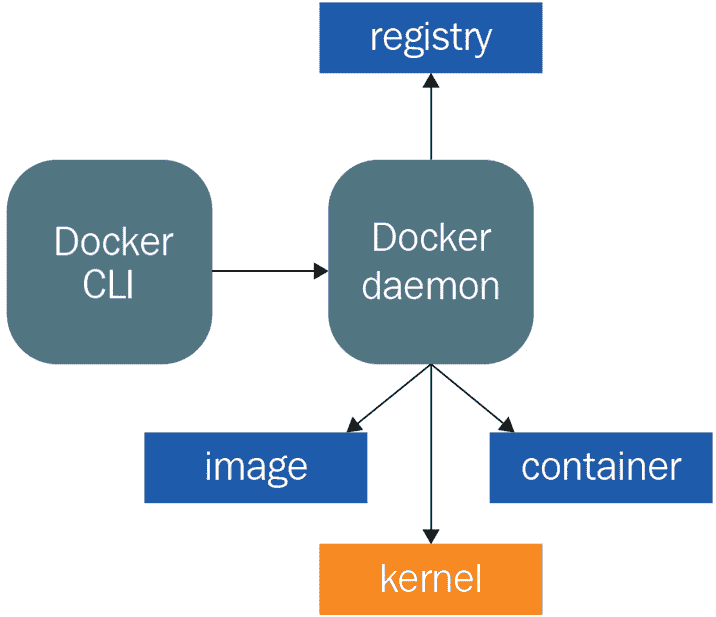

# *第二章*：比较 Podman 与 Docker

正如我们在前一章中所了解到的，容器技术并不像我们想象的那样新，因此其实现和架构多年来一直在不断发展，最终形成了如今的状态。

在本章中，我们将回顾 Docker 和 Podman 容器引擎的历史和主要架构，并通过并排对比，帮助具备一定 Docker 经验的读者轻松理解两者之间的主要区别，然后再深入探索 Podman。

如果你对 Docker 没有太多经验，你可以轻松跳到下一章，并在准备好了解 Podman 与 Docker 容器引擎之间的区别时再回来阅读本章。

在本章中，我们将涵盖以下主要主题：

+   Docker 容器守护进程架构

+   Podman 无守护进程架构

+   Docker 与 Podman 之间的主要区别

# 技术要求

本章不需要任何技术先决条件；你可以放心地阅读它，而无需担心在工作站上安装或设置任何软件！

如果你想复制本章中将描述的一些示例，你需要在工作站上安装和配置 Podman 和 Docker。如前所述，你可以轻松跳到下一章，并在准备好学习 Podman 和 Docker 容器引擎之间的区别时再回来阅读本章。

请注意，在下一章中，你将接触到 Podman 的安装和配置，因此你很快就能复制本章和接下来章节中所见的任何示例。

# Docker 容器守护进程架构

容器是一个简单且智能的解决方案，用于运行隔离的进程实例。我们可以安全地断言，容器是一种在多个层面上工作的应用隔离方式，比如文件系统、网络、资源使用、进程等等。

正如我们在*第一章*《容器技术介绍》中所看到的，在*容器与虚拟机*部分，容器与虚拟机的不同之处在于，容器与宿主共享相同的内核，而虚拟机则拥有自己的客操作系统内核。从安全角度来看，虚拟机提供了更好的攻击隔离，但虚拟机通常会比容器消耗更多的资源。要启动一个客操作系统，通常需要分配比启动容器更多的内存、CPU 和存储资源。

2013 年，Docker 容器引擎出现在容器领域，并迅速变得非常流行。

如我们之前所解释的，容器引擎是一种接受并处理用户请求以创建容器的软件工具；它可以看作是一种协调器。另一方面，容器运行时是容器引擎用来在主机上运行容器的底层软件，负责管理隔离、存储、网络等功能。

在早期阶段，Docker 容器引擎使用 LXC 作为容器运行时，但之后不久便用他们自己实现的 *libcontainer* 替代了它。

Docker 容器引擎由三个基本支柱组成：

+   Docker 守护进程

+   Docker REST API

+   Docker CLI

这三个支柱在以下架构中有所表示：


图 2.1 – Docker 架构

一旦 Docker 守护进程运行，如前图所示，你可以通过 Docker 客户端或远程 API 与其交互。Docker 守护进程负责许多本地容器活动，并与外部镜像仓库交互以拉取或推送容器镜像。

Docker 守护进程是架构中最关键的部分，它应该始终处于运行状态，否则你心爱的容器将无法生存太久！让我们在下一节中查看它的详细信息。

## Docker 守护进程

守护进程是一个在后台运行的进程；它监督系统或为其他进程提供功能。

Docker 守护进程是负责以下工作的后台进程：

+   监听 Docker API 请求

+   处理、管理并检查正在运行的容器

+   管理 Docker 镜像、网络和存储卷

+   与外部/远程容器镜像仓库交互

所有这些操作应该通过客户端或调用其 API 来指示守护进程，但让我们看看如何与之进行通信。

## 与 Docker 守护进程交互

可以通过进程的套接字联系到 Docker 守护进程，通常可以在主机文件系统中找到：`/var/run/docker.sock`。

根据你选择的 Linux 发行版，你可能需要为非 root 用户设置正确的权限，才能与 Docker 守护进程交互，或者仅需将非特权用户添加到 `docker` 组。

如你在以下命令中看到的，这些是为 Docker 守护进程在 Fedora 34 操作系统中设置的权限：

```
[root@fedora34 ~]# ls -la /var/run/docker.sock 
srw-rw----. 1 root docker 0 Aug 25 12:48 /var/run/docker.sock
```

默认情况下，Docker 守护进程没有其他类型的安全性或身份验证，因此请小心不要将守护进程公开暴露到不受信任的网络中。

## Docker REST API

一旦 Docker 守护进程启动并运行，你可以通过客户端或直接通过 REST API 与其通信。通过 Docker API，你可以执行通过命令行工具进行的各种操作，例如以下操作：

+   列出容器

+   创建容器

+   检查容器

+   获取容器日志

+   导出容器

+   启动或停止容器

+   强制停止容器

+   重命名容器

+   暂停容器

列表还在继续。通过查看这些 API 的其中一个，我们可以轻松发现它们的工作原理以及守护进程返回的示例输出是什么。

在以下命令中，我们将使用 Linux 命令行工具 `curl` 发出 HTTP 请求，以获取有关已存储在守护进程本地缓存中的任何容器镜像的详细信息：

```
[root@fedora34 ~]# curl --unix-socket /var/run/docker.sock \ http://localhost/v1.41/images/json | jq 
[
  {
    “Containers”: -1,
    “Created”: 1626187836,
    “Id”: “sha256:be72532cbd81ba4adcef7d8f742abe7632e6f5b35 bbd53251e5751a88813dd5f”,
    “Labels”: {
      “architecture”: “x86_64”,
      “build-date”: “2021-07-13T14:50:13.836919”,
      “com.redhat.build-host”: “cpt-1005.osbs.prod.upshift.rdu2.redhat.com”,
      “com.redhat.component”: “ubi7-minimal-container”,
      “com.redhat.license_terms”: “https://www.redhat.com/en/about/red-hat-end-user-license-agreements#UBI”,
      “description”: “The Universal Base Image Minimal is a stripped down image that uses microdnf as a package manager. This base image is freely redistributable, but Red Hat only supports Red Hat technologies through subscriptions for Red Hat products. This image is maintained by Red Hat and updated regularly.”,
      “distribution-scope”: “public”,
      “io.k8s.description”: “The Universal Base Image Minimal is a stripped down image that uses microdnf as a package manager. This base image is freely redistributable, but Red Hat only supports Red Hat technologies through subscriptions for Red Hat products. This image is maintained by Red Hat and updated regularly.”,
      “io.k8s.display-name”: “Red Hat Universal Base Image 7 Minimal”,
      “io.openshift.tags”: “minimal rhel7”,
      “maintainer”: “Red Hat, Inc.”,
      “name”: “ubi7-minimal”,
      “release”: “432”,
      “summary”: “Provides the latest release of the minimal Red Hat Universal Base Image 7.”,
      “url”: “https://access.redhat.com/containers/#/registry.access.redhat.com/ubi7-minimal/images/7.9-432”,
      “vcs-ref”: “8c60d5a9644707e7c4939980a221ec2927d9a88a”,
      “vcs-type”: “git”,
      “vendor”: “Red Hat, Inc.”,
      “version”: “7.9”
    },
    “ParentId”: “”,
    “RepoDigests”: [
      “registry.access.redhat.com/ubi7/ubi-minimal@sha256:73b4f78b569d178a48494496fe306dbefc3c0434c4b 872c7c9d7f23eb4feb909”
    ],
    “RepoTags”: [
      “registry.access.redhat.com/ubi7/ubi-minimal:latest”
    ],
    “SharedSize”: -1,
    “Size”: 81497870,
    “VirtualSize”: 81497870
  }
] 
```

如前面的命令所示，输出是 JSON 格式，非常详细，包含多个元数据，从容器镜像名称到其大小。在这个例子中，我们预先拉取了 **RHEL Universal Base Image** 版本 7 的最小版本，仅 80 MB！

当然，API 并不是为人类消费或交互而设计的；它们非常适合机器对机器的交互，因此它们通常用于软件集成。基于此，让我们探索一下命令行客户端的工作原理以及可用的选项。

## Docker 客户端命令

Docker 守护进程有自己的伴侣，它指示并配置守护进程——一个命令行客户端。

Docker 命令行客户端有超过 30 个命令及其相应选项，能够让任何系统管理员或 Docker 用户指示和控制守护进程及其容器。以下是最常用命令的概述：

+   `build`: 从 Dockerfile 构建镜像

+   `cp`: 在容器和本地文件系统之间复制文件/文件夹

+   `exec`: 在运行中的容器中执行命令

+   `images`: 列出镜像

+   `inspect`: 返回关于 Docker 对象的低级信息

+   `kill`: 终止一个或多个正在运行的容器

+   `load`: 从 TAR 存档或标准输入加载镜像

+   `login`: 登录到 Docker 注册表

+   `logs`: 获取容器日志

+   `ps`: 列出正在运行的容器

+   `pull`: 从注册表拉取镜像或仓库

+   `push`: 将镜像或仓库推送到注册表

+   `restart`: 重启一个或多个容器

+   `rm`: 删除一个或多个容器

+   `rmi`: 删除一个或多个镜像

+   `run`: 在新容器中运行命令

+   `save`: 将一个或多个镜像保存到 TAR 存档中（默认通过 stdout 流式传输）

+   `start`: 启动一个或多个已停止的容器

+   `stop`: 停止一个或多个正在运行的容器

+   `tag`: 创建一个指向 `SOURCE_IMAGE` 的 `TARGET_IMAGE` 标签

列表还在继续。正如你从这个子集中看到的，管理容器镜像和运行中的容器有很多可用命令，甚至可以导出容器镜像或构建一个新的。

一旦你使用这些命令及其相应选项启动 Docker 客户端，客户端将联系 Docker 守护进程，并指示需要执行的操作。因此，守护进程是架构中的关键元素，必须保持运行，确保这一点之后再尝试使用 Docker 客户端或其任何 REST API。

## Docker 镜像

Docker 镜像是一种由 Docker 引入的格式，用于管理二进制数据和元数据，作为容器创建的模板。Docker 镜像是用于运输和传输运行时、库以及运行某个特定进程所需的一切资源的封装。

正如我们在 *第一章*《容器技术简介》中提到的，在 *容器来自哪里？* 一节中，这种格式的创建确实是一个游戏规则的改变，与过去出现的其他容器技术显著不同。

从 1.12 版本开始，Docker 开始采用一种镜像规范，这种规范随着时间的推移，已经发展为符合**OCI 镜像格式规范**的当前版本。

第一个 Docker 镜像规范包含了许多现在已成为 OCI 镜像格式规范一部分的概念和字段，例如以下内容：

+   层的列表

+   创建日期

+   操作系统

+   CPU 架构

+   用于容器运行时的配置参数

Docker 镜像的内容（包括二进制文件、库、文件系统数据）是以层的形式组织的。每一层只是文件系统的更改集，不包含任何环境变量或特定命令的默认参数。这些数据存储在拥有配置参数的**镜像清单**中。

那么，这些层是如何在 Docker 镜像中创建并聚合的呢？答案并不简单。容器镜像中的层是通过使用镜像元数据组合在一起，并合并为单一的文件系统视图。这一结果可以通过多种方式实现，但正如前一章节所预测的那样，当前最常见的做法是使用联合文件系统——结合两个文件系统并提供一个独特的、*压缩*的视图。最后，当容器被执行时，会在镜像之上创建一个新的、*可读写*的临时层，该层在容器销毁后会丢失。

正如我们在本章早些时候所说，容器镜像及其分发是 Docker 容器的杀手级特性。因此，在下一节中，让我们来看看容器分发的关键元素——**Docker 注册表**。

## Docker 注册表

Docker 注册表只是一个 Docker 容器镜像的存储库，它保存容器镜像的元数据和层，以便将这些镜像提供给多个 Docker 守护进程使用。

Docker 守护进程通过 HTTP API 作为客户端与 Docker 注册表进行交互，根据 Docker 客户端的指令推送和拉取容器镜像。

使用容器注册表确实可以帮助在许多独立的机器上使用容器，这些机器可以被配置为在 Docker 守护进程的本地缓存中没有容器镜像时，向注册表请求容器镜像。Docker 守护进程设置中预配置的默认注册表是**Dockerhub**，这是一个由 Docker 公司在云端托管的**软件即服务**容器注册表。然而，Dockerhub 并不是唯一的注册表，近年来，许多其他容器注册表也相继出现。

几乎每个使用容器的公司或社区都创建了自己的容器注册表，并且它们有不同的 Web 界面。Dockerhub 的一个免费的替代服务是**Quay.io**，这是由 Red Hat 公司托管的一个软件即服务容器注册表。

一个很好的替代云服务的方案是本地 Docker 注册表，它可以通过在运行 Docker 守护进程的机器上通过一个命令创建容器来实现：

```
$ docker run -d -p 5000:5000 --restart=always --name registry registry:2
```

本书的目标不是详细讲解各种 Docker 选项和配置，但如果您想了解更多关于 Docker 注册表的信息，可以参考 Docker 官方文档：[`docs.docker.com/registry/deploying/`](https://docs.docker.com/registry/deploying/)。

到目前为止，我们已经查看了很多内容，包括 Docker API、客户端、守护进程、镜像以及最终的注册表，但正如我们之前提到的，这一切都依赖于 Docker 守护进程的正确使用，守护进程应该始终健康并且正常运行。那么，现在让我们探索一下当它停止工作时会发生什么。

## 运行中的 Docker 架构是什么样的？

Docker 守护进程是整个 Docker 架构的核心关键元素。在这一部分，我们将探讨 Docker 守护进程和一堆运行中的容器的样子。

我们不会深入讨论安装和设置 Docker 守护进程所需的步骤；相反，我们将直接分析一个预配置的操作系统：

```
[root@fedora34 ~]# systemctl status docker
● docker.service - Docker Application Container Engine
     Loaded: loaded (/usr/lib/systemd/system/docker.service; disabled; vendor preset: disabled)
     Active: active (running) since Tue 2021-08-31 19:46:57 UTC; 1h 39min ago
TriggeredBy: ● docker.socket
       Docs: https://docs.docker.com
   Main PID: 20258 (dockerd)
      Tasks: 12
     Memory: 31.1M
        CPU: 1.946s
     CGroup: /system.slice/docker.service
             └─20258 /usr/bin/dockerd -H fd:// --containerd=/run/containerd/containerd.sock
```

如您从前面的命令中看到的，我们刚刚验证了 Docker 守护进程正在运行，但它不是系统上唯一运行的容器服务。Docker 守护进程有一个我们在前面部分跳过的伙伴，为了保持描述的简洁性：**Containerd**。

为了更好地理解工作流程，请查看下面的图表：


](img/B17908_02_02.jpg)

图 2.2 – 运行 Docker 容器

Containerd 是一个将容器管理（包括与内核的交互）从 Docker 守护进程中解耦的项目，它还遵循 OCI 标准，并使用`runc`作为容器运行时。

那么，让我们检查一下在我们预配置的操作系统中 Containerd 的状态：

```
[root@fedora34 ~]# systemctl status containerd
● containerd.service - containerd container runtime
     Loaded: loaded (/usr/lib/systemd/system/containerd.service; disabled; vendor preset: disabled)
     Active: active (running) since Wed 2021-08-25 12:48:17 UTC; 6 days ago
       Docs: https://containerd.io
    Process: 4267 ExecStartPre=/sbin/modprobe overlay (code=exited, status=0/SUCCESS)
   Main PID: 4268 (containerd)
      Tasks: 43
     Memory: 44.1M
        CPU: 8min 36.291s
     CGroup: /system.slice/containerd.service
             ├─ 4268 /usr/bin/containerd
             ├─20711 /usr/bin/containerd-shim-runc-v2 -namespace moby -id 3901d2600732ae1f2681cde0074f290c1839b1a4b0c63ac 9aaccdba4f646e06a -address /run/containerd/containe>
             ├─20864 /usr/bin/containerd-shim-runc-v2 -namespace moby -id 78dc2eeb321433fc67cf910743c0c53e54d9f45cfee8d183 19d03a622dc56666 -address /run/containerd/containe>
             └─21015 /usr/bin/containerd-shim-runc-v2 -namespace moby -id 7433c0613412349833b927efa79a4f589916b12c942003cd 616d45ed7611fc31 -address /run/containerd/containe>
```

如您从前面的控制台输出中看到的，服务正在运行并已启动三个子进程：`/usr/bin/containerd-shim-runc-v2`。这与我们刚刚在*图 2.2*中看到的完全匹配！

现在，让我们检查一下与 Docker CLI 交互的运行中的容器：

```
[root@fedora34 ~]# docker ps
CONTAINER ID   IMAGE                            COMMAND                  CREATED          STATUS          PORTS                NAMES
7433c0613412   centos/httpd-24-centos7:latest   “container-entrypoin…”   26 minutes ago   Up 26 minutes   8080/tcp, 8443/tcp   funny_goodall
78dc2eeb3214   centos/httpd-24-centos7:latest   “container-entrypoin…”   26 minutes ago   Up 26 minutes   8080/tcp, 8443/tcp   wonderful_rubin
3901d2600732   centos/httpd-24-centos7:latest   “container-entrypoin…”   26 minutes ago   Up 26 minutes   8080/tcp, 8443/tcp   relaxed_heisenberg
```

如您所见，Docker 客户端确认我们的系统上有三个正在运行的容器，所有容器都是通过 `runc` 容器运行时启动的，由 Containerd 系统服务管理，并通过 Docker 守护进程配置。

现在我们已经介绍了这个新元素 Containerd，让我们在下一节深入了解它。

## Containerd 架构

Containerd 架构由多个组件组成，这些组件被组织在子系统中。连接不同子系统的组件也被称为容器架构中的模块，如下图所示：


图 2.3 – Containerd 架构

可用的两个主要子系统如下：

+   从磁盘镜像中提取包的包服务

+   执行包的运行时服务，创建运行时容器

使架构完全功能化的主要模块如下：

+   `Executor` 模块，执行前面架构中作为**运行时**块表示的容器运行时

+   `Supervisor` 模块，监控并报告容器状态，属于前面架构中的**容器**块

+   `Snapshot` 模块，管理文件系统快照

+   `Events` 模块，收集和消耗事件

+   `Metrics` 模块，通过度量 API 导出多个指标

Containerd 将容器置于运行状态所需的步骤太复杂，无法在本节中详细描述，但我们可以将其总结如下：

1.  通过**分发控制器**拉取元数据和内容。

1.  使用**Bundle 控制器**解包获取的数据，创建将组成包的快照。

1.  通过**运行时控制器**执行刚刚创建的容器：


图 2.4 – Containerd 数据流图

在本节中，我们已经描述了 Docker 容器引擎的关键特性和设计原则，以及它以守护进程为中心的方式。现在我们可以继续分析 Podman 无守护进程架构。

# Podman 无守护进程架构

Podman（*POD MANager*的缩写）是一个无守护进程的容器引擎，允许用户管理容器、镜像及其相关资源，如存储卷或网络资源。首次安装 Podman 的用户很快就会意识到，安装完成后没有需要启动的服务。运行容器时，Podman 不需要后台运行的守护进程！

安装后，Podman 二进制文件既充当**命令行接口**（**CLI**），又充当一个容器引擎，协调容器运行时的执行。接下来的子节将详细介绍 Podman 的行为和构建块。

## Podman 命令和 REST API

Podman CLI 提供了一个不断扩展的命令集。整理好的命令列表可在[`docs.podman.io/en/latest/Commands.html`](https://docs.podman.io/en/latest/Commands.html)找到。

以下列表探讨了最常用命令的一个子集：

+   `build`: 从 Containerfile 或 Dockerfile 构建镜像

+   `cp`: 在容器和本地文件系统之间复制文件/文件夹

+   `exec`: 在正在运行的容器中运行命令

+   `events`: 显示 Podman 事件

+   `generate`: 生成结构化数据，如 Kubernetes YAML 或 systemd 单元

+   `images`: 列出本地缓存的镜像

+   `inspect`: 返回容器或镜像的低级信息

+   `kill`: 终止一个或多个正在运行的容器

+   `load`: 从容器 TAR 存档或标准输入加载镜像

+   `login`: 登录到容器镜像仓库

+   `logs`: 获取容器日志

+   `pod`: 管理 Pod

+   `ps`: 列出正在运行的容器

+   `pull`: 从镜像仓库拉取镜像或仓库

+   `push`: 将镜像或仓库推送到镜像仓库

+   `restart`: 重启一个或多个容器

+   `rm`: 删除一个或多个容器

+   `rmi`: 删除一个或多个镜像

+   `run`: 在新的容器中运行命令

+   `save`: 将一个或多个镜像保存到 TAR 存档（默认通过标准输出流）

+   `start`: 启动一个或多个已停止的容器

+   `stop`: 停止一个或多个正在运行的容器

+   `system`: 管理 Podman（磁盘使用、容器迁移、REST API 服务、存储管理和清理）

+   `tag`: 创建一个 `TARGET_IMAGE` 标签，指向 `SOURCE_IMAGE`

+   `unshare`: 在修改后的用户命名空间中运行命令

+   `volume`: 管理容器卷（列出、清理、创建、检查）

在本书的后续章节中，我们将更详细地介绍前述命令，并了解如何使用它们来管理整个容器生命周期。

已经使用 Docker 的用户会立即识别出与 Docker CLI 相同的命令。Podman CLI 命令与 Docker 命令兼容，有助于平滑过渡到这两个工具之间。

与 Docker 不同，Podman 不需要一个运行中的 Docker 守护进程来监听 Unix 套接字执行前述命令。用户仍然可以选择运行 Podman 服务，并使其监听 Unix 套接字以暴露本地 REST API。

通过运行以下命令，Podman 将在首选路径上创建一个套接字端点，并监听 API 调用：

```
$ podman system service -–time 0 unix://tmp/podman.sock
```

如果未提供，默认的套接字端点为 `unix://run/podman/podman.sock`（rootful 服务）和 `unix://run/user/<UID>/podman/podman.sock`（rootless 容器）。

结果，用户可以对套接字端点发出 REST API 调用。以下示例查询 Podman 以获取可用的本地镜像：

```
curl --unix-socket /tmp/podman.sock \ http://d/v3.0.0/libpod/images/json | jq .
```

Podman 项目在[`docs.podman.io/en/latest/_static/api.html`](https://docs.podman.io/en/latest/_static/api.html)提供符合 OpenAPI 的可用 REST API 调用文档。

前面示例中的管道`jq`命令有助于生成更易读的 JSON 格式输出。我们将在安装后定制部分的*第三章*，*运行第一个容器*中，详细探讨 Podman REST API 和基于 systemd socket 的激活。接下来，我们将更详细地描述 Podman 的构建模块。

## Podman 构建模块

Podman 旨在尽可能遵循开放标准；因此，大多数运行时、构建、存储和网络组件都依赖于社区项目和标准。以下列出的组件可以看作是 Podman 的主要构建模块：

+   容器生命周期通过**libpod**库进行管理，该库已包含在 Podman 的主仓库中：[`github.com/containers/podman/tree/main/libpod`](https://github.com/containers/podman/tree/main/libpod)。

)

+   容器运行时基于 OCI 规范，OCI 兼容的运行时（如**crun**和**runc**）实现了这些规范。在本章中，我们将看到容器运行时的工作原理以及上述运行时之间的主要区别。

+   同时，镜像管理通过**containers/image**库实现（[`github.com/containers/image`](https://github.com/containers/image)）。这是一个 Go 语言库，既被容器引擎使用，也被容器注册中心使用。

+   容器和镜像存储通过**containers/storage**库（[`github.com/containers/storage`](https://github.com/containers/storage)）实现，这是另一个 Go 语言库，用于在运行时管理文件系统层、容器镜像和容器卷。

+   镜像构建通过 Buildah（[`github.com/containers/buildah`](https://github.com/containers/buildah)）实现，Buildah 既是一个二进制工具，也是一个用于构建 OCI 镜像的库。我们将在本书稍后的章节介绍 Buildah。

+   容器运行时监控和与引擎的通信通过**Conmon**工具实现，Conmon 是一个用于监控 OCI 运行时的工具，被 Podman 和**CRI-O**（[`github.com/containers/conmon`](https://github.com/containers/conmon)）共同使用。

容器网络支持通过 Kubernetes `bridge` CNI 插件实现。更多插件列表可在以下仓库中找到：https://github.com/containernetworking/plugins。

如前所述，Podman 通过 libpod 库来协调容器生命周期，具体内容将在下一小节中描述。

## libpod 库

Podman 的核心基础依赖于 libpod 库，其他开源项目如 CRI-O 也采用了该库。这个库包含了所有协调容器生命周期所需的逻辑，可以说这个库的开发是 Podman 项目诞生的关键。

该库是用 Go 编写的，因此作为**Go 包**访问，旨在实现引擎的所有高级功能。根据 libpod 和 Podman 文档，其范围包括以下内容：

+   管理容器镜像格式，包括 OCI 和 Docker 镜像。这包括完整的镜像生命周期管理，从认证和从容器注册表拉取，存储镜像层和元数据的本地存储，到构建新镜像并推送到远程注册表。

+   容器生命周期管理——从容器创建（包括所有必要的初步步骤）到运行容器，再到所有其他运行时功能，如停止、杀死、恢复、删除、在运行容器上执行进程以及日志记录。

+   管理简单的容器和**Pod**，Pod 是共享命名空间的沙箱容器组（特别是 UTC、IPC、网络，最近还包括 PID），这些容器和 Pod 作为整体一起管理。

+   支持**无根**容器和 Pod，这些容器和 Pod 可以由标准用户执行，无需特权提升。

+   管理容器资源隔离。这在低层次上通过 CGroup 实现，但 Podman 用户可以在容器执行过程中使用 CLI 选项来管理内存和 CPU 的预留或限制存储设备的读写速率。

+   支持一个可以用作 Docker 兼容替代品的 CLI。大多数 Podman 命令与 Docker CLI 中的命令相同。

+   提供与 Docker 兼容的 REST API，通过本地 Unix 套接字（默认未启用）。Libpod REST API 提供 Podman CLI 所提供的所有功能。

lidpod 包在较低层次上与容器运行时、Conmon 以及如 container/storage、container/image、Buildah 和 CNI 等包进行交互。在下一节中，我们将重点关注容器运行时执行。

## runc 和 crun OCI 容器运行时。

正如前一章节所示，容器引擎负责容器生命周期的高级编排，而创建和运行容器所需的低级操作由容器运行时提供。

在过去几年中，随着主要容器环境贡献者的帮助，**OCI 运行时规范**已成为行业标准。完整规范可以在[`github.com/opencontainers/runtime-spec`](https://github.com/opencontainers/runtime-spec)上查看。

从这个代码库中，*运行时和生命周期*文档提供了容器运行时如何处理容器创建和执行的完整描述：[`github.com/opencontainers/runtime-spec/blob/master/runtime.md`](https://github.com/opencontainers/runtime-spec/blob/master/runtime.md)。

**Runc** ([`github.com/opencontainers/runc`](https://github.com/opencontainers/runc)) 是当前最广泛采用的 OCI 容器运行时。它的历史可以追溯到 2015 年，当时 Docker 宣布将所有基础设施模块拆分到一个名为 runC 的专用项目中。

RunC 完全支持 Linux 容器和 OCI 运行时规范。该项目仓库包含 **libcontainer** 包，这是一个用于创建带有命名空间、cgroups、能力和文件系统访问控制的容器的 Go 包。Libcontainer 曾是一个独立的 Docker 项目，当 runC 项目创建时，它被移到其主仓库中，以确保一致性和清晰性。

libcontainer 包定义了容器从零开始引导的内部逻辑和低级系统交互，从命名空间的初步隔离到容器内部二进制程序作为 PID 1 执行。

运行时回调 libcontainer 库以完成以下任务：

+   消耗 Podman 提供的容器挂载点和容器元数据。

+   与内核交互，使用 `clone()` 和 `unshare()` 系统调用启动容器并执行隔离进程。

+   设置 CGroup 资源预留。

+   设置 SELinux 策略、Seccomp 和 AppArmor 规则。

除了运行进程，libcontainer 还处理命名空间和文件描述符的初始化，容器 rootFS 和绑定挂载的创建，导出容器进程的日志，通过 seccomp、SELinux 和 AppArmor 管理安全限制，以及创建和映射用户和组。

libcontainer 架构是本书中一个相当复杂的话题，显然需要进一步的研究以更好地理解其内部实现。

对于那些有兴趣查看代码并了解 Podman 内部实现的读者，符合 OCI 运行时规范的容器接口定义在 [`github.com/opencontainers/runc/blob/master/libcontainer/container.go`](https://github.com/opencontainers/runc/blob/master/libcontainer/container.go) 源文件中。

实现该接口的 Linux 操作系统方法定义在 [`github.com/opencontainers/runc/blob/master/libcontainer/container_linux.go`](https://github.com/opencontainers/runc/blob/master/libcontainer/container_linux.go) 中。

使用 `clone()` 和 `unshare()` 系统调用隔离进程命名空间的低级执行由 `nsexec()` 函数处理。这是一个嵌入在 Go 代码中的 C 函数，通过 **cgo** 实现。

`nsexec()` 的代码可以在这里找到：

[`github.com/opencontainers/runc/blob/master/libcontainer/nsenter/nsexec.c`](https://github.com/opencontainers/runc/blob/master/libcontainer/nsenter/nsexec.c)

)

与`runC`一起，许多其他容器运行时也已经被创建。在本书中我们将讨论的一个替代运行时是`crun`，它旨在提供一个改进的 OCI 运行时，可以利用 C 语言设计方法，打造一个更清晰、更轻量的运行时。由于它们都是 OCI 运行时，`runC`和`crun`可以在容器引擎中互换使用。

例如，2019 年，Fedora 项目做出了一个大胆的决定，选择将 CGroup V2 作为默认选项发布 Fedora 31（[`www.redhat.com/sysadmin/fedora-31-control-group-v2`](https://www.redhat.com/sysadmin/fedora-31-control-group-v2)）。在做出这个选择时，`runC`尚不支持在 CGroup V2 下管理容器\。

因此，Fedora 的 Podman 版本采用了`crun`作为默认运行时，因为它已经能够管理 CGroup V1 和 V2\. 对最终用户来说，这一切几乎是无缝的，他们依旧使用 Podman，并保持相同的命令和行为。后来，`runC`终于从 v1.0.0-rc93 版本开始支持 CGroup V2，现在可以在较新的发行版上无缝使用。

然而，CGroup 主题并不是`runC`和`crun`之间唯一的区分点。

`crun`相比`runC`提供了一些有趣的优势，具体如下：

+   `crun`的构建文件大约比`runC`的构建文件小 50 倍。

+   在相同的执行条件下，`crun`在容器执行时比`runC`更快。

+   `crun`消耗的内存不到`runC`的一半。较小的内存占用在处理大规模容器部署或物联网设备时非常有帮助。

`crun`还可以作为一个库使用，并集成到其他符合 OCI 标准的项目中。`crun`和`runC`都提供了 CLI，但并不打算由最终用户手动使用，最终用户应该使用容器引擎，如 Podman 或 Docker 来管理容器生命周期。

在 Podman 中切换这两种运行时有多容易？让我们看看以下示例。两个示例都使用`–runtime`标志来提供 OCI 运行时二进制路径。第一个示例使用`runC`运行容器：

```
podman --runtime /usr/bin/runc run --rm fedora echo “Hello World”
```

第二行使用`crun`二进制文件运行相同的容器：

```
podman --runtime /usr/bin/crun run --rm fedora echo “Hello World”
```

这些示例假设两个运行时已经在系统中安装。

`crun`和`runC`都支持**eBPF**和**CRIU**。

**eBPF**代表**扩展伯克利数据包过滤器**，是一种基于内核的技术，允许在 Linux 内核中执行用户定义的程序，向系统添加额外的功能，而无需重新编译内核或加载额外的模块。所有 eBPF 程序都在一个沙箱虚拟机内执行，其执行过程天生是安全的。今天，eBPF 正获得越来越多的关注，并吸引了行业的兴趣，尤其在网络、安全、可观察性和追踪等领域得到了广泛应用。

**用户空间中的检查点恢复**（**CRIU**）是一款软件，它使用户能够冻结正在运行的容器并将其状态保存到磁盘以供后续恢复。内存中的数据结构会被转储并相应地恢复。

Podman 使用的另一个重要架构组件是 Conmon，一个用于监控容器运行时状态的工具。让我们在下一小节中更详细地探讨这个问题。

## Conmon

我们可能仍然有一些关于运行时执行的问题。

Podman（容器引擎）和`runC`/`crun`（OCI 容器运行时）是如何互相交互的？哪一个负责启动容器运行时进程？有没有方法可以监控容器的执行？

让我们介绍一下 Conmon 项目（[`github.com/containers/conmon`](https://github.com/containers/conmon)）。Conmon 是一个监控和通信工具，位于容器引擎和运行时之间。

每次创建新容器时，都会启动一个新的 Conmon 实例。它会从容器管理进程中分离出来，并以守护进程方式运行，启动容器运行时作为子进程。

如果我们附加一个追踪工具到 Podman 容器，我们可以看到它以以下顺序写入：

1.  容器引擎运行 Conmon 进程，Conmon 进程会分离并以守护进程方式运行。

1.  Conmon 进程运行一个容器运行时实例，启动容器并退出。

1.  Conmon 进程继续运行，以提供监控接口，而管理器/引擎进程则已退出或分离。

下图展示了从 Podman 执行到运行容器的逻辑工作流：


图 2.5 – 运行 Podman 容器

在运行多个容器的系统上，用户会发现有许多 Conmon 进程实例，每个容器都有一个。换句话说，Conmon 充当容器的一个小型专用守护进程。

让我们看一个简单的示例，其中使用简单的 shell 循环创建三个相同的 nginx 容器：

```
[root@fedora34 ~]# for i in {1..3}; do podman run -d --rm docker.io/library/nginx; done
592f705cc31b1e47df18f71ddf922ea7e6c9e49217f00d1af8 cf18c8e5557bde
4b1e44f512c86be71ad6153ef1cdcadcdfa8bcfa8574f606a0832 c647739a0a2
4ef467b7d175016d3fa024d8b03ba44b761b9a75ed66b2050de3fe c28232a8a7
[root@fedora34 ~]# ps aux | grep conmon
root       21974  0.0  0.1  82660  2532 ?        Ssl  22:31   0:00 /usr/bin/conmon --api-version 1 -c 592f705cc31b1e47df18f71ddf922ea7e6c9e49217f00d1af8 cf18c8e5557bde -u 592f705cc31b1e47df18f71ddf922ea7e6c9e49217f00d1af8 cf18c8e5557bde -r /usr/bin/crun [..omitted output]
root       22089  0.0  0.1  82660  2548 ?        Ssl  22:31   0:00 /usr/bin/conmon --api-version 1 -c 4b1e44f512c86be71ad6153ef1cdcadcdfa8bcfa8574f606a0832 c647739a0a2 -u 4b1e44f512c86be71ad6153ef1cdcadcdfa8bcfa8574f606a0832 c647739a0a2 -r /usr/bin/crun [..omitted output] 
root       22198  0.0  0.1  82660  2572 ?        Ssl  22:31   0:00 /usr/bin/conmon --api-version 1 -c 4ef467b7d175016d3fa024d8b03ba44b761b9a75ed66b2050de3f ec28232a8a7 -u 4ef467b7d175016d3fa024d8b03ba44b761b9a75ed66b2050de3f ec28232a8a7 -r /usr/bin/crun [..omitted output]
```

在运行容器后，对`ps aux`命令输出应用一个简单的正则表达式模式，可以看到三个 Conmon 进程实例。

即使 Podman 不再运行（因为没有守护进程），仍然可以连接到 Conmon 进程并附加到容器。同时，Conmon 会将控制台套接字和容器日志暴露到日志文件或 systemd 日志中。

Conmon 是一个用 C 语言编写的轻量级项目。它还提供了 Go 语言绑定，用于在管理器和运行时之间传递配置结构。

## 无根容器

Podman 最有趣的特点之一是能够运行无根容器，这意味着没有提升权限的用户也可以运行自己的容器。

无根容器提供更好的安全隔离，并允许不同用户独立运行自己的容器实例。得益于**fork/exec**，Podman 采用无守护进程的方法，使得无根容器的管理变得非常简单。无根容器只需通过标准用户使用常规命令和参数运行，如以下示例所示：

```
$ podman run –d –-rm docker.io/library/nginx
```

当发出此命令时，Podman 创建一个新的用户命名空间，并使用`man user_namespaces`在两个命名空间之间映射 UID。此方法允许您例如在容器内拥有一个 root 用户，并将其映射为主机中的普通用户。

无根容器和镜像数据存储在用户的主目录下，通常在`$HOME/.local/share/containers/storage`下。

Podman 以不同于有根容器的方式管理无根容器的网络连接。关于无根容器和有根容器的深入技术比较，特别是从网络和安全的角度来看，将在本书后续章节中介绍。

在对运行时工作流进行深入分析之后，提供一个关于 Podman 使用的 OCI 镜像规格的概述是非常有用的。

## OCI 镜像

Podman 和容器/镜像包实现了**OCI 镜像格式规范**。完整的规范可在 GitHub 上通过以下链接查看，并与 OCI 运行时规范配套使用：[`github.com/opencontainers/image-spec`](https://github.com/opencontainers/image-spec)。

一个 OCI 镜像由以下元素组成：

1.  清单

1.  一个镜像索引（可选）

1.  镜像布局

1.  一个文件系统层变更集归档，将被解压以创建最终的文件系统

1.  一个镜像配置文档，用于定义层次顺序，以及应用程序参数和环境

让我们详细了解前面提到的最相关的元素管理的信息和数据种类。

### 清单

镜像清单规格应提供内容可寻址的镜像。镜像清单包含特定架构和操作系统（例如 Linux x86_64）的镜像层和配置。

规范：[`github.com/opencontainers/image-spec/blob/main/manifest.md`](https://github.com/opencontainers/image-spec/blob/main/manifest.md)

### 镜像索引

镜像索引是一个包含与不同架构（例如 amd64、arm64 或 386）和操作系统相关的镜像清单列表的对象，并附带自定义注释。

规范：[`github.com/opencontainers/image-spec/blob/main/image-index.md`](https://github.com/opencontainers/image-spec/blob/main/image-index.md)

### 镜像布局

OCI 镜像布局表示镜像块的目录结构。镜像布局还提供必要的清单位置引用，以及镜像索引（JSON 格式）和镜像配置。镜像的`index.json`包含指向镜像清单的引用，该清单作为块存储在 OCI 镜像包中。

规范： [`github.com/opencontainers/image-spec/blob/main/image-layout.md`](https://github.com/opencontainers/image-spec/blob/main/image-layout.md)

### 文件系统层

在镜像内部，一个或多个层叠加在一起，创建一个容器可以使用的文件系统。

在低层次上，层被打包为 TAR 档案（具有 gzip 和 zstd 的压缩选项）。文件系统层实现了层叠的逻辑以及如何应用更改集层（包含文件更改的层）。

如前一章所述，写时复制（copy-on-write）或联合文件系统已成为管理图形方式叠加的标准。为了管理层叠，Podman 默认使用**overlayfs**作为图形驱动程序。

规范： [`github.com/opencontainers/image-spec/blob/main/layer.md`](https://github.com/opencontainers/image-spec/blob/main/layer.md)

### 镜像配置

镜像配置定义了镜像层的组成及相应的执行参数，例如入口点、卷、执行参数或环境变量，以及附加的镜像元数据。

持有配置的镜像 JSON 是一个**不可变**的对象；更改它意味着创建一个新的衍生镜像。

规范： [`github.com/opencontainers/image-spec/blob/main/config.md`](https://github.com/opencontainers/image-spec/blob/main/config.md)

以下图示表示了 OCI 镜像的实现，包含镜像层、镜像索引和镜像配置：


图 2.6 – OCI 镜像实现

让我们检查一个来自基础、轻量级**alpine**镜像的实际示例：

```
# tree alpine/
alpine/
├── blobs
│   └── sha256
│       ├── 03014f0323753134bf6399ffbe26dcd75e89c6a7429adfab 392d64706649f07b
│       ├── 696d33ca1510966c426bdcc0daf05f75990d68c4eb820f615 edccf7b971935e7
│       └── a0d0a0d46f8b52473982a3c466318f479767577551a53ffc9074 c9fa7035982e
├── index.json
└── oci-layout
```

目录布局包含一个`index.json`文件，内容如下：

```
{
  “schemaVersion”: 2,
  “manifests”: [
    {
      “mediaType”: “application/vnd.oci.image.manifest.v1+json”,
      “digest”: “sha256:03014f0323753134bf6399ffbe26dcd75e89c6a7429adfab 392d64706649f07b”,
      “size”: 348,
      “annotations”: {
        “org.opencontainers.image.ref.name”: “latest”
      }
    }
  ]
}
```

索引包含一个只包含一项的清单数组。对象摘要是 SHA256，并且与前面列出的 blob 之一的文件名对应。该文件是镜像清单，可以进行检查：

```
# cat alpine/blobs/sha256/03014f0323753134bf6399ffbe26dcd75e89c6a7429adfab392 d64706649f07b | jq
{
  “schemaVersion”: 2,
  “config”: {
    “mediaType”: “application/vnd.oci.image.config.v1+json”,
    “digest”: “sha256:696d33ca1510966c426bdcc0daf05f75990d 68c4eb820f615edccf7b971935e7”,
    “size”: 585
  },
  “layers”: [
    {
      “mediaType”: “application/vnd.oci.image.layer.v1.tar+gzip”,
      “digest”: “sha256:a0d0a0d46f8b52473982a3c466318f47976 7577551a53ffc9074c9fa7035982e”,
      “size”: 2814446
    }
  ]
}
```

清单包含对镜像配置和镜像层的引用。在这个特定的案例中，镜像只有一个层。同样，它们的摘要与前面列出的 blob 文件名相对应。

配置文件显示了镜像元数据、环境变量和命令执行。同时，它包含对镜像使用的层和镜像创建信息的`DiffID`引用：

```
# cat alpine/blobs/sha256/696d33ca1510966c426bdcc0daf05f75990 d68c4eb820f615edccf7b971935e7 | jq
{
  “created”: “2021-08-27T17:19:45.758611523Z”,
  “architecture”: “amd64”,
  “os”: “linux”,
  “config”: {
    “Env”: [
      “PATH=/usr/local/sbin:/usr/local/bin:/usr/sbin:/usr/bin:/sbin:/bin”
    ],
    “Cmd”: [
      “/bin/sh”
    ]
  },
  “rootfs”: {
    “type”: “layers”,
    “diff_ids”: [
      “sha256:e2eb06d8af8218cfec8210147357a68b7e13f7c485b991c 288c2d01dc228bb68”
    ]
  },
  “history”: [
    {
      “created”: “2021-08-27T17:19:45.553092363Z”,
      “created_by”: “/bin/sh -c #(nop) ADD file:aad4290d27580 cc1a094ffaf98c3ca2fc5d699fe695dfb8e6e9fac 20f1129450 in / “
    },
    {
      “created”: “2021-08-27T17:19:45.758611523Z”,
      “created_by”: “/bin/sh -c #(nop)  CMD [\”/bin/sh\”]”,
      “empty_layer”: true
    }
  ]
}
```

镜像层是第三个 blob 文件。这是一个 TAR 档案，可以展开并进行检查。出于空间原因，本书中的示例仅限于检查文件类型：

```
# file alpine/blobs/sha256/a0d0a0d46f8b52473982a3c466318f47 9767577551a53ffc9074c9fa7035982e
alpine/blobs/sha256/a0d0a0d46f8b52473982a3c466318f479767577 551a53ffc9074c9fa7035982e: gzip compressed data, original size modulo 2³² 5865472
```

结果表明该文件是一个 TAR gz 压缩档案。

# Docker 和 Podman 之间的主要区别

在前面的章节中，我们已经讨论了 Docker 和 Podman 的关键特性，深入探讨了底层结构，发现了使这两种工具在容器引擎角色中独特的开源项目，但现在是时候进行对比了。

正如我们之前看到的，两者之间的显著区别在于，Docker 采用的是以守护进程为中心的方法，而 Podman 则采用无守护进程架构。Podman 的二进制文件既是 CLI 也是容器引擎，并使用 Conmon 来协调和监控容器运行时。

深入了解两个项目的内部机制，我们还会发现许多其他的差异，但最终，一旦容器启动，它们都利用了 OCI 标准的容器运行时，只是存在一些差异：Docker 使用 `runc`，而 Podman 在大多数发行版中使用 `crun`，但也有一些例外；例如，在最为保守的 Red Hat Enterprise Linux 8 中，它仍然使用 `runc`，并且将 `crun` 作为可选项。

尽管在前一部分中描述了 `crun` 在性能上的优势，但本书的目标并不是对这两者进行详细的性能比较。无论如何，读者如果对这个话题感兴趣，将很容易找到有关这两个运行时性能差异的文献。

最近由 Docker 团队填补的另一个大空白是无根容器（rootless container）。Podman 是第一个推出这一出色功能的容器引擎，它增强了安全性并改善了容器在多个环境中的使用，但正如我们所提到的，这个功能现在也已经在 Docker 中可用。

但是在接下来的部分中，我们将更实际地进行比较，首先通过命令行并排比较，然后运行一个容器。

## 命令行接口比较

在这一部分，我们将进行一个并排比较，看看 Docker 和 Podman 的命令行接口。

查看两个命令行接口（CLI）提供的命令，很容易就能发现它们之间的许多相似之处。为了提高可读性，下面的表格被截断了：


表 2.1 – Docker 和 Podman 命令比较

正如我们在前面的部分以及上一章中多次提到的，Docker 于 2013 年诞生，而 Podman 则是在 2017 年才出现。Podman 的开发是在考虑到当时最著名的容器引擎 Docker 的基础上进行的。出于这个原因，Podman 开发团队决定尽量不改变命令行工具的*外观和感觉*，以帮助 Docker 用户顺利迁移到新生的 Podman。

事实上，在 Podman 发布初期曾有人声称，如果你有任何现有的运行 Docker 的脚本，你可以创建一个别名，它应该能正常工作（`alias docker=podman`）。同时还创建了一个包，在 `/usr/bin` 下放置一个*伪* Docker 命令，它指向的是 Podman 的二进制文件。因此，如果你是 Docker 用户，一旦准备好转向 Podman，你可以期待一个平稳的过渡。

另一个重要的点是，通过 Docker 创建的镜像与 OCI 标准兼容，因此你可以轻松迁移或重新拉取你之前使用过的任何 Docker 镜像。

如果我们深入查看 Podman 可用的命令选项，你会注意到一些额外的命令在 Docker 中并不存在，而其他一些命令则缺失。

例如，Podman 可以管理 **Pod**（Podman 这个名字在这里非常具有提示性）。Pod 概念最初是在 Kubernetes 中引入的，表示 Kubernetes 集群中最小的执行单元。

使用 Podman，用户可以轻松创建空的 Pod，然后使用以下命令在其中运行容器：

```
$ podman pod create --name mypod
$ podman run –-pod mypod –d docker.io/library/nginx
```

在 Docker 中，这并不像 Podman 那样容易，在 Docker 中，用户必须首先运行一个容器，然后创建新的容器并连接到第一个容器的网络命名空间。

Podman 还具有一些额外功能，可以帮助用户将容器迁移到 Kubernetes 环境中。通过命令 `podman generate kube`，Podman 可以为正在运行的容器创建一个 Kubernetes YAML 文件，该文件可用于在 Kubernetes 集群中创建一个 Pod。

使用 `podman generate systemd` 命令将容器作为 systemd 服务运行同样简单，该命令会获取一个正在运行的容器或 Pod，并生成一个 systemd 单元文件，用于在系统启动时自动运行服务。

一个显著的例子：**OpenStack** 项目，一个开源云计算基础设施，在与 TripleO 部署时，将 Podman 作为其容器化服务的默认管理器。所有服务都由 Podman 执行，并由 systemd 在控制平面和计算节点中进行编排。

在检查了这些容器引擎的表面并查看了它们的命令行之后，让我们在下一节回顾一下它们在幕后的差异。

## 运行容器

如前所述，在 Docker 环境中运行容器，包含使用 Docker 命令行客户端与 Docker 守护进程进行通信，守护进程将执行所需的操作以启动容器。为了总结本章解释的概念，我们可以查看以下图示：



图 2.7 – Docker 简化架构

相比之下，Podman 直接与镜像注册表、存储以及通过容器运行时进程（不是守护进程）与 Linux 内核进行交互，Conmon 作为一个监控进程在 Podman 和 OCI 运行时之间执行，以下图示可以简要说明：


图 2.8 – Podman 简化架构

这两种架构之间的核心区别是以守护进程为中心的 Docker 视角与 Podman 的 fork/exec 方法。

本书并不深入讨论 Docker 守护进程架构和功能的优缺点。无论如何，我们可以肯定地说，许多 Docker 用户对于这种以守护进程为中心的方式存在许多担忧，原因有很多，例如：

+   守护进程可能是单点故障。

+   如果发生故障，可能会出现孤立的进程。

+   守护进程拥有所有正在运行的容器，并将它们视为子进程。

尽管存在架构上的差异，以及前文提到的别名解决方案，可以轻松迁移项目而无需更改任何脚本，但无论是用 Docker 还是 Podman 从命令行运行容器，对最终用户来说几乎是一样的体验：

```
$ docker run –d -–rm docker.io/library/nginx
$ podman run –d -–rm docker.io/library/nginx
```

基于相同的原因，大多数命令行参数都尽量保持与 Docker 中原版本一致。

# 概述

在本章中，我们讨论了 Podman 和 Docker 之间的主要差异，既从架构角度，也从使用角度。我们描述了这两个容器引擎的主要构建模块，并突出了推动 Podman 项目的不同社区项目，特别是 OCI 规范以及 `runC` 和 `crun` 运行时。

本书的目的是探讨 Podman 是否比 Docker 更好的选择，而不是进行辩论。我们认为，所有使用容器的人都应当对 Docker 公司和社区所做的巨大贡献心存感激，正是他们将容器普及并从小众应用中解放出来。

与此同时，开源软件的演化方式促进了新项目的诞生，这些项目力图竞争并被采纳。从它诞生之日起，Podman 项目便呈指数级增长，并且日益获得更广泛的用户基础。

然而，理解引擎的内部结构仍然是一个重要任务。无论是为了故障排除、性能调优，还是仅仅出于好奇，投入时间去理解每个组件之间的关系，阅读代码并测试构建，是一个值得的选择，迟早会带来回报。

在接下来的章节中，我们将详细揭示这个优秀容器引擎的特点和行为。

# 进一步阅读

若想了解本章涉及的更多主题，您可以参考以下内容：

+   [`developers.redhat.com/blog/2020/09/25/rootless-containers-with-podman-the-basics`](https://developers.redhat.com/blog/2020/09/25/rootless-containers-with-podman-the-basics)

+   [`developers.redhat.com/blog/2020/11/19/transitioning-from-docker-to-podman`](https://developers.redhat.com/blog/2020/11/19/transitioning-from-docker-to-podman)

+   [`github.com/opencontainers/runc/blob/master/docs/cgroup-v2.md`](https://github.com/opencontainers/runc/blob/master/docs/cgroup-v2.md)

+   [`www.redhat.com/sysadmin/introduction-crun`](https://www.redhat.com/sysadmin/introduction-crun)

+   [`ebpf.io/what-is-ebpf/`](https://ebpf.io/what-is-ebpf/)
