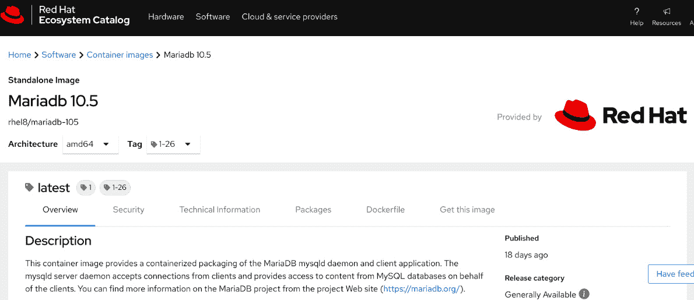

# *第八章*：选择容器基础镜像

学习容器并获得一些经验的最快和最简单方法是开始使用预构建的容器镜像，正如我们在前几章中看到的那样。在深入研究容器管理后，我们发现有时可用的服务、其配置或甚至应用程序版本并不是我们项目所需要的。接着，我们介绍了 Buildah 及其用于构建自定义容器镜像的功能。在本章中，我们将讨论另一个在社区和企业项目中常被提问的重要话题：**容器基础镜像**的选择。

选择正确的容器基础镜像是容器之旅中的一项重要任务：容器基础镜像是我们的系统服务、应用程序或代码所依赖的底层操作系统层。因此，我们应该选择一个符合安全性和更新最佳实践的镜像。

本章将涵盖以下主要内容：

+   开放容器倡议镜像格式

+   容器镜像来自哪里？

+   可信的容器镜像来源

+   介绍通用基础镜像

# 技术要求

要完成本章内容，您需要一台安装了 Podman 的工作机器。正如在*第三章*《运行第一个容器》中所述，本书中的所有示例都已在 Fedora 34 或更高版本的系统上执行，但也可以在您选择的操作系统上重现。

对我们在*第四章*《管理运行中的容器》中涉及的内容有一个良好的理解，将帮助您轻松掌握有关容器镜像的概念。

# 开放容器倡议镜像格式

正如我们在*第一章*《容器技术简介》中所描述的那样，早在 2013 年，Docker 就在容器领域推出并迅速变得非常流行。

从高层次来看，Docker 团队引入了容器镜像和容器注册表的概念，这改变了游戏规则。另一个重要的步骤是能够将 containerd 项目从 Docker 中提取并捐赠给 **云原生计算基金会**（**CNCF**）。这激励了开源社区开始认真开发可以注入到编排层（如 Kubernetes）的容器引擎。

同样地，在 2015 年，Docker 在许多其他公司（如 Red Hat、AWS、Google、Microsoft、IBM 等）的帮助下，启动了 **开放容器倡议**（**OCI**），该倡议隶属于 Linux 基金会。

这些贡献者开发了运行时规范（runtime-spec）和镜像规范（image-spec），用于描述未来新容器引擎的 API 和架构应该如何创建。

在几个月的工作后，OCI 团队发布了其第一个符合 OCI 规范的容器引擎实现；该项目被命名为`runc`。

值得详细了解容器镜像规范，并复习一些理论背景，我们在*第二章*，*比较 Podman 和 Docker* 中做了介绍。

该规范定义了一个 OCI 容器镜像，包含以下内容：

+   **清单**：包含镜像内容和依赖项的元数据。这还包括识别一个或多个文件系统归档的能力，这些文件系统将被解压缩以获得最终的可运行文件系统。

+   **镜像索引（可选）**：表示一个清单和描述符列表，可以根据目标平台提供镜像的不同实现。

+   **文件系统层集**：应合并的实际层集，以构建最终的容器文件系统。

+   **配置**：包含容器运行时引擎有效运行应用程序所需的所有信息，例如参数、环境变量等。

我们不会深入探讨 OCI 镜像规范的每个元素，但镜像清单值得仔细研究。

## OCI 镜像清单

镜像清单定义了一组层和配置，用于为特定架构和操作系统构建的单个容器镜像。

让我们通过查看以下示例来探索 OCI 镜像清单的详细信息：

```
{
  "schemaVersion": 2,
  "config": {
    "mediaType": "application/vnd.oci.image.config.v1+json",
    "size": 7023,
    "digest": "sha256:b5b2b2c507a0944348e0303114d8d93aaaa081732b86451d9bce1f 432a537bc7"
  },
  "layers": [
    {
      "mediaType": "application/vnd.oci.image.layer.v1.tar+gzip",
      "size": 32654,
      "digest": "sha256:9834876dcfb05cb167a5c24953eba58c4ac89b1adf57f28f2f9d09a f107ee8f0"
    }
  ],
  "annotations": {
    "com.example.key1": "value1",
    "com.example.key2": "value2"
  }
}
```

在这里，我们使用以下关键字：

+   `schemaVersion`：一个必须设置为`2`的属性，确保与 Docker 的向后兼容性。

+   `config`：引用容器配置的属性，通过摘要来标识：

    +   `mediaType`：该属性定义了实际的配置格式（目前仅有一种）。

+   `layers`：该属性提供了一组描述符对象的数组：

    +   `MediaType`：在这种情况下，该描述符应该是层描述符允许的媒体类型之一。

+   `annotations`：该属性定义了镜像清单的附加元数据。

总结来说，该规范的主要目标是创建可互操作的工具，用于构建、传输和准备容器镜像以运行。

镜像清单规范有三个主要目标：

+   为了启用镜像配置的哈希处理，从而生成唯一的 ID

+   允许多架构镜像，因为其高级清单（镜像索引）引用了针对特定平台的镜像清单版本。

+   能够轻松将容器镜像转换为 OCI 运行时规范

现在，让我们来了解这些容器镜像的来源。

# 容器镜像从哪里来？

在前面的章节中，我们使用了预构建的镜像来运行、构建或管理容器，但这些容器镜像从哪里来呢？

我们如何深入了解它们的源命令或用于构建镜像的 Dockerfile/ContainerFile 呢？

正如我们之前提到的，Docker 引入了容器镜像和容器注册中心的概念，用于存储这些镜像——甚至是公开存储。最著名的容器注册中心是 Docker Hub，但在 Docker 推出之后，其他云容器注册中心也陆续发布。

我们可以在以下云容器注册中心之间进行选择：

+   **Docker Hub**：这是 Docker 公司提供的托管注册中心解决方案。该注册中心还托管官方仓库和经过安全验证的镜像，供一些流行的开源项目使用。

+   **Quay**：这是由 CoreOS 公司创建的托管注册中心解决方案，现已成为 Red Hat 的一部分。它提供私有和公有仓库、用于安全目的的自动扫描、镜像构建以及与流行 Git 公共仓库的集成。

+   **Linux 发行版注册中心**：流行的 Linux 发行版通常是社区驱动的，比如 Fedora Linux，或企业驱动的，比如 **Red Hat Enterprise Linux** (**RHEL**) 。它们通常提供公共容器注册中心，但这些注册中心通常只提供已经作为系统包发布的项目或软件包。这些注册中心不对最终用户开放，它们由 Linux 发行版的维护者提供支持。

+   **公共云注册中心**：Amazon、Google、Microsoft 以及其他公共云服务提供商为他们的客户提供私有容器注册中心。

我们将在*第九章*《推送镜像到容器注册中心》中更详细地探讨这些注册中心。

Docker Hub 和 Quay.io 是公共容器注册中心，任何人都可以在这些注册中心中找到已创建的容器镜像。这些注册中心充满了有用的自定义镜像，我们可以将其作为快速轻松测试容器镜像的起点。

仅仅下载并运行容器镜像并不总是最佳选择——我们可能会遇到非常旧且过时的软件，这些软件可能存在已知的公共漏洞，或者更糟糕的是，我们可能会下载并执行某些恶意代码，从而危及整个基础设施的安全。

正因如此，Docker Hub 和 Quay.io 通常会提供一些功能，以强调这些镜像的来源。让我们检查一下它们。

## Docker Hub 容器注册中心服务

正如我们之前介绍的，Docker Hub 是最著名的容器注册中心，提供多种容器镜像，涵盖社区和企业产品。

通过查看容器镜像的详细页面，我们可以轻松发现关于该项目及其容器镜像的所有必要信息。以下截图展示了 Alpine Linux 在 Docker Hub 上的页面：


](img/B17908_08_01.jpg)

图 8.1 – Docker Hub 上的 Alpine Linux 容器镜像

如您所见，在页面顶部，我们可以找到有用的信息，包括最新的标签、支持的架构以及指向项目文档和问题报告系统的有用链接。

在 Docker Hub 页面上，当镜像属于 Docker 官方镜像计划时，我们可以在镜像名称后找到 *官方镜像* 标签。此计划中的镜像由 Docker 团队与上游项目的维护者直接合作进行管理。

重要说明

如果您想更深入地查看此页面，请在网页浏览器中输入 [`hub.docker.com/_/alpine`](https://hub.docker.com/_/alpine)。

Docker Hub 提供的另一个重要功能（不仅适用于官方镜像）是查看用于创建某个镜像的 Dockerfile。

如果我们点击容器镜像页面上的某个可用标签，我们可以轻松查看该容器镜像标签的 Dockerfile。

点击该页面上名为 `20210804, edge` 的标签将会将我们重定向到 `docker-alpine` 项目的 GitHub 页面，该项目的 Dockerfile 如下所示：[`github.com/alpinelinux/docker-alpine/blob/edge/x86_64/Dockerfile`](https://github.com/alpinelinux/docker-alpine/blob/edge/x86_64/Dockerfile)。

我们应始终注意并优先选择官方镜像。如果没有官方镜像，或它不符合我们的需求，那么我们需要检查内容创建者发布的 Dockerfile 和容器镜像。

## Quay 容器注册服务

Quay 是一个容器注册服务，2014 年被 CoreOS 收购，现在是 Red Hat 生态系统的一部分。

该注册表允许用户在选择容器镜像后更加小心，因为它提供了安全扫描软件。

Quay 采用 Clair 项目，这是一款领先的容器漏洞扫描工具，会在仓库标签网页上显示报告，如以下截图所示：


图 8.2 – Quay 漏洞安全扫描页面

在此页面上，我们可以点击 **Security Scan** 来检查该安全扫描的详细信息。如果您想了解更多关于此功能的信息，请访问 [`quay.io/repository/openshift-release-dev/ocp-release?tab=tags`](https://quay.io/repository/openshift-release-dev/ocp-release?tab=tags)。

正如我们所看到的，使用一个提供安全扫描功能的公共注册表可以帮助确保我们选择到正确且最安全的容器镜像。

## Red Hat 生态系统目录

Red Hat 生态系统目录是 **Red Hat Enterprise Linux** (**RHEL**) 和 Red Hat **OpenShift 容器平台** (**OCP**) 用户的默认容器注册表。该注册表的网页界面对任何用户开放，无论他们是否经过身份验证，尽管几乎所有提供的镜像都仅限于付费用户（RHEL 或 OCP 用户）。

我们谈论这个注册表，是因为它结合了我们之前讨论的所有功能。这个注册表为用户提供以下功能：

+   Red Hat 官方容器镜像

+   ContainerFile/Dockerfile 源代码，用于检查镜像内容

+   每个分发的容器镜像的安全报告（索引）

以下截图展示了在**Red Hat 生态系统目录**页面上，该信息的显示方式：



图 8.3 – Red Hat 生态系统目录中的 MariaDB 容器镜像描述页面

如我们所见，页面展示了我们选择的容器镜像（MariaDB 数据库）的描述、版本、可用架构以及可从相应下拉菜单中选择的各种标签。有些选项卡还提到了我们感兴趣的关键字：*Security* 和 *Dockerfile*。

通过点击**Security**选项卡，我们可以看到针对该镜像标签执行的漏洞扫描状态，如以下截图所示：


图 8.4 – Red Hat 生态系统目录中的 MariaDB 容器镜像安全页面

如我们所见，在撰写本文时，针对这个最新的镜像标签，已经识别出一个影响三个软件包的安全漏洞。在右侧，我们可以找到 Red Hat 咨询 ID，并且该 ID 链接到公共的**常见漏洞与暴露**（**CVE**）列表。

通过点击**Dockerfile**选项卡，我们可以查看用于构建该容器镜像的源 ContainerFile：


图 8.5 – Red Hat 生态系统目录中的 MariaDB 容器镜像 Dockerfile 页面

如我们所见，我们可以查看用于构建我们将拉取并运行的容器镜像的源 ContainerFile。这是一个很棒的功能，我们可以通过点击容器镜像描述页面来访问它。

如果我们仔细查看前面的截图，可以看到 MariaDB 容器镜像是使用一个非常特殊的容器基础镜像构建的：UBI8\。

**UBI** 代表**通用基础镜像**。它是由 Red Hat 推出的一个倡议，允许每个用户（无论是否是 Red Hat 客户）打开 Red Hat 容器镜像。这使得 Red Hat 生态系统能够通过利用 Red Hat 生态系统目录中提供的所有服务，并借助直接来自 Red Hat 的更新包，进一步扩展。

我们将在本章后面进一步讨论 UBI 及其容器镜像。

# 可信的容器镜像源

在上一节中，我们定义了镜像注册表在有效、可用镜像中的核心作用。接下来，我们要强调的是，采用来自可信来源的镜像的重要性。

OCI 镜像用于将二进制文件和运行时打包成结构化文件系统，目的是提供特定服务。当我们拉取该镜像并在系统上运行它时，如果没有任何控制措施，我们隐式地信任作者没有使用恶意组件篡改其内容。但如今，信任是无法轻易授予的。

正如我们在*第十一章*《*容器安全*》中所看到的那样，容器中可能存在许多攻击用例和恶意行为：特权升级、数据外泄和挖矿只是其中的几个例子。当容器在 Kubernetes 集群（数以千计的集群）中运行时，这些行为可能会被放大，因为它们可以轻松地跨基础设施生成恶意的 pod。

为了帮助安全团队缓解这个问题，MITRE 公司定期发布**MITRE ATT&CK** 矩阵，旨在识别所有可能的攻击策略及其相关技术，提供实际案例，并列出检测和缓解的最佳实践。这些矩阵中有一部分专门针对容器，其中许多技术是基于不安全镜像实现的，在这些镜像中可以成功地执行恶意行为。

重要提示

你应该优先选择来自支持漏洞扫描的注册表的镜像。如果扫描结果可用，务必仔细检查，并避免使用发现严重漏洞的镜像。

考虑到这一点，创建安全的云原生基础设施的第一步是什么？答案是选择仅来自可信来源的镜像，而第一步是配置可信注册表和模式，以阻止不允许的注册表。我们将在接下来的小节中介绍这一点。

## 管理可信注册表

如在*第三章*《*运行第一个容器*》的《*准备环境*》一节中所示，Podman 可以通过配置文件管理可信注册表。

`/etc/containers/registries.conf` 文件（如果存在，被用户相关的 `$HOME/.config/containers/registries.conf` 文件覆盖）管理着一个信任的注册表列表，Podman 可以安全地联系这些注册表来搜索和拉取镜像。

让我们来看一个文件示例：

```
unqualified-search-registries = ["docker.io", "quay.io"]

[[registry]]
location = "registry.example.com:5000"
insecure = false
```

这个文件帮助我们定义 Podman 可以使用的可信注册表，因此值得进行详细分析。

Podman 接受**未完全限定**和**完全限定**的镜像。两者的区别非常简单，可以通过以下方式说明：

+   完全限定的镜像包括注册表服务器 FQDN、命名空间、镜像名称和标签。例如，`docker.io/library/nginx:latest` 就是一个完全限定的镜像。它有一个完整的名称，无法与任何其他 Nginx 镜像混淆。

+   未限定的镜像只包括镜像的名称。例如，`nginx`镜像在搜索的注册表中可能有多个实例。大多数通过基本命令`podman search nginx`得到的镜像都不是官方镜像，应当进行详细分析以确保它们是可信的。输出可以通过`OFFICIAL`标志和`STARS`数量（更多更好）进行筛选。

注册表配置文件的第一个全局设置是`unqualified-search-registry`数组，该数组定义了未限定镜像的注册表搜索列表。当用户运行`podman search <image_name>`命令时，Podman 会在此列表中定义的注册表中进行搜索。

通过从列表中移除一个注册表，Podman 将停止在该注册表中搜索。然而，Podman 仍然能够从外部注册表拉取完全限定的镜像。

为了管理单一注册表并为特定镜像创建匹配模式，我们可以使用`[[registry]]` **Tom's Obvious, Minimal Language** (**TOML**) 表格。 这些表格的主要设置如下：

+   `prefix`：用于定义镜像名称，支持多种格式。通常，我们可以通过遵循`host[:port]/namespace[/_namespace_…]/repo(:_tag|@digest)`模式来定义镜像，尽管也可以使用更简洁的模式，如`host[:port]`、`host[:port]/namespace`，甚至`[*.]host`。按照这种方式，用户可以为注册表定义一个通用前缀，或为匹配特定镜像或标签定义一个更详细的前缀。给定一个完全限定的镜像，如果两个`[[registry]]`表格有一个部分匹配的前缀，则使用最长的匹配模式。

+   `insecure`：这是一个布尔值（`true`或`false`），允许使用未加密的 HTTP 连接或基于不受信任证书的 TLS 连接。

+   `blocked`：这是一个布尔值（`true`或`false`），用于定义被阻止的注册表。如果设置为 true，则与前缀匹配的注册表或镜像会被阻止。

+   `location`：该字段定义了注册表的位置。默认情况下，它等于`prefix`，但可以有不同的值。在这种情况下，匹配自定义前缀命名空间的模式将解析为`location`值。

除了主要的`[[registry]]`表格外，我们还可以定义一个`[[registry.mirror]]` TOML 表格数组，以提供通往主注册表或注册表命名空间的备用路径。

当提供多个镜像时，Podman 将首先在它们之间搜索，然后回退到主`[[registry]]`表格中定义的位置。

以下示例通过定义一个命名空间注册表条目及其镜像，扩展了之前的内容：

```
unqualified-search-registries = ["docker.io", "quay.io"]
[[registry]]
location = "registry.example.com:5000/foo"
insecure = false
[[registry.mirror]]
location = "mirror1.example.com:5000/bar"
[[registry.mirror]]
location = "mirror2.example.com:5000/bar"
```

根据此示例，如果用户尝试拉取标记为`registry.example.com:5000/foo/app:latest`的镜像，Podman 将首先尝试`mirror1.example.com:5000/bar/app:latest`，然后尝试`mirror2.example.com:5000/bar/app:latest`，如果失败，则回退到`registry.example.com:5000/foo/app:latest`。

使用前缀提供更大的灵活性。在下面的示例中，所有匹配`example.com/foo`的镜像将被重定向到镜像位置，并在末尾回到主位置：

```
unqualified-search-registries = ["docker.io", "quay.io"]
[[registry]]
prefix = "example.com/foo"
location = "registry.example.com:5000/foo"
insecure = false
[[registry.mirror]]
location = "mirror1.example.com:5000/bar"
[[registry.mirror]]
location = "mirror2.example.com:5000/bar"
```

在这个示例中，当我们拉取`example.com/foo/app:latest`镜像时，Podman 将尝试拉取`mirror1.example.com:5000/bar/app:latest`，然后是`mirror2.example.com:5000/bar/app:latest`和`registry.example.com:5000/foo/app:latest`。

可以更高级地使用镜像，例如在断开连接的环境中用私有镜像替换公共注册表。以下示例将`docker.io`和`quay.io`注册表重新映射到具有不同命名空间的私有镜像：

```
[[registry]]
prefix="quay.io"
location="mirror-internal.example.com/quay"
[[registry]]
prefix="docker.io"
location="mirror-internal.example.com/docker"
```

重要提示

镜像注册表应该与镜像仓库保持同步。因此，管理员或 SRE 团队应实施镜像同步策略以保持仓库更新。

最后，我们将学习如何阻止不被认为是可信的源。此行为可能会影响单个镜像、命名空间或整个注册表。

以下示例告诉 Podman 不要搜索或拉取来自阻止的注册表的镜像：

```
[[registry]]
location = "registry.rogue.io"
blocked = true
```

可以通过传递特定命名空间来细化阻止策略，而不是阻止整个注册表。在下面的示例中，定义在`prefix`字段中的每个镜像搜索或拉取与`quay.io/foo`命名空间模式匹配的操作将被阻止：

```
[[registry]]
prefix = "quay.io/foo/"
location = "docker.io"
blocked = true
```

根据此模式，如果用户尝试拉取名为`quay.io/foo/nginx:latest`或`quay.io/foo/httpd:v2.4`的镜像，则匹配前缀并阻止拉取。当拉取`quay.io/bar/fedora:latest`镜像时不会执行任何阻止操作。

用户还可以使用与命名空间相同的方法为单个镜像或甚至单个标签定义非常具体的阻止规则。以下示例阻止特定镜像标签：

```
[[registry]]
prefix = "internal-registry.example.com/dev/app:v0.1"
location = "internal-registry.example.com "
blocked = true
```

可以结合多个阻止规则，并在其上添加镜像表。

重要提示

在一个运行多台 Podman 的复杂基础架构中（例如，开发者工作站），一个聪明的想法是使用配置管理工具保持注册表的配置文件更新，并声明性地应用注册表的过滤器。

完全限定的镜像名称可能会变得非常长，如果我们总结注册表的 FQDN、命名空间、仓库和标签。可以使用`[aliases]`表创建别名，以允许使用短镜像名称。这种方法可以简化镜像管理并减少人为错误。但是，别名不处理镜像标签或摘要。

以下示例定义了一系列常用镜像的别名：

```
[aliases]
"fedora" = "registry.fedoraproject.org/fedora"
"debian" = "docker.io/library/debian"
```

当别名匹配短名称时，立即使用，而不会搜索`unqualified-search-registries`列表中定义的注册表。

重要提示

我们可以在`/etc/containers/registries.conf.d/`文件夹内创建自定义文件，以定义别名，而不会使主配置文件臃肿。

通过这一点，我们已经学会了如何管理可信的来源，并屏蔽不需要的镜像、注册表或命名空间。这是一个安全最佳实践，但它并不能解除我们选择一个适合我们需求、可信赖且攻击面最小的有效镜像的责任。在我们构建新的应用程序时也是如此，基础镜像必须是轻量且安全的。Red Hat 的 UBI 镜像可以为这个问题提供一个有用的解决方案。

# 介绍通用基础镜像

在企业环境中工作时，许多用户和公司选择 RHEL 作为执行工作负载的操作系统，以保证可靠性和安全性。基于 RHEL 的容器镜像也可以使用，它们利用与操作系统版本相同的包版本。所有发布的 RHEL 安全更新会立即应用到 OCI 镜像上，使得这些镜像成为构建生产级应用程序的强大且安全的基础。

不幸的是，没有 Red Hat 订阅的用户无法公开访问 RHEL 镜像。已经激活有效订阅的用户可以在其 RHEL 系统上自由使用这些镜像，并在其上构建自定义镜像，但如果没有遵守 Red Hat 企业协议，不能自由再分发这些镜像。

那么，为什么要担心呢？有很多常用镜像可以替代它们。这确实是对的，但在可靠性和安全性方面，许多公司选择坚持使用企业级解决方案，容器领域也不例外。

基于这些原因，并且为了应对 RHEL 镜像的再分发限制，Red Hat 创建了**通用基础镜像**，也叫**UBI**。UBI 镜像是可以自由再分发的，可用于构建容器化的应用程序、中间件和实用工具，并且始终由 Red Hat 进行维护和升级。

UBI 镜像基于当前受支持的 RHEL 版本：在撰写本文时，**UBI7**和**UBI8**镜像已经发布（分别基于 RHEL7 和 RHEL8），此外还有**UBI9-beta**镜像，它基于 RHEL9-beta。一般来说，我们可以将 UBI 镜像视为 RHEL 操作系统的一个子集。

所有 UBI 镜像都可以在公共的 Red Hat 注册表（[registry.access.redhat.com](http://registry.access.redhat.com)）和 Docker Hub（[docker.io](http://docker.io)）上找到。

目前有四种不同的 UBI 镜像，每种镜像都针对特定的使用场景进行了优化：

+   **标准版**：这是标准的 UBI 镜像，具有最全面的功能和包支持。

+   **精简版**：这是一个经过简化的标准镜像版本，具有最基本的包管理功能。

+   **微型版**：这是一个精简版的 UBI 镜像，没有包管理器。

+   `systemd`初始化系统，使你可以在单个容器中管理多个服务的执行。

这些镜像**免费使用和再分发**，可以用于自定义镜像中。我们将详细描述每种镜像，首先介绍 UBI 标准镜像。

## UBI Standard 镜像

UBI Standard 镜像是最完整的 UBI 镜像版本，也是最接近标准 RHEL 镜像的版本。它包含了 **YUM** 包管理器，这是在 RHEL 中可用的，并且可以通过安装其专用软件仓库中的包进行自定义；也就是说，*ubi-8-baseos* 和 *ubi-8-appstream*。

以下示例展示了一个使用标准 UBI8 镜像来构建最小化 `httpd` 服务器的 Dockerfile/ContainerFile：

```
FROM registry.access.redhat.com/ubi8
# Update image and install httpd
RUN yum update -y && yum install -y httpd && yum clean all –y
# Expose the default httpd port 80
EXPOSE 80
# Run the httpd
CMD ["/usr/sbin/httpd", "-DFOREGROUND"]
```

UBI Standard 镜像是为通用应用程序和在 RHEL 上可用的包设计的，并且已经包含了一些基本系统工具（包括 `curl`、`tar`、`vi`、`sed` 和 `gzip`）和 OpenSSL 库，同时保持了小巧的体积（大约 230 MiB）：更少的包意味着更轻量级的镜像和更小的攻击面。

如果 UBI Standard 镜像仍然被认为太大，UBI Minimal 镜像可能是一个不错的选择。

## UBI Minimal 镜像

UBI Minimal 镜像是 UBI Standard 镜像的精简版本，专为自包含应用及其运行时（如 Python、Ruby、Node.js 等）设计。因此，它的体积更小，包的选择也更少，并且不包含 YUM 包管理器；它已被一个叫做 `microdnf` 的最小化工具所替代。UBI Minimal 镜像比 UBI Standard 镜像更小，大小大约是后者的一半。

以下示例展示了一个使用 UBI 8 Minimal 镜像来构建概念验证 Python Web 服务器的 Dockerfile/ContainerFile：

```
# Based on the UBI8 Minimal image
FROM registry.access.redhat.com/ubi8-minimal

# Upgrade and install Python 3.6
RUN microdnf upgrade && microdnf install python3

# Copy source code
COPY entrypoint.sh http_server.py /

# Expose the default httpd port 80
EXPOSE 8080
# Configure the container entrypoint
ENTRYPOINT ["/entrypoint.sh"]

# Run the httpd
CMD ["/usr/bin/python3", "-u", "/http_server.py"]
```

通过查看由容器执行的 Python Web 服务器的源代码，我们可以看到，当收到 HTTP GET 请求时，Web 服务器处理程序会打印出一个 *Hello World!* 字符串。该服务器还通过 Python `signal` 模块管理信号终止，允许容器优雅地停止：

```
#!/usr/bin/python3
import http.server
import socketserver
import logging
import sys
import signal
from http import HTTPStatus
port = 8080
message = b'Hello World!\n'
logging.basicConfig(
  stream = sys.stdout, 
  level = logging.INFO
)
def signal_handler(signum, frame):
  sys.exit(0)
class Handler(http.server.SimpleHTTPRequestHandler):
  def do_GET(self):
    self.send_response(HTTPStatus.OK)
    self.end_headers()
    self.wfile.write(message)

if __name__ == "__main__":
  signal.signal(signal.SIGTERM, signal_handler)
  signal.signal(signal.SIGINT, signal_handler)
  try:
    httpd = socketserver.TCPServer(('', port), Handler)
    logging.info("Serving on port %s", port)
    httpd.serve_forever()
  except SystemExit:
    httpd.shutdown()
    httpd.server_close()
```

最后，Python 可执行文件通过一个最小化的入口脚本被调用：

```
#!/bin/bash
set -e
exec $@
```

脚本会启动通过 `CMD` 指令中的数组传递的命令。还要注意，`-u` 选项被传递给 Python 可执行文件。这启用了无缓冲输出，并使容器实时打印访问日志。

让我们尝试构建并运行容器，看看会发生什么：

```
$ buildah build -t python_httpd .
$ podman run -p 8080:8080 python_httpd
INFO:root:Serving on port 8080
```

有了这些，我们的最小化 Python `httpd` 服务器已经准备好运行，并提供许多几乎没什么用处但温暖的 *Hello World!* 响应。

UBI Minimal 最适合这些用例。然而，可能还需要一个更小的镜像。这正是 UBI Micro 镜像的完美应用场景。

## UBI Micro 镜像

UBI Micro 镜像是 UBI 系列中最新的成员。它的基本理念是提供一个无发行版的镜像，一个简化的包管理器，没有所有不必要的包，提供一个非常小的镜像，同时也能提供最小的攻击面。减少攻击面是实现安全、最小化镜像的必要条件，这样的镜像更难被利用。

UBI 8 Micro 镜像在多阶段构建中表现出色，其中第一阶段生成最终的制品，第二阶段将它们复制到最终镜像中。以下示例展示了一个基本的多阶段 Dockerfile/ContainerFile，在 UBI Standard 容器内构建一个最小的 Golang 应用程序，同时将最终的制品复制到 UBI Micro 镜像中：

```
# Builder image
FROM registry.access.redhat.com/ubi8-minimal AS builder
# Install Golang packages
RUN microdnf upgrade && \
    microdnf install golang && \
    microdnf clean all
# Copy files for build
COPY go.mod /go/src/hello-world/
COPY main.go /go/src/hello-world/
# Set the working directory
WORKDIR /go/src/hello-world
# Download dependencies
RUN go get -d -v ./...
# Install the package
RUN go build -v ./...
# Runtime image
FROM registry.access.redhat.com/ubi8/ubi-micro:latest
COPY --from=builder /go/src/hello-world/hello-world /
EXPOSE 8080
CMD ["/hello-world"]
```

构建的输出结果是一个大约 45 MB 的镜像。

UBI Micro 镜像没有内置的包管理器，但仍然可以使用 Buildah 原生命令安装额外的包。在 RHEL 系统上，这个方法效果良好，因为所有的 Red Hat GPG 证书都已安装。

以下示例展示了一个可以在 RHEL 8 上执行的构建脚本。它的目的是在 UBI Micro 镜像上使用主机的 `yum` 包管理器安装额外的 Python 包：

```
#!/bin/bash
set -euo pipefail
if [ $UID -ne 0 ]; then
    echo "This script must be run as root"
    exit 1
fi
container=$(buildah from registry.access.redhat.com/ubi8/ubi-micro)
mount=$(buildah mount $container)
yum install -y \
  --installroot $mount \
  --setopt install_weak_deps=false \
  --nodocs \ 
  --noplugins \
  --releasever 8 \
  python3
yum clean all --installroot $mount
buildah umount $container
buildah commit $container micro_httpd
```

注意，`yum install` 命令通过传递 `--installroot $mount` 选项来执行，这告诉安装程序使用工作容器挂载点作为临时根目录来安装包。

UBI Minimal 和 UBI Micro 镜像非常适合实现微服务架构，在这种架构中，我们需要将多个容器协调在一起，每个容器运行一个特定的微服务。

现在，让我们看看 UBI Init 镜像，它允许我们在容器内协调多个服务的执行。

## UBI Init 镜像

容器开发中的一个常见模式是创建高度专业化的镜像，每个镜像内部运行一个单独的组件。

要实现多层应用程序，例如具有前端、中间件和后端的应用程序，最佳实践是创建并协调多个容器，每个容器运行一个特定的组件。目标是拥有最小化且高度专业化的容器，每个容器运行自己的服务/进程，同时遵循**保持简单，傻瓜**（**KISS**）哲学，这一哲学自 UNIX 系统诞生以来便被实现。

尽管这种方法适用于大多数用例，但在某些特殊场景中，它并不总是合适，比如当需要协调多个进程时。举个例子，当我们需要共享所有容器命名空间给多个进程，或是当我们只想要一个单一的、*超级*镜像时。

容器镜像通常创建时没有初始化系统，容器内部执行的进程（由 `CMD` 指令调用）通常会获得**PID 1**。

基于此，Red Hat 引入了 UBI Init 镜像，它运行一个最小的 `1` 来执行。

UBI Init 镜像比 Standard 镜像稍小，但比 Minimal 镜像提供更多的可用包。

默认的 CMD 设置为 `/sbin/init`，这对应于 Systemd 进程。Systemd 会忽略 `SIGTERM` 和 `SIGKILL` 信号，这些信号通常用于通过 Podman 停止运行的容器。由于这个原因，镜像被配置为通过在镜像的 Dockerfile 中传递 `STOPSIGNAL SIGRTMIN+3` 指令来发送 `SIGRTMIN+3` 信号以进行终止。

以下示例展示了一个 Dockerfile/ContainerFile，该文件安装 `httpd` 包并配置一个 `systemd` 单元来运行 `httpd` 服务：

```
FROM registry.access.redhat.com/ubi8/ubi-init
RUN yum -y install httpd && \
         yum clean all && \ 
         systemctl enable httpd
RUN echo "Successful Web Server Test" > /var/www/html/index.html
RUN mkdir /etc/systemd/system/httpd.service.d/ && \
         echo -e '[Service]\nRestart=always' > /etc/systemd/system/httpd.service.d/httpd.conf
EXPOSE 80
CMD [ "/sbin/init" ]
```

注意 `RUN` 指令，在这里我们创建了 `/etc/systemd/system/httpd.service.d/` 文件夹和 Systemd 单元文件。这个最小示例可以通过复制预先编辑的单元文件来替代，这在需要创建多个服务时特别有用。

我们可以构建并运行镜像，使用 `ps` 命令检查容器内 `init` 系统的行为：

```
$ buildah build -t init_httpd .
$ podman run -d --name httpd_init -p 8080:80 init_httpd 
$ podman exec -ti httpd_init /bin/bash
[root@b4fb727f1907 /]# ps aux
USER         PID %CPU %MEM    VSZ   RSS TTY      STAT START   TIME COMMAND
root           1  0.1  0.0  89844  9404 ?        Ss   10:30   0:00 /sbin/init
root          10  0.0  0.0  95552 10636 ?        Ss   10:30   0:00 /usr/lib/systemd/systemd-journald
root          20  0.1  0.0 258068 10700 ?        Ss   10:30   0:00 /usr/sbin/httpd -DFOREGROUND
dbus          21  0.0  0.0  54056  4856 ?        Ss   10:30   0:00 /usr/bin/dbus-daemon --system --address=systemd: --nofork --nopidfile --systemd-activation --syslog-only
apache        23  0.0  0.0 260652  7884 ?        S    10:30   0:00 /usr/sbin/httpd -DFOREGROUND
apache        24  0.0  0.0 2760308 9512 ?        Sl   10:30   0:00 /usr/sbin/httpd -DFOREGROUND
apache        25  0.0  0.0 2563636 9748 ?        Sl   10:30   0:00 /usr/sbin/httpd -DFOREGROUND
apache        26  0.0  0.0 2563636 9516 ?        Sl   10:30   0:00 /usr/sbin/httpd -DFOREGROUND
root         238  0.0  0.0  19240  3564 pts/0    Ss   10:30   0:00 /bin/bash
root         247  0.0  0.0  51864  3728 pts/0    R+   10:30   0:00 ps aux
```

请注意，`/sbin/init` 进程以 PID `1` 执行，并且它会生成 `httpd` 进程。容器还执行了 `dbus-daemon`，这是 Systemd 用来暴露其 API 的进程，同时还执行了 `systemd-journald` 来处理日志。

通过这种方法，我们可以在同一容器中添加多个应该共同工作的服务，并让它们由 Systemd 协调。

到目前为止，我们已经了解了四个当前可用的 UBI 镜像，并演示了它们如何用于创建自定义应用程序。许多公共的 Red Hat 镜像是基于 UBI 的。让我们来看一下。

## 其他基于 UBI 的镜像

Red Hat 使用 UBI 镜像来生成许多预构建的专用镜像，特别是对于运行时。通常，它们不受再分发限制。

这使得可以为 Python、Quarkus、Golang、Perl、PDP、.NET、Node.js、Ruby 和 OpenJDK 等语言、运行时和框架创建运行时镜像。

UBI 也被用作 **Source-to-Image** (**s2i**) 框架的基础镜像，该框架用于在 OpenShift 中原生构建应用程序，而无需使用 Dockerfile。通过 s2i，用户可以从自定义脚本和应用程序源代码中组装镜像。

最后但同样重要的是，Red Hat 支持的 Buildah、Podman 和 Skopeo 的发行版本是使用 UBI 8 镜像打包的。

超越 Red Hat 的提供，其他供应商也使用 UBI 镜像来发布他们的镜像——Intel、IBM、Isovalent、Cisco、Aqua Security 等许多公司也采用 UBI 作为他们在 Red Hat Marketplace 上发布的官方镜像的基础。

# 总结

在本章中，我们学习了 OCI 镜像规范以及容器注册表的作用。

此外，我们学习了如何采用安全的镜像注册表，并通过自定义策略筛选出这些注册表，允许我们阻止特定的注册表、命名空间和镜像。

最后，我们介绍了 UBI 作为一种基于 RHEL 包创建轻量级、可靠且可再分发镜像的解决方案。

通过本章所学的知识，你应该能够更详细地理解 OCI 镜像规范，并安全地管理镜像注册表。

在下一章中，我们将探讨私有注册表与公共注册表之间的区别，以及如何在本地创建私有注册表。最后，我们将学习如何使用专门的**Skopeo**工具管理容器镜像。

# 进一步阅读

要了解更多本章所涉及的主题，请查看以下资源：

+   MITRE ATT&CK®矩阵: [`attack.mitre.org/matrices/enterprise/containers/`](https://attack.mitre.org/matrices/enterprise/containers/)

+   关于 Kubernetes 威胁矩阵你应该知道的事情: [`cloud.redhat.com/blog/2021-kubernetes-threat-matrix-updates-things-you-should-know`](https://cloud.redhat.com/blog/2021-kubernetes-threat-matrix-updates-things-you-should-know)

+   如何管理 Linux 容器注册表: [`www.redhat.com/sysadmin/manage-container-registries`](https://www.redhat.com/sysadmin/manage-container-registries)

+   介绍 Red Hat 通用基础镜像: [`www.redhat.com/en/blog/introducing-red-hat-universal-base-image`](https://www.redhat.com/en/blog/introducing-red-hat-universal-base-image)

+   Red Hat 的 UBI Micro 简介: [`www.redhat.com/en/blog/introduction-ubi-micro`](https://www.redhat.com/en/blog/introduction-ubi-micro)
