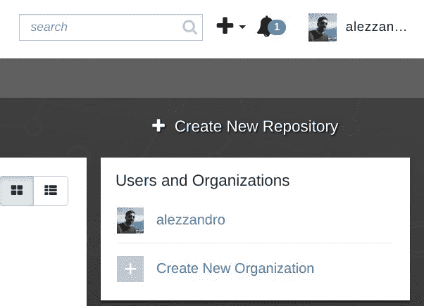
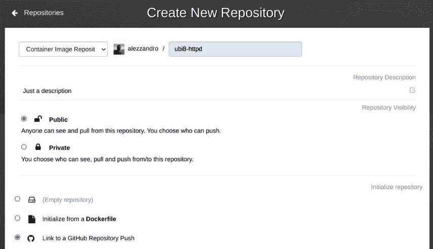
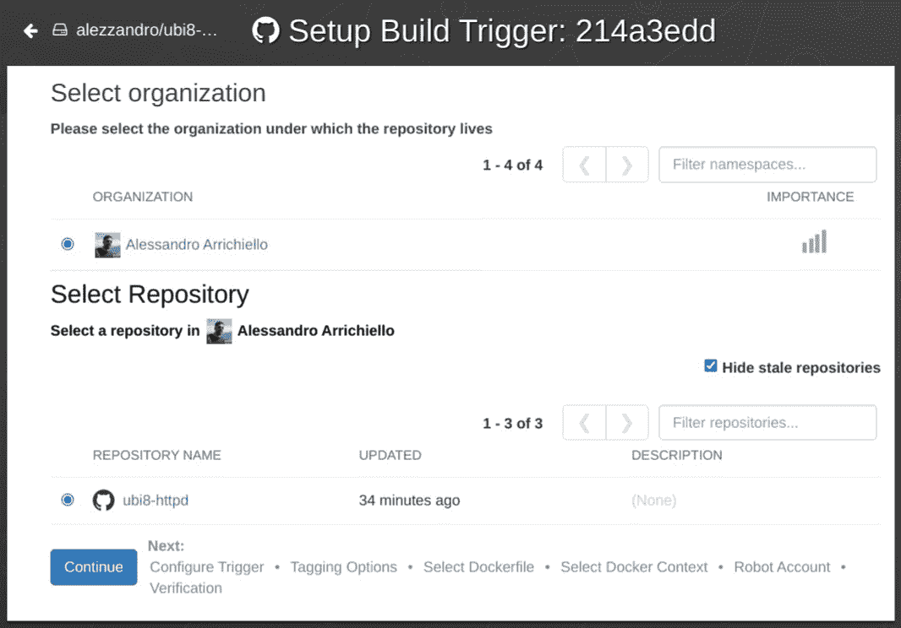
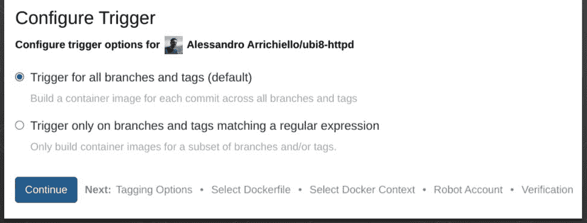
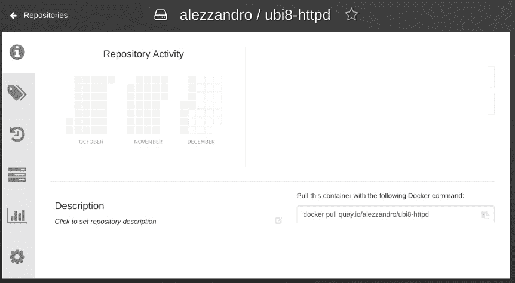
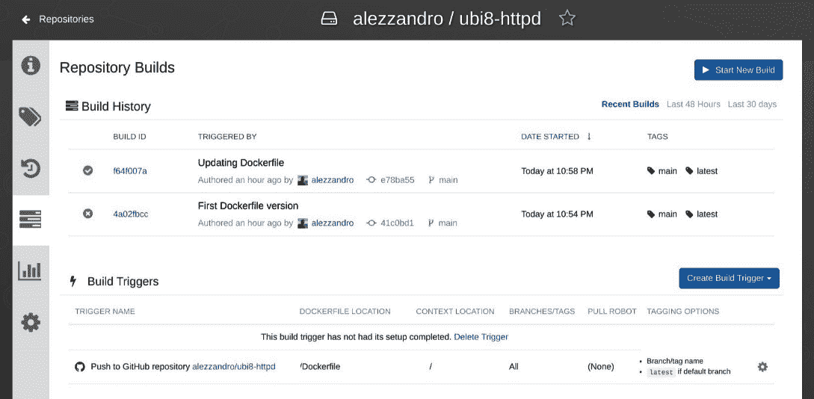
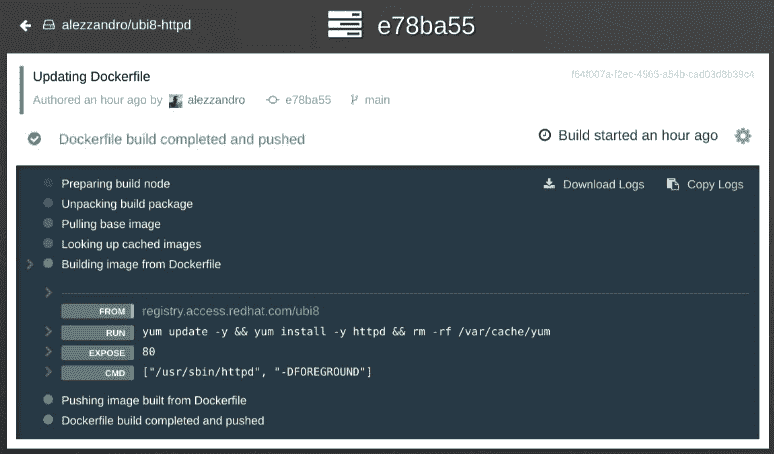
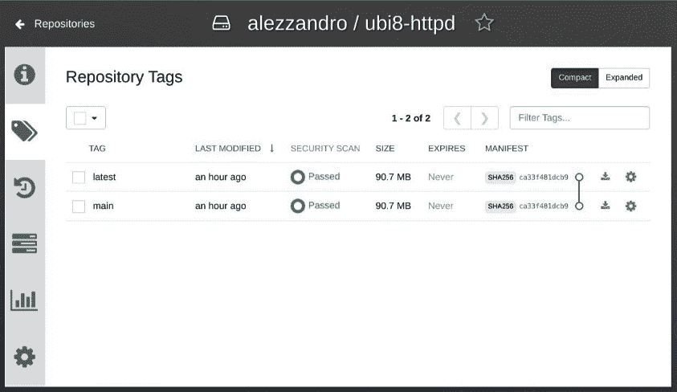

# *第九章*：将镜像推送到容器注册表

在上一章中，我们探讨了容器基础镜像的一个非常重要的概念。如我们所见，为我们的容器明智地选择基础镜像非常重要，应该使用来自可信容器注册表和开发社区的官方容器镜像。

但是，一旦我们选择了首选的基础镜像并构建了最终的容器镜像，我们就需要一种方法将我们的工作进一步分发到计划运行的各种目标主机上。

分发容器镜像的最佳选项是将其推送到容器注册表，然后让所有目标主机拉取并运行该容器镜像。

因此，在本章中，我们将覆盖以下主要主题：

+   什么是容器注册表？

+   基于云的和本地的容器注册表

+   使用 Skopeo 管理容器镜像

+   运行本地容器注册表

# 技术要求

在继续本章及其示例之前，需要一台已安装并正常运行 Podman 的机器。如*第三章*《运行第一个容器》所述，本书中的所有示例都在 Fedora 34 或更高版本的系统上执行，但可以在你选择的操作系统上复制。

理解*第四章*《管理运行中的容器》和*第八章*《选择容器基础镜像》中的内容，将有助于轻松掌握有关容器注册表的概念。

# 什么是容器注册表？

容器注册表只是容器镜像仓库的集合，用于与需要动态拉取和运行容器镜像的系统配合使用。

容器注册表上可用的主要功能如下：

+   仓库管理

+   推送容器镜像

+   标签管理

+   拉取容器镜像

+   身份验证管理

接下来我们将在以下各节中详细介绍每个特性。

## 仓库管理

容器注册表的最重要特性之一是通过仓库管理容器镜像。根据我们选择的容器注册表实现方式，我们肯定会找到一个网页界面或命令行界面，让我们处理创建类似于*文件夹*的容器镜像仓库。

根据**开放容器倡议**（**OCI**）分发规范*[1]*，容器镜像被组织在一个通过名称识别的仓库中。仓库名称通常由用户/组织名称和容器镜像名称组成，格式为：*myorganization/mycontainerimage*，并且必须符合以下正则表达式检查：

```
[a-z0-9]+([._-][a-z0-9]+)*(/[a-z0-9]+([._-][a-z0-9]+)*)*
```

重要定义

**正则表达式**（**regex**）是一种由字符序列定义的搜索模式。这个模式定义利用了多种符号，允许用户详细定义在文本文件中查找的目标关键字、行或多行。

一旦我们在容器注册表上创建了一个仓库，我们应该能够开始推送、拉取并处理不同版本（由标签标识）的容器镜像。

## 推送容器镜像

将容器镜像推送到容器注册表的操作是由我们使用的容器工具处理的，该工具遵循 OCI 分发规范。

在此过程中，blob（即内容的二进制形式）会首先上传，通常最后上传的是清单。这个顺序并不是规范严格要求的，但如果清单引用了注册表不认识的 blob，注册表可能会拒绝该清单。

使用容器管理工具将容器镜像推送到注册表时，我们必须再次指定之前展示的仓库名称和我们想上传的容器镜像标签。

## 标签管理

正如我们在*第四章*《管理正在运行的容器》中介绍的那样，容器镜像通过名称和标签来标识。通过标签机制，我们可以在系统的本地缓存或容器注册表上存储多个不同版本的容器镜像。

容器注册表应能够公开内容发现功能，向请求的客户端提供容器镜像标签的列表。此功能使容器注册表的用户能够选择正确的容器镜像进行拉取和运行到目标系统。

## 拉取容器镜像

在拉取容器镜像的过程中，客户端应首先请求清单，以便了解需要拉取哪些 blob（即内容的二进制形式），从而获取最终的容器镜像。这个顺序是严格的，因为如果不拉取和解析容器镜像的清单文件，客户端将无法知道从注册表请求哪些二进制数据。

使用容器管理工具从注册表拉取容器镜像时，我们必须再次指定之前展示的仓库名称和我们想下载的容器镜像标签。

## 身份验证管理

所有上述操作可能都需要身份验证。在许多情况下，公共容器注册表可能允许匿名拉取和内容发现，但推送容器镜像时需要有效的身份验证。

根据选择的容器注册表，我们可能会发现基本或高级功能来进行身份验证，允许我们的客户端存储令牌，并在每次需要时使用它进行操作。

这就是我们对容器注册表理论的简短深入探讨。如果你想了解更多关于 OCI 分发规范的信息，可以参考本章末尾的*进一步阅读*部分中的 URL *[1]*。

了解一下

OCI 分发规范还定义了一套符合性测试，任何人都可以运行这些测试，检查某个容器注册表的实现是否遵循了规范中定义的所有规则：[`github.com/opencontainers/distribution-spec/tree/main/conformance`](https://github.com/opencontainers/distribution-spec/tree/main/conformance)。

网络上可用的各种容器注册表实现，除了我们之前描述的基本功能外，还添加了更多的功能，我们将在下一节中深入了解。

# 基于云和本地的容器注册表

正如我们在前面的章节中介绍的，OCI 定义了一个容器注册表遵循的标准。这个倡议促使了许多其他容器注册表的兴起，除了最初的 Docker Registry 及其在线服务 Docker Hub。

我们可以将可用的容器注册表分为两个主要类别：

+   基于云的容器注册表

+   本地容器注册表

让我们在以下小节中详细了解这两类容器注册表。

## 本地容器注册表

本地容器注册表通常用于创建企业用途的私有仓库。主要的使用场景包括：

+   在私有或隔离网络中分发镜像

+   在多个机器上大规模部署新的容器镜像

+   将任何敏感数据存储在我们自己的数据中心

+   使用内部网络提高拉取和推送镜像的速度

当然，运行本地注册表需要具备一些技能，以确保可用性、监控、日志记录和安全性。

这是一个可在本地安装的容器注册表的非全面列表：

+   **Docker Registry**：这是 Docker 的项目，目前版本为 2，提供前面章节描述的所有基本功能，我们将在本章最后一节*运行本地容器注册表*中学习如何运行它。

+   **Harbor**：这是一个 VMware 的开源项目，提供高可用性、镜像审计和与身份验证系统的集成。

+   **GitLab Container Registry**：这与 GitLab 产品紧密集成，因此只需最小的设置，但它依赖于主项目。

+   **JFrog Artifactory**：它不仅仅管理容器；它还提供任何制品的管理。

+   **Quay**：这是 Red Hat 产品 Quay 的开源版本。该项目提供了一个功能齐全的 Web 用户界面、镜像漏洞扫描服务、数据存储和保护功能。

我们不会深入讨论这些容器注册表的每个细节。我们可以确定地建议你要小心选择适合你使用案例和支持需求的产品或项目。许多这些产品都有支持计划或企业版本（需要许可），在发生灾难时，它们可以轻松帮助你解围。

现在让我们来看看那些基于云的容器注册表，它们可以通过提供完整的托管服务，简化我们的生活，使我们的操作技能降到零。

## 基于云的容器注册表

正如上一节所预期的，基于云的容器注册表可能是通过注册表开始使用容器镜像的最快方式。

如在*第八章*中所述，*选择容器基础镜像*，网上有多个基于云的容器注册表服务。我们将仅集中讨论其中的一小部分，排除掉由公共云提供商提供的服务和由 Linux 发行版提供的服务，这些通常只允许拉取由发行版维护者预装的镜像。

我们将看看这些云容器注册表：

+   **Docker Hub**：这是由 Docker 公司提供的托管注册表解决方案。该注册表还托管一些受安全验证的官方仓库和流行开源项目的镜像。

+   **Quay**：这是由 CoreOS 公司（现在是红帽公司的一部分）推出的托管注册表解决方案。它提供私有和公共仓库、自动化的安全扫描、镜像构建，以及与流行的 Git 公共仓库的集成。

### Docker Hub 云注册表

Docker Hub 云注册表伴随着 Docker 项目的诞生而诞生，成为该项目及容器技术的最大亮点之一，给予了它们应有的关注。

说到功能，Docker Hub 有免费和付费计划：

+   匿名访问：每 6 小时只有 100 次镜像拉取。

+   使用免费套餐的注册用户账户：每 6 小时 200 次镜像拉取，并且可以拥有无限量的公共仓库。免费套餐不包括镜像构建或安全扫描。

+   专业、团队和企业账户：每天成千上万的镜像拉取，自动化构建，安全扫描，RBAC 等等。

正如我们刚才所提到的，如果我们尝试用免费套餐的注册用户账户登录，我们只能创建公共仓库。这对于社区或个人开发者可能足够了，但一旦你开始在企业级使用时，你可能需要付费计划提供的附加功能。

为了避免在拉取镜像时遇到较大的限制，我们应该至少使用一个注册的用户账户，并通过我们钟爱的容器引擎：Podman，登录到 web 门户和容器注册表。接下来的章节将介绍如何认证到注册表，并确保每 6 小时可以拉取 200 次镜像，使用 Docker Hub。

### Red Hat Quay 云注册表

Quay 云注册表是 Red Hat 的本地注册表，但作为**软件即服务**（**SaaS**）提供。

Quay 云注册表像 Docker Hub 一样，提供付费计划以解锁更多功能。

好消息是，Quay 的免费套餐包含了许多功能：

+   从 Dockerfile 构建，可以手动上传或通过 GitHub/Bitbucket/Gitlab 或任何 Git 仓库链接。

+   对推送到注册表的镜像进行安全扫描。

+   使用/审计日志。

+   用于集成任何外部软件的机器人用户账户/令牌。

+   镜像拉取没有限制。

另一方面，付费计划将解锁私有仓库和基于团队的权限。

让我们通过创建一个公共仓库并将其与 GitHub 上的一个仓库关联来查看 Quay 云注册表，在该仓库中我们推送了一个 Dockerfile 来构建目标容器镜像：

1.  首先，我们需要在[`quay.io`](https://quay.io)上注册或登录 Quay 门户。

之后，我们可以点击右上角的**+ 创建新仓库**按钮：



图 9.1 – Quay 创建新仓库按钮

1.  完成后，网页门户会请求一些关于我们要创建的新仓库的基本信息：

    +   一个名称

    +   一个描述

    +   公有或私有（我们使用的是免费账户，所以公有即可）

    +   如何初始化仓库：



图 9.2 – 创建新仓库页面

我们刚刚为我们的仓库定义了一个名称`ubi8-httpd`，并选择将该仓库与 GitHub 仓库的推送进行链接。

1.  确认后，Quay 注册云门户将重定向我们到 GitHub 进行授权，然后会要求我们选择正确的组织和 GitHub 仓库进行关联：



图 9.3 – 选择要与我们容器仓库关联的 GitHub 仓库

我们刚刚选择了默认组织和我们创建的包含 Dockerfile 的 Git 仓库。该 Git 仓库名为`ubi8-httpd`，可以在此处找到：[`github.com/alezzandro/ubi8-httpd`](https://github.com/alezzandro/ubi8-httpd)。

重要说明

本示例中使用的仓库属于作者自己的项目。您可以在 GitHub 上分叉该仓库，并使用读写权限创建自己的副本，以便能够进行更改并尝试提交和自动构建。

1.  最后，它会要求我们进一步配置触发器：



图 9.4 – 构建触发器定制

我们只选择了默认选项，每次在 Git 仓库的任何分支和标签上进行推送时，都会触发一个新的构建。

1.  完成后，我们将被重定向到主仓库页面：



图 9.5 – 主仓库页面

创建后，仓库为空，没有任何信息或活动，当然。

1.  在左侧栏，我们可以轻松访问构建部分。它是从顶部开始的第四个图标。在下图中，我们刚刚在我们的 Git 仓库上执行了两次推送，触发了两次不同的构建：



图 9.6 – 容器镜像构建部分

1.  如果我们尝试点击其中一个构建，云注册表将显示构建的详细信息：



图 9.7 – 容器镜像构建详情

如我们所见，构建按预期工作，连接到 GitHub 仓库，下载 Dockerfile 并执行构建，最后自动将镜像推送到容器注册表。Dockerfile 包含了几个命令，用于在 UBI8 基础镜像上安装 httpd 服务器，正如我们在*第八章*中所学的，*选择容器基础镜像*。

1.  最后，值得一提的最后一部分是包括的安全扫描功能。此功能可以通过点击左侧面板中第二个的*标签*图标来访问：



图 9.8 – 容器镜像标签页面

如你所见，有一个`SECURITY SCAN`列（第三列），它报告了与第一个列中所述的标签名称关联的特定容器镜像扫描的状态。点击该列的值（在前面的截图中为`Passed`），我们可以获得更多详情。

我们刚刚获得了一些使用作为托管服务提供的容器注册表的经验。这可能使我们的生活更轻松，减少我们的操作技能要求，但它们并不总是最适合我们的项目或公司。

在下一部分，我们将更详细地探讨如何使用 Podman 的配套工具 Skopeo 管理容器镜像，接着我们将学习如何在本地配置和运行容器注册表。

# 使用 Skopeo 管理容器镜像

到目前为止，我们已经了解了许多容器注册表的概念，包括私有和公共注册表之间的差异，它们是否符合 OCI 镜像规范，以及如何使用 Podman 和 Buildah 获取镜像并构建和运行容器。

然而，有时我们需要实现一些简单的镜像操作任务，例如将镜像从注册表移动到镜像库、检查远程镜像而无需将其拉取到本地，甚至为镜像签名。

诞生于 Podman 和 Buildah 的社区开发了另一个令人惊叹的工具，**Skopeo** ([`github.com/containers/skopeo`](https://github.com/containers/skopeo))，它完全实现了之前描述的功能。

Skopeo 被设计为一个用于 DevOps 团队的镜像和注册表操作工具，并不用于运行容器（Podman 的主要功能）或构建 OCI 镜像（Buildah 的主要功能）。相反，它提供了一个最小化且简洁的命令行界面，配备了基本的镜像操作命令，这在不同的上下文中将非常有用。

接下来，让我们在下一个子部分中查看一些最有趣的功能。

## 安装 Skopeo

Skopeo 是一个 Go 语言编写的二进制工具，已经打包并可用于许多发行版。也可以从源代码直接构建并安装。

本节提供了主要发行版的安装示例的非详尽清单。为了清晰起见，需要重申的是，本书的实验环境都是基于 Fedora 34 的：

+   `dnf` 命令：

    ```
    $ sudo dnf -y install skopeo
    ```

+   `apt-get` 命令：

    ```
    $ sudo apt-get update
    $ sudo apt-get -y install skopeo
    ```

+   `dnf` 命令：

    ```
    $ sudo dnf -y install skopeo
    ```

+   `yum` 命令：

    ```
    $ sudo yum -y install skopeo
    ```

+   **Ubuntu**: 要在 Ubuntu 20.10 及更新版本上安装 Skopeo，请运行以下命令：

    ```
    $ sudo apt-get -y update
    $ sudo apt-get -y install skopeo
    ```

+   `pacman` 命令：

    ```
    $ sudo pacman –S skopeo
    ```

+   `zypper` 命令：

    ```
    $ sudo zypper install skopeo
    ```

+   `brew` 命令：

    ```
    $ brew install skopeo
    ```

+   **从源代码构建**: Skopeo 也可以从源代码构建。与 Buildah 类似，出于本书的目的，我们将专注于简单的部署方法，但如果你感兴趣，可以在主项目仓库中找到一个专门的安装章节，说明如何从源代码构建 Skopeo：[`github.com/containers/skopeo/blob/main/install.md#building-from-source`](https://github.com/containers/skopeo/blob/main/install.md#building-from-source)。

上面的链接展示了容器化和非容器化构建的示例。

+   `podman` 命令：

    ```
    $ podman run quay.io/skopeo/stable:latest <command> <options>
    ```

+   **Windows**: 在编写本书时，Microsoft Windows 尚无可用的构建版本。

Skopeo 使用与 Podman 和 Buildah 相同的系统和本地配置文件，因此我们可以直接关注安装验证和分析最常见的使用场景。

## 验证安装

要验证安装是否正确，只需运行 `skopeo` 命令，并加上 `-h` 或 `--help` 选项查看所有可用的命令，如以下示例所示：

```
$ skopeo -h
```

预期输出将在工具选项中显示所有可用命令，每个命令都会附有命令范围的描述。所有命令的完整列表如下：

+   `copy`: 跨位置复制镜像，使用不同的传输方式，如 Docker 注册表、本地目录、OCI、tarball、OSTree 和 OCI 档案。

+   `delete`: 从目标位置删除镜像。

+   `help`: 打印帮助命令。

+   `inspect`: 检查目标位置镜像的元数据、标签和配置。

+   `list-tags`: 显示特定镜像仓库的可用标签。

+   `login`: 用于认证远程注册表。

+   `logout`: 从远程注册表注销。

+   `manifest-digest`: 为文件生成清单摘要。

+   `standalone-sign`: 一个调试工具，用于使用本地文件发布和签名镜像。

+   `standalone-verify`: 使用本地文件验证镜像签名。

+   `sync`: 在多个位置之间同步一个或多个镜像。

现在让我们更详细地检查一些最有趣的 Skopeo 命令。

## 跨位置复制镜像

Podman，像 Docker 一样，不仅可以用于运行容器，还可以拉取镜像到本地并将其推送到其他位置。然而，一个主要的注意事项是需要运行两个命令，一个用来拉取，另一个用来推送，而本地镜像存储会充满拉取下来的镜像。因此，用户应定期清理本地存储。

Skopeo 提供了一种更智能、更简单的方法来实现此目标，使用 `skopeo copy` 命令。该命令实现了以下语法：

```
skopeo copy [command options] SOURCE-IMAGE DESTINATION-IMAGE
```

在这个通用描述中，`SOURCE-IMAGE` 和 `DESTINATION-IMAGE` 是属于本地或远程位置的镜像，可以通过以下**传输方式**之一访问：

+   `docker://docker-reference`：此传输方式与实现了*Docker Registry HTTP API V2*的注册表中存储的镜像相关。

此设置使用 `/etc/containers/registries.conf` 或 `$HOME/.config/containers/registries.conf` 文件来获取进一步的注册表配置。

`docker-reference` 字段遵循 `name[:tag|@digest]` 的格式。

+   `containers-storage:[[storage-specifier]]{image-id|docker-reference[@image-id]}`：此设置指的是本地容器存储中的镜像。

`storage-specifier` 字段的格式为 `[[driver@]root[+run-root][:options]]`。

+   `dir:path`：此设置指的是包含清单、层（以 tarball 格式）和签名的现有本地目录。

+   `docker-archive:path[:{docker-reference|@source-index}]`：此设置指的是通过 `docker save` 或 `podman save` 命令获得的 Docker 存档。

+   `docker-daemon:docker-reference|algo:digest`：此设置指的是 Docker 守护进程内部存储中的镜像存储。

+   `oci:path[:tag]`：此设置指的是存储在符合 OCI 布局规范的本地路径中的镜像。

+   `oci-archive:path[:tag]`：此设置指的是存储为 tarball 格式的符合 OCI 布局规范的镜像。

+   `ostree:docker-reference[@/absolute/repo/path]`：此设置指的是存储在本地 `ostree` 仓库中的镜像。OSTree 是一个管理多个版本文件系统树的工具。它允许你以原子和不可变的方式管理操作系统。有关更多细节，请查看 `man ostree`。

让我们检查一下在实际场景中使用 `skopeo copy` 命令的一些示例。第一个示例展示了如何将镜像从一个远程注册表复制到另一个远程注册表：

```
$ skopeo copy \
   docker://docker.io/library/nginx:latest \
   docker://private-registry.example.com/lab/nginx:latest
```

前面的示例没有处理注册表身份验证，而身份验证通常是将镜像推送到远程仓库时的必要条件。在下一个示例中，我们展示了一个变体，其中源注册表和目标注册表都附加了认证选项：

```
$ skopeo copy \
   --src-creds USERNAME:PASSWORD \ 
   --dest-creds USERNAME:PASSWORD \
   docker://registry1.example.com/mirror/nginx:latest \
   docker://registry2.example.com/lab/nginx:latest
```

尽管前述方法可以正常工作，但它有一个限制，即将用户名和密码作为明文字符串传递。为了避免这种情况，我们可以使用 `skopeo login` 命令在运行 `skopeo copy` 之前对注册表进行身份验证。

第三个示例展示了在目标注册表进行预认证的情况，假设源注册表是公开可访问的，且支持拉取：

```
$ skopeo login private-registry.example.com
$ skopeo copy \
   docker://docker.io/library/nginx:latest \
   docker://private-registry.example.com/lab/nginx:latest
```

当我们登录源/目标注册表时，系统会将注册表提供的认证令牌保存在专用的认证文件中，之后可以重复使用这些令牌进行进一步访问。

默认情况下，Skopeo 会查看 `${XDG_RUNTIME_DIR}/containers/auth.json` 路径，但我们可以为身份验证文件提供一个自定义位置。例如，如果我们之前使用过 Docker 容器运行时，我们可以在路径 `${HOME}/.docker/config.json` 中找到它。此文件包含一个简单的 JSON 对象，保存了每个使用的注册中心在身份验证时获得的令牌。客户端（Podman、Skopeo 或 Buildah）将使用此令牌直接访问注册中心。

以下例子展示了如何使用自定义路径提供的身份验证文件：

```
$ skopeo copy \ 
   --authfile ${HOME}/.docker/config.json \
   docker://docker.io/library/nginx:latest \
   docker://private-registry.example.com/lab/nginx:latest
```

在与私有注册中心合作时，另一个常见问题是缺少已知 `--dest-tls-verify` 和 `--src-tls-verify` 选项的证书，它们接受一个简单的布尔值。

以下例子展示了如何跳过目标注册中心的 TLS 验证：

```
$ skopeo copy \ 
   --authfile ${HOME}/.docker/config.json \ 
   --dest-tls-verify false \
   docker://docker.io/library/nginx:latest \
   docker://private-registry.example.com/lab/nginx:latest
```

到目前为止，我们已经看到了如何在公共和私有注册中心之间移动镜像，但我们可以使用 Skopeo 轻松地将镜像移动到本地存储并从中移动。例如，我们可以将 Skopeo 作为一个高度专业化的推送/拉取工具，用于我们的构建流水线中的镜像。

下一个例子展示了如何将本地构建的镜像推送到公共注册中心：

```
$ skopeo copy \
   --authfile ${HOME}/.docker/config.json \
   containers-storage:quay.io/<namespace>/python_httpd \
   docker://quay.io/<namespace>/python_httpd:latest
```

这是一种管理镜像推送的惊人方式，能够完全控制推送/拉取过程，并展示了三个工具——Podman、Buildah 和 Skopeo——如何在我们的 DevOps 环境中各自完成专门的任务，每个工具都在其设计的目的上发挥最大作用。

让我们看另一个例子，这次展示如何从远程注册中心将镜像拉取到符合 OCI 标准的本地存储中：

```
$ skopeo copy \
   --authfile ${HOME}/.docker/config.json \
   docker://docker.io/library/nginx:latest \
   oci:/tmp/nginx
```

输出文件夹符合 OCI 镜像规范，结构如下（由于布局原因，blob 哈希值已省略）：

```
$ tree /tmp/nginx
/tmp/nginx/
├─ blobs
│ └─sha256
│   ├──21e0df283cd68384e5e8dff7e6be1774c86ea3110c1b1e932[...]
│   ├──44be98c0fab60b6cef9887dbad59e69139cab789304964a19[...]
│   ├──77700c52c9695053293be96f9cbcf42c91c5e097daa382933[...]
│   ├──81d15e9a49818539edb3116c72fbad1df1241088116a7363a[...]
│   ├──881ff011f1c9c14982afc6e95ae70c25e38809843bb7d42ab[...]
│   ├──d86da3a6c06fb46bc76d6dc7b591e87a73cb456c990d814fd[...]
│   ├──e5ae68f740265288a4888db98d2999a638fdcb6d725f42767[...]
│   └──ed835de16acd8f5821cf3f3ef77a66922510ee6349730d89a[...]
├─ index.json
└─ oci-layout
```

`blobs/sha256` 文件夹中的文件包括镜像清单（以 JSON 格式）和镜像层，以压缩 tarball 形式存在。

有趣的是，Podman 可以无缝地基于符合 OCI 镜像规范的本地文件夹运行容器。下一个例子展示了如何从之前下载的镜像运行 NGINX 容器：

```
$ podman run -d oci:/tmp/nginx
Getting image source signatures
Copying blob e5ae68f74026 done  
Copying blob 21e0df283cd6 done  
Copying blob ed835de16acd done  
Copying blob 881ff011f1c9 done  
Copying blob 77700c52c969 done  
Copying blob 44be98c0fab6 done  
Copying config 81d15e9a49 done  
Writing manifest to image destination
Storing signatures
90493fe89f024cfffda3f626acb5ba8735cadd827be6c26fa44971108e09b54f
```

注意镜像路径前的 `oci:` 前缀，这是为了指定该路径符合 OCI 标准。

此外，有趣的是，Podman 会将 blobs 复制并提取到其本地存储中（对于像示例中那样的无根容器，路径为 `$HOME/.local/share/containers/storage`）。

在学习了如何使用 Skopeo 复制镜像之后，让我们看看如何在不将镜像拉取到本地的情况下检查远程镜像。

## 检查远程镜像

有时，我们需要在拉取并在本地执行镜像之前验证其配置、标签或元数据。为此，Skopeo 提供了有用的 `skopeo inspect` 命令，用于检查支持的传输协议上的镜像。

第一个例子展示了如何检查官方 NGINX 镜像仓库：

```
$ skopeo inspect docker://docker.io/library/nginx
```

`skopeo copy` 命令会创建一个以 JSON 格式输出的文件，其中包含以下字段：

+   `Name`：镜像仓库的名称。

+   `Digest`：计算出的 SHA256 摘要。

+   `RepoTags`：仓库中所有可用镜像标签的完整列表。检查本地传输方式（如`containers-storage:`或`oci:`）时，此列表将为空，因为它们将作为单个镜像进行引用。

+   `Created`：仓库或镜像的创建日期。

+   `DockerVersion`：用于创建镜像的 Docker 版本。对于使用 Podman、Buildah 或其他工具创建的镜像，此值为空。

+   `Labels`：在镜像构建时应用的附加标签。

+   `Architecture`：镜像为目标系统架构构建的架构。对于 x86-64 系统，此值为`amd64`。

+   `Os`：镜像为目标操作系统构建的操作系统。

+   `Layers`：构成镜像的各层列表，以及它们的 SHA256 摘要。

+   `Env`：在镜像构建时定义的附加环境变量。

之前关于身份验证和 TLS 验证的相同考虑适用于`skopeo inspect`命令：在身份验证后，可以检查私有注册表中的镜像并跳过 TLS 验证。下一个示例展示了这一用例：

```
$ skopeo inspect \
   --authfile ${HOME}/.docker/config.json \ 
   --tls-verify false \ 
   registry.example.com/library/test-image
```

通过传递正确的传输方式，可以检查本地镜像。下一个示例展示了如何检查本地 OCI 镜像：

```
$ skopeo inspect oci:/tmp/custom_image 
```

此命令的输出将具有一个空的`RepoTags`字段。

此外，还可以使用`--no-tags`选项故意跳过仓库标签，如下例所示：

```
$ skopeo inspect --no-tags docker://docker.io/library/nginx
```

另一方面，如果我们只需要打印可用的仓库标签，可以使用`skopeo list-tags`命令。下一个示例打印官方 Nginx 仓库的所有可用标签：

```
$ skopeo list-tags docker://docker.io/library/nginx
```

我们将要分析的第三个用例是跨注册表和本地存储同步镜像。

## 同步注册表和本地目录

在处理断开连接的环境时，一个常见场景是需要将远程注册表中的仓库同步到本地。

为了实现这一目的，Skopeo 引入了`skopeo sync`命令，该命令帮助在源和目标之间同步内容，支持不同的传输类型。

我们可以使用此命令在源和目标之间同步整个仓库，包含其中的所有可用标签。或者，也可以仅同步特定的镜像标签。

第一个示例展示了如何将官方 busybox 仓库从私有注册表同步到本地文件系统。此命令会将远程仓库中包含的所有标签拉取到本地目标（目标目录必须已存在）：

```
$ mkdir /tmp/images 
$ skopeo sync \
  --src docker --dest dir \
  registry.example.com/lab/busybox /tmp/images
```

请注意使用`--src`和`--dest`选项来定义传输类型。支持的传输类型如下：

+   *Source*：`docker`、`dir`和`yaml`（将在本节后续内容中详细介绍）

+   *Destination*：`docker`和`dir`

默认情况下，Skopeo 会将仓库内容同步到目标，而不包含完整的镜像源路径。当我们需要从多个源同步具有相同名称的仓库时，这可能会带来限制。为了解决这个问题，我们可以添加 `--scoped` 选项，将完整的镜像源路径复制到目标树中。

第二个示例显示了对 busybox 仓库的作用域同步：

```
$ skopeo sync \
   --src docker --dest dir --scoped \
   registry.example.com/lab/busybox /tmp/images
```

目标目录中的最终路径将包含注册表名称和相关命名空间，并以镜像标签命名的新文件夹。

下一个示例显示了成功同步后的目标目录结构：

```
ls -A1 /tmp/images/docker.io/library/
busybox:1
busybox:1.21.0-ubuntu
busybox:1.21-ubuntu
busybox:1.23
busybox:1.23.2
busybox:1-glibc
busybox:1-musl
busybox:1-ubuntu
busybox:1-uclibc
[...omitted output...]
```

如果我们只需要同步特定的镜像标签，可以通过在源参数中指定标签名称，如下所示的第三个示例：

```
$ skopeo sync --src docker --dest dir docker.io/library/busybox:latest /tmp/images
```

我们可以使用 Docker 直接同步两个注册表，既作为源也作为目标传输。这在断网环境中非常有用，因为系统仅允许访问本地注册表。本地注册表可以从其他公共或私有注册表镜像仓库，并且可以定期安排任务以保持镜像更新。

下一个示例展示了如何将 UBI8 镜像及其所有标签从公共的 Red Hat 仓库同步到本地镜像注册表：

```
$ skopeo sync \
   --src docker --dest docker \
   --dest-tls-verify=false \
   registry.access.redhat.com/ubi8 \
   mirror-registry.example.com
```

上述命令将把所有 UBI8 镜像标签同步到目标注册表。

注意 `--dest-tls-verify=false` 选项，用于禁用目标上的 TLS 证书检查。

`skopeo sync` 命令非常适合在不同位置之间镜像仓库和单个镜像，但当涉及到镜像完整注册表或大量仓库时，我们需要多次运行该命令，并传递不同的源参数。

为了避免这个限制，源传输可以定义为一个 YAML 文件，包含所有注册表、仓库和镜像的详尽列表。还可以使用正则表达式来捕获仅选定的镜像标签子集。

以下是一个自定义的 YAML 文件示例，它将作为源参数传递给 Skopeo：

Chapter09/example_sync.yaml

```
docker.io:
  tls-verify: true
  images: 
    alpine: []
    nginx:
      - "latest"
  images-by-tag-regex:
    httpd: ²\.4\.[0-9]*-alpine$
quay.io: 
  tls-verify: true
  images:
    fedora/fedora:
      - latest
registry.access.redhat.com:
  tls-verify: true
  images:
    ubi8:
      - "8.4"
      - "8.5"
```

在上述示例中，定义了不同的镜像和仓库，因此文件内容需要详细说明。

整个 `alpine` 仓库将从 `docker.io` 拉取，同时还包括 `nginx:latest` 镜像标签。此外，还使用正则表达式来定义 `httpd` 镜像的标签模式，以便仅拉取基于 Alpine 的 2.4.z 版本镜像。

该文件还为存储在 [`quay.io/`](https://quay.io/) 下的 `fedora` 镜像定义了特定标签（`latest`），并为存储在 `registry.access.redhat.com` 注册表下的 `ubi8` 镜像定义了 `8.4` 和 `8.5` 标签。

一旦定义，该文件将作为参数传递给 Skopeo，并与目标一起使用：

```
$ skopeo sync \
  --src yaml --dest dir \
  --scoped example_sync.yaml /tmp/images
```

`example_sync.yaml` 文件中列出的所有内容将根据之前提到的过滤规则复制到目标目录。

下一个示例展示了一个更大的镜像使用案例，应用于 OpenShift 版本的发布镜像。以下的 `openshift_sync.yaml` 文件定义了一个正则表达式，用于同步为 x86_64 架构构建的 OpenShift 4.9.z 版本的所有镜像：

Chapter09/openshift_sync.yaml

```
quay.io:
  tls-verify: true
  images-by-tag-regex:
    openshift-release-dev/ocp-release: ⁴\.9\..*-x86_64$
```

我们可以使用此文件将整个 OpenShift 小版本镜像同步到一个从断开环境中访问的内部注册表，并使用该镜像成功进行 OpenShift 容器平台的隔离安装。以下命令示例展示了这一用例：

```
$ skopeo sync \
  --src yaml --dest docker \
  --dest-tls-verify=false \
  --src-authfile pull_secret.json \
  openshift_sync.yaml mirror-registry.example.com:5000
```

值得注意的是，使用了拉取秘钥文件，并通过 `--src-authfile` 选项传递，以在 Quay 公共注册表上进行身份验证，并从 `ocp-release` 仓库中拉取镜像。

还有一个最终的 Skopeo 特性值得关注：远程删除镜像，具体内容将在下一小节中介绍。

## 删除镜像

可以将注册表看作是一个专门的对象存储，它实现了一组 HTTP API 来操作其内容，并以镜像层和元数据的形式推送/拉取对象。

`GET`、`PUT`、`DELETE`、`POST` 和 `PATCH` 方法。

这意味着我们可以使用任何能够正确处理请求的 HTTP 客户端与注册表进行交互，例如 `curl` 命令。

任何容器引擎在底层使用 HTTP 客户端库来执行对注册表的各种方法（例如，拉取镜像）。

Docker v2 协议也支持远程删除镜像，任何实现该协议的注册表都支持以下的 `DELETE` 请求来删除镜像：

```
DELETE /v2/<name>/manifests/<reference>
```

以下示例展示了一个理论上的删除命令，使用 `curl` 命令在本地注册表上执行：

```
$ curl -v --silent \
   -H "Accept: application/vnd.docker.distribution.manifest.v2+json" \
   -X DELETE http://127.0.0.1:5000/v2/<name>/manifests/sha256:<image_tag_digest>
```

上面的示例故意没有包括授权令牌的管理，以提高可读性。

Podman 或 Docker 作为注册表引擎工作时，在其命令接口中并未实现远程删除功能。

幸运的是，Skopeo 提供了内建的 `skopeo delete` 命令，以简单且用户友好的语法来管理远程镜像删除。

以下示例在一个假设的内部 `mirror-registry.example.com:5000` 注册表上删除镜像：

```
$ skopeo delete \
  docker://mirror-registry.example.com:5000/foo:bar
```

该命令立即删除远程注册表中的镜像标签引用。

重要提示

在使用 Skopeo 删除镜像时，必须在远程镜像仓库中启用镜像删除功能，具体内容在下一节*运行本地容器注册表*中介绍。

在本节中，我们已经学习了如何使用 Skopeo 来复制、删除、检查和同步镜像，甚至跨不同的传输方式（包括私有本地注册表）同步整个仓库，从而掌握了日常镜像操作。

在下一节中，我们将学习如何运行和配置本地容器注册表，以便直接在我们的实验室或开发环境中管理镜像存储。

# 运行本地容器注册表

大多数公司和组织采用企业级注册表，以依赖于安全和韧性的容器镜像存储解决方案。大多数企业注册表还提供了高级功能，如 **基于角色的访问控制** (**RBAC**)、镜像漏洞扫描、镜像、地理复制和高可用性，成为生产和关键任务环境的默认选择。

然而，有时运行一个简单的本地注册表是非常有用的，例如在开发环境或培训实验室中。本地注册表在断网环境中也可以用来镜像主要的公共或私有注册表。

本节旨在说明如何运行一个简单的本地注册表，以及如何应用基本的配置设置。

## 运行容器化注册表

像所有应用程序一样，本地注册表可以由管理员安装在主机上。另一种常见的做法是将注册表本身运行在一个容器内。

最常用的容器化注册表解决方案基于官方的 **Docker Registry 2.0** 镜像，它提供了基本注册表所需的所有功能，并且非常易于使用。

在运行本地注册表时，无论是否容器化，我们都必须定义一个目标目录来托管所有镜像层和元数据。下面的示例展示了首次执行容器化注册表时，创建并绑定挂载的 `/var/lib/registry` 文件夹以存储镜像数据：

```
# mkdir /var/lib/registry
# podman run -d \
   --name local_registry \
   -p 5000:5000 \
   -v /var/lib/registry:/var/lib/registry:z \
   --restart=always registry:2
```

注册表将在主机地址的 `5000/tcp` 端口上可访问，这也是该服务的默认端口。如果我们在本地工作站上运行注册表，它将可以通过 `localhost:5000` 访问，并且如果工作站/笔记本电脑通过本地 DNS 服务解析，它将通过分配的 IP 地址或其 **完全限定域名** (**FQDN**) 对外暴露。

例如，如果主机的 IP 地址为 `10.10.2.30`，并且 FQDN `registry.example.com` 已通过 DNS 查询正确解析，那么该注册表服务将可通过 `10.10.2.30:5000` 或 `registry.example.com:5000` 访问。

重要提示

如果主机运行着本地防火墙服务或位于企业防火墙后面，请不要忘记打开正确的端口以将注册表暴露到外部。

我们可以尝试构建并将测试镜像推送到新的注册表。以下的 Containerfile 构建了一个基于 UBI 的基本 httpd 服务器：

Chapter09/local_registry/minimal_httpd/Containerfile

```
FROM registry.access.redhat.com/ubi8:latest
RUN dnf install -y httpd && dnf clean all -y  
COPY index.html /var/www/html
RUN dnf install -y git && dnf clean all -y  
CMD ["/usr/sbin/httpd", "-DFOREGROUND"]
```

我们可以使用 Buildah 来构建新的镜像：

```
$ buildah build -t minimal_httpd .
```

要将镜像推送到本地注册表，我们可以使用 Podman 或其配套工具 Buildah 或 Skopeo。Skopeo 在这些用例中非常方便，因为我们甚至不需要将镜像名称与注册表名称进行限定。

下一个命令展示了如何将新镜像推送到注册表：

```
$ skopeo copy --dest-tls-verify=false \
   containers-storage:localhost/minimal_httpd \
   docker://localhost:5000/minimal_httpd
```

请注意 `--dest-tls-verify=false` 的使用：这是必要的，因为本地注册表默认提供 HTTP 传输。

尽管实现起来简单，默认的注册表配置存在一些必须解决的限制。为了说明其中的一个限制，让我们尝试删除刚上传的图片：

```
$ skopeo delete \
  --tls-verify=false \
  docker://localhost:5000/minimal_httpd
FATA[0000] Failed to delete /v2/minimal_httpd/manifests/sha256:f8c0c374cf124e728e20045f327de30ce1f3c552b307945de9b911cbee103522: {"errors":[{"code":"UNSUPPORTED","message":"The operation is unsupported."}]}
(405 Method Not Allowed)
```

如我们在之前的输出中所见，注册表没有允许我们删除图片，而是返回了一个`HTTP 405`错误消息。要改变这种行为，我们需要编辑注册表配置。

## 自定义注册表配置

注册表配置文件`/etc/docker/registry/config.yml`可以修改以改变其行为。该文件的默认内容如下：

```
version: 0.1
log:
  fields:
    service: registry
storage:
  cache:
    blobdescriptor: inmemory
  filesystem:
    rootdirectory: /var/lib/registry
http:
  addr: :5000
  headers:
    X-Content-Type-Options: [nosniff]
health:
  storagedriver:
    enabled: true
    interval: 10s
    threshold: 3
```

我们很快就意识到，这是一个极其基础的配置，没有身份验证，不允许删除图片，也没有 TLS 加密。我们的自定义版本将尝试解决这些限制。

重要提示

有关注册表配置的完整文档包含了许多选项，这里没有提及，因为超出了本书的范围。更多的配置选项可以在此链接找到：[`docs.docker.com/registry/configuration/`](https://docs.docker.com/registry/configuration/)。

以下文件包含修改版的注册表`config.yml`：

Chapter09/local_registry/customizations/config.yml

```
version: 0.1
log: 
  fields:
    service: registry
storage:
  cache:
    blobdescriptor: inmemory
  filesystem:
    rootdirectory: /var/lib/registry
  delete:
    enabled: true
auth: 
  htpasswd:
    realm: basic-realm
    path: /var/lib/htpasswd
http:
  addr: :5000
  headers:
    X-Content-Type-Options: [nosniff]
  tls:
    certificate: /etc/pki/certs/tls.crt
    key: /etc/pki/certs/tls.key
health:
  storagedriver:
    enabled: true
    interval: 10s
    threshold: 3
```

上一个示例中突出显示的部分强调了新增的功能：

+   **图片删除**：默认情况下，此设置是禁用的。

+   `htpasswd` 文件。在开发和实验环境中，这种方法是可接受的，而基于令牌的身份验证依赖于外部颁发机构，最适合用于生产环境。

+   使用自签名证书的**HTTPS 传输**。

在使用我们的自定义配置重新运行注册表之前，我们需要生成一个`htpasswd`文件，其中至少包含一个有效的登录信息，以及用于 TLS 加密的自签名证书。我们从`htpasswd`文件开始——可以使用`htpasswd`工具生成，示例如下：

```
htpasswd -cBb ./htpasswd admin p0dman4Dev0ps#
```

`-cBb` 选项启用批处理模式（对于非交互式提供密码很有用），如果文件不存在则会创建文件，并启用密码为`p0dman4Dev0ps#`的`admin`。

最后，我们需要创建一个自签名的服务器证书及其相关的私钥，用于 HTTPS 连接。举个例子，将创建一个与*localhost* **常用名称**（**CN**）相关的证书。

重要提示

将证书绑定到*localhost* CN 是开发环境中的常见做法。然而，如果注册表需要暴露到外部，则`CN`和`SubjectAltName`字段应该映射到主机的 FQDN 和备用名称。

以下示例展示了如何使用`openssl`工具创建自签名证书：

```
$ mkdir certs 
$ openssl req -newkey rsa:4096 -x509 -sha256 -nodes \ 
  -days 365 \
  -out certs/tls.crt \
  -keyout certs/tls.key \
  -subj '/CN=localhost' \
  -addext "subjectAltName=DNS:localhost"
```

该命令将执行非交互式证书生成，不会提供有关证书主题的额外信息。私钥`tls.key`使用 4096 位 RSA 算法生成。名为`tls.crt`的证书设置为 1 年后过期。密钥和证书都写入`certs`目录中。

要检查生成的证书内容，我们可以运行以下命令：

```
$ openssl x509 -in certs/tls.crt -text -noout
```

该命令将生成证书数据和有效性的可读性转储。

提示

对于本示例，自签名证书是可以接受的，但在生产环境中应避免使用。

**Let's Encrypt**等解决方案提供了免费的 CA 服务，可以可靠地为注册中心或任何其他 HTTPS 服务提供安全保障。欲了解更多详情，请访问[`letsencrypt.org/`](https://letsencrypt.org/)。

我们现在具备了运行自定义注册中心的所有要求。在创建新的容器之前，请确保先停止并移除先前的实例：

```
# podman stop local_registry && podman rm local_registry
```

下一个命令展示了如何使用绑定挂载运行新的自定义注册中心，以传递证书文件夹、`htpasswd`文件、注册中心存储以及自定义配置文件：

```
# podman run -d --name local_registry \
   -p 5000:5000 \
   -v $PWD/htpasswd:/var/lib/htpasswd:z \
   -v $PWD/config.yml:/etc/docker/registry/config.yml:z \
   -v /var/lib/registry:/var/lib/registry:z \
   -v $PWD/certs:/etc/pki/certs:z \
   --restart=always \
   registry:2
```

我们现在可以测试使用先前定义的凭据登录远程注册中心：

```
$ skopeo login -u admin -p p0dman4Dev0ps# --tls-verify=false localhost:5000
Login Succeeded!
```

请注意`--tls-verify=false`选项，它用于跳过 TLS 证书验证。由于这是一个自签名证书，我们需要绕过检查，否则会产生错误信息*x509: certificate signed by unknown authority*。

我们可以再次尝试删除之前推送的镜像：

```
$ skopeo delete \
  --tls-verify=false \
  docker://localhost:5000/minimal_httpd
```

这次，命令会成功执行，因为配置文件中启用了删除功能。

本地注册中心可用于从外部公共注册中心同步镜像。在下一小节中，我们将看到使用我们的本地注册中心以及选择的仓库和镜像集进行注册中心镜像的示例。

## 使用本地注册中心同步仓库

将镜像和仓库同步到本地注册中心在断开连接的环境中非常有用。这也可以用来保持所选镜像的异步副本，并在公共服务中断期间继续拉取它们。

下一个示例展示了使用`skopeo sync`命令进行简单的镜像同步，提供的镜像列表来自 YAML 文件，目标是我们的本地注册中心：

```
$ skopeo sync \
  --src yaml --dest docker \
  --dest-tls-verify=false \
  kube_sync.yaml localhost:5000
```

YAML 文件包含了组成特定版本 Kubernetes 控制平面的镜像列表。同样，我们利用正则表达式定制要拉取的镜像：

Chapter09/kube_sync.yaml

```
k8s.gcr.io: 
  tls-verify: true 
  images-by-tag-regex: 
    kube-apiserver: ^v1\.22\..*
    kube-controller-manager: ^v1\.22\..*
    kube-proxy: ^v1\.22\..*
    kube-scheduler: ^v1\.22\..*
    coredns/coredns: ^v1\.8\..*
    etcd: 3\.4.[0-9]*-[0-9]*
```

在同步远程和本地注册中心时，过程可能会镜像很多层。因此，监控注册中心使用的存储空间（在我们的示例中为`/var/lib/registry`）以避免填满文件系统非常重要。

当文件系统空间被填满时，使用 Skopeo 删除较旧且未使用的镜像还不够，还需要额外的垃圾回收操作来释放空间。下一小节将说明这一过程。

## 管理注册表的垃圾回收

当在容器注册表上执行删除命令时，它只会删除引用一组 Blob（这些 Blob 可以是层或其他清单）的镜像清单，同时保留这些 Blob 在文件系统中的存在。

如果某个 Blob 不再被任何清单引用，它就有可能被注册表的垃圾回收机制清除。垃圾回收过程通过一个专用命令 `registry garbage-collect` 来管理，该命令需要在注册表容器内执行。这不是一个自动化的过程，应该手动执行或安排定期执行。

在下一个示例中，我们将运行一个简单的垃圾回收。`--dry-run` 标志仅打印出那些不再被清单引用的 Blob，因此它们可以安全地删除：

```
# podman exec -it local_registry \
  registry garbage-collect --dry-run \
  /etc/docker/registry/config.yml
```

要删除 Blob，只需移除 `--dry-run` 选项：

```
# podman exec -it local_registry \
  registry garbage-collect /etc/docker/registry/config.yml
```

垃圾回收有助于清理注册表中的未使用 Blob，并节省空间。另一方面，我们必须记住，未被引用的 Blob 仍然可能会在未来被另一个镜像重新使用。如果被删除，可能最终需要重新上传它。

# 总结

在本章中，我们探讨了如何与容器注册表进行交互，容器注册表是我们存储镜像的基础服务。我们首先介绍了容器注册表是什么，它如何工作以及如何与容器引擎和工具进行交互。接着，我们详细描述了公共云注册表和私有注册表（通常在本地执行）之间的区别。特别有用的是，我们了解了两者的优缺点，帮助我们根据实际需求选择最佳方案。

为了管理注册表中的容器镜像，我们介绍了 Skopeo 工具，Skopeo 是 Podman 配套工具的一部分，展示了如何使用它来复制、同步、删除或简单地检查注册表中的镜像，从而为用户提供更高的镜像控制能力。

最后，我们学习了如何使用 Docker Registry v2 的官方社区镜像运行本地容器化注册表。在展示基本用法后，我们深入探讨了更高级的配置细节，介绍了如何启用身份验证、镜像删除和 HTTPS 加密。通过本地注册表，我们能够有效地同步本地镜像和远程注册表。还介绍了垃圾回收过程，确保注册表中的内容保持整洁。

通过本章获得的知识，你将能够更加清晰地管理注册表中的镜像，甚至能够管理本地注册表实例，并且对幕后发生的事情有更深的了解。容器注册表是成功采用容器策略的重要组成部分，因此需要非常透彻地理解：掌握本章的概念后，你还应该能够理解并设计最合适的解决方案，并深入掌控操作镜像的工具。

本章结束后，我们也完成了与容器管理相关的所有基础任务的探索。接下来，我们可以进入更高级的主题，如容器故障排除和监控，这将在下一章中讲解。

# 进一步阅读

+   [1] **开放容器倡议** (**OCI**) 分发规范: [`github.com/opencontainers/distribution-spec/blob/main/spec.md`](https://github.com/opencontainers/distribution-spec/blob/main/spec.md)

+   [2] Bcrypt 描述: [`en.wikipedia.org/wiki/Bcrypt`](https://en.wikipedia.org/wiki/Bcrypt)

+   [3] Docker Registry v2 API 规范: [`docs.docker.com/registry/spec/api/`](https://docs.docker.com/registry/spec/api/)
