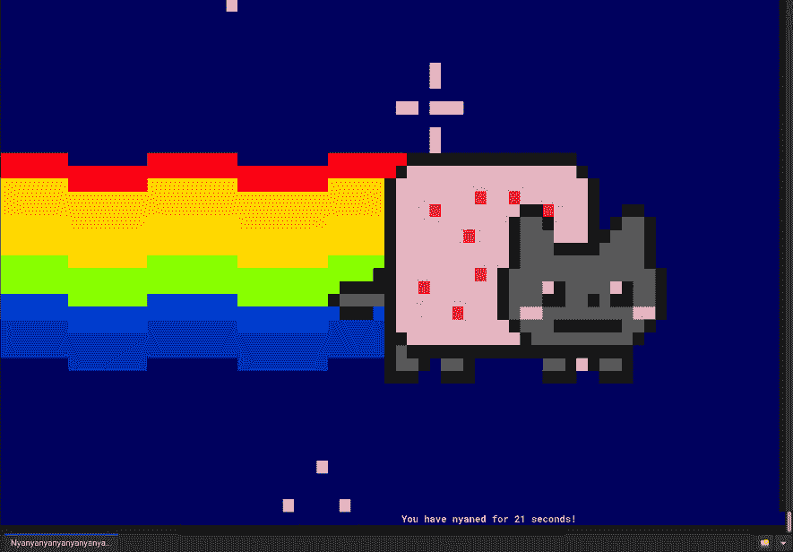
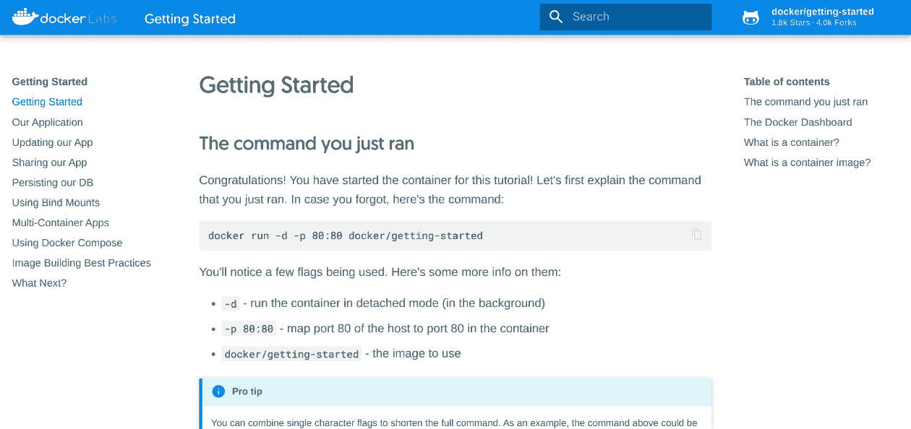
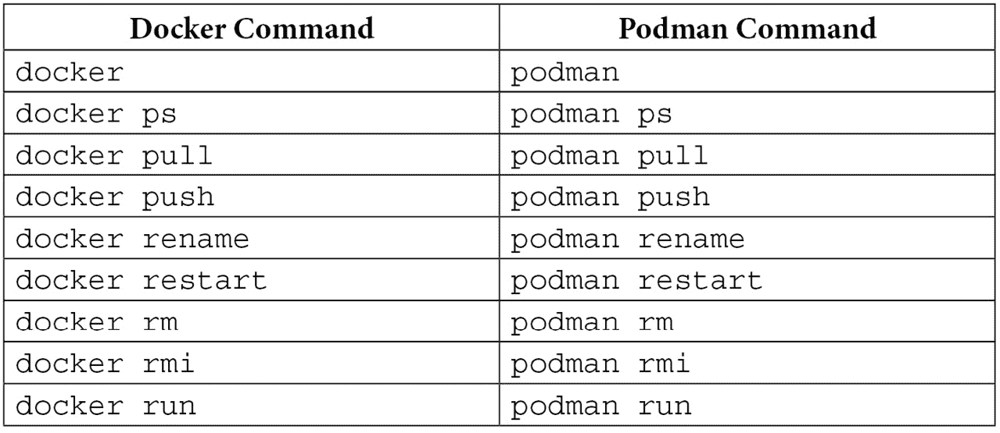
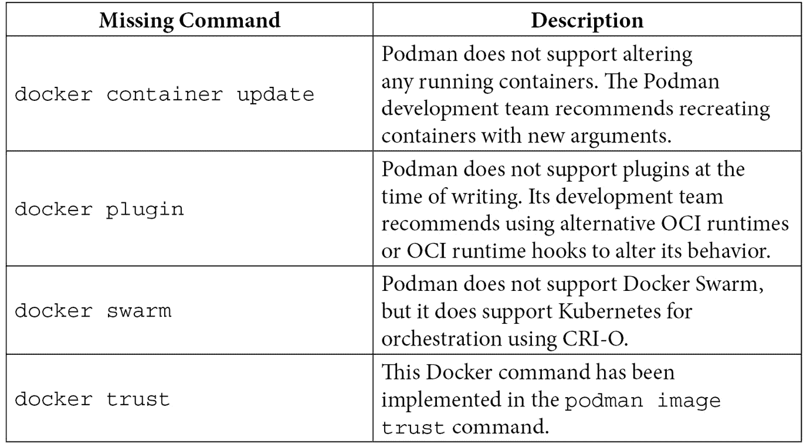

# *第十三章*：Docker 迁移技巧和窍门

每项技术都有一个开创性的公司、项目和产品，它一旦被创建并宣布，便成为了一个真正的变革者，使其基本概念得以传播。对于容器来说，这就是 Docker。

正如我们在*第一章*《容器技术简介》中所学到的，Docker 提供了一种新的方法和伟大的想法，利用现有技术并创造出全新的技术。几年后，它成为了最常用的容器技术。

但是，正如开源项目常见的情况一样，社区和企业开始寻找改进、全新的架构和不同的实现方式。正是在这里，Podman 找到了生长的空间，并利用了**开放容器倡议**（**OCI**）所提供的标准化。

Docker 曾是（并且仍然是）最常用的容器技术。因此，在本章中，我们将提供一些关于迁移过程的技巧和窍门。我们将涵盖以下主题：

+   迁移现有镜像并使用命令别名

+   Podman 命令与 Docker 命令的对比

+   使用 Docker Compose 与 Podman

# 技术要求

在继续阅读本章的讲解和示例之前，您需要一台安装了 Podman 的机器。正如我们在*第三章*《运行第一个容器》中提到的，书中的所有示例都在 Fedora 34 系统或更高版本上执行，但可以在您选择的**操作系统**（**OS**）上重现。

对于已经掌握了*第四章*《管理正在运行的容器》，*第五章*《实现容器数据存储》，以及*第九章*《推送镜像到容器注册表》中的内容，将帮助您理解本章将涉及的关于容器的概念。

# 迁移现有镜像并使用命令别名

Podman 有一个伟大的功能，可以让任何之前使用 Docker 的用户轻松适应并切换到它——与 Docker 的**命令行界面**（**CLI**）完全兼容。

让我们通过为`docker`命令创建一个命令别名，来演示这种与 Docker 的 CLI 兼容性：

```
# alias docker=podman
# docker
Error: missing command 'podman COMMAND'
Try 'podman --help' for more information.
```

如您所见，我们创建了一个命令别名，将`podman`命令绑定到`docker`命令上。如果在设置别名后尝试执行`docker`命令，返回的输出将来自`podman`命令。

让我们通过运行一个容器来尝试一下新创建的别名：

```
# docker run --rm -it docker.io/wernight/funbox nyancat
```

我们应该会看到一些非常有趣的东西——一个正在运行的猫，类似于以下截图所示：



图 13.1 – 运行测试容器时的有趣输出

让我们测试一些更有趣的内容。例如，Docker 提供了一个基于容器镜像暴露 Web 服务器的教程：

```
# docker run -dp 80:80 docker.io/docker/getting-started
Trying to pull docker.io/docker/getting-started:latest...
Getting image source signatures
Copying blob 97518928ae5f done  
Copying blob e0bae2ade5ec done  
Copying blob a2402c2da473 done  
Copying blob e362c27513c3 done  
Copying blob a4e156412037 done  
Copying blob 3f3577460f48 done  
Copying blob 69465e074227 done  
Copying blob eb65930377cd done  
Copying config 26d80cd96d done  
Writing manifest to image destination
Storing signatures
d44a2df41d76b3322e56971d45e92e75f4679e8b620198228fbd9 cc00fe9578f
```

在这里，我们继续使用带有通过守护进程运行选项`–d`和绑定 HTTP 端口选项`–p`的`docker`别名命令。

如果一切正常工作，我们可以将我们最喜欢的网页浏览器指向`http://localhost`：



图 13.2 – Docker 教程主页

Dockerlabs 的第一页，**开始使用**，指定了刚刚运行的命令。从页面的左列，我们可以继续进行教程。

让我们继续教程，并在每个阶段仔细检查别名是否正常工作。

教程步骤非常简单，能够帮助你总结上一章节所分享的知识，从构建容器到使用多个容器应用创建专用网络。请在**使用 Docker Compose**部分之前停下来，因为我们稍后会更详细地讨论这一部分内容。

别忘了，我们正在使用别名，而且在幕后，Podman 正在积极工作以确保我们的容器按预期运行，确保 Docker CLI 兼容性。

那么，在用 Podman 替代 Docker 的情况下，容器迁移如何处理呢？

目前，直接将现有容器从 Docker 迁移到 Podman 的方式并不存在。建议你使用相应的容器镜像重新创建容器，并使用 Podman 重新附加任何卷。

容器镜像可以使用`docker export`命令导出，该命令将创建一个 TAR 归档文件，可以通过`podman import`命令导入到 Podman 中。如果你正在使用容器镜像注册表，可以跳过此步骤。

为了了解在使用为 Docker 编写的命令、示例和资源时，可能遇到的限制，我们可以比较各种 Podman 和 Docker 命令。

# Podman 命令与 Docker 命令的对比

正如我们在上一部分所看到的，以及在*第二章*中提到的，*比较 Podman 与 Docker*，Podman CLI 基于 Docker CLI。然而，由于 Podman 不需要运行时守护进程，因此一些 Docker 命令可能无法直接使用，或者可能需要一些变通方法。

命令列表非常长，因此以下表格仅列出了一部分：



如你所见，命令的名称与将`docker`命令与`podman`命令进行比较时相同。然而，尽管名称相同，由于 Podman 和 Docker 在架构上的差异，一些特性或行为可能会有所不同。

## Podman 与 Docker 之间的行为差异

以下命令是 Podman 开发团队故意以另一种方式实现的：

+   `podman volume create`：如果卷已经存在，此命令将失败。在 Docker 中，此命令是幂等的，这意味着如果同名卷已经存在，Docker 会跳过此指令。Docker 的实际行为与其他命令的实现不一致。

+   `podman run -v /tmp/noexist:/tmp`：如果源卷路径不存在，此命令将失败。相反，Docker 会在路径不存在时创建该文件夹。Podman 开发团队认为这是一个 bug 并已进行了修复。

+   `podman run --restart`：Podman 中的重启选项在系统重启后不会持久化。如果需要，我们可以通过 `podman generate systemd` 从 `systemd.unit` 文件中运行 Podman。

在下一节中，我们将看到 Podman 中缺少的命令，它们在 Docker 中是存在的。

## Podman 中缺失的命令

下表展示了一些 Docker 命令的非全面列表，这些命令在撰写本文时在 Podman 中没有对应的命令：



现在，让我们看看 Docker 中缺少的命令。

## Docker 中缺失的命令

类似于 Podman 缺少一些 Docker 命令，Docker 也缺少一些 Podman 命令。

Podman 中以下命令类别在 Docker 中没有对应命令：

+   `podman container`：此命令可用于管理容器。

+   `podman generate`：此命令可用于为容器、pod 或卷生成结构化输出（例如 YAML 文件）。

+   `podman healthcheck`：此命令提供了一组子命令，您可以使用它们来管理容器健康检查。

+   `podman image`：此命令可用于管理容器镜像。

+   `podman init`：此命令可用于初始化容器，完成所有必要的步骤，但不启动容器。

+   `podman machine`：此命令列出一组子命令，用于管理 macOS 上 Podman 的虚拟机。

+   `podman mount`：此命令将容器的根文件系统挂载到主机可以访问的某个位置。

+   `podman network exists/prune/reload`：此命令检查并管理容器网络的状态。

+   `podman play`：此命令根据结构化文件（例如 YAML 文件）输入创建容器、pod 或卷。

+   `podman pod`：此命令提供了一组子命令，用于管理 pod 或容器组。

+   `podman system`：此命令提供了一组子命令，用于管理 Podman 系统并检索信息。

+   `podman unmount`：此命令卸载工作容器的根文件系统。

+   `podman unshare`：此命令将在新的用户命名空间中启动进程（无根容器）。

+   `podman untag`：此命令用于移除一个或多个存储的镜像。

+   `podman volume exists`：此命令检查卷是否存在。

当然，如果缺少某个命令，这并不意味着 Docker 中缺少该功能。

Docker 中另一个有用的功能是 Compose。我们将在下一节中学习如何在 Podman 中使用它。

# 使用 Docker Compose 与 Podman

Docker 首次发布时，由于其直观的容器管理方式，迅速获得了共识。除了主要的容器引擎解决方案外，还引入了另一个伟大的功能，帮助用户在单一主机上编排多个容器：**Docker Compose**。

Compose 的理念非常简单——它是一个用于编排多容器应用程序的工具，这些应用程序应该在单一主机上相互交互，并使用 YAML 格式的声明性文件进行配置。所有在 Compose 堆栈中执行的应用程序都定义为服务，这些服务可以通过透明的名称解析与堆栈中的其他容器进行通信。

配置文件名为 `docker-compose.yaml`，其语法简单，可以创建和启动一个或多个 **服务** 和相关的 **卷**。

开发团队可以利用该技术栈的自动化功能，在单一主机上快速测试应用程序。然而，如果我们需要在类似生产的多节点环境中运行应用程序，最佳做法是采用集群编排解决方案，如 Kubernetes。

当 Podman 首次发布时，其主要目的是实现 OCI 完全兼容性，并与 Docker CLI 命令达到功能对等，以成为一个无守护进程的有效替代方案，代替了它所启发的著名容器引擎。不幸的是，最初的两个主要版本并不支持该 Compose 兼容性。随后，`podman-compose` 项目被引入以弥补这一空白。该项目是一个独立的开发流，需要弥补 Podman 中缺乏原生 Compose 支持的问题。

在 Podman v3.0 中，终于引入了对 Docker Compose 的原生支持，使用户可以选择使用原始的 `docker-compose` 工具或新的 `podman-compose` 工具。

在本节中，我们学习了如何配置 Podman 使用 `docker-compose` 来编排多个容器，从而为从 Docker 迁移到 Podman 的用户提供完全兼容性。在下一小节中，我们将看一个使用 `podman-compose` 来实现无根容器编排的示例。

在深入了解如何设置 Podman 之前，让我们先看几个 Compose 文件的基本示例，以帮助理解它们是如何工作的。

## Docker Compose 快速入门

Compose 文件可用于声明一个或多个在公共堆栈中执行的容器，还可定义自定义应用程序的构建指令。这种方法的优势在于，您可以完全自动化整个应用程序堆栈，包括前端、后端以及持久性服务（如数据库或内存缓存）。

重要提示

本节的目的是快速概述 Compose 文件，帮助您理解 Podman 如何处理它们。

要查看最新的 Compose 规范详细列表，请参考以下 URL：[`docs.docker.com/compose/compose-file/compose-file-v3/`](https://docs.docker.com/compose/compose-file/compose-file-v3/)。

更多的 Compose 示例可以在 Docker Awesome Compose 项目中找到，网址为[`github.com/docker/awesome-compose`](https://github.com/docker/awesome-compose)。

以下是一个最小配置文件，定义了一个运行 Docker 注册表的单一容器：

Chapter13/registry/docker-compose.yaml

```
services:
  registry:
    ports:
      - "5000:5000"
    volumes:
      - registry_volume:/var/lib/registry
    image: docker.io/library/registry
volumes:
  registry_volume: {}
```

上面的例子可以看作是定义容器执行参数的一种更加结构化和声明化的方式。然而，Docker Compose 的真正价值在于其编排堆栈，这些堆栈由单个实例中的多个容器组成。

以下示例更加有趣，展示了一个 WordPress 应用的配置文件，该应用使用 MySQL 数据库作为后端：

Chapter13/wordpress/docker-compose.yaml

```
services:
  db:
    image: docker.io/library/mysql:latest
    command: '--default-authentication-plugin=mysql_native_password'
    volumes:
      - db_data:/var/lib/mysql
    restart: always
    environment:
      - MYSQL_ROOT_PASSWORD=wordpressroot
      - MYSQL_DATABASE=wordpress
      - MYSQL_USER=wordpress
      - MYSQL_PASSWORD=wordpress
    expose:
      - 3306
      - 33060
  wordpress:
    image: docker.io/library/wordpress:latest
    ports:
      - 8080:80
    restart: always
    environment:
      - WORDPRESS_DB_HOST=db
      - WORDPRESS_DB_USER=wordpress
      - WORDPRESS_DB_PASSWORD=wordpress
      - WORDPRESS_DB_NAME=wordpress
volumes:
  db_data:
```

在这里，我们可以看到两个主要的 YAML 对象——`services`和`volumes`。在`services`部分的代码中，我们有两个应用——`db`和`wordpress`。这些已被突出显示以便清晰展示。

在`services`列表中，有一组配置值定义了容器的行为。具体如下：

+   `image`：容器使用的镜像。

+   `command`：传递给容器入口点的附加命令。

+   `Volumes`：要挂载到容器中的卷列表，以及它们的相关挂载点。除了新的专用卷外，主机中的现有目录还可以绑定挂载到容器的挂载点上。

+   `restart`：在发生错误时的容器重启选项。

+   `expose`：容器要暴露的端口列表。

+   `ports`：容器和主机之间的端口映射列表。

+   `environment`：要在容器中创建的环境变量列表。在这个例子中，`WORDPRESS_DB_HOST`、`WORDPRESS_DB_USER`、`WORDPRESS_DB_PASSWORD`、`WORDPRESS_DB_NAME`被注入到 WordPress 容器中，以提供连接数据库的参数。

与服务声明一起，我们有一个由 Compose 管理的卷列表。引擎可以在 Compose 过程中创建这些卷，或使用已标记为`external`的现有卷。

第三个也是最后一个例子是一个 Compose 文件，它构建了一个最小的 REST API 应用，该应用是用 Go 语言编写的，能够将数据写入并从 Redis 内存存储中检索数据：

Chapter13/golang-redis/docker-compose.yaml

```
services:
  web:
    build: 
      context: ./app
      labels: 
        - "com.example.description=Golang Redis App"
    ports: 
      - "8080:8080"
    environment:
      - REDIS_HOST=redis
    depends_on:
      - redis
  redis:
    image: docker.io/library/redis
    deploy:
      replicas: 1
```

在这个例子中，我们有一些值得注意的新元素：

+   一个`build`对象，定义了要构建的镜像，并且还应用了自定义标签到构建中。

+   `context`键包含构建的路径。在这个例子中，`./app`文件夹包含所有源代码文件和用于构建镜像的 Dockerfile。

+   一个`labels`列表，包含一组在构建过程中传递的标签，这些标签作为字符串传递。

+   一个`depends_on`列表，指定了对于 Web 服务，其他被视为依赖的服务；在这种情况下是`redis`服务。

+   一个`environment`列表，定义了 Web 应用程序使用的`redis`服务名称。

+   `redis`服务中的`deploy`对象，允许我们定义自定义配置参数，例如容器`replicas`的数量。

要使用 Docker 启动 Compose 应用程序，可以在`compose`文件所在的文件夹中运行以下命令：

```
$ docker-compose up
```

该命令会创建所有堆栈和相关的卷，并将输出打印到`stdout`。

若要以分离模式运行，只需在命令中添加`-d`选项：

```
$ docker-compose up -d
```

以下命令构建必要的镜像并启动堆栈：

```
$ docker-compose up --build
```

或者，可以使用`docker-compose build`命令构建应用程序，而不启动它们。

要关闭前台运行的堆栈，只需按下*Ctrl* + *C*键盘组合。而要关闭分离模式下的应用程序，请运行以下命令：

```
$ docker-compose down
```

若要杀死一个无响应的容器，我们可以使用`docker-compose kill`命令：

```
$ docker-compose kill [SERVICE]
```

该命令支持通过`-s SIGNAL`选项传递多个信号。

现在我们已经覆盖了有关 Docker Compose 的基本概念，接下来让我们学习如何配置 Podman 以运行 Compose 文件。

## 配置 Podman 与 docker-compose 的交互

为了支持 Compose，Podman 需要通过本地 UNIX 套接字暴露其 REST API 服务。该服务支持 Docker 兼容的 API 和本地 Libpod API。

在 Fedora 发行版上，必须使用以下命令安装`docker-compose`（提供 Docker Compose 二进制文件）和`podman-docker`（为`docker`命令提供别名）软件包：

```
$ sudo dnf install docker-compose podman-docker
```

重要提示

`docker-compose`软件包在 Fedora 34 系统上安装时，安装的是 v1.28 版本（截至本文编写时），该版本是用 Python 编写的。最新版本 v2 完全用 Go 重写，并提供了显著的性能提升。它可以从 GitHub 发布页面下载：[`github.com/docker/compose/releases`](https://github.com/docker/compose/releases)。

安装完软件包后，我们可以启用并启动管理 UNIX 套接字服务的`systemd`单元：

```
$ sudo systemctl enable --now podman.socket
```

该命令启动一个监听`/run/podman/podman.sock`的套接字。

请注意，本地`docker-compose`命令默认会在`/run/docker.sock`路径下查找套接字文件。为此，`podman-docker`软件包会在该路径上创建一个符号链接，指向`/run/podman/podman.sock`，如下所示：

```
# ls -al /run/docker.sock
lrwxrwxrwx. 1 root root 23 Feb  3 21:54 /var/run/docker.sock -> /run/podman/podman.sock
```

Podman 暴露的 UNIX 套接字只能由具有 root 权限的进程访问。通过为系统中的所有用户打开文件访问权限或为自定义组允许自定义 ACLs，可以放宽安全限制。本章稍后将介绍如何使用`podman-compose`执行无 root 容器堆栈。

为了简便起见，在下一小节中，您将学习如何在 rootfull 模式下使用 Podman 运行`docker-compose`命令。

## 使用 Podman 和 docker-compose 运行 Compose 工作负载

为了帮助你学习如何操作 `docker-compose` 并在我们的主机上创建编排的多容器部署，我们将重用之前的 Go REST API 和 Redis 内存存储的示例。

我们已经检查了 `docker-compose.yaml` 文件，该文件构建了 Web 应用程序并部署了一个 Redis 容器实例。

让我们检查用于构建应用程序的 Dockerfile：

Chapter13/golang-redis/Dockerfile

```
FROM docker.io/library/golang AS builder
# Copy files for build
RUN mkdir -p /go/src/golang-redis
COPY go.mod main.go /go/src/golang-redis
# Set the working directory
WORKDIR /go/src/golang-redis
# Download dependencies
RUN go get -d -v ./...
# Install the package
RUN go build -v 
# Runtime image
FROM registry.access.redhat.com/ubi8/ubi-minimal:latest as bin
COPY --from=builder /go/src/golang-redis/golang-redis /usr/local/bin
COPY entrypoint.sh /
EXPOSE 8080
ENTRYPOINT ["/entrypoint.sh"]
```

在这里，我们可以看到 Go 应用程序在多阶段构建中被编译，并且 Go 二进制文件被复制到一个 UBI-Minimal 镜像中。

Web 前端是简化版的 – 它监听 `8080`/`tcp` 端口，并且仅实现了两个端点 – 一个 `HTTP POST` 方法和一个 `HTTP GET` 方法，用于允许客户端上传和检索包含用户姓名、电子邮件和 ID 的 JSON 对象。该 JSON 对象存储在 Redis 数据库中。

重要提示

如果你感兴趣，Go 服务器的源代码可以在 `Chapter13/golang-redis/app/main.go` 文件中找到。由于篇幅和可读性的原因，这本书中并没有展示。

要构建并运行应用程序，我们必须切换到项目目录并运行 `docker-compose up` 命令：

```
# cd Chapter13/golang-redis 
# docker-compose up --build -d
[...omitted output...]
Successfully tagged localhost/golang-redis_web:latest
6b330224010ed611baba11fc2d66b9e4cfc991312f5166b47b5fcd073 57c6325
Successfully built 6b330224010ed611baba11fc2d66b9e4cfc991312f5166b47b5fcd073 57c6325
Creating golang-redis_redis_1 ... done
Creating golang-redis_web_1   ... done
```

在这里，我们可以看到 `docker-compose` 创建了两个容器，它们的名称始终遵循 `<project_name>_<service_name>_<instance_count>` 的模式。

当服务部署中有多个副本时，实例数量会有所不同。

我们可以使用常规的 `podman ps` 命令检查正在运行的容器：

```
# podman ps 
CONTAINER ID  IMAGE                              COMMAND       CREATED         STATUS             PORTS                   NAMES
4a5421c9e7cd  docker.io/library/redis:latest     redis-server  20 seconds ago  Up 20 seconds ago                          golang-redis_redis_1
8a465d4724ab  localhost/golang-redis_web:latest                20 seconds ago  Up 20 seconds ago  0.0.0.0:8080->8080/tcp  golang-redis_web_1
```

更有趣的一点是，服务名称会自动被解析。

当创建 Compose 堆栈时，Podman 会创建一个新的网络，名称遵循 `<project_name>_default` 模式。

新的网络使用 `dnsname` 插件实例化一个 `dnsmasq` 进程，并将容器的 IP 地址解析为在服务名称之后创建的名称。

我们可以使用以下命令检查网络：

```
# podman network ls | grep golang-redis
49d5a3c3679c  golang-redis_default    0.4.0       bridge,portmap,firewall,tuning,dnsname
```

可以使用 `ps` 命令并通过 `grep` 过滤来找到 `dnsmasq` 服务：

```
# ps aux | grep dnsmasq | grep golang
root     2749495  0.0  0.0  26388  2416 ?        S    01:33   0:00 /usr/sbin/dnsmasq -u root --conf-file=/run/containers/cni/dnsname/golang-redis_default/dnsmasq.conf
```

`/run/containers/cni/dnsname/golang-redis_default` 目录保存了实例的配置。在 `addnhosts` 文件中，我们可以找到服务名称与分配的容器 IP 地址之间的映射：

```
# cat /run/containers/cni/dnsname/golang-redis_default/addnhosts
10.89.3.240     golang-redis_redis_1   4a5421c9e7cd   redis
10.89.3.241         golang-redis_web_1    4298ae9f29c5      web
```

这意味着容器内的进程可以通过标准的 DNS 查询解析服务名称。

当服务中有多个容器副本时，`dnsmasq` 提供的解析结果类似于 `db` 服务（例如），它将解析为与服务副本数量相同的不同 IP 地址。

让我们回到 `docker-compose.yaml` 文件。在 `web` 服务配置的环境部分，我们有以下变量：

```
    environment:
      - REDIS_HOST=redis
```

该变量被注入到正在运行的容器中，表示 `redis` 服务的名称。Go 应用程序使用它来创建连接字符串并初始化连接。当我们使用 DNS 解析的服务名称时，`redis` 服务的容器名称和 IP 地址对 Go 应用程序完全无关。

我们可以使用 `docker-compose exec` 命令来验证该变量是否正确注入到作为 `web` 服务运行的容器中：

```
# docker-compose exec web env
Emulate Docker CLI using podman. Create /etc/containers/nodocker to quiet msg.
PATH=/usr/local/sbin:/usr/local/bin:/usr/sbin:/usr/bin:/sbin:/bin
TERM=xterm
container=oci
REDIS_HOST=redis
HOME=/root
```

`env` 命令输出容器中所有环境变量的完整列表。这样我们可以验证 `REDIS_HOST` 变量是否已正确创建。

重要提示

将连接字符串等配置存储为数据库中的常量并直接嵌入应用程序代码中是一个反模式，特别是对于现代云原生应用程序。正确的方法是确保应用程序逻辑与配置参数之间有严格的分离。

配置可以存储为环境变量或在运行时注入到运行应用程序的容器中的 config/secret 文件。

这些实践在 **十二因素应用** 模式规范中有明确定义，其 URL 可以在 *进一步阅读* 部分找到。

最后，我们可以通过发布几个 JSON 对象并使用 `curl` 命令检索其中一个来测试应用程序：

```
$ curl -X POST -d \
'{"name":"jim", "email":"jim@example.com", "id":"0001"}' \
localhost:8080
$ curl -X POST -d \
'{"name":"anna", "email":"anna@example.com", "id":"0002"}' \
localhost:8080
```

Web 容器成功写入 Redis 后端，我们可以通过运行 `docker-compose logs` 命令来查看这一点：

```
# docker-compose logs web
[...omitted output...]
2022/02/06 00:58:06 Storing data:  {"name":"jim","email":"jim@example.com","id":"0001"}
2022/02/06 00:58:10 Storing data:  {"name":"anna","email":"anna@example.com","id":"0002"}
```

上述命令捕获所有 `web` 服务后面的容器的日志。

最后，我们可以检索结果。Web 应用程序通过查看其 `id` 从 Redis 数据库中读取该对象：

```
$ curl -X GET -d '{"id": "0001"}' localhost:8080  
{"name":"jim","email":"jim@example.com","id":"0001"}
```

要关闭我们的应用程序，我们只需使用 `docker-compose down` 命令：

```
# docker-compose down
```

此命令销毁容器及其关联的资源，包括自定义网络，但不包括卷。要删除卷，必须在命令末尾添加 `-v` 选项。

`docker-compose` 工具是一个非常适合在单个主机上与 Podman 一起构建和部署的好伙伴。然而，在下一章中，我们将学习一些其他有用的解决方案，这些解决方案将帮助我们生成并执行 Kubernetes Pod 和 Service 资源，以及由 Systemd 单元执行的容器。在继续之前，让我们先了解一下替代工具 `podman-compose`，它支持无根容器。

## 使用 podman-compose

`podman-compose` 项目在 Podman 3.0 版本之前就开始了，旨在为需要使用 Compose 文件编排容器的用户提供兼容层。在这一小节中，我们将查看在 Fedora 上使用 `podman-compose` 的示例。

`podman-compose` 工具的 CLI 是用 Python 编写的。可以通过 `dnf` 安装该软件包，或者从相应的 GitHub 仓库获取最新版本（你可以在 *进一步阅读* 部分找到直接链接）：

```
$ sudo dnf install -y podman-compose
```

或者，可以使用 Python 的包管理器`pip3`进行安装，它支持更广泛的操作系统和发行版：

```
$ pip3 install podman-compose
```

现在，我们可以通过`podman-compose`提供的无根权限方法运行与前面示例中相同的 Compose 堆栈。

以下是与`docker-compose`兼容的所有可用命令，以及它们的描述和由`podman-compose help`命令输出所做的一些较小更改：

+   `help`: 显示工具的帮助

+   `version`: 显示命令的版本

+   `pull`: 拉取堆栈镜像

+   `push`: 推送堆栈镜像

+   `build`: 构建堆栈镜像

+   `up`: 创建并启动整个堆栈或其中的一些服务

+   `down`: 拆除整个堆栈

+   `ps`: 显示运行容器的状态

+   `run`: 创建类似服务的容器，以运行一次性命令

+   `exec`: 在运行的容器中执行特定命令

+   `start`: 启动特定服务

+   `stop`: 停止特定服务

+   `restart`: 重启特定服务

+   `logs`: 显示服务的日志

以下命令从包含必要配置和`docker-compose.yaml`文件的目录创建堆栈：

```
$ podman-compose up
```

该命令的输出也与`docker-compose`提供的输出非常相似。

要关闭堆栈，只需运行以下命令：

```
$ podman-compose down
```

`podman-compose`项目仍未完全达到与`docker-compose`的功能对等。但是，这是一个非常有趣的项目，可以在未来独立演变以帮助实现一个支持 Podman 本地的实用程序。

# 总结

在本章中，我们学习了如何管理从 Docker 到 Podman 的完整迁移。

我们介绍了如何迁移镜像并创建命令别名，并检查了命令兼容性矩阵。在此，我们详细介绍了两种容器引擎（即 Docker 和 Podman）中特定命令的不同行为和不同的实现命令。

然后，我们通过说明原生 Podman 3.0 对`docker-compose`命令的支持以及`podman-compose`备选实用工具，学习了如何迁移 Docker Compose。

在本书的下一章，我们将学习如何通过生成自定义服务单元与 Systemd 进行交互，并将容器转换为在主机内自动启动的服务。然后，我们将探讨面向 Kubernetes 的编排，学习如何从运行的容器和 Pod 生成 Kubernetes 资源并在 Podman 或 Kubernetes 中运行它们。

# 进一步阅读

要了解本章涵盖的主题的更多信息，请查看以下资源：

+   Docker Awesome Compose：[`github.com/docker/awesome-compose`](https://github.com/docker/awesome-compose)

+   Podman-compose 项目 GitHub 链接：[`github.com/containers/podman-compose`](https://github.com/containers/podman-compose)

+   Red Hat 博客介绍 Podman 中对 Docker Compose 的支持： [`www.redhat.com/sysadmin/podman-docker-compose`](https://www.redhat.com/sysadmin/podman-docker-compose)

+   十二因素应用： [`12factor.net/`](https://12factor.net/)

+   Podman 手册页： [`github.com/containers/podman/blob/main/docs/source/markdown/podman.1.md`](https://github.com/containers/podman/blob/main/docs/source/markdown/podman.1.md)
