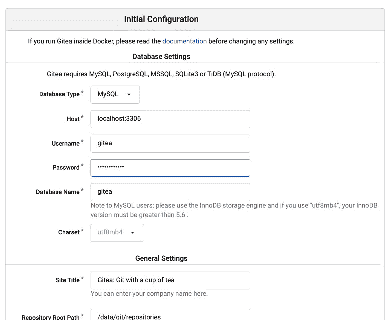
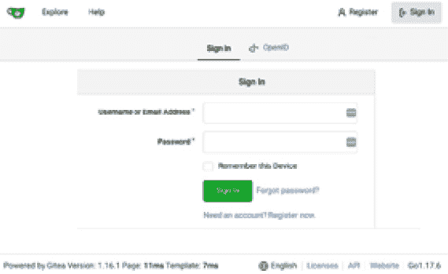
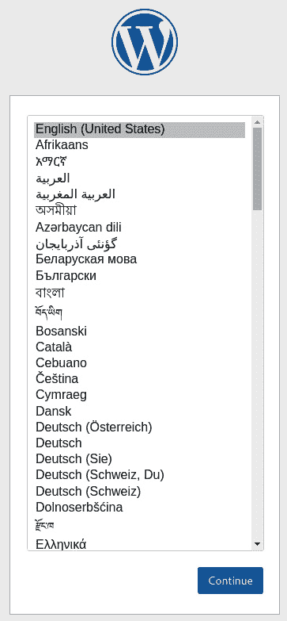

# *第十四章*：与 systemd 和 Kubernetes 交互

在之前的章节中，我们学习了如何初始化和管理容器，从简单的概念开始，逐步深入到更高级的内容。容器代表了最新 Linux 操作系统版本中应用开发的关键技术。因此，容器只是高级开发人员和系统管理员的起点。一旦这项技术在企业公司或技术项目中得到广泛应用，下一步将是将其与基础操作系统和系统编排平台进行集成。

在本章中，我们将涵盖以下主要内容：

+   设置主机操作系统的先决条件

+   创建 systemd 单元文件

+   管理基于容器的 systemd 服务

+   生成 Kubernetes YAML 资源

+   在 Podman 中运行 Kubernetes 资源文件

+   在 Kubernetes 中测试结果

# 技术要求

要完成本章，您需要一台已安装并正常运行 Podman 的机器。正如我们在*第三章*《运行第一个容器》中提到的，本书中的所有示例都是在 Fedora 34 或更高版本的系统上执行的，但可以在您选择的**操作系统**（**OS**）上复现。

对*第四章*《管理正在运行的容器》、*第五章*《为容器数据实现存储》以及*第九章*《推送镜像到容器注册表》中的内容有充分的理解，将有助于您掌握我们将在高级容器部分中讨论的内容。

您还应该对系统管理和 Kubernetes 容器编排有较好的理解。

对于与 Kubernetes 部分相关的示例，您需要 Podman 版本 4.0.0，因为版本 3.4.z 存在一个错误，该错误会阻止容器环境变量的创建（[`github.com/containers/podman/issues/12781`](https://github.com/containers/podman/issues/12781)）。这个错误在 v4.0.0 中已被修复，但在撰写本文时并未回溯到 Podman v3。

# 设置主机操作系统的先决条件

正如我们在*第一章*《容器技术简介》中看到的，容器诞生的初衷是帮助简化并创建可以在独立主机上分发的系统服务。

在接下来的章节中，我们将学习如何在容器中运行 MariaDB 和 GIT 服务，并像管理其他服务一样管理这些容器——也就是通过 Systemd 和 `systemctl` 命令。

首先，让我们介绍一下 systemd，它是 Linux 的系统和服务管理器，在启动时作为第一个进程运行（作为 PID 1），并充当 init 系统，启动和维护用户空间服务。一旦新的用户登录到主机系统，便会执行单独的实例以启动他们的服务。

systemd 守护进程启动服务，并通过一个名为*单元*的依赖系统来确保各个实体之间的优先级。共有 11 种不同类型的单元。

Fedora 34 及更高版本默认启用了并运行 systemd。我们可以使用以下命令检查它是否正常运行：

```
# systemctl is-system-running
running
```

在接下来的章节中，我们将处理`service`类型的系统单元文件。我们可以通过运行以下命令检查当前的单元文件：

```
# systemctl list-units --type=service | head
  UNIT                      LOAD   ACTIVE SUB     DESCRIPTION
  abrt-journal-core.service  loaded active running Creates ABRT problems from coredumpctl messages
  abrt-oops.service  loaded active running ABRT kernel log watcher
  abrt-xorg.service  loaded active running ABRT Xorg log watcher
  abrtd.service  loaded active running ABRT Automated Bug Reporting Tool
```

请注意

systemd 服务及其内部结构更为复杂，因此无法用几行总结。有关更多信息，请参阅相关的 Linux 手册。

在下一节中，我们将学习如何为操作系统上任何运行中的容器服务创建 systemd 单元文件。

# 创建 systemd 单元文件

我们系统上的单元文件定义了 systemd 如何启动和运行服务。

每个单元文件表示一个单独的组件，它是一个简单的文本文件，描述了其行为、需要先后运行的内容等。

单元文件存储在系统中的几个不同位置，systemd 按照以下顺序查找它们：

1.  `/etc/systemd/system`

1.  `/run/systemd/system`

1.  `/usr/lib/systemd/system`

位于较早目录中的单元文件会覆盖后面的单元文件。这使得我们可以在`/etc`目录中修改所需的配置文件，而将默认的配置文件保留在`/usr`目录中，例如。

但单元文件是什么样的呢？让我们来看看。

首先，我们可以通过询问 systemd 来获取默认单元文件的位置：

```
# systemctl status sshd
○ sshd.service - OpenSSH server daemon
     Loaded: loaded (/usr/lib/systemd/system/sshd.service; disabled; vendor preset: disabled)
     Active: inactive (dead)
       Docs: man:sshd(8)
             man:sshd_config(5)
```

在这里，我们执行了`status`命令，并传入`sshd`服务名称作为过滤条件。

在 systemd 的输出中，默认的单元文件路径可以通过以下示例命令来检查：

```
# cat /usr/lib/systemd/system/sshd.service
```

那 Podman 呢？实际上，Podman 通过其专用子命令使 systemd 集成更加简单：

```
# podman generate systemd -h
Generate systemd units.
Description:
  Generate systemd units for a pod or container.
  The generated units can later be controlled via systemctl(1).
Usage:
  podman generate systemd [options] {CONTAINER|POD}
...
```

`podman generate systemd`命令会输出一个文本文件，表示创建的单元文件。从帮助输出中我们可以看到，我们可以设置多个选项来调整设置。

我们应该始终保存生成的文件，并将其放在正确的路径上，如前面的输出中所描述的那样。我们将在下一节通过提供完整示例来进一步探索这个命令。

# 管理基于容器的 systemd 服务

在本节中，你将通过一个实际的例子学习如何使用`podman generate systemd`命令。我们将创建基于容器的两个系统服务来创建一个 GIT 仓库。

在这个例子中，我们将利用两个知名的开源项目：

+   **Gitea**：一个 GIT 仓库，还提供了一个漂亮的网页界面用于代码管理

+   **MariaDB**：SQL 数据库，用于存储 Gitea 服务生成的数据

让我们从例子开始。首先，我们需要为数据库用户生成一个密码：

```
# export MARIADB_PASSWORD=my-secret-pw
# podman secret create --env MARIADB_PASSWORD
53149b678d0dbd34fb56800cc
```

在这里，我们导出了包含秘密密码的环境变量，然后使用了一个我们之前没有介绍的有用的秘密管理命令：`podman secret create`。不幸的是，该命令以纯文本存储秘密，但对于我们的目的来说已经足够好。由于我们以 root 身份运行这些容器，这些秘密将以 root-only 权限存储在文件系统中。

我们可以使用以下命令检查秘密：

```
# podman secret ls
ID                         NAME              DRIVER      CREATED       UPDATED       
53149b678d0dbd34fb56800cc  MARIADB_PASSWORD  file        10 hours ago  10 hours ago  
# podman secret inspect 53149b678d0dbd34fb56800cc
[
    {
        "ID": "53149b678d0dbd34fb56800cc",
        "CreatedAt": "2022-02-16T00:54:21.01087091+01:00",
        "UpdatedAt": "2022-02-16T00:54:21.01087091+01:00",
        "Spec": {
            "Name": "MARIADB_PASSWORD",
            "Driver": {
                "Name": "file",
                "Options": {
                    "path": "/var/lib/containers/storage/secrets/filedriver"
                }
            }
        }
    }
]
# cat /var/lib/containers/storage/secrets/filedriver/secretsdata.json 
{
  "53149b678d0dbd34fb56800cc": "bXktc2VjcmV0LXB3"
}
# ls -l /var/lib/containers/storage/secrets/filedriver/secretsdata.json 
-rw-------. 1 root root 53 16 feb 00.54 /var/lib/containers/storage/secrets/filedriver/secretsdata.json
```

在这里，我们要求 Podman 列出并检查我们之前创建的秘密，并查看包含秘密的底层文件系统。

存储秘密的文件是 JSON 格式的文件，正如我们之前提到的，它是纯文本文件。该对字符串的第一个是秘密 ID，第二个字符串是 Base64 编码的值。如果我们尝试用`BASE64`算法解码，我们会看到它代表了我们刚刚添加的密码——即`my-secret-pw`。

尽管密码是以纯文本存储的，但对于我们的示例来说足够好，因为我们正在使用 root 用户，而该文件存储只有 root 权限，正如我们从之前输出的最后一个命令中可以验证的那样。

现在，我们可以继续设置数据库容器。我们将从数据库设置开始，因为它是我们 GIT 服务器的依赖项。

我们必须在主机系统上创建一个本地文件夹，用于存储容器数据：

```
# mkdir -p /opt/var/lib/mariadb
```

我们还可以查看容器镜像的公共文档，找出正确的卷路径和启动容器时使用的各种环境变量：

```
# podman run -d --network host --name mariadb-service –v \
 /opt/var/lib/mariadb:/var/lib/mysql:Z –e \
 MARIADB_DATABASE=gitea -e MARIADB_USER=gitea –e \
 MARIADB_RANDOM_ROOT_PASSWORD=true \
--secret=MARIADB_PASSWORD,type=env docker.io/mariadb:latest
61ae055ef6512cb34c4b3fe1d8feafe6ec174a25547728873932f0649217 62d1
```

我们首先将容器作为独立实例运行并进行测试，以检查是否存在任何错误；然后，我们将其转变为系统服务。

在前面的 Podman 命令中，我们执行了以下操作：

+   我们以分离模式运行了容器。

+   我们为其指定了一个名称——即`mariadb-service`。

+   为了简化操作，我们暴露了主机网络；当然，我们也可以限制和过滤此连接。

+   我们将存储卷映射到新创建的本地目录，同时指定了`:Z`选项，以正确分配 SELinux 标签。

+   我们定义了容器进程在运行时使用的环境变量，并通过`--secret`选项提供了密码的秘密。

+   我们使用了我们想要使用的容器镜像名称——即`docker.io/mariadb:latest`。

我们还可以通过以下命令检查容器是否正在运行：

```
# podman ps
CONTAINER ID  IMAGE                             COMMAND     CREATED         STATUS             PORTS       NAMES
61ae055ef651  docker.io/library/mariadb:latest  mariadbd    56 seconds ago  Up 57 seconds ago              mariadb-service
```

现在，我们准备检查`podman generate systemd`命令的输出：

```
# podman generate systemd --name mariadb-service
...
[Unit]
Description=Podman container-mariadb-service.service
Documentation=man:podman-generate-systemd(1)
Wants=network-online.target
After=network-online.target
RequiresMountsFor=/run/containers/storage
[Service]
Environment=PODMAN_SYSTEMD_UNIT=%n
Restart=on-failure
TimeoutStopSec=70
ExecStart=/usr/bin/podman start mariadb-service
ExecStop=/usr/bin/podman stop -t 10 mariadb-service
ExecStopPost=/usr/bin/podman stop -t 10 mariadb-service
PIDFile=/run/containers/storage/overlay-containers/61ae055ef6512cb34c4b3fe1d8feafe6ec174a25547728873932f064921762d1/userdata/conmon.pid
Type=forking
[Install]
WantedBy=default.target
```

如你所见，输出已直接显示在控制台中。这里，我们使用了`--name`选项，指示 Podman 通过 systemd 管理容器并使用该名称。

Podman 生成了一个包含所有所需命令指令的单元文件，用于将容器集成到操作系统中。

在`[Unit]`部分，我们可以看到它声明了该服务依赖于通过`network-online.target`单元连接的网络。它还声明了需要用于`/run/containers/storage`容器的存储挂载点。

在`[Service]`部分，Podman 定义了描述如何启动和停止容器化服务的所有指令。

现在，让我们看看 GIT 服务。首先，我们将创建存储目录：

```
# mkdir -p /opt/var/lib/gitea/data
```

之后，我们可以查看项目文档，了解构建 Gitea 容器镜像所需的任何配置，并完成`podman run`命令：

```
# podman run -d --network host --name gitea-service \
-v /opt/var/lib/gitea/data:/data:Z \
docker.io/gitea/gitea:latest
ee96f8276038f750ee3b956cbf9d3700fe46e6e2bae93605a67e623717e 206dd
```

在前面的 Podman 命令中，我们做了以下操作：

+   我们以分离模式运行了容器。

+   我们为其指定了一个名称——即`gitea-service`。

+   为了简化操作，我们暴露了主机网络；当然，我们也可以限制并过滤这种连接。

+   我们将存储卷映射到新创建的本地目录，并指定了`:Z`选项以正确分配 SELinux 标签。

最后，我们可以通过查看日志检查服务是否正常运行：

```
# podman logs gitea-service
Server listening on :: port 22.
Server listening on 0.0.0.0 port 22.
2022/02/16 00:01:55 cmd/web.go:102:runWeb() [I] Starting Gitea on PID: 12
...
2022/02/16 00:01:56 cmd/web.go:208:listen() [I] Listen: http://0.0.0.0:3000
2022/02/16 00:01:56 cmd/web.go:212:listen() [I] AppURL(ROOT_URL): http://localhost:3000/
2022/02/16 00:01:56 ...s/graceful/server.go:61:NewServer() [I] Starting new Web server: tcp:0.0.0.0:3000 on PID: 12
```

如我们所见，Gitea 服务正在`3000`端口上监听。让我们将网页浏览器指向`http://localhost:3000`，以使用所需的配置进行安装：



图 14.1 – Gitea 服务安装页面

在前面的截图中，我们定义了数据库的类型、地址、用户名和密码，以完成安装。完成后，我们应该会被重定向到登录页面，如下所示：



图 14.2 – Gitea 服务登录页面

配置完成后，我们可以生成并将 systemd 单元文件添加到正确的配置路径中：

```
# podman generate systemd --name gitea-service > /etc/systemd/system/container-gitea-service.service
# podman generate systemd --name mariadb-service > /etc/systemd/system/container-mariadb-service.service
```

然后，我们可以手动编辑 Gitea 服务单元文件，通过特殊的`Requires`指令将 MariaDB 服务的依赖顺序添加进去：

```
# cat /etc/systemd/system/container-gitea-service.service
...
[Unit]
Description=Podman container-gitea-service.service
Documentation=man:podman-generate-systemd(1)
Wants=network-online.target
After=network-online.target
RequiresMountsFor=/run/containers/storage
Requires=container-mariadb-service.service
...
```

由于`Requires`指令，systemd 会首先启动 MariaDB 服务，然后启动 Gitea 服务。

现在，我们可以通过启动 systemd 单元来停止容器：

```
# podman stop mariadb-service gitea-service
mariadb-service
gitea-service
```

不用担心数据——之前，我们已将两个容器映射到一个专用存储卷中，存放着数据。

我们需要让 systemd 守护进程知道我们刚刚添加的新单元文件。因此，首先，我们需要运行以下命令：

```
# systemctl daemon-reload
```

之后，我们可以通过 systemd 启动服务并检查其状态：

```
# systemctl start container-mariadb-service.service
# systemctl status container-mariadb-service.service
● container-mariadb-service.service - Podman container-mariadb-service.service
     Loaded: loaded (/etc/systemd/system/container-mariadb-service.service; disabled; vendor preset: disabled)
     Active: active (running) since Wed 2022-02-16 01:11:50 CET; 13s ago
...
# systemctl start container-gitea-service.service
# systemctl status container-gitea-service.service 
● container-gitea-service.service - Podman container-gitea-service.service
     Loaded: loaded (/etc/systemd/system/container-gitea-service.service; disabled; vendor preset: disabled)
     Active: active (running) since Wed 2022-02-16 01:11:57 CET; 18s ago
...
```

最后，我们可以启用该服务，使其在操作系统启动时自动启动：

```
# systemctl enable container-mariadb-service.service 
Created symlink /etc/systemd/system/default.target.wants/container-mariadb-service.service → /etc/systemd/system/container-mariadb-service.service.
# systemctl enable container-gitea-service.service 
Created symlink /etc/systemd/system/default.target.wants/container-gitea-service.service → /etc/systemd/system/container-gitea-service.service.
```

到此为止，我们已在主机操作系统上设置并启用了两个容器化的系统服务。这个过程简单，并且有助于利用容器的功能和特性，将其扩展到系统服务中。

现在，我们准备进入下一个高级主题，在那里我们将学习如何生成 Kubernetes 资源。

# 生成 Kubernetes YAML 资源

Kubernetes 已成为多节点容器协调的事实标准。Kubernetes 集群允许多个 pod 根据调度策略在节点间执行，这些策略反映了节点的负载、标签、能力或硬件资源（例如 GPU）。

我们已经描述了 pod 的概念 —— 它是一个或多个容器的执行组，这些容器共享公共命名空间（网络、IPC，以及可选的 PID 命名空间）。换句话说，我们可以把 pods 看作容器的沙箱。Pod 内的容器一起执行，因此它们的启动、停止或暂停是同时进行的。

Podman 引入的最有前景的功能之一是生成 YAML 格式的 Kubernetes 资源的能力。Podman 可以拦截正在运行的容器或 pod 的配置，并生成符合 Kubernetes API 规范的 `Pod` 资源。

除了 pods，我们还可以生成 `Service` 和 `PersistentVolumeClaim` 资源，它们反映了容器内挂载端口映射和卷的配置。

我们可以在 Podman 本身内部使用生成的 Kubernetes 资源，作为 Docker Compose 堆栈的替代品，或者将它们应用到 Kubernetes 集群中，来协调简单 Pods 的执行。

Kubernetes 有多种方式来协调工作负载的执行：`Deployments`、`StatefulSets`、`DaemonSets`、`Jobs` 和 `CronJobs`。在每种情况下，Pod 是它们最小的工作负载执行单元，协调逻辑根据特定的行为进行变化。这意味着我们可以轻松地将 Podman 生成的 Pod 资源，适配到一个更复杂的对象中进行协调，例如 `Deployments`，它管理应用程序的副本和版本更新，或 `DaemonSets`，它确保为每个集群节点创建一个单例的 pod 实例。

现在，让我们学习如何使用 Podman 生成 Kubernetes YAML 资源。

## 从正在运行的容器生成基本的 Pod 资源

从 Podman 生成 Kubernetes 资源的基本命令是 `podman generate kube`，后面跟随各种选项和参数，如以下代码所示：

```
$ podman generate kube [options] {CONTAINER|POD|VOLUME}
```

我们可以将此命令应用于正在运行的容器、Pod 或现有的卷。该命令还允许您使用 `-s, --service` 选项生成 `Service` 资源，使用 `-f, --filename` 将内容导出到文件（默认是标准输出）。

让我们从一个基本的例子开始，演示如何从一个正在运行的容器生成 `Pod` 资源。首先，我们将启动一个无 root 权限的 Nginx 容器：

```
$ podman run –d \
  -p 8080:80 --name nginx \
  docker.io/library/nginx
```

当容器创建时，我们可以生成我们的 Kubernetes `Pod` 资源：

```
$ podman generate kube nginx
# Save the output of this file and use kubectl create -f to import
# it into Kubernetes.
#
# Created with podman-4.0.0-rc4
apiVersion: v1
kind: Pod
metadata:
  creationTimestamp: "2022-02-10T23:14:25Z"
  labels:
    app: nginxpod
  name: nginx_pod
spec:
  containers:
  - args:
    - nginx
    - -g
    - daemon off;
    image: docker.io/library/nginx:latest
    name: nginx
    ports:
    - containerPort: 80
      hostPort: 8080
    securityContext:
      capabilities:
        drop:
        - CAP_MKNOD
        - CAP_NET_RAW
        - CAP_AUDIT_WRITE
```

让我们描述一下生成的输出。每个新的 Kubernetes 资源总是由至少四个字段组成：

+   `apiVersion`：此字段描述资源的 API 版本架构。`Pod` 对象属于 Kubernetes 的 `core` API 中的 `v1` 版本。

+   `kind`：此字段定义了资源类型，在我们的示例中是 `Pod`。

+   `metadata`：此字段是一个对象，包含一组资源元数据，通常包括 `name`、`namespace`、`labels` 和 `annotations`，以及在运行时创建的附加动态元数据，例如 `creationTimestamp`、`resourceVersion` 或资源的 `uid`。

+   `spec`：此字段包含资源规范，并在不同的资源之间有所不同。例如，`Pod` 资源将包含一个 `containers` 列表，其中包括启动参数、卷、端口或安全上下文等内容。

嵌入在 Pod 资源中的所有信息足以在 Kubernetes 集群中启动该 pod。除了前面描述的字段外，Pod 运行时会动态创建第五个 `status` 字段，用于描述其执行状态。

从生成的输出中，我们可以注意到每个容器都有一个 `args` 列表，其中包含它们的启动命令、参数和选项。

当你从一个带有映射端口的容器生成一个 Pod 时，以下 `ports` 列表会被创建到 Pod 资源中：

```
ports:
    - containerPort: 80
      hostPort: 8080
```

这意味着端口 `80` 必须暴露给容器，端口 `8080` 必须在运行该容器的主机上暴露。Podman 会在我们使用 `podman play kube` 命令创建容器和 Pods 时使用这些信息，正如我们将在下一节中看到的那样。

`securityContext` 对象定义了必须为此容器丢弃的权限。这意味着在此配置中创建的 pod 将不会启用 `CAP_MKNOD`、`CAP_NET_RAW` 和 `CAP_AUDIT_WRITE` 权限。

我们可以将 `podman generate kube` 命令的输出直接应用到 Kubernetes 集群中，或将其保存到文件中。要保存到文件，我们可以使用 `-f` 选项：

```
$ podman generate kube nginx –f nginx-pod.yaml
```

要将生成的输出应用于运行中的 Kubernetes 集群，我们可以使用 Kubernetes CLI 工具 `kubectl`。`kubectl create` 命令会将资源对象应用到集群中：

```
$ podman generate kube nginx | kubectl create -f -
```

基本的 Pod 生成命令可以通过创建相关的 Kubernetes 服务来丰富，如下一个小节所述。

## 从运行中的容器生成 Pods 和服务

运行在 Kubernetes 集群中的 Pods 会在由默认 CNI 插件管理的软件定义网络上获得唯一的 IP 地址。

这些 IP 地址不会被外部路由 – 我们只能从集群内部访问 Pod 的 IP 地址。然而，我们需要一层来平衡同一 pod 的多个副本，并为单一的抽象前端提供 DNS 解析。换句话说，我们的应用程序必须能够查询给定的服务名称，并接收到一个独特的 IP 地址，这个地址抽象了 pods 的 IP 地址，无论副本的数量如何。

重要提示

在 Kubernetes 中，本地的集群范围 DNS 名称解析是通过**CoreDNS**服务实现的，该服务在集群控制平面引导时启动。CoreDNS 负责解析内部请求，并将外部名称的请求转发到集群外部的权威 DNS 服务器。

在 Kubernetes 中描述一个或多个 Pod 抽象的资源被称为`Service`。

例如，我们可以在集群内运行三个 Nginx Pod 副本，并通过一个唯一的 IP 将它们暴露出来。它属于`ClusterIP`类型，在服务创建时分配其 IP 是动态的。`ClusterIP`服务是 Kubernetes 中的默认服务，其分配的 IP 仅在集群内部有效。

我们还可以创建使用**网络地址转换**（**NAT**）的`NodePort`类型服务，以便从外部世界访问该服务。我们可以通过将服务 VIP 和端口映射到集群工作节点的本地端口来实现这一点。

如果我们的集群运行在允许动态负载均衡的基础设施上（例如公共云提供商），我们可以创建`LoadBalancer`类型服务，并让提供商为我们管理入口流量的负载均衡。

Podman 允许通过在`podman generate kube`命令中添加`-s`选项来创建带有 Pod 的服务。这使得它们能够在 Kubernetes 集群中潜在地被重用。以下示例是前一个示例的变体，它生成了与先前描述的 Pod 一起的 Service 资源：

```
$ podman generate kube -s nginx
# Save the output of this file and use kubectl create -f to import
# it into Kubernetes.
#
# Created with podman-4.0.0-rc4
apiVersion: v1
kind: Service
metadata:
  creationTimestamp: "2022-02-12T21:54:02Z"
  labels:
    app: nginxpod
  name: nginx_pod
spec:
  ports:
  - name: "80"
    nodePort: 30582
    port: 80
    targetPort: 80
  selector:
    app: nginxpod
  type: NodePort
---
apiVersion: v1
kind: Pod
metadata:
  creationTimestamp: "2022-02-12T21:54:02Z"
  labels:
    app: nginxpod
  name: nginx_pod
spec:
  containers:
  - args:
    - nginx
    - -g
    - daemon off;
    image: docker.io/library/nginx:latest
    name: nginx
    ports:
    - containerPort: 80
      hostPort: 8080
    securityContext:
      capabilities:
        drop:
        - CAP_MKNOD
        - CAP_NET_RAW
        - CAP_AUDIT_WRITE
```

生成的输出包含 Pod 资源，同时还包含一个 Service 资源，通过选择器字段暴露 Nginx Pod。该选择器匹配所有具有`app: nginxpod`标签的 Pod。

当服务在 Kubernetes 集群内创建时，会为该服务分配一个内部的、非路由的 VIP。由于这是一个`NodePort`类型的服务，它会被映射到`30582`并转发到服务 IP。

默认情况下，Podman 会生成`NodePort`类型的服务。每当容器或 Pod 使用端口映射时，Podman 会在清单文件中填充`ports`对象，列出端口及其相关的`nodePort`映射。

在我们的使用案例中，我们通过将 Nginx 容器的端口`80`映射到主机的端口`8080`来创建了 Nginx 容器。在这里，Podman 生成了一个 Service，将容器的端口`80`映射到集群节点的端口`30582`。

重要提示

`nodePort`映射仅适用于 Kubernetes 集群节点，而不适用于运行 Podman 的独立主机。

从 Podman 创建 Kubernetes 服务和 Pod 的价值在于能够将其移植到 Kubernetes 平台。

在许多情况下，我们处理的是需要一起导出和重新创建的复合多层应用。Podman 允许我们将多个容器导出为一个单一的 Kubernetes Pod 对象，或者创建并导出多个 Pods，以便更好地控制我们的应用程序。在接下来的两个小节中，我们将看到这两种情况应用于 WordPress 应用，并尝试找出最佳方法。

## 在单个 Pod 中生成一个复合应用

在这个第一个场景中，我们将实现一个在单个 Pod 中的多层应用。这种方法的优势在于，我们可以将 Pod 作为一个单一单位来执行多个容器，并且容器之间的资源共享得到了简化。

我们将启动两个容器——一个用于 MySQL，一个用于 WordPress——并将它们导出为一个单一的 Pod 资源。稍后在运行测试时，我们将学习如何解决一些小的调整问题，使其顺利运行。

重要说明

以下示例是在无根环境中创建的，但也可以无缝应用于有根容器。

一些用于启动堆栈和生成的 Kubernetes YAML 文件的脚本，可以在本书的 GitHub 仓库中找到，网址为[`github.com/PacktPublishing/Podman-for-DevOps/tree/main/Chapter14/kube`](https://github.com/PacktPublishing/Podman-for-DevOps/tree/main/Chapter14/kube)。

首先，我们必须创建两个卷，这些卷稍后将由 WordPress 和 MySQL 容器使用：

```
$ for vol in dbvol wpvol; do podman volume create $vol; done
```

接着，我们必须创建一个名为`wordpress-pod`的空 Pod，并进行必要的预定义端口映射：

```
$ podman pod create --name wordpress-pod -p 8080:80
```

现在，我们可以通过创建 WordPress 和 MySQL 容器来填充我们的 Pod。让我们从 MySQL 容器开始：

```
$ podman create \
  --pod wordpress-pod --name db \
  -v dbvol:/var/lib/mysql
  -e MYSQL_ROOT_PASSWORD=myrootpasswd \
  -e MYSQL_DATABASE=wordpress \
  -e MYSQL_USER=wordpress \
  -e MYSQL_PASSWORD=wordpress \
  docker.io/library/mysql
```

现在，我们可以创建 WordPress 容器：

```
$ podman create \
  --pod wordpress-pod --name wordpress \
  -v wpvol:/var/www/html
  -e WORDPRESS_DB_HOST=127.0.0.1 \
  -e WORDPRESS_DB_USER=wordpress \
  -e WORDPRESS_DB_PASSWORD=wordpress \
  -e WORDPRESS_DB_NAME=wordpress \
  docker.io/library/wordpress
```

在这里，我们可以看到`WORDPRESS_DB_HOST`变量已被设置为`127.0.0.1`（回环设备的地址），因为这两个容器将在同一个 Pod 中运行，并共享相同的网络命名空间。因此，我们让 WordPress 容器知道 MySQL 服务正在同一个回环设备上监听。

最后，我们可以使用`podman pod start`命令启动 Pod：

```
$ podman pod start wordpress-pod
```

我们可以使用`podman ps`来检查正在运行的容器：

```
$ podman ps
CONTAINER ID  IMAGE                                        COMMAND               CREATED            STATUS                PORTS                 NAMES
19bf706f0eb8  localhost/podman-pause:4.0.0-rc4-1643988335                        About an hour ago  Up About an hour ago  0.0.0.0:8080->80/tcp  0400f8770627-infra
f1da755a846c  docker.io/library/mysql:latest               mysqld                About an hour ago  Up About an hour ago  0.0.0.0:8080->80/tcp  db
1f28ef82d58f  docker.io/library/wordpress:latest           apache2-foregroun...  About an hour ago  Up About an hour ago  0.0.0.0:8080->80/tcp  wordpress
```

现在，我们可以将浏览器指向`http://localhost:8080`，并确认 WordPress 设置对话框的界面：



图 14.3 – WordPress 设置对话框界面

重要说明

该 Pod 还启动了一个第三个`podman-pause`镜像，用于初始化 Pod 的网络和我们示例的 IPC 命名空间。该镜像在第一次创建 Pod 时直接在主机后台构建，并执行一个`catatonit`进程，这是一个用 C 语言编写的`init`微型容器，旨在处理系统信号和收割僵尸进程。

该 Pod 的基础镜像行为直接继承自 Kubernetes 的设计。

现在，我们准备使用`podman generate kube`命令生成 Pod YAML 清单，并将其保存到文件中以供重用：

```
$ podman generate kube wordpress-pod \
  -f wordpress-single-pod.yaml
```

上述命令生成了一个包含以下内容的文件：

```
# Save the output of this file and use kubectl create -f to import
# it into Kubernetes.
#
# Created with podman-4.0.0-rc4
apiVersion: v1
kind: Pod
metadata:
  creationTimestamp: "2022-02-13T11:06:38Z"
  labels:
    app: wordpress-pod
  name: wordpress-pod
spec:
  containers:
  - args:
    - mysqld
    env:
    - name: MYSQL_PASSWORD
      value: wordpress
    - name: MYSQL_USER
      value: wordpress
    - name: MYSQL_ROOT_PASSWORD
      value: myrootpasswd
    - name: MYSQL_DATABASE
      value: wordpress
    image: docker.io/library/mysql:latest
    name: db
    ports:
    - containerPort: 80
      hostPort: 8080
    resources: {}
    securityContext:
      capabilities:
        drop:
        - CAP_MKNOD
        - CAP_NET_RAW
        - CAP_AUDIT_WRITE
    volumeMounts:
    - mountPath: /var/lib/mysql
      name: dbvol-pvc
  - args:
    - apache2-foreground
    env:
    - name: WORDPRESS_DB_HOST
      value: 127.0.0.1
    - name: WORDPRESS_DB_PASSWORD
      value: wordpress
    - name: WORDPRESS_DB_USER
      value: wordpress
    - name: WORDPRESS_DB_NAME
      value: wordpress
    image: docker.io/library/wordpress:latest
    name: wordpress
    resources: {}
    securityContext:
      capabilities:
        drop:
        - CAP_MKNOD
        - CAP_NET_RAW
        - CAP_AUDIT_WRITE
    volumeMounts:
    - mountPath: /var/www/html
      name: wpvol-pvc
  restartPolicy: Never
  volumes:
  - name: wpvol-pvc
    persistentVolumeClaim:
      claimName: wpvol
  - name: dbvol-pvc
    persistentVolumeClaim:
      claimName: dbvol
status: {}
```

我们的 YAML 文件包含一个单一的 Pod 资源，其中有两个容器。请注意，之前定义的环境变量已正确创建在我们的容器内（当使用 Podman v4.0.0 或更高版本时）。

此外，请注意，两个容器卷已映射到`PersistentVolumeClaim`对象，通常称为`PVC`对象。

PVC 是 Kubernetes 资源，用于请求（即声明）一个满足特定容量和消费模式的存储卷资源。附加的存储卷资源被称为`PersistentVolume`（`PV`），可以通过手动创建或由符合 **容器存储接口**（**CSI**）的存储驱动程序自动创建的`StorageClass`资源来创建。

当我们创建 PVC 时，`StorageClass` 会配置一个满足我们存储请求的`PersistentVolume`，并将这两个资源绑定在一起。这种方法将存储请求与存储配置解耦，使 Kubernetes 中的存储消费更具可移植性。

当 Podman 生成 Kubernetes YAML 文件时，默认情况下 PVC 资源不会被导出。然而，我们也可以通过`podman generate kube <VOLUME_NAME>`命令导出 PVC 资源，以便在 Kubernetes 中重新创建它们。

以下命令导出了 WordPress 应用程序及其卷定义，作为一个 PVC：

```
$ podman generate kube wordpress-pod wpvol dbvol 
```

以下是将`dbvol`卷转换为`PersistentVolumeClaim`的示例：

```
apiVersion: v1
kind: PersistentVolumeClaim
metadata:
  annotations:
    volume.podman.io/driver: local
  creationTimestamp: "2022-02-13T14:51:05Z"
  name: dbvol
spec:
  accessModes:
  - ReadWriteOnce
  resources:
    requests:
      storage: 1Gi
status: {}
```

这种方法的优点在于提供了必要的 PVC 定义，用于在 Kubernetes 集群中重建整个应用程序，但在 Podman 中并不需要重建卷资源：如果它们不存在，将自动创建一个具有相同名称的空卷。

为了重建 Kubernetes 集群中的所有资源依赖关系，我们还可以导出应用程序的`Service`资源。

以下命令导出了我们 WordPress 示例中的所有内容，包括 Pod、服务和卷：

```
$ podman generate kube -s wordpress-pod wpvol dbvol
```

在继续之前，让我们简要地探讨一下本小节中描述的单个 Pod 方法的逻辑，并看看它的优点和可能的局限性。

执行所有容器在一个单一 Pod 中的一个巨大优势是简化了网络配置——所有运行的容器共享一个网络命名空间。这也意味着我们不必为容器之间的通信创建一个专门的 Podman 网络。

另一方面，这种方法并没有反映出 Kubernetes 执行 Pod 的常见模式。在 Kubernetes 中，我们更倾向于将 WordPress Pod 和 MySQL Pod 分开，以便独立管理它们，并为它们关联不同的服务。更多的分离意味着更多的控制权，以及独立更新的机会。

在接下来的小节中，你将学习如何复制这种方法，并为每个应用层生成多个 Pod。

## 生成多个 Pod 的复合应用

Docker Compose 的一大特点是，你可以创建不同的独立容器，它们通过服务抽象概念互相通信，这个概念与容器的执行是解耦的。

Podman 社区（及其许多用户）认为，向 Kubernetes YAML 清单的标准化是描述复杂工作负载的一种有效方法，有助于我们更接近主流的编排解决方案。

因此，我们将在本节中描述的方法可以完全替代 Docker Compose，同时提供 Kubernetes 的可移植性。首先，我们将学习如何准备一个可以用于生成 YAML 清单的环境。之后，我们可以摆脱工作负载，只使用 Kubernetes YAML 来运行我们的工作负载。

以下示例可以在无根容器和网络环境中执行。

重要提示

在继续之前，请确保之前的示例 Pod 和容器已经完全移除，连同它们的卷一起删除，以避免端口分配或 WordPress 内容初始化出现问题。请参考本书 GitHub 仓库中的命令：[`github.com/PacktPublishing/Podman-for-DevOps/tree/main/AdditionalMaterial`](https://github.com/PacktPublishing/Podman-for-DevOps/tree/main/AdditionalMaterial)。

首先，我们需要创建一个网络。我们选择了 `kubenet` 作为名称，方便识别，并且为了示范，保留默认配置：

```
$ podman network create kubenet
```

一旦网络创建完毕，必须创建两个 `dbvol` 和 `wpvol` 卷：

```
$ for vol in wpvol dbvol; do podman volume create $vol; done
```

我们希望生成两个独立的 Pod —— 每个容器一个。首先，我们必须创建 MySQL Pod 及其相关容器：

```
$ podman pod create –p 3306:3306 \
  --network kubenet \
  --name mysql-pod 
$ podman create --name db \
  --pod mysql-pod \
  -v dbvol:/var/lib/mysql \
  -e MYSQL_ROOT_PASSWORD=myrootpasswd\
  -e MYSQL_DATABASE=wordpress \
  -e MYSQL_USER=wordpress \
  -e MYSQL_PASSWORD=wordpress \
  docker.io/library/mysql
```

请注意端口映射，我们可以用它从客户端访问 MySQL 服务，并稍后在 Kubernetes 服务中创建正确的端口映射。

现在，让我们创建 WordPress Pod 和容器：

```
$ podman pod create -p 8080:80 \
  --network kubenet \
  --name wordpress-pod
$ podman create --name wordpress \
  --pod wordpress-pod \
  -v wpvol:/var/www/html \
  -e WORDPRESS_DB_HOST=mysql-pod \
  -e WORDPRESS_DB_USER=wordpress \
  -e WORDPRESS_DB_PASSWORD=wordpress \
  -e WORDPRESS_DB_NAME=wordpress \
  docker.io/library/wordpress
```

在前面的命令中，有一个非常重要的变量，可以认为是该方法的关键：`WORDPRESS_DB_HOST` 被填充为 `mysql-pod` 字符串，这是分配给 MySQL pod 的名称。

在 Podman 中，Pod 的名称将充当应用的服务名称，与网络相关的 DNS 守护进程（在 Podman 3 中是 `dnsmasq`，在 Podman 4 中是 `aardvark-dns`）会直接将 Pod 名称解析为关联的 IP 地址。这是一个关键特性，使得多 Pod 应用成为 Compose 堆栈的完美替代品。

现在，我们可以启动这两个 Pod，并让所有容器都运行起来：

```
$ podman pod start mysql-pod && 
  podman pod start wordpress-pod
```

再次说一次，我们只需将浏览器指向 `http://localhost:8080`，应该会引导我们进入 WordPress 的首次设置页面（如果一切设置正确）。

现在，我们准备好导出 Kubernetes YAML 清单了。我们可以选择仅导出两个 Pod 资源，或创建一个完整的导出，其中还包括服务和卷。如果你需要将其导入到 Kubernetes 集群中，这将非常有用。

我们从基本版本开始：

```
$ podman generate kube \
  -f wordpress-multi-pod-basic.yaml \
  wordpress-pod \
  mysql-pod
```

上述代码的输出将仅包含两个 Pod 资源：

```
# Save the output of this file and use kubectl create -f to import
# it into Kubernetes.
#
# Created with podman-4.0.0-rc4
apiVersion: v1
kind: Pod
metadata:
  creationTimestamp: "2022-02-13T21:32:48Z"
  labels:
    app: wordpress-pod
  name: wordpress-pod
spec:
  containers:
  - args:
    - apache2-foreground
    env:
    - name: WORDPRESS_DB_NAME
      value: wordpress
    - name: WORDPRESS_DB_HOST
      value: mysql-pod
    - name: WORDPRESS_DB_PASSWORD
      value: wordpress
    - name: WORDPRESS_DB_USER
      value: wordpress
    image: docker.io/library/wordpress:latest
    name: wordpress
    ports:
    - containerPort: 80
      hostPort: 8080
    resources: {}
    securityContext:
      capabilities:
        drop:
        - CAP_MKNOD
        - CAP_NET_RAW
        - CAP_AUDIT_WRITE
    volumeMounts:
    - mountPath: /var/www/html
      name: wpvol-pvc
  restartPolicy: Never
  volumes:
  - name: wpvol-pvc
    persistentVolumeClaim:
      claimName: wpvol
status: {}
---
apiVersion: v1
kind: Pod
metadata:
  creationTimestamp: "2022-02-13T21:32:48Z"
  labels:
    app: mysql-pod
  name: mysql-pod
spec:
  containers:
  - args:
    - mysqld
    env:
    - name: MYSQL_ROOT_PASSWORD
      value: myrootpasswd
    - name: MYSQL_DATABASE
      value: wordpress
    - name: MYSQL_USER
      value: wordpress
    - name: MYSQL_PASSWORD
      value: wordpress
    image: docker.io/library/mysql:latest
    name: db
    ports:
    - containerPort: 3306
      hostPort: 3306
    resources: {}
    securityContext:
      capabilities:
        drop:
        - CAP_MKNOD
        - CAP_NET_RAW
        - CAP_AUDIT_WRITE
    volumeMounts:
    - mountPath: /var/lib/mysql
      name: dbvol-pvc
  restartPolicy: Never
  volumes:
  - name: dbvol-pvc
    persistentVolumeClaim:
      claimName: dbvol
status: {}
```

生成的文件也可以在本书的 GitHub 仓库中找到：

[`github.com/PacktPublishing/Podman-for-DevOps/blob/main/Chapter14/kube/wordpress-multi-pod-basic.yaml`](https://github.com/PacktPublishing/Podman-for-DevOps/blob/main/Chapter14/kube/wordpress-multi-pod-basic.yaml)

正如我们将在下一节中看到的，这个 YAML 文件足以从头开始在 Podman 上重建一个完全可运行的 WordPress 应用程序。我们可以将其保存在源代码控制仓库（如 Git）中，并进行版本管理，以便将来重用。

以下代码导出了两个 `Pod` 资源，以及 `PersistentVolumeClaim` 和 `Service` 资源：

```
$ podman generate kube -s \
  -f wordpress-multi-pod-full.yaml \
  wordpress-pod \
  mysql-pod \
  dbvol \
  wpvol
```

此命令的输出也可以在本书的 GitHub 仓库中找到：

[`github.com/PacktPublishing/Podman-for-DevOps/blob/main/Chapter14/kube/wordpress-multi-pod-full.yaml`](https://github.com/PacktPublishing/Podman-for-DevOps/blob/main/Chapter14/kube/wordpress-multi-pod-full.yaml)

这个完整的清单对于在 Kubernetes 集群中导入和测试我们的应用程序非常有用，其中 `Service` 和 `PersistentVolumeClaim` 资源是必需的。

现在，我们准备好在 Podman 中测试生成的资源，并学习如何通过简单操作重现完整堆栈部署。

# 在 Podman 中运行 Kubernetes 资源文件

现在我们已经学会了如何生成包含必要资源的 Kubernetes YAML 文件，以部署我们的应用程序，我们希望在真实场景中进行测试。

本书中我们将再次使用 WordPress 应用程序，既使用其单个容器的简单形式，也使用其多 Pod 变体。

本书中的以下示例也可在 GitHub 仓库中找到——你可以选择使用从实验中生成的资源，或使用本书仓库中准备好的清单。

重要提示

测试 Podman 创建 Kubernetes 资源之前，请别忘了清理所有之前的工作负载。

对于所有示例，我们将使用 `podman play kube` 命令。它为我们提供了一个简单直观的接口，用于管理复杂堆栈的执行，并具有良好的自定义能力。

第一个示例将基于单个 Pod 清单：

```
$ podman play kube wordpress-single-pod.yaml
```

上述命令创建了一个名为 `wordpress-pod` 的 Pod，该 Pod 包含两个容器以及所需的卷。让我们检查一下结果，看看发生了什么：

```
$ podman pod ps
POD ID        NAME           STATUS      CREATED         INFRA ID      # OF CONTAINERS
5f8ecfe66acd  wordpress-pod  Running     4 minutes ago  46b4bdfe6a08  3
```

我们还可以检查正在运行的容器。在这里，我们预计会看到两个 WordPress 和 MySQL 容器以及第三个与基础设施相关的 `podman-pause`：

```
$ podman ps
CONTAINER ID  IMAGE                                        COMMAND               CREATED         STATUS             PORTS                 NAMES
46b4bdfe6a08  localhost/podman-pause:4.0.0-rc4-1643988335                        4 minutes ago  Up 4 minutes ago  0.0.0.0:8080->80/tcp  5f8ecfe66acd-infra
ef88a5c8d1e5  docker.io/library/mysql:latest               mysqld                4 minutes ago  Up 4 minutes ago  0.0.0.0:8080->80/tcp  wordpress-pod-db
76c6b6328653  docker.io/library/wordpress:latest           apache2-foregroun...  4 minutes ago  Up 4 minutes ago  0.0.0.0:8080->80/tcp  wordpress-pod-wordpress
```

最后，我们可以验证是否已创建 `dbvol` 和 `wpvol` 卷：

```
$ podman volume ls
DRIVER      VOLUME NAME
local       dbvol
local       wpvol
```

在查看更详细（且有趣的）多 Pod 示例之前，我们必须清理环境。我们可以手动执行此操作，也可以使用`--down`选项，通过`podman play kube`命令立即停止并删除正在运行的 Pod：

```
$ podman play kube --down wordpress-single-pod.yaml 
Pods stopped:
5f8ecfe66acd01b705f38cd175fad222890ab612bf572807082f30ab37fd 0b88
Pods removed:
5f8ecfe66acd01b705f38cd175fad222890ab612bf572807082f30ab37fd 0b88
```

重要提示

默认情况下，卷不会被删除，因为如果容器已在其上写入数据，保留它们可能会很有用。要删除未使用的卷，可以使用`podman volume prune`命令。

现在，让我们使用基本导出的清单运行多 Pod 示例：

```
$ podman play kube --network kubenet \
  wordpress-multi-pod-basic.yaml
```

请注意额外的`--network`参数，该参数用于指定 Pod 将连接到的网络。这是必要的信息，因为 Kubernetes YAML 文件中没有关于 Podman 网络的信息。我们的 Pod 将以无根模式执行，并连接到无根`kubenet`网络。

我们可以使用以下命令检查这两个 Pod 是否已正确创建：

```
$ podman pod ps
POD ID        NAME           STATUS      CREATED        INFRA ID      # OF CONTAINERS
c9d775da0379  mysql-pod      Running     8 minutes ago  71c93fa6080b  2
3b497cbaeebc  wordpress-pod  Running     8 minutes ago  0c52ee133f0f  2
```

现在，我们可以检查正在运行的容器。以下代码中突出显示的字符串代表主要工作负载，以便与基础设施容器区分开来：

```
$ podman ps --format "{{.Image }} {{.Names}}"
localhost/podman-pause:4.0.0-rc5-1644672408 3b497cbaeebc-infra
docker.io/library/wordpress:latest wordpress-pod-wordpress
localhost/podman-pause:4.0.0-rc5-1644672408 c9d775da0379-infra
docker.io/library/mysql:latest mysql-pod-db
```

`podman volume ls`命令确认了两个卷的存在：

```
$ podman volume ls
DRIVER      VOLUME NAME
local       dbvol
local       wpvol
```

可以使用`podman unshare`命令检查无根网络配置：

```
$ podman unshare --rootless-netns ip addr show
```

重要提示

`--rootless-netns`选项仅在 Podman 4 中可用，这是本章节推荐使用的版本。

最后，让我们检查 DNS 的行为。在 Podman 4 中，定制网络的名称解析由`aardvark-dns`守护进程管理，而在 Podman 3 中，则由`dnsmasq`管理。由于我们假设你在这些示例中使用的是 Podman 4，让我们来看一下它的 DNS 配置。对于无根网络，我们可以在`/run/user/<UID>/containers/networks/aardvark-dns/<NETWORK_NAME>`文件中找到管理的记录。

在我们的示例中，`kubenet`网络的配置如下：

```
$ cat /run/user/1000/containers/networks/aardvark-dns/kubenet
10.89.0.1
0c52ee133f0fec5084f25bd89ad8bd0f6af2fc46d696e2b8161864567b0a92 0b 10.89.0.4  wordpress-pod,0c52ee133f0f
71c93fa6080b6a3bfe1ebad3e164594c5fa7ea584e180113d2893eb67f6f3b 56 10.89.0.5  mysql-pod,71c93fa6080b
```

从这个输出中最令人惊讶的事情是确认名称解析现在在 Pod 级别工作，而不是在容器级别。如果我们考虑到 Pod 初始化了命名空间，包括网络命名空间，这也是合理的。因此，我们可以将 Podman 中的 Pod 名称视为服务名称。

在这里，我们演示了如何使用 Podman 生成的 Kubernetes 清单成为一个出色的替代方案，取代 Docker Compose 方法，同时更加便携。现在，让我们学习如何将生成的资源导入到一个测试 Kubernetes 集群中。

# 在 Kubernetes 中测试结果

在本节中，我们要将多 Pod YAML 文件导入到 Kubernetes 中，该文件已经添加了 Services 和 PVC 配置。

为了提供一个可重复的环境，我们将使用**minikube**（小写的 m），这是一种便携式解决方案，用于创建一个一体化的 Kubernetes 集群作为本地基础设施。

minikube 项目旨在为 Linux、Windows 和 macOS 提供本地 Kubernetes 集群。它使用主机虚拟化启动一个虚拟机，运行所有集群功能，或使用容器化创建一个控制平面，该平面运行在容器内部。它还提供了一整套附加组件，扩展集群功能，例如入口控制器、服务网格、注册表、日志记录等。

另一种广泛采用的启动本地 Kubernetes 集群的替代方法是 **Kubernetes in Docker**（**KinD**）项目，本书未描述此方法。KinD 将 Kubernetes 控制平面运行在由 Docker 或 Podman 驱动的容器内。

要设置 minikube，用户需要虚拟化支持（KVM、VirtualBox、Hyper-V、Parallels 或 VMware）或容器运行时，例如 Docker 或 Podman。

为了简洁起见，我们将不涉及为不同操作系统配置虚拟化支持所需的技术步骤；相反，我们将使用一个 GNU/Linux 发行版。

重要提示

如果您已经拥有一个正在运行的 Kubernetes 集群，或者希望以其他方式设置一个集群，您可以跳过下一步的 minikube 配置快速启动，直接进入 *在 Kubernetes 中运行生成的资源文件* 子部分。

## 设置 minikube

运行以下命令下载并安装最新的`minikube`二进制文件：

```
$ curl -LO https://storage.googleapis.com/minikube/releases/latest/minikube-linux-amd64
$ sudo install minikube-linux-amd64 /usr/local/bin/minikube
```

您可以选择使用虚拟化或容器化驱动程序运行 minikube。若要在 KVM 驱动程序上将 minikube 作为虚拟机运行，您必须安装 **Qemu/KVM** 和 **libvirt** 软件包。

在 Fedora 上，运行以下命令使用 `@virtualization` 软件包组安装所有强制性和默认的软件包：

```
$ sudo dnf install @virtualization
```

现在，启动并启用 `libvirtd` 服务：

```
$ sudo systemctl enable --now libvirtd
```

为了授予运行 minikube 的用户适当的权限，将其添加到 `libvirt` 补充组中（此操作需要重新登录以加载新组）：

```
$ sudo usermod -aG libvirt $(whoami)
```

以下命令将静态配置 `kvm2` 驱动程序为默认驱动程序：

```
$ minikube config set driver kvm2
```

当执行上述命令时，minikube 会在启动虚拟机之前自动下载合适的 `kvm2` 驱动程序二进制文件。

或者，您可以选择将 minikube 作为 Docker 或 Podman 的容器化服务运行。假设 Podman 已经安装，我们只需要确保运行 minikube 的用户可以运行无密码的 sudo。这是必需的，因为 Kubernetes 集群必须在 rootfull 容器中运行，因此需要提升权限。要允许 Podman 无密码提升权限，请使用以下命令编辑 `/etc/sudoers` 文件：

```
$ sudo visudo
```

打开文件后，在文件末尾添加以下行，以便为 Podman 二进制文件授予无密码提升权限，并保存文件。记得将 `<username>` 替换为您的用户名：

```
<username> ALL=(ALL) NOPASSWD: /usr/bin/podman
```

以下命令将静态配置 `podman` 驱动程序为默认驱动程序：

```
$ minikube config set driver podman
```

重要提示

如果您的主机是运行在虚拟化平台（如 KVM）上的虚拟机，并且在主机上安装了 Podman，minikube 将会自动检测环境并将默认驱动程序设置为 `podman`。

使用 minikube 时，用户还需要安装 Kubernetes CLI 工具 kubectl。以下命令用于下载并安装最新的 Linux 版本：

```
$ version=$(curl -L -s https://dl.k8s.io/release/stable.txt) curl -LO "https://dl.k8s.io/release/${version}/bin/linux/amd64/kubectl $ sudo install -o root -g root \
  -m 0755 kubectl \
  /usr/local/bin/kubectl
```

现在，我们已经准备好使用 minikube 运行我们的 Kubernetes 集群。

## 启动 minikube

要将 minikube 启动为虚拟机，请在 Kubernetes 集群内使用 CRI-O 容器运行时：

```
$ minikube start --driver=kvm2 --container-runtime=cri-o
```

如果 `kvm2` 已通过 `minikube config set driver` 命令配置为默认驱动程序，则不需要使用 `--driver` 选项。

要使用 Podman 启动 minikube，可以在集群内使用 CRI-O 容器运行时：

```
$ minikube start --driver=podman --container-runtime=cri-o
```

如果已通过 `minikube config set driver` 命令将 `podman` 配置为默认驱动程序，则 `--driver` 选项不是必需的。

为确保集群正确创建，使用 `kubectl` CLI 运行以下命令。所有 Pod 应该处于 `Running` 状态：

```
$ kubectl get pods –A
NAMESPACE     NAME                               READY   STATUS    RESTARTS   AGE
kube-system   coredns-64897985d-gqnrn            1/1     Running   0          19s
kube-system   etcd-minikube                      1/1     Running   0          27s
kube-system   kube-apiserver-minikube            1/1     Running   0          27s
kube-system   kube-controller-manager-minikube   1/1     Running   0          27s
kube-system   kube-proxy-sj7xn                   1/1     Running   0          20s
kube-system   kube-scheduler-minikube            1/1     Running   0          33s
kube-system   storage-provisioner                1/1     Running   0          30s
```

重要提示

如果一个或多个容器仍处于 `ContainerCreating` 状态，请稍等片刻，等待镜像拉取完成。

另外，请注意，如果您使用 Podman 驱动程序运行 minikube，输出可能会稍有不同。在这种情况下，会额外创建一个名为 `kindnet` 的 Pod，以帮助管理集群内的 CNI 网络。

这样，我们就为本地 Kubernetes 环境做好了所有设置，准备测试我们生成的清单。

## 在 Kubernetes 中运行生成的资源文件

在 *生成包含多个 Pod 的复合应用程序* 部分中，我们学习了如何从 Podman 导出包含 `Pod` 资源、`Service` 资源和 `PersistentVolumeClaim` 资源的清单文件。导出这些资源集的需求与 Kubernetes 处理工作负载、存储和暴露服务的方式有关。

Kubernetes 服务用于提供解析机制以及内部负载均衡。在我们的示例中，`mysql-pod` Pod 将映射到同名的 `mysql-pod` 服务。

PVCs（持久卷声明）用于定义一个存储声明，开始为我们的 Pod 配置持久卷。在 minikube 中，自动化配置由一个名为 `minikube-hostpath` 的本地 `StorageClass` 实现；它会在虚拟机/容器的文件系统中创建本地目录，随后将这些目录挂载到 Pod 的容器内。

我们可以通过使用 `kubectl create` 命令来部署我们的 WordPress 堆栈：

```
$ kubectl create –f wordpress-multi-pod-full.yaml
```

如果未指定，所有资源将会在 `default` Kubernetes 命名空间中创建。我们等待 Pod 进入 `Running` 状态，并检查结果。

首先，我们可以检查已经创建的 Pods 和服务：

```
$ kubectl get pods 
NAME            READY   STATUS    RESTARTS   AGE
mysql-pod       1/1     Running   0          48m
wordpress-pod   1/1     Running   0          48m
$ kubectl get svc
NAME            TYPE        CLUSTER-IP     EXTERNAL-IP   PORT(S)          AGE
kubernetes      ClusterIP   10.96.0.1      <none>        443/TCP          53m
mysql-pod       NodePort    10.108.34.77   <none>        3306:30284/TCP   52m
wordpress-pod   NodePort    10.96.63.142   <none>        80:30408/TCP     52m
```

请注意，两个 `mysql-pod` 和 `wordpress-pod` 服务已经创建，并且类型为 `NodePort`，映射到了 `30000` 或更高范围的端口。我们将使用 `30408` 端口来测试 WordPress 前端。

Pods 由服务使用标签匹配逻辑进行映射。如果服务的 `selector` 字段中定义的标签在 pod 中存在，则该 pod 成为服务本身的 `endpoint`。让我们查看当前项目中的端点：

```
$ kubectl get endpoints
NAME            ENDPOINTS         AGE
kubernetes      10.88.0.6:8443    84m
mysql-pod       10.244.0.5:3306   4m9s
wordpress-pod   10.244.0.6:80     4m9s
```

重要提示

`kubernetes` 服务及其相关端点提供了对内部工作负载的 API 访问。然而，这不是本书示例的一部分，因此可以在此上下文中忽略。

让我们还检查一下声明和它们相关的卷：

```
$ kubectl get pvc
NAME    STATUS   VOLUME                                     CAPACITY   ACCESS MODES   STORAGECLASS   AGE
dbvol   Bound    pvc-4d4a047b-bd20-4bef-879c-c3d80f96d712   1Gi        RWO            standard       54m
wpvol   Bound    pvc-accd7947-1499-44b5-bac8-9345da7edc23   1Gi        RWO            standard       54m
$ kubectl get pv
NAME                                       CAPACITY   ACCESS MODES   RECLAIM POLICY   STATUS   CLAIM           STORAGECLASS   REASON   AGE
pvc-4d4a047b-bd20-4bef-879c-c3d80f96d712   1Gi        RWO            Delete           Bound    default/dbvol   standard                60m
pvc-accd7947-1499-44b5-bac8-9345da7edc23   1Gi        RWO            Delete           Bound    default/wpvol   standard                60m
```

这两个 PVC 资源已经创建并绑定到两个动态配置的持久卷。只要 PVC 对象存在，相关的 PV 就会保持不变，即使 Pods 被销毁并重新创建。

现在，可以测试 WordPress 应用程序。默认情况下，minikube 不部署 ingress 控制器（尽管可以通过 `minikube addons enable ingress` 命令启用它），因此我们将使用简单的 NodePort 服务来测试我们应用程序的功能。

必须获取当前 minikube 虚拟机/容器的 IP 地址，才能访问暴露的 NodePort 服务。端口 `30408` 与 `wordpress-pod` 服务关联，监听由以下命令生成的 IP 地址：

```
$ minikube ip
10.88.0.6
```

现在，我们可以在浏览器中访问 `http://10.88.0.6:30408` 并查看 WordPress 的首次设置页面。

要删除 WordPress 应用程序及其所有相关内容，可以在 YAML 清单文件中使用 `kubectl delete` 命令：

```
$ kubectl delete –f wordpress-multi-pod-full.yaml
```

此命令会删除文件中已定义的所有资源，包括生成的 PVs。

# 总结

到此为止，我们已完成关于 Podman 及其相关工具的本书内容。

首先，我们学习了如何生成 Systemd 单元文件并将容器化的工作负载作为 Systemd 服务进行控制，这使得我们可以例如在系统启动时自动执行容器。

之后，我们学习了如何生成 Kubernetes YAML 资源。从基本概念和示例开始，我们学习了如何使用单个 Pod 和多个 Pod 的方法生成复杂的应用栈，并展示了后者如何提供一个很好的替代方案（并符合 Kubernetes 标准）来代替 Docker Compose 方法。

最后，我们在 Podman 和通过 `minikube` 创建的本地 Kubernetes 集群上测试了我们的结果，展示了这种方法的出色可移植性。

本书的旅程在这里结束，但由于 Podman 在许多场景中的广泛应用和其充满活力且乐于助人的社区，Podman 的惊人演变仍在继续。

在继续之前，别忘了加入 IRC、Matrix 或 Discord 社区，并订阅相关的邮件列表。随时提出反馈和建议，并贡献力量帮助项目的成长。

感谢您的关注与投入。

# 深入阅读

要了解更多本章所涉及的主题，可以查看以下资源：

+   Catatonit 仓库在 GitHub 上: [`github.com/openSUSE/catatonit`](https://github.com/openSUSE/catatonit)

+   Kubernetes 持久化存储卷定义: [`kubernetes.io/docs/concepts/storage/persistent-volumes/`](https://kubernetes.io/docs/concepts/storage/persistent-volumes/)

+   minikube 项目的主页: [`minikube.sigs.k8s.io/`](https://minikube.sigs.k8s.io/)

+   KinD 项目的主页: [`kind.sigs.k8s.io/`](https://kind.sigs.k8s.io/)

+   Podman 社区链接: [`podman.io/community/`](https://podman.io/community/)
