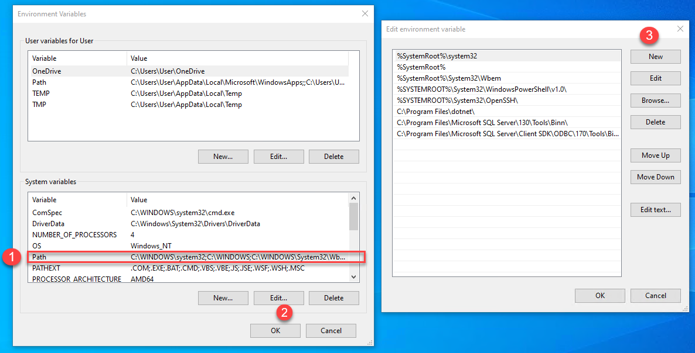
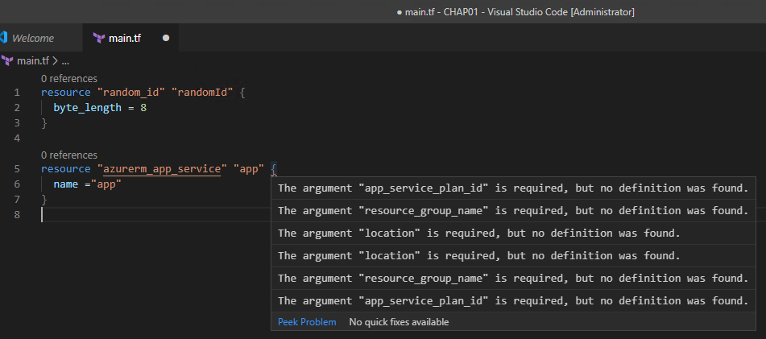

设置 Terraform 环境

在开始编写 Terraform 配置文件之前，必须先安装并配置本地开发环境。这个开发环境将允许在开发过程中编写和验证 Terraform 配置文件。

在本章的教程中，我们将学习如何在 Windows 机器上手动下载和安装 Terraform，以及如何使用脚本在 Windows 和 Linux 上安装它。我们还将学习如何在 Docker 容器中使用 Terraform，最后学习如何将 Terraform 配置从 0.11 版本迁移到 0.13 版本。

本章将涵盖以下教程：

+   手动下载和安装 Terraform

+   在 Linux 上使用脚本安装 Terraform

+   在 Windows 上使用脚本安装 Terraform

+   在 Docker 容器中执行 Terraform

+   在 VS Code 中编写 Terraform 配置

+   将 Terraform 配置迁移到 Terraform 0.13

我们开始吧！

# 技术要求

本章不要求你具备任何特定的技术知识。我们主要使用图形用户界面和简单的 Linux 和 Windows 脚本。然而，推荐了解 Docker，这样你可以完成 *在 Docker 容器中执行 Terraform* 的教程。

最后，对于 IDE，我们将使用免费的 Visual Studio Code，下载地址为 [`code.visualstudio.com/`](https://code.visualstudio.com/)。

本章的源代码可在 [`github.com/PacktPublishing/Terraform-Cookbook/tree/master/CHAP01`](https://github.com/PacktPublishing/Terraform-Cookbook/tree/master/CHAP01) 找到。

查看以下视频，了解代码的实际操作：[`bit.ly/3h9noXz`](https://bit.ly/3h9noXz)

# 手动下载和安装 Terraform

在此教程中，我们将学习如何在 Windows 操作系统下的本地机器上下载和安装 Terraform。

## 准备工作

完成此教程的唯一前提是你正在使用 Windows 操作系统。

## 如何做…

执行以下步骤：

1.  打开 Windows 文件资源管理器。选择一个位置并创建一个名为 `Terraform` 的文件夹。我们将使用该文件夹来存储 Terraform 二进制文件；例如，`C:/Terraform`。

1.  启动网页浏览器，访问 [`www.terraform.io/downloads.html`](https://www.terraform.io/downloads.html)。

1.  向下滚动页面，直到找到适用于 Windows 的软件包：


1.  点击 64 位链接，下载适用于 Windows 64 位操作系统的 Terraform ZIP 包。该包将被下载到本地。

1.  将下载的 ZIP 文件内容解压到我们在 *第 1 步* 中创建的 `Terraform` 文件夹中：


安装 Terraform 的最后一步是通过添加 Terraform 二进制文件夹的路径来配置 `Path` 环境变量。

为了完成此任务，请按照以下步骤操作：

1.  在文件资源管理器中，右键点击“此电脑”菜单，选择属性：


1.  点击高级系统设置链接，并点击新打开窗口中的环境变量按钮：


1.  当提供环境列表时，选择用户变量或系统变量（选择此选项将环境变量应用于所有工作站用户），然后选择 Path 变量。接着，点击编辑按钮：



1.  在路径列表中，添加我们创建的文件夹，也就是`C:\Terraform\`：


最后，通过点击每个窗口底部的 OK 按钮来验证所有打开的窗口。

## 工作原理…

下载并安装 Terraform 很简单，将 Terraform 二进制文件的路径添加到`PATH`环境变量中，可以让我们从任何终端位置执行 Terraform 命令行。

完成所有这些步骤后，我们可以通过打开命令行终端或 PowerShell 并执行以下命令来检查 Terraform 是否正常工作：

```
terraform --help
```

执行上述命令的结果如下所示：


这样做后，Terraform 命令列表将显示在终端中。

# 在 Linux 上使用脚本安装 Terraform

在这个教程中，我们将学习如何通过脚本在 Linux 机器上安装 Terraform。

## 准备工作

要完成这个教程，唯一的先决条件是你正在运行 Linux 操作系统，并且已经安装了*unzip*工具。`gpg`、`curl`和`shasum`工具必须已安装，它们通常在所有 Linux 发行版中默认安装。

## 操作步骤…

执行以下步骤：

1.  打开命令行终端并执行以下脚本：

```
TERRAFORM_VERSION="0.12.29"

curl -Os https://releases.hashicorp.com/terraform/${TERRAFORM_VERSION}/terraform_${TERRAFORM_VERSION}_linux_amd64.zip \
&& curl -Os https://releases.hashicorp.com/terraform/${TERRAFORM_VERSION}/terraform_${TERRAFORM_VERSION}_SHA256SUMS \
&& curl https://keybase.io/hashicorp/pgp_keys.asc | gpg --import \
&& curl -Os https://releases.hashicorp.com/terraform/${TERRAFORM_VERSION}/terraform_${TERRAFORM_VERSION}_SHA256SUMS.sig \
&& gpg --verify terraform_${TERRAFORM_VERSION}_SHA256SUMS.sig terraform_${TERRAFORM_VERSION}_SHA256SUMS \
&& shasum -a 256 -c terraform_${TERRAFORM_VERSION}_SHA256SUMS 2>&1 | grep "${TERRAFORM_VERSION}_linux_amd64.zip:\sOK" \
&& unzip -o terraform_${TERRAFORM_VERSION}_linux_amd64.zip -d /usr/local/bin
```

此脚本的源代码也可以在本书的 GitHub 仓库中找到：[`github.com/PacktPublishing/Terraform-Cookbook/blob/master/CHAP01/install_terraform_linux.sh`](https://github.com/PacktPublishing/Terraform-Cookbook/blob/master/CHAP01/install_terraform_linux.sh)

1.  执行此脚本后，我们可以通过执行以下命令来检查 Terraform 的安装情况：

```
terraform --version
```

前面的命令会显示已安装的 Terraform 版本，这意味着我们可以检查 Terraform 是否正确安装，以及所需的版本是否安装。

## 工作原理…

在此脚本中，第一行填入了`TERRAFORM_VERSION`变量，指定我们要安装的 Terraform 版本。这里提到这个变量，是因为我们不想在脚本中反复写出我们正在使用的 Terraform 版本。

在这个教程中，我们使用的是 0.12.29 版本的 Terraform，但我们可以自由修改此版本。

使用`curl`工具，脚本下载包含 Terraform 二进制文件的 ZIP 文件。然后，脚本检查打包文件的安全完整性，这叫做`shasum`。

在最后一行，脚本将解压下载的包到本地目录`/usr/local/bin`，该目录已经在`PATH`环境变量中默认提到。

你可以通过执行以下命令来检查你安装的 Terraform 版本是否与脚本中提到的版本一致：

```
terraform --version
```

该命令显示已安装的 Terraform 版本，如下图所示：


如我们所见，这里我们安装的 Terraform 版本是 0.12.29。

## 还有更多内容…

在这个 Terraform 安装脚本中，我们已经指定了要安装的 Terraform 版本号。

如果你想安装最新版本而不需要知道版本号，也可以通过以下 API 动态获取最新版本号：[`checkpoint-api.hashicorp.com/v1/check/terraform`](https://checkpoint-api.hashicorp.com/v1/check/terraform)。它会获取有关当前 Terraform 版本的信息。

以下截图显示了我们当前的版本：


请注意，`current_version`属性包含最新的 Terraform 版本，它是一个值。

使用这个 API，我们可以完美地修改安装脚本的第一行，使用以下代码：

```
TERRAFORM_VERSION=$(curl -s https://checkpoint-api.hashicorp.com/v1/check/terraform | jq -r .current_version)

....
```

这段完整的安装 Terraform 脚本可在[`github.com/PacktPublishing/Terraform-Cookbook/blob/master/CHAP01/install_terraform_linux_v2.sh`](https://github.com/PacktPublishing/Terraform-Cookbook/blob/master/CHAP01/install_terraform_linux_v2.sh)查看。

这段代码使用`curl`命令来获取 API 返回的数据，并解析其内容以提取`current_version`属性的值，使用的是 jq 工具（可在[`stedolan.github.io/jq/`](https://stedolan.github.io/jq/)获取）。

此外，`terraform --version`命令会显示是否已安装最新版本。如果你安装的是旧版本，命令会显示一条消息，提示最新版本：


这里，我们可以看到我们安装的版本是 0.12.28，而最新版本是 0.12.29（在撰写本食谱时）。

最后，HashiCorp 宣布，Terraform 的二进制文件将很快在 Linux 包管理器中提供。欲了解更多信息，请查看以下文章：[`www.hashicorp.com/blog/announcing-the-hashicorp-linux-repository`](https://www.hashicorp.com/blog/announcing-the-hashicorp-linux-repository)

## 另见

如需了解更多关于验证下载包的信息，可以查阅 HashiCorp 文档：[`www.hashicorp.com/security.html`](https://www.hashicorp.com/security.html)。

# 在 Windows 上使用脚本安装 Terraform

在本教程中，我们将学习如何使用 **Chocolatey** 软件包管理器在 Windows 机器上安装 Terraform。

## 准备就绪

为完成此步骤，您需要使用 Windows 操作系统并安装 Chocolatey（[`chocolatey.org/`](https://chocolatey.org/)），这是一个 Windows 软件包管理器。

如果您尚未安装 Chocolatey，您可以按照以下步骤轻松安装它：

1.  以管理员模式打开 PowerShell 终端，如下图所示：


1.  然后，在终端中执行以下脚本：

```
Set-ExecutionPolicy Bypass -Scope Process -Force; [System.Net.ServicePointManager]::SecurityProtocol = [System.Net.ServicePointManager]::SecurityProtocol -bor 3072; iex ((New-Object System.Net.WebClient).DownloadString('https://chocolatey.org/install.ps1'))
```

完整的 Chocolatey 安装文档可在 [`chocolatey.org/install`](https://chocolatey.org/install) 上找到。

## 如何操作……

执行以下步骤：

1.  以管理员模式打开 PowerShell 命令行终端。

1.  执行以下命令：

```
choco install -y  terraform
```

以下截图显示了执行该命令的结果：


`-y` 选项是可选的。它允许我们自动接受许可证协议。

## 它是如何工作的……

当 Chocolatey 安装 Terraform 包时，它会执行包源代码中的脚本，源代码可在 [`github.com/jamestoyer/chocolatey-packages/tree/master/terraform`](https://github.com/jamestoyer/chocolatey-packages/tree/master/terraform) 上找到。

然后，通过执行 [`github.com/jamestoyer/chocolatey-packages/blob/master/terraform/tools/chocolateyInstall.ps1`](https://github.com/jamestoyer/chocolatey-packages/blob/master/terraform/tools/chocolateyInstall.ps1) 中提供的脚本，Chocolatey 将 Terraform ZIP 文件下载到 Chocolatey 包的二进制目录中，该目录已包含在 `PATH` 环境变量中。

## 还有更多内容……

在升级 Terraform 时，您可以通过执行 `choco upgrade -y terraform` 命令直接通过 Chocolatey 升级。

默认情况下，`choco install` 命令会安装提到的包的最新版本。也可以通过在命令中添加 `--version` 选项来指定特定版本，例如，在我们的案例中，它将给出如下结果：

```
choco install -y terraform --version "0.12.28"
```

在本示例中，我们指定要安装版本 `0.12.28` 的 Terraform，而不是最新版本。

请注意，Chocolatey 提供的 Terraform 包可能与 Terraform 最新的官方版本存在时间差，而在 Linux 脚本中，如 *在 Linux 上安装 Terraform* 教程中，您可以指定刚发布的最新版本。

## 另请参阅

若要了解 Chocolatey 提供的所有命令，我建议阅读以下文档：[`chocolatey.org/docs/commands-reference#commands`](https://chocolatey.org/docs/commands-reference#commands)

# 在 Docker 容器中执行 Terraform

在本章的前面几篇配方中，我们讨论了如何在本地安装 Terraform，可以通过手动安装或脚本安装，具体取决于本地操作系统。

在这个配方中，我们将学习如何在 Docker 容器中运行 Terraform，这将使我们能够享受以下好处：

+   无需在本地安装 Terraform。

+   我们可以拥有一个与本地操作系统独立的 Terraform 运行环境。

+   我们可以使用不同版本的 Terraform 来测试我们的 Terraform 配置。

让我们开始吧！

## 准备就绪

要完成这个配方，你需要了解 Docker 及其命令，以及如何编写 Dockerfiles。请阅读文档以获取更多信息：[`docs.docker.com/get-started/overview/`](https://docs.docker.com/get-started/overview/)

在我们的本地计算机上，我们使用名为 Docker Desktop for Windows 的工具安装了 Docker。

关于其他操作系统的 Docker 安装指南，请阅读 Docker 安装文档：[`docs.docker.com/get-docker/`](https://docs.docker.com/get-docker/)。

我们已经编写了一个 Terraform 配置文件，关于它的细节这里不做介绍。它将在我们的 Docker 容器中执行。

你还需要相应的 Terraform 命令，`init`、`plan` 和 `apply`，这些命令在本配方中不会详细解释。

## 如何操作…

执行以下步骤：

1.  在包含 Terraform 配置的文件夹根目录下，我们需要创建一个包含以下代码的 Dockerfile：

```
FROMgolang:latest
ENVTERRAFORM_VERSION=0.13.0
RUNapt-get update && apt-get install unzip \
    && curl -Os https://releases.hashicorp.com/terraform/${TERRAFORM_VERSION}/terraform_${TERRAFORM_VERSION}_linux_amd64.zip \
    && curl -Os https://releases.hashicorp.com/terraform/${TERRAFORM_VERSION}/terraform_${TERRAFORM_VERSION}_SHA256SUMS \
    && curl https://keybase.io/hashicorp/pgp_keys.asc | gpg --import \    && curl -Os https://releases.hashicorp.com/terraform/${TERRAFORM_VERSION}/terraform_${TERRAFORM_VERSION}_SHA256SUMS.sig \
    && gpg --verify terraform_${TERRAFORM_VERSION}_SHA256SUMS.sig terraform_${TERRAFORM_VERSION}_SHA256SUMS \
    && shasum -a 256 c terraform_${TERRAFORM_VERSION}_SHA256SUMS 2>&1 | grep "${TERRAFORM_VERSION}_linux_amd64.zip:\sOK" \
    && unzip -o terraform_${TERRAFORM_VERSION}_linux_amd64.zip -d /usr/bin
RUNmkdir /tfcode
COPY. /tfcode
WORKDIR/tfcode
```

这段源代码也可以在[`github.com/PacktPublishing/Terraform-Cookbook/blob/master/CHAP01/terraform-docker/Dockerfile`](https://github.com/PacktPublishing/Terraform-Cookbook/blob/master/CHAP01/terraform-docker/Dockerfile)中找到。

1.  接下来，我们需要通过在终端中执行`docker build`命令来创建一个新的 Docker 镜像：

```
docker build -t terraform-code:v1.0 .
```

1.  然后，我们需要实例化这个镜像的新容器。为此，我们将执行`docker run`命令：

```
docker run -it -d --name tfapp terraform-code:v1.0 /bin/bash
```

1.  现在，我们可以通过以下命令在容器中执行 Terraform 命令：

```
docker exec tfapp terraform init
docker exec tfapp terraform plan
docker exec tfapp terraform apply --auto-approve
```

以下截图显示了执行这些命令（`terraform plan`）后的一部分输出：


## 它是如何工作的…

在*第 1 步*中，我们编写了 Docker 镜像的组成，在 Dockerfile 中进行定义。我们这样做如下：

1.  我们使用 Golang 基础镜像。

1.  我们通过初始化`TERRAFORM_VERSION`变量来指定要安装的 Terraform 版本。

1.  我们编写了与*在 Linux 上安装 Terraform* 配方中相同的 Terraform 安装脚本。

1.  我们将 Terraform 配置从本地文件复制到镜像中的新文件夹。

1.  我们指定我们的工作空间将是我们的新文件夹。

然后，在*第 2 步*和*第 3 步*中，我们创建了一个带有`v1.0`标签的 Docker `terraform-code` 镜像。这个标签用于对我们的 Terraform 配置进行版本控制。接着，我们创建了一个名为`tfapp`的该镜像实例，并使用 bash 工具运行。

最后，在 *步骤 4* 中，我们在 `tfapp` 实例中执行 Terraform 命令，操作在我们的容器工作区内进行。

## 还有更多…

在本教程中，我们学习了如何编写、构建并使用包含 Terraform 二进制文件的 Docker 镜像。通过这种方式，可以将其他工具，如 **Terragrunt**，集成到镜像中，这些工具也用于开发 Terraform 配置文件。

如果只使用 Terraform，您可以使用 HashiCorp 提供的官方镜像。该镜像是公开的，并且可以在 Docker Hub 上找到，网址为[`hub.docker.com/r/hashicorp/terraform/`](https://hub.docker.com/r/hashicorp/terraform/)。

## 另见

+   完整的 Docker 命令文档请参见[`docs.docker.com/engine/reference/run/`](https://docs.docker.com/engine/reference/run/)。

+   要了解 Docker 的介绍，请参考书籍 *Learning DevOps*，该书可以在[`www.packtpub.com/cloud-networking/learning-devops`](https://www.packtpub.com/cloud-networking/learning-devops)获取。

# 在 VS Code 中编写 Terraform 配置

编写 Terraform 配置文件并不需要特殊的代码编辑器。然而，流行的代码编辑器已经适应并提供了插件，简化了编写此类文件的过程。

在本教程中，我们将重点介绍 Visual Studio Code，它具有以下优点：

+   它是跨平台的，这意味着可以在 Windows、Linux 和 macOS 上安装。

+   这是免费的。

+   它拥有大量扩展，涵盖了开发人员日常工作的所有需求。

在这个教程中，我们将学习如何配置 Visual Studio Code，以便编写 Terraform 配置文件。我们还将看到这种方式编写代码的速度有多快。

## 准备就绪

对于本教程，您需要在本地机器上安装 Visual Studio Code。您可以通过访问[`code.visualstudio.com/`](https://code.visualstudio.com/)来安装它。

## 如何操作…

要在 Visual Studio Code 中使用 Terraform，我们需要安装相应的扩展并进行配置。

要安装此扩展，请执行以下步骤：

1.  打开 Visual Studio Code，点击扩展标签。此标签可以在编辑器左侧的侧边栏中找到，如下图所示：


1.  然后，我们使用 `Terraform` 关键字搜索扩展。

1.  安装列表中的第一个扩展，名为 Terraform。它是由 *HashiCorp* 发布的。通过点击扩展的安装按钮进行安装：


1.  重新加载 Visual Studio Code 以应用扩展。

## 它是如何工作的…

在本教程的第一部分，我们为 Visual Studio Code 安装了 Terraform 扩展。

在搜索 Terraform 扩展时，可能会出现多个选项，但我认为我们选择的这个是最强大的之一。

安装完成后，该扩展提供了许多编辑 Terraform 配置的功能，例如自动补全、配置验证、`tflint` 语法、代码格式化、官方文档链接以及模块浏览器。

该组件使 Visual Studio Code 在使用 Terraform 0.12 时表现更好——至少在扩展功能方面是这样的。

## 还有更多…

安装并配置扩展后，我们可以在 `main.tf` 文件中编写 Terraform 配置。在这里，我们可以使用一些非常有用的功能来开发 Terraform 配置，其中一些功能如下：

+   语法高亮：


+   资源和属性的自动补全：


+   实时代码验证：



+   显示引用次数的功能，并提供一个链接查看这些引用：


## 另请参见

+   若要查看该扩展的完整功能列表，请参考以下文档：[`marketplace.visualstudio.com/items?itemName=HashiCorp.terraform`](https://marketplace.visualstudio.com/items?itemName=HashiCorp.terraform)，以及其更新日志：[`marketplace.visualstudio.com/items/HashiCorp.terraform/changelog`](https://marketplace.visualstudio.com/items/HashiCorp.terraform/changelog)[.](https://marketplace.visualstudio.com/items?itemName=HashiCorp.terraform)

+   所有与 Terraform 相关的 Visual Studio Code 扩展可以在以下网址找到：[`marketplace.visualstudio.com/search?term=terraform&target=VSCode&category=All%20categories&sortBy=Relevance`](https://marketplace.visualstudio.com/search?term=terraform&target=VSCode&category=All%20categories&sortBy=Relevance)。

+   要了解 HashiCorp 为此扩展提供的支持，请访问：[`www.hashicorp.com/blog/supporting-the-hashicorp-terraform-extension-for-visual-studio-code/`](https://www.hashicorp.com/blog/supporting-the-hashicorp-terraform-extension-for-visual-studio-code/)。

# 将您的 Terraform 配置迁移到 Terraform 0.13

Terraform 0.12 版本于 2019 年 5 月正式发布，带来了许多新特性，也有一些变化；而在 2020 年夏季，新的 Terraform 版本 0.13 发布，提供了新功能并进行了一些变化。

在我们升级代码之前，必须考虑这些变更。

在本教程中，我们将讨论如何验证我们的 Terraform 配置是否与版本 0.12 兼容。之后，我们将学习如何将 Terraform 配置从版本 0.11 迁移到版本 0.12，再迁移到版本 0.13。

## 准备工作

在将代码从版本 0.11 迁移到最新版本（当前为 0.13）之前，您需要确保代码可以与 Terraform 0.11 的最新版本兼容，即 0.11.14。您可以从[`releases.hashicorp.com/terraform/0.11.14/`](https://releases.hashicorp.com/terraform/0.11.14/)下载此版本。

需要知道的是，如果你的 Terraform 配置是版本 0.11，无法直接迁移到 0.13。你必须先升级到 0.12，然后再迁移到 0.13。

此外，在进行任何迁移之前，强烈建议阅读 HashiCorp 提供的升级文档（这里是 0.12 版本的文档，[`www.terraform.io/upgrade-guides/0-12.html`](https://www.terraform.io/upgrade-guides/0-12.html)，这是 0.13 版本的文档，[`github.com/hashicorp/terraform/blob/master/website/upgrade-guides/0-13.html.markdown`](https://github.com/hashicorp/terraform/blob/master/website/upgrade-guides/0-13.html.markdown)）。这是因为在升级过程中，正如我们在本食谱中所学到的，许多元素会自动迁移，但其他的则需要手动迁移。

最后，HashiCorp 还建议，在执行迁移过程之前，将代码提交到源代码管理器（例如 Git），以便能够查看迁移所带来的代码变化。

用于本食谱的代码源（版本 0.11）可在此处获取：[`github.com/PacktPublishing/Terraform-Cookbook/tree/master/CHAP01/tf011`](https://github.com/PacktPublishing/Terraform-Cookbook/tree/master/CHAP01/tf011)

## 如何操作…

将 Terraform 配置从版本 0.11 升级到 0.13 分为两步，首先必须将代码迁移到 0.12，然后再迁移到 0.13。

要将我们的 Terraform 配置从版本 0.11 迁移到版本 0.12，请执行以下步骤：

在将此配置迁移到版本 0.12 之前，我们必须验证它是否与该版本兼容。为此，请按照以下步骤操作：

1.  使用 Terraform 0.11.14，在终端中执行以下命令：

```
terraform 0.12checklist
```

以下截图显示了执行前述命令后的输出：


如我们所见，我们的 Terraform 配置与 Terraform 版本 0.12 兼容。现在，我们可以进行迁移。

1.  接下来，我们需要手动安装 Terraform 0.12 的最新版本，如*手动下载并安装 Terraform*食谱中所述。根据我们的操作系统，也可以通过脚本来安装，如*在 Linux 上安装 Terraform*和*在 Windows 上使用脚本安装 Terraform*食谱中所示。

1.  在包含我们代码的文件夹中，我们执行`init`命令：

```
terraform init
```

1.  然后，我们执行以下命令：

```
terraform 0.12upgrade
```

1.  最后，在提示输入值时，我们通过回答`yes`来确认迁移，如下图所示：


然后，按照以下步骤将我们的 Terraform 配置从 0.12 版本迁移到 0.13 版本：

1.  下载并安装最新版本的 Terraform 0.13。

1.  与 0.12 完全一样，运行`terraform 0.13upgrade`命令将配置升级到 0.13：


## 它是如何工作的…

在*第 1 步*中，我们验证了我们的 Terraform 配置与 Terraform 0.12 中包含的语言演进（HCL 2）兼容。

然后，我们在本地安装了 Terraform 0.12，并通过执行`terraform init`命令开始迁移过程，该命令用于下载我们代码中将要调用的不同提供程序。

我们使用`terraform 0.12upgrade`命令将 Terraform 配置迁移到 0.12 版本，该命令直接升级 Terraform 配置。

最后，若要将 Terraform 配置升级到 0.13 版本，我们安装了 Terraform 0.13 二进制文件并执行了`terraform 0.13upgrade`命令。

## 还有更多内容…

请注意，迁移过程仅更改当前的 Terraform 配置。如果我们的 Terraform 配置调用了模块，则需要事先迁移模块的代码。

## 另请参见

有关 Terraform 迁移到 0.12 版本的程序的更多信息，请参考技术文档：[`www.terraform.io/upgrade-guides/0-12.html`](https://www.terraform.io/upgrade-guides/0-12.html)。

若想了解 Terraform 的演进及此新大版本中所做的更改，请查看以下文档和相关文章：

+   [`www.hashicorp.com/resources/a-2nd-tour-of-terraform-0-12`](https://www.hashicorp.com/resources/a-2nd-tour-of-terraform-0-12)

+   [`www.hashicorp.com/blog/announcing-terraform-0-12/`](https://www.hashicorp.com/blog/announcing-terraform-0-12/)

最后，以下是 Terraform 的官方仓库：[`github.com/hashicorp/terraform-guides/tree/master/infrastructure-as-code/terraform-0-12-examples`](https://github.com/hashicorp/terraform-guides/tree/master/infrastructure-as-code/terraform-0-12-examples)。其中包含多个 Terraform 0.12 的代码示例，我们将在本书中逐一讲解。

关于 Terraform 0.13，升级指南可以在这里找到 – [`github.com/hashicorp/terraform/blob/master/website/upgrade-guides/0-13.html.markdown`](https://github.com/hashicorp/terraform/blob/master/website/upgrade-guides/0-13.html.markdown)，变更日志可以在这里找到 – [`github.com/hashicorp/terraform/blob/master/CHANGELOG.md`](https://github.com/hashicorp/terraform/blob/master/CHANGELOG.md)。
