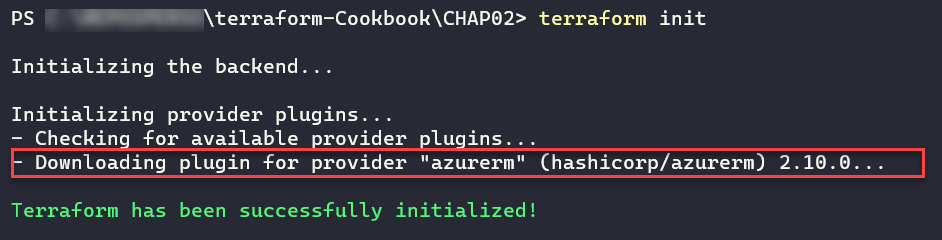
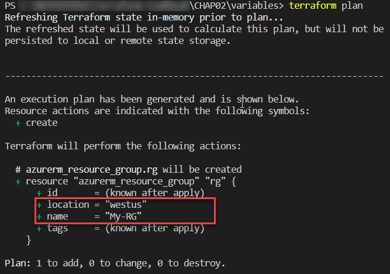
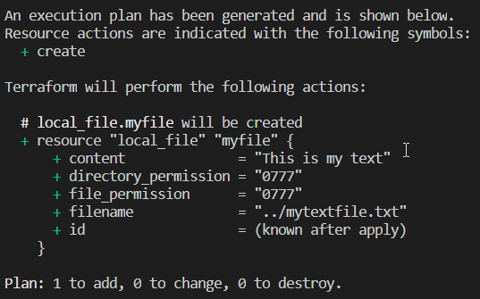

编写 Terraform 配置

当你开始编写 Terraform 配置时，你会很快注意到 Terraform 提供的语言非常丰富，可以进行大量操作。

在本章的配方中，你将学习如何有效地使用 Terraform 语言，并将其应用于现实生活中的商业场景。我们将讨论如何指定要使用的提供者版本，以及如何通过变量和输出使代码更加动态。然后，我们将使用这些概念用 Terraform 配置多个环境。之后，我们将考虑如何使用函数和条件。

我们还将学习如何使用数据块、其他 Terraform 状态文件和外部资源从外部系统中检索数据。最后，我们将介绍如何使用 Terraform 进行本地操作，例如运行本地可执行文件和操作本地文件。

在本章中，我们将介绍以下配方：

+   配置 Terraform 和要使用的提供者版本

+   操作变量

+   为自定义函数使用本地变量

+   使用输出暴露 Terraform 配置的数据

+   在多个环境中配置基础设施

+   使用数据源获取外部数据

+   使用其他状态文件中的外部资源

+   使用 Terraform 查询外部数据

+   调用 Terraform 内置函数

+   编写条件表达式

+   使用 Terraform 操作本地文件

+   使用 Terraform 执行本地程序

+   使用 Terraform 生成密码

让我们开始吧！

# 第三章：技术要求

本章需要你在计算机上安装 Terraform 二进制文件。本章的源代码可以在[`github.com/PacktPublishing/Terraform-Cookbook/tree/master/CHAP02`](https://github.com/PacktPublishing/Terraform-Cookbook/tree/master/CHAP02)找到。

查看以下视频，查看代码的实际运行：[`bit.ly/3hcZNVR`](https://bit.ly/3hcZNVR)

# 配置 Terraform 和要使用的提供者版本

Terraform 的默认行为是，当执行`terraform init`命令时，使用的 Terraform 二进制版本（我们称之为**命令行界面**（**CLI**），如这里解释的：[`www.terraform.io/docs/glossary.html#cli`](https://www.terraform.io/docs/glossary.html#cli)）是安装在本地工作站上的版本。此外，该命令还会下载代码中使用的最新版本的提供者。

然而，出于兼容性考虑，始终建议避免意外情况，因此你可以在 Terraform 配置文件中指定将要使用的 Terraform 二进制版本。以下是一些示例：

+   使用 HCL 2 编写的 Terraform 配置文件必须表明它必须使用 Terraform 版本大于或等于 0.12 进行执行。

+   包含新功能（如模块中的`count`和`for_each`）的 Terraform 配置必须表明它必须使用 Terraform 版本大于或等于 0.13 进行执行。

有关 HCL 语法的更多详细信息，请阅读文档：[`www.terraform.io/docs/configuration/syntax.html`](https://www.terraform.io/docs/configuration/syntax.html)。

同理，为了兼容性，我们可能希望指定要使用的提供程序版本。

在这个教程中，我们将学习如何指定 Terraform 版本以及提供程序版本。

## 准备工作

要开始这个教程，我们将编写一个包含以下代码的基础 Terraform 配置文件：

```
variable "resource_group_name" {
  default = "rg_test"
}
resource "azurerm_resource_group" "rg" {
  name     = var.resource_group_name
  location = "West Europe"
}
resource "azurerm_public_ip" "pip" {
  name                         = "bookip"
  location                     = "West Europe"
  resource_group_name          = azurerm_resource_group.rg.name
  public_ip_address_allocation = "Dynamic"
  domain_name_label            = "bookdevops"
}
```

这个示例代码提供了 Azure 中的资源（一个资源组和一个公共 IP 地址）。有关更多详细信息，请阅读以下关于 Terraform AzureRM 提供程序的文档：[`www.terraform.io/docs/providers/azurerm/index.html`](https://www.terraform.io/docs/providers/azurerm/index.html)

此外，这段代码包含了自 Terraform 0.12 以来对 HCL 2.0 语言所做的改进。有关这些 HCL 增强的更多详细信息，请访问 [`www.slideshare.net/mitchp/terraform-012-deep-dive-hcl-20-for-infrastructure-as-code-remote-plan-apply-125837028`](https://www.slideshare.net/mitchp/terraform-012-deep-dive-hcl-20-for-infrastructure-as-code-remote-plan-apply-125837028)。

最后，当在此代码中执行`terraform plan`命令时，我们会收到以下警告信息：


这意味着，目前这个 Terraform 配置仍然与提供程序的最新版本兼容，但在未来的版本中，该属性将发生更改，因此这段代码将不再有效。

现在，让我们讨论一下我们需要遵循的步骤，以便做出以下合规性：

+   只有在本地计算机上安装了至少 Terraform 0.13 版本时，才能执行此配置。

+   即使`azurerm`提供程序发生破坏性更改，我们当前的配置也可以执行。

关于 Terraform 0.13 提供的新功能，请在此查看变更日志 – [`github.com/hashicorp/terraform/blob/master/CHANGELOG.md`](https://github.com/hashicorp/terraform/blob/master/CHANGELOG.md)，并在此查看升级指南 – [`github.com/hashicorp/terraform/blob/master/website/upgrade-guides/0-13.html.markdown`](https://github.com/hashicorp/terraform/blob/master/website/upgrade-guides/0-13.html.markdown)。

接下来我们将查看这个内容。

## 如何操作……

要指定在本地工作站上安装的 Terraform 版本，请执行以下操作：

1.  在 Terraform 配置中，添加以下块：

```
terraform {
  required_version = ">= 0.13"
}
```

1.  要指定要使用的提供程序源和版本，我们需要在同一个`terraform`配置块中添加`required_provider`块：

```
terraform {
  ...
  required_providers {
    azurerm = {
      source = "hashicorp/azurerm"
      version = "2.10.0"
    }
  }
}
```

## 它是如何工作的……

当执行`terraform init`命令时，Terraform 会检查执行 Terraform 配置文件的已安装 Terraform 二进制文件版本是否与`terraform`块中`required_version`属性指定的版本相对应。

如果匹配，它不会抛出错误，因为它大于版本 0.13\。否则，它将抛出错误：


关于提供程序版本的指定，执行 `terraform init` 命令时，如果没有指定版本，Terraform 将下载提供程序的最新版本，否则将下载指定版本，如下图所示。

以下截图显示了提供程序插件从指定的 `source` 被下载，而我们并未指定所需的版本（截至撰写时，提供程序的最新版本为 2.20.0）：


如我们所见，已下载最新版本的 `azurerm` 提供程序（2.20.0）。

此外，以下截图显示了在我们指定所需版本（2.10.0）时，`azurerm` 提供程序插件正在被下载：



如我们所见，已下载指定版本的 `azurerm` 提供程序（2.10.0）。

有关 `required_version` 块和提供程序版本的更多细节，请访问 [`www.terraform.io/docs/configuration/terraform.html#specifying-required-provider-versions`](https://www.terraform.io/docs/configuration/terraform.html#specifying-required-provider-versions)。

在这个 `required_version` 块中，我们还添加了 `source` 属性，它是在 Terraform 0.13 版本中引入的，相关文档可以在这里找到：[`github.com/hashicorp/terraform/blob/master/website/upgrade-guides/0-13.html.markdown#explicit-provider-source-locations`](https://github.com/hashicorp/terraform/blob/master/website/upgrade-guides/0-13.html.markdown#explicit-provider-source-locations)

## 还有更多…

在本食谱中，我们学习了如何以多种方式下载 `azurerm` 提供程序。我们在这里做的适用于你可能想要下载的所有提供程序。

还需要提到的是，使用的 Terraform 二进制版本在 Terraform 状态文件中指定。这是为了确保没有人使用较低版本的 Terraform 二进制文件应用此 Terraform 配置，从而确保 Terraform 状态文件的格式与正确版本的 Terraform 二进制文件一致。

## 另见

+   关于 Terraform 块属性的更多信息，请访问 [`www.terraform.io/docs/configuration/terraform.html`](https://www.terraform.io/docs/configuration/terraform.html)。

+   关于提供程序属性的更多信息，请访问 [`www.terraform.io/docs/configuration/providers.html`](https://www.terraform.io/docs/configuration/providers.html)。

+   关于 Terraform 二进制版本管理的更多信息，请参考 [`www.terraform.io/docs/extend/best-practices/versioning.html`](https://www.terraform.io/docs/extend/best-practices/versioning.html)。

+   `azurerm`提供程序的升级指南（至版本 2.0）可以通过以下链接访问：[`www.terraform.io/docs/providers/azurerm/guides/2.0-upgrade-guide.html`](https://www.terraform.io/docs/providers/azurerm/guides/2.0-upgrade-guide.html)。

# 操作变量

当你编写一个所有属性都硬编码在代码中的 Terraform 配置文件时，你常常会遇到需要重复编写代码以便重用的问题。

在本教程中，我们将学习如何通过使用变量使 Terraform 配置更加动态。

## 准备工作

首先，我们将处理`main.tf`文件，该文件包含一个基本的 Terraform 配置：

```
resource "azurerm_resource_group" "rg" {
  name     = "My-RG"
  location = "West Europe"
}
```

如我们所见，`name`和`location`属性的值在代码中是以静态方式写入的。

让我们学习如何使用变量使它们动态化。

## 如何操作……

执行以下步骤：

1.  在同一个`main.tf`文件中，添加以下变量声明：

```
variable "resource_group_name" {
  description ="The name of the resource group"
}
variable "location" {
  description ="The name of the Azure location"
  default ="West Europe"
}
```

1.  然后，修改本教程开始时的 Terraform 配置，使其引用我们的新变量，如下所示：

```
resource "azurerm_resource_group" "rg" {
  name     = var.resource_group_name
  location = var.location
}
```

1.  最后，在包含`main.tf`文件的相同文件夹中，创建一个名为`terraform.tfvars`的新文件，并添加以下内容：

```
resource_group_name = "My-RG"
location            = "westeurope"
```

## 工作原理……

在*第 1 步*中，我们编写了两个变量的声明，其中包含以下元素：

+   变量名称：此名称必须在该 Terraform 配置中唯一，并且必须足够明确，以便所有代码贡献者都能理解。

+   该变量表示的内容描述：此描述是可选的，但建议提供，因为它可以通过 CLI 显示，并且可以集成到自动生成的文档中。

+   默认值：这是可选的。不设置默认值会使其变为必填项。

然后，在*第 2 步*中，我们修改了 Terraform 配置，使用这两个变量。我们通过`var.<变量名>`语法完成了这一操作。

最后，在*第 3 步*中，我们在`terraform.tfvars`文件中为这些变量赋值，该文件由 Terraform 原生使用。

执行此 Terraform 配置后的结果显示在以下截图中：



## 还有更多……

在`terraform.tfvars`文件中设置变量的值是可选的，因为我们已经为该变量设置了默认值。

除了这个`terraform.tfvars`文件，还可以通过`terraform plan`和`terraform apply`命令的`-var`选项为变量设置值，如下命令所示：

```
terraform plan -var "location=westus"
```

因此，使用此命令时，我们代码中声明的`location`变量将具有`westus`的值，而不是`westeurope`。

此外，随着 Terraform 2020 年 8 月发布的 0.13 版本，我们现在可以为变量创建自定义验证规则，这使我们能够在执行`terraform plan`时验证值。

在我们的示例中，我们可以在 `validation` 块中使用如下代码完成 `location` 变量的验证规则：

```
variable "location" {
  description ="The name of the Azure location"
  default ="West Europe"
  validation { # TF 0.13
    condition = can(index(["westeurope","westus"], var.location) >= 0)
    error_message = "The location must be westeurope or westus."
  }
}
```

在前述配置中，规则检查了 `location` 变量的值是否为 `westeurope` 或 `westus`。

如果我们将 `location` 变量设置为 `westus2` 等其他值，则下面的截图显示了 `terraform plan` 命令的执行：


有关变量自定义规则验证的更多信息，请阅读文档：[`www.terraform.io/docs/configuration/variables.html#custom-validation-rules`](https://www.terraform.io/docs/configuration/variables.html#custom-validation-rules)。

最后，还有另一种为变量设置值的方法，即设置名为 `TF_VAR_<变量名>` 的环境变量。在我们的案例中，我们可以创建一个名为 `TF_VAR_location` 的环境变量，并设置其值为 `westus`，然后以经典方式执行 `terraform plan` 命令。

请注意，使用 `-var` 选项或 `TF_VAR_<变量名>` 环境变量并不会将这些变量的值硬编码到 Terraform 配置中。它们使我们能够将变量的值传递给工具。但是要注意，如果在参数中提供的初始值与执行代码时提供的其他值不符，则可能会产生后果，应仔细检查计划的输出。

## 另请参阅

在这个示例中，我们查看了变量的基本使用。当我们学习如何管理环境时，在本章后面的*在多个环境中管理基础设施*一节中，我们将探讨其更高级的用法。

有关变量的更多信息，请参阅此处的文档：[`www.terraform.io/docs/configuration/variables.html`](https://www.terraform.io/docs/configuration/variables.html)

# 使用本地变量进行自定义函数

在前一个示例中，我们学习了如何使用变量来动态配置我们的 Terraform。有时，当涉及到变量的组合使用时，这种使用可能会有点繁琐。

在这个示例中，我们将学习如何实现本地变量并将它们用作自定义函数。

## 准备工作

首先，我们将使用以下 Terraform 配置：

```
variable "application_name" {
  description = "The name of application"
}
variable "environment_name" {
  description = "The name of environment"
}
variable "country_code" {
  description = "The country code (FR-US-...)"
}
resource "azurerm_resource_group" "rg" {
  name = "XXXX" # VARIABLE TO USE
  location = "West Europe"
}
resource "azurerm_public_ip" "pip" {
  name = "XXXX" # VARIABLE TO USE
  location = "West Europe"
  resource_group_name = azurerm_resource_group.rg.name
  allocation_method = "Dynamic"
  domain_name_label = "mydomain"
}
```

本示例的目标是始终渲染 Azure 资源的名称。我们必须为它们提供以下命名规则：

```
CodeAzureResource - Name Application - Environment name - Country Code
```

## 如何操作…

执行以下步骤：

1.  在包含我们的 Terraform 配置的 `main.tf` 文件中，我们将添加一个名为 `resource_name` 的本地变量，以及以下代码：

```
locals {
  resource_name = "${var.application_name}-${var.environment_name}-${var.country_code}"
}
```

1.  然后，我们在资源中使用这个本地变量，代码如下：

```
resource "azurerm_resource_group" "rg" {
 name = "RG-${local.resource_name}"
 location = "West Europe"
}
resource "azurerm_public_ip" "pip" {
 name = "IP-${local.resource_name}"
 location = "West Europe"
 resource_group_name = azurerm_resource_group.rg.name
 public_ip_address_allocation = "Dynamic"
 domain_name_label = "mydomain"
}
```

## 如何运作…

在*第 1 步*中，我们创建了一个名为 `resource_name` 的变量，它是局部于我们 Terraform 配置的。这使我们能够创建多个 Terraform 变量的组合（我们将在本章的*使用输出暴露 Terraform 配置数据*这一部分看到结果）。

然后，在*第 2 步*中，我们使用了带有 `local.<局部变量名称>` 表达式的局部变量。此外，在 `name` 属性中，我们将其用作变量和静态文本的拼接，这就是为什么我们使用了 `"${}"` 语法。

执行此 Terraform 配置的结果如下：


在之前的截图中，我们可以看到执行 `terraform plan` 命令后的输出，其中包含我们通过 `locals` 变量计算得出的资源组的 `name`。

## 另见

有关局部变量的更多信息，请查看以下文档：[`www.terraform.io/docs/configuration/locals.html`](https://www.terraform.io/docs/configuration/locals.html)

# 使用输出暴露 Terraform 配置数据

在使用诸如 Terraform 之类的基础设施即代码工具时，通常需要在代码执行后从已配置的资源中检索输出值。

这些输出值的一个用途是，它们可以在执行后由其他程序使用。这通常发生在 Terraform 配置的执行集成到 CI/CD 流水线时。

例如，我们可以在 CI/CD 流水线中使用这些输出值，该流水线使用 Terraform 创建 Azure App Service，并将应用程序部署到该 Azure App Service 中。在这个例子中，我们可以将 App Service（Web 应用类型）的名称作为 Terraform 配置的输出。对于通过模块传递信息，这些输出值也非常有用，我们将在第五章《*使用模块共享 Terraform 配置*》中详细了解。

在本食谱中，我们将学习如何在 Terraform 配置中实现输出值。

## 准备工作

接下来，我们将添加一些我们已经在现有的 `main.tf` 文件中的 Terraform 配置。

以下是现有代码的摘录，该代码在 Azure 中提供一个 App Service：

```
...
resource "azurerm_app_service" "app" {
  name                = "${var.app_name}-${var.environment}"
  location            = azurerm_resource_group.rg-app.location
  resource_group_name = azurerm_resource_group.rg-app.name
  app_service_plan_id = azurerm_app_service_plan.plan-app.id
}
...
```

## 如何操作…

为确保我们有一个输出值，我们只需将以下代码添加到此 `main.tf` 文件中：

```
output "webapp_name" {
  description = "output Name of the webapp"
  value = azurerm_app_service.app.name
}
```

## 它是如何工作的…

Terraform 的 `output` 块通过一个名称 `webapp_name` 和一个值 `azurerm_app_service.app.name` 来定义。这些引用了在同一个 Terraform 配置中提供的 Azure App Service 的名称。可选地，我们可以添加一个 `description` 来描述输出返回的内容，这对于自动生成文档或在使用模块时非常有用。

当然，可以在同一个 Terraform 配置中定义多个输出。

输出存储在 Terraform 状态文件中，并在执行 `terraform apply` 命令时显示，如下图所示：


在这里，我们看到执行结束时显示的两个输出值。

## 还有更多内容…

有两种方法可以检索输出的值以便利用它们，如下所示：

+   通过使用 Terraform CLI 中的 `terraform output` 命令，我们将在第四章的 *以 JSON 导出输出* 章节中看到，*使用 Terraform CLI*

+   通过使用 `terraform_remote_state` 数据源对象，我们将在本章稍后的 *使用其他状态文件中的外部资源* 章节中讨论。

## 另见

Terraform 输出的文档可在 [`www.terraform.io/docs/configuration/outputs.html`](https://www.terraform.io/docs/configuration/outputs.html) 上查看。

# 在多个环境中配置基础设施

就像我们将应用程序部署到多个环境（开发、测试、QA 和生产环境）一样，我们也需要在这些不同的环境中配置基础设施。

一个常见的问题是如何编写一个可维护、可扩展的 Terraform 配置，使我们能够为多个环境配置基础设施。

要回答这个问题，重要的是要知道，有多种方法可以组织 Terraform 配置拓扑，这些方法能够支持此类资源的配置。

在这个教程中，我们将查看两种 Terraform 配置结构拓扑，它们可以帮助我们将 Azure 基础设施部署到多个环境中。

## 准备工作

要完全理解这个教程，你需要对变量的概念有深入的了解，正如本章中*操作变量*的教程所讨论的那样。

我们将要编写的 Terraform 配置的目标是为单一环境部署 Azure 应用服务。其代码分布在以下文件中：


在前面的图中，我们可以看到以下内容：

+   `main.tf` 文件包含要配置的资源的 Terraform 配置。

+   `variables.tf` 文件包含变量的声明。

+   `terraform.tfvars` 文件包含变量的值。

这个基础示例的 Terraform 源代码可以在 [`github.com/PacktPublishing/Terraform-Cookbook/tree/master/CHAP02/myApp/simple-env`](https://github.com/PacktPublishing/Terraform-Cookbook/tree/master/CHAP02/myApp/simple-env) 上查看。

这个教程中重要的不是代码的内容，而是文件夹结构和需要执行的 Terraform 命令。

## 如何实现…

按照以下步骤来实现第一个 Terraform 配置文件夹拓扑：

1.  在一个空文件夹中，为每个环境创建一个独立的目录：一个用于开发环境，一个用于测试环境，一个用于 QA，另一个用于生产环境。

1.  将 Terraform 基础配置文件相同地复制到这些目录中。

1.  然后，在这些目录中的每个目录中，修改 `terraform.tfvars` 文件的值，填写特定于环境的信息。以下是每个 `terraform.tfvars` 文件的摘录：

```
resource_group_name = "RG-App"
service_plan_name = "Plan-App"
environment = "DEV" #name of the environment to change
```

1.  最后，为了配置每个环境，在这些目录中的每个目录下，执行经典的 Terraform 执行工作流，通过运行 `terraform init`、`terraform plan` 和 `terraform apply` 命令。

按照以下步骤实施 Terraform 配置文件的第二种拓扑结构：

1.  在包含我们基本 Terraform 配置的文件夹中，创建三个子目录：`dev`、`test` 和 `production`。

1.  然后，在这些子目录中，只需复制 `terraform.tfvars` 基础文件，在其中修改目标环境的正确变量值。以下是每个 `terraform.tfvars` 文件的摘录：

```
resource_group_name = "RG-App"
service_plan_name = "Plan-App"
environment = "DEV" #name of the environment to change
```

1.  最后，为了配置这些环境，进入 Terraform 配置的根文件夹并执行以下命令：

```
terraform init
terraform plan -var-file="<environment folder>/terraform.tfvars"
terraform apply -var-file="<environment folder>/terraform.tfvars"
```

## 它是如何工作的……

在第一种拓扑中，我们为每个环境重复相同的 Terraform 配置，只需更改每个文件夹中 `terraform.tfvars` 文件的变量值。

通过这样做，我们得到了以下文件夹结构：


然后，执行基本的 Terraform 命令。此结构可用于基础设施在各个环境中没有相同资源的情况。因为将所有 Terraform 配置复制到每个环境文件夹中，可以轻松地为一个环境添加或删除资源，而不会影响其他环境。

然而，这是重复的代码，这意味着这些代码必须多次维护（我们必须修改所有环境的基础设施，改变 Terraform 配置等）。

在第二种拓扑中，我们将 Terraform 配置保留在所有环境的公共基础中，每个环境只有一个 `terraform.tfvars` 文件。通过这种方式，我们得到了以下文件夹结构：


关于 Terraform 配置的执行，我们在 `plan` 和 `apply` 命令中添加了 `-var-file` 选项。如果所有环境的基础设施相同，仅配置不同，可以使用此结构。

这种拓扑的优点是，我们只有一份公共的 Terraform 资源代码（在 `main.tf` 和 `variables.tf` 文件中），并且只有一个 `terraform.tfvars` 文件需要填写，因此在代码演变或新增环境时，我们只需做少量更改。

另一方面，对 Terraform `main.tf` 代码所做的更改将应用于所有环境，在这种情况下，需要更多的测试和验证。

## 另见

+   还有其他解决方案来处理 Terraform 配置文件夹结构拓扑，正如我们在第五章中讨论的，*使用模块共享 Terraform 配置*。

+   关于`plan`和`apply`命令的`-var-file`选项的文档可以在[`www.terraform.io/docs/commands/plan.html`](https://www.terraform.io/docs/commands/plan.html)找到。

+   一篇解释 Terraform 配置最佳实践的文章可以在[`www.terraform-best-practices.com/code-structure`](https://www.terraform-best-practices.com/code-structure)找到。

+   以下博客文章解释了生产环境中 Terraform 配置的文件夹结构：[`www.hashicorp.com/blog/structuring-hashicorp-terraform-configuration-for-production`](https://www.hashicorp.com/blog/structuring-hashicorp-terraform-configuration-for-production)

# 使用数据源获取外部数据

当使用 Terraform 配置基础设施时，有时需要获取已有资源的信息。实际上，在将资源部署到某个基础设施时，我们常常需要将自己置于现有基础设施中，或者将其与已经配置的其他资源链接起来。

在这个食谱中，我们将学习如何在我们的 Terraform 配置中获取基础设施中已经存在的资源信息。

## 准备工作

对于这个食谱，我们将使用一个现有的 Terraform 配置，它在 Azure 云中提供一个 Azure 应用服务。这个源代码可以在[`github.com/PacktPublishing/Terraform-Cookbook/tree/master/CHAP02/data`](https://github.com/PacktPublishing/Terraform-Cookbook/tree/master/CHAP02/data)找到。

这段代码是不完整的，因为在这个项目中，我们需要将应用服务存储在一个现有的服务计划中。这个服务计划是我们将为整个应用服务使用的。

## 如何操作……

执行以下步骤：

1.  在包含 Terraform 配置的文件中，添加以下数据块：

```
data "azurerm_app_service_plan" "myplan" {
  name                = "app-service-plan"
  resource_group_name = "rg-service_plan"
}
```

在属性部分中，指定要使用的服务计划的名称和资源组。

1.  然后，完成现有应用服务配置，如下所示：

```
resource "azurerm_app_service" "app" {
  name                = "${var.app_name}-${var.environement}"
  location            = azurerm_resource_group.rg-app.location
  resource_group_name = azurerm_resource_group.rg-app.name
  app_service_plan_id = data.azurerm_app_service_plan.myplan.id
}
```

## 它是如何工作的……

在*步骤 1*中，添加一个数据块来查询现有资源。在此数据块中，我们指定了现有服务计划的资源组和名称。

在*步骤 2*中，我们使用了通过在*步骤 1*中添加的数据块获取的服务计划 ID。

执行此 Terraform 配置的结果可以在以下截图中看到：


正如我们所看到的，我们得到了通过`data`块获取的服务计划 ID。

## 还有更多内容……

使用数据块的有趣之处在于，当我们在 Terraform 配置上执行`terraform destroy`命令时，Terraform 不会对数据块调用的资源执行销毁操作。

此外，推荐使用数据块，而不是在代码中写明的 ID，因为 ID 可能会变化，而数据块能够动态地恢复信息。

最后，数据块在执行`terraform plan`命令时也会被调用，因此在执行`terraform plan`和`terraform apply`命令之前，您的外部资源必须已经存在。

如果此外部资源尚未存在，我们会在`terraform plan`命令中遇到以下错误：


你需要知道在你的 Terraform 配置中使用哪些提供程序，因为并不是所有的提供程序都实现了数据块。

## 另见

要了解有关数据块的更多信息，请查看以下文档：[`www.terraform.io/docs/configuration/data-sources.html`](https://www.terraform.io/docs/configuration/data-sources.html)

# 从其他状态文件中使用外部资源

在前一个食谱中，我们看到可以使用数据块检索基础设施中已存在资源的信息。

在本食谱中，我们将学习也可以从其他 Terraform 状态文件中检索外部信息。

## 准备工作

对于本食谱，我们将像前一个食谱一样，使用一个 Terraform 配置来配置一个 Azure App Service，该服务必须是已经配置好的 Service Plan 的一部分。

与前一个食谱不同，我们将不使用单独的数据源；相反，我们将从用于配置 Service Plan 的现有 Terraform 状态文件中读取输出。

作为前提条件，在用于配置 Service Plan 的 Terraform 配置中，我们必须有一个输出值（请参见本章中的*使用输出暴露 Terraform 配置的数据*一节），该输出返回 Service Plan 的标识符，如下代码所示：

```
resource "azurerm_app_service_plan" "plan-app" {
  name = "MyServicePlan"
  location = "westeurope"
  resource_group_name = "myrg"
    sku {
     tier = "Standard"
     size = "S1"
     }
}

output "service_plan_id" {
  description = "output Id of the service plan"
  value = azurerm_app_service_plan.plan-app.id
}
```

此外，我们使用了 Azure Storage 的远程后端版本（有关更多信息，请参见第六章中的*保护 Azure 远程后端中的状态文件*一节，以及*使用 Terraform 配置 Azure 基础设施*的食谱）来存储 Service Plan 的 Terraform 状态文件。

## 如何执行...

执行以下步骤：

1.  在提供 Azure App Service 的 Terraform 配置中，添加并配置`terraform_remote_state`块，如下所示：

```
data "terraform_remote_state" "service_plan_tfstate" {
  backend = "azurerm"
  config = {
     resource_group_name = "rg_tfstate"
     storage_account_name = "storstate"
     container_name = "tfbackends"
     key = "serviceplan.tfstate"
  }
}
```

1.  然后，在 Azure App Service 的 Terraform 配置中，使用 Service Plan 的创建输出，如下所示：

```
resource "azurerm_app_service" "app" {
  name = "${var.app_name}-${var.environement}"
  location = azurerm_resource_group.rg-app.location
  resource_group_name = azurerm_resource_group.rg-app.name
  app_service_plan_id = data.terraform_remote_state.service_plan_tfstate.service_plan_id
}
```

## 它是如何工作的...

在*步骤 1*中，我们添加了`terraform_remote_state`块，它允许我们检索另一个 Terraform 状态文件中存在的输出。在其块中，我们指定了远程后端信息，这是给定 Terraform 状态存储的位置（在本食谱中，我们使用了 Azure Storage）。

在*步骤 2*中，我们使用了 Terraform 状态文件中输出返回的 ID。

执行此代码的结果与我们在 *使用数据块调用外部资源* 方案中看到的完全相同。

## 还有更多…

当将部署复杂基础设施的 Terraform 配置进行分离时，这个技巧非常实用。

将 Terraform 配置分离是一个良好的实践，因为它可以更好地控制和维护 Terraform 配置。它还允许我们单独配置每个部分，而不会影响其他基础设施。

要知道何时使用数据块或 `terraform_remote_state` 块，必须记住以下建议：

+   `data` 块用于以下情况：

    +   当外部资源未通过 Terraform 配置进行配置（它是手动构建的或通过脚本构建的）

    +   当提供我们 Terraform 配置资源的用户无法访问另一个远程后端时

+   `terraform_remote_state` 块用于以下情况：

    +   外部资源未通过 Terraform 配置进行配置

    +   当提供我们 Terraform 配置资源的用户拥有对另一个远程后端的读取权限时

    +   当外部 Terraform 状态文件包含我们在 Terraform 配置中所需的属性输出时

## 另请参见

`terraform_remote_state` 块的文档可以在 [`www.terraform.io/docs/providers/terraform/d/remote_state.html`](https://www.terraform.io/docs/providers/terraform/d/remote_state.html) 找到。

# 使用 Terraform 查询外部数据

在前面两种方案中，我们学习了可以使用 `data` 块或 `terraform_remote_state` 块来获取外部数据。然而，也有一些场景，`data` 块在提供程序中不存在，或者 `terraform_remote_state` 无法使用，例如当我们需要与外部 API 进行处理，或者需要使用本地工具并处理其输出时。

为了满足这一需求，Terraform 中有一个 `external` 资源，它允许你调用外部程序并获取其输出数据，以便在 Terraform 配置中使用。

使用 `external` 提供程序会有一些前提条件，这些前提条件可能不明显（例如，在此案例中，我们期望特定版本的 PowerShell），或者可能只能通过 `README` 文件或文档进行传达。此外，Terraform 通常设计为跨平台（操作系统/架构）工作，但这实际上将配置限制为可以（并且确实可以）运行 PowerShell 的特定平台——大概仅限于 Windows。这些要求适用于 CI 和本地环境。

在这个方案中，我们将学习如何调用外部程序并获取其输出，以便我们可以重用它。

## 准备工作

对于这个方案，我们将使用一个现有的 Terraform 配置，它允许我们在 Azure 中配置一个资源组。

在这里，我们希望资源组位于不同的 Azure 区域（位置），具体取决于环境（开发环境或生产环境）。

本配方的源代码可在[`github.com/PacktPublishing/Terraform-Cookbook/tree/master/CHAP02/external`](https://github.com/PacktPublishing/Terraform-Cookbook/tree/master/CHAP02/external)获取。

## 如何操作…

执行以下步骤：

1.  在包含`main.tf`文件的目录中，创建一个 PowerShell 脚本`GetLocation.ps1`，内容如下：

```
# Read the JSON payload from stdin
$jsonpayload = [Console]::In.ReadLine()

# Convert JSON to a string
$json = ConvertFrom-Json $jsonpayload
$environment = $json.environment

if($environment -eq "Production"){
 $location="westeurope"
}else{
 $location="westus"
}

# Write output to stdout
Write-Output "{ ""location"" : ""$location""}"
```

1.  在`main.tf`文件中，添加`external`块，内容如下：

```
data "external" "getlocation" {
  program = ["Powershell.exe", "./GetLocation.ps1"]
  query = {
      environment = "${var.environment_name}"
  }
}
```

1.  然后，修改资源组的代码，使其位置更加动态，如下所示：

```
resource "azurerm_resource_group" "rg" {
  name = "RG-${local.resource_name}"
  location = data.external.getlocation.result.location
}
```

1.  可选地，你可以添加一个`output`值，其配置如下：

```
output "locationname" {
  value = data.external.getlocation.result.location
}
```

## 它是如何工作的…

在*第 1 步*中，我们编写了 PowerShell 脚本`GetLocation.ps1`，该脚本将在本地由 Terraform 调用。此脚本接受`environment`作为输入参数，格式为 JSON。然后，PowerShell 脚本根据此输入环境做出条件判断，并返回正确的 Azure 区域作为输出，以便我们在 Terraform 配置中使用它。

然后，在*第 2 步*中，我们使用了 Terraform 的`external`资源，它调用这个 PowerShell 脚本并将`environment_name`变量的内容作为参数提供给它。

最后，在*第 3 步*中，我们将`external`块的返回值用于资源组的`location`属性。

以下截图显示了执行`terraform plan`命令时，`environment_name`变量设置为`Dev`的输出：


如你所见，资源组的区域位置是`westus`。

以下截图显示了执行`terraform plan`命令时，`environment_name`变量设置为`Production`的输出：


如你所见，资源组的区域位置是`westeurope`。

正如我们在*操作变量*一节中看到的那样，在这个示例中，我们使用了`terraform plan`命令的`-var`选项，这允许我们在执行命令时为变量分配一个值。

可选地，我们还可以添加一个 Terraform `output`，以暴露此值。在执行 Terraform 时，这个值可以显示出来。它还可以在 Terraform 配置中的其他地方使用。

以下截图显示了运行`terraform apply`命令后的输出：


如我们所见，`terraform output`命令显示了正确的`locationname`值。

## 还有更多…

在这个配方中，我们使用了 PowerShell 脚本，但该脚本同样适用于本地机器上安装的所有其他脚本语言和工具。

这个`external`资源包含了关于协议、参数格式及其输出的详细信息。我建议你阅读它的文档以了解更多：[`www.terraform.io/docs/providers/external/data_source.html`](https://www.terraform.io/docs/providers/external/data_source.html)

## 另见

以下是一些关于如何使用`external` Terraform 资源的示例文章：

+   [`dzone.com/articles/lets-play-with-terraform-external-provider`](https://dzone.com/articles/lets-play-with-terraform-external-provider)

+   [`thegrayzone.co.uk/blog/2017/03/external-terraform-provider-powershell/`](https://thegrayzone.co.uk/blog/2017/03/external-terraform-provider-powershell/)

# 调用 Terraform 内置函数

在使用 Terraform 进行基础设施配置或处理资源时，有时需要使用变换或组合 Terraform 配置中提供的元素。

为此，Terraform 自带的语言（HCL2）包含了一些内置函数，可以在任何 Terraform 配置中使用。

在这个食谱中，我们将讨论如何使用内置函数对代码应用变换。

## 准备就绪

为了完成这个食谱，我们将从零开始配置 Terraform，用于在 Azure 中配置一个资源组。这个资源组将按照以下命名约定进行命名：

```
RG-<APP NAME>-<ENVIRONMENT>
```

这个名称应该完全是大写的。

本食谱的源代码可以在[`github.com/PacktPublishing/Terraform-Cookbook/tree/master/CHAP02/fct`](https://github.com/PacktPublishing/Terraform-Cookbook/tree/master/CHAP02/fct)找到。

## 如何做到……

执行以下步骤：

1.  在一个新的本地文件夹中，创建一个名为`main.tf`的文件。

1.  在这个`main.tf`文件中，写入以下代码：

```
variable "app_name" {
  description = "Name of application"
}
variable "environement" {
  description = "Environement Name"
}
```

1.  最后，在这个`main.tf`文件中，写入以下 Terraform 配置：

```
resource "azurerm_resource_group" "rg-app" {
  name     = upper(format("RG-%s-%s",var.app-name,var.environement))
  location = "westeurope"
}
```

## 它是如何工作的……

在*第 3 步*中，我们使用 Terraform 的`format`函数定义了资源的属性名称，该函数允许我们格式化文本。在这个函数中，我们使用了`%s`动词来表示它是一个字符字符串，稍后将被应用程序名称和环境名称按顺序替换。

此外，为了使其中的所有内容大写，我们将`format`函数封装在`upper`函数中，该函数将把所有内容转换为大写。

执行这些 Terraform 命令后的结果可以在以下截图中看到：


因此，得益于这些函数，我们可以控制 Terraform 配置中将使用的属性。这也使得我们能够自动应用变换，而不需要对使用 Terraform 配置的用户施加约束。

## 另见

Terraform 中有许多预定义的函数。完整列表可在 [`www.terraform.io/docs/configuration/functions.html`](https://www.terraform.io/docs/configuration/functions.html) 查找（请参见左侧菜单）。

# 编写条件表达式

在编写 Terraform 配置时，我们可能需要通过集成各种条件来使代码更加动态。在本食谱中，我们将讨论一个相等条件操作的示例。

## 准备工作

对于本食谱，我们将使用之前食谱中编写的 Terraform 配置，其代码可在 [`github.com/PacktPublishing/Terraform-Cookbook/tree/master/CHAP02/fct`](https://github.com/PacktPublishing/Terraform-Cookbook/tree/master/CHAP02/fct) 获取。

我们将通过向资源组的名称添加条件来完成此代码。此条件如下：如果环境的名称等于 `Production`，则资源组的名称将为 `RG-<APP NAME>`；否则，资源组的名称将为 `RG-<APP NAME>-<ENVIRONMENT NAME>`。

## 如何执行…

在 `main.tf` 文件的 Terraform 配置中，修改资源组的代码，如下所示：

```
resource "azurerm_resource_group" "rg-app" {
    name = var.environment == "Production" ? upper(format("RG-%s",var.app-name)) : upper(format("RG-%s-%s",var.app-name,var.environment))
    location = "westeurope"
}
```

## 它是如何工作的…

在这里，我们添加了以下条件：

```
condition ? true assert : false assert
```

如果 `environment` 变量等于 production，执行 Terraform 命令时该代码的结果可在以下屏幕截图中看到：


如果 `environment` 变量不等于 `production`，我们将得到以下输出：


## 参见

关于 Terraform 各种条件的文档可以在 [`www.terraform.io/docs/configuration/expressions.html#conditional-expressions`](https://www.terraform.io/docs/configuration/expressions.html#conditional-expressions) 查找。

# 使用 Terraform 操作本地文件

由于其云服务提供商的基础设施即代码功能，Terraform 非常受欢迎。但它也有许多提供者，可以让我们操作本地系统。

在 *使用 Terraform 查询外部数据* 食谱中，我们讨论了由 Terraform 执行的本地脚本，以获取外部数据源的数据。

在这个食谱中，我们将研究另一种涉及使用 Terraform 创建和归档本地文件的本地操作。

## 准备工作

对于本食谱，我们不需要任何前提条件或基础代码——我们将从头开始编写代码。

本食谱的源代码可在 [`github.com/PacktPublishing/Terraform-Cookbook/tree/master/CHAP02/files`](https://github.com/PacktPublishing/Terraform-Cookbook/tree/master/CHAP02/files) 获取。

## 如何执行…

执行以下步骤：

1.  在名为 `files` 的新文件夹中，创建一个 `main.tf` 文件。将以下代码写入其中：

```
resource "local_file" "myfile" {
  content = "This is my text"
  filename = "../mytextfile.txt"
}
```

1.  在命令行终端中，导航到 `files` 目录并执行 Terraform 的工作流命令，命令如下：

```
terraform init
terraform plan -out="app.tfplan"
terraform apply "app.tfplan"
```

1.  在一个新的`archive`文件夹中，创建一个`main.tf`文件，并在其中写入以下 Terraform 配置：

```
data "archive_file" "backup" {
  type = "zip"
  source_file = "../mytextfile.txt"
  output_path = "${path.module}/archives/backup.zip"
}
```

1.  然后，使用命令行终端，导航到`archive`目录并执行以下 Terraform 命令：

```
terraform init
terraform plan
```

## 它是如何工作的…

在*第 1 步*中，我们编写了一段使用`local`提供者和`local_file`资源的 Terraform 配置。这个资源会创建一个名为`mytextfile.txt`的文件，并将`This is my text`添加到文件中。

然后，在*第 2 步*中，我们执行了 Terraform 代码。通过这样做，我们在本地磁盘上获取了`mytextfile.txt`文件。

执行`terraform plan`命令时的结果可以在以下截图中看到：



执行`terraform apply`后，`mytextfile.txt`文件在本地文件系统中变得可用。

在本教程的第二部分，*第 3 步*中，我们编写了一段使用`archive`提供者和`archive_file`资源的 Terraform 配置，创建了一个包含我们在*第 1 步*和*第 2 步*中创建的文件的 ZIP 文件。

在执行了`terraform apply`后，ZIP 归档文件`backup.zip`在本地文件系统中的`archives`文件夹中变得可用。

## 还有更多内容…

正如我们所看到的，本教程第二部分中使用的`archive_file`资源属于`data`块类型（我们在本章节的*使用数据源获取外部数据*教程中学习过），因此它是基于在执行`terraform plan`命令之前已经存在的元素。

在我们的例子中，必须已经存在要包含在归档中的文件，且该文件已经在本地磁盘上。

## 另见

+   有关`local_file`资源的文档可以在[`www.terraform.io/docs/providers/local/r/file.html`](https://www.terraform.io/docs/providers/local/r/file.html)找到。

+   有关`archive_file`资源的文档可以在[`www.terraform.io/docs/providers/archive/d/archive_file.html`](https://www.terraform.io/docs/providers/archive/d/archive_file.html)找到。

# 使用 Terraform 执行本地程序

正如我们在之前的文件操作教程中看到的，除了基础设施的配置外，Terraform 还允许你运行位于本地工作站上的程序或脚本，该工作站已经安装了 Terraform。

在本教程中，我们将学习如何在 Terraform 配置中执行本地程序。

## 准备工作

在本教程中，我们将完成之前教程中使用的 Terraform 配置，该配置用于在本地机器上写入文件。我们的目标是通过 Terraform 执行一个 PowerShell 命令，读取并显示我们通过 Terraform 写入的文件内容。

当然，我们必须在 Windows 操作系统上运行这个 Terraform 脚本。

此食谱的源代码可在 [`github.com/PacktPublishing/Terraform-Cookbook/tree/master/CHAP02/files_local_exec`](https://github.com/PacktPublishing/Terraform-Cookbook/tree/master/CHAP02/files_local_exec) 获取。

## 如何操作…

执行以下步骤：

1.  在 `main.tf` 文件中，该文件位于上一个食谱源代码的 `files` 目录中，使用以下代码完成 Terraform 配置：

```
resource "null_resource" "readcontentfile" {
  provisioner "local-exec" {
   command = "Get-Content -Path ../mytextfile.txt"
   interpreter = ["PowerShell", "-Command"]
  }
}
```

1.  然后，在命令行终端中执行 Terraform 工作流命令，如下所示：

```
terraform init
terraform plan -out="app.tfplan"
terraform apply "app.tfplan"
```

## 它是如何工作的…

在这个食谱中，我们使用了 `null_resource`，这是一个 `null` 提供程序资源。此资源不允许我们创建资源，而是运行本地程序。

在这个资源中，我们有一个 `provisioner` 块，它是 `local-exec` 类型，在我们的本地机器上操作。然后，在这个块中，我们指定要执行的命令，即 PowerShell 的 `-Content` 命令。通过这个，我们告诉 Terraform 使用 `PowerShell` 解释器来执行该命令。

执行相应的 Terraform 命令时，我们得到以下结果：


如您所见，我们在文件中写入的文本 `This is my text`（在 `local_file` 资源中）会显示在 Terraform 运行时的输出中。

## 还有更多…

在这个食谱中，我们看到了一个简单的 `local-exec` 命令在 Terraform 中的执行。也可以通过示例 Terraform 配置执行存储在脚本文件中的多个命令（如 Bash、PowerShell 等），如下所示：

```
resource "null_resource" "readcontentfile" {
  provisioner "local-exec" {
    command = "myscript.ps1"
    interpreter = ["PowerShell", "-Command"]
  }
}
```

`local-exec` 配置器对本地系统的期望可能并不显而易见。通常，提供商和 Terraform 本身会通过跨平台构建来减轻这一点，这样实施通常在任何支持的平台（macOS/Linux/Windows）上都能正常工作。

此外，重要的是要知道，一旦执行了 `local-exec` 配置器，它确保 Terraform 状态文件无法通过 `terraform apply` 命令再次执行。

为了能够基于触发器元素执行 `local-exec` 命令，例如已修改的资源，有必要在 `null_resource` 中添加一个 `trigger` 对象，它将作为 `local-exec` 资源的触发元素。

以下示例代码使用基于 `timestamp` 的触发器，在 Terraform 的每次执行步骤中执行 `local-exec` 代码：

```
resource "null_resource" "readcontentfile" {
  triggers = {
 trigger = timestamp()
 }
  provisioner "local-exec" {
   command = "Get-Content -Path ../mytextfile.txt"
   interpreter = ["PowerShell", "-Command"]
  }
}
```

在这个示例中，触发器是一个时间戳，每次运行 Terraform 时都会有不同的值。

我们将在 第六章 *使用 Terraform 执行 Azure CLI 命令* 的食谱中，深入了解 `local-exec` 的另一个具体用例，*使用 Terraform 配置 Azure 基础设施*。

## 另见

`local-exec` 配置器文档可以在 [`www.terraform.io/docs/provisioners/local-exec.html`](https://www.terraform.io/docs/provisioners/local-exec.html) 查阅。

# 使用 Terraform 生成密码

在使用 Terraform 配置基础设施时，有些资源在其属性中需要密码，例如虚拟机和数据库。

为了确保更好的安全性，避免明文写入密码，您可以使用 Terraform 提供程序，它允许您生成密码。

在本食谱中，我们将讨论如何使用 Terraform 生成密码并将其分配给资源。

## 准备工作

在本食谱中，我们需要在 Azure 中配置一个虚拟机，该虚拟机将通过 Terraform 动态生成的管理员密码进行配置。

为此，我们将基于一个已经存在的 Terraform 配置，该配置用于在 Azure 中配置虚拟机。

本食谱的源代码可在[`github.com/PacktPublishing/Terraform-Cookbook/tree/master/CHAP02/password`](https://github.com/PacktPublishing/Terraform-Cookbook/tree/master/CHAP02/password)找到。

## 如何操作…

执行以下步骤：

1.  在 VM 的 Terraform 配置文件中，添加以下代码：

```
resource "random_password" "password" {
  length = 16
  special = true
  override_special = "_%@"
}
```

1.  然后，在资源本身的代码中，修改密码属性，使用以下代码：

```
resource "azurerm_virtual_machine" "myterraformvm" {
  name = "myVM"
  location = "westeurope"
  resource_group_name = azurerm_resource_group.myterraformgroup.name
  network_interface_ids = [azurerm_network_interface.myterraformnic.id]
  vm_size = "Standard_DS1_v2"
....
  os_profile {
     computer_name = "vmdemo"
     admin_username = "admin"
     admin_password = random_password.password.result
  }
....
}
```

## 它的工作原理…

在*第一步*中，我们从`random`提供程序中添加了 Terraform 的`random_password`资源，它允许我们根据提供的属性生成字符串。这些字符串将是敏感的，意味着它们会被 Terraform 保护。

然后，在*第二步*中，我们使用了其结果（通过`result`属性）在虚拟机的密码属性中。

执行`terraform plan`命令时，代码的执行结果可以在以下截图中看到：


如我们所见，结果是`sensitive value`。

请注意，Terraform 中的敏感属性意味着在使用 Terraform 的`plan`和`apply`命令时，无法在控制台输出中显示该属性。

另一方面，它将以明文形式出现在 Terraform 状态文件中。

## 另请参见

+   要了解更多关于`random_password`资源的信息，请阅读以下文档：[`www.terraform.io/docs/providers/random/r/password.html`](https://www.terraform.io/docs/providers/random/r/password.html)。

+   有关 Terraform 状态文件中敏感数据的文档，请参见[`www.terraform.io/docs/state/sensitive-data.html`](https://www.terraform.io/docs/state/sensitive-data.html)。
