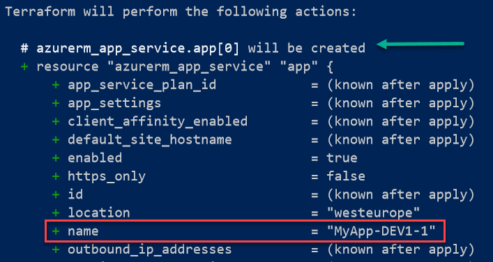
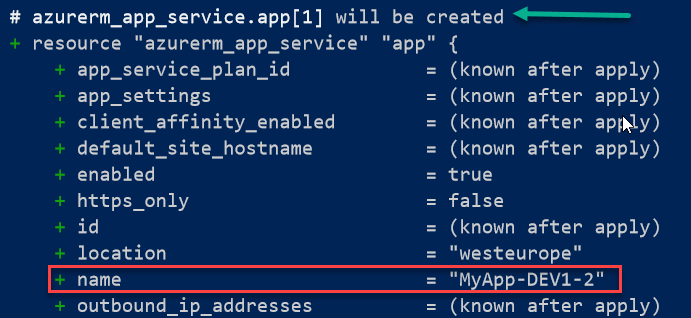
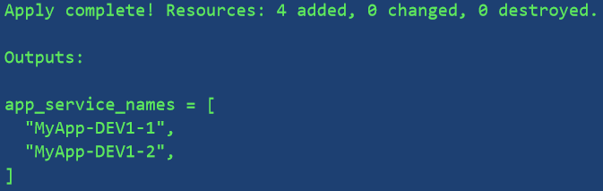
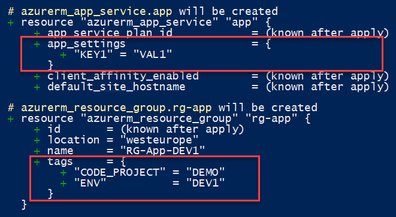
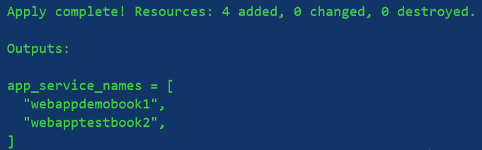
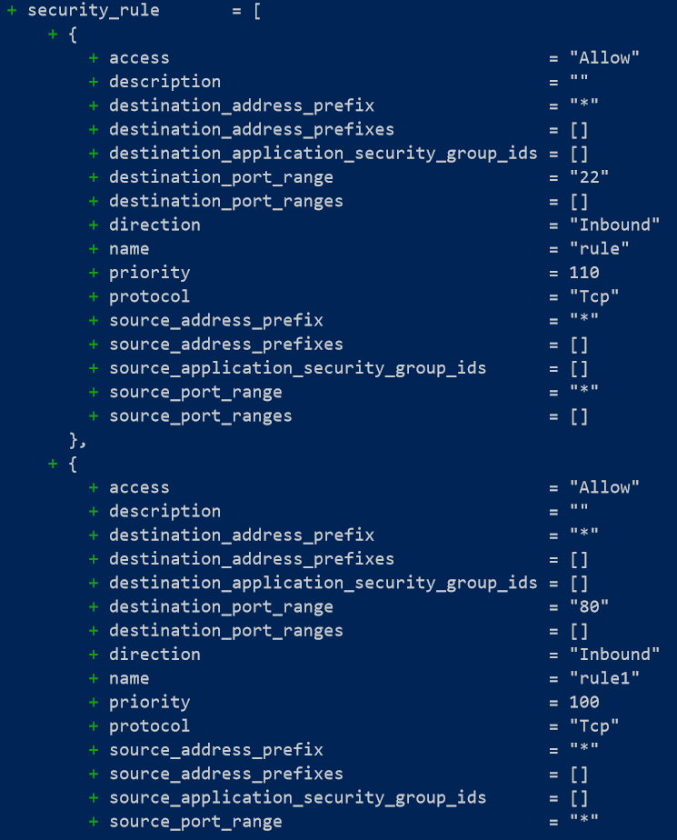

使用 Terraform 构建动态环境

在上一章中，我们学习了如何使用 Terraform 的语言概念高效地配置基础设施。**基础设施即代码**（**IaC**）的一个优势是，它允许你比手动配置更快地大规模部署基础设施。

在编写 IaC（基础设施即代码）时，同样重要的是应用开发人员多年来已经掌握的开发和清晰代码原则。

这些原则之一是 **不要重复自己**（**DRY**），意味着不重复代码 ([`thevaluable.dev/dry-principle-cost-benefit-example/`](https://thevaluable.dev/dry-principle-cost-benefit-example/))。在本章中，我们将学习如何使用 Terraform 语言中的表达式，如 count、maps、collections 和 dynamic。我们将了解这些概念将帮助我们编写简单的 Terraform 配置，以便为基础设施提供多个资源，而不需要重复代码。

本章将涵盖以下内容：

+   使用 count 属性配置多个资源

+   使用键值对变量的映射表

+   遍历对象集合

+   使用动态表达式生成多个块

# 第四章：技术要求

本章没有任何技术先决条件。然而，建议已阅读上一章内容。

本章的源代码可在 [`github.com/PacktPublishing/Terraform-Cookbook/tree/master/CHAP03`](https://github.com/PacktPublishing/Terraform-Cookbook/tree/master/CHAP03) 获取。

查看以下视频，查看代码的实际操作：[`bit.ly/2R5GSBN`](https://bit.ly/2R5GSBN)

# 使用 count 属性配置多个资源

在企业场景中，需要提供基础设施并考虑所谓的水平扩展性，即 *N* 个相同的资源，这些资源将减少单个资源（如计算实例）以及整个应用的负载。

我们将面临的挑战如下：

+   编写 Terraform 配置，无需为每个相同资源实例的配置重复代码

+   能够快速增加或减少这些资源的实例数量

在本食谱中，我们将看到 Terraform 如何使得快速配置 *N* 个资源实例成为可能，并且不会出现代码重复。

## 准备工作

首先，我们将使用一个 Terraform 配置，该配置允许我们配置一个 Azure App Service，它位于 `main.tf` 文件中，以下是其中的一个提取部分：

```
resource "azurerm_app_service" "app" {
  name                = "${var.app_name}-${var.environement}"
  location            = azurerm_resource_group.rg-app.location
  resource_group_name = azurerm_resource_group.rg-app.name
  app_service_plan_id = azurerm_app_service_plan.plan-app.id
}
```

本食谱的目的是应用并修改此 Terraform 配置，以配置 *N* 个 Azure App Service 实例，这些实例与在基础代码中已描述的实例相同，仅在名称上有细微差别，名称使用从 `1` 开始的递增索引号。

本配方的源代码可在[`github.com/PacktPublishing/Terraform-Cookbook/tree/master/CHAP03/count`](https://github.com/PacktPublishing/Terraform-Cookbook/tree/master/CHAP03/count)找到。

## 如何操作……

要创建多个相同的资源，请执行以下步骤：

1.  在`variables.tf`文件中，我们添加了以下变量：

```
variable "nb_webapp" {
    description = "Number of App Service to create"
}
```

1.  在`terraform.tfvars`文件中，我们为这个新变量提供了以下值：

```
nb_webapp = 2
```

1.  在`main.tf`文件中，我们以以下方式修改了`azurerm_app_service`资源的代码：

```
resource "azurerm_app_service" "app" {
  count = var.nb_webapp
  name = "${var.app_name}-${var.environement}-${count.index+1}"
  location = azurerm_resource_group.rg-app.location
  resource_group_name = azurerm_resource_group.rg-app.name
  app_service_plan_id = azurerm_app_service_plan.plan-app.id
}
```

1.  （可选：）在一个新的`outputs.tf`文件中，我们添加了以下代码来输出值：

```
output "app_service_names"{
 value = azurerm_app_service.app[*].name
}
```

## 它是如何工作的……

在*第 1 步*中，我们添加了一个`nb_webapp`变量，它将包含要写入的 Azure App Service 实例的数量，我们将在*第 2 步*中在`terraform.tfvars`文件中实例化该变量。

然后在*第 3 步*中，在`azurerm_app_service`资源中，我们添加了 Terraform 的`count`属性（该属性适用于所有资源和数据 Terraform 块），其值为之前创建的`nb_webapp`变量。

此外，在`azurerm_app_service`资源的`name`中，我们添加了一个后缀，表示当前`count`的索引，我们通过`count.index + 1`将索引递增 1（从 1 开始，而不是从 0 开始，以反映`count`索引从零开始的事实）。

最后，可选地，在*第 4 步*中，我们添加了一个输出，它将包含已配置的 App Service 实例的名称。

执行此配方的`terraform plan`命令时，`nb_webapp`变量等于`2`，我们可以看到已配置了两个 App Service 实例。

以下截图显示了此`terraform plan`命令的摘录，第一张图显示了第一个 App Service 的预览更改：



以下截图是`terraform plan`命令的延续，显示了第二个 App Service 实例的预览更改：



当更改应用时，输出将显示如下：



正如您在输出中看到的，我们有一个列表，其中包含生成的两个 App Service 实例的名称。

## 还有更多内容……

正如我们在上一章的*操作变量*配方中讨论的那样，我们还可以使用`terraform plan`和`apply`命令的`-var`选项，轻松增加或减少此资源的实例数量，而无需修改 Terraform 配置。

例如，在我们的案例中，我们可以使用以下`plan`和`apply`命令：

```
terraform plan -var "nb_webapp=5"
```

然而，使用这种选项，我们失去了基础设施即代码（IaC）的好处，即将所有内容写入代码中，从而拥有基础设施更改历史记录的优势。

此外，需要注意的是，降低`nb_webapp`值会将索引中的最后一部分资源移除，而无法移除位于索引中间的资源，这一点已经通过`for_each`表达式得到了改进，后者将在本章的*遍历对象集合*一节中讲解。

此外，感谢我们刚刚看到的`count`属性和我们在第二章*编写 Terraform 配置*一节中学习的条件表达式，我们可以通过动态方式使资源的配置变得可选，如下所示的代码片段所示：

```
resource "azurerm_application_insights" "appinsight-app" {
  count = use_appinsight == true ? 1 : 0
  ....
}
```

在这段代码中，我们已经告诉 Terraform，如果`use_appinsight`变量为`true`，那么`count`属性为`1`，这将允许我们配置一个 Azure Application Insights 资源。在相反的情况下，当`use_appinsight`变量为`false`时，`count`属性为`0`，此时，Terraform 不会提供 Application Insight 资源实例。

这样，Terraform 配置可以以通用方式用于所有环境或所有应用程序，并根据变量动态和有条件地进行配置。

这种技术，也称为**功能标志**，已被广泛应用于开发领域，但在这里我们看到，我们也可以将其应用于基础设施即代码（IaC）。

正如我们在本节中看到的，`count`属性允许您快速配置多个在特性上相同的资源。

我们将在本章的*遍历对象集合*一节中学习如何配置多个相同性质但具有不同属性的资源。

## 另见

有关`count`属性的更多信息，请参阅文档：[`www.terraform.io/docs/configuration/resources.html#count-multiple-resource-instances-by-count`](https://www.terraform.io/docs/configuration/resources.html#count-multiple-resource-instances-by-count)。

# 使用键值变量表和映射

到目前为止，在本书中，我们学习了使用标准变量类型（字符串、数字或布尔值）的示例代码。然而，Terraform 语言还有其他类型的变量，如列表、映射、元组，甚至更复杂的对象变量。

这些变量类型中包括映射（maps），它们由一组键值元素表示，并广泛用于编写动态且可扩展的 Terraform 配置。

映射有多种用途，具体如下：

+   将 Terraform 资源中一个块的所有属性放入一个单一变量中

+   为了避免声明多个**相同类型**的变量，从而将这些变量的所有值放入一个`map`类型的单一变量中

+   拥有一个键值参考表，用于在 Terraform 配置中使用的元素

在本节中，我们将看到一个使用映射变量来动态定义 Azure 资源所有标签的简单实用案例。

## 准备就绪

对于这个教程，我们从一个基本的 Terraform 配置开始，允许我们在 Azure 中创建一个资源组和一个应用服务实例。

这个教程的源代码可以在[`github.com/PacktPublishing/Terraform-Cookbook/tree/master/CHAP03/map`](https://github.com/PacktPublishing/Terraform-Cookbook/tree/master/CHAP03/map)上找到。

在这个教程中，我们将通过两个使用案例来演示如何使用映射，具体如下：

+   这个资源组的标签实现

+   应用服务的应用设置属性

## 如何做到这一点……

执行以下步骤：

1.  在`variables.tf`文件中，我们添加以下变量声明：

```
variable "tags" {
 type = map(string)
  description = "Tags"
  default = {}
}

variable "app_settings" {
  type = map(string)
  description = "App settings of the App Service"
  default = {}
}
```

1.  然后，在`terraform.tfvars`文件中，我们添加了以下代码：

```
tags = {
  ENV = "DEV1"
  CODE_PROJECT = "DEMO"
}

app_settings = {
  KEY1 = "VAL1"
}
```

1.  最后，我们修改`main.tf`文件，加入以下代码：

```
resource "azurerm_resource_group" "rg-app" {
  name = "${var.resource_group_name}-${var.environement}"
  location = var.location
  tags = var.tags
}

resource "azurerm_app_service" "app" {
  name = "${var.app_name}-${var.environement}"
  location = azurerm_resource_group.rg-app.location
  resource_group_name = azurerm_resource_group.rg-app.name
  app_service_plan_id = azurerm_app_service_plan.plan-app.id

  site_config {
    dotnet_framework_version = "v4.0"
  }
  app_settings = var.app_settings
}
```

## 它是如何工作的……

在*步骤 1*中，我们声明了两个变量，并指定了它们的类型，即`map (string)`。也就是说，它将由键值对类型的元素组成，其中值的格式为*string*。此外，考虑到这些变量可以省略，因此它们的值是可选的，我们为它们分配了一个空的默认值，即`{}`，用于`map`。

然后，在*步骤 2*中，我们用资源的标签以及应用服务的`app_settings`定义了这两个变量的值。

最后，在*步骤 3*中，我们在 Terraform 配置中使用这些变量，以提供资源组和应用服务。

下图展示了在这个教程中执行`terraform plan`命令的示例：



我们可以从前面的截图中看到，`app_settings`和`tags`属性已经填充了`map`变量的值。

## 还有更多……

因此，映射使我们能够简化资源中对象块的使用，但要小心——不能将变量放入`map`中。`map`类型的变量因此应该被视为一个单独的变量块。

为了进一步了解，我们可以看到也可以合并映射；也就是说，要合并两个映射，我们可以使用 Terraform 的原生`merge`函数。

接下来的步骤展示了如何使用这个函数合并应用服务的应用设置属性：

1.  在`variables.tf`文件中，我们创建了一个`custom_app_settings`变量，它将包含用户提供的自定义应用设置：

```
variable "custom_app_settings" {
 description = "Custom app settings"
 type = map(string)
 default = {}
}
```

1.  在`terraform.tfvars`文件中，我们用一个自定义映射实例化了这个变量：

```
custom_app_settings = {
 CUSTOM_KEY1 = "CUSTOM_VAL1"
}
```

1.  最后，在`main.tf`文件中，我们使用本地变量定义了默认的应用设置，并在`azurerm_app_service`资源中，使用`merge`函数将默认应用设置与自定义应用设置合并：

```
locals {
  default_app_settings = {
  "DEFAULT_KEY1" = "DEFAULT_VAL1"
  }
}

resource "azurerm_app_service" "app" {
  name = "${var.app_name}-${var.environement}"
  location = azurerm_resource_group.rg-app.location
  resource_group_name = azurerm_resource_group.rg-app.name
  app_service_plan_id = azurerm_app_service_plan.plan-app.id

  site_config {
    dotnet_framework_version = "v4.0"
    scm_type = "LocalGit"
  }

 app_settings = merge(local.default_app_settings,var.custom_app_settings)
}
```

在之前的代码中，我们定义了 Azure App Service 的默认应用设置属性，用户可以在需要时通过添加自定义应用设置来丰富这些设置。

此外，也可以在代码中动态创建一个`map`对象，而无需使用变量。

为此，我们可以使用 Terraform 集成的`{....}`语法，它将键值对列表作为参数，正如以下代码所示：

```
app_settings = {"KEY1" = "VAL1", "KEY2" = "VAL2"}

```

在这个食谱中，我们研究了映射的使用。但如果我们想使用具有不同类型键值对的更复杂的映射，那么我们将使用对象变量，具体内容可以参考文档 [`www.terraform.io/docs/configuration/types.html#object-`](https://www.terraform.io/docs/configuration/types.html#object-)。

在下面的食谱中，我们将讨论如何对构成映射变量的键值对列表进行迭代。

## 另见

与 merge 函数相关的文档可以在 [`www.terraform.io/docs/configuration/functions/merge.html`](https://www.terraform.io/docs/configuration/functions/merge.html)查看。

# 遍历对象集合

我们在本章的前几个食谱中已经看到了`count`属性的使用，它允许我们配置*N*个相同的资源，以及使用映射变量，它允许键值对象。

在这个食谱中，我们将讨论如何使用 Terraform 从 0.12 版本开始包含的循环功能来配置具有不同属性的*N*个相同类型的资源。

## 准备工作

要开始，我们从一个基本的 Terraform 配置开始，这个配置允许你在 Azure 中部署一个单一的 App Service。

基本的 Terraform 配置如下：

```
resource "azurerm_app_service" "app" {
  name = "${var.app_name}-${var.environement}"
  location = azurerm_resource_group.rg-app.location
  resource_group_name = azurerm_resource_group.rg-app.name
  app_service_plan_id = azurerm_app_service_plan.plan-app.id
}
```

这个食谱的源代码可以在 [`github.com/PacktPublishing/Terraform-Cookbook/tree/master/CHAP03/list_map`](https://github.com/PacktPublishing/Terraform-Cookbook/tree/master/CHAP03/list_map)找到。

## 如何操作…

执行以下步骤：

1.  在`variables.tf`文件中，我们添加以下 Terraform 配置：

```
variable "web_apps" {
  description = "List of App Service to create"
  type = any
}
```

1.  在`terraform.tfvars`文件中，我们添加以下配置：

```
web_apps = {
 webapp1 = {
 "name" = "webappdemobook1"
 "location" = "West Europe"
 "dotnet_framework_version" = "v4.0"
 "serverdatabase_name" = "server1"
 },

 webapp2 = {
 "name" = "webapptestbook2"
 "dotnet_framework_version" = "v4.0"
 "serverdatabase_name" = "server2"
 }
}
```

1.  在`main.tf`文件中，我们通过以下配置修改 App Service 的代码：

```
resource "azurerm_app_service" "app" {
 for_each = var.web_apps
  name = each.value["name"]
  location = lookup(each.value, "location", "West Europe")
  resource_group_name = azurerm_resource_group.rg-app.name
  app_service_plan_id = azurerm_app_service_plan.plan-app.id

  site_config {
   dotnet_framework_version = each.value["dotnet_framework_version"]
  }

  connection_string {
    name = "DataBase"
    type = "SQLServer"
    value = "Server=${each.value["serverdatabase_name"]};Integrated Security=SSPI"
  }
}
```

1.  最后，在`outputs.tf`文件中，我们添加以下代码：

```
output "app_service_names" {
  value = [for app in azurerm_app_service.app : app.name]
}
```

## 它是如何工作的…

在*步骤 1*中，我们声明了一个类型为`any`的新变量，也就是说，我们没有指定它的类型，因为它是复杂的。

值得注意的是，可以声明复杂的变量。虽然这会使代码更加冗长，但在验证时非常有帮助。

在*步骤 2*中，我们通过一个包含映射对象列表的变量实例化它，这些对象将成为每个 App Service 的属性。在这个列表中，我们有两个 App Service 实例，我们指定了框架名称、版本、Azure 区域位置以及应用程序数据库服务器名称等属性，这些属性将被用于 App Service。

在*步骤 3*中，在`azurerm_app_service`资源中，我们不再使用`count`属性，而是使用`for_each`表达式（这是 Terraform 0.12 版本中引入的），它允许我们对列表进行循环。

然后，对于`azurerm_app_service`资源的每个属性，我们可以使用简短表达式`each.value["<property name>"]`或 Terraform 中集成的`lookup`函数，该函数接受以下参数：

+   `for_each`表达式的当前元素为`each.value`，即列表中的这一行。

+   映射中属性的名称，在我们的示例中是`location`。

+   然后是`lookup`函数的第三个参数，它是可选的。它允许你指定在属性不存在于映射中时使用的值。我们使用的是 Azure 西欧地区，这是默认值。

最后，在*步骤 4*中，我们创建了一个输出，使用`for`表达式遍历已配置的资源列表，并将它们的名称作为输出导出。

这个输出的结果如下图所示：



在之前的截图中，我们可以看到输出的结果，它在控制台中显示了两个已配置的 Azure App Service 实例的名称。

## 还有更多……

在本例中，我们学习了 Terraform 语言中的表达式和函数，允许对资源集合进行配置。

我建议你仔细阅读关于`for`和`for_each`表达式的文章和文档。至于`lookup`和`element`函数，它们是可以使用的，但最好使用本地语法（例如`var_name[42]`和`var_map["key"]`）来访问映射、列表或集合的元素。

很明显，在本例中，我们使用了简单的资源，如 Azure App Service，但这些方法也可以应用于更富属性的资源，如虚拟机。

## 另见

+   关于`for`和`for_each`循环的文档可以在[`www.terraform.io/docs/configuration/resources.html`](https://www.terraform.io/docs/configuration/resources.html)找到，关于这些循环的文章可以在[`www.hashicorp.com/blog/hashicorp-terraform-0-12-preview-for-and-for-each/`](https://www.hashicorp.com/blog/hashicorp-terraform-0-12-preview-for-and-for-each/)找到。

+   关于`lookup`函数的文档可以在[`www.terraform.io/docs/configuration/functions/lookup.html`](https://www.terraform.io/docs/configuration/functions/lookup.html)找到。

# 使用动态表达式生成多个块

Terraform 资源由以下元素定义：

+   以`property name = value`形式出现的属性，这在本书中已经看到过好几次

+   表示属性分组的块，例如`azurerm_app_service`资源中的`site_config`块

根据 Terraform 资源的不同，一个区块可以在同一资源中出现一次，甚至多次，例如 `azurerm_network_security_group` 资源中的 `security_rule` 区块（例如，参见文档：[`www.terraform.io/docs/providers/azurerm/r/network_security_group.html`](https://www.terraform.io/docs/providers/azurerm/r/network_security_group.html)）。

在 Terraform 0.12 之前，无法通过动态方式在同一资源中多次呈现这些区块，例如使用 `list` 类型的变量。

Terraform 0.12 的一个重要新特性是新的 `dynamic` 表达式，它允许我们在资源中循环处理区块。

在本食谱中，我们将看到如何使用动态表达式在 Azure 中配置一个 `azurerm_network_security_group` 资源，其中包含一组安全规则。

## 准备工作

要开始使用，我们不需要任何基础的 Terraform 配置。在本食谱中，我们将使用一个 Terraform 文件，允许我们创建一个 Azure 资源组，在其中我们将创建一个网络安全组。

本食谱的源代码可以在 [`github.com/PacktPublishing/Terraform-Cookbook/tree/master/CHAP03/dynamics`](https://github.com/PacktPublishing/Terraform-Cookbook/tree/master/CHAP03/dynamics) 找到。

## 如何做到这一点…

要使用动态表达式，请执行以下步骤：

1.  在 `variables.tf` 文件中，我们添加以下代码：

```
variable "ngs_rules" {
 description = "List of NSG rules"
 type = any
}
```

1.  在 `terraform.tfvars` 文件中，我们添加以下代码：

```
ngs_rules = [
 {
 name = "rule1"
 priority = 100
 direction = "Inbound"
 access = "Allow"
 protocol = "Tcp"
 source_port_range = "*"
 destination_port_range = "80"
 source_address_prefix = "*"
 destination_address_prefix = "*"
 }, 
 {
 name = "rule"
 priority = 110
 direction = "Inbound"
 access = "Allow"
 protocol = "Tcp"
 source_port_range = "*"
 destination_port_range = "22"
 source_address_prefix = "*"
 destination_address_prefix = "*"
 }
]
```

1.  在 `main.tf` 文件中，我们使用以下代码添加网络安全组（Network Security Group）：

```
resource "azurerm_network_security_group" "example" {
  name = "acceptanceTestSecurityGroup1"
  location = azurerm_resource_group.rg.location
  resource_group_name = azurerm_resource_group.rg.name

 dynamic "security_rule" {
     for_each = var.ngs_rules
     content {
      name = security_rule.value["name"]
      priority = security_rule.value["priority"]
      direction = security_rule.value["direction"]
      access = security_rule.value["access"]
      protocol = security_rule.value["protocol"]
      source_port_range = security_rule.value["source_port_range"]
      destination_port_range = security_rule.value["destination_port_range"]
      source_address_prefix = security_rule.value["source_address_prefix"]
      destination_address_prefix = security_rule.value["destination_address_prefix"]
     }
  }
}
```

## 它是如何工作的…

在 *步骤 1* 中，我们创建了一个类型为 `any` 的 `nsg_rules` 变量，它将包含以映射格式表示的规则列表。

然后，在 *步骤 2* 中，我们实例化了这个 `nsg_rules` 变量，并传入规则列表及其属性。

最后，在 *步骤 3* 中，在 `azurerm_network_security_group` 资源中，我们添加了 `dynamic` 指令，这使我们能够生成 *N* 个 `security_rule` 区块。

在这个 `dynamic` Terraform 表达式中，我们使用了一个 `for_each` 循环（如本章前面的 *循环遍历对象集合* 食谱中所示），它将迭代 `nsg_rules` 变量的每一行，并将资源的每个属性映射到列表的映射中。

以下截图显示了 `terraform plan` 命令的执行：



我们可以在前面的输出中看到安全规则的列表。

## 还有更多内容…

如果你想有条件地呈现一个区块的存在，你也可以使用 `dynamic` 表达式中的条件，如下所示：

```
resource "azurerm_linux_virtual_machine" "virtual_machine" {
...
  dynamic "boot_diagnostics" {
     for_each = local.use_boot_diagnostics == true ? [1] : []
     content {
     storage_account_uri = "https://storageboot.blob.core.windows.net/"
     }
  }
}
```

在这个例子中，在 `dynamic` 表达式的 `for_each` 表达式中，我们有一个条件，如果本地值 `use_boot_diagnostics` 为 true，则返回一个包含一个元素的列表。否则，这个条件返回一个空列表，这样就不会在 `azurerm_virtual_machine` 资源中出现 `boot_diagnostics` 区块。

## 另见

+   关于动态表达式的文档可以在[`www.terraform.io/docs/configuration/expressions.html#dynamic-blocks`](https://www.terraform.io/docs/configuration/expressions.html#dynamic-blocks)找到。

+   另一个关于动态表达式的 Terraform 指南示例可以在[`github.com/hashicorp/terraform-guides/tree/master/infrastructure-as-code/terraform-0.12-examples/advanced-dynamic-blocks`](https://github.com/hashicorp/terraform-guides/tree/master/infrastructure-as-code/terraform-0.12-examples/advanced-dynamic-blocks)找到。
