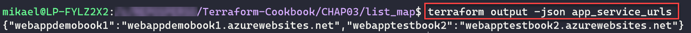

使用 Terraform CLI

Terraform 是一个**基础设施即代码**（**IaC**）工具，由两个相关的元素组成：用 **HashiCorp 配置语言**（**HCL**）编写的 Terraform 配置，描述了我们要提供的基础设施，以及 Terraform 客户端工具，它将分析并执行我们的 Terraform 配置。在前两章中，我们已经学习了如何使用变量、函数和 HCL 表达式来编写 Terraform 配置的多种方案。

本章将重点介绍 Terraform 的命令行和选项的使用。我们将讨论如何让代码格式规范、资源销毁和工作空间的使用。接着，我们将学习如何导入已存在的资源、标记功能，最后我们将看到如何生成依赖图并调试 Terraform 的执行。

本章将涵盖以下食谱：

+   保持 Terraform 配置的清洁

+   验证代码语法

+   销毁基础设施资源

+   使用工作空间来管理环境

+   导入现有资源

+   以 JSON 格式导出输出

+   标记资源

+   生成图形依赖关系

+   调试 Terraform 执行

# 技术要求

与前两章相反，本章提供的代码示例不是基础性的，因为我们将专注于 Terraform 命令行的执行。

本章为了提供 Terraform 配置示例，我们将在 Azure 云中管理资源；显然，这也适用于所有其他 Terraform 提供商。如果你想应用这些方案而且没有 Azure 账户，你可以在以下网站免费创建一个 Azure 账户：[`azure.microsoft.com/en-us/free/`](https://azure.microsoft.com/en-us/free/)

本章中的代码示例可以在这里找到：

[`github.com/PacktPublishing/Terraform-Cookbook/tree/master/CHAP04`](https://github.com/PacktPublishing/Terraform-Cookbook/tree/master/CHAP04)

查看以下视频，了解代码的实际操作：[`bit.ly/3m3oho7`](https://bit.ly/3m3oho7)

# 保持 Terraform 配置的清洁

在任何有代码的应用中，代码的整洁和易读性对于所有参与维护和发展这段代码的贡献者（当前和未来）至关重要。

在基础设施即代码（IaC）和 Terraform 中，代码清晰非常重要，因为编写的代码作为文档是 IaC 的一个优势。

在本节中，我们将了解如何使用 Terraform 的命令行来正确格式化代码，同时还会看到一些自动化的技巧。

## 准备工作

为了开始，我们将从一个包含以下 Terraform 配置的 `main.tf` 文件开始：


如我们所见，这段代码并不太易读；它需要更好的格式化。

要通过 CLI 执行 Terraform 命令，我们使用命令行终端（CMD、PowerShell、Bash 等），执行文件夹将是包含本教程 Terraform 配置的文件夹。这适用于本章中的所有教程。

## 如何操作……

为了修复代码的缩进，按如下方式执行 `terraform fmt` 命令：

```
terraform fmt
```

## 它是如何工作的……

`terraform fmt` 命令使得以正确的缩进整理代码变得更加容易。

执行结束时，此命令会显示已修改的文件列表，如下图所示：


我们可以看到，执行 `terraform fmt` 命令修改了我们的 `main.tf` 文件。

然后，我们打开 `main.tf` 文件并阅读：


我们可以在上面的截图中看到，代码已经被很好地缩进，因此更易于阅读。

## 还有更多……

在本教程中，我们已经了解了以最基本的方式执行的 `terraform fmt` 命令，即不带任何附加选项的情况。

这个默认命令会缩进当前文件夹根目录下的 Terraform 文件代码。我们也可以递归执行此命令，也就是说，它还可以缩进当前文件夹下子文件夹中的代码。

为此，我们执行带有 `-recursive` 选项的 `terraform fmt` 命令，输出如以下截图所示：


我们看到命令也格式化了 `sub` 文件夹中的 `main.tf` 文件。

除了此命令的其他选项外，还有 `-check` 选项，可以添加此选项来预览将要缩进的文件，而不应用更改到文件中。

最后，我们也可以自动化执行此命令，因为除了像本教程中所示的那样手动在命令终端运行外，我们还可以将其自动化，以确保每次在 Git 中保存或提交文件时，与其他贡献者共享的代码始终保持正确的缩进。

因此，支持 Terraform 的集成开发环境（IDE）已经将此命令的执行与代码编写原生集成：

+   使用 Visual Studio Code 的 Terraform 扩展，我们可以让每个 Terraform 文件在保存时都使用 `terraform fmt` 命令进行格式化。欲了解更多信息，请参阅相关文档：[`marketplace.visualstudio.com/items?itemName=HashiCorp.terraform`](https://marketplace.visualstudio.com/items?itemName=HashiCorp.terraform)。

+   在 IntelliJ 中，Save action 插件使得每次保存代码时都能自动格式化，而**Terraform**插件则在 IDE 中大范围集成了 `terraform fmt` 命令。此外，使用这个 Terraform 插件，我们可以在每次代码提交时执行 `terraform fmt` 命令并整理代码，如下图所示：


有关 Save action 插件的更多信息，请参考[`plugins.jetbrains.com/plugin/7642-save-actions`](https://plugins.jetbrains.com/plugin/7642-save-actions)，有关 Terraform 插件的信息，请参考[`plugins.jetbrains.com/plugin/7808-hashicorp-terraform--hcl-language-support`](https://plugins.jetbrains.com/plugin/7808-hashicorp-terraform--hcl-language-support)。

对于 Git 提交，可以通过使用 Git 的预提交钩子，自动执行每次提交前的`terraform fmt`命令：[`git-scm.com/book/en/v2/Customizing-Git-Git-Hooks`](https://git-scm.com/book/en/v2/Customizing-Git-Git-Hooks)。

要在 Terraform 中使用预提交，请参阅*Gruntwork*提供的钩子列表：[`github.com/gruntwork-io/pre-commit`](https://github.com/gruntwork-io/pre-commit)。

## 参见

完整的`terraform fmt`命令文档可以在此处找到：[`www.terraform.io/docs/commands/fmt.html`](https://www.terraform.io/docs/commands/fmt.html)。

# 验证代码语法

在编写 Terraform 配置时，重要的是能够在执行代码之前，甚至在将代码存档到 Git 仓库之前验证我们编写的代码语法。

在本教程中，我们将展示如何使用 Terraform 客户端工具检查 Terraform 配置的语法。

## 准备工作

对于此教程，我们将从以下 Terraform 配置开始，该配置写在`main.tf`文件中：


我们在前面的代码中注意到，`environment`变量的声明缺失。

## 如何操作…

要验证我们的 Terraform 配置语法，请执行以下步骤：

1.  首先，通过运行以下命令初始化 Terraform 上下文：

```
terraform init
```

1.  然后，通过执行`validate`命令来验证代码：

```
terraform validate
```

## 它是如何工作的…

在*步骤 1*中，我们通过执行`terraform init`命令来初始化 Terraform 上下文。

然后，我们通过执行`terraform validate`命令来检查代码的有效性。

在执行此命令的末尾，我们得到以下输出：


我们看到 Terraform 配置中存在一个语法错误，提示我们调用了未声明的变量`var.environment`。

所以，我们修正代码并再次运行`terraform validate`命令，直到没有更多错误，如下截图所示：


输出结果显示 Terraform 配置有效。

## 还有更多…

这个验证命令在本地开发模式中非常有用，也可以用于代码集成中的**持续集成**（**CI**）流水线中，这样在`terraform validate`命令返回语法错误时，就不会执行`terraform plan`命令。

以下是 PowerShell 代码示例，显示了执行此命令后的返回代码：

```
> terraform validate
> $LASTEXITCODE
```

PowerShell 变量 `$LASTEXITCODE`，这是 PowerShell 的本地变量，如果没有错误，它将返回 `0`，如果有错误则返回 `1`。

也可以通过向此命令添加 `-json` 选项，以 JSON 格式获取该命令的输出，如下图所示：


然后，JSON 结果可以使用第三方工具如 **jq** 进行解析，并在工作流中使用。

然而需要注意的是，这个命令仅允许验证配置的语法，例如正确使用函数、变量和对象类型，而不是验证 Terraform 配置执行的结果。

如果 Terraform 配置中包含 `backend` 块，那么在验证该配置时，我们不需要连接到该状态文件。我们可以在 `terraform init` 命令中添加 `-backend=false` 选项。

最后，如果执行此 Terraform 配置时需要通过 `-var` 参数或 `-var-file` 选项传递变量，则无法使用此命令。相反，使用 `terraform plan` 命令，该命令在执行过程中会进行验证。

## 另请参见

`terraform validate` 命令的文档可以在这里查看: [`www.terraform.io/docs/commands/validate.html`](https://www.terraform.io/docs/commands/validate.html)

# 销毁基础设施资源

正如我们在本书中多次提到的，基础设施即代码（IaC）允许快速配置基础设施。

IaC 的另一个优点是它可以快速构建并清理已配置的资源。

事实上，我们可能需要因不同原因清理基础设施。以下是一些示例：

+   我们销毁基础设施是为了根据新的规格重新构建它，使其更好。

+   我们提供的是按需调用的基础设施，这意味着它是为特定需求（例如测试新特性或新分支）而临时搭建的。并且该基础设施必须能够快速、自动地构建和销毁。

+   我们希望移除一个不再使用的基础设施，并同时停止为其付费。

在本示例中，我们将讨论如何销毁已通过 Terraform 配置的基础设施。

## 准备工作

要开始，我们将提供一个由 Azure App Service 组成的基础设施。

为此，我们使用的 Terraform 配置可以在这里找到: [`github.com/PacktPublishing/Terraform-Cookbook/tree/master/CHAP04/sample-app`](https://github.com/PacktPublishing/Terraform-Cookbook/tree/master/CHAP04/sample-app)

然后，为了配置它，我们执行以下基本的 Terraform 工作流命令：

```
> terraform init
> terraform plan -out="app.tfplan"
> terraform apply "app.tfplan"
```

在执行结束时，我们将在 Azure 中得到一个资源组、一个服务计划、一个应用服务和一个应用洞察资源。

本示例的目标是通过 Terraform 命令完全销毁此基础设施。

## 如何操作…

使用 Terraform 清理资源，请执行以下步骤：

1.  首先，通过运行`init`命令初始化 Terraform 上下文：

```
terraform init
```

1.  然后，为了清理资源，我们执行以下命令：

```
terraform destroy
```

在执行的开始，此命令会显示所有将被销毁的资源，并要求确认删除资源。然后通过输入`yes`来确认验证。

## 它是如何工作的…

在*步骤 2*中，我们通过执行`terraform destroy`命令来销毁所有已配置的资源。

以下截图显示了该命令的提取输出：


在命令执行结束时，Terraform 报告资源已成功销毁。

## 还有更多内容…

在本食谱中，我们研究了如何销毁所有已描述并由 Terraform 配置提供的资源。

由于`terraform destroy`命令会删除 Terraform 状态文件中跟踪的所有资源，因此重要的是通过将 Terraform 配置拆分为多个状态文件来减少更改基础设施时发生错误的可能性。

如果您只需要销毁一个单独的资源，而不是销毁状态文件中跟踪的所有资源，可以将`-target`选项添加到`terraform destroy`命令中，允许您指定要删除的资源。以下是带有`target`选项的命令示例：

```
terraform destroy -target azurerm_application_insights.appinsight-app
```

在此示例中，仅销毁了 Application Insights 资源。更多详细信息，请在此查看相关文档：[`www.terraform.io/docs/commands/plan.html#resource-targeting`](https://www.terraform.io/docs/commands/plan.html#resource-targeting)

请注意，定位机制应仅在最后手段下使用。在理想情况下，配置应与状态文件保持同步（应用时不带任何额外的`target`标志）。执行目标应用或销毁操作的风险在于，其他贡献者可能会错过上下文，更重要的是，在更改配置后，进行进一步更改将变得更加困难。

此外，如果此 Terraform 配置中的`terraform plan`命令需要`-var-file`选项来指定或覆盖变量的值，则必须在`terraform destroy`命令中也添加相同的选项。

在大多数情况下，适用于`terraform plan`命令的所有选项也适用于`terraform destroy`命令。

## 另请参见

+   与`terraform destroy`命令相关的文档可以在这里查看：[`www.terraform.io/docs/commands/destroy.html`](https://www.terraform.io/docs/commands/destroy.html)

+   与资源定位相关的文档可以在这里查看：[`www.terraform.io/docs/internals/resource-addressing.html`](https://www.terraform.io/docs/internals/resource-addressing.html)

# 使用工作区来管理环境

在 Terraform 中，有 **工作区** 的概念，允许使用相同的 Terraform 配置来构建多个环境。

每个配置将写入不同的 Terraform 状态文件，因此会与其他配置隔离开。工作区可以用来创建多个基础设施环境。

本教程中，我们将研究在 Terraform 配置中使用 Terraform 工作区，并执行 Terraform 命令。

## 准备工作

本教程的目的是让一个应用程序为它的每个环境（`dev` 和 `prod`）创建一个资源组。

关于 Terraform 配置，没有必要的前提条件。我们将在步骤中看到它。

本教程的 Terraform 配置可以在此查看：[`github.com/PacktPublishing/Terraform-Cookbook/tree/master/CHAP04/workspaces`](https://github.com/PacktPublishing/Terraform-Cookbook/tree/master/CHAP04/workspaces)

## 如何做...

要管理 Terraform 工作区，请执行以下步骤：

1.  在新的 `main.tf` 文件中，我们编写以下 Terraform 配置：

```
resource "azurerm_resource_group" "rg-app" {
  name     = "RG-APP-${terraform.workspace}"
  location = "westeurope"
}
```

1.  在命令终端中，我们进入包含此 Terraform 配置的文件夹，并执行以下命令：

```
terraform workspace new dev
```

1.  要配置 `dev` 环境，我们运行 Terraform 工作流的基本命令，具体如下：

```
> terraform init
> terraform plan -out="outdev.tfplan"
> terraform apply "outdev.tfplan"
```

1.  然后，我们执行 `workspace new` 命令，创建生产工作区，命名为 `prod`：

```
terraform workspace new prod
```

1.  要完成并配置 `prod` 环境，我们执行 Terraform 工作流生产的基本命令，具体如下：

```
> terraform init
> terraform plan -out="outprod.tfplan"
> terraform apply "outprod.tfplan"
```

## 它是如何工作的…

在 *步骤 1* 中，我们在 Terraform 配置中提供了一个 Azure 资源组，它的名称由 `RG-APP` 前缀和动态后缀 `terraform.workspace` 组成，后缀将是我们即将创建的工作区的名称。

在 *步骤 2* 中，我们创建与 `dev` 环境对应的工作区，为此我们使用 `terraform workspace new` 命令，后跟工作区名称（在本例中为 `dev`）。

一旦创建，Terraform 会自动将其放入该工作区，如下图所示：


创建工作区后，我们只需执行 Terraform 工作流的基本命令，这些命令在 *步骤 3* 中执行。

请注意，这里我们已经在 `terraform plan` 命令中添加了 `-out` 选项，以将计划的结果保存在 `outdev.tfplan` 文件中。然后，为了应用这些更改，我们特别将此文件作为参数添加到 `terraform apply` 命令中。

然后，为了配置 `prod` 环境，我们完全按照 *步骤 2* 和 *步骤 3* 进行，但这次创建名为 `prod` 的工作区。

在执行完所有这些步骤后，我们可以在 Azure 门户中看到，我们有两个资源组，它们在后缀中包含了工作区的名称，如下图所示：


此外，我们还注意到创建了两个 Terraform 状态文件，每个工作空间一个，它们是自动创建的，如下图所示：


在这张截图中，我们可以看到两个`terraform.tfstate`文件，一个位于`dev`目录，另一个位于`prod`目录。

## 还有更多…

在任何 Terraform 配置执行中，都有一个默认的工作空间，名称为`default`。

可以通过执行以下命令查看我们代码中的工作空间列表：

```
terraform workspace list
```

以下截图展示了在我们的案例中执行此命令的过程：


我们可以清晰地看到我们的`dev`和`prod`工作空间，并且当前的工作空间是`prod`（在其名称前标有`*`）。

如果您想切换到另一个工作空间，请执行`terraform workspace select`命令，后面跟上要选择的工作空间名称；例如：

```
terraform workspace select dev
```

最后，您还可以通过执行`terraform workspace delete`命令删除一个工作空间，后面跟上要删除的工作空间名称；例如：

```
terraform workspace delete dev
```

在删除工作空间时要小心，确保它不会删除关联的资源。因此，为了删除工作空间，您必须先使用`terraform destroy`命令删除该工作空间提供的资源。否则，如果未执行此操作，您将无法使用 Terraform 管理这些资源，因为该工作空间的 Terraform 状态文件将被删除。

此外，默认情况下，不可能删除状态文件非空的工作空间。但是，我们可以通过在`terraform workspace delete -force`命令中添加`-force`选项，强制销毁该工作空间，相关文档请见：[`www.terraform.io/docs/commands/workspace/delete.html`](https://www.terraform.io/docs/commands/workspace/delete.html)。

## 另见

+   工作空间的一般文档可以在这里找到：[`www.terraform.io/docs/state/workspaces.html`](https://www.terraform.io/docs/state/workspaces.html)

+   `terraform workspace`命令的 CLI 文档可以在这里找到：[`www.terraform.io/docs/commands/workspace/index.html`](https://www.terraform.io/docs/commands/workspace/index.html)

+   阅读这篇博客文章，了解更多关于工作空间的完整使用方法：[`www.colinsalmcorner.com/terraform-all-the-things-with-vsts/`](https://www.colinsalmcorner.com/terraform-all-the-things-with-vsts/)

# 导入现有资源

到目前为止，在本书中，我们已经看到了 Terraform 的正常使用方法，即编写 Terraform 配置并由 Terraform 执行和应用。此执行将配置或应用对基础设施的更改，并会反映在 Terraform 状态文件中。

然而，在某些场景中，可能需要将已经配置好的资源导入到 Terraform 状态文件中。这类场景的例子包括：

+   资源已经手动（或通过脚本）配置好，现在希望它们的配置出现在 Terraform 配置文件和状态文件中。

+   如果包含基础设施配置的 Terraform 状态文件已损坏或丢失，且需要重新生成，可以采取此步骤。

在本教程中，我们将讨论如何借助 Terraform 命令，将已经配置好的资源导入到 Terraform 状态文件中。

## 准备工作

对于这个教程，我们将使用我们已经编写的以下 Terraform 配置，以便为资源组进行配置：

```
resource "azurerm_resource_group" "rg-app" {
  name     = "RG-APP-IMPORT"
  location = "westeurope"
}
```

这段代码也可以在这里找到：[`github.com/PacktPublishing/Terraform-Cookbook/tree/master/CHAP04/import`](https://github.com/PacktPublishing/Terraform-Cookbook/tree/master/CHAP04/import)

同时，在 Azure 门户中，我们已手动创建了名为`RG-APP-IMPORT`的资源组，如相关文档中所述：[`docs.microsoft.com/en-us/azure/azure-resource-manager/management/manage-resource-groups-portal`](https://docs.microsoft.com/en-us/azure/azure-resource-manager/management/manage-resource-groups-portal)

以下截图显示了 Azure 中的该资源组：


此时，如果我们在此代码上运行 Terraform，`terraform apply`命令将尝试创建此资源组。它会失败并返回错误，提示资源组已经存在，无法创建，如下截图所示：


因此，有必要直接在 Terraform 状态文件中使用资源导入。

在这个教程中，我们将执行一个导入操作，将一个资源组导入到 Azure 中。但需要注意的是，每个 Terraform 提供者对`import`命令有不同的目标参数。

本教程的目标是将该资源组的配置导入到与我们的 Terraform 配置相对应的 Terraform 状态文件中。

## 如何操作…

执行以下步骤：

1.  我们通过执行`init`命令初始化 Terraform 环境：

```
terraform init
```

1.  然后，我们执行以下`terraform import`命令：

```
terraform import azurerm_resource_group.rg-app /subscriptions/8a7aace5-xxxxx-xxx/resourceGroups/RG-APP-IMPORT
```

## 它是如何工作的…

在*步骤 1*中，使用`terraform init`命令初始化 Terraform 环境。

然后，在*步骤 2*中，我们执行`terraform import`命令，将 Terraform 资源的引用作为第一个参数，Azure 中资源组的标识符作为第二个参数。

以下截图显示了执行此命令的输出结果：


我们可以看到资源确实已被导入到 Terraform 状态文件中。

现在，我们已经更新了 Terraform 配置、Terraform 状态文件以及 Azure 中的资源。

## 还有更多内容…

为了检查资源导入的执行情况，我们执行`terraform plan`命令，并且必须确保没有任何更改要求，如下截图所示：


如果你在 Azure 中预置资源，有一些相当有趣的工具可以从已创建的 Azure 资源生成 Terraform 配置和相应的 Terraform 状态文件。这个开源工具**Az2Tf**可以在[`github.com/andyt530/py-az2tf`](https://github.com/andyt530/py-az2tf)找到。或者，**TerraCognita**也可以在[`github.com/cycloidio/terracognita/blob/master/README.md`](https://github.com/cycloidio/terracognita/blob/master/README.md)找到。

## 另见

有关`import`命令的文档可以在这里找到：[`www.terraform.io/docs/commands/import.html`](https://www.terraform.io/docs/commands/import.html)

# 以 JSON 格式导出输出

我们在第三章的*遍历对象集合*食谱中讨论了 Terraform 输出的使用，这允许你在执行 Terraform 配置时拥有输出值。实际上，我们已经了解了如何在 Terraform 配置中声明输出，并且我们知道这些输出及其值会在执行`terraform apply`命令结束时显示出来。

这些输出的优势在于它们可以被程序检索，从而用于其他操作；例如，在 CI/CD 流水线中。

在本食谱中，我们将看到如何以 JSON 格式检索输出的值，以便它们可以在外部程序中使用。

## 准备工作

在本教程中，我们将仅使用我们在第三章中学习过的 Terraform 配置，相关源代码可以在这里找到：[`github.com/PacktPublishing/Terraform-Cookbook/tree/master/CHAP03/list_map`](https://github.com/PacktPublishing/Terraform-Cookbook/tree/master/CHAP03/list_map)

在这段代码中，我们添加了另一个输出，它返回 App Service URL 的列表，如下所示：

```
output "app_service_urls" {
  value = {for x in azurerm_app_service.app :  x.name => x.default_site_hostname  }
}
```

要利用输出的值，我们需要使用一个可以处理 JSON 的工具。为此，你可以根据你的脚本语言使用任何框架和库。在本食谱中，我们将使用**jq**，这是一款免费工具，可以让你在命令行中轻松操作 JSON。关于 jq 的文档可以在这里找到：[`stedolan.github.io/jq/`](https://stedolan.github.io/jq/)

本教程的目的是使用 Terraform 配置预置两个 Azure 应用服务，并通过脚本对第一个应用服务的 URL 进行响应检查。

## 如何操作…

执行以下步骤以使用输出结果：

1.  执行以下命令以运行 Terraform 工作流：

```
> terraform init
> terraform plan -out="app.tfplan"
> terraform apply "app.tfplan"
```

1.  然后，运行 `terraform output` 命令：

```
terraform output
```

1.  最后，为了获取创建的应用服务的 URL，我们在命令终端执行以下命令：

```
urlwebapp1=$(terraform output -json | jq -r .app_service_urls.value.webappdemobook1) &&
curl -sL "%{http_code}" -I "$urlwebapp1/hostingstart.html"
```

## 它是如何工作的…

在 *步骤 1* 中，我们执行 Terraform 工作流的基本命令。执行 `terraform apply` 命令后，命令会显示输出结果。

然后，在 *步骤 2* 中，我们通过执行 `terraform output` 命令来更清晰地查看此 Terraform 配置的输出，如下图所示：


在上面的截图中，我们可以看到此命令返回了代码中声明的两个输出，它们如下：

+   `app_service_names`：返回提供的应用服务名称列表。

+   `app_service_urls`：返回已配置应用服务的 URL 列表。

最后，在 *步骤 3* 中，我们运行一个脚本来检查 `webappdemobook1` 应用服务的 URL。在此脚本的第一行，我们执行 `terraform output -json` 命令，这样输出结果会以 JSON 格式返回，正如下面的截图所示：


然后，使用这个 JSON 结果，我们通过获取 `webappdemobook1` 应用服务的 URL 来使用 **jq** 工具。返回的 URL 被存储在一个名为 `urlwebapp1` 的变量中。

然后，在此脚本的第二行，我们通过传递选项使用 `curl` 命令对这个 URL 进行操作，返回该 URL 的 HTTP 头信息。

执行此脚本的结果显示在以下截图中：


你可以看到检查结果为 `OK`，状态码为 `200`。

## 还有更多…

在这个教程中，我们学习了如何获取 Terraform 配置的所有输出。也可以通过执行 `terraform output <输出名称>` 命令来获取特定输出的值。

在我们的例子中，我们本可以执行 `app_service_urls` 命令来显示输出的值：

```
terraform output app_service_urls
```

以下截图展示了这个命令的执行情况：



然后，我们运行以下命令来检查 URL：

```
urlwebapp1=$(terraform output app_service_urls -json | jq -r .webappdemobook1) &&
curl -sL "%{http_code}" -I "$urlwebapp1/hostingstart.html"
```

我们在这个脚本中看到，使用的命令是 `terraform output app_service_urls -json`，比 `$(terraform output -json | jq -r .app_service_urls.value.webappdemobook1)` 更简洁。

## 另见

+   `terraform output` 命令的文档可以在这里找到：[`www.terraform.io/docs/commands/output.html`](https://www.terraform.io/docs/commands/output.html)

+   jq 的官网可以在这里找到：[`stedolan.github.io/jq/`](https://stedolan.github.io/jq/)

# 污点资源

之前，在 *销毁基础设施资源* 章节中，我们学习了如何销毁通过 Terraform 配置的资源。

然而，在某些情况下，你可能需要销毁特定的资源，以便立即重新创建它。此类情况的示例可能包括该资源已手动修改。

要销毁并重新创建一个资源，你可以执行 `terraform destroy -target <resource>` 命令，然后执行 `apply` 命令。然而，问题在于，在 `destroy` 和 `apply` 命令之间，Terraform 配置中可能会有其他变更被应用，而这些变更是我们不希望有的。

因此，在本教程中，我们将展示如何使用 Terraform 的 taint 概念来执行此操作。

## 正在准备中

为了应用本教程，我们首先提供了由资源组、服务计划、App Service 和应用洞察资源组成的基础设施。用于此提供的 Terraform 配置可以在此找到：[`github.com/PacktPublishing/Terraform-Cookbook/tree/master/CHAP04/sample-app`](https://github.com/PacktPublishing/Terraform-Cookbook/tree/master/CHAP04/sample-app)。

本教程的目标是通过使用 Terraform 的 `taint` 命令，在一次操作中销毁并重新创建 App Service。

## 如何操作……

要应用 `taint` 操作，请执行以下步骤：

1.  运行 `terraform init` 命令来初始化上下文。

1.  然后，执行 `terraform taint` 命令将该资源标记为*受污染*：

```
terraform taint azurerm_app_service.app
```

1.  最后，要重新创建 App Service，请执行以下命令：

```
terraform apply
```

## 它是如何工作的……

在*第 1 步*中，我们执行 `terraform init` 命令来初始化上下文。然后，在*第 2 步*中，我们执行 `terraform taint` 命令，将 `azurerm_app_service.app` 资源标记为受污染；即，标记为销毁并重新创建。

该命令不会影响资源本身，而只是将其标记为在 Terraform 状态文件中受污染。

以下截图显示了`taint`命令的结果：


最后，在*第 3 步*中，我们执行 `terraform apply` 命令，执行后可以看到 Terraform 将删除并重新创建 Azure App Service，如下图所示：


我们可以在前面的截图中看到，Terraform 销毁了 App Service 资源，并且重新创建了它。

## 还有更多……

要进一步查看，我们可以通过执行 `terraform state show` 命令，在终端显示该资源在 Terraform 状态文件中的标记状态，该命令将在命令终端显示状态文件的内容（文档链接：[`www.terraform.io/docs/commands/state/show.html`](https://www.terraform.io/docs/commands/state/show.html)），如下所示：

```
terraform state show azurerm_app_service.app
```

以下截图显示了此命令的结果：


我们可以看到资源 App Service 已被标记为 `tainted`。

我们已使用`terraform state`命令显示状态的内容，强烈建议不要手动读取和修改状态文件，详情请参阅此处：[`www.terraform.io/docs/state/index.html#inspection-and-modification`](https://www.terraform.io/docs/state/index.html#inspection-and-modification)

此外，为了取消应用`terraform taint`命令的污点标志，我们可以执行反向命令`terraform untaint`。此命令可以这样执行：

```
terraform untaint azurerm_app_service.app
```

然后，如果我们执行`terraform plan`命令，可以看到没有变化，如下截图所示：


我们在此截图中看到，`untaint`命令已取消了`taint`命令的效果，并且在执行`plan`命令期间，不会对基础设施应用任何更改。

## 另请参见

+   `terraform taint`命令的文档可在此处找到：[`www.terraform.io/docs/commands/taint.html`](https://www.terraform.io/docs/commands/taint.html)

+   `terraform untaint`命令的文档可在此处找到：[`www.terraform.io/docs/commands/untaint.html`](https://www.terraform.io/docs/commands/untaint.html)

+   `terraform state`命令的文档可在此处找到：[`www.terraform.io/docs/commands/state/index.html`](https://www.terraform.io/docs/commands/state/index.html)

+   一篇很好地解释了`taint`和`untaint`命令的文章可以在此找到：[`www.devopsschool.com/blog/terraform-taint-and-untaint-explained-with-example-programs-and-tutorials/`](https://www.devopsschool.com/blog/terraform-taint-and-untaint-explained-with-example-programs-and-tutorials/)

# 生成依赖图

Terraform 的一个有趣功能之一是能够生成资源依赖关系的依赖图，该依赖关系在 Terraform 配置中提到。

在此示例中，我们将看到如何生成和可视化此依赖图。

## 准备工作

对于此示例，我们需要使用一个名为**Graphviz**的第三方绘图工具，可以在[`graphviz.gitlab.io/download/`](https://graphviz.gitlab.io/download/)下载。您需要下载并安装适合您操作系统的软件包。

此外，举例来说，我们将采用在[`github.com/PacktPublishing/Terraform-Cookbook/tree/master/CHAP04/sample-app`](https://github.com/PacktPublishing/Terraform-Cookbook/tree/master/CHAP04/sample-app)上提供的 Terraform 配置。

## 如何操作…

要生成依赖图，请执行以下步骤：

1.  执行`terraform graph`命令：

```
terraform graph | dot -Tsvg > graph.svg
```

1.  打开文件资源管理器，进入包含 Terraform 配置文件的文件夹，并打开名为`graph.svg`的文件。

## 工作原理…

在 *步骤 1* 中，我们将执行 `terraform graph` 命令。然后，我们将此图形命令的结果发送到之前使用 Graphviz 安装的 `dot` 工具。此 `dot` 工具将生成一个 `graph.svg` 文件，其中包含 Terraform 配置的图形表示。

在 *步骤 2* 中，我们打开 `graph.svg` 文件，并看到依赖图，如以下图所示：


在前面的图示中，我们可以看到变量、资源和提供者之间的依赖关系。

## 参见

+   `terraform graph` 命令的文档可以在这里查看：[`www.terraform.io/docs/commands/graph.html`](https://www.terraform.io/docs/commands/graph.html)

+   关于 Graphviz 的文档可以在这里找到：[`graphviz.gitlab.io/`](https://graphviz.gitlab.io/)

+   有一个关于生成图形依赖关系的优秀视频，您可以在这里找到：[`techsnips.io/snips/how-to-use-graphviz-with-terraform-to-visualize-your-infrastructure/`](https://techsnips.io/snips/how-to-use-graphviz-with-terraform-to-visualize-your-infrastructure/)

# 调试 Terraform 执行

当我们执行 Terraform 命令时，控制台的显示输出非常简单明了。

在本指南中，我们将学习如何在 Terraform 中启用调试模式，这将帮助我们显示有关其执行的更多信息。

## 准备工作

对于本指南，我们将使用位于 [`github.com/PacktPublishing/Terraform-Cookbook/tree/master/CHAP04/sample-app.`](https://github.com/PacktPublishing/Terraform-Cookbook/tree/master/CHAP04/sample-app.) 的 Terraform 配置。

此外，出于本演示的目的，我们将在 Windows 操作系统上运行它，但在其他操作系统上的操作完全相同。

## 如何操作……

要启用 Terraform 的调试模式，请执行以下步骤：

1.  在 PowerShell 命令行终端中，执行以下命令：

```
$env:TF_LOG = "TRACE"
```

1.  现在，我们可以执行 Terraform 工作流命令，并启用显示日志：

```
> terraform init
> terraform plan -out=app.tfplan
> terraform apply app.tfplan
```

## 它是如何工作的……

在 *步骤 1* 中，我们创建了一个 Terraform 环境变量 `TF_LOG`，该变量启用 Terraform 的详细模式，表示我们希望看到 Terraform 执行的所有跟踪信息。

在这篇指南中，我们使用了 `$env` 命令来设置此环境变量，因为我们在 Windows 上工作。当然，您可以在其他操作系统上使用正确的语法执行相同的操作。

然后，在 *步骤 2* 中，我们执行 Terraform 工作流命令，并可以在输出中看到该执行的所有跟踪，如以下截图所示：


在这张截图中，这是 Terraform 执行过程的摘录，您可以看到 Terraform 执行过程中的所有步骤。

## 还有更多……

不仅可以在控制台输出中显示所有这些跟踪信息，还可以将它们保存在一个文件中。

为此，只需创建第二个环境变量 `TF_LOG_PATH`，其值将是日志文件的路径。实际上，日志通常非常冗长，并且在控制台输出中很难阅读。因此，我们更倾向于将日志输出写入文件，以便更容易地阅读。

此外，要禁用这些跟踪，必须通过将 `TF_LOG` 环境变量赋为空值来清空该变量，如下所示：

```
$env:TF_LOG = ""
```

## 参见

+   关于 Terraform 调试的文档可以在这里查看：[`www.terraform.io/docs/internals/debugging.html`](https://www.terraform.io/docs/internals/debugging.html)

+   关于 Terraform 环境变量的文档可以在这里查看：[`www.terraform.io/docs/commands/environment-variables.html`](https://www.terraform.io/docs/commands/environment-variables.html)
