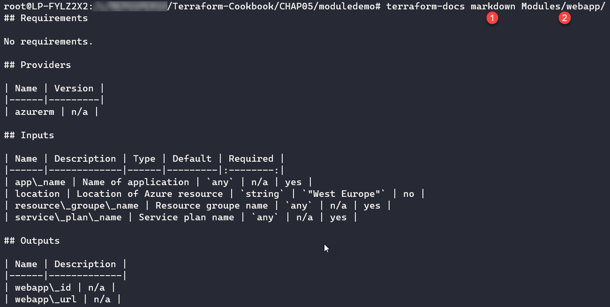

使用模块共享 Terraform 配置

近年来，开发人员和软件工厂面临的真正挑战是停止编写在应用程序之间，甚至在团队之间重复的代码。因此，出现了可以在多个应用程序中轻松重用、并且能够在多个团队之间共享的语言、框架和软件包（如 NuGet、NPM、Bower、PyPI、RubyGems 等）。在**基础设施即代码**（**IaC**）领域，我们也面临着相同的代码结构问题、代码的同质化及其在公司内的共享问题。

我们在第二章《编写 Terraform 配置》的*在多个环境中配置基础设施*配方中学到了 Terraform 配置结构的一些拓扑结构，部分解答了如何合理构建 Terraform 配置的问题。但这并不是终点——Terraform 还允许你创建模块，进而在多个应用程序和多个团队之间共享 Terraform 配置。

本章将学习模块的主要阶段，包括：Terraform 模块的创建、使用和发布。我们将了解如何创建 Terraform 模块及其本地使用，以及如何快速引导模块代码的工作。我们还将研究如何使用公共注册表或 Git 仓库来使用 Terraform 模块。最后，我们将学习如何测试模块，并举一个 Terraform 模块在 Azure Pipelines 和 GitHub Actions 中的 CI/CD 流水线示例。

本章涵盖以下配方：

+   创建 Terraform 模块并本地使用

+   使用公共注册表中的模块

+   使用 GitHub 分享 Terraform 模块

+   在自定义模块中使用其他文件

+   使用 Terraform 模块生成器

+   生成模块文档

+   使用私有 Git 仓库共享 Terraform 模块

+   应用 Terrafile 模式来使用模块

+   使用 Terratest 测试 Terraform 模块代码

+   在 Azure Pipelines 中构建 Terraform 模块的 CI/CD

+   使用 GitHub Actions 为 Terraform 模块构建工作流

# 技术要求

本章中，对于某些配方，我们需要以下一些前置条件：

+   **在你的计算机上安装 Node.js 和 NPM**：下载网站在这里：[`nodejs.org/en/`](https://nodejs.org/en/)。

+   **拥有 GitHub 账户**：如果你没有账户，可以在这里免费创建：[`github.com/`](https://github.com/)。

+   **拥有 Azure DevOps 组织**：你可以使用 Live 或 GitHub 账户在这里创建：[`azure.microsoft.com/en-in/services/devops/`](https://azure.microsoft.com/en-in/services/devops/)。

+   **具备基本的 Git 命令和工作流知识**：相关文档可以在这里找到：[`git-scm.com/doc`](https://git-scm.com/doc)。

+   **了解 Docker**：文档可以在这里找到：[`docs.docker.com/`](https://docs.docker.com/)。

+   **在我们的工作站上安装 Golang**：文档可以在这里找到：[`golang.org/doc/install`](https://golang.org/doc/install)。我们将在*使用 Terratest 测试 Terraform 模块*食谱中看到安装的主要步骤。

本章的完整源代码可以在 GitHub 上找到：[`github.com/PacktPublishing/Terraform-Cookbook/tree/master/CHAP05`](https://github.com/PacktPublishing/Terraform-Cookbook/tree/master/CHAP05)。

查看以下视频，了解代码如何运行：[`bit.ly/3ibKgH2`](https://bit.ly/3ibKgH2)

# 创建一个 Terraform 模块并在本地使用它

一个 Terraform 模块是一个 Terraform 配置，包含一个或多个 Terraform 资源。创建后，可以在多个 Terraform 配置文件中使用该模块，无论是本地使用还是远程使用。

在本节中，我们将介绍 Terraform 模块的基础知识，包括创建模块和在本地使用模块的步骤。

## 准备工作

为了开始这个食谱，我们将使用我们在第二章的*在多个环境中配置基础设施*食谱中已经编写的 Terraform 配置，源代码可以在这里找到：[`github.com/PacktPublishing/Terraform-Cookbook/tree/master/CHAP05/sample-app`](https://github.com/PacktPublishing/Terraform-Cookbook/tree/master/CHAP05/sample-app)。

我们将在本节中创建的模块将负责在 Azure 中提供一个服务计划、一个应用服务和一个应用洞察资源。其源代码可以在这里找到：[`github.com/PacktPublishing/Terraform-Cookbook/tree/master/CHAP05/moduledemo/Modules/webapp`](https://github.com/PacktPublishing/Terraform-Cookbook/tree/master/CHAP05/moduledemo/Modules/webapp)。接下来，我们将编写一个使用该模块的 Terraform 配置，代码可以在这里找到：[`github.com/PacktPublishing/Terraform-Cookbook/tree/master/CHAP05/moduledemo/MyApp`](https://github.com/PacktPublishing/Terraform-Cookbook/tree/master/CHAP05/moduledemo/MyApp)。

## 如何操作…

要创建模块，请执行以下步骤：

1.  在一个名为`moduledemo`的新文件夹中，创建`Modules`和`webapp`文件夹。

1.  在`webapp`文件夹中，创建一个新的`variables.tf`文件，内容如下：

```
variable "resource_group_name" {
  description = "Resource group name"
}

variable "location" {
  description = "Location of Azure resource"
  default     = "West Europe"
}

variable "service_plan_name" {
  description = "Service plan name"
}

variable "app_name" {
  description = "Name of application"
}
```

1.  然后，创建`main.tf`文件，内容如下：

```
resource "azurerm_app_service_plan" "plan-app" {
  name                = var.service_plan_name
  location            = var.location
  resource_group_name = var.resource_group_name
  sku {
    tier = "Standard"
    size = "S1"
  }
}

resource "azurerm_app_service" "app" {
  name                = var.app_name
  location            = var.location
  resource_group_name = var.resource_group_name
  app_service_plan_id = azurerm_app_service_plan.plan-app.id
  app_settings = {
    "INSTRUMENTATIONKEY" = azurerm_application_insights.appinsight-app.instrumentation_key
  }
}

resource "azurerm_application_insights" "appinsight-app" {
  name                = var.app_name
  location            = var.location
  resource_group_name = var.resource_group_name
  application_type    = "web"
}
```

1.  最后，创建`output.tf`文件，内容如下：

```
output "webapp_id" {
  value = azurerm_app_service.app.id
}

output "webapp_url" {
  value = azurerm_app_service.app.default_site_hostname
}
```

1.  在`moduledemo`文件夹内，创建一个名为`MyApp`的子文件夹。

1.  在`MyApp`文件夹内，创建一个`main.tf`文件，内容如下：

```
resource "azurerm_resource_group" "rg-app" {
  name     = "RG_MyAPP_demo"
  location = "West Europe"
}

module "webapp" {
  source = "../Modules/webapp"
  service_plan_name = "spmyapp"
  app_name = "myappdemo"
  location = azurerm_resource_group.rg-app.location
  resource_group_name = azurerm_resource_group.rg-app.name
}

output "webapp_url" {
  value = module.webapp.webapp_url
}
```

## 它是如何工作的…

在*步骤 1*中，我们创建了`moduledemo`目录，里面包含所有模块的代码，每个模块有一个子目录。因此，我们为本教程创建了一个`WebApp`子目录，它将包含`webapp`模块的 Terraform 配置。接下来在*步骤 2*、*3*和*4*中，我们创建了模块代码，这是标准的 Terraform 配置，包含以下文件：

+   `main.tf`：该文件包含将由模块提供的资源的代码。

+   `variables.tf`：该文件包含模块所需的输入变量。

+   `outputs.tf`：该文件包含可以在主 Terraform 配置中使用的模块输出。

在*步骤 5*中，我们创建了将包含应用程序 Terraform 配置的目录。最后，在*步骤 6*中，我们通过`main.tf`文件创建了应用程序的 Terraform 配置。

在此文件的代码中，我们有三个 Terraform 元素：

+   其中有 Terraform 的`azurerm_resource_group`资源，它提供了一个资源组。

+   使用我们创建的模块的 Terraform 配置，采用`module "<module name>"`表达式。在这个模块类型的块中，我们使用了 source 属性，其值是包含`webapp`模块的目录的相对路径。

请注意，如果某些模块的变量已定义默认值，则在某些情况下，调用模块时无需实例化这些变量。

+   我们还获得了 Terraform 输出`webapp_url`，它获取模块的输出，并将其作为我们主 Terraform 配置的输出。

## 还有更多…

在所有这些步骤结束后，我们获得了以下目录树：


要应用此 Terraform 配置，您需要在命令终端中导航到包含 Terraform 配置的`MyApp`文件夹，然后执行以下 Terraform 工作流命令：

```
terraform init
terraform plan -out=app.tfplan
terraform apply app.tfplan 
```

当执行`terraform init`命令时，Terraform 会获取模块的代码，从而将其配置与应用程序的配置集成，如下截图所示：


最后，在执行`terraform apply`命令结束时，输出的值会显示在终端中，如下截图所示：


我们的 Terraform 配置因此获取了模块的输出，并将其作为主代码的输出。

在这个教程中，我们展示了创建 Terraform 模块及其本地使用的基本知识。在本章中，我们将看到如何生成模块的结构，以及如何在*使用 Terraform 模块生成器*教程中使用远程模块。

## 另见

+   模块创建的文档可通过[`www.terraform.io/docs/modules/index.html`](https://www.terraform.io/docs/modules/index.html)查看。

+   关于模块的一般文档可以在 [`www.terraform.io/docs/configuration/modules.html`](https://www.terraform.io/docs/configuration/modules.html) 找到。

+   Terraform 的模块创建学习实验室可通过 [`learn.hashicorp.com/terraform/modules/creating-modules`](https://learn.hashicorp.com/terraform/modules/creating-modules) 访问。

# 使用公共注册表中的模块

在前一个教程中，我们学习了如何创建一个模块，以及如何编写使用此模块的本地 Terraform 配置。

为了便于 Terraform 配置的开发，HashiCorp 设置了一个公共的 Terraform 模块注册表。

这个注册表实际上解决了几个问题，例如以下几点：

+   通过搜索和筛选提高可发现性

+   通过合作伙伴验证过程提供的质量

+   清晰高效的版本控制策略，否则在其他现有模块源（HTTP、S3 和 Git）中无法普遍解决

这些在此注册表中发布的公共模块是由云服务提供商、出版商、社区，甚至是希望公开分享其模块的个人用户开发的。在本教程中，我们将看到如何访问这个注册表，以及如何使用已在此公共注册表中发布的模块。

## 准备工作

在本教程中，我们将从零开始编写一个 Terraform 代码，它不需要任何特别的前提条件。

本教程的目的是在 Azure 中配置一个资源组和网络资源，包括一个虚拟网络和子网。我们将看到如何调用公共模块，但不会详细查看该模块的 Terraform 配置。

本教程的代码源可以在此访问：[`github.com/PacktPublishing/Terraform-Cookbook/tree/master/CHAP05/publicmodule`](https://github.com/PacktPublishing/Terraform-Cookbook/tree/master/CHAP05/publicmodule)。

## 如何操作…

要使用来自公共注册表的 Terraform 模块，请执行以下步骤：

1.  在浏览器中，访问网址：[`registry.terraform.io/browse/modules`](https://registry.terraform.io/browse/modules)。

1.  在此页面的左侧面板的“过滤器”列表中，选择 azurerm：


1.  在结果列表中，点击第一个结果，即 Azure / 网络模块：


1.  然后，在此模块的详细页面上，复制“使用”部分的代码：


1.  最后，在你的工作站上创建一个新文件，`main.tf`，然后粘贴之前的代码，并根据以下内容进行更新：

```
resource "azurerm_resource_group" "rg" {
  name     = "my-rg"
  location = "West Europe"
}

module "network" {
  source              = "Azure/network/azurerm"
  resource_group_name = azurerm_resource_group.rg.name
  vnet_name           = "vnetdemo"
  address_space       = "10.0.0.0/16"
  subnet_prefixes     = ["10.0.1.0/24"]
  subnet_names        = ["subnetdemo"]
}
```

## 它是如何工作的…

在*步骤 1* 到 *步骤 2* 中，我们浏览了 Terraform 的公共注册表，寻找一个能够为 Azure 提供资源配置的模块（使用 `azurerm` 过滤器）。

然后，在*步骤 3* 和 *步骤 4* 中，我们访问了 Azure 团队发布的网络模块的详细页面。

在*步骤 5*中，我们通过指定这些必要的输入变量和 `source` 属性来使用这个模块，该属性值为公共模块特定的别名，`Azure/network/azurerm`，由注册表提供。

## 还有更多内容…

我们在本食谱中已经看到，使用公共注册表中的模块能够节省开发时间。在我们的食谱中，我们使用了一个经过验证的模块，但你完全可以使用其他社区模块。

你可以通过在版本下拉列表中选择所需版本，来使用这些模块的版本控制：


因此，在模块调用中，使用 `Version` 属性并选择所需的版本号。

请注意，像所有模块或社区包一样，使用它们之前，必须通过手动检查其 GitHub 仓库中的代码，确保代码干净且安全。事实上，在每个模块中，都有一个指向 GitHub 仓库的链接，里面包含源代码。

在本章的*使用 GitHub 分享 Terraform 模块*食谱中，我们将学习如何将模块发布到公共注册表。

此外，在公司项目中使用模块之前，必须考虑到如果需要对模块进行修正或扩展，你需要在该模块的 GitHub 仓库中创建问题或发起拉取请求。这要求等待一段时间（验证等待时间和拉取请求合并时间），才能使用修复或请求的扩展。

然而，值得每天使用这些模块，因为它们非常实用，并能为演示、实验和沙盒项目节省大量时间。

我们在本食谱中已经看到了使用公共注册表的内容；在第八章中，我们将学习如何使用 Terraform 的私有模块注册表来提高协作。

## 另见

Terraform 模块注册表的文档可以在此找到：[`www.terraform.io/docs/registry/`](https://www.terraform.io/docs/registry/)。

# 使用 GitHub 分享 Terraform 模块

在本章的*创建 Terraform 模块并在本地使用*食谱中，我们学习了如何创建模块，在前面的*使用公共注册表中的模块*食谱中，我们学习了如何使用来自公共注册表的模块。

在本食谱中，我们将学习如何通过将代码存储在 GitHub 上，将模块发布到公共注册表。

## 准备工作

要应用本食谱，我们需要拥有一个 GitHub 账户（这是目前唯一可用于发布公共模块的 Git 提供者），你可以在此处创建账户：[`github.com/join`](https://github.com/join)。此外，你还需要了解 Git 命令和工作流的基础知识（[`www.hostinger.com/tutorials/basic-git-commands`](https://www.hostinger.com/tutorials/basic-git-commands)）。

关于我们将要发布的模块代码，我们将使用本章第一个配方中创建的模块代码，源代码可以在[`github.com/PacktPublishing/Terraform-Cookbook/tree/master/CHAP05/moduledemo/Modules/webapp`](https://github.com/PacktPublishing/Terraform-Cookbook/tree/master/CHAP05/moduledemo/Modules/webapp)找到。

## 如何操作……

要在公共注册表中共享我们的自定义模块，请执行以下步骤：

1.  在我们的 GitHub 帐户中，创建一个名为`terraform-azurerm-webapp`的新存储库，并配置基本信息，如下图所示：


1.  在本地工作站上，执行 Git 命令以克隆此存储库：

```
git clone https://github.com/mikaelkrief/terraform-azurerm-webapp.git
```

1.  从[`github.com/PacktPublishing/Terraform-Cookbook/tree/master/CHAP05/moduledemo/Modules/webapp`](https://github.com/PacktPublishing/Terraform-Cookbook/tree/master/CHAP05/moduledemo/Modules/webapp)复制源代码，并将其粘贴到`git clone`命令创建的新文件夹中。

1.  更新`Readme.md`文件的内容，增加关于模块角色的更多描述。

1.  提交并推送该文件夹中的所有文件；你可以使用 Visual Studio Code 或 Git 命令（`commit`和`push`）执行此操作。

1.  通过执行以下命令，添加并推送一个名为`v0.0.1`的 Git 标签：

```
git tag v1.0.0
git push origin v1.0.0 
```

1.  在浏览器中，访问网址[`registry.terraform.io/`](https://registry.terraform.io/)。

1.  在此页面上，点击顶部菜单中的“Sign-in”链接：


1.  在新弹出的窗口中，点击“Sign in with GitHub”按钮，如果提示，授权 HashiCorp 读取你的存储库：


1.  一旦验证成功，点击顶部菜单中的“Publish”链接：


1.  在下一页中，选择包含要发布模块代码的 mikaelkrief/terraform-azurerm-webapp 存储库，并勾选我同意使用条款的复选框：


1.  点击“PUBLISH MODULE”按钮，并等待模块页面加载。

## 它是如何工作的……

在*步骤 1*和*步骤 2*中，我们在 GitHub 上创建了一个 Git 存储库并将其克隆到本地，而在*步骤 3*到*步骤 6*中，我们编写了该模块的 Terraform 配置（使用现有代码）。我们还编辑了将作为模块使用文档的`Readme.md`文件。

然后，我们进行了提交并将代码推送到远程 Git 存储库，并添加了一个标签，该标签形式为`vX.X.X`，用于为模块进行版本控制。

最终，在*步骤 7*到*步骤 12*中，我们通过在注册表中使用我们的 GitHub 凭据登录，并选择包含模块代码的存储库，成功将该模块发布到公共注册表。

注册表会自动检测模块版本与所推送的 Git 标签（在*步骤 6*中）之间的关系。

完成所有这些步骤后，模块将可用，并显示在 Terraform 的公共注册表中，如下图所示：


模块是公开可访问的；使用说明显示在右侧面板中，`Readme.md` 文本作为文档显示在页面内容中。

## 还有更多内容…

关于将包含模块代码的存储库的名称，它必须按以下方式组成：

```
terraform-<provider>-<name>
```

同样，对于 Git 标签，它必须采用 `vX.X.X` 的格式才能集成到注册表中。要了解更多关于模块简历的信息，请参阅文档：[`www.terraform.io/docs/registry/modules/publish.html#requirements`](https://www.terraform.io/docs/registry/modules/publish.html#requirements)。

发布后，可以通过从“管理模块”下拉菜单中选择“删除模块”来删除模块：


请小心：从注册表中删除后，模块将无法使用。

## 另见

+   模块发布文档可以在这里找到：[`www.terraform.io/docs/registry/modules/publish.html`](https://www.terraform.io/docs/registry/modules/publish.html)。

+   关于注册表 API 的文档可以在这里找到：[`www.terraform.io/docs/registry/api.html`](https://www.terraform.io/docs/registry/api.html)。

# 在自定义模块中使用另一个文件

在本章的 *创建 Terraform 模块并在本地使用* 中，我们研究了创建一个基本 Terraform 模块的步骤。

我们可能会遇到需要在模块中使用另一个文件的场景，该文件并不描述基础设施（例如 `.tf` 扩展名），例如，当模块需要在本地执行一个脚本以操作内部程序时。

在本教程中，我们将研究如何在 Terraform 模块中使用另一个文件。

## 准备工作

对于本教程，我们不需要任何先决条件；我们将从头开始编写模块的 Terraform 配置。

本教程的目标是创建一个 Terraform 模块，该模块将执行一个 Bash 脚本，脚本将在本地计算机上执行操作（在本教程中，`hello world` 显示即可）。

由于我们将以 Bash 脚本为例，因此我们将在 Linux 系统下运行 Terraform。

需要牢记的是，像这样的供应程序通过假设 Terraform 运行的系统上安装了 Bash，降低了配置的可重用性。否则，通常 Terraform 并不受此限制，因为它提供了不同操作系统和架构的构建，并支持跨平台运行。

本教程中创建的模块的源代码可以在这里找到：[`github.com/PacktPublishing/Terraform-Cookbook/tree/master/CHAP05/moduledemo/Modules/execscript`](https://github.com/PacktPublishing/Terraform-Cookbook/tree/master/CHAP05/moduledemo/Modules/execscript)。

## 如何操作…

执行以下步骤以在模块内部使用文件：

1.  在名为`execscript`的新文件夹（位于`Modules`文件夹中）内，创建一个新的文件`script.sh`，并写入以下内容：

```
echo "Hello world"
```

1.  在此模块中创建一个`main.tf`文件，并在其中编写以下代码：

```
resource "null_resource" "execfile" {
  provisioner "local-exec" {
    command = "${path.module}/script.sh"
    interpreter = ["/bin/bash"]
  }
}
```

1.  然后，在 Terraform 配置中，使用以下代码调用此模块：

```
module "execfile" {
  source = "../Modules/execscript"
}
```

1.  最后，在命令行终端中，导航到 Terraform 配置的文件夹，并使用以下命令执行基本的 Terraform 工作流：

```
terraform init
terraform plan -out="app.tfplan"
terraform apply app.tfplan
```

## 它是如何工作的……

在*步骤 1*和*步骤 2*中，我们创建了一个使用`local_exec`资源（[`www.terraform.io/docs/provisioners/local-exec.html`](https://www.terraform.io/docs/provisioners/local-exec.html)）在本地执行脚本的模块。

`local_exec`执行的是存储在模块中的`script.sh`文件中的脚本。为了配置相对于`script.sh`文件的路径，在执行 Terraform 时可以使用`path.module`表达式，它返回相对于模块的完整路径。

然后，在*步骤 3*中，我们编写了调用此模块的 Terraform 配置。最后，在*步骤 4*中，我们运行了该代码的 Terraform，并得到了以下结果：


你可以看到脚本执行成功，并且在控制台中显示了`Hello World`。

## 还有更多……

让我们看看如果我们没有在此模块的代码中使用`path.module`表达式，而是以以下方式编写模块代码会发生什么：

```
resource "null_resource" "execfile" {
  provisioner "local-exec" {
    command = "script.sh"
    interpreter = ["/bin/bash"]
  }
}
```

执行`apply`命令时，将会发生以下错误：


这是因为 Terraform 在`main.tf`文件中运行，而该文件无法访问模块目录中`script.sh`文件的`relatif`路径。

## 另见

关于`Path.Module`表达式的文档，请参见：[`www.terraform.io/docs/configuration/expressions.html#references-to-named-values`](https://www.terraform.io/docs/configuration/expressions.html#references-to-named-values)。

# 使用 Terraform 模块生成器

我们学会了如何创建、使用和共享 Terraform 模块，并研究了模块文件结构的最佳实践，其中包括有一个主文件、一个变量文件和一个包含模块输出的文件。在*使用 GitHub 共享 Terraform 模块*食谱中，我们还讨论了如何通过`Readme.md`文件记录模块的使用。

除了这些标准文件外，我们还可以添加脚本、测试（稍后我们将在*使用 Terratest 测试 Terraform 模块代码*食谱中看到）和其他文件。

对于需要使用 Terraform 提供大量资源的大型基础设施公司项目，我们需要创建大量的 Terraform 模块。

为了简化模块结构的创建，微软发布了一个工具，允许我们生成 Terraform 模块的基本结构（也称为**模板**）。

在本教程中，我们将看到如何使用模块生成器创建模块的基础结构。

## 准备工作

使用这个模块生成器的前提软件如下：

1.  本地安装 Node.js（6.0+）；其下载文档可以在[`nodejs.org/en/download/`](https://nodejs.org/en/download/)找到。

1.  然后，通过执行以下命令安装 `npm` 包 Yeoman ([`www.npmjs.com/package/yo`](https://www.npmjs.com/package/yo))：

```
npm install -g yo 
```

为了说明这个步骤，我们将使用这个生成器来创建一个负责配置资源组的模块结构。

本教程生成的模块样本可以在[`github.com/PacktPublishing/Terraform-Cookbook/tree/master/CHAP05/generatedmodule`](https://github.com/PacktPublishing/Terraform-Cookbook/tree/master/CHAP05/generatedmodule)找到。

## 如何操作…

要生成 Terraform 模块的结构，请执行以下步骤：

1.  在命令行终端中，执行以下命令：

```
npm install -g generator-az-terra-module
```

1.  创建一个名为 `terraform-azurerm-rg` 的新文件夹。

1.  然后，在这个文件夹中，在命令行终端中执行此命令：

```
yo az-terra-module
```

1.  最后，生成器会提出一些问题；按照下面的截图输入相应的回答：


## 它是如何工作的…

在*步骤 1*中，我们安装了模块生成器，它是一个名为 `generator-az-terra-module` 的 `npm` 包。所以我们使用了经典的 `npm` 命令行，它会全局安装包，也就是说，安装到整台机器上。

在*步骤 2*中，我们创建了一个将包含模块代码的文件夹；在我们的教程中，我们使用了 Terraform 注册表要求的命名规范。

在*步骤 3 和 4*中，我们执行了 `az-terra-module` 生成器。在执行过程中，这个生成器会提出一些问题，允许定制将生成的模块模板。第一个问题是关于模块名称的。第二个问题是关于模块是否存在于 `npm` 中；我们回答了`否`。接下来的三个问题涉及模块元数据。最后，最后一个问题是问我们是否想在模块代码中添加一个 Dockerfile，用于运行模块的测试——我们回答了`是`。

在所有这些问题的最后，生成器将把所有必要的文件复制到我们目录中的模块：


如你在此屏幕中所见，生成器会在终端中显示已创建的文件夹和文件列表。

最后，在我们的文件资源管理器中，我们可以看到所有这些文件：


我们的 Terraform 模块的基本结构已经生成。

## 还有更多…

在本教程中，我们看到可以生成 Terraform 模块的文件结构。在此生成器执行完成后，创建的模块目录将包含该模块的 Terraform 文件，随后将使用模块的代码进行编辑。此文件夹还将包含其他测试文件和一个 Dockerfile，其用途将在本章的 *使用 Terratest 测试 Terraform 模块* 食谱中介绍。

此外，虽然此生成器是由 Microsoft 发布的，但它可以用于生成任何 Terraform 模块的结构，即使它与 Azure 无关。

## 另见

+   模块生成器的源代码可以在 GitHub 上找到，网址为 [`github.com/Azure/generator-az-terra-module`](https://github.com/Azure/generator-az-terra-module)。

+   生成器使用文档可以在 [`docs.microsoft.com/en-us/azure/developer/terraform/create-a-base-template-using-yeoman`](https://docs.microsoft.com/en-us/azure/developer/terraform/create-a-base-template-using-yeoman) 找到。

+   Yeoman 文档可以在 [`yeoman.io/`](https://yeoman.io/) 上找到。

+   生成器的 `npm` 包可以在 [`www.npmjs.com/package/generator-az-terra-module`](https://www.npmjs.com/package/generator-az-terra-module) 上找到。

# 生成模块文档

从之前的教程中我们已经了解到，在 Terraform 模块的组成中，有输入变量以及输出变量。

和所有发布给其他团队或公开使用的包一样，记录 Terraform 模块的文档非常重要。

这份文档的问题在于，每次更改时都需要手动更新文档，因此很快就会变得过时。

在 Terraform 工具箱中的所有工具中，有一个名为 `terraform-docs` 的开源跨平台工具，可以自动生成 Terraform 模块的文档。

在本教程中，我们将讨论如何使用 `terraform-docs` 自动生成模块的 markdown 文档。

## 准备工作

对于本教程，我们将生成在本章的 *创建 Terraform 模块并在本地使用* 食谱中创建的模块的文档，该模块使我们能够在 Azure 中创建一个 Web 应用，源代码位于这里： [`github.com/PacktPublishing/Terraform-Cookbook/tree/master/CHAP05/moduledemo/Modules/webapp`](https://github.com/PacktPublishing/Terraform-Cookbook/tree/master/CHAP05/moduledemo/Modules/webapp)。

如果你使用的是 Windows 操作系统，你需要按照以下文档安装**Chocolatey**：[`chocolatey.org/install`](https://chocolatey.org/install)。我们为 `webapp` 模块生成的文档可以在 [`github.com/PacktPublishing/Terraform-Cookbook/blob/master/CHAP05/moduledemo/Modules/webapp/Readme.md`](https://github.com/PacktPublishing/Terraform-Cookbook/blob/master/CHAP05/moduledemo/Modules/webapp/Readme.md) 查阅。

## 如何操作…

按照以下步骤生成模块文档：

1.  如果你使用的是 Linux 操作系统，请在命令行终端中执行以下脚本：

```
curl -L https://github.com/segmentio/terraform-docs/releases/download/v0.9.1/terraform-docs-v0.9.1-linux-amd64 -o terraform-docs-v0.9.1-linux-amd64
tar -xf terraform-docs-v0.9.1-linux-amd64
chmod u+x terraform-docs-v0.9.1-linux-amd64
sudo mv terraform-docs-v0.9.1-linux-amd64 /usr/local/bin/terraform-docs
```

如果你使用的是 Windows 操作系统，请执行以下脚本：

```
choco install terraform-docs -y
```

1.  执行以下脚本来测试安装：

```
terraform-docs --version
```

1.  在命令行终端中，进入 `moduledemo` 文件夹并执行以下命令：

```
terraform-docs markdown Modules/webapp/ > Modules/webapp/Readme.md
```

## 它是如何工作的…

在 *第 1 步* 中，我们根据操作系统安装 `terraform-docs`。对于 Linux，提供的脚本从 GitHub 下载 `terraform-docs` 包，使用 TAR 工具解压，使用 `chmod` 赋予执行权限，最后将其复制到本地目录 `/usr/bin/local`（该目录已在 `PATH` 环境变量中配置）。

以下截图显示了在 Linux 中的安装过程：


对于 Windows，脚本使用 **Chocolatey** 的 `choco install` 命令来下载 `terraform-docs` 包。

以下截图显示了在 Windows 中的安装过程：


然后，在 *第 2 步* 中，我们通过运行 `terraform-docs` 并添加 `--version` 选项来检查其安装情况。此命令将显示已安装的 `terraform-docs` 版本，如以下截图所示：


最后，在 *第 3 步* 中，我们执行 `terraform-docs`，在第一个参数中指定文档的格式类型。在我们的案例中，我们希望它是 `markdown` 格式。然后，在第二个参数中，指定 `modules` 目录的路径。在这个阶段，我们可以这样执行命令，并且在执行过程中，文档会显示在控制台上，如以下截图所示：



但为了进一步操作，我们添加了 `> Modules/webapp/Readme.md` 命令，它表示生成的文档内容将写入模块目录中创建的 `Readme.md` 文件。

执行该命令结束后，可以在模块文件夹中看到一个新的 `Readme.md` 文件，里面包含模块文档。生成的文档由模块中使用的提供程序、输入变量和输出组成。

## 还有更多…

在我们的食谱中，我们选择生成 Markdown 格式的文档，但也可以生成 JSON、XML、YAML 或文本（漂亮的）格式。为此，你需要在`terraform-docs`命令中添加格式选项。欲了解更多可用的生成格式，请阅读文档：[`github.com/segmentio/terraform-docs/blob/master/docs/FORMATS_GUIDE.md`](https://github.com/segmentio/terraform-docs/blob/master/docs/FORMATS_GUIDE.md)。

你还可以通过自动化生成文档来改善你的工作流程，每次在 Git 中提交代码时触发`terraform-docs`的执行。为此，你可以使用一个预提交的 Git 钩子，具体可以参考文档中的说明：[`github.com/segmentio/terraform-docs/blob/master/docs/USER_GUIDE.md#integrating-with-your-terraform-repository`](https://github.com/segmentio/terraform-docs/blob/master/docs/USER_GUIDE.md#integrating-with-your-terraform-repository)。

此外，要获取最新版本的`terraform-docs`，请查看这里的发布：[`github.com/segmentio/terraform-docs/releases`](https://github.com/segmentio/terraform-docs/releases)，以及这里的`CHANGELOG`：[`github.com/segmentio/terraform-docs/blob/master/CHANGELOG.md`](https://github.com/segmentio/terraform-docs/blob/master/CHANGELOG.md)，以查看变更内容。

如果你想像我们在本章的*使用 GitHub 共享 Terraform 模块*食谱中所看到的那样，将你的模块发布到 Terraform 注册表中，你不需要生成这些文档，因为它已经包含在注册表的功能中了。

## 另见

+   `terraform-docs`的源代码可以在这里找到：[`github.com/segmentio/terraform-docs`](https://github.com/segmentio/terraform-docs)。

+   Chocolatey 的`terraform-docs`包页面可以在这里找到：[`chocolatey.org/packages/Terraform-Docs`](https://chocolatey.org/packages/Terraform-Docs)。

# 使用私人 Git 仓库共享 Terraform 模块

在本章专门讲解 Terraform 模块的内容中，我们已经看到，可以将模块的代码放入 GitHub 仓库中，以便将其发布到 Terraform 公共注册表中。

然而，在企业中，确实需要创建模块，但又不希望将这些模块的代码公开，可以通过将它们归档在 GitHub 的公共仓库中（即每个人都可以访问的仓库）来实现。

你需要知道的是，Terraform 模块有几种不同的源类型，详细内容请见文档：[`www.terraform.io/docs/modules/sources.html`](https://www.terraform.io/docs/modules/sources.html)。

在这个食谱中，我们将学习如何通过一个私人 Git 仓库公开一个 Terraform 模块。也就是说，Git 仓库可以是内部安装的（即所谓的本地部署）或云模式的 SaaS，但需要身份验证。

## 准备工作

对于这个示例，我们将使用**Azure Repos**（Azure DevOps）中的一个 Git 仓库，它是免费的，并且需要认证才能访问。有关更多信息以及如何创建免费的 Azure DevOps 账户，请访问[`azure.microsoft.com/en-us/services/devops/`](https://azure.microsoft.com/en-us/services/devops/)。

作为前提条件，我们需要一个已经创建的项目，例如，`Terraform-modules`，它将包含所有模块的 Git 仓库。

下一张截图展示了创建该 Azure DevOps 项目的表单：


本示例的目的是不专注于 Azure DevOps 的使用；我们仅使用它作为私有仓库的示例。

你还需要了解 Git 的命令和工作流程的基础知识：[`www.hostinger.com/tutorials/basic-git-commands`](https://www.hostinger.com/tutorials/basic-git-commands)。

关于我们将放入 Azure Repos 的模块代码，我们将使用本章第一个示例中创建的模块代码，其源代码可在这里找到：[`github.com/PacktPublishing/Terraform-Cookbook/tree/master/CHAP05/moduledemo/Modules/webapp`](https://github.com/PacktPublishing/Terraform-Cookbook/tree/master/CHAP05/moduledemo/Modules/webapp)。

## 如何操作…

为了使用私有模块仓库，我们需要执行以下步骤：

1.  在 Azure DevOps 项目`Terraform-modules`中，创建一个名为`terraform-azurerm-webapp`的新 Git 仓库，并进行基本配置，如下图所示：


1.  在本地工作站上，执行 Git 命令以克隆该仓库：

```
git clone https://dev.azure.com/<account>/Terraform-modules/_git/terraform-azurerm-webapp
```

1.  在第一次操作时，你需要输入你的 Azure DevOps 登录名和密码以进行身份验证。

1.  从[`github.com/PacktPublishing/Terraform-Cookbook/tree/master/CHAP05/moduledemo/Modules/webapp`](https://github.com/PacktPublishing/Terraform-Cookbook/tree/master/CHAP05/moduledemo/Modules/webapp)复制源代码，并将其粘贴到 Git 克隆创建的新文件夹中。

1.  更新`Readme.md`文件的内容，增加模块角色的描述。

1.  提交并推送此文件夹中的所有文件；要执行此操作，可以使用 VS Code 或 Git 命令：

```
git add .
git commit -m "add code"
git push origin master
```

1.  添加并推送此提交的 Git 标签，名称为`v0.0.1`，通过执行以下命令：

```
git tag v1.0.0
git push origin v1.0.0 
```

也可以通过 Azure Repos 的网页界面在仓库的 Tags 标签页中执行此操作。

1.  最后，在 Terraform 的`main.tf`文件中，写入以下代码以使用该模块：

```
resource "azurerm_resource_group" "rg-app" {
  name     = "RG_MyAPP_Demo2"
  location = "West Europe"
}

module "webapp" {
  source               = "git::https://dev.azure.com/BookLabs/Terraform-modules/_git/terraform-azurerm-webapp?ref=v1.0.0"
  service_plan_name    = "spmyapp2"
  app_name             = "myappdemobook2"
  location             = azurerm_resource_group.rg-app.location
  resource_group_name = azurerm_resource_group.rg-app.name
}
output "webapp_url" {
  value = module.webapp.webapp_url
}
```

## 它是如何工作的…

在*第 1 步*和*第 2 步*中，我们在 Azure Repos 中创建了一个 Git 仓库并将其克隆到本地。然后，在*第 3 步*到*第 7 步*中，我们为该模块编写了 Terraform 配置（使用已有的代码）。我们还编辑了将作为模块使用文档的 `Readme.md` 文件。接着，我们提交并推送了代码到远程 Git Azure 仓库。以下截图展示了远程仓库在 Azure Repos 中的情况：


最后，我们添加了一个 Git 标签，格式为 `vX.X.X`，用于版本管理模块。

最后，在*第 8 步*中，我们编写了 Terraform 配置，通过 Git 类型的源来远程使用这个模块。为此，我们在模块的 `source` 属性中指定了仓库的 Git URL。除了这个 URL，我们还添加了 `ref` 参数，并为其指定了我们创建的 Git 标签作为值。

在执行 `terraform init` 命令时，Terraform 会将仓库克隆到本地：


模块代码将被克隆到 Terraform 上下文目录中，如下图所示：


`webapp` 模块将被下载到 `.terraform` 文件夹中。

## 还有更多内容……

在本食谱中，大部分步骤与之前在*使用 GitHub 分享 Terraform 模块*食谱中所学的步骤相同，其中我们将模块代码存储在 GitHub 中并将其共享到公共注册表。不同之处在于，在本食谱的*第 8 步*中，我们在 `source` 属性中填写了 Git 仓库的 URL。

使用私有 Git 仓库的优势，一方面是只有具有权限的人才能访问该仓库；另一方面，在我们为模块调用 URL 设置的 `ref` 参数中，我们使用了一个特定版本的模块，使用的是 Git 标签。我们也可以完全指定一个特定的 Git 分支，这在我们想要开发模块而不影响主分支时非常有用。

我们也可以将模块的代码存储在 GitHub 仓库中，并将 `source` 属性填写为 GitHub 仓库的 URL，具体说明请见这篇文档：[`www.terraform.io/docs/modules/sources.html#github`](https://www.terraform.io/docs/modules/sources.html#github)。

在本食谱中，我们以 Azure DevOps 中的 Git 仓库为例，但它也能很好地与其他 Git 仓库提供商（如 Bitbucket）兼容（[`www.terraform.io/docs/modules/sources.html#bitbucket`](https://www.terraform.io/docs/modules/sources.html#bitbucket)）。

关于 Git 仓库的身份验证，您可以查看这篇文档：[`www.terraform.io/docs/modules/sources.html#generic-git-repository`](https://www.terraform.io/docs/modules/sources.html#generic-git-repository)，了解通过 HTTPS 或 SSH 访问和验证 Git 仓库的信息。

## 另见

模块源文档可以在这里找到：[`www.terraform.io/docs/modules/sources.html`](https://www.terraform.io/docs/modules/sources.html)。

# 应用 Terrafile 模式以使用模块

在本章的教程中，我们已经学习了如何创建 Terraform 模块，并且如何使用它们，无论是本地使用还是通过公共注册表或 Git 仓库远程使用。

然而，当你拥有一个使用多个模块的 Terraform 配置时，管理这些模块可能变得复杂。特别是当这些模块的版本发生变化时，我们需要遍历所有 Terraform 配置来进行版本更新。此外，我们也无法全面了解这个 Terraform 配置中调用的所有模块及其版本。

类似于经典的包管理工具（NPM 和 NuGet），有许多人提出了一种模式，允许用户将 Terraform 配置中使用的模块的配置集中在一个名为**Terrafile**的文件中。

在本教程中，我们将学习如何使用 Terrafile 模式来管理 Terraform 模块的源。

## 准备工作

对于这个教程，我们将使用已经编写好的 Terraform 源代码，代码可以在这里找到：[`github.com/PacktPublishing/Terraform-Cookbook/blob/master/CHAP05/terrafile/initial/main.tf`](https://github.com/PacktPublishing/Terraform-Cookbook/blob/master/CHAP05/terrafile/initial/main.tf)。这个 Terraform 配置一开始是经典配置的——它调用了多个模块，并且在每次调用这些模块时，我们使用了 GitHub 仓库的 URL 作为 source 属性。

此外，我们还将执行用 Ruby 编写的代码，并使用 Rake 工具（[`github.com/ruby/rake`](https://github.com/ruby/rake)）。为此，我们需要在计算机上安装 Ruby。安装文档可以在这里找到：[`www.ruby-lang.org/en/documentation/installation/`](https://www.ruby-lang.org/en/documentation/installation/)。不过，不需要提前了解 Ruby；本教程中的完整脚本已经提供。

本教程的目标是通过将模块的管理集中化，集成 Terrafile 模式。此教程的源代码可以在这里找到：[`github.com/PacktPublishing/Terraform-Cookbook/tree/master/CHAP05/terrafile`](https://github.com/PacktPublishing/Terraform-Cookbook/tree/master/CHAP05/terrafile)。

## 如何操作...

执行以下步骤以使用 Terrafile 模式：

1.  将[`github.com/PacktPublishing/Terraform-Cookbook/blob/master/CHAP05/terrafile/initial/main.tf`](https://github.com/PacktPublishing/Terraform-Cookbook/blob/master/CHAP05/terrafile/initial/main.tf)中的 `main.tf` 内容复制到一个新文件夹中。

1.  在这个新文件夹中，创建一个名为 `Terrafile`（无扩展名）的新文件，内容如下：

```
rg-master:
  source:  "https://github.com/mikaelkrief/terraform-azurerm-resource-group.git"
  version: "master"
webapp-1.0.0:
  source:  "https://github.com/mikaelkrief/terraform-azurerm-webapp.git"
  version: "v1.0.0"
network-3.0.1:
  source:  "https://github.com/Azure/terraform-azurerm-network.git"
  version: "v3.0.1"

```

1.  创建另一个新文件，`Rakefile`（没有扩展名），其内容如下（完整的源代码见[`github.com/PacktPublishing/Terraform-Cookbook/blob/master/CHAP05/terrafile/new/Rakefile`](https://github.com/PacktPublishing/Terraform-Cookbook/blob/master/CHAP05/terrafile/new/Rakefile)）：

```
.....
desc 'Fetch the Terraform modules listed in the Terrafile'
task :get_modules do
  terrafile = read_terrafile
  create_modules_directory
  delete_cached_terraform_modules
  terrafile.each do |module_name, repository_details|
    source  = repository_details['source']
    version = repository_details['version']
    puts "[*] Checking out #{version} of #{source} ...".colorize(:green)
    Dir.mkdir(modules_path) unless Dir.exist?(modules_path)
    Dir.chdir(modules_path) do
       #puts "git clone -b #{version} #{source} #{module_name} &> /dev/null".colorize(:green)
      'git clone -q -b #{version} #{source} #{module_name}'
    end
  end
end
```

1.  在`main.tf`中，使用以下内容更新所有源模块属性：

```
module "resourcegroup" {
  source = "./modules/rg-master"
 ...
}

module "webapp" {
  source = "./modules/webapp-1.0.0"
...
}

module "network" {
  source = "./modules/network-3.0.1"
...
}
```

1.  在命令行终端中，在此文件夹内执行以下脚本：

```
bundle install
rake get_modules 
```

## 它是如何工作的……

Terrafile 模式的机制是，在模块调用中不直接使用 Git 源，而是在一个 Terrafile YAML 格式的文件中引用它们。在 Terraform 配置中，在模块调用时，我们改为使用相对于`modules`文件夹的本地路径。最后，在执行 Terraform 工作流之前，我们执行一个脚本，遍历此`Terrafile`文件，并在其指定的文件夹中本地克隆每个引用的模块（该文件夹在模块调用中）。

在*步骤 1*中，我们创建了`Terrafile`文件，该文件采用 YAML 格式，并包含我们将在 Terraform 配置中使用的模块的仓库。对于每个模块，我们指定以下内容：

+   模块将被复制到的文件夹名称

+   模块的 Git 仓库的 URL

+   它的版本，即 Git 标签或分支

在*步骤 2*中，我们编写了名为 Rakefile 的 Ruby Rake 脚本，该脚本执行时会浏览 Terrafile 并对所有模块执行`git clone`命令，将它们克隆到指定文件夹中。

然后，在*步骤 3*中，我们修改了 Terraform 配置，调用这些模块，使用的不是 Git URL，而是之前在 Terrafile 中指定文件夹的相对路径。

最后，在*步骤 4*中，我们通过调用此脚本的`get_modules`函数来执行 Rakefile 脚本，该函数会在各自的文件夹中进行 Git 克隆所有这些模块。

完成这些步骤后，我们可以使用`init`、`plan`和`apply`等经典的 Terraform 工作流命令。

## 还有更多……

正如我们在本食谱中学到的，我们创建了一个`Terrafile`文件，它作为我们在 Terraform 配置中将使用的模块的仓库。它允许更好地管理和维护将要使用的模块和版本。

在这个 Terrafile 中，对于每个模块，我们指定了它的目标文件夹，正如您所看到的，我们在文件夹名称中添加了版本号。因此，文件夹名称是唯一的，这将允许我们在 Terraform 配置中使用同一模块的多个版本。以下代码展示了一个包含同一模块的两个不同版本的 Terrafile 摘录：

```
network-3.0.1:
  source:  "https://github.com/Azure/terraform-azurerm-network.git"
  version: "v3.0.1"
network-2.0.0:
  source:  "https://github.com/Azure/terraform-azurerm-network.git"
  version: "v2.0.0"
```

此外，它还允许您在必要时指定授权的 Git 凭据来克隆模块代码。但请注意，不要在此文件中写入密码，因为该文件会被存档到 Git 仓库中。

在本食谱中，提供了 Rakefile 脚本，并且它可以在 Terrafile 模式的原始文章中找到（[`bensnape.com/2016/01/14/terraform-design-patterns-the-terrafile/`](https://bensnape.com/2016/01/14/terraform-design-patterns-the-terrafile/)）。你可以根据需要自由调整它。

最后，Terrafile 模式的核心不在于脚本、语言或所使用的格式，而在于其工作原理。比如说，这个 Rakefile 有替代的脚本和工具，比如可以在[`github.com/claranet/python-terrafile`](https://github.com/claranet/python-terrafile)找到的 Python 脚本，或者可以在[`github.com/coretech/terrafile`](https://github.com/coretech/terrafile)找到的 Go 编写的工具。

## 另见

+   Terrafile 模式的主要参考文章可以在这里找到：[`bensnape.com/2016/01/14/terraform-design-patterns-the-terrafile/`](https://bensnape.com/2016/01/14/terraform-design-patterns-the-terrafile/)。

+   Python Terrafile 包可以在这里找到：[`pypi.org/project/terrafile/`](https://pypi.org/project/terrafile/) [并且其使用方法可以在这里查看](https://pypi.org/project/terrafile/) [`github.com/claranet/python-terrafile`](https://github.com/claranet/python-terrafile)。

+   用 Go 编写的 Terrafile 工具可以在这里获取：[`github.com/coretech/terrafile`](https://github.com/coretech/terrafile)。

# 使用 Terratest 测试 Terraform 模块代码

在开发将用于多个 Terraform 配置并与其他团队共享的 Terraform 模块时，有一个步骤常常被忽略，那就是模块的测试。

在 Terraform 框架和测试工具中，有一个**Terratest**框架，由*Gruntwork*社区（[`gruntwork.io/static/`](https://gruntwork.io/static/)）创建，它非常流行，并允许对用 Go 语言编写的代码进行测试。

在本食谱中，我们将学习如何使用 Terratest 编写并运行针对 Terraform 配置和模块的集成测试。

## 准备工作

**Terratest**测试框架是用 Golang（Go 语言）编写的，测试在 Go 运行时上运行。因此，作为前提条件，我们需要通过访问[`golang.org/`](https://golang.org/)来安装 Go。

Terratest 所需的最小 Go 版本可以在这里查看：[`terratest.gruntwork.io/docs/getting-started/quick-start/#requirements`](https://terratest.gruntwork.io/docs/getting-started/quick-start/#requirements)。

以下是安装 Go 的一些重要步骤：对于 Windows 操作系统，你可以使用 Chocolatey 安装 Golang 包（[`chocolatey.org/packages/golang`](https://chocolatey.org/packages/golang)），通过执行以下命令：

```
choco install golang -y
```

对于 Linux 操作系统，运行以下脚本：

```
GOLANG_VERSION="1.14.6"
GOLANG_OS_ARCH=linux-amd64

mkdir "$HOME/go"
mkdir "$HOME/go/bin"
mkdir "$HOME/go/src"

curl -Os https://storage.googleapis.com/golang/go${GOLANG_VERSION}.${GOLANG_OS_ARCH}.tar.gz >/dev/null 2>&1 &&
 tar -zxvf go${GOLANG_VERSION}.${GOLANG_OS_ARCH}.tar.gz -C /usr/local/ >/dev/null

# Refresh Go environment.
export GOPATH="$HOME/go"
export PATH="/usr/local/go/bin:$GOPATH/bin:$PATH"

```

上述脚本会创建 Go 的工作区目录（`bin`和`src`），然后下载 Go SDK，并设置环境变量，`GOPATH`和`PATH`。

如果你使用的是 Linux，你还需要安装`gcc`包，可以通过运行`apt install gcc`命令来安装。

这个食谱的目标是为一个非常简单的模块编写集成测试，我们将在这个食谱中编写该模块作为演示。

本章的源代码，包括模块及其测试，可以在这里找到：[`github.com/PacktPublishing/Terraform-Cookbook/tree/master/CHAP05/testing-terratest`](https://github.com/PacktPublishing/Terraform-Cookbook/tree/master/CHAP05/testing-terratest)。

## 如何实现…

这个食谱分为两部分。第一部分是关于编写模块及其测试，第二部分是关于执行测试。

为了编写模块及其测试，我们执行以下步骤：

1.  我们创建了一个新的`module`文件夹，该文件夹将包含模块的 Terraform 配置。

1.  在这个`module`文件夹中，我们创建了一个`main.tf`文件，其中包含以下代码：

```
variable "string1" {}

variable "string2" {}

## PUT YOUR MODULE CODE
##_____________________

```

```
output "stringfct" {
  value = format("This is test of %s with %s", var.string1, upper(var.string2))
}
```

1.  在这个`module`文件夹中，我们在`test`文件夹内创建了`fixture`文件夹。

1.  然后，在这个`fixture`文件夹中，我们创建了一个`main.tf`文件，其中包含以下 Terraform 配置：

```
module "demo" {
  source  = "../../"
  string1 = "module"
  string2 = "terratest"
}

output "outmodule" {
  value = module.demo.stringfct
}
```

1.  在测试文件夹中，我们创建了一个`test_module.go`文件，其中包含以下代码：

```
package test

import (
   "testing"
   "github.com/gruntwork-io/terratest/modules/terraform"
   "github.com/stretchr/testify/assert"
)

func TestTerraformModule(t *testing.T) {
   terraformOptions := &terraform.Options{
      // path to the terraform configuration
      TerraformDir: "./fixture",
   }

   // lean up resources with "terraform destroy" at the end of the test.
   defer terraform.Destroy(t, terraformOptions)

   // Run "terraform init" and "terraform apply". Fail the test if there are any errors.
   terraform.InitAndApply(t, terraformOptions)

   // Run `terraform output` to get the values of output variables and check they have the expected values.
   output := terraform.Output(t, terraformOptions, "outmodule")
   assert.Equal(t, "This is test of module with TERRATEST", output)
}
```

为了执行测试，我们执行以下步骤：

1.  第一步是通过执行以下命令来下载`terratest` Go 包：

```
go get github.com/gruntwork-io/terratest/modules/terraform
```

1.  然后，在包含`test_module.go`文件的目录中，我们执行以下命令：

```
go test -v
```

## 它是如何工作的…

在这个食谱的第一部分，我们使用 Terratest 框架开发了模块及其测试。在*步骤 2*中，我们编写了模块的代码，这非常简单，主要关注模块的输出。在*步骤 3*中，在`fixture`文件夹中，我们编写了一个 Terraform 配置，它本地使用该模块，并将用于测试模块。这个配置中的关键是确保模块有输出。事实上，在 Terratest 中，我们将使用这些输出测试模块是否正确返回了预期的值。

在*步骤 4*中，我们在一个用 Golang 编写的文件中编写了模块测试。代码如下：在代码的前几行，我们导入了运行测试所需的库，包括`terratest`和`assert`库。然后，我们创建了一个`TestTerraformModule`函数，该函数接受`testing.T`作为参数，`testing.T`是一个 Go 指针，表示这是一个测试代码。

以下是该函数代码的详细内容，包含五行代码。

在第一行，我们定义了测试选项，指定包含将在测试过程中执行的 Terraform 配置的文件夹：

```
terraformOptions := &terraform.Options{
   // path to the terraform configuration
   TerraformDir: "./fixture",
}
```

然后，我们定义了`terrafom.Destroy`函数，该函数允许我们在测试结束时执行`terraform destroy`命令，如下代码所示：

```
defer terraform.Destroy(t, terraformOptions)
```

然后，我们调用了`terraform.InitAndApply`函数，该函数允许我们执行`terraform init`和`apply`命令，如下代码所示：

```
terraform.InitAndApply(t, terraformOptions)
```

执行`apply`命令后，我们将获取输出的值，称为`outmodule`：

```
output := terraform.Output(t, terraformOptions, "outmodule")
```

最后，我们使用`assert`，将之前获取的输出值与我们预期的值进行测试：

```
assert.Equal(t, "This is test of module with TERRATEST", output)
```

然后，在本食谱的第二部分，我们开始测试的执行。第一步是使用`go get <package source>`命令下载 Terratest Go 包。

我们还可以运行`go get -v -t -d ./...`命令来获取所有所需的包依赖。

然后，在`test`文件夹内，我们通过执行以下命令运行测试：

```
go test -v
```

在执行过程中，Terratest 将按顺序执行以下操作：

1.  在位于 fixture 文件夹中的 Terraform 测试代码上执行`terraform init`和`terraform apply`命令。

1.  获取`outmodule`输出的值。

1.  将此值与预期值进行比较。

1.  执行`terraform destroy`命令。

1.  显示测试结果。

下一张截图展示了我们模块的测试执行情况：


你可以在这个截图中看到`go test -v`命令执行的不同操作以及测试结果。

## 还有更多…

Terratest 允许你对 Terraform 配置执行集成测试，拥有一个强大的流程，可以使你配置资源、执行测试，并最终销毁资源。

我们在本食谱的前提条件中看到，Golang 开发环境的设置需要执行的操作可能因操作系统不同而有所不同。为了简化这个任务，你可以在一个已经配置好环境的 Docker 容器中执行 Terratest 测试。该容器对应的 Dockerfile 可以在这里找到：[`github.com/PacktPublishing/Terraform-Cookbook/blob/master/CHAP05/testing-terratest/Dockerfile`](https://github.com/PacktPublishing/Terraform-Cookbook/blob/master/CHAP05/testing-terratest/Dockerfile)。

如果 Terraform 模块提供了云服务提供商的资源，在运行测试之前必须设置身份验证参数。

最后，正如本食谱开头所说，Terratest 不仅限于 Terraform，它还支持 Packer、Docker 和 Kubernetes 代码的测试。更进一步，它还可以对云服务提供商如 AWS、Azure 和 GCP 进行测试。

以下代码片段展示了如何根据 Terraform 的输出测试 Azure 中虚拟机的存在：

```
azureVmName := terraform.Output(t, terraformOptions, "vm_name")
resourceGroupName := terraform.Output(t, terraformOptions, "rg_name")

actualVMSize := azure.GetSizeOfVirtualMachine(t, vmName, resourceGroupName, "")
expectedVMSize := compute.VirtualMachineSizeTypes("Standard_DS2_v2")
```

在接下来的食谱中，我们将研究它在 Azure Pipelines 中的 CI/CD 流程集成，然后是 GitHub Actions 中的集成。

## 另见

+   Terratest 的官方网站可以在这里找到：[`terratest.gruntwork.io/`](https://terratest.gruntwork.io/)。

+   Terratest 的文档可以在这里查看：[`terratest.gruntwork.io/docs/`](https://terratest.gruntwork.io/docs/)。

+   示例 Terratest 代码可以在这里找到：[`github.com/gruntwork-io/terratest/tree/master/examples`](https://github.com/gruntwork-io/terratest/tree/master/examples)。

+   阅读这篇关于 Terratest 的精彩文章：[`blog.octo.com/en/test-your-infrastructure-code-with-terratest/`](https://blog.octo.com/en/test-your-infrastructure-code-with-terratest/)。

# 在 Azure Pipelines 中为 Terraform 模块构建 CI/CD

在本章中，我们研究了创建、使用和测试 Terraform 模块的配方。另一方面，在本章中*使用私人 Git 仓库共享 Terraform 模块*这一配方中，我们讨论了使用私人 Git 仓库（例如 Azure DevOps）存储和管理 Terraform 模块版本的可能性。

在 DevOps 环境中，当模块创建完成并且测试编写完成后，我们需要创建一个 DevOps CI/CD 管道，该管道将自动执行我们之前手动执行的测试步骤。

有许多 CI/CD 管道平台；在本配方中，我们将看到如何在 Azure Pipelines 中实现一个 CI/CD 管道，以自动化测试并发布 Terraform 模块。

## 准备工作

要开始这个配方，我们必须首先创建一个 Terraform 模块并使用 Terratest 进行测试。为此，我们将使用在前一个配方中创建的相同模块及其测试，源代码可从[`github.com/PacktPublishing/Terraform-Cookbook/tree/master/CHAP05/testing-terratest/module`](https://github.com/PacktPublishing/Terraform-Cookbook/tree/master/CHAP05/testing-terratest/module)获取。

此外，就 Azure Pipeline 而言，您需要假设我们已经将模块代码归档到 Azure Repos 中，正如本章中*使用私人 Git 仓库共享 Terraform 模块*这一配方所示。

为了避免在 Azure Pipelines 代理中安装运行测试所需的工具，我们将使用 Docker 镜像。因此，您应该具备 Docker 和 Docker Hub 的基本知识，可以通过参考此文档了解：[`docs.docker.com/`](https://docs.docker.com/)。

最后，在 Azure Pipelines 中，我们将使用 YAML 管道，这使我们能够将管道作为代码，相关文档请参见：[`docs.microsoft.com/en-us/azure/devops/pipelines/yaml-schema?view=azure-devops&tabs=schema%2Cparameter-schema`](https://docs.microsoft.com/en-us/azure/devops/pipelines/yaml-schema?view=azure-devops&tabs=schema%2Cparameter-schema)。

## 如何做到……

执行以下步骤，以在 Azure Pipelines 中为该模块创建一个管道：

1.  在`module`目录中，我们将创建一个包含以下内容的 Dockerfile：

```
FROM mikaelkrief/go-terraform:0.12.25

ARG ARG_MODULE_NAME="module-test"
ENV MODULE_NAME=${ARG_MODULE_NAME}

# Set work directory.
RUN mkdir /go/src/${MODULE_NAME}
COPY ./module /go/src/${MODULE_NAME}
WORKDIR /go/src/${MODULE_NAME}

RUN chmod +x runtests.sh
ENTRYPOINT [ "./runtests.sh" ]
```

1.  在同一目录中，我们创建一个包含以下内容的`runtests.sh`文件：

```
#!/bin/bash
echo "==> Get Terratest modules"
go get github.com/gruntwork-io/terratest/modules/terraform
echo "==> go test"
go test -v ./tests/ -timeout 30m
```

1.  然后，我们创建一个包含以下 YAML 代码片段的`azure-pipeline.yaml`文件：

```
- script: |
    docker build -t module-test:$(tag) .
  workingDirectory: "$(Build.SourcesDirectory)/CHAP05/testing-terratest/"
  displayName: "Docker build"
- script: |
    docker run module-test:$(tag)
  workingDirectory: "$(Build.SourcesDirectory)/CHAP05/testing-terratest/"
  displayName: "Docker run"
- task: PowerShell@2
  displayName: "Tag code"
  inputs:
    targetType: 'inline'
    script: |
      $env:GIT_REDIRECT_STDERR` = '2>&1'
      $tag = "v$(Build.BuildNumber)"
      git tag $tag
      Write-Host "Successfully created tag $tag"
      git push --tags
      Write-Host "Successfully pushed tag $tag"
    failOnStderr: false
```

此文件的完整源代码可在此处查看：[`github.com/PacktPublishing/Terraform-Cookbook/blob/master/CHAP05/testing-terratest/azure-pipeline.yaml`](https://github.com/PacktPublishing/Terraform-Cookbook/blob/master/CHAP05/testing-terratest/azure-pipeline.yaml)。

1.  我们将这三文件`commit`并`push`到 Terraform 模块的 Azure Repos。

1.  在 Azure Pipelines 中，在流水线部分，我们点击创建流水线按钮：


1.  然后，我们选择 Azure Repos 中包含模块代码的仓库：


1.  然后，在流水线配置窗口中选择现有的 Azure Pipelines YAML 文件选项：


1.  在右侧打开的布局中，我们选择了在*步骤 3*中编写的`azure-pipeline.yaml`文件，然后通过点击继续按钮进行验证：


1.  最后，下一页面显示了我们选择的流水线 YAML 文件的内容。要触发流水线，我们点击运行按钮：


## 它是如何工作的……

在*步骤 1*中，我们编写了将运行 Terratest 测试的 Dockerfile—这个 Docker 镜像是基于我创建的名为`go-terraform`的镜像，该镜像已经包含了 Terraform 和 Go SDK。

这个`go-terraform`镜像在 Docker Hub 上公开可用（[`hub.docker.com/repository/docker/mikaelkrief/go-terraform`](https://hub.docker.com/repository/docker/mikaelkrief/go-terraform)），源代码可在[`github.com/PacktPublishing/Terraform-Cookbook/blob/master/CHAP05/testing-terratest/Dockerfile-go-terraform`](https://github.com/PacktPublishing/Terraform-Cookbook/blob/master/CHAP05/testing-terratest/Dockerfile-go-terraform)找到。

以下代码是 Dockerfile 中的`FROM`指令：

```
FROM mikaelkrief/go-terraform:0.12.25

```

然后，在此 Dockerfile 中，我们创建了`src`文件夹，并将模块源代码复制到该`src`目录，如下代码所示：

```
RUN mkdir /go/src/${MODULE_NAME}
COPY ./module /go/src/${MODULE_NAME}
WORKDIR /go/src/${MODULE_NAME}
```

最后，我们为`runtest.sh`脚本赋予执行权限，并在该脚本上定义`entrypoint`，如下代码所示：

```
RUN chmod +x runtests.sh
ENTRYPOINT [ "./runtests.sh" ]
```

在*步骤 2*中，我们编写了 shell 脚本`runtest.sh`的代码，该脚本负责使用`dep ensure`和`go test -v`命令执行 Terratest 测试，正如我们在本章的*使用 Terratest 测试 Terraform 模块*食谱中所学的那样。

在*步骤 3*中，我们编写了 Azure DevOps 流水线的 YAML 代码，其中包括三个步骤：

+   使用`docker build`命令构建 Docker 镜像。

+   使用`docker run`命令实例化一个新容器，并运行测试。

+   通过为模块代码添加标签来对模块代码进行版本控制。

然后，我们将这些文件`commit`并推送到模块的 Azure Repos 仓库。

最后，在*步骤 5*到*步骤 8*中，我们通过选择模块仓库和包含流水线定义的 YAML 文件，在 Azure Pipelines 中创建一个新流水线。

在*步骤 9*中，我们执行流水线并等待其执行完成。一旦流水线结束，你可以看到所有步骤都已成功执行，如下截图所示：


新的标签版本已经应用到代码中：


这个新增的标签将用于版本管理 Terraform 模块，以便在调用该模块时使用。

因此，通过此实现，在调用模块时，我们将使用已由管道自动测试的模块版本。

## 还有更多…

在这篇食谱中，我们研究了 Azure Pipelines 中 YAML 管道安装的基本步骤。你可以通过在管道中额外使用测试报告来进一步学习。欲了解更多信息，请阅读这篇博客文章：[`blog.jcorioland.io/archives/2019/09/25/terraform-microsoft-azure-ci-docker-azure-pipeline.html`](https://blog.jcorioland.io/archives/2019/09/25/terraform-microsoft-azure-ci-docker-azure-pipeline.html)。

在下一个食谱中，我们将看到相同的管道过程，但用于一个存储在 GitHub 中并且我们希望发布到 Terraform 公共注册表中的 Terraform 模块。

## 另请参见

Azure Pipelines 的文档可在此找到：[`docs.microsoft.com/en-us/azure/devops/pipelines/?view=azure-devops`](https://docs.microsoft.com/en-us/azure/devops/pipelines/?view=azure-devops)[.](https://docs.microsoft.com/en-us/azure/devops/pipelines/?view=azure-devops)

# 使用 GitHub Actions 为 Terraform 模块构建工作流

在本章的*使用 GitHub 共享 Terraform 模块*食谱中，我们研究了如何通过将模块代码放到 GitHub 上，将 Terraform 模块发布到 Terraform 公共注册表。然后，我们在*使用 Terratest 测试 Terraform 模块*食谱中学习了如何使用 Terratest 编写和运行模块测试。

在本食谱中，我们将进一步研究如何使用 GitHub Actions 实现自动化模块发布工作流。

## 准备工作

要开始本食谱，您必须掌握前两个食谱：*使用 GitHub 共享 Terraform 模块* 和 *使用 Terratest 测试 Terraform 模块*，这两个食谱包含了本食谱所需的所有基础和工件。

在这个食谱中，我们将使用我们在*使用 Terratest 测试 Terraform 模块代码*一文中编写的模块代码，其源代码可以在此找到：[`github.com/PacktPublishing/Terraform-Cookbook/tree/master/CHAP05/testing-terratest/module`](https://github.com/PacktPublishing/Terraform-Cookbook/tree/master/CHAP05/testing-terratest/module)。

此外，我们将使用 GitHub Actions，它是一个适用于公共 GitHub 仓库的免费服务，其文档可在此找到：[`github.com/features/actions`](https://github.com/features/actions)。

本食谱的源代码可以在此找到：[`github.com/PacktPublishing/Terraform-Cookbook/tree/master/CHAP05/githubaction`](https://github.com/PacktPublishing/Terraform-Cookbook/tree/master/CHAP05/githubaction)。

## 如何操作…

执行以下步骤以在我们的 Terraform 模块中使用 GitHub Actions：

1.  在包含模块代码的 GitHub 仓库根目录中，我们通过 GitHub 网页界面，在 `.github` | `workflows` 文件夹中创建一个名为 `integration-test.yaml` 的新文件：


1.  在此文件中，我们编写以下 YAML 代码（完整代码可以在这里找到：[`github.com/PacktPublishing/Terraform-Cookbook/tree/master/CHAP05/githubaction`](https://github.com/PacktPublishing/Terraform-Cookbook/tree/master/CHAP05/githubaction)）：

```
...
    steps:
      - name: Check out code
        uses: actions/checkout@v1
      - name: Set up Go 1.14
        uses: actions/setup-go@v1
        with:
          go-version: 1.14
        id: go
      - name: Get Go dependencies
        run: go get -v -t -d ./...
      - name: Run Tests
        working-directory: "CHAP05/testing-terratest/module/tests/"
        run: |
          go test -v -timeout 30m
      - name: Bump version and push tag
        uses: mathieudutour/github-tag-action@v4
        with:
          github_token: ${{ secrets.GITHUB_TOKEN }}
```

1.  然后，我们通过点击页面底部的提交新文件按钮来验证页面：


1.  最后，我们点击仓库的 Actions 选项卡，就可以看到已触发的工作流：


## 它是如何工作的…

为了在 GitHub Actions 中创建工作流，我们在包含模块代码的仓库中创建了一个新的 YAML 文件，位于特定的 `.github` | `workflows` 文件夹中，包含了 GitHub Action 代理将执行的步骤。

我们工作流的步骤如下：

1.  第一步是进行检出操作以获取仓库代码：

```
- name: Check out code
  uses: actions/checkout@v1
```

1.  然后，我们使用以下代码安装 Go SDK：

```
- name: Set up Go 1.14
  uses: actions/setup-go@v1
  with:
    go-version: 1.14  #need to be >=1.13
  id: go
```

关于最小 Go 版本的更多信息，请阅读此文档：[`terratest.gruntwork.io/docs/getting-started/quick-start/#requirements`](https://terratest.gruntwork.io/docs/getting-started/quick-start/#requirements)。

1.  然后，我们使用以下代码下载依赖项：

```
- name: Get Go dependencies
  run: go get -v -t -d ./...
```

1.  我们使用以下代码运行 Terratest 测试：

```
- name: Run Tests
  working-directory: "CHAP05/testing-terratest/module/tests/"
  run: |
    go test -v -timeout 30m
```

1.  最后，最后一步是为代码添加标签。为此，我们使用由 `mathieudutour/github-tag-action@v4` 仓库提供的 `Github-tag` 操作，并使用内置的 `GITHUB_TOKEN` 变量，允许代理进行身份验证并执行 Git 仓库中的 Git 命令：

```
- name: Bump version and push tag
  uses: mathieudutour/github-tag-action@v4
  with:
    github_token: ${{ secrets.GITHUB_TOKEN }}
```

在工作流执行结束时，您可以看到如下截图所示的结果：


如果工作流运行正常，代码中将添加一个新标签，如下图所示：


如果该模块已发布到公共注册表中，则该模块的新版本将可用。

## 还有更多…

仓库中标签的递增（主版本、次版本或修复版本）是自动完成的，具体取决于触发操作的提交描述的内容。更多信息，请阅读文档：[`github.com/angular/angular.js/blob/master/DEVELOPERS.md#-git-commit-guidelines`](https://github.com/angular/angular.js/blob/master/DEVELOPERS.md#-git-commit-guidelines)。

## 参见

+   GitHub-Tag 操作的文档可以在这里找到：[`github.com/marketplace/actions/github-tag`](https://github.com/marketplace/actions/github-tag)。

+   阅读这篇关于 Terratest 和 GitHub Actions 的博客文章，由 HashiCorp 提供：[`www.hashicorp.com/blog/continuous-integration-for-terraform-modules-with-github-actions/`](https://www.hashicorp.com/blog/continuous-integration-for-terraform-modules-with-github-actions/)[.](https://github.com/marketplace/actions/github-tag)
