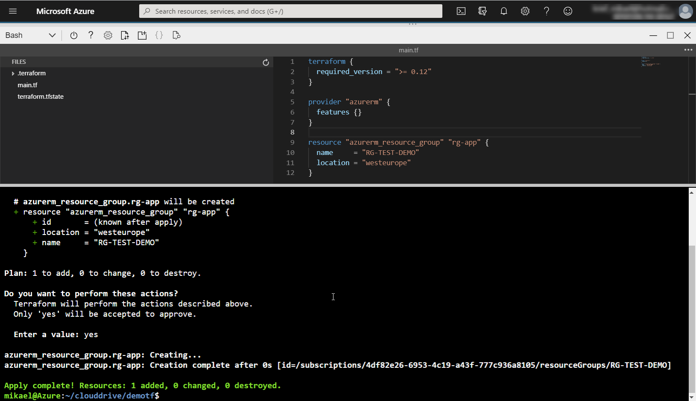
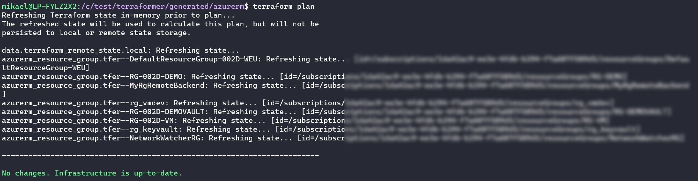

使用 Terraform 配置 Azure 基础设施

Terraform 包含多种提供者，可以实现各种类型基础设施的配置，无论是在云端还是本地。

在本书的前几章中，我们已经学习了 Terraform 语言的基本概念，以及主要的 Terraform 命令行，并且我们也看到了如何通过模块共享 Terraform 配置。此外，我们在前面章节中看到的所有示例都是通用的，适用于所有 Terraform 提供者。

本章将重点介绍如何使用 Terraform 在 Azure 中配置云基础设施。我们将从其在 Azure Cloud Shell 中的集成、其安全认证、以及在 Azure 存储中保护 Terraform 状态文件开始。你将学习如何在 Terraform 中运行 ARM 模板和 Azure CLI 脚本，并且如何通过 Terraform 获取 Azure 资源列表。接着，我们将探讨如何通过 Terraform 在 Azure Key Vault 中保护敏感数据。我们将以两个案例研究为例，第一个展示了包含虚拟机的 IaaS 基础设施的配置，第二个展示了 Azure 中 PaaS 基础设施的配置。最后，我们将进一步探讨如何从现有基础设施生成 Terraform 配置。

本章将覆盖以下教程：

+   在 Azure Cloud Shell 中使用 Terraform

+   保护 Azure 凭据提供者

+   在 Azure 远程后端保护状态文件

+   在 Terraform 中执行 ARM 模板

+   在 Terraform 中执行 Azure CLI 命令

+   使用 Azure Key Vault 和 Terraform 来保护机密

+   获取 Azure 资源列表的 Terraform 配置

+   使用 Terraform 配置和管理 Azure 虚拟机

+   使用 Terraform 构建 Azure 无服务器基础设施

+   为现有的 Azure 基础设施生成 Terraform 配置

# 第七章：技术要求

要应用本章中的教程，你必须拥有 Azure 订阅。如果没有，你可以在此网站免费创建一个 Azure 帐户：[`azure.microsoft.com/en-us/free/`](https://azure.microsoft.com/en-us/free/)

本章的完整源代码可以在此处获取：[`github.com/PacktPublishing/Terraform-Cookbook/tree/master/CHAP06`](https://github.com/PacktPublishing/Terraform-Cookbook/tree/master/CHAP06)

查看以下视频，了解代码的实际应用：[`bit.ly/2ZmEcnJ`](https://bit.ly/2ZmEcnJ)

# 在 Azure Cloud Shell 中使用 Terraform

在本书的第一章，*设置 Terraform 环境*，我们学习了在本地机器上安装 Terraform 的步骤。

在 Azure Shell 控制台中，微软已将 Terraform 集成到默认安装的工具列表中，该控制台被称为**Azure Cloud Shell**。

在本教程中，我们将学习如何编写 Terraform 配置并在 Azure Cloud Shell 中使用 Terraform。

## 准备工作

本教程的前提是拥有 Azure 订阅，并通过 Azure 门户连接到该订阅，访问地址为：[`portal.azure.com/`](https://portal.azure.com/)

请注意，这个前提条件适用于本章的所有教程。

此外，您需要将 Cloud Shell 与现有的 Azure 存储帐户关联，或根据以下文档创建一个新的存储帐户：[`docs.microsoft.com/en-us/azure/cloud-shell/persisting-shell-storage`](https://docs.microsoft.com/en-us/azure/cloud-shell/persisting-shell-storage)。

## 如何执行…

为了在 Azure Cloud Shell 中使用 Terraform，请执行以下步骤：

1.  在 Azure 门户中，通过点击顶部菜单中的 Cloud Shell 按钮打开 Azure Cloud Shell，如下图所示：


1.  在 Cloud Shell 面板中，在顶部菜单的下拉框中选择 Bash 模式：


1.  在 Cloud Shell 终端中，通过执行以下命令，在默认的`clouddrive`文件夹内创建一个新的`demotf`文件夹：

```
mkdir clouddrive/demotf
```

在这个新文件夹中，输入`cd clouddrive/demotf`命令。

1.  要在集成的 Visual Studio Code 实例中编写 Terraform 配置，执行`code`命令。

1.  在编辑器中，在打开的空白页面中，编写以下示例代码的 Terraform 配置：

```
terraform {
  required_version = ">= 0.12"
}

provider "azurerm" {
  features {}
}

resource "azurerm_resource_group" "rg-app" {
  name     = "RG-TEST-DEMO"
  location = "westeurope"
}
```

1.  使用*Ctrl* + *S*快捷键保存此文件，并将其命名为`main.tf`。

1.  最后，要将此 Terraform 配置应用到 Cloud Shell 终端，按照以下经典的 Terraform 工作流执行：

```
> terraform init
> terraform plan -out=app.tfplan
> terraform apply app.tfplan
```

## 它是如何工作的…

在本教程中，我们使用了 Azure Cloud Shell 的集成环境，其中包括一个命令行终端，我们选择使用 Bash 模式。此外，在*步骤 5*和*步骤 6*中，我们使用了内置的 Visual Studio Code 编辑器，使用`code`命令编写了 Terraform 配置，它还为 Terraform 文件提供了语法高亮显示。最后，在*步骤 7*中，我们使用了已安装在 Cloud Shell 环境中的 Terraform 客户端，通过执行 Terraform 工作流命令来部署我们的基础设施。

以下截图展示了带有 Terraform 执行的 Azure Cloud Shell：



我们可以在上面的截图中看到，上面面板是集成的 Visual Studio Code 编辑器，下面面板是执行 Terraform 命令的命令行。

## 还有更多…

对于这个教程，我们选择了直接在 Cloud Shell 中的 Visual Studio Code 编辑 Terraform 文件，但也有以下可选方案：

+   Terraform 文件可以使用**Vim**工具（Linux 编辑器：[`www.linux.com/training-tutorials/vim-101-beginners-guide-vim/`](https://www.linux.com/training-tutorials/vim-101-beginners-guide-vim/)）创建和编辑，该工具已内置于 Cloud Shell。

+   我们也可以在本地计算机上编辑 Terraform 文件，然后将它们复制到与 Azure Cloud Shell 连接的 Azure 存储服务中。

+   如果文件存储在 Git 仓库中，我们也可以通过在 Cloud Shell 命令行终端运行 `git clone` 命令，将仓库直接克隆到 Cloud Shell 存储中。

同样，关于 Terraform 在 Azure 中执行操作的身份验证，我们没有采取任何措施，因为 Azure Cloud Shell 允许直接对我们的 Azure 订阅和 Terraform 进行身份验证，而在 Cloud Shell 中的 Terraform 会自动继承该身份验证。

另一方面，如果你有多个订阅，在执行 Terraform 工作流之前，你必须通过执行以下命令来选择订阅目标：

```
az account set -s <subscription _id>
```

这个选定的订阅将在执行过程中成为默认订阅。请参考文档：[`docs.microsoft.com/en-us/cli/azure/account?view=azure-cli-latest#az-account-set`](https://docs.microsoft.com/en-us/cli/azure/account?view=azure-cli-latest#az-account-set)。

关于 Cloud Shell 上安装的 Terraform 版本，通常是最新的公开版本，你可以通过运行 `terraform --version` 命令来检查。你需要在执行之前检查你的 Terraform 配置是否与此版本兼容。

最后，关于推荐使用 Azure Cloud Shell 进行 Terraform 操作，它仅限于开发和测试使用。它不能集成到 CI/CD 管道中，并且使用你在 Azure 上的个人权限来配置资源。因此，在下一个食谱中，我们将研究如何安全地将 Terraform 认证到 Azure。

## 另见

+   请参考这篇博客文章，其中也展示了在 Azure Cloud Shell 中使用 Terraform：[`cloudskills.io/blog/terraform-azure-01`](https://cloudskills.io/blog/terraform-azure-01)

+   解释如何使用 Azure Cloud Shell 的文档：[`docs.microsoft.com/en-us/azure/cloud-shell/using-cloud-shell-editor`](https://docs.microsoft.com/en-us/azure/cloud-shell/using-cloud-shell-editor)

+   这是一个教程，展示了如何使用和配置本地安装的 Visual Studio Code，以便在 Azure Cloud Shell 中执行 Terraform 配置：[`docs.microsoft.com/en-us/azure/developer/terraform/configure-vs-code-extension-for-terraform`](https://docs.microsoft.com/en-us/azure/developer/terraform/configure-vs-code-extension-for-terraform)

# 保护 Azure 凭证提供者

为了让 Terraform Azure 提供者能够在 Azure 中配置和操作资源，提供者必须使用 Azure 账户进行身份验证，并且该账户必须具有正确的授权。

在前面的步骤中，我们学习了如何使用个人账户和权限在 Azure Cloud Shell 中自动认证 Terraform 上下文。然而，在企业项目和生产环境中，使用个人账户是非常不推荐的做法，因为个人账户可能会过期、被删除，甚至更糟糕的是被滥用。

这就是我们在 Azure 中运行 Terraform 时的选项之一，使用**应用注册**账户（也称为**服务主体**），该账户不与任何物理人挂钩。

在本配方中，我们首先学习如何创建服务主体，然后我们将看到如何安全地使用它来运行 Terraform 配置。

## 准备工作

要应用此配方的第一部分，你必须拥有在 Azure Active Directory 中创建用户账户的权限。此外，要创建此服务主体，我们将使用命令行工具**az cli**来操作，相关文档可参考[`docs.microsoft.com/en-us/cli/azure/?view=azure-cli-latest`](https://docs.microsoft.com/en-us/cli/azure/?view=azure-cli-latest)。

此外，我们还需要检索我们将要配置资源的订阅 ID。为此，我们可以通过运行`az account list`命令在 Azure Cloud Shell 中显示订阅详细信息：


同时，获取相关订阅的`id`属性。

## 如何操作…

本配方包括两部分，分别是：创建服务主体和使用该服务主体配置 Terraform 认证。

要创建此服务主体，请执行以下步骤：

1.  打开 Azure Cloud Shell 并执行以下命令：

```
az ad sp create-for-rbac --name="BookDemoTerraform" --role="Contributor" --scopes="/subscriptions/<Subscription Id>"
```

1.  从前一个命令的输出中检索所有标识信息，记下`appId`、`password`和`tenant`（因为关闭此控制台后，我们将无法检索密码），如以下截图所示：


现在服务主体已经创建，我们可以使用它来通过 Terraform 配置 Azure 基础设施，执行以下步骤：

1.  在命令行终端中，设置以下四个新的环境变量：

```
export ARM_SUBSCRIPTION_ID =<subscription_id>
export ARM_CLIENT_ID=<appId>
export ARM_CLIENT_SECRET=<password>
export ARM_TENANT_ID=<tenant id>
```

1.  然后，我们可以通过执行以下 Terraform 工作流来应用 Terraform 配置：

```
> terraform init
> terraform plan -out=app.tfplan
> terraform apply app.tfplan
```

## 它是如何工作的…

在本配方的第一部分，我们创建了一个服务主体，并使用命令行`az ad sp`为其赋予了订阅权限。我们为此命令添加了以下参数：

+   `name`，即我们将要创建的服务主体的名称。

+   `role`，即服务主体在订阅中所拥有的角色；在此，我们指定为`Contributor`。

+   `scopes`，我们在此指定服务主体将拥有贡献者权限的 Azure 资源 ID。在我们的案例中，这是 Terraform 将配置资源的订阅 ID。

因此，此命令将创建一个服务主体，并为其生成密码，并在指定的订阅上授予 `Contributor` 角色。

执行完毕后，此命令会显示服务主体的信息，包括 `AppId`、`password` 和 `tenant`。如 *步骤 2* 中所解释的，我们需要获取这些信息并妥善保存，因为此密码无法以后重新获取。然后，我们检查服务主体是否具有订阅权限，您可以在以下截图中看到：


在本配方的第二部分，我们使用此服务主体来认证 Terraform Azure 提供程序。为此，有几种解决方案，其中最安全的方式是使用特定的 Azure 提供程序环境变量，因为这些环境变量在代码中不可见，且仅在执行会话期间保持有效。因此，我们设置了四个环境变量，具体如下：

+   `ARM_SUBSCRIPTION_ID`：此字段包含 Azure 订阅 ID。

+   `ARM_CLIENT_ID`：此字段包含服务主体 ID，称为 `AppId`。

+   `ARM_CLIENT_SECRET`：此字段包含服务主体的密码。

+   `ARM_TENANT_ID`：此字段包含 Azure Active Directory 租户的 ID。

在此配方中，我们使用了 Linux 系统的 export 命令。在 Windows PowerShell 中，我们可以使用 `$env` 命令。此外，在本章的所有配方中，我们将在执行 Terraform 之前使用这些环境变量。

然后，一旦设置了这些环境变量，我们就可以执行基本的 Terraform 工作流。

## 还有更多……

关于创建服务主体，我们选择使用 Azure CLI 工具，但也可以直接通过 Azure 门户进行创建，详细信息请参见以下文档：[`docs.microsoft.com/en-us/azure/active-directory/develop/howto-create-service-principal-portal`](https://docs.microsoft.com/en-us/azure/active-directory/develop/howto-create-service-principal-portal)，或者我们也可以使用 Azure PowerShell 命令（[`docs.microsoft.com/en-us/azure/active-directory/develop/howto-authenticate-service-principal-powershell`](https://docs.microsoft.com/en-us/azure/active-directory/develop/howto-authenticate-service-principal-powershell)）。

此外，关于 Terraform Azure 提供程序的配置，我们使用了环境变量，但也可以直接将这些信息写入 Terraform 配置文件，如下所示的代码片段所示：

```
provider "azurerm" {
   ...
  subscription_id = "<Subscription ID>"
  client_id       = "<Client ID>"
  client_secret   = "<Client Secret>"
  tenant_id       = "<Tenant ID>"
}
```

该解决方案不要求在执行 Terraform 配置之前实现额外的步骤（如设置环境变量），但它将身份信息以明文形式保留在代码中，而在安全角度来看，将凭证硬编码在代码中通常被认为是不好的做法，因为代码泄漏也会导致凭证泄漏，并且无法在不暴露凭证的情况下与他人共享代码。如果 Terraform 配置为不同订阅中的多个环境提供资源，则需要添加 Terraform 变量，这可能会增加代码的复杂性。

最后，使用环境变量的优点是它能够轻松集成到 CI/CD 管道中，同时保持身份验证数据的安全性。

## 另请参阅

+   Azure 文档和 Terraform 配置可在此处查看：[`docs.microsoft.com/en-us/azure/developer/terraform/install-configure`](https://docs.microsoft.com/en-us/azure/developer/terraform/install-configure)

+   关于 Azure 提供者的配置文档以及其他身份验证选项，请参阅：[`www.terraform.io/docs/providers/azurerm/index.html`](https://www.terraform.io/docs/providers/azurerm/index.html)

# 保护 Azure 远程后端中的状态文件

在执行 Terraform 工作流命令时，主要是 `terraform plan`、`terraform apply` 和 `terraform destroy`，Terraform 有一个机制，它可以识别哪些资源需要更新、添加或删除。为了执行这个机制，Terraform 维护一个名为 Terraform 状态文件的文件，其中包含所有由 Terraform 提供的资源的详细信息。这个 Terraform 状态文件在首次运行 `terraform plan` 命令时创建，并在每次操作（`apply` 或 `destroy`）后更新。

在企业中，这个文件包含某些有趣的方面，如下所示：

+   提供资源的敏感信息以明文形式显示。

+   如果几个人在一起工作，这个文件必须由每个人共享，否则默认情况下，这个文件会在本地工作站或包含 Terraform 二进制文件的工作站上创建。

+   即使该文件被归档在 Git 源代码管理工具中，一旦在本地工作站上检索，它也不允许多人在同一个文件上进行工作。

+   使用本地存储的文件来管理多环境可能会迅速变得复杂且具有风险。

+   任何对该本地文件的删除或不当手动编辑都可能影响 Terraform 配置的执行。

解决所有这些问题的一种方法是使用远程后端，即将该文件存储在远程、共享和安全的存储中。

在 Terraform 的使用中，有多种远程后端类型，例如 S3、`azurerm`、Artifactory 等，这些类型在以下页面的菜单中列出：[`www.terraform.io/docs/backends/types/index.html`](https://www.terraform.io/docs/backends/types/index.html)

在本食谱中，我们将研究在 Azure 中使用远程后端 `azurerm`，通过将 Terraform 状态文件存储在 Azure 存储帐户中。

## 准备就绪

对于这个食谱，我们将使用 Azure Cloud Shell 和 Azure CLI 命令来创建存储帐户。

本食谱的源代码和所使用的脚本可以在 [`github.com/PacktPublishing/Terraform-Cookbook/tree/master/CHAP06/remotebackend`](https://github.com/PacktPublishing/Terraform-Cookbook/tree/master/CHAP06/remotebackend) 获取。

## 如何操作……

这个食谱由两部分组成。在第一部分，我们将创建存储帐户，在第二部分，我们将配置 Terraform 使用 `azurerm` 远程后端：

1.  在 Azure Cloud Shell 中，执行以下 Azure CLI 脚本（可通过 [`github.com/PacktPublishing/Terraform-Cookbook/blob/master/CHAP06/remotebackend/create-backend.sh`](https://github.com/PacktPublishing/Terraform-Cookbook/blob/master/CHAP06/remotebackend/create-backend.sh) 获取）来在资源组中创建存储帐户及其 blob 容器：

```
# 1- Create Resource Group
az group create --name "RG-TFBACKEND" --location westeurope

# 2- Create storage account
az storage account create --resource-group "RG-TFBACKEND" --name "storagetfbackend" --sku Standard_LRS --encryption-services blob

# 3- Create blob container
az storage container create --name "tfstate" --account-name "storagetfbackend"

# 4- Get storage account key
ACCOUNT_KEY=$(az storage account keys list --resource-group "RG-TFBACKEND" --account-name "storagetfbackend" --query [0].value -o tsv)

echo $ACCOUNT_KEY
```

1.  然后，我们通过将以下代码添加到 `main.tf` 文件中来配置 Terraform 状态后端：

```
terraform {
  backend "azurerm" {
    resource_group_name  = "RG-TFBACKEND"
    storage_account_name = "storagetfbackend"
    container_name       = "tfstate"
    key                  = "myapp.tfstate"
  }
}
```

1.  最后，为了执行 Terraform 配置，我们设置一个新的环境变量 `ARM_ACCESS_KEY`，通过以下命令：

```
export ARM_ACCESS_KEY = <access key>
```

然后，我们执行 Terraform 工作流的基本命令。

## 工作原理……

在第一步中，我们使用了一个脚本，按顺序执行以下操作：

1.  它创建一个名为 `RG-TFBACKEND` 的资源组。

1.  在这个资源组中，我们使用 `az storage account create` 命令创建一个名为 `storagetfbackend` 的存储帐户。

1.  然后，脚本通过 `az storage container create` 命令在这个存储帐户中创建一个 blob 容器。

1.  最后，我们获取已创建的存储帐户的帐户密钥并显示其值。

然后，在*步骤 2*中，我们配置 Terraform 使用这个存储帐户作为远程后端来存储 Terraform 状态文件。在这个配置中，它位于 `backend "azurerm"` 块中，我们一方面指明存储帐户信息，另一方面指明 blob 及其属性：

+   `resource_group_name`：这是包含存储帐户的资源组的名称。

+   `storage_account_name`：这是存储帐户的名称。

+   `container_name`：这是 blob 容器的名称。

+   `key`：这是 Terraform 状态文件的名称。

最后，我们定义了一个新的环境变量`ARM_ACCESS_KEY`，它包含我们从*步骤 1*中运行的脚本中获取的存储帐户密钥。此变量用于身份验证存储帐户。然后，我们执行 Terraform 的`init`、`plan`和`apply`命令。

根据我们在前一个教程中学到的内容，*保护 Azure 凭证提供者*，这是在 Azure 中执行此 Terraform 脚本的完整脚本：

```
export ARM_SUBSCIPTION_ID =<subscription_id>
export ARM_CLIENT_ID=<appId>
export ARM_CLIENT_SECRET=<password>
export ARM_TENANT_ID=<tenant id>
export ARM_ACCESS_KEY=<account key>

> terraform init
> terraform plan -out=app.tfplan
> terraform apply app.tfplan
```

所以，我们使用了四个身份验证环境变量，以及`ARM_ACCESS_KEY`环境变量，用于对存储帐户进行身份验证，并执行了 Terraform 命令。

## 还有更多…

在这个教程中，我们使用了一个环境变量来指定访问密钥的值，以保护这些敏感数据。我们本可以在远程后端配置中使用`access_key`属性来指定它，如下例所示（但正如本章中*保护 Azure 凭证提供者*部分所提到的，将敏感密钥以明文形式保留并不是一个好做法）：

```
terraform {
  backend "azurerm" {
    resource_group_name  = "RG-TFBACKEND"
    storage_account_name = "storagetfbackend"
    container_name       = "tfstate"
    key                  = "myapp.tfstate"
    access_key           = xxxxxx-xxxxx-xxx-xxxxx
  }
}
```

此外，如果我们的 Terraform 配置旨在部署到多个环境，我们可以通过以下步骤创建*N*个`azurerm`后端配置：

1.  `main.tf`文件包含以下代码，其中`backend "azurerm"`块为空：

```
terraform {
  required_version = ">= 0.12"
  backend "azurerm" {
  }
}
```

1.  我们为每个环境创建一个`backend.tfvars`文件（位于该环境的特定文件夹中），并包含以下代码：

```
resource_group_name  = "RG-TFBACKEND"
storage_account_name = "storagetfbackend"
container_name       = "tfstate"
key                  = "myapp.tfstate"
```

1.  最后，在执行`init`命令时，我们使用以下命令指定要使用的`backend.tfvars`文件，如`init`命令文档中所指定，相关文档可在此查看：[`www.terraform.io/docs/backends/config.html#partial-configuration`](https://www.terraform.io/docs/backends/config.html#partial-configuration)：

```
terraform init -backend-config="<path>/backend.tfvars"
```

最后，如果用于与 Terraform 进行身份验证的服务主体（Service Principal）对该存储帐户具有权限，则此环境变量不是必需的。

## 另见

+   有关`azurerm`远程后端的文档，请参见此处：[`www.terraform.io/docs/backends/types/azurerm.html`](https://www.terraform.io/docs/backends/types/azurerm.html)

+   使用`azurerm`远程后端的 Terraform 学习模块请参见此处：[`learn.hashicorp.com/terraform/azure/remote_az#azurerm`](https://learn.hashicorp.com/terraform/azure/remote_az#azurerm)

+   有关 Terraform 远程后端的 Azure 文档，请参见此处：[`docs.microsoft.com/en-us/azure/developer/terraform/store-state-in-azure-storage`](https://docs.microsoft.com/en-us/azure/developer/terraform/store-state-in-azure-storage)

# 在 Terraform 中执行 ARM 模板

在所有**基础设施即代码**（**IaC**）工具和语言中，Azure 提供了一个名为**Azure 资源管理器**（**ARM**）的工具，它基于 JSON 格式文件，包含要配置的资源的描述。

要了解更多有关 ARM 模板的信息，请阅读以下文档：[`docs.microsoft.com/en-us/azure/azure-resource-manager/templates/overview`](https://docs.microsoft.com/en-us/azure/azure-resource-manager/templates/overview)

在使用 Terraform 部署 Azure 资源时，可能需要使用尚未在 Terraform `azurerm`提供者中支持的资源。事实上，`azurerm`提供者是开源的，且基于 GitHub 的社区驱动，拥有庞大的贡献者社区，但这还不足以实时跟进 Azure 功能的所有变化。造成这种情况的原因有几个：

+   Azure 资源的新版本发布非常频繁。

+   Terraform `azurerm`提供者高度依赖 Azure Go SDK（[`github.com/Azure/azure-sdk-for-go`](https://github.com/Azure/azure-sdk-for-go)），而该 SDK 不包含有关新功能或仍处于预览阶段的功能的实时更新。

为了部分解决这个问题，并且对于希望完全使用 Terraform 的组织，可以使用 Terraform `azurerm_template_deployment`资源，该资源允许通过 Terraform 执行 ARM 代码。

在这个食谱中，我们将讨论如何使用 Terraform 执行 ARM 代码。

## 准备工作

这个食谱的 Terraform 配置将部署一个包括扩展的 Azure App Service。由于在编写本书时，`azurerm`提供者中尚不支持扩展 App Service 资源，因此 Azure App Service 代码将使用**HashiCorp 配置语言**（**HCL**）编写，扩展将通过 ARM 模板来部署，并使用 Terraform 执行。

这个食谱的目的是不是详细描述扩展的 ARM 模板代码，而是研究如何用 Terraform 执行它。

在这个食谱中，我们只展示关键代码片段。本章的完整源代码可以在这里找到：[`github.com/PacktPublishing/Terraform-Cookbook/tree/master/CHAP06/arm-template.`](https://github.com/PacktPublishing/Terraform-Cookbook/tree/master/CHAP06/arm-template)

## 如何做到这一点…

要使用 Terraform 执行 ARM 模板，请按照以下步骤操作：

1.  在将包含 Terraform 配置的文件夹内，创建一个名为`ARM_siteExtension.json`的新文件，其中包含以下 ARM JSON 模板片段：

```
{
...
  "parameters": {
    "appserviceName": { ... },
    "extensionName": { ... },
    "extensionVersion": { ... }
  },
  "resources": [
    {
      "type": "Microsoft.Web/sites/siteextensions",
      "name": "[concat(parameters('appserviceName'), '/', parameters('extensionName'))]",
      ...
      "properties": {
        "version": "[parameters('extensionVersion')]"
      }
    }
  ]
}
```

该文件的完整源代码可以在这里找到：[`github.com/PacktPublishing/Terraform-Cookbook/blob/master/CHAP06/arm-template/ARM_siteExtension.json`](https://github.com/PacktPublishing/Terraform-Cookbook/blob/master/CHAP06/arm-template/ARM_siteExtension.json)

1.  在`main.tf`文件中，添加以下 Terraform 代码片段：

```
resource "azurerm_template_deployment" "extension" {
  name                = "extension"
  resource_group_name = azurerm_resource_group.rg-app.name
  template_body       = file("ARM_siteExtension.json")

  parameters = {
    appserviceName   = azurerm_app_service.app.name
    extensionName    = "AspNetCoreRuntime.2.2.x64"
    extensionVersion = "2.2.0-preview3-35497"
  }

  deployment_mode = "Incremental"
}
```

该文件的完整源代码可以在这里找到：[`github.com/PacktPublishing/Terraform-Cookbook/blob/master/CHAP06/arm-template/main.tf`](https://github.com/PacktPublishing/Terraform-Cookbook/blob/master/CHAP06/arm-template/main.tf)

1.  然后，我们可以使用以下命令执行基本的 Terraform 工作流：

    +   本章中讨论的*保护 Azure 凭证提供程序*食谱中，使用四个 Azure 变量环境进行身份验证

    +   如前所述以及在早期章节中提到的，执行 `init`、`plan` 和 `apply` 命令

    ## 它是如何工作的……

    在*步骤 1*中，在包含 Terraform 配置的目录中，我们创建了一个 JSON 文件，包含用于创建应用服务扩展的 ARM 代码。在此 ARM 文件中，我们有以下三个输入参数：

    +   `appserviceName`：这对应于应用服务的名称。

    +   `extensionName`：这对应于要添加的扩展的名称（来自扩展目录）。

    +   `extensionVersion`：这对应于要添加的扩展版本。

    然后，本文件的其余部分描述了在 Azure 中使用这三个参数添加的站点扩展资源。

    然后，在*步骤 2*中，在 Terraform 配置中，我们使用了 Terraform 资源 `azurerm_template_deployment`，该资源允许执行一个 ARM 模板，具有以下属性：

    +   `template_body`：这是 JSON 格式的 ARM 代码。在我们的示例中，我们使用文件函数来指示它是一个文件。

    +   `parameters`：在此块中，我们填写了 ARM 模板的输入属性，包括 `appserviceName`、`extensionName` 和 `extensionVersion`。在我们的食谱中，我们安装了版本为 `2.2.0-preview3-35497` 的 `AspNetCoreRuntime.2.2.x64` 扩展。

    最后，为了预配这个 Azure 应用服务及其扩展，执行 Terraform 工作流命令。

    以下截图显示了 Azure 门户中的结果：

    

    我们可以在应用服务中看到已配置的扩展。

    ## 还有更多内容……

    在本食谱中，我们研究了使用 Terraform 运行 ARM 模板的可能性。这种方法允许你在 Azure 中预配 `azurerm` 提供程序中不可用的元素，但重要的是要知道，Terraform 会识别在执行此 ARM 模板时描述的资源。

    也就是说，这些资源（在这里，我们的资源是扩展）不遵循 Terraform 工作流的生命周期，也没有在 Terraform 状态文件中注册。唯一写入 Terraform 状态文件的内容是资源的配置，`azurerm_template_deployment`，因此，例如，如果你在 Terraform 配置上运行 `terraform destroy` 命令，这些由 ARM 模板提供的资源将不会被销毁。相反，只有 `azurerm_template_deployment` 资源会从 Terraform 状态文件中移除。因此，建议你仅在用 Terraform HCL 代码预配的资源上使用这种类型的部署。

    这确实是我们的情况，因为该扩展是 App Service 的一个集成补充，如果我们运行 `terraform destroy`，不仅会销毁 App Service，还会销毁所有集成在其中的扩展。

    我们已经看到 `destroy` 命令的影响，但在其他命令上也存在相同的问题，例如 `plan`、`import` 或 `refresh` 命令。ARM 模板提供的资源 Terraform 并不认识。

    此外，在 Terraform 中使用 ARM 模板仅对完整的 ARM 资源有效，正如这里的扩展所示，Azure 提供的 ARM 脚本可以直接执行。

    在下一个食谱中，我们将继续这个话题，但我们将不再使用 ARM 模板，而是看看如何在 Terraform 中使用 Azure CLI 命令。

    ## 另见

    +   有关 `azurerm` 提供程序的 `azurerm_template_deployment` 资源的文档可以在此查看：[`www.terraform.io/docs/providers/azurerm/r/template_deployment.html`](https://www.terraform.io/docs/providers/azurerm/r/template_deployment.html)

    +   另一篇博客文章也解释了如何获取 ARM 模板的 JSON 代码，文章链接为：[`www.phillipsj.net/posts/applying-azure-app-service-extensions-with-arm/`](https://www.phillipsj.net/posts/applying-azure-app-service-extensions-with-arm/)

    # 在 Terraform 中执行 Azure CLI 命令

    在前面的食谱中，我们研究了如何在 `azurerm` 提供程序中，所提供的资源尚未可用的情况下，使用 Terraform 运行 ARM 模板。

    然而，存在无法使用 ARM 模板的情况，例如以下几种情况：

    +   我们希望填写资源的一个或多个属性，这些属性在 ARM 模板中并不是自治的。

    +   资源的 ARM 模板不可用。

    对于这些情况，另一种解决方案是通过 Terraform 执行 Azure CLI 命令。

    本食谱是 *使用 Terraform 执行本地程序* 食谱的实际应用，来自第二章，*编写 Terraform 配置*。我们将研究 Terraform 配置及其执行，以便将 Azure CLI 命令与 Terraform 集成。

    ## 准备工作

    对于这个食谱，必须预先阅读 *使用 Terraform 执行本地程序* 食谱，来自第二章，*编写 Terraform 配置*，它为我们将要编写的 Terraform 配置提供了基础。

    此外，还需要提前安装 Azure CLI 工具，相关文档可以在此查看：[`docs.microsoft.com/en-us/cli/azure/?view=azure-cli-latest`](https://docs.microsoft.com/en-us/cli/azure/?view=azure-cli-latest)

    为了展示如何在 Terraform 中使用 Azure CLI 命令，在本食谱中，我们将通过配置静态网站功能的属性来设置 Azure 存储帐户。

    与前面的配方一样，本配方的目的是展示如何使用 Azure CLI 命令与 Terraform 配合使用，但我们不会聚焦于使用的 Azure CLI 命令，因为自`azurerm`提供程序的 2.0.0 版本以来，静态网站的属性已被添加到 Terraform 资源中（[`github.com/terraform-providers/terraform-provider-azurerm/blob/master/CHANGELOG-v2.md#200-february-24-2020`](https://github.com/terraform-providers/terraform-provider-azurerm/blob/master/CHANGELOG-v2.md#200-february-24-2020)）。

    本配方的源代码可以在[`github.com/PacktPublishing/Terraform-Cookbook/tree/master/CHAP06/az%20cli`](https://github.com/PacktPublishing/Terraform-Cookbook/tree/master/CHAP06/az%20cli)找到。

    ## 如何操作……

    执行以下步骤以使用 Terraform 执行 Azure CLI 命令：

    1.  在包含 Terraform 代码的`main.tf`文件中，编写以下配置来为存储账户提供配置：

    ```
    resource "azurerm_storage_account" "sa" {
      name                     = "saazclidemo"
      resource_group_name      = azurerm_resource_group.rg.name
      location                 = "westeurope"
      account_tier             = "Standard"
      account_kind             = "StorageV2"
      account_replication_type = "GRS"
    }
    ```

    1.  在同一 Terraform 配置中，添加代码以使用 Azure CLI 命令配置静态网站：

    ```
    resource "null_resource" "webapp_static_website" {
      triggers = {
        account = azurerm_storage_account.sa.name
      }

      provisioner "local-exec" {
        command = "az storage blob service-properties update --account-name ${azurerm_storage_account.sa.name} --static-website true --index-document index.html --404-document 404.html"
      }
    }
    ```

    1.  然后，在我们的命令行终端中，我们通过执行以下命令登录到 Azure：

    ```
    az login --service-principal --username APP_ID --password PASSWORD --tenant TENANT_ID
    ```

    1.  最后，我们可以通过以下方式执行基本的 Terraform 工作流：

        +   本章中的*保护 Azure 凭证提供程序*配方讨论了使用四个 Azure 变量环境进行身份验证。

        +   执行`init`、`plan`和`apply`命令，如前文及早期章节中提到的。

    ## 它是如何工作的……

    在*步骤 1*中，没有什么特别的。我们只编写了用于提供`StorageV2`存储账户的 Terraform 配置，这对于激活静态网站功能是必需的。

    在*步骤 2*中，我们通过添加包含`local-exec`提供程序的`null_resource`完成了此代码。在`local-exec`的命令属性中，我们输入了必须执行的 Azure CLI 命令，用于激活并配置我们在*步骤 1*中写入的存储账户的静态网站功能。

    我们添加了触发器块，并将存储名称作为参数，这样如果存储名称发生变化，配置将重新执行。

    然后，在*步骤 3*中，我们执行了`az login`命令来验证 Azure CLI 的上下文。在此命令中，我们添加了使用服务主体的认证参数（详见本章中的*保护 Azure 凭证提供程序*配方），文档记录在这里：[`docs.microsoft.com/en-us/cli/azure/create-an-azure-service-principal-azure-cli?view=azure-cli-latest#sign-in-using-a-service-principal`](https://docs.microsoft.com/en-us/cli/azure/create-an-azure-service-principal-azure-cli?view=azure-cli-latest#sign-in-using-a-service-principal)。

    ## 还有更多内容……

    在本配方的实现中，有两个重要点：

    +   第一点是我们使用了 `null_resource` 和已经在 *使用 Terraform 执行本地程序* 配方中详细研究过的 `local-exec` 提供程序，第二章《编写 Terraform 配置》中也有讲解。这里唯一的新意是执行的命令是 Azure CLI 命令，也可以是包含多个 Azure CLI 命令的脚本文件。

    +   第二点是，Terraform 使用四个环境变量进行 Azure 身份验证时，无法验证将由 Terraform 执行的 Azure CLI 上下文。这就是为什么在 *第 3 步* 中，我们还需要通过 `az login` 命令使用服务主体的凭证作为参数来验证 Azure CLI 上下文。

    通过这种方式执行 Azure CLI 命令的优点在于，我们可以将 Terraform 语言的变量和表达式集成到其中，就像我们在将存储帐户名称作为参数传递时所做的那样。

    请注意，与任何本地提供程序一样，这会限制配置应用的地方，因为它假定 Azure CLI 已存在（Azure CLI 成为一个隐藏的依赖项）。

    与之前的 ARM 模板示例 *在 Terraform 中执行 ARM 模板* 一样，我们了解到 Terraform 无法识别在 Azure CLI 命令或脚本中操作的资源。这些资源不遵循 Terraform 生命周期，也未注册在 Terraform 状态文件中。另一方面，在 `null_resource` 的 `local-exec` 提供程序中，我们可以指定一个命令，在执行 `terraform destroy` 命令时执行。

    以下是我用来创建 CosmosDB 数据库的配置示例（在 `azurerm` 提供程序支持之前），展示了以下内容：

    ```
    resource "null_resource" "cosmosdb_database" {
      provisioner "local-exec" {
        command = "az cosmosdb database create --name ${var.cosmosdb_name} --db-name ${var.app_name}   --resource-group ${var.cosmosdb_rg} --throughput ${var.cosmosdb_throughput}"
      }

      provisioner "local-exec" {
       when    = "destroy"
        command = "az cosmosdb database delete --name ${var.cosmosdb_name} --db-name ${var.app_name}   --resource-group ${var.cosmosdb_rg}"
      }
    }
    ```

    在这个示例中，在提供程序中，我们使用了 `When=destroy` 属性，指定在执行 `terraform destroy` 时，Azure CLI 命令 `az cosmosdb database delete` 会被执行以删除 CosmosDB 数据库。

    ## 另见

    +   `az login` 命令及其参数的文档可以在此处找到：[`docs.microsoft.com/en-us/cli/azure/authenticate-azure-cli?view=azure-cli-latest`](https://docs.microsoft.com/en-us/cli/azure/authenticate-azure-cli?view=azure-cli-latest)

    +   Terraform `provisioner` 相关文档可以在此处找到：[`www.terraform.io/docs/provisioners/index.html`](https://www.terraform.io/docs/provisioners/index.html)

    +   `provisioner` 的 `when` 属性的文档可以在此处找到：[`www.terraform.io/docs/provisioners/index.html#destroy-time-provisioners`](https://www.terraform.io/docs/provisioners/index.html#destroy-time-provisioners)

    # 使用 Azure Key Vault 和 Terraform 保护机密

    IaC 的挑战之一是保护基础设施中的敏感信息。

    实际上，基础设施即代码（IaC）的一个优势是能够将代码版本化到 Git 仓库中，因此，这些代码可以受益于 Git 工作流中的版本控制和代码验证。然而，采用这种方法时，我们往往会在代码中写下*所有*内容，有时会忘记一些敏感数据，比如密码或登录字符串，如果这些数据落入错误的手中，可能会被滥用。

    在本配方中，我们将学习如何通过将敏感数据存储在 Azure 的密钥管理器中（即 Azure Key Vault），然后在 Terraform 配置中使用它，从而保护这些敏感数据。

    ## 准备工作

    对于本配方，我们假设使用 Azure Key Vault。有关更多信息，您可以参考以下文档：[`docs.microsoft.com/en-us/azure/key-vault/`](https://docs.microsoft.com/en-us/azure/key-vault/)。

    在我们在 Azure 中创建的 Azure Key Vault 中，就本配方的应用而言，我们存储了一个保护 SQL Server 数据库连接字符串的密钥，该数据库托管在 Azure Web 应用程序中。

    这个连接字符串如下所示：

    ```
    Data Source=mysever.com;initial catalog=databasedemo;User ID=useradmin;Password=demobook
    ```

    这是 Azure CLI 命令 `az keyvault secret show` 的输出，它显示了该密钥在 Azure Key Vault 中的存储位置和属性：

    

    在前面的屏幕截图中，我们可以看到存储在 `secret` 对象的 `value` 属性中的数据库连接字符串。

    本配方的目标是编写 Terraform 配置，请求此密钥的值，并在 Azure App Service 的属性中使用它。

    本配方的源代码可以在这里找到：[`github.com/PacktPublishing/Terraform-Cookbook/tree/master/CHAP06/keyvault`](https://github.com/PacktPublishing/Terraform-Cookbook/tree/master/CHAP06/keyvault)

    ## 如何操作……

    要在 Terraform 中获取和使用 Azure Key Vault 密钥，请执行以下步骤：

    1.  在 Azure Key Vault 中，我们通过授予将由 Terraform 用于 Azure 的 Service Principal 访问权限，来添加访问策略属性，以便它能够获取和列出密钥：

    

    1.  在 `main.tf` 文件中，我们添加以下代码以获取 Key Vault 密钥：

    ```
    data "azurerm_key_vault" "keyvault" {
      name                = "keyvdemobook"
      resource_group_name = "rg_keyvault"
    }

    data "azurerm_key_vault_secret" "app-connectionstring" {
      name         = "ConnectionStringApp"
      key_vault_id = data.azurerm_key_vault.keyvault.id
    }
    ```

    1.  然后，在 App Service 资源的 Terraform 配置中，在 `main.tf` 文件中，我们添加以下代码：

    ```
    resource "azurerm_app_service" "app" {
      name                = "demovaultbook"
      location            = azurerm_resource_group.rg-app.location
      resource_group_name = azurerm_resource_group.rg-app.name
      app_service_plan_id = azurerm_app_service_plan.plan-app.id

      connection_string {
        name  = "Database"
        type  = "SQLServer"
        value = data.azurerm_key_vault_secret.app-connectionstring.value
      }
    }
    ```

    1.  最后，我们按之前的描述以及前面章节中提到的，运行基本的 Azure Terraform 工作流，设置变量环境并执行 `init`、`plan` 和 `apply`。

    ## 它是如何工作的……

    在*第 1 步*中，我们授予了 Terraform 使用的 Service Principal 读取和列出 Azure Key Vault 密钥的权限。

    我们可以通过 Azure 门户或使用 Azure CLI 在命令行上执行此操作，具体方法请参见以下文档：[`docs.microsoft.com/en-us/cli/azure/keyvault?view=azure-cli-latest#az-keyvault-set-policy`](https://docs.microsoft.com/en-us/cli/azure/keyvault?view=azure-cli-latest#az-keyvault-set-policy)

    如果我们没有执行此步骤，在执行 `terraform plan` 命令时将会出现以下错误：

    

    然后，在*步骤 2*中，我们编写了包含两个数据源的 Terraform 配置：

    +   第一个数据源`azurerm_key_vault`允许检索 Azure Key Vault 资源的 Azure ID。

    +   第二个数据源`azurerm_key_vault_secret`用于获取包含数据库连接字符串的密钥作为值。

    有关 Terraform 数据块的更多信息，请阅读第二章中的*使用数据块与外部资源*配方，*编写 Terraform 配置*。

    在*步骤 3*中，我们继续编写 Terraform 配置，将`connection_string`块的属性值填入应用服务中，使用表达式`data.azurerm_key_vault_secret.app-connectionstring.value`，这是从在*步骤 2*中编写的`azurerm_key_vault_secret`数据块中获取的值。

    最后，在最后一步中，我们执行此 Terraform 配置。在此操作中，Terraform 会首先获取在数据块中请求的值（Key Vault，然后是 Key Vault 秘密），然后将从密钥中获取的值注入到应用服务的配置中。

    该结果在 Azure 中获得，并显示在以下截图中：

    

    我们可以看到，连接字符串已在应用服务配置中正确填充。

    ## 还有更多…

    我们在本配方中了解到，作为敏感数据的连接字符串已存储在 Azure Key Vault 中，并且在 Terraform 执行时会自动使用它。因此，感谢 Azure Key Vault，我们无需将敏感数据以明文形式放入 Terraform 配置中。

    然而，仍然需要小心。虽然这些数据在 Terraform 配置中不是以明文形式写入，但它们会以明文形式写入 Terraform 状态文件，如以下从本配方提取的 Terraform 状态文件内容所示：

    

    这就是为什么，如果我们需要检查该文件的内容，建议使用 `terraform state show` 或 `terraform show` 命令，它们可以保护敏感数据的显示，正如以下截图所示：

    

    这是需要通过将 `tfstate` 文件存储在安全的远程后端来保护该文件的原因之一，正如我们在本章的*保护 Azure 远程后端中的状态文件*配方中所见，并且在以下文档中做了详细说明：[`www.terraform.io/docs/state/sensitive-data.html`](https://www.terraform.io/docs/state/sensitive-data.html)

    在这个教程中，尽管我们将敏感数据存储在 Azure Key Vault 中，我们也可以将其存储在与 Terraform 集成良好的 HashiCorp Vault 实例中。为此，建议你阅读 vault 提供程序文档，链接在这里：[`www.terraform.io/docs/providers/vault/index.html`](https://www.terraform.io/docs/providers/vault/index.html)

    最后，作为本教程的前提，我们在 Azure Key Vault 中手动创建了连接字符串的密钥。此操作可以通过 Terraform 完成，文档可参考这里：[`www.terraform.io/docs/providers/azurerm/r/key_vault_secret.html`](https://www.terraform.io/docs/providers/azurerm/r/key_vault_secret.html)，也可以通过 Azure CLI 命令完成，文档参考这里：[`docs.microsoft.com/en-us/cli/azure/keyvault/secret?view=azure-cli-latest#az-keyvault-secret-set`](https://docs.microsoft.com/en-us/cli/azure/keyvault/secret?view=azure-cli-latest#az-keyvault-secret-set)。另一方面，由于数据将在代码中以明文形式写入，因此必须通过仅授权人员授予读写权限来确保安全。

    ## 另见

    +   有关 `azurerm_key_vault_secret` 块数据的文档，请参见这里：[`www.terraform.io/docs/providers/azurerm/d/key_vault_secret.html`](https://www.terraform.io/docs/providers/azurerm/d/key_vault_secret.html)

    # 在 Terraform 中获取 Azure 资源列表

    在前面的教程中，我们学习了使用 `data` 块来获取 Azure 资源属性的实际案例。

    在本教程中，我们将查看 `azurerm` 提供程序中的一个通用数据源，它允许你获取 Azure 中任何已配置资源的信息。

    ## 准备工作

    在这个教程中，我们将编写一个 Terraform 配置，向多个已经预配置的 Azure **网络安全组**（**NSGs**）添加安全规则（这些 NSGs 可能是手动创建的，或者通过 Terraform 创建的）。其目的是向所有具有标签 `DEFAULTRULES=TRUE` 的 NSGs 添加这些规则。

    此外，我们已经在名为 `RG-DEMO` 的资源组中创建了三个 NSGs。在这些 NSGs 中，只有 NSG1 和 NSG2 具有标签 `DEFAULTRULES=TRUE`。

    本教程的源代码可以在这里找到：[`github.com/PacktPublishing/Terraform-Cookbook/tree/master/CHAP06/listresources`](https://github.com/PacktPublishing/Terraform-Cookbook/tree/master/CHAP06/listresources)

    ## 如何操作…

    执行以下步骤以获取 Azure 资源：

    1.  在包含 Terraform 配置的 `main.tf` 文件中，添加以下代码以获取已配置的 NSGs：

    ```
    data "azurerm_resources" "nsg" {
      type                = "Microsoft.Network/networkSecurityGroups"
      resource_group_name = "RG-DEMO"
      required_tags = {
        DEFAULTRULES = "TRUE"
      }
    }
    ```

    1.  然后，在同一个文件中，添加以下代码来创建规则：

    ```
    resource "azurerm_network_security_rule" "default-rules" {
      for_each                    = { for n in  
                                      data.azurerm_resources.nsg.resources 
                                      : n.name => n }
      name                        = "${each.key}-SSH"
      priority                    = 100
      direction                   = "InBound"
      access                      = "Allow"
      protocol                    = "Tcp"
      source_port_range           = "*"
      destination_port_range      = "22"
      source_address_prefix       = "*"
      destination_address_prefix  = "*"
      resource_group_name         = "RG-DEMO"
      network_security_group_name = each.key
    }
    ```

    1.  最后，我们按照之前和前几章所提到的步骤，运行了适用于 Azure 的基本 Terraform 工作流，设置了变量环境，并执行了 `init`、`plan` 和 `apply`。

    ## 它是如何工作的…

    在*步骤 1* 中，我们使用了 `azurerm_resources` 数据对象，允许您获取任何已经配置的 Azure 资源的基本属性。对于此对象，我们配置了以下属性：

    +   `type`：这是请求资源类型。类型列表在此处有文档记录：[`docs.microsoft.com/zh-cn/azure/azure-resource-manager/management/azure-services-resource-providers`](https://docs.microsoft.com/zh-cn/azure/azure-resource-manager/management/azure-services-resource-providers)。在这里，我们填入了值 `Microsoft.Network/networkSecurityGroups`。

    +   `resource_group_name`：这是已经配置了 NSG 的资源组的名称。

    +   `required_tag`：这是我们要过滤 NSG 的标签列表。

    然后，在*步骤 2* 中，我们通过添加 `azurerm_network_security_rule` 资源完成了此 Terraform 配置，该资源允许在已存在的 NSG 中配置规则。在此资源中，我们首先添加了 `for_each` 表达式，它便于对从先前实例化的数据块返回的所有 NSG 进行循环。在构建此循环时，我们使用了表达式 `data.azurerm_resources.nsg.resources`，其中包含从 `data` 块检索的 NSG 列表。此外，在 `name` 属性中，我们添加了一个前缀，即 NSG 的名称，使用表达式 `each.key`。最后，在 `network_security_group_name` 属性中，我们同样使用 `each.key` 作为循环中每个 NSG 的名称。

    关于 `for_each` 表达式和 Terraform 中的循环更多信息，请参考第三章 的配方，*使用 Terraform 构建动态环境*。

    最后，在*步骤 3* 中，我们执行 Terraform 工作流命令来应用这个 Terraform 配置。

    ## 还有更多…

    我们在本配方中学到，通过使用 `azurerm_resources` 在 Terraform 中，我们可以使用任何已经配置的 Azure 资源。

    在 Terraform 配置中，我们还可以添加以下 `output` 变量，该变量允许可视化通过 `azurerm_resource` 数据块返回的资源：

    ```
    output "nsg" {
      value = { for n in data.azurerm_resources.nsg.resources : n.name => n }
    }
    ```

    以下截图显示了此输出的结果：

    

    我们可以在此输出结果中看到，`data` 块已经恢复了两个已经配置的 NSG，并具有标签 `DEFAULTRULEs=TRUE`。此外，您还可以看到每个资源的属性，可以在 Terraform 配置的其余部分中利用。

    但是，必须确保这些资源是在与环境变量 `ARM_SUBSCRIPTION_ID` 中定义的相同订阅中进行配置的，这些变量在执行 Terraform 命令之前设置，正如我们在本章节的 *保护 Azure 凭据提供者* 配方中看到的。

    ## 另请参阅

    +   Terraform 的`azurerm_resources`对象数据的文档可以在此处找到：[`www.terraform.io/docs/providers/azurerm/d/resources.html`](https://www.terraform.io/docs/providers/azurerm/d/resources.html)

    # 使用 Terraform 部署和配置 Azure 虚拟机

    在本节中，我们将研究 Terraform 在 Azure 中的一个典型使用案例，我们将使用 Terraform 在 Azure 中配置和部署虚拟机（VM）。

    ## 准备工作

    对于本节，您不需要任何特殊的前提条件。我们将从零开始编写 Terraform 配置。本节仅涉及编写 Terraform 配置。在实现的各个阶段，我们将学习如何编写这段代码。至于 Azure 的架构，我们已经提前构建了一个网络，其中将包含这个虚拟机，并由以下资源组成：

    +   一个名为**虚拟网络**（**VNet**）的**VNET-DEMO**。

    +   在这个虚拟网络（VNet）中，注册了一个名为`Subnet1`的子网。

    此外，将要部署的虚拟机将具有一个公网 IP 地址，以便可以公开访问。

    最后，为了在代码中保持虚拟机（VM）密码的机密性，我们将其保存在 Azure Key Vault 中，正如本章节的*使用 Azure Key Vault 与 Terraform 保护密钥*一节中所讲解的那样。

    本章的源代码可以在此处找到：[`github.com/PacktPublishing/Terraform-Cookbook/tree/master/CHAP06/vm`](https://github.com/PacktPublishing/Terraform-Cookbook/tree/master/CHAP06/vm)

    ## 如何操作…

    编写以下 Terraform 配置以通过 Terraform 部署虚拟机：

    1.  第一个要构建的资源是资源组，以下代码可以帮助完成这一步：

    ```
    resource "azurerm_resource_group" "rg" {
      name     = "RG-VM"
      location = "West Europe"
    }
    ```

    1.  然后，我们编写以下代码来部署公网 IP：

    ```
    resource "azurerm_public_ip" "ip" {
      name                = "vmdemo-pip"
      resource_group_name = azurerm_resource_group.rg.name
      location            = azurerm_resource_group.rg.location
      allocation_method   = "Dynamic"
    }
    ```

    1.  接下来，我们继续编写网络接口的代码：

    ```
    data "azurerm_subnet" "subnet"{
      name = "Default1"
      resource_group_name = "RG_NETWORK"
      virtual_network_name = "VNET-DEMO"
    }

    resource "azurerm_network_interface" "nic" {
      name                = "vmdemo-nic"
      resource_group_name = azurerm_resource_group.rg.name
      location            = azurerm_resource_group.rg.location

      ip_configuration {
        name                          = "vmipconf"
        subnet_id                     = data.azurerm_subnet.subnet.id
        private_ip_address_allocation = "Dynamic"
        public_ip_address_id          = azurerm_public_ip.ip.id
      }
    }
    ```

    1.  我们使用`keyvault`数据块获取虚拟机密码：

    ```
    data "azurerm_key_vault" "keyvault" {
      name                = "keyvdemobook"
      resource_group_name = "rg_keyvault"
    }

    data "azurerm_key_vault_secret" "vm-password" {
      name         = "vmdemoaccess"
      key_vault_id = data.azurerm_key_vault.keyvault.id
    }
    ```

    1.  最后，我们编写虚拟机资源的代码，如下所示：

    ```
    resource "azurerm_linux_virtual_machine" "vm" {
      name                            = "myvmdemo"
    ...
      admin_username                  = "adminuser"
      admin_password                  = data.azurerm_key_vault_secret.vm-password.value
      network_interface_ids = [azurerm_network_interface.nic.id]

      source_image_reference {
        publisher = "Canonical"
        offer     = "UbuntuServer"
        sku       = "18.04-LTS"
        version   = "latest"
      }
    ...

      provisioner "remote-exec" {
        inline = [
          "apt update",
        ]
        connection {
          host     = self.public_ip_address
          user     = self.admin_username
          password = self.admin_password
        }
      }
    }
    ```

    这些虚拟机资源的完整源代码可以在[`github.com/PacktPublishing/Terraform-Cookbook/blob/master/CHAP06/vm/main.tf`](https://github.com/PacktPublishing/Terraform-Cookbook/blob/master/CHAP06/vm/main.tf)查看。

    ## 它是如何工作的…

    在*步骤 1*中，我们编写了 Terraform 配置，创建包含虚拟机的资源组。此步骤是可选的，因为你可以将虚拟机部署到现有的资源组中，在这种情况下可以使用`azurerm_resource_group`数据块，其文档可以在此处找到：[`www.terraform.io/docs/providers/azurerm/d/resource_group.html`](https://www.terraform.io/docs/providers/azurerm/d/resource_group.html)

    然后，在*步骤 2*和*步骤 3*中，我们编写了 Terraform 配置，提供了以下内容：

    +   一个动态类型的公网 IP，以便我们不必手动设置 IP 地址（这个 IP 地址将是子网中第一个可用地址）。

    +   虚拟机使用此 IP 地址的网络接口，并将在已创建的子网中注册。为了获取子网 ID，我们使用了`azurerm_subnet`数据源。

    在*第 4 步*中，我们使用`azurerm_key_vault_secret`数据源获取虚拟机的密码（更多详情请参见*使用 Azure Key Vault 与 Terraform 保护密钥*食谱）。

    最后，在*第 5 步*中，我们编写了用于配置虚拟机的代码。在这段代码中，我们定义了虚拟机的以下属性：

    +   它的名称和大小（包括其 RAM 和 CPU）

    +   使用的基本镜像，通常是 Ubuntu 镜像

    +   用于虚拟机的身份验证信息，包括登录名和密码（也可以使用 SSH 密钥）

    在这个资源中，我们还添加了`remote-exec`提供器，它允许你直接在将要配置的虚拟机上远程执行命令或脚本。使用这个提供器可以帮助你配置虚拟机的管理、安全或中间件安装任务。

    ## 还有更多……

    这个方法的新颖之处在于加入了`remote-exec`提供器，它允许通过命令或脚本配置虚拟机（VM）。这种方法在执行虚拟机的初始管理步骤时非常有用，比如打开防火墙端口、创建用户和执行其他基本任务。在我们的示例中，我们用它来通过执行`apt update`命令更新软件包。不过，这种方法要求虚拟机能够从运行 Terraform 的计算机访问，因为它需要连接到虚拟机（通过 SSH 或 WinRM）并执行命令。

    如果你想保持真正的基础设施即代码（IaC），最好使用如 Ansible、Puppet、Chef 或 PowerShell DSC 等工具进行配置。因此，在使用 Ansible 配置 Windows 虚拟机的情况下，`remote-exec`提供器可以很好地用于授权虚拟机上的 WinRM SSL 协议，因为这个端口是 Ansible 用于配置 Windows 机器的端口。

    此外，在 Azure 中，你还可以使用自定义脚本虚拟机扩展，这是另一种使用脚本配置虚拟机的方式。在这种情况下，你可以使用`azurerm_virtual_machine_extension`资源通过 Terraform 来配置此虚拟机扩展，具体说明请参考以下文档：[`www.terraform.io/docs/providers/azurerm/r/virtual_machine_extension.html`](https://www.terraform.io/docs/providers/azurerm/r/virtual_machine_extension.html)

    警告：每个虚拟机只能有一个自定义脚本扩展。因此，你必须将所有配置操作放在一个脚本中。

    除了提供`remote-exec`和虚拟机扩展之外，另一种解决方案是使用 Terraform 资源`azurerm_virtual_machine`的`custom_data`属性。关于`custom_data`属性的文档可以在[`www.terraform.io/docs/providers/azurerm/r/linux_virtual_machine.html#custom_data`](https://www.terraform.io/docs/providers/azurerm/r/linux_virtual_machine.html#custom_data)找到，完整的代码示例可以在[`github.com/terraform-providers/terraform-provider-azurerm/blob/master/examples/virtual-machines/linux/custom-data/main.tf`](https://github.com/terraform-providers/terraform-provider-azurerm/blob/master/examples/virtual-machines/linux/custom-data/main.tf)查看。

    最后，作为虚拟机配置的另一种选择，我们还可以使用**Packer**预配置虚拟机镜像，Packer 是 HashiCorp 的另一个开源工具，允许你使用 JSON 或 HCL2（如[`www.packer.io/guides/hcl`](https://www.packer.io/guides/hcl)文档中所述）创建自己的虚拟机镜像。创建好镜像后，在 Terraform 的虚拟机配置中，我们将使用 Packer 创建的镜像名称，而不是市场提供的镜像（如 Azure 或其他云提供商）。关于 Packer 的更多信息，请参阅以下文档：[`www.packer.io/`](https://www.packer.io/)

    ## 另请参见

    在 Azure 文档中提供了各种教程和指南，可以在这里找到：[`docs.microsoft.com/en-us/azure/developer/terraform/create-linux-virtual-machine-with-infrastructure`](https://docs.microsoft.com/en-us/azure/developer/terraform/create-linux-virtual-machine-with-infrastructure)

    # 使用 Terraform 构建 Azure 无服务器基础设施

    在之前的教程中，我们研究了允许在 Azure 中配置 IaaS（即虚拟机）基础设施的 Terraform 配置实现。

    在本教程中，我们将保持与上一个教程相同的领域，但这次我们将专注于编写用于配置 PaaS 无服务器基础设施的 Terraform 配置，同时配置一个 Azure 应用服务。

    ## 准备工作

    本教程的目的是配置一个 Web 应用类型的 Azure 应用服务。在配置过程中，我们将使用 Terraform 在应用服务创建的同时部署一个应用程序。

    本教程所需的大部分 Terraform 配置已经在本书的多个教程中讲解过。我们只需要研究部署应用程序到 Web 应用所需的 Terraform 配置。

    关于应用程序，它必须打包成格式为 `<appname>_<version>.zip` 的 ZIP 文件，例如 `myapp_v0.1.1.zip`，然后我们将这个 ZIP 文件上传到 Azure Blob 存储中。这个 ZIP 文件可以通过命令行 Azure CLI 上传，具体操作请参见文档 [`docs.microsoft.com/en-us/cli/azure/storage/blob?view=azure-cli-latest#az-storage-blob-upload`](https://docs.microsoft.com/en-us/cli/azure/storage/blob?view=azure-cli-latest#az-storage-blob-upload)，或者通过 Terraform 使用 `azurerm_storage_blob` 资源上传，文档可以在这里找到：[`www.terraform.io/docs/providers/azurerm/r/storage_blob.html`](https://www.terraform.io/docs/providers/azurerm/r/storage_blob.html)。

    我们将在本配方中编写的 Terraform 配置将以安全的方式使用这个 ZIP 文件。该配方的源代码可以在 [`github.com/PacktPublishing/Terraform-Cookbook/tree/master/CHAP06/webapp.`](https://github.com/PacktPublishing/Terraform-Cookbook/tree/master/CHAP06/webapp) 获取。

    ## 如何操作…

    按照以下步骤使用 Terraform 配置 Web 应用：

    1.  将以下 Web 应用的 Terraform 代码复制并粘贴到一个新的 Terraform 文件中，地址为 [`github.com/PacktPublishing/Terraform-Cookbook/tree/master/CHAP06/sample-app`](https://github.com/PacktPublishing/Terraform-Cookbook/tree/master/CHAP06/sample-app)。

    1.  在这个 Terraform 文件中，我们添加了一个新的 `azurerm_storage_account` 数据块，代码如下：

    ```
    data "azurerm_storage_account" "storagezip" {
      name                = "storappdemo"
      resource_group_name = "RG-storageApp"
    }
    ```

    1.  然后，我们添加另一个 `azurerm_storage_account_sas` 数据块，以获取安全令牌，代码如下：

    ```
    data "azurerm_storage_account_sas" "storage_sas" {
      connection_string = data.azurerm_storage_account.storagezip.primary_connection_string
    ...
      services {
        blob  = true
    ...
      }
      start  = "2020–06–15"
      expiry = "2021–03–21"
      permissions {
        read    = true
        write   = false
       ...
      }
    }
    ```

    这个代码块的完整代码可以在 [`github.com/PacktPublishing/Terraform-Cookbook/blob/master/CHAP06/webapp/main.tf`](https://github.com/PacktPublishing/Terraform-Cookbook/blob/master/CHAP06/webapp/main.tf) 获取。

    1.  最后，我们通过添加以下代码来更新 `azurerm_app_resource` 中的 Azure Web 应用代码：

    ```
    resource "azurerm_app_service" "app" {
    ...
      app_settings = {
        "WEBSITE_RUN_FROM_PACKAGE" = "https://${data.azurerm_storage_account.storagezip.name}.blob.core.windows.net/app/myapp_v1.0.0/zip${data.azurerm_storage_account_sas.storage_sas.sas}"
      }
    }
    ```

    ## 它是如何工作的…

    在*第 1 步*中，我们检索了允许 Web 应用程序部署的 Terraform 配置。在接下来的配方步骤中，我们将完成配置，以便能够在该 Web 应用中直接通过 Terraform 部署 Web 应用程序，同时进行资源的预配。

    然后，在*第 2 步*中，我们添加了 `azurerm_storage_account` 数据块，这将使我们能够从包含应用程序 ZIP 文件的存储账户中检索属性。在*第 3 步*中，我们添加了 `azurerm_storage_account_sas` 数据块，它将返回一个安全令牌到 Blob。

    在这个令牌中，我们指明访问将是只读的，并且我们只授予对 Blob 服务的访问权限。

    最后，在*第 4 步*中，我们通过在 `azurerm_app_service` 资源中添加 `WEBSITE_RUN_FROM_PACKAGE` 键的应用程序设置来完成配置，该键的值是包含 ZIP 文件完整 URL 的字符串，并且我们将返回的令牌密钥与该 URL 拼接在一起。

    ## 还有更多…

    在这个配方中，我们研究了如何通过 Terraform 配置部署 Azure Web App。尽管如此，仍有几种其他方式可以将此应用程序部署到 Web 应用中，详细内容请参见文档：[`docs.microsoft.com/en-us/azure/app-service/deploy-zip`](https://docs.microsoft.com/en-us/azure/app-service/deploy-zip)。

    我们将在第七章的*Terraform 深度探讨*配方中学习如何在 Azure Pipelines 中通过 CI/CD 管道自动化这一部署过程。

    ## 另见

    +   有关 Web 应用的`WEBSITE_RUN_FROM_PACKAGE`应用设置的文档，请参见：[`docs.microsoft.com/en-us/azure/app-service/deploy-run-package`](https://docs.microsoft.com/en-us/azure/app-service/deploy-run-package)

    +   有关`azurerm_storage_account_sas`块数据的文档，请参见：[`www.terraform.io/docs/providers/azurerm/d/storage_account_sas.html`](https://www.terraform.io/docs/providers/azurerm/d/storage_account_sas.html)

    +   有关 Terraform 资源`azurerm_app_service`的文档，请参见：[`www.terraform.io/docs/providers/azurerm/r/app_service.html`](https://www.terraform.io/docs/providers/azurerm/r/app_service.html)

    # 为现有的 Azure 基础设施生成 Terraform 配置

    当企业希望自动化他们的流程并采用基础设施即代码（IaC）实践（例如，使用 Terraform）时，他们面临着如何为已经配置好的基础设施生成代码的挑战。

    实际上，对于新的基础设施，写好相应的 Terraform 配置后执行它即可完成资源的配置。而对于已经配置的资源，根据其数量和配置情况，编写所有 Terraform 配置并执行它以生成相应的 Terraform 状态文件可能会很长且繁琐。此外，这一 Terraform 配置的执行可能会对这些资源产生副作用，尤其是当它们已经在生产环境中使用时。

    作为这个问题的部分答案，我们已经在第四章的*导入现有资源*配方中看到，*使用 Terraform CLI*，我们可以使用`terraform import`命令将已经配置的资源导入到 Terraform 状态文件中。然而，这个命令要求：一方面，必须提前写好相应的 Terraform 配置，因为这个命令只会更新 Terraform 状态文件；另一方面，每个资源都必须执行该命令才能导入。

    鉴于此，并且在许多客户提出类似请求后，我问自己这个问题：是否有工具或脚本可以用于为已经在 Azure 中配置的资源生成 Terraform 配置及其 Terraform 状态文件？

    在本教程中，我将与您分享我使用其中一个 Terraform 配置生成工具的研究结果，这个工具叫做**Terraformer**，它托管在 Google Cloud Platform 的 GitHub 仓库中，网址是[`github.com/GoogleCloudPlatform/terraformer`](https://github.com/GoogleCloudPlatform/terraformer)。

    ## 准备就绪

    要使用**Terraformer**，首先必须下载与您希望生成代码的 Terraform 提供程序版本相对应的版本。在我们的案例中，我们希望为 Azure 基础设施生成 Terraform 配置，因此我们运行以下 Linux 脚本：

    ```
    curl -LO https://github.com/GoogleCloudPlatform/terraformer/releases/download/$(curl -s https://api.github.com/repos/GoogleCloudPlatform/terraformer/releases/latest | grep tag_name | cut -d '"' -f 4)/terraformer-azure-linux-amd64
     chmod +x terraformer-azure-linux-amd64
     sudo mv terraformer-azure-linux-amd64 /usr/local/bin/terraformer
    ```

    此脚本下载**Terraformer** ZIP 包，解压缩后将其复制到`/usr/local/bin`本地文件夹中。

    本教程将使用 Linux 终端进行，但 Terraformer 在 Windows 上也能以相同的方式工作，具体如以下文档所述：[`github.com/GoogleCloudPlatform/terraformer#installation`](https://github.com/GoogleCloudPlatform/terraformer#installation)

    安装完成后，可以通过执行`terrafor``mer --help`命令来检查其是否安装成功，并显示 Terraformer 命令列表：

    

    本教程的目的是生成 Azure 基础设施的 Terraform 配置和 Terraform 状态文件，Azure 基础设施由多个资源组组成，如下所示的屏幕截图所示：

    

    本教程中，我们将把 Terraform 配置的生成限制为这些资源组，而不是它们的内容。

    ## 如何操作…

    要使用**Terraformer**生成 Terraform 配置，请执行以下步骤：

    1.  在将包含生成代码的文件夹中，我们创建了一个名为`provider.tf`的文件，并在其中声明了 Terraform 提供程序的代码，如下所示：

    ```
    provider "azurerm" {
      features {}
    }
    ```

    1.  在命令行终端中，在此文件夹内，我们需要通过运行`terraform init`命令下载`azurerm`提供程序。

    1.  然后，我们为 Terraform 身份验证设置四个 Azure 环境变量：

    ```
    export ARM_SUBSCRIPTION_ID="xxxxxx-xxx-xxxxx-xxxx"
    export ARM_CLIENT_ID="xxxxx-xxxx-xxxx-xxxxx"
    export ARM_CLIENT_SECRET="xxxx-xxxxxx-xxxxxx-xxxxx"
    export ARM_TENANT_ID="xxxxx-xxxxxx-xxxxx-xxxxx"
    ```

    1.  然后，我们通过执行以下**Terraformer**命令来生成 Terraform 配置：

    ```
    terraformer import azure --resources=resource_group  --compact --path-pattern {output}/{provider}/
    ```

    1.  一旦生成了 Terraform 配置和 Terraform 状态文件，我们将进入生成的`generate/azurerm`文件夹，并将`features {}`表达式添加到`provider.tf`文件中，如下所示：

    ```
    provider "azurerm" {
      version = "~>v2.14.0"
      features {}
    }
    ```

    1.  最后，在这个文件夹中，我们将通过运行基本的 Terraform 工作流，使用`terraform init`和`terraform plan`命令来测试生成的配置：

    

    如果输出成功生成，我们应该能看到配置&生成并没有应用任何更改。它与我们的基础设施完全一致。

    ## 它是如何工作的……

    在*第 1 步*中，我们创建了一个包含提供者声明的文件用于下载。然后，我们使用`terraform init`命令下载它，这个命令是在第二步执行的。

    *第 3 步*对应于我们在本章的*保护 Azure 凭证提供者*部分中详细描述的 Azure 认证环境变量集。然后，在*第 4 步*中，我们使用 Terraformer 为已提供的 Azure 组资源生成了 Terraform 配置和 Terraform 状态文件，在使用的命令行中，我们指定了以下选项：

    +   `resources`：这是需要生成 Terraform 配置的 Azure 资源列表。

    +   `compact`：这使得可以指定所有 Terraform 配置将生成在一个单一文件中。

    +   `path-pattern`：此项指定了将包含生成代码的文件夹的模式。

    以下截图展示了 Terraformer 的执行情况：

    

    `generated/azurerm`文件夹已经生成了 Terraform 文件，如下截图所示：

    

    在此文件夹中，我们看到以下生成的文件：

    +   Terraform 配置的`.tf`文件 – `resources.tf`、`provider.tf`、`outputs.tf` 和 `variables.tf`

    +   `tfstate`文件 – `terraform.tfstate`

    在*第 5 步*中，我们将`features {}`表达式添加到了在`generated/azurerm`文件夹中生成的提供者声明中。

    最后，在*第 6 步*中，我们通过执行`terraform plan`命令的预览，验证了生成的代码是基础设施代码。在执行过程中，不会应用任何更改。Terraform 配置与我们的基础设施高度一致。

    ## 还有更多……

    Terraformer 还包含一个选项，可以进行干运行，预览将要生成的代码。

    为此，我们将执行以下命令，生成一个`plan.json`文件，并包含将要生成的资源的描述：

    ```
    terraformer plan azure --resources=resource_group --compact --path-pattern {output}/{provider}/ 
    ```

    我们查看这个创建的 JSON 文件的内容以检查其一致性，然后，为了执行生成，我们执行以下命令：

    ```
    terraformer import plan generated/azurerm/plan.json
    ```

    此外，在使用 Terraformer 之前，有必要检查要生成的资源是否得到良好的支持。例如，在 Azure 的情况下，资源列表可以在这里找到：[`github.com/GoogleCloudPlatform/terraformer#use-with-azure`](https://github.com/GoogleCloudPlatform/terraformer#use-with-azure)。

    最后，在其他 Terraform 配置生成工具中，有一个非常好的工具叫做**az2tf** ([`github.com/andyt530/py-az2tf`](https://github.com/andyt530/py-az2tf))，它曾经基于相同的 Terraformer 原则，但不幸的是，这个工具已经不再维护。此外，还有**TerraCognita** ([`github.com/cycloidio/terracognita/`](https://github.com/cycloidio/terracognita/))，它仍然集成了多个 Azure 资源，以及**Terraforming** ([`github.com/dtan4/terraforming`](https://github.com/dtan4/terraforming))，该工具仅适用于 AWS。这些工具的问题在于，它们需要跟随 Terraform 语言和不同提供商的演进，这需要大量的开发和维护时间。

    ## 另请参见

    Terraformer 的源代码和文档可以在此处找到：[`github.com/GoogleCloudPlatform/terraformer`](https://github.com/GoogleCloudPlatform/terraformer)。
