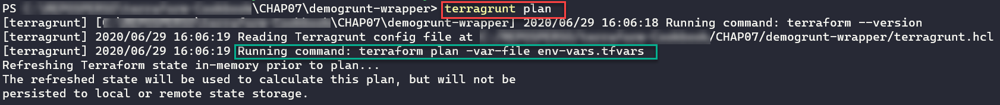

深入探索 Terraform

在本书中，我们从与 Terraform 安装相关的配方开始，涵盖了 Terraform 配置的编写以及使用 Terraform CLI 命令。接着我们研究了通过使用模块共享 Terraform 配置。最后，我们专注于使用 Terraform 构建 Azure 基础设施。

现在，在本章中，我们将讨论一些配方，帮助我们更深入地使用 Terraform。我们将学习如何通过 Terraform 模板生成 Ansible 库存，并使用 `kitchen-terraform` 插件测试 Terraform 配置。我们将讨论如何防止资源被销毁，如何使用 Terraform 实现零停机部署技术，以及如何检测在 Terraform 应用更改时资源的删除。

然后我们将讨论使用 **Terragrunt** 来管理 Terraform 配置的依赖关系，并将其用作 Terraform CLI 的封装器。最后，我们将研究 Terraform 运行时的集成以及在 CI/CD 流水线中管理工作区。

在本章中，我们涵盖了以下配方：

+   使用 Terraform 创建 Ansible 库存

+   使用 kitchen-terraform 测试 Terraform 配置

+   防止资源被销毁

+   使用 Terraform 实现零停机部署

+   检测由计划命令删除的资源

+   使用 Terragrunt 管理 Terraform 配置依赖

+   使用 Terragrunt 作为 Terraform 的封装器

+   在 Azure Pipelines 中为 Terraform 配置构建 CI/CD 流水线

+   在 CI/CD 中使用工作区

# 第八章：技术要求

本章的配方需要以下前提条件：

+   `kitchen-terraform`，可以在 [`github.com/newcontext-oss/kitchen-terraform`](https://github.com/newcontext-oss/kitchen-terraform)上找到，同时还需要 Ruby，可以从 [`www.ruby-lang.org/en/`](https://www.ruby-lang.org/en/) 下载。

+   Terragrunt 的文档可以在 [`terragrunt.gruntwork.io/`](https://terragrunt.gruntwork.io/) 找到。

+   此外，我们还将使用 **jq** 工具来解析 JSON。你可以从 [`stedolan.github.io/jq/`](https://stedolan.github.io/jq/) 下载它。

+   最后，在与 CI/CD 一起工作时，我们将使用 Azure Pipelines 作为我们的 CI/CD 平台。Azure Pipelines 是 Azure DevOps 的一项服务。你可以通过 [`azure.microsoft.com/en-us/services/devops/`](https://azure.microsoft.com/en-us/services/devops/) 创建一个免费账户。

本章的源代码可以在本书的 GitHub 仓库中找到，地址为 [`github.com/PacktPublishing/Terraform-Cookbook/tree/master/CHAP07`](https://github.com/PacktPublishing/Terraform-Cookbook/tree/master/CHAP07)。

查看以下视频以查看代码实例：

"YouTube Bitly 链接"

# 使用 Terraform 创建 Ansible 库存

Terraform 是一个非常好的**基础设施即代码**（**IaC**）工具，它允许我们通过代码构建复杂的基础设施。

正如我们在第六章的*使用 Terraform 配置 Azure 基础设施*中研究过的，关于虚拟机的构建，所有云提供商中，Terraform 的共同目标是构建一个虚拟机，但不进行配置，这包括其中间件的安装和管理。

在允许我们使用 Terraform 配置虚拟机（VM）创建后进行配置的**配置即代码**（**CaC**）工具中，有一个非常受欢迎的工具是**Ansible** ([`www.ansible.com/`](https://www.ansible.com/))，它在开源世界中非常流行（与 Chef 和 Puppet 类似）。

Ansible 的一个优点是它不需要代理，这意味着你无需在要配置的虚拟机上安装代理。因此，为了知道哪些虚拟机需要配置，Ansible 使用一个名为`inventory`的文件，该文件包含需要配置的虚拟机列表。

在本配方中，我们将学习如何使用 Terraform 的模板功能生成这个`inventory`文件。

## 准备工作

本配方的目的是讨论如何自动创建 Ansible 的`inventory`文件，而不是讨论 Ansible 的安装和使用。

若要了解更多关于 Ansible 的信息，我邀请你阅读我书中的*第三章，使用 Ansible 配置 IaaS 基础设施*，这本书名为*学习 DevOps*，也可以在 Packt 上找到，网址为 [`www.packtpub.com/eu/cloud-networking/learning-devops`](https://www.packtpub.com/eu/cloud-networking/learning-devops)。

我们配方的起点是使用 Terraform 在 Azure 中创建虚拟机，而这些虚拟机的私有 IP 地址在创建之前是未知的。在此 Terraform 配置中，我们使用了在第六章的*使用 Terraform 配置和部署 Azure 虚拟机*配方中已经学习过的配置，*使用 Terraform 配置 Azure 基础设施*。因此，为了简化起见，我们使用了公共注册表中发布的 Terraform 模块，并采用以下 Terraform 配置：

1.  实例化一个`vmhosts`变量，该变量指定我们希望创建的虚拟机的主机名：

```
variable "vmhosts" {
  type    = list(string)
  default = ["vmwebdemo1", "vmwebdemo2"]
}
```

1.  然后，使用`network`模块并从公共注册表计算来创建网络中的虚拟机：

```
module "network" {
  source = "Azure/network/azurerm"
  resource_group_name = "rg-demoinventory"
  subnet_prefixes = ["10.0.2.0/24"]
  subnet_names = ["subnet1"]
}

module "linuxservers" {
  source = "Azure/compute/azurerm"
  resource_group_name = "rg-demoinventory"
  vm_os_simple = "UbuntuServer"
  nb_instances = 2
  nb_public_ip = 2
  vm_hostname = "vmwebdemo"
  public_ip_dns = var.vmhosts
  vnet_subnet_id = module.network.vnet_subnets[0]
}
```

在前面的 Terraform 配置中，我们创建了一个虚拟网络和一个子网，并创建了两个将具有私有 IP 地址的 Linux 虚拟机。

本配方的目标是在相同的 Terraform 配置中生成一个`inventory`文本文件，该文件将包含 Terraform 创建的主机列表（以及它们的 IP 地址）。这个清单文件将采用以下格式：

```
[vm-web]
<host1> ansible_host=1<ip 1>
<host2> ansible_host=<ip 2>
```

本配方的完整源代码可以在 [`github.com/PacktPublishing/Terraform-Cookbook/tree/master/CHAP07/ansible-inventory`](https://github.com/PacktPublishing/Terraform-Cookbook/tree/master/CHAP07/ansible-inventory)找到。

## 如何操作……

要通过 Terraform 生成 Ansible inventory，请执行以下步骤：

1.  在包含 Terraform 配置的文件夹内，我们创建一个名为 `template-inventory.tpl` 的新文件，内容如下：

```
[vm-web]
%{ for host, dns in vm_dnshost ~}
${host} ansible_host=${dns}
%{ endfor ~}
```

1.  然后，在创建 VM 的 Terraform 配置的 `main.tf` 文件中，我们添加以下代码来生成 `inventory` 文件：

```
resource "local_file" "inventory" {
  filename = "inventory"
  content = templatefile("template-inventory.tpl",
    {
         vm_dnshost = zipmap(var.vmhosts,module.linuxservers.network_interface_private_ip)
    })
}
```

1.  最后，为了创建 VM 并生成 `inventory` 文件，我们运行基本的 Terraform `init`、`plan` 和 `apply` 工作流命令。

## 它是如何工作的……

我们首先创建一个 `template-inventory.tpl` 文件，该文件使用 Terraform 的模板格式。在这个文件中，我们使用一个 `for` 循环，语法为 `%{ for host, ip in vm_dnshost ~}`，它允许我们循环遍历 `vm_dnshost` 变量的元素。对于循环中的每个 VM，我们使用以下语法：

```
${host} ansible_host=${ip}
```

我们通过 `%{ endfor ~}` 语法结束循环。

有关此模板格式的更多详细信息，请阅读文档：[`www.terraform.io/docs/configuration/expressions.html#string-templates`](https://www.terraform.io/docs/configuration/expressions.html#string-templates)。

然后在 *第 2 步* 中，我们在 Terraform 配置中添加一个 `local_file` 资源（我们已经在第二章的 *使用 Terraform 操作本地文件* 配方中学习过），在其中填写以下属性：

+   `filename`：它的值为 `inventory`，即将生成的文件名。

在这个示例中，文件将在当前包含此 Terraform 配置的目录中生成。你可以选择进入另一个文件夹进行生成和存储。

+   `content`：包含将填充此文件的元素。这里，我们使用 `templatefile` 函数，传递以下作为参数：

    +   模板文件的名称 `template-inventory.tpl`，这是我们在 *第 1 步* 中创建的文件

    +   `vm_dnshost` 变量将填充模板文件的内容。我们使用内置的 Terraform `zipmap` 函数，它允许我们从两个列表构建一个映射，一个是键列表，另一个是值列表。

关于 `zipmap` 函数的文档可以在[`www.terraform.io/docs/configuration/functions/zipmap.html`](https://www.terraform.io/docs/configuration/functions/zipmap.html)找到。

+   `depend_on`：这个参数是 Terraform 语言的一部分，表示两个或多个资源之间的依赖关系（关于 Terraform 依赖关系的文档可以在[`learn.hashicorp.com/terraform/getting-started/dependencies`](https://learn.hashicorp.com/terraform/getting-started/dependencies)找到）。在这里，我们表示 `local_file` 资源与 VM 模块之间的依赖关系，这样 Terraform 只有在创建 VM 后才会创建 `inventory` 文件。

最后，在最后一步中，我们执行 Terraform 工作流的命令，在执行结束时，我们可以看到`inventory`文件确实已经生成，内容如下：

```
[vm-web]
vmwebdemo1 ansible_host=10.0.2.5
vmwebdemo2 ansible_host=10.0.2.4
```

现在，所有新添加到此 Terraform 配置中的虚拟机将动态地添加到此 Ansible 库存中。

## 还有更多……

本食谱的主要目的是展示我们在 Ansible 库存中应用的 Terraform 模板的使用。这些模板可以有多种其他用途，比如使用`cloud-init`文件来配置虚拟机，具体内容可以参考文章[`grantorchard.com/dynamic-cloudinit-content-with-terraform-file-templates/`](https://grantorchard.com/dynamic-cloudinit-content-with-terraform-file-templates/)。

## 另见

+   Terraform `templatefile`函数的文档可以在[`www.terraform.io/docs/configuration/functions/templatefile.html`](https://www.terraform.io/docs/configuration/functions/templatefile.html)找到。

+   `local`提供者的`local_file`资源的文档可以在[`registry.terraform.io/providers/hashicorp/local/latest/docs/resources/file`](https://registry.terraform.io/providers/hashicorp/local/latest/docs/resources/file)找到。

+   Packt 出版的关于 Ansible 的书籍列表可以在[`subscription.packtpub.com/search?query=ansible`](https://subscription.packtpub.com/search?query=ansible)找到。

+   这里有一系列关于 Ansible 库存由 Terraform 生成的网页文章，提供了不同的解决方案：

    +   [`hooks.technology/2020/02/using-terraform-and-ansible-together/`](https://hooks.technology/2020/02/using-terraform-and-ansible-together/)

    +   [`www.linkbynet.com/produce-an-ansible-inventory-with-terraform`](https://www.linkbynet.com/produce-an-ansible-inventory-with-terraform)

    +   [`gist.github.com/hectorcanto/71f732dc02541e265888e924047d47ed`](https://gist.github.com/hectorcanto/71f732dc02541e265888e924047d47ed)

    +   [`stackoverflow.com/questions/45489534/best-way-currently-to-create-an-ansible-inventory-from-terraform`](https://stackoverflow.com/questions/45489534/best-way-currently-to-create-an-ansible-inventory-from-terraform)

# 使用 kitchen-terraform 测试 Terraform 配置

我们已经在第五章的*使用 Terratest 测试 Terraform 模块代码*食谱中，*共享 Terraform 配置与模块*，学习了如何使用 Terratest 框架测试 Terraform 模块。

在这个食谱中，我们将使用另一个工具测试 Terraform 配置：**KitchenCI**及其`kitchen-terraform`插件。

## 准备工作

`kitchen-terraform`是用 Ruby 编写的，并且是**KitchenCI**（简称**Kitchen**）的一个插件，Kitchen 是一个基础设施即代码（IaC）测试工具。为了正确应用此食谱，您必须首先理解 Kitchen 的原理和工作流程，这些内容有文档记录在[`kitchen.ci/index.html`](https://kitchen.ci/index.html)。

由于 Kitchen 是用**Ruby**编写的，你需要在计算机上安装 Ruby（可以从[`www.ruby-lang.org/en/`](https://www.ruby-lang.org/en/)下载，确保使用至少 2.4 版本），并按照[`www.ruby-lang.org/en/documentation/installation/`](https://www.ruby-lang.org/en/documentation/installation/)提供的安装文档进行安装。

除了 Ruby，我们还需要安装**Bundle**，可以从[`bundler.io/`](https://bundler.io/)获得。它是 Ruby 包的依赖管理工具。

我们可以通过使用 RubyGems（Ruby 包管理器）来安装`kitchen-terraform`，可以通过运行以下命令来完成：

```
gem install kitchen-terraform
```

或者，第二种方式是，我们可以使用 Kitchen 推荐的使用 gem 和 bundle 的方法，按照以下步骤进行：

1.  在包含要测试的 Terraform 配置的文件夹中，我们创建一个 Gemfile，其中包含要安装的包的列表（此处指定`kitchen-terraform`包），内容如下：

```
source "https://rubygems.org/" do
  gem "kitchen-terraform", "~> 5.4"
end
```

1.  在终端中，执行以下命令来安装 Gemfile 中引用的包：

```
bundle install
```

执行上述命令会安装运行`kitchen-terraform`所需的所有包。

最后，关于编写测试，我们将使用**Inspec**，这是一个基于 Rspec 的测试框架。Inspec 允许你测试本地系统甚至是云中的基础设施。有关 Inspec 的更多信息，建议你阅读其文档：[`www.inspec.io/`](https://www.inspec.io/)。

为了简单地说明如何使用`kitchen-terraform`，我们将在本食谱中测试 Terraform 配置的正确性，该配置会生成一个 Ansible 清单文件，我们在之前的食谱中已经学习过。我们编写的测试目的是验证`inventory`文件是否确实已经生成并且不是空的。

在本食谱中，目标不是测试网络和虚拟机的创建，而是仅测试`inventory`文件。

最后，和所有集成测试一样，最好有一个隔离的系统或环境来运行测试。

本食谱的源代码可以在[`github.com/PacktPublishing/Terraform-Cookbook/tree/master/CHAP07/kitchen`](https://github.com/PacktPublishing/Terraform-Cookbook/tree/master/CHAP07/kitchen)找到。

## 如何实现…

要测试使用`kitchen-terraform`执行的 Terraform 配置，执行以下步骤：

1.  在包含 Terraform 配置的文件夹内，创建 Inspec 的`test`文件夹，文件树结构如下：

```
test > integration > kt_suite
```

1.  在`kt_suite`文件夹中，添加一个名为`inspec.yml`的 Inspec 配置文件，文件内容如下：

```
---
name: default
```

1.  在`kt_suite`文件夹中，创建一个名为`controls`的新文件夹，该文件夹将包含 Inspec 测试。然后，在`controls`文件夹中，添加一个名为`inventory.rb`的文件，文件内容如下：

```
control "check_inventory_file" do
  describe file('./inventory') do
    it { should exist }
    its('size') { should be > 0 }
  end
end
```

1.  在 Terraform 配置文件夹的根目录下，我们创建一个名为`kitchen.yml`的 Kitchen 配置文件，内容如下：

```
---
driver:
  name: terraform

provisioner:
  name: terraform

verifier:
  name: terraform
  systems:
    - name: basic
      backend: local
      controls:
        - check_inventory_file
platforms:
  - name: terraform
suites:
  - name: kt_suite
```

1.  在终端（位于 Terraform 配置文件夹的根目录下）中，运行以下 `kitchen` 命令：

```
kitchen test
```

## 它是如何工作的…

该配方的执行分为三个阶段：

1.  编写检查测试

1.  编写 Kitchen 配置

1.  Kitchen 执行

从 *步骤 1 到 3*，我们通过以下步骤编写了检查测试：

1.  首先，我们创建了一个文件夹结构，用于存放配置文件和 Inspec 测试。在 `kt_suite` 文件夹中，我们创建了 `inspec.yml` 文件，这是 Inspec 配置文件。在我们的案例中，这个文件仅包含 `name` 属性，并且其值为 `default`。

若要了解更多关于 Inspec 配置文件的信息，请参阅文档：[`www.inspec.io/docs/reference/profiles/`](https://www.inspec.io/docs/reference/profiles/)。

1.  然后，在 `controls > inventory.rb` 文件中，我们通过创建一个 `control "check_inventory_file" do` 控制项来编写 Inspec 测试（使用 Rspec 格式），该控制项包含了这些测试。在这些测试中，我们使用了资源 `file` Inspec（参见文档：[`www.inspec.io/docs/reference/resources/file/`](https://www.inspec.io/docs/reference/resources/file/)），它允许我们对文件执行测试。在这个控制项中，资源的属性是 `inventory`，这是由 Terraform 生成的库存文件的名称。在这个控制项中，我们编写了两个测试：

    +   `it { should exist }`：此库存文件必须存在于磁盘上。

    +   `its('size') { should be > 0 }`：此文件的大小必须大于 `0`，因此它必须包含一些内容。

测试编写完成后，在 *第 4 步* 中，我们创建了 `kitchen.yml` 文件，该文件包含 Kitchen 配置，由三部分组成，第一部分是驱动程序：

```
driver:
  name: terraform
```

驱动程序是用于测试的平台。Kitchen 支持多种虚拟和云平台。在我们的案例中，我们使用由 `kitchen-terraform` 插件提供的 `terraform` 驱动程序。

Kitchen 支持的驱动程序文档可以在此查看：[`kitchen.ci/docs/drivers/`](https://kitchen.ci/docs/drivers/)。

`kitchen.yml` 文件的第二部分是 `provisioner`：

```
provisioner:
  name: terraform
```

`provisioner` 是一个用于配置虚拟机的工具。它可以使用脚本、Chef、Ansible 或 **Desired State Configuration**（**DSC**）。在我们的案例中，由于我们在测试中不进行虚拟机配置，因此我们使用由 `kitchen-terraform` 提供的 `terraform` 提供者。

Kitchen 支持的提供者文档可以在此查看：[`kitchen.ci/docs/provisioners/`](https://kitchen.ci/docs/provisioners/)。

第三部分是 `verifier`：

```
verifier:
  name: terraform
  systems:
    - name: basic
      backend: local
      controls:
        - check_inventory_file
platforms:
  - name: terraform
suites:
  - name: kt_suite
```

`verifier` 是一个用于测试由提供者应用的组件的系统。我们可以使用 Inspec、Chef、shell 或 pester 作为我们的测试框架。在我们的案例中，我们在控制节点上配置了验证器，并编写了 *第 2 步* 中的 Inspec 测试套件。此外，`control` 属性是可选的——它允许我们在测试过程中筛选需要执行的 Inspec 控制项。

关于 Kitchen 支持的验证器的文档可以在 [`kitchen.ci/docs/verifiers/`](https://kitchen.ci/docs/verifiers/) 上查看。

1.  最后，在最后一步，我们通过执行 `kitchen test` 命令来进行测试，该命令将根据 YAML 配置文件执行以下操作：

    1.  执行 Terraform 工作流的 `init` 和 `apply` 命令。

    1.  运行 Inspec 测试。

    1.  执行 `destroy` Terraform 命令来删除为测试提供的所有资源。

此次执行的结果显示在接下来的三张截图中。

实际上，这些操作是在同一控制台和工作流中执行的。我将其拆分为三张截图，以便更好地展示，因为仅用一张截图无法看到全部内容。

以下截图显示了 `init` 和 `apply` 命令的执行过程：


以下截图显示了 Inspec 的执行过程：


最后一张截图显示了 `destroy` 命令：


这三张截图显示了 Terraform 的执行过程，接着是 Inspec 测试的成功执行，表明我的 `inventory` 文件确实是由 Terraform 生成的，最后是销毁为测试分配的资源。

## 还有更多……

若要深入了解测试的编写，我们可以添加 Inspec 的 `its('content')` 表达式，这样我们就可以测试文件的内容，具体说明请参考 Inspec 文档 [`www.inspec.io/docs/reference/resources/file/`](https://www.inspec.io/docs/reference/resources/file/)。

关于本示例中测试的执行，我们需要执行 `kitchen test` 命令。如果是集成测试，在执行测试后，我们不想销毁通过 Terraform 创建的资源，可以执行 `kitchen verify` 命令。

最后，如前言中所述，在本示例中我们使用 `kitchen-terraform` 来测试 Terraform 配置，但我们也可以使用它来测试 Terraform 模块。

## 另见

+   KitchenCI 文档可以在 [`kitchen.ci/`](https://kitchen.ci/) 上查看。

+   `kitchen-terraform` 插件的源代码可以在 [`github.com/newcontext-oss/kitchen-terraform`](https://github.com/newcontext-oss/kitchen-terraform) 上找到。

+   你可以在 [`newcontext-oss.github.io/kitchen-terraform/tutorials/`](https://newcontext-oss.github.io/kitchen-terraform/tutorials/) 上找到关于 `kitchen-terraform` 的教程。

+   有关 `kitchen test` 命令的更多信息，请参阅文档 [`kitchen.ci/docs/getting-started/running-test/`](https://kitchen.ci/docs/getting-started/running-test/)。

# 防止资源被销毁

使用 IaC 时需要注意某些情况。实际上，当 IaC 集成到 CI/CD 管道中时，包含重要数据的资源可能会被自动删除。这可以通过更改 Terraform 资源的属性来完成，这需要删除并重新创建该资源，或者执行 `terraform destroy` 命令。幸运的是，Terraform 在其语言中包含了一项配置，防止敏感资源被销毁。

在本食谱中，我们将展示如何防止销毁 Terraform 配置中管理的资源。

## 准备工作

对于本食谱，我们将使用一个 Terraform 配置，代码可在 [`github.com/PacktPublishing/Terraform-Cookbook/tree/master/CHAP07/sample-app`](https://github.com/PacktPublishing/Terraform-Cookbook/tree/master/CHAP07/sample-app) 找到。该配置旨在管理 Azure 中的以下资源：

+   资源组

+   一个服务计划

+   一个 Azure 应用服务（Web 应用）实例

+   一个 Azure Application Insights 实例

在公司项目中，我们常常遇到一个问题，涉及到包含数据的资源。在我们的示例中，这是包含应用程序日志和指标的 Application Insights 实例，该实例属于 Web 应用并且不应被自动删除。

让我们设想一个情境：一家公司决定更改其资源的命名规则，我们需要使用新的命名规则更新 Terraform 配置。当运行 Terraform 时，我们将从 `terraform plan` 命令中获得以下结果：


如你所见，名称更改需要删除包含重要日志指标的 Application Insights 实例。

本食谱的目的是更改 Terraform 配置，使得 Application Insights 资源永远不会被删除。

本食谱的源代码可以在 [`github.com/PacktPublishing/Terraform-Cookbook/tree/master/CHAP07/preventdestroy`](https://github.com/PacktPublishing/Terraform-Cookbook/tree/master/CHAP07/preventdestroy) 找到。

## 如何操作…

为了防止 Terraform 删除资源，请执行以下步骤：

1.  在 Application Insights 资源的 Terraform 配置中，添加以下 `lifecycle` 块：

```
resource "azurerm_application_insights" "appinsight-app" {
...
  lifecycle {
    prevent_destroy = true
  }
}
```

1.  在 `variables.tf` 中，将 `app_name` 变量的默认值更改为另一个名称，如 `MyApp2-DEV1`。

1.  执行 Terraform CLI 工作流，并且结果如下图所示：


## 工作原理…

在本示例中，我们添加了 Terraform `lifecycle` 块，其中包含允许与资源管理交互的属性。在这里，我们使用了 `prevent_destroy` 属性，顾名思义，它可以防止指定资源被销毁。

## 还有更多…

正如我们讨论过的，`prevent_destroy`属性允许你禁止资源的删除。

请注意，在我们以 Azure 为例的情况下，此属性并不会禁止通过 Azure 门户或 Azure CLI 删除资源。

但需要注意的是，如果 Terraform 配置中的资源包含此属性，并且在执行`terraform apply`命令时必须删除此属性，那么`prevent_destroy`属性会阻止应用程序对 Terraform 配置中描述的所有资源进行更改。这会阻止我们对资源应用更改。这也是我个人将 Terraform 配置拆分的原因之一，将不能被销毁的敏感资源配置放在一个文件夹中（因此会有一个单独的 Terraform 状态文件），而其他资源则放在另一个文件夹中。这样，我们可以应用资源的更改，而不会被资源销毁防护设置所阻塞。

在这里，我写的是关于拆分 Terraform 配置和状态文件的内容，但在 CI/CD 流水线中，也有必要拆分工作流，一个流水线负责应用更改，另一个负责销毁资源。

此外，主要是为了防止人为错误，无法通过想要使该属性的值动态化的方式将变量添加到`lifecycle`块的属性值中。你可能尝试使用`bool`类型的变量，例如以下代码：

```
lifecycle { 
 prevent_destroy = var.prevent_destroy_ai 
}
```

然而，在执行`terraform apply`命令时，会发生以下错误：


这些错误表示在`lifecycle`块中不允许使用变量，因此你必须在代码中保持 true/false 的值。

## 另请参见

+   `prevent_destroy`属性的文档可以在[`www.terraform.io/docs/configuration/resources.html#prevent_destroy`](https://www.terraform.io/docs/configuration/resources.html#prevent_destroy)找到。

+   有关漂移管理的有趣文章可以在[`www.hashicorp.com/blog/detecting-and-managing-drift-with-terraform/`](https://www.hashicorp.com/blog/detecting-and-managing-drift-with-terraform/)找到。

+   阅读 HashiCorp 的这篇文章，了解如何使用 Terraform 实现功能切换、蓝绿部署和金丝雀测试，文章地址：[`www.hashicorp.com/blog/terraform-feature-toggles-blue-green-deployments-canary-test/`](https://www.hashicorp.com/blog/terraform-feature-toggles-blue-green-deployments-canary-test/)。

# 使用 Terraform 进行零停机部署

如前一教程所讨论，改变 Terraform 配置中描述的某些资源属性可能导致资源被销毁并随后重新创建。资源按 Terraform 中执行的顺序被销毁和重新创建。换句话说，第一个执行的资源将首先被销毁，然后重新创建，在生产环境中，在这段时间内，可能会导致停机，也就是服务中断。停机时间的长短取决于需要销毁并重建的资源类型。

例如，在 Azure 中，虚拟机（VM）销毁和重建的时间要比 Web 应用或**网络安全组**（**NSG**）规则更长。

在 Terraform 中，有一种机制可以实现零停机时间，从而避免在删除资源时出现服务中断。

在本教程中，我们将研究如何在 Terraform 配置中描述的资源上实现零停机时间。

## 准备工作

对于本教程，我们将使用来自 [`github.com/PacktPublishing/Terraform-Cookbook/tree/master/CHAP07/sample-app`](https://github.com/PacktPublishing/Terraform-Cookbook/tree/master/CHAP07/sample-app) 的 Terraform 配置。此配置的目的是管理 Azure 中的以下资源：

+   一个资源组

+   一个服务计划

+   一个应用服务（Web 应用）实例

+   一个应用程序洞察实例

此外，这个 Terraform 配置已经应用于 Azure 云。

对于我们的使用案例，假设某公司决定更改资源名称，我们需要使用新名称更新 Terraform 配置。运行 Terraform 时，使用 `terraform plan` 命令将获得以下结果：


如你所见，名称更改需要删除托管我们 Web 应用的 Web 应用程序。这次删除将在重新创建时导致应用程序在短时间内无法访问。本教程的目的是修改 Terraform 配置，即使删除应用服务资源，Web 应用仍然可用。

本教程的源代码可以在 [`github.com/PacktPublishing/Terraform-Cookbook/tree/master/CHAP07/zerodowntime`](https://github.com/PacktPublishing/Terraform-Cookbook/tree/master/CHAP07/zerodowntime) 获取。

## 怎么做……

为了在 Terraform 配置中实现零停机时间，执行以下步骤：

1.  在 Terraform 配置中，在 `azurerm_app_service` 资源内，添加 `lifecycle` 块，如下所示的代码：

```
resource "azurerm_app_service" "app" {
  name                = "${var.app_name}-${var.environement}"
...
  lifecycle {
    create_before_destroy = true
  }
}
```

1.  更改应用服务的 `name` 属性以应用新的命名法。

1.  执行 Terraform CLI 工作流，`terraform apply` 结果将显示如下截图所示：


## 它是如何工作的……

在*第 2 步*中，我们为`azurerm_app_service`资源添加了`lifecycle`块。在这个块中，我们添加了`create_before_destroy`属性，并将其值设置为`true`。这个属性使得在资源被销毁时，Terraform 会先重新创建资源，然后再删除原始资源，从而实现资源的再生成。

## 还有更多…

正如我们所看到的，使用这个属性后，服务不再中断。只要新资源未创建，旧资源就不会被删除，应用程序会继续在线。

然而，在使用`create_before_destroy`之前，需要考虑以下几点：

+   `create_before_destroy`属性仅在配置更改需要删除并重新生成资源时有效。它仅在执行`terraform apply`命令时有效；在执行`terraform destroy`命令时无效。

+   你必须小心确保将要创建的资源的名称与之后将被销毁的资源名称不同。否则，如果名称相同，资源可能不会被创建。

此外，零停机时间技术只有在受影响的资源在创建完成时完全可用时才真正有效。例如，以虚拟机为例：尽管 Terraform 可以快速创建它，但它在所有配置（中间件安装和应用程序部署）完成后仍然存在。所有这些配置可能会产生停机时间，因此，在这种情况下，我建议使用 HashiCorp 的 Packer（[`www.packer.io/`](https://www.packer.io/)），它可以创建已经完全配置好的虚拟机镜像。

要在 Azure 中使用 Packer 和 Terraform 实现零停机时间，请阅读教程[`docs.microsoft.com/en-us/azure/developer/terraform/create-vm-scaleset-network-disks-using-packer-hcl`](https://docs.microsoft.com/en-us/azure/developer/terraform/create-vm-scaleset-network-disks-using-packer-hcl)。

最后，我们已经在本教程中看到如何使用 Terraform 实现零停机时间的部署，但根据你的提供者，可能还有其他本地的实践。例如，我们还可以使用负载均衡器，对于 Azure 上的 App Service 实例，我们可以使用插槽，正如在文档中所解释的[`docs.microsoft.com/en-us/azure/app-service/deploy-staging-slots`](https://docs.microsoft.com/en-us/azure/app-service/deploy-staging-slots)。

## 另请参见

+   阅读关于`create_before_destroy`属性的 HashiCorp 博客文章，链接：[`www.hashicorp.com/blog/zero-downtime-updates-with-terraform/`](https://www.hashicorp.com/blog/zero-downtime-updates-with-terraform/)。

+   关于零停机时间的好文章可以在[`dzone.com/articles/zero-downtime-deployment`](https://dzone.com/articles/zero-downtime-deployment)找到。

# 检测由`plan`命令删除的资源

Terraform 的一个关键特性是可以通过`terraform plan`命令预览将要应用到特定基础设施上的更改。

在本书中，我们经常讨论如何在终端中显示更改的可视化效果，但我们较少讨论如何自动评估和分析`terraform plan`命令的结果。

在这个食谱中，我们将学习如何分析`terraform plan`命令的结果。

## 准备工作

要应用这个食谱，我们需要安装**jq**工具，所有平台均可从[`stedolan.github.io/jq/`](https://stedolan.github.io/jq/)下载。

在这个食谱中，我们将在 Windows 上使用 PowerShell 运行 jq，但其他操作系统上的所有步骤都是一样的。

使用的 Terraform 配置可以在[`github.com/PacktPublishing/Terraform-Cookbook/tree/master/CHAP07/detectdestroy`](https://github.com/PacktPublishing/Terraform-Cookbook/tree/master/CHAP07/detectdestroy)找到，并且我们必须在基础设施上预先运行它。

这个食谱的目的是通过脚本检测`terraform plan`的执行是否会导致资源被销毁。

## 如何操作…

执行以下步骤以分析`plan`命令的结果：

1.  在 Terraform 配置中，我们更改了 App Service 实例的`name`属性的值（通过添加`test`一词），如下所示：

```
resource "azurerm_app_service" "app" {
  name = "${var.app_name}-test-${var.environement}"
....
}
```

1.  然后，我们执行`terraform init`命令，再执行`terraform plan`命令：

```
terraform plan -out="tfout.tfplan"
```

1.  最后，我们执行以下 PowerShell 脚本，分析被删除资源的数量：

```
$tfplan = terraform show -json tfout.tfplan
$actions = $tfplan | jq.exe .resource_changes[].change.actions[]
$nbdelete = $actions -match 'delete' | Measure-Object | Select-Object Count
Write-Host $nbdelete.Count
```

此脚本也可以在[`github.com/PacktPublishing/Terraform-Cookbook/blob/master/CHAP07/detectdestroy/detectdestroy.ps1`](https://github.com/PacktPublishing/Terraform-Cookbook/blob/master/CHAP07/detectdestroy/detectdestroy.ps1)找到。

## 它是如何工作的…

在*第 1 步*，我们通过更改 App Service 实例的名称来修改 Terraform 配置，这将在`apply`命令执行时导致该资源被销毁。

然后，在*第 2 步*，我们执行`terraform plan`命令，并使用`-out="tfout.tfplan"`选项，这样我们可以将`plan`的输出保存到文件中（以二进制格式）。

最后，在*第 3 步*，我们编写 PowerShell 脚本，分析生成的计划中在应用过程中将要销毁的资源数量。该脚本由四行代码组成。以下是详细信息：

1.  在第 1 行，我们在*第 2 步*生成的`tfout.tfplan`文件上使用`terraform show`命令。我们在此命令中添加了`-json`选项，以便以 JSON 格式获取输出。

1.  在第 2 行，我们在前一行获得的 JSON 结果上使用**jq**，并过滤出 Terraform 将要应用的操作列表，以获得操作数组（`add`、`delete`和`no-op`）。

1.  在第 3 行，我们在此数组上筛选所有`delete`操作，并使用`Count` PowerShell 对象获取该筛选数组的数量。

1.  在最后一行，我们显示了计数值，该值对应于已删除的资源数量。

以下截图展示了此脚本的结果：


`$nbdelete.Count`返回`1`，表示将被删除的资源数量。

## 还有更多……

关于此食谱所使用的脚本语言，我们使用了 PowerShell 编写，但当然也可以用任何脚本语言编写，如 Bash 或 Python。我们还可以将此脚本放入一个函数中，该函数在执行`terraform plan`命令后立即调用，并且在该函数返回正数删除数量时不`apply` Terraform 配置。

还有其他工具用于解析和处理`terraform plan`命令生成的计划。在这些工具中，包括`npm`包，如`terraform-plan-parser`，可在[`github.com/lifeomic/terraform-plan-parser`](https://github.com/lifeomic/terraform-plan-parser)上获取，或**Terraform 的 Open Policy Agent**，可在[`www.openpolicyagent.org/docs/latest/terraform/`](https://www.openpolicyagent.org/docs/latest/terraform/)上查看。

## 另请参阅

+   有关`terraform plan`命令的 JSON 格式的详细文档，可在[`www.terraform.io/docs/internals/json-format.html`](https://www.terraform.io/docs/internals/json-format.html)查阅。

+   `terraform show`命令的文档可以在[`www.terraform.io/docs/commands/show.html`](https://www.terraform.io/docs/commands/show.html)查阅。

# 使用 Terragrunt 管理 Terraform 配置依赖关系

在本书的几个食谱中，我们讨论了包含 Terraform 配置的文件组织。在第二章的*在多个环境中配置基础设施*食谱中，我们对此进行了更具体的探讨，*编写 Terraform 配置*，概述了几种架构解决方案。

关于配置结构的最佳实践之一是将 Terraform 配置分为基础设施和应用程序组件，如[`www.cloudreach.com/en/resources/blog/how-to-simplify-your-terraform-code-structure/`](https://www.cloudreach.com/en/resources/blog/how-to-simplify-your-terraform-code-structure/)文章中所述。将结构拆分为多个配置的挑战在于维护这些组件之间的依赖关系和运行计划。

在所有与 Terraform 相关的第三方工具中，有一个由 Gruntwork 开发的**Terragrunt**([`terragrunt.gruntwork.io/`](https://terragrunt.gruntwork.io/))。Terragrunt 是开源的，并为 Terraform 配置的组织和执行提供了许多附加功能。

在本示例中，我们将学习如何使用 Terragrunt 管理不同 Terraform 配置之间的依赖关系。

## 准备工作

对于本示例，我们必须提前在工作站上安装 Terragrunt 二进制文件，具体操作可以参考[`terragrunt.gruntwork.io/docs/getting-started/install/#install-terragrunt`](https://terragrunt.gruntwork.io/docs/getting-started/install/#install-terragrunt)。

在本示例中，我们将构建一个由以下元素组成的基础设施：

+   一个资源组

+   一个包含虚拟网络和子网的网络

+   一台虚拟机

包含此 Terraform 配置的文件夹架构如下：


这个架构的问题在于配置之间的依赖关系，以及它们必须按照特定顺序执行。实际上，为了应用网络，必须先应用资源组，虚拟机也是如此：网络必须先创建。使用 Terraform 时，在有多个更改的情况下，Terraform 工作流必须针对每个配置多次执行，并确保顺序正确。

本示例的目的是演示 Terragrunt 的一个功能：简化当 Terraform 配置被拆分到多个文件夹并通过依赖关系链接时的 Terraform 执行，而不是详尽地解释 Terragrunt 的所有功能。

本示例的源代码可以在[`github.com/PacktPublishing/Terraform-Cookbook/tree/master/CHAP07/demogrunt/dev`](https://github.com/PacktPublishing/Terraform-Cookbook/tree/master/CHAP07/demogrunt/dev)找到。

## 如何做到这一点…

执行以下步骤以使用 Terragrunt 和 Terraform 的依赖关系：

1.  要在`network`和`rg`配置之间添加依赖关系，在`network`文件夹内添加一个名为`terragrunt.hcl`的新文件，内容如下：

```
dependencies {
  paths = ["../rg"]
}
```

1.  在`vm-dev`文件夹内，添加一个名为`terragrunt.hcl`的新文件，内容如下：

```
dependencies {
  paths = ["../rg", "../network"]
}
```

1.  在终端中，在`network`文件夹内运行以下`terragrunt`命令来创建资源组和网络：

```
> terragrunt init
> terragrunt plan-all
> terragrunt apply-all
```

## 它是如何工作的…

我们添加的`terragrunt.hcl`文件包含了 Terragrunt 的配置。

在我们在*第 2 步*中编写的配置中，我们指明了网络配置和资源组配置之间的依赖关系。这是因为在执行网络配置之前，必须先创建资源组。

在*第 3 步*中，我们执行了 Terragrunt 命令（`terragrunt init`，`terragrunt plan-all`和`terragrunt apply-all`），执行时，凭借我们编写的配置，Terragrunt 会先对资源组执行 Terraform，再自动对网络执行 Terraform。这使得我们无需多次在多个 Terraform 配置上执行 Terraform 工作流并确保正确顺序。

## 还有更多…

在本教程中，我们学习了如何通过使用 Terragrunt 和其配置，改善 Terraform 配置之间的依赖关系。我们可以通过外部化配置（即在每个环境之间冗余的部分），进一步改进这一点，相关文档可以在[`terragrunt.gruntwork.io/docs/features/execute-terraform-commands-on-multiple-modules-at-once/`](https://terragrunt.gruntwork.io/docs/features/execute-terraform-commands-on-multiple-modules-at-once/)找到。

然而，由于 Terragrunt 运行的是安装在本地计算机上的 Terraform 二进制文件，您需要确保安装与已安装的 Terraform 二进制文件版本兼容的 Terragrunt 版本。

在下一个教程中，我们将完成 Terragrunt 的配置，使其能够作为 Terraform 的封装器，通过简化 Terraform 命令行来使用。

## 另见

+   Terragrunt 的详细文档可以在[`terragrunt.gruntwork.io/docs/#features`](https://terragrunt.gruntwork.io/docs/#features)找到。

+   Terragrunt 的源代码可以在 GitHub 上找到，地址为[`github.com/gruntwork-io/terragrunt`](https://github.com/gruntwork-io/terragrunt)。

+   有关 Terraform 配置架构的有用博客文章可以在[`www.hashicorp.com/blog/structuring-hashicorp-terraform-configuration-for-production/`](https://www.hashicorp.com/blog/structuring-hashicorp-terraform-configuration-for-production/)找到。

# 使用 Terragrunt 作为 Terraform 的封装器

在我多年的 Terraform 工作和客户支持过程中，出现了一个反复出现的问题，这使得用户无法充分利用 Terraform 的功能。我注意到，这些用户在编写提供商资源配置时并不会遇到任何问题，但他们在通过命令行自动化 Terraform 客户端的工作流时却遇到了困难。

为了简化 Terraform 工作流的自动化，无论是在本地工作站上使用，还是在 CI/CD 流水线中使用，我们可以将 Terragrunt 用作 Terraform 的封装器，整合 Terraform 工作流。

在本教程中，我们将学习如何使用 Terragrunt（在之前的教程中已经学习过）作为 Terraform 的封装器。

## 准备工作

对于本教程，我们必须事先在工作站上安装 Terragrunt 二进制文件，具体安装步骤请参阅[`terragrunt.gruntwork.io/docs/getting-started/install/#install-terragrunt`](https://terragrunt.gruntwork.io/docs/getting-started/install/#install-terragrunt)。

本教程中使用的 Terraform 配置可以在 [`github.com/PacktPublishing/Terraform-Cookbook/tree/master/CHAP07/demogrunt-wrapper`](https://github.com/PacktPublishing/Terraform-Cookbook/tree/master/CHAP07/demogrunt-wrapper) 上找到。它允许我们在 Azure 中构建资源。它使用一个 `env-dev.tfvars` 变量文件和一个远程后端配置文件（`azurerm`），该文件位于 `backend.tfvars` 文件中。要创建此基础设施，必须执行以下 Terraform 命令：

```
> terraform init -backend-config="backend.tfvars"
> terraform plan -var-file="env-vars.tfvars"
> terraform apply -var-file="env-vars.tfvars"
```

该资源的 Terraform 配置在 Azure 中创建资源，但我们在本教程中研究的内容适用于任何 Terraform 配置。

本文档的目的是使用 Terragrunt 配置帮助在自动化环境中执行这些 Terraform 命令。

## 如何操作…

执行以下步骤以将 Terragrunt 用作 Terraform CLI 的包装器：

1.  在包含 Terraform 配置的文件夹中，创建一个名为 `terragrunt.hcl` 的新文件。

1.  在此文件中，添加以下配置部分以配置 `init` 命令：

```
extra_arguments "custom_backend" {
  commands = [
    "init"
  ]

  arguments = [
    "-backend-config", "backend.tfvars"
  ]
}
```

1.  添加以下代码以配置 `plan` 和 `apply` 命令：

```
extra_arguments "custom_vars-file" {
  commands = [
    "apply",
    "plan",
    "destroy",
    "refresh"
  ]

  arguments = [
    "-var-file", "env-vars.tfvars"
  ]
}
```

1.  在命令行终端中，从包含 Terraform 配置的文件夹中运行以下 Terragrunt 命令以初始化 Terraform 上下文：

```
terragrunt init
```

1.  最后，运行以下 Terragrunt 命令以应用我们所做的更改：

```
> terragrunt plan
> terragrunt apply
```

## 它是如何工作的…

在*步骤 1*中，我们创建了 `terragrunt.hcl` 文件，该文件将包含 Terraform 包装器的 Terragrunt 配置。在*步骤 2*中，我们在该文件中描述了 `init` 命令的 Terraform 执行配置。在命令列表中，我们指明该配置适用于 `init` 命令，并在参数列表中为 `--backend-config` 选项添加了一个条目，该选项的值为 `backend.tfvars` 文件。

然后在*步骤 3*中，我们对 `plan` 和 `apply` 命令进行了相同的操作。在此配置中，我们指定了命令列表：`plan`、`apply`、`destroy` 和 `refresh`。对于参数，我们指明了 `-var-file="env-vars.tfvars"` 选项。

配置文件编写完成后，我们使用它来运行 Terragrunt。在*步骤 4*中，我们执行 `terragrunt init` 命令，它将使用我们编写的配置，因此会执行以下命令：

```
terraform init -backend-config="backend.tfvars"
```

你可以在以下截图中看到：


最后，为了预览更改，我们执行 `terragrunt plan` 命令，它将使用我们编写的配置，因此会执行以下命令：

```
terraform plan -var-file="env-vars.tfvars"
```

你可以在以下截图中看到：



如果这些更改符合你的预期，你可以使用以下 Terragrunt 命令来应用这些更改：

```
terragrunt apply
```

## 另见

详细的 CLI 配置文档可在[`terragrunt.gruntwork.io/docs/features/keep-your-cli-flags-dry/`](https://terragrunt.gruntwork.io/docs/features/keep-your-cli-flags-dry/)查看。

# 在 Azure Pipelines 中为 Terraform 配置构建 CI/CD 流水线

在本书的所有之前的食谱中，我们已经讨论了 Terraform 配置、CLI 执行以及其在 IaC 中的好处。

现在，在这个食谱中，我们将讨论如何将此 Terraform 工作流集成到 Azure Pipelines 的 CI/CD 流水线中，使用 Azure DevOps 的 Terraform 扩展和 Pipelines YAML。

## 准备就绪

在任何 CI/CD 流水线中自动化 Terraform 之前，建议阅读 HashiCorp 的自动化指南，其中包含对 Terraform 的建议。这些指南可在此处查看：

+   [`learn.hashicorp.com/terraform/development/running-terraform-in-automation`](https://learn.hashicorp.com/terraform/development/running-terraform-in-automation)

+   [`www.terraform.io/docs/cloud/guides/recommended-practices/part3.html`](https://www.terraform.io/docs/cloud/guides/recommended-practices/part3.html)

本食谱的目的不是详细解释 Azure Pipelines 的工作原理，而是专注于在 Azure Pipelines 中执行 Terraform。要了解更多关于 Azure Pipelines 的信息，建议你查看官方文档：[`docs.microsoft.com/en-us/azure/devops/pipelines/index?view=azure-devops`](https://docs.microsoft.com/en-us/azure/devops/pipelines/index?view=azure-devops)。

在 Azure Pipelines 中使用 Terraform，有几种解决方案：

+   使用自定义脚本（PowerShell 和 Bash）执行 Terraform CLI 命令

+   使用 Azure DevOps 的 Terraform 扩展

在本食谱中，我们将学习如何使用由 Charles Zipp 发布的 Azure DevOps Terraform 扩展（当然，在知识库中还有其他发布者提供的扩展）。

要安装此扩展，请执行以下步骤：

1.  在浏览器中访问[`marketplace.visualstudio.com/items?itemName=charleszipp.azure-pipelines-tasks-terraform`](https://marketplace.visualstudio.com/items?itemName=charleszipp.azure-pipelines-tasks-terraform)并点击“Terraform 构建与发布任务”。

1.  在页面顶部，点击“免费获取”。

1.  在安装页面中，在“组织”下拉菜单中选择将安装该扩展的组织（1），然后点击“安装”按钮（2）：


扩展将被安装到你的 Azure DevOps 组织中。

此外，对于 Terraform 状态文件，我们将使用远程后端。为了能够在 Azure 中（准确来说是 Azure 存储）使用它，我们在第六章的《使用 Terraform 配置 Azure 基础设施》中的*保护 Azure 远程后端中的状态文件*食谱中，了解到必须创建一个 Azure 服务主体。

要与 Azure 创建此连接，在 Azure Pipelines 中，我们需要设置一个服务连接，使用创建的 Azure 服务主体信息。为此，在项目设置中，我们导航到“服务连接”菜单。然后，我们创建一个新的 Azure RM 服务连接，并使用服务属性进行配置。

以下截图显示了我 Azure Terraform 演示配置的服务连接：


最后，包含 Terraform 配置的代码必须存储在 Git 仓库中，如 GitHub 或 Azure Repos（在本食谱中，我们将使用 GitHub）。

请注意，在本食谱中，我们不会研究已部署的 Terraform 配置代码，因为它非常基础（它生成一个随机字符串）——它的目的是演示流水线的实现。

本食谱中将使用的 Terraform 配置源代码可以在[`github.com/PacktPublishing/Terraform-Cookbook/tree/master/CHAP07/pipeline`](https://github.com/PacktPublishing/Terraform-Cookbook/tree/master/CHAP07/pipeline)找到。

## 如何操作…

要创建流水线，我们执行以下步骤：

1.  在 Azure Pipelines 菜单中，点击“流水线”：


1.  点击创建流水线按钮：


1.  对于代码源，选择包含 Terraform 配置的 Git 仓库。对于本食谱，我们选择我们的 GitHub 仓库，并选择“Starter pipeline”选项，从头开始创建新的流水线：


1.  流水线编辑器打开后，你可以直接在线编写 CI/CD 步骤。我们来看看这个流水线的代码，它是 YAML 格式的。首先，我们将使用以下代码配置流水线选项，选择 Ubuntu 代理：

```
trigger:
  - master
pool:
  vmImage: 'ubuntu-latest'
```

1.  然后，我们通过添加以下代码，告诉流水线下载所需版本的 Terraform 二进制文件：

```
- task: charleszipp.azure-pipelines-tasks-terraform.azure-pipelines-tasks-terraform-installer.TerraformInstaller@0
  displayName: 'Install Terraform 0.12.26'
  inputs:
    terraformVersion: 0.12.26
```

1.  我们继续执行 Terraform 工作流的第一个命令，并执行`terraform init`命令：

```
- task: charleszipp.azure-pipelines-tasks-terraform.azure-pipelines-tasks-terraform-cli.TerraformCLI@0
  displayName: 'terraform init'
  inputs:
    command: init
    workingDirectory: "CHAP07/pipeline/"
    backendType: azurerm
    backendServiceArm: '<Your Service connection name>'
    backendAzureRmResourceGroupName: 'RG_BACKEND'
    backendAzureRmStorageAccountName: storagetfbackendbook
    backendAzureRmContainerName: tfstate
    backendAzureRmKey: myappdemo.tfstate
```

1.  在`init`步骤之后，流水线执行`terraform plan`命令进行预览，并显示流水线将要应用的更改：

```
- task: charleszipp.azure-pipelines-tasks-terraform.azure-pipelines-tasks-terraform-cli.TerraformCLI@0
  displayName: 'terraform plan'
  inputs:
    command: plan
    workingDirectory: "CHAP07/pipeline/"
    commandOptions: '-out="out.tfplan"'
```

1.  最后，流水线执行`terraform apply`命令以应用更改：

```
- task: charleszipp.azure-pipelines-tasks-terraform.azure-pipelines-tasks-terraform-cli.TerraformCLI@0
  displayName: 'terraform apply'
  inputs:
    command: apply
    workingDirectory: "CHAP07/pipeline/"
    commandOptions: 'out.tfplan'
```

这个流水线的完整源代码（YAML 格式）可以在[`github.com/PacktPublishing/Terraform-Cookbook/blob/master/CHAP07/pipeline/azure-pipelines.yml`](https://github.com/PacktPublishing/Terraform-Cookbook/blob/master/CHAP07/pipeline/azure-pipelines.yml)找到。

1.  在编辑完流水线的 YAML 代码后，我们可以测试它，并通过点击页面右上角的“保存并运行”来触发流水线执行：


1.  当流水线执行完成后，我们将能够看到执行的日志结果：


## 工作原理…

在本食谱的*步骤 1* 到 *3* 中，我们通过网页界面使用 Azure Pipelines 创建了一个新管道，并在我们的 GitHub 仓库上进行了配置。此外，我们选择从一个新的 YAML 文件开始进行配置。

*步骤 4* 主要用于编写我们管道的 YAML 代码，在其中我们定义了以下步骤：

1.  我们下载了 Terraform 二进制文件，并指定了与我们的 Terraform 配置兼容的版本。

即使你使用的是 Microsoft 托管的代理，并且已经安装了 Terraform，我仍然建议你下载 Terraform，因为默认安装的版本可能与你的配置不兼容。

1.  然后，使用先决条件中安装的扩展，我们执行 Terraform 工作流，其中包括执行 `terraform init` 命令的步骤，并使用 Azure 远程后端。接着，我们执行 `terraform plan` 命令，并使用 `out` 参数生成一个 `plan` 输出文件。最后，我们通过执行 `terraform apply` 命令，使用生成的计划文件应用更改。

该最后任务使用的 `terraform apply` 命令具有 `-auto-approve` 选项，以便自动应用更改。

最后，在本食谱的最后一步，管道被触发，并且从输出日志中可以清楚地看到 Terraform 配置中描述的更改已被应用。

## 还有更多…

我们已经在本食谱中展示了如何从空的 YAML 文件创建一个 Terraform 管道，但你也可以使用存档在 Git 仓库中的预编写 YAML 文件来创建管道。

如果你想在 Azure DevOps 管道中使用 Terraform 的经典模式（即在没有 YAML 的图形模式下），你可以参考[`www.azuredevopslabs.com/labs/vstsextend/terraform/`](https://www.azuredevopslabs.com/labs/vstsextend/terraform/)上的动手实验。

如果你的 Terraform 配置部署了 Azure 中的基础设施，并且你希望在管道中使用自定义脚本，而不是使用 Terraform 任务，那么你需要在“变量”选项卡中添加四个 Azure 认证服务的环境变量（我们在第六章的*保护 Azure 凭证提供程序*食谱中学习了这些内容，*使用 Terraform 提供 Azure 基础设施*），如下图所示：


这四个变量将作为环境变量自动加载到管道执行会话中。

此外，在本食谱中，我们使用了 CI/CD Azure Pipelines 平台作为示例，但自动化原理在所有 DevOps 工具中都是相同的，包括 Jenkins、GitHub Actions、GitLab 等等。

## 另见

以下是与此主题相关的文章和视频链接列表：

+   在 Microsoft Azure 上使用 Terraform – *使用 Azure Pipelines 进行持续部署*: [`blog.jcorioland.io/archives/2019/10/02/terraform-microsoft-azure-pipeline-continuous-deployment.html`](https://blog.jcorioland.io/archives/2019/10/02/terraform-microsoft-azure-pipeline-continuous-deployment.html)

+   使用 Azure DevOps 和 Terraform 进行 CI/CD 之旅: [`medium.com/faun/a-ci-cd-journey-with-azure-devops-and-terraform-part-3-8122624efa97`](https://medium.com/faun/a-ci-cd-journey-with-azure-devops-and-terraform-part-3-8122624efa97)（请参见第一部分和第二部分）

+   使用 Azure DevOps Pipelines 步骤部署 Terraform 基础设施: [`medium.com/@gmusumeci/deploying-terraform-infrastructure-using-azure-devops-pipelines-step-by-step-d58b68fc666d`](https://medium.com/@gmusumeci/deploying-terraform-infrastructure-using-azure-devops-pipelines-step-by-step-d58b68fc666d)

+   使用 Azure DevOps 部署 Terraform: [`www.starwindsoftware.com/blog/azure-devops-terraform-deployment-with-azure-devops-part-1`](https://www.starwindsoftware.com/blog/azure-devops-terraform-deployment-with-azure-devops-part-1)

+   使用 Terraform 和 Azure DevOps 实现基础设施即代码 (IaC): [`itnext.io/infrastructure-as-code-iac-with-terraform-azure-devops-f8cd022a3341`](https://itnext.io/infrastructure-as-code-iac-with-terraform-azure-devops-f8cd022a3341)

+   使用 VSTS 完成所有 Terraform 工作: [`www.colinsalmcorner.com/terraform-all-the-things-with-vsts/`](https://www.colinsalmcorner.com/terraform-all-the-things-with-vsts/)

+   Terraform CI/CD 与 Azure DevOps: [`www.youtube.com/watch?v=_oMacTRQfyI`](https://www.youtube.com/watch?v=_oMacTRQfyI)

+   使用 Terraform 部署你的 Azure 基础设施: [`www.youtube.com/watch?v=JaesylupZa8`](https://www.youtube.com/watch?v=JaesylupZa8)

+   在 Azure DevOps 中将企业部署到 Azure 和 AWS: [`www.hashicorp.com/resources/enterprise-deployment-to-azure-and-aws-in-azure-devops/`](https://www.hashicorp.com/resources/enterprise-deployment-to-azure-and-aws-in-azure-devops/)

# 在 CI/CD 中使用工作区

在第四章的*使用工作区管理环境*教程中，*使用 Terraform CLI*，我们研究了如何使用 Terraform 命令管理和创建工作区。在 Terraform 的设计理念中，工作区使得通过为相同的 Terraform 配置创建多个 Terraform 状态文件来管理多个环境成为可能。

在本教程中，我们将通过在 CI/CD 管道中自动化工作区的创建，进一步了解如何使用工作区。

## 准备工作

本教程的前提是需要了解 Terraform 命令行选项中关于工作区的内容，其文档可以参考 [`www.terraform.io/docs/commands/workspace/index.html`](https://www.terraform.io/docs/commands/workspace/index.html)。

关于 CI/CD 管道，我们将在 Azure Pipelines 中实现它，我们已经在本章中看到过，在*为 Terraform 配置在 Azure Pipelines 中构建 CI/CD 管道*的食谱中。

本食谱的目的是展示我最近实现的一个场景，即使用 Terraform 创建按需环境。这些环境将用于在应用程序开发过程中测试功能。

总结来说，我们希望将 Git 仓库中某个分支的代码部署到特定环境中，该环境将用于测试此开发。

在这个食谱中，我们将使用位于[`github.com/PacktPublishing/Terraform-Cookbook/tree/master/CHAP07/workspace-pipeline`](https://github.com/PacktPublishing/Terraform-Cookbook/tree/master/CHAP07/workspace-pipeline)的 Terraform 配置文件以及位于[`github.com/PacktPublishing/Terraform-Cookbook/blob/master/CHAP07/pipeline/azure-pipelines.yml`](https://github.com/PacktPublishing/Terraform-Cookbook/blob/master/CHAP07/pipeline/azure-pipelines.yml)的 YAML 管道文件。我们只需要通过工作区管理实践来完成它。我们假设我们将创建的工作区名称将是要部署的 Git 分支的名称。

本食谱的完整源代码可以在[`github.com/PacktPublishing/Terraform-Cookbook/tree/master/CHAP07/workspace-pipeline`](https://github.com/PacktPublishing/Terraform-Cookbook/tree/master/CHAP07/workspace-pipeline)找到。

## 如何实现…

要在 YAML 管道中管理工作区，请执行以下步骤：

1.  在包含 Terraform 配置的文件夹中，添加一个`ManageWorkspaces.ps1`文件，内容如下：

```
$envName=$args[0]
$countws = terraform workspace list -no-color | Select-String $envName -AllMatches
if ($countws.Matches.Count -eq 0) {
    Write-Host "Create new Workspace $envName"
    terraform workspace new $envName
}else{
    Write-Host "The Workspace $envName already exist and is selected"
    terraform workspace select $envName
}
```

1.  在`azure-pipelines.yaml`文件中，在 Terraform 的`init`步骤之后添加以下代码：

```
- task: PowerShell@2
  inputs:
    filePath: 'CHAP07/workspace-pipeline/ManageWorkspaces.ps1'
    arguments: '$(Build.SourceBranchName)'
    workingDirectory: "CHAP07/workspace-pipeline/"
```

1.  提交并推送我们刚刚创建的 PowerShell 脚本和 YAML 管道文件的更改到您的 Git 仓库中。

1.  在 Azure Pipelines 中运行管道，在配置步骤中，从分支/标签下拉菜单中选择要部署的正确分支：


最后，通过点击运行按钮来运行管道。

## 它是如何工作的…

在*步骤 1*中，我们创建一个 PowerShell 脚本，该脚本将环境名称作为输入参数（对应于要部署的分支名称）。然后，在第 2 行，该脚本执行`terraform workspace list`命令，列出所有工作区，并搜索是否存在与传入的环境名称相匹配的工作区。如果未找到工作区，则执行`terraform workspace new`命令来创建它。否则，如果该工作区已存在，脚本会执行`terraform workspace select`命令来选择它。

请注意，`terraform workspace create`命令既会创建工作区，也会选择它。

在*步骤 2*中，我们通过在 `init` 和 `plan` 之间插入 PowerShell 脚本的执行，并传递作为参数的我们划分的分支名称，来完成之前配方中创建的 YAML 管道。

然后，我们将这些代码更改（PowerShell 脚本和管道 YAML 文件）提交到 Git 仓库。

最后，在*步骤 4*中，我们通过选择要部署的分支并将其作为工作区名称来执行 Azure Pipelines 中的管道。

以下截图显示了管道日志中的执行结果：


最终，我们可以看到自动创建的 Terraform 状态文件：


如你所见，由工作区创建的 Terraform 状态文件在末尾包含了工作区名称。

## 还有更多…

在本配方中，我们使用 PowerShell 脚本来管理工作区，但你当然可以选择用你喜欢的其他脚本语言编写，例如 Bash 或 Python。

## 另见

+   在使用多个工作区之前，请确保通过按照 [`www.terraform.io/docs/state/workspaces.html`](https://www.terraform.io/docs/state/workspaces.html)上的说明检查它们与后端的兼容性。

+   有关 Terraform 中工作区 CLI 命令的文档，请访问 [`www.terraform.io/docs/commands/workspace/index.html`](https://www.terraform.io/docs/commands/workspace/index.html)。
