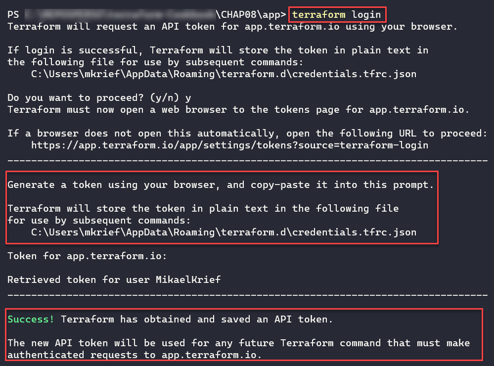
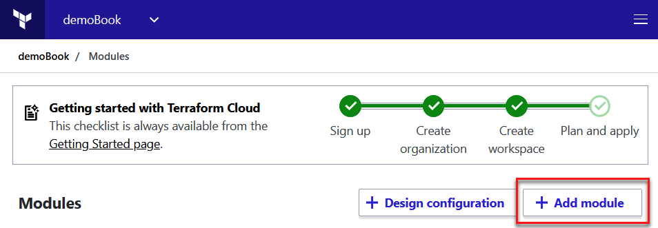

使用 Terraform Cloud 改善协作

在本书中，我们已经学习了如何编写 Terraform 配置，并在不同的实例中使用 Terraform CLI。所有这些都适用于小型项目和小型团队，但在企业环境中，当涉及到大型基础设施项目时，需要一个真正的平台来共享模块和进行集中部署。这个平台必须能够连接到一个带有**版本控制系统**（**VCS**）如 Git 的源代码控制库，并且必须支持以自动化和集中化的方式对 Terraform 进行基础设施更改，供所有团队成员使用。这就是为什么自 2019 年以来，HashiCorp 发布了一个名为 **Terraform Cloud** 的 SaaS 平台（也叫云平台）。欲了解更多关于 Terraform Cloud 及其历史的信息，请参阅此文档：[`www.terraform.io/docs/cloud/index.html`](https://www.terraform.io/docs/cloud/index.html)。

这个 Terraform Cloud 平台（也有一个本地版本，称为 **Terraform Enterprise**）特别是在其免费计划中，提供了`remote`后端类型的功能、私有模块注册表、最多五名用户的团队管理以及对存储在 VCS 仓库中的 Terraform 配置的远程执行。在付费计划中，Terraform Cloud 还集成了更先进的团队管理功能，提供了 Terraform 将要管理的资源的成本估算，并提供与 **Sentinel** 的集成，Sentinel 是一个合规性框架。Terraform Cloud 功能的完整详细列表可以在文档中查看：[`www.hashicorp.com/products/terraform/pricing/`](https://www.hashicorp.com/products/terraform/pricing/)。

在本书的最后一章中，我们将学习如何使用 Terraform Cloud 的 `remote` 后端，如何在 Terraform Cloud 上的私有注册表中共享 Terraform 模块。接着，我们将学习如何在 Terraform Cloud 中直接执行 Terraform 配置的远程执行，并且如何使用 Terraform Cloud 的 API。最后，我们将通过探索付费功能和使用 Sentinel 来进行合规性测试和可视化成本估算，结束本章内容。

在本章中，我们将介绍以下内容：

+   在 Terraform Cloud 中使用远程后端

+   将 Terraform Cloud 用作私有模块注册表

+   在 Terraform Cloud 中远程执行 Terraform 配置

+   使用 API 自动化 Terraform Cloud

+   使用 Sentinel 测试 Terraform 配置的合规性

+   使用云成本资源治理的成本估算

让我们开始吧！

# 第九章：技术要求

本章的主要前提条件是拥有一个 Terraform Cloud 平台的账户。创建账户非常简单，并且提供免费计划。你可以在 [`app.terraform.io/signup/account`](https://app.terraform.io/signup/account) 上完成注册。

对于本章中的所有食谱，我们将已经通过 Web 浏览器连接到 Terraform Cloud。

注册账户后，如果尚未创建组织，则需要通过点击“创建组织”链接来创建一个组织。

有关如何创建账户和组织的详细步骤，请参考[`learn.hashicorp.com/terraform/cloud-getting-started/signup`](https://learn.hashicorp.com/terraform/cloud-getting-started/signup)上的 Terraform 学习流程。有关组织的更多信息，请阅读[`www.terraform.io/docs/cloud/users-teams-organizations/organizations.html#creating-organizations`](https://www.terraform.io/docs/cloud/users-teams-organizations/organizations.html#creating-organizations)的文档。

最后，了解 Terraform Cloud 中的工作空间概念非常重要（与我们在第四章中*使用工作空间管理环境*食谱中研究的工作空间略有不同）。请参考[`www.terraform.io/docs/cloud/workspaces/index.html`](https://www.terraform.io/docs/cloud/workspaces/index.html)的文档，了解更多信息。

在创建 Terraform Cloud 与 Git 仓库之间的连接时，我们将使用 GitHub。你可以在[`github.com/`](https://github.com/)上创建一个免费的 GitHub 账户。

本章的源代码可以在[`github.com/PacktPublishing/Terraform-Cookbook/tree/master/CHAP08`](https://github.com/PacktPublishing/Terraform-Cookbook/tree/master/CHAP08)找到。

查看以下视频，查看代码的实际操作：[`bit.ly/2Zl3tyA`](https://bit.ly/2Zl3tyA)

# 在 Terraform Cloud 中使用远程后端

本书中，我们讨论了后端及其在存储和共享 Terraform 状态文件中的重要性。

在第六章的*保护 Azure 远程后端中的状态文件*食谱中，*使用 Terraform 配置 Azure 基础设施*，我们已经有了一个具体的案例，演示了如何在 Azure 中设置和使用后端（使用 Azure 存储）。然而，本食谱仅适用于拥有 Azure 订阅的用户。不同类型的后端列在[`www.terraform.io/docs/backends/types/index.html`](https://www.terraform.io/docs/backends/types/index.html)上，其中大多数需要你购买平台或工具。

Terraform 的主要功能之一是允许你将 Terraform 状态文件托管在一个托管服务中，这个服务被称为`remote`后端。

在本食谱中，我们将学习如何在 Terraform Cloud 中使用`remote`后端。

## 准备工作

本食谱的前提条件（与本章中的所有食谱相同）是你已在 Terraform Cloud 上拥有一个帐户（[`app.terraform.io/`](http://app.terraform.io/)）并已登录。此外，你需要按照[`www.terraform.io/docs/cloud/workspaces/creating.html`](https://www.terraform.io/docs/cloud/workspaces/creating.html)中的文档，从 Terraform Cloud UI 手动创建一个名为`demo-app`的工作区，并在配置时不选择 VCS 存储库。

本食谱的目标是配置并使用`remote`后端来进行一个简单的 Terraform 配置（为了更好地理解，这不依赖于云提供商）。此外，这个 Terraform 配置的执行将在 Terraform Cloud 中配置为**本地**模式执行；即，在 Terraform Cloud 之外的机器上执行（这可以是本地工作站或 CI/CD 流水线代理）。

请注意，在本食谱中，我们将使用本地模式。在下一个食谱中，我们将解释如何在**远程**模式下执行。

本食谱的源代码可以在这里找到：[`github.com/PacktPublishing/Terraform-Cookbook/tree/master/CHAP08/app`](https://github.com/PacktPublishing/Terraform-Cookbook/tree/master/CHAP08/app)。

## 如何操作…

本食谱将分为以下三部分：

1.  在 Terraform Cloud 中配置本地模式执行

1.  生成新的 API 令牌

1.  配置并使用`remote`后端

对于第一部分，我们将配置本地模式执行，如下所示：

1.  在我们的新 Terraform Cloud 工作区（`demo-app`）中，进入设置 | 常规选项卡，将执行模式选项更改为本地模式：


1.  点击保存设置按钮以应用这些更改。

现在，进入第二部分，我们需要生成一个新的 API 令牌，以便与 Terraform Cloud 进行身份验证。请按照以下步骤操作：

1.  在`demoBook`组织的设置选项卡中，进入 API 令牌选项卡：


1.  向下滚动到此页面底部，点击“创建身份验证令牌”按钮以生成新的 API 令牌。

1.  请将此生成的令牌保管好。

最后，最后一部分是配置并使用`remote`后端。请按照以下步骤操作：

1.  在 Terraform 配置的`main.tf`文件中，添加以下后端配置：

```
terraform {
  backend "remote" {
    hostname     = "app.terraform.io"
    organization = "demoBook"

    workspaces {
      name = "demo-app"
    }
  }
}
```

1.  然后，在适当的 Terraform CLI 配置文件夹中，即主目录（这里有文档说明：[`www.terraform.io/docs/commands/cli-config.html`](https://www.terraform.io/docs/commands/cli-config.html)），创建一个名为`terraform.rc`（适用于 Windows 操作系统）或`.terraform.rc`（适用于 Linux 操作系统）的新文件。这将是 Terraform CLI 配置文件。在该文件中，添加以下内容：

```
credentials "app.terraform.io" {
 token = "<your api token generated>"
}
```

1.  在本地工作站上执行基本的 Terraform 工作流命令，包括`init`、`plan`和`apply`。

## 它的工作原理是…

在这个食谱的第一部分，我们配置了工作区的 Terraform 执行模式。在这个配置中，我们选择了本地模式，这意味着 Terraform 将确保配置安装在私有机器上（无论是本地开发站还是 CI/CD 流水线代理）。在这种情况下，创建的工作区仅用于存储 Terraform 状态。

然后，在第二部分中，我们创建了一个令牌，允许 Terraform 二进制文件与我们的 Terraform Cloud 工作区进行身份验证。

在最后部分，我们编写了 Terraform 配置，描述了我们的 `remote` 后端的设置。在这个配置中，我们使用了 `remote` 后端，并添加了以下参数：

+   `hostname`，值为 `"app.terraform.io"`，它是 Terraform Cloud 的域名

+   `organization`，它包含了组织的 `demoBook` 名称

+   `workspaces`，包含我们在本食谱先决条件中手动创建的 `demo-app` 工作区名称

然后，在*第 2 步*中，我们通过添加在本食谱第二部分中生成的认证令牌，创建了 Terraform CLI 配置文件。

最后，在最后一步中，我们执行了 Terraform 命令工作流。

执行这些命令后，在我们工作区的 States 标签下，我们将看到我们的状态文件已经创建：


通过点击这个文件，你可以查看其内容或下载它。

## 还有更多……

在本食谱中，我们学习了如何将报告文件集中存储在 Terraform Cloud 后端。

为此，我们手动创建了一个工作区，以便我们可以配置它并选择本地执行模式。在本章的*在 Terraform Cloud 中执行 Terraform 配置*食谱中，如果我们想使用远程模式，只需将工作区名称放入后端的配置中，如果该工作区不存在，它将自动创建。

然后，我们通过 `terraform.rc` 文件配置了 Terraform CLI。另一种解决方案是使用 `terraform login` 命令，它会创建令牌，并生成 `credential.tfrc.json` 配置文件。

以下截图展示了这个命令的执行情况：



这个命令不适用于自动化使用，因为它需要一个网页浏览器和手动干预。

关于令牌，我们在组织级别创建了它，以保护仅限于组织的 Terraform 执行。为了给本账户下的所有组织提供更广泛的权限，你可以在用户设置中的账户设置里创建一个令牌，然后在令牌标签中进行操作：


要了解更多关于 API 令牌的使用，请参考[`www.terraform.io/docs/cloud/users-teams-organizations/api-tokens.html`](https://www.terraform.io/docs/cloud/users-teams-organizations/api-tokens.html)文档。

最后，你可以阅读以下文档：[`www.terraform.io/docs/cloud/architectural-details/data-security.html`](https://www.terraform.io/docs/cloud/architectural-details/data-security.html)，了解有关在 Terraform Cloud 中存储的数据和 Terraform 状态文件的安全性。如果你已经有存储在其他类型后端中的 Terraform 配置和状态文件，并且想将它们迁移到 Terraform Cloud，请参阅迁移文档：[`www.terraform.io/docs/cloud/migrate/index.html`](https://www.terraform.io/docs/cloud/migrate/index.html)

## 另见

+   `remote`后端的文档可以在这里查看：[`www.terraform.io/docs/backends/types/remote.html`](https://www.terraform.io/docs/backends/types/remote.html)

+   `terraform login`命令的文档可以在这里查看：[`www.terraform.io/docs/commands/login.html`](https://www.terraform.io/docs/commands/login.html)

+   关于 Terraform CLI 配置的文档可以在这里查看：[`www.terraform.io/docs/commands/cli-config.html`](https://www.terraform.io/docs/commands/cli-config.html)

# 使用 Terraform Cloud 作为私有模块注册表

在上一篇操作步骤中，我们学习了如何使用 Terraform Cloud 作为一个集中的、安全的、免费的远程后端。

在本书中，我们专门 dedicating 第五章，*共享 Terraform 配置与模块*，介绍了 Terraform 模块的创建、使用和共享。提醒一下，我们学习的内容是将模块发布到 Terraform 公共注册表，这是所有 Terraform 用户都可以公开访问的，并通过 Git 存储库私密地共享 Terraform 模块。

关于私有模块共享，Git 存储库系统是高效的，但没有像公共注册表那样提供一个集中平台来共享和记录模块。为了为公司提供私有 Terraform 模块注册表，HashiCorp 已将这一功能集成到 Terraform Cloud/Enterprise 中。

在这个操作步骤中，我们将学习如何在 Terraform Cloud 的私有注册表中发布和使用 Terraform 模块。

## 准备工作

为了在 Terraform 注册表中发布模块，你需要将模块代码存储在 Terraform Cloud 支持的 VCS 文件中。支持的文件类型列表可以在这里找到：[`www.terraform.io/docs/cloud/vcs/index.html`](https://www.terraform.io/docs/cloud/vcs/index.html)

要开始这个操作步骤，在 Terraform Cloud 组织的**设置**部分，我们需要创建与包含 Terraform 配置的 VCS 提供商的连接，具体步骤可参考文档：[`www.terraform.io/docs/cloud/vcs/index.html`](https://www.terraform.io/docs/cloud/vcs/index.html)

在我们的场景中，我们将使用包含`terraform-azurerm-webapp`仓库的 GitHub VCS（该仓库在 Azure 中创建一个服务计划、一个应用服务实例和一个应用程序洞察）。要获取此仓库，您可以 fork [`github.com/mikaelkrief/terraform-azurerm-webapp`](https://github.com/mikaelkrief/terraform-azurerm-webapp)。

此外，正如我们在第五章的*使用 GitHub 分享 Terraform 模块*配方中研究的那样，*使用模块共享 Terraform 配置*，你需要在此仓库中创建一个 Git 标签，该标签包含模块的版本号。对于这个配方，我们将创建一个`v1.0.0`标签，如下图所示：


要在 Terraform Cloud 和 GitHub 之间进行集成，请执行此处文档中描述的过程：[`www.terraform.io/docs/cloud/vcs/github-app.html`](https://www.terraform.io/docs/cloud/vcs/github-app.html)。完成此集成后，我们将在“设置 | VCS 提供商”下看到以下屏幕：


我们的组织现在已经与所需的 GitHub 账户建立了连接，可以开始在 Terraform Cloud 中发布模块。

## 如何操作……

要将 Terraform 模块发布到 Terraform Cloud 的私人注册表中，请执行以下步骤：

1.  在我们的 Terraform Cloud 组织中，点击位于顶部菜单栏中的“模块”菜单：


1.  要添加模块，请点击“添加模块”按钮：



1.  然后，在下一个布局中，在向导的第一步中选择 GitHub 作为 VCS 提供商，这是我们在本配方要求中集成的部分：


1.  在向导的第二步中，选择包含 Terraform 模块配置的仓库：


1.  最后，在向导的最后一步，通过点击“发布模块”按钮来发布模块：


## 工作原理……

要在 Terraform 的私人注册表中发布模块，您只需按照向导提出的步骤操作，步骤包括选择一个 VCS 提供商，然后选择包含模块的 Terraform 配置的仓库，以便它可以被发布。完成后，模块的详细信息将在公共注册表的布局中显示。在页面的中央，您将看到`Readme.md`文件的内容，而在右侧，您将看到关于使用此模块的技术信息。

## 还有更多……

一旦该模块在此注册表中发布，您就可以在 Terraform 配置中使用它。如果您在本地执行模式下使用 Terraform Cloud，则必须按照前面的配方在 `terraform.rc` 文件中配置 Terraform CLI 的身份验证令牌。然后，您需要在 Terraform 配置中使用此模块，并编写以下内容：

```
module "webapp" {
  source  = "app.terraform.io/demoBook/webapp/azurerm"
  version = "1.0.0"
...
}
```

在此配置中，`source` 属性是 Terraform Cloud 注册表中的模块标识符，而 `version` 属性对应于在代码库中设置的 Git 标签。完成此操作后，您可以从版本下拉列表中选择希望使用的版本：


如果我们更改了模块的 Terraform 配置并希望升级其版本，只需在此代码库中添加一个 Git 标签，并设置所需的版本。通过这样做，模块将在 Terraform Cloud 注册表中自动更新。

此外，如果您的模块已发布在此私有注册表中，您可以使用 Terraform Cloud 的设计配置功能生成调用这些模块的 Terraform 配置。您可以在此了解更多：[`www.terraform.io/docs/cloud/registry/design.html`](https://www.terraform.io/docs/cloud/registry/design.html)。

最后，请注意，如果您在 Terraform Cloud 中有多个组织，并且希望在所有组织中使用相同的模块，您必须在每个组织中发布这些模块。至于升级模块的版本，这将在每个组织中自动完成。

## 另请参见

关于在 Terraform Cloud 中私有注册模块的文档可以在此查看：[`www.terraform.io/docs/cloud/registry/index.html`](https://www.terraform.io/docs/cloud/registry/index.html)。

# 在 Terraform Cloud 中远程执行 Terraform 配置

在前两个配方中，我们研究了使用本地运行时设置的 Terraform Cloud。此配置表明，应用 Terraform 配置的 Terraform 二进制文件安装在 Terraform Cloud 平台外部的机器上。因此，这台机器是私有的，可以是开发工作站或作为 CI/CD 管道代理的机器（例如在 Azure 管道代理或 Jenkins 节点上）。

Terraform Cloud 的一个重要优势是能够直接在此平台内执行 Terraform 配置。此功能称为**远程操作**，使得可以在不需要安装、配置和维护作为代理的虚拟机的情况下，免费运行 Terraform 配置执行管道。此外，它为组织内的所有成员提供了共享的 Terraform 执行接口。

在本配方中，我们将查看使用 UI 工作流在 Terraform Cloud 中运行 Terraform 配置的步骤。

## 准备工作

我们将在本配方中使用的 Terraform 配置源代码可以在 [`github.com/PacktPublishing/Terraform-Cookbook/tree/master/CHAP08/remote`](https://github.com/PacktPublishing/Terraform-Cookbook/tree/master/CHAP08/remote) 找到。这个配置将在 Azure 中创建一个资源组和一个应用服务。如果你想使用这个 Terraform 配置，你需要对这个仓库进行分叉。该配置还使用了 `terraform-azurerm-webapp` Terraform 模块，这个模块已发布在我们 Terraform Cloud 组织的私有注册表中。有关如何在私有注册表中发布模块的更多信息，请参见前一个配方，*将 Terraform Cloud 用作私有模块注册表*。

由于在这个 Terraform 配置中，我们将创建 Azure 资源，因此我们需要创建一个具有足够权限的 Azure 服务主体，该服务主体必须在订阅中具有适当权限。有关 Azure 服务主体和 Terraform 如何验证 Azure 的更多信息，请参见 第六章 中的 *保护 Azure 凭证提供者* 配方，*使用 Terraform 配置 Azure 基础架构*。

此外，由于我们将公开一个 GitHub 中的 Terraform 配置，我们需要添加 GitHub VCS 提供商，正如文档中所解释的那样：[`www.terraform.io/docs/cloud/vcs/github-app.html`](https://www.terraform.io/docs/cloud/vcs/github-app.html)。

最终，本配方的所有步骤将在 Terraform Cloud Web 界面中完成。

## 如何操作…

在执行 Terraform 配置之前，我们需要创建并配置一个新的工作区。按照以下步骤操作：

1.  在我们组织的工作区部分，点击“新建组织”按钮以创建一个新组织。

1.  在向导的第一步中，选择我们在需求中注册的 VCS 提供商。在这里，我们将选择 GitHub 提供商：


1.  然后，在向导的第二步中，选择包含 Terraform 配置的 GitHub 仓库，以便我们可以在 Terraform Cloud 中执行它：


1.  最后，在向导的最后一步中，通过指定强制参数来配置此工作区，该参数是工作区的名称。在我们的例子中，它是 `demo-app-remote`：


1.  在可选的高级选项标签页中，设置 Terraform 配置的文件夹路径（如果 Terraform 配置位于仓库的根目录，则留空）。我们还可以填写自动运行触发器和 VCS 分支参数，以便它们能够运行（我们将 master 分支留空）：


1.  最后，点击“创建工作区”按钮以完成工作区的创建。

既然我们已经创建了工作区，因我们在 Azure 中部署资源，需要将四个 Azure 身份验证环境变量添加到工作区变量设置中。请按照以下步骤操作：

1.  点击“配置变量”按钮：


1.  然后，在“环境变量”部分，添加我们的四个 Terraform Azure 提供程序环境变量，如下截图所示：


现在我们已经配置好工作区，可以在 Terraform Cloud 中执行 Terraform 配置。

要在 Terraform Cloud 中远程执行 Terraform 配置，请按照以下步骤操作：

1.  要触发 Terraform 配置的执行，点击“队列计划”按钮，输入执行原因，并点击“队列计划”按钮确认：


1.  Terraform Cloud 将启动一个新的执行任务来执行此 Terraform 配置。通过运行 `terraform plan` 命令，我们将能够看到此执行的日志：


执行`plan`后，Terraform Cloud 会要求用户确认此操作，才会应用更改。

1.  如果我们同意预览中的更改，可以通过点击“确认并应用”按钮来确认这些更改：


添加一些评论，然后点击“确认计划”按钮：


完成后，执行计划的结果将会提供：


## 它是如何工作的…

在本教程中，我们配置了一个 Terraform Cloud 工作区，以便在 Terraform Cloud 管理的实例中直接运行存储在 GitHub 仓库中的 Terraform 配置。

在这项配置的中间，执行 Terraform 配置之前，我们完成了 Azure 环境变量配置，这是一个可选步骤，取决于你希望管理的资源和云提供商。

## 还有更多…

在本教程中，我们学习了如何直接通过此平台的 Web 界面运行 `plan` 和 `apply` Terraform Cloud 变量。在工作区设置中，你还可以配置是否希望手动应用计划（即像我们教程中的确认步骤）或自动应用。你还可以选择希望使用的 Terraform 二进制版本（默认情况下，它会使用在工作区创建时找到的最新稳定版本；beta 版本不予考虑）：


你也可以使用“销毁与删除”功能销毁所有已配置的资源，该功能可以在“设置 | 销毁与删除”菜单中访问，然后点击“队列销毁计划”按钮：


此外，正如你可能已经注意到的，通过使用 UI 在 Terraform Cloud 中运行 Terraform 配置时，我们不需要为状态文件配置`remote`后端信息，正如我们在本章的*使用 Terraform Cloud 中的远程后端*一节中讨论的那样。在我们的案例中，Terraform 状态文件的配置与工作区集成。在 States 选项卡中，我们将看到 Terraform 状态文件的存在：


此外，如果你处于开发环境中并希望在提交到仓库之前检查开发情况，你仍然可以使用 Terraform 执行的远程模式来制定计划。这是通过控制在 Terraform Cloud 中执行的过程来实现的，你可以使用 Terraform 二进制文件（或 CLI）来完成。要做到这一点，只需像本章中的*使用 Terraform Cloud 中的远程后端*一节那样，添加`remote`后端的配置，并使用我们在该节第一步中创建的工作区名称，对应于以下代码：

```
terraform {
  backend "remote" {
    hostname     = "app.terraform.io"
    organization = "demoBook"

    workspaces {
      name = "demo-app-remote"
    }
  }
}
```

然后，在开发站点上执行`terraform plan`命令，如下图所示：


在此执行过程中，你的 Terraform CLI 将创建一个配置包并将其上传到 Terraform Cloud 工作区。CLI 触发 Terraform Cloud CLI 在上传的包上运行 Terraform。最后，`plan`命令的输出也可以在命令行终端中查看。请注意，在这种情况下，你不需要在本地设置环境变量，因为它们已经在工作区中配置好了。

为了确保更改只应用在一个地方，你不能在连接到 VCS 的工作区上运行`terraform apply`命令。然而，如果你的工作区没有连接到 VCS，你可以从本地 CLI 执行`apply`命令。

最后，如果你的 Terraform 配置包含了`local-exec`（我们在第二章的*使用 Terraform 执行本地程序*一节中研究过），并且在其命令中使用了第三方工具，你需要确保该工具已经存在或安装在执行 Terraform 二进制文件的 Terraform Cloud 代理上。关于在 Terraform Cloud 执行中的其他第三方工具的更多信息，建议阅读[`www.terraform.io/docs/cloud/run/install-software.html`](https://www.terraform.io/docs/cloud/run/install-software.html)上的文档。

## 另见

+   关于 Terraform Cloud 中远程执行的文档可以在此处查看：[`www.terraform.io/docs/cloud/run/index.html`](https://www.terraform.io/docs/cloud/run/index.html)。

+   使用 CLI 进行远程执行的文档可以在此查看：[`www.terraform.io/docs/cloud/run/cli.html`](https://www.terraform.io/docs/cloud/run/cli.html)。

# 使用 API 自动化 Terraform Cloud

在之前的配方中，我们学习了如何使用 Terraform Cloud 平台将 Terraform 状态文件存储在`remote`后端。然后，我们使用 Terraform Cloud 作为模块的私有注册表，并学习了如何在 Terraform Cloud 中远程运行 Terraform 配置。

所有这些操作主要通过 Terraform Cloud UI 网页界面完成。在前一个配方的*更多...*部分，我们讨论了也可以使用 Terraform CLI 本地运行 Terraform 远程操作。

在公司中，我们需要自动化所有这些操作，原因如下：

+   UI 的使用虽然人性化，但需要大量手动操作，在多个项目中，这可能会非常耗时且消耗资源。

+   在 Terraform Cloud 中，远程模式下的执行工作流程是固定的，包括执行`plan`命令以及应用操作。无法添加其他操作（如本书中研究过的上游集成测试执行）。因此，无法根据公司的业务需求定制工作流程。

由于自动化和定制化的需求，HashiCorp 发布了 API，允许像使用 UI 一样管理 Terraform Cloud。

在本配方中，我们将通过 API 来自动化 Terraform Cloud 的操作。

## 准备工作

在开始之前，回顾一下 Terraform Cloud 的工作流程是非常有帮助的，流程如下：

+   编写 Terraform 配置，然后将其提交到 VCS 代码库（如 Git）。

+   在 Terraform Cloud 中，工作区会检索此 Terraform 配置并使用`terraform plan`命令执行干运行。

+   在手动模式下，如果用户确认计划，Terraform Cloud 会触发应用并将更改应用到基础设施中。

+   在自动模式（auto-apply）下，`plan`命令执行后，变更会自动应用。

在本配方中，我们将使用与前一个配方相同的场景和 Terraform 配置，唯一不同的是我们将使用调用 Terraform Cloud API 的脚本。

然而，作为先决条件，你需要在 Terraform Cloud 用户账户设置中创建一个 API 令牌，用于身份验证：


通过 API 触发运行时，使用的是用户 API 令牌，而非组织令牌。

在本配方中使用的脚本语言为 PowerShell。不过，你可以根据需要使用常用的编程语言（如 shell、Python、C#等）。

本配方的源代码可以在[`github.com/PacktPublishing/Terraform-Cookbook/tree/master/CHAP08/api`](https://github.com/PacktPublishing/Terraform-Cookbook/tree/master/CHAP08/api)获取。

## 如何实现……

要通过 API 自动化 Terraform Cloud，请在新文件夹中执行以下步骤：

1.  创建一个名为`workspace.json`的 JSON 文件。此文件将包含我们将要创建的工作区的定义。插入以下内容：

```
{
  "data": {
    "attributes": {
      "name": "workspace-demo-api",
      "auto-apply": true,
      "working-directory": "CHAP08/remote",
      "vcs-repo": {
        "identifier": "mikaelkrief/terraform-Cookbook",
        "oauth-token-id": "ot-Jxxxxxxxxxx",
        "branch": "",
        "default-branch": true,
        "queue-all-runs": true
      }
    },
    "type": "workspaces"
  }
}
```

要了解如何获取`oauth-token-id`，请阅读[`www.terraform.io/docs/cloud/api/oauth-tokens.html`](https://www.terraform.io/docs/cloud/api/oauth-tokens.html)上的文档。

1.  创建一个名为`tfcloud-workspaces.ps1`的 PowerShell 脚本，包含以下内容：

```
$apiToken = $args[0]  #API TOKEN
$organization = "demoBook"
$headers = @{ }
$headers["Authorization"] = "Bearer  $apiToken"
$headers["Content-Type"] = "application/vnd.api+json"
$uriWorkspaces = "https://app.terraform.io/api/v2/organizations/$organization/workspaces"
try
{
    $json = Get-Content("workspace.json")
    $response = Invoke-RestMethod -Uri $uriWorkspaces -Body $json -Headers $headers -Method Post
    $worspaceId = $response.data.id
    Write-Host $worspaceId
}
Catch
{
   ...
}
```

该脚本的完整源代码可以在[`github.com/PacktPublishing/Terraform-Cookbook/blob/master/CHAP08/api/tfcloud-workspaces.ps1`](https://github.com/PacktPublishing/Terraform-Cookbook/blob/master/CHAP08/api/tfcloud-workspaces.ps1)找到。

1.  在 PowerShell 终端中，运行以下命令以创建工作区：

```
.\tfcloud-workspaces.ps1 <your api token>
```

在执行结束时，脚本将显示创建的工作区 ID：


1.  创建另一个名为`variables.json`的 JSON 文件，包含要创建的环境变量的定义。插入以下内容：

```
{
  "vars": [
    {
      "data": {
        "type": "vars",
        "attributes": {
          "key": "ARM_SUBSCRIPTION_ID",
          "value": "xxxxx-xxxxxxx-xxxxxx-xxxxxx",
          "category": "env",
....
        }
      }
    },
  ....
  ]
}
```

该 JSON 脚本的完整源代码可以在[`github.com/PacktPublishing/Terraform-Cookbook/blob/master/CHAP08/api/variables.json`](https://github.com/PacktPublishing/Terraform-Cookbook/blob/master/CHAP08/api/variables.json)找到。

1.  创建一个名为`tfcloud-variables.ps1`的 PowerShell 脚本，包含以下内容：

```
$apiToken = $args[0]  #API TOKEN
$worspaceId = $args[1] # WORKSPACE ID
$headers = @{ }
$headers["Authorization"] = "Bearer  $apiToken"
$headers["Content-Type"] = "application/vnd.api+json"
$uriVariables = "https://app.terraform.io/api/v2/workspaces/$worspaceId/vars"

$json = Get-Content("variables.json") | ConvertFrom-Json
$varList = $json.vars
foreach ($var in $varList)
{
   $varjson = $var | ConvertTo-Json
   Invoke-RestMethod -Uri $uriVariables -Body $varjson -Headers $headers -Method Post
}
```

该脚本的完整源代码可以在[`github.com/PacktPublishing/Terraform-Cookbook/blob/master/CHAP08/api/tfcloud-variables.ps1`](https://github.com/PacktPublishing/Terraform-Cookbook/blob/master/CHAP08/api/tfcloud-variables.ps1)找到。

1.  在 PowerShell 中，运行上述脚本以创建我们在工作区中定义的环境变量，使用以下命令：

```
.\tfcloud-variables.ps1 <your token id> <workspace id>
```

1.  为了触发 Terraform 配置的新的执行，创建一个名为`run.json`的 JSON 文件，包含队列的定义。添加以下内容：

```
{
  "data": {
    "attributes": {
      "is-destroy": false,
      "message": "Run for demo Book"
    },
    "type":"runs",
    "relationships": {
      "workspace": {
        "data": {
          "type": "workspaces",
          "id": "ws-xxxxxxxxxx"
        }
      }
    }
  }
}
```

1.  创建一个名为`tfcloud-run.ps1`的 PowerShell 脚本，包含以下内容：

```
$apiToken = $args[0]  #API TOKEN
$headers = @{ }
$headers["Authorization"] = "Bearer  $apiToken"
$headers["Content-Type"] = "application/vnd.api+json"
$uriWorkspaces = "https://app.terraform.io/api/v2/runs"

$json = Get-Content("run.json")
Invoke-RestMethod -Uri $uriWorkspaces -Body $json -Headers $headers -Method Post
```

1.  在 PowerShell 中，运行以下命令以排队新的 Terraform `run`：

```
.\tfcloud-run-plan.ps1 <your yoken api>
```

## 它是如何工作的…

在本教程中，我们通过三步自动化了 Terraform 工作流的实现，具体如下：

1.  创建和配置工作区

1.  在此工作区中创建环境变量

1.  在此工作区中触发 Terraform 配置的`run`

从*步骤 1*到*步骤 3*，我们使用 API 创建了一个工作区。为此，我们创建了一个名为`workspace.json`的文件，其中包含将作为参数发送到 API 的主体（payload）。在此文件中，我们定义了以下属性：

+   `name`：要创建的工作区名称。

+   `working-directory`：包含 Terraform 配置的仓库目录。

+   `auto-apply`：这表示在计划之后，运行将自动执行，而无需用户手动审查该计划（可选属性）。

+   `vcs-repo`：该块包含我们在组织中配置的 VCS 提供者的信息，详情请见：[`www.terraform.io/docs/cloud/vcs/index.html`](https://www.terraform.io/docs/cloud/vcs/index.html)。`oauth-token-id`属性可以通过 VCS 提供者的界面或通过 API 获取，具体细节请见：[`www.terraform.io/docs/cloud/api/oauth-clients.html`](https://www.terraform.io/docs/cloud/api/oauth-clients.html)。

然后，我们编写并执行了调用工作区创建 API 的 PowerShell 脚本。在这个脚本中，我们定义了用户的 API 令牌和组织的名称作为变量，然后调用了工作区创建 API。

工作区 API 的文档可以在此查看：[`www.terraform.io/docs/cloud/api/workspaces.html`](https://www.terraform.io/docs/cloud/api/workspaces.html)。

在执行结束时，该脚本会显示创建的工作区 ID，必须保留此 ID 以便我们可以继续进行 API 调用。在 Terraform Cloud 的 Web 界面中，我们将能够查看到这个新的工作区：


接着，从*步骤 4*到*步骤 6*，我们使用 API 在这个新工作区中创建了环境变量。为此，我们创建了一个`variables.json`文件，该文件包含了 Azure Service Principal 的四个变量以及它们的主体内容，这些内容将被处理，以便 API 的有效载荷参数被发送到 API。在该文件中，我们为每个变量定义了以下属性：

+   `name`

+   `value`

+   `category`: `env`（定义为环境变量）

接着，我们编写并执行了 PowerShell 脚本，调用了每个变量的工作区创建 API。

在本教程中，我们创建了这四个环境变量，因为我们作为示例使用的 Terraform 配置管理的是 Azure 基础设施。如果不需要环境变量，这一步是可选的。

此外，变量 API 的文档可以在此查看：[`www.terraform.io/docs/cloud/api/workspace-variables.html`](https://www.terraform.io/docs/cloud/api/workspace-variables.html)。

在执行结束时，在 Terraform Cloud UI 中，我们将能够看到新的变量环境：


最后，在*步骤 7*到*步骤 9*，我们使用 API 触发了一个运行——即在工作区（在 VCS 中）定义的 Terraform 配置的执行。为此，我们创建了一个名为`run.json`的文件，该文件也将作为 API 的有效载荷使用。它包含了以下属性：

+   `message`: 关于运行的消息

+   `workspace.id`: 工作区 ID

然后，我们编写并执行了调用 `run` 触发器 API 的 PowerShell 脚本。在其执行结束时，我们看到 Terraform 在 Terraform Cloud 中被触发执行，如下图所示：


通过使用工作区的 `auto-apply` 属性，`terraform apply` 将自动完成，无需用户手动配置。

## 还有更多…

在本教程中，我们查看了 Terraform Cloud API 的简单基本使用。如同往常一样，还有许多其他场景可以使用它们。

请记住，通过不将 API 令牌和任何 Azure 或类似的令牌以明文形式放入脚本中，来保护它们。

此外，为了保持在 IaC 的上下文中，您可以使用带有 **Terraform Enterprise** **提供程序** 的 Terraform 配置，而不是直接使用 API，该文档在这里：[`www.terraform.io/docs/providers/tfe/index.html`](https://www.terraform.io/docs/providers/tfe/index.html)。这也是 HashiCorp 推荐用于 Terraform Cloud 管理的方式。您可以在[`www.terraform.io/docs/cloud/api/index.html`](https://www.terraform.io/docs/cloud/api/index.html)（第一条注释）中找到更多信息。

## 另见

+   关于各种 Terraform Cloud API 的文档可以在这里查看：[`www.terraform.io/docs/cloud/api/index.html`](https://www.terraform.io/docs/cloud/api/index.html)。

+   以下是关于使用 Terraform Cloud/Enterprise API 的视频演示：[`www.hashicorp.com/resources/demystifying-the-terraform-enterprise-api/`](https://www.hashicorp.com/resources/demystifying-the-terraform-enterprise-api/)。

# 使用 Sentinel 测试 Terraform 配置的合规性

本书中已多次讨论过 Terraform 配置测试的相关内容，例如使用 `terratest`（在第五章的 *使用 Terratest 测试 Terraform 模块代码* 配方和 *使用 Terraform 配置 Azure 基础设施* 配方中）和 `kitchen-terraform`（在第七章的 *使用 kitchen-terraform 测试 Terraform 配置* 配方和 *深入探索 Terraform* 配方中）。这两种工具的共同点是，测试的目的是编写并测试 Terraform 已经应用的更改。

所有这些测试都非常有益，但它们是在做出更改后进行的。回滚也需要所有团队的协作。为了更好地与公司的业务和财务需求对接，另有一层测试，用于在应用到目标基础设施之前验证 Terraform 配置的合规性。

在 Terraform 中，这些合规性测试在执行`terraform plan`命令后进行。它们验证`plan`命令的结果是否符合测试中描述的规则。只有这些测试通过后，才能执行`terraform apply`命令。

在合规性测试的工具和框架中，Terraform Cloud 在其付费计划中提供了栈功能，允许我们使用**Sentinel**框架编写测试，并通过在`plan`和`apply`之间使用`run`命令直接在 Terraform Cloud 中执行它们。

在本教程中，我们将研究一个简单的案例，编写合规性测试并在 Terraform Cloud 中执行它们。

## 准备工作

本教程的基本要求是拥有 Terraform Cloud 的付费计划。我们将使用 Team & Governance 功能：


如果您使用的是免费计划，您可以通过激活免费试用，体验付费计划的所有功能 30 天：


关于计划、价格和功能的文档可以在这里找到：[`www.terraform.io/docs/cloud/paid.html`](https://www.terraform.io/docs/cloud/paid.html)。

我们将使用的 Terraform 配置已在之前讨论过，并可以在[`github.com/PacktPublishing/Terraform-Cookbook/tree/master/CHAP08/remote`](https://github.com/PacktPublishing/Terraform-Cookbook/tree/master/CHAP08/remote)找到。此配置将创建一个资源组，一个服务计划和一个 Azure 应用服务。

此外，要在您的组织中使用本教程中编写的代码，您需要创建该书原始仓库的一个分支（[`github.com/PacktPublishing/Terraform-Cookbook`](https://github.com/PacktPublishing/Terraform-Cookbook)）。

本教程的目标是编写作为策略集一部分的规则，用来测试以下内容：

+   要求应用服务的 FTP 模式仅配置为 FTPS 模式。

+   要提供给 SKU 层级类型的服务计划必须是 Basic 或 Standard。此规则禁止提供 Premium 或 Premium v2 服务计划。

接下来，我们将学习如何在 Terraform Cloud 执行时应用这些策略集。

为了编写这些策略，我们将使用**Sentinel**，这是 HashiCorp 提供的一个测试框架。其文档可以在[`www.hashicorp.com/resources/writing-and-testing-sentinel-policies-for-terraform/`](https://www.hashicorp.com/resources/writing-and-testing-sentinel-policies-for-terraform/)找到。

本教程的目的不是研究编写策略的所有元素（前面的指南可以用于此）。在这里，我们将编写一些简单的代码，您可以轻松地复现。

最后，必须在 Terraform Cloud 中创建并配置`demo-app-remote`工作区，具体操作可以参考本章中的*在 Terraform Cloud 中远程执行 Terraform 配置*教程。

该配方的源代码可以在此处找到：[`github.com/PacktPublishing/Terraform-Cookbook/tree/master/CHAP08/sentinel-policies`](https://github.com/PacktPublishing/Terraform-Cookbook/tree/master/CHAP08/sentinel-policies).

## 如何操作…

要完成这个步骤，我们需要完成三件事情：

1.  编写策略规则

1.  配置组织以便集成这些策略

1.  使用这些策略运行 Terraform 配置

我们首先编写合规性策略，如下所示：

我们将在此部分编写的代码可以与要测试的配置位于同一个仓库中。或者，如果其策略是共享的，则可以将此代码放入另一个仓库中。

将这些策略放在一个单独的仓库中仍然是一个好的实践，这样你就不会混合策略的 Terraform 配置提交。另一个做法是，这个独立的仓库可以由另一个团队（如运维或安全团队）管理。

在这个配方中，为了简单起见，我们将代码写入包含 Terraform 配置的仓库中，该仓库已经集成到我们组织的 VCS 提供者中。

1.  在一个新文件夹 `sentinel-policies` 内，创建一个名为 `restrict-app-service-to-ftps.sentinel` 的新文件，以测试 App Service 实例的 FTP 模式。使用以下代码完成：

```
import "tfplan-functions" as plan

allAzureAppServices = plan.find_resources("azurerm_app_service")

violatingAzureAppServices = plan.filter_attribute_is_not_value(allAzureAppServices,
                            "site_config.0.ftps_state", "FtpsOnly" , true)

main = rule {
  length(violatingAzureAppServices["messages"]) is 0
}
```

此文件的完整源代码可以在此处找到：[`github.com/PacktPublishing/Terraform-Cookbook/blob/master/CHAP08/sentinel-policies/restrict-app-service-to-ftps.sentinel`](https://github.com/PacktPublishing/Terraform-Cookbook/blob/master/CHAP08/sentinel-policies/restrict-app-service-to-ftps.sentinel).

1.  创建一个名为 `allowed-app-service-plan-tiers.sentinel` 的新文件来测试服务计划 SKU 的类型。确保它包含以下内容：

```
import "tfplan-functions" as plan

allowed_tiers = ["Basic", "Standard"]

allAzureServicePlan = plan.find_resources("azurerm_app_service_plan")

violatingAzureServicePlan = plan.filter_attribute_not_in_list(allAzureServicePlan,
 "sku.0.tier", allowed_tiers, true)

main = rule {
  length(violatingAzureServicePlan["messages"]) is 0
}
```

该文件的完整源代码（带有注释）可以在此处找到：[`github.com/PacktPublishing/Terraform-Cookbook/blob/master/CHAP08/sentinel-policies/allowed-app-service-plan-tiers.sentinel`](https://github.com/PacktPublishing/Terraform-Cookbook/blob/master/CHAP08/sentinel-policies/allowed-app-service-plan-tiers.sentinel).

1.  创建一个名为 `sentinel.hcl` 的新文件。这将是测试和引用前述两个策略的入口点。添加以下内容：

```
module "tfplan-functions" {
  source = "https://raw.githubusercontent.com/hashicorp/terraform-guides/master/governance/third-generation/common-functions/tfplan-functions/tfplan-functions.sentinel"
}

policy "restrict-app-service-to-ftps"{
  source ="./restrict-app-service-to-ftps.sentinel"
  enforcement_level = "hard-mandatory"
}

policy "allowed-app-service-plan-tiers"{
  source ="./allowed-app-service-plan-tiers.sentinel"
  enforcement_level = "hard-mandatory"
}
```

1.  将所有文件提交并推送到远程仓库。

在第二阶段，我们需要在我们的 Terraform Cloud 组织中配置策略集：

1.  在你的组织设置中，转到策略集选项卡，然后点击“连接新策略集”按钮：


1.  在向导的第一步中，选择包含我们刚编写的策略代码的 VCS 提供者：


1.  在第二步中，选择包含策略代码的仓库：


1.  在向导的最后一步，配置策略集，添加名称和描述详情，如下截图所示：


在“附加选项”下，指定包含代码策略的文件夹以及将使用这些策略的目标工作区：


以下截图显示了您需要选择的工作区，以便使用该策略集：


1.  点击“连接策略集”按钮来创建策略集。

现在，我们可以在 Terraform Cloud 中运行 Terraform 配置并检查策略：

1.  在本章中我们在*在 Terraform Cloud 中远程执行 Terraform 配置*配方中创建的`demo-app-remote`工作区中，我们将排队执行一个新的 Terraform `run`。

1.  在此`run`的结果中，我们将能够看到策略检查的结果：


1.  如果策略检查成功，请通过点击“确认并应用”按钮来应用更改：


## 它是如何工作的…

在本教程的第一部分，我们编写了合规性测试，以便通过**Sentinel**测试我们的 Terraform 配置。

在`restrict-app-service-to-ftps.sentinel`文件中，通过编写`import "tfplan-functions" as plan`这一行，我们导入了一个 Sentinel 函数库，该库可以在[`github.com/hashicorp/terraform-guides/tree/master/governance/third-generation/common-functions/tfplan-functions`](https://github.com/hashicorp/terraform-guides/tree/master/governance/third-generation/common-functions/tfplan-functions)找到。此行之后的代码会在`terraform plan`命令中搜索所有`azurerm_app_service`资源，并检查 FTPS 状态是否仅配置为 FTPS：

```
allAzureAppServices = plan.find_resources("azurerm_app_service")
violatingAzureAppServices = plan.filter_attribute_is_not_value(
                            allAzureAppServices, "site_config.0.ftps_state", 
                            "FtpsOnly" , true)
```

这是测试的调用点，当 FTPS 状态不合规时会发送一条错误信息。

在第二个文件`allowed-app-service-plan-tiers.sentinel`中，我们编写了`allowed_tiers = ["Basic", "Standard"]`这一行，以创建一个允许用于服务计划的 SKU 列表。这些行会在`terraform plan`中搜索所有`azurerm_service_plan`资源，并检查 SKU 是否在我们之前声明的列表中：

```
allAzureServicePlan = plan.find_resources("azurerm_app_service_plan")

violatingAzureServicePlan = plan.filter_attribute_not_in_list(allAzureServicePlan,
                    "sku.0.tier", allowed_tiers, true)
```

这是测试的调用点，当 SKU 不合规时会发送一条错误信息。

我们编写的第三个文件`sentinel.hcl`是测试文件的入口点。我们使用了一个模块来导入自定义库，并声明了两个策略，分别引用我们之前编写的两个文件。

Sentinel 测试的其他示例可以在此处找到：[`github.com/hashicorp/terraform-guides/tree/master/governance/third-generation`](https://github.com/hashicorp/terraform-guides/tree/master/governance/third-generation)。

然后，在本配方的第二部分，我们通过选择包含 Sentinel 代码的存储库，并选择这些策略将应用于的工作区，在我们的 Terraform Cloud 组织中配置了策略集。

最后，一旦编写了测试并完成了策略集的配置，我们在策略集中选择的工作区上触发了 Terraform `run`（远程模式），并且合规性测试成功的结果展示出来。  

## 还有更多……

完成此配方后，所有测试都成功通过，但有趣的是通过测试一个失败的案例来测试它们的功能。为此，我们需要通过修改服务计划的 SKU 类型，充分修改在工作区中使用的 Terraform 配置，如下所示：

```
module "webapp" {
  source               = "app.terraform.io/demoBook/webapp/azurerm"
  version              = "1.0.4"
  ...
 sp_sku               = "Premium"
}

```

此 SKU 采用`Premium`值，而该值在测试中允许的 SKU 列表中是被禁止的。然后，我们执行`run`。在执行过程中，我们得到以下结果：


如我们所见，在运行`terraform plan`命令后，合规性测试失败，并且更改的实施被拒绝。

就阻止应用而言，这是在`sentinel.hcl`文件中为每个策略配置的，使用`enforcement_level = "hard-mandatory"`属性。要了解此属性的更多值及其含义，请阅读[`docs.hashicorp.com/sentinel/concepts/enforcement-levels/`](https://docs.hashicorp.com/sentinel/concepts/enforcement-levels/)文档[以及这里](https://docs.hashicorp.com/sentinel/concepts/enforcement-levels/) [`www.terraform.io/docs/cloud/sentinel/manage-policies.html`](https://www.terraform.io/docs/cloud/sentinel/manage-policies.html)。

## 另请参阅

+   Sentinel 函数的代码可以在这里找到：[`github.com/hashicorp/terraform-guides/tree/master/governance/third-generation`](https://github.com/hashicorp/terraform-guides/tree/master/governance/third-generation)。

+   安装 Sentinel CLI 的文档可以在这里找到：[`docs.hashicorp.com/sentinel/intro/getting-started/install/`](https://docs.hashicorp.com/sentinel/intro/getting-started/install/)。

+   编写和安装策略的指南可以在这里找到：[`www.hashicorp.com/resources/writing-and-testing-sentinel-policies-for-terraform/`](https://www.hashicorp.com/resources/writing-and-testing-sentinel-policies-for-terraform/)。

+   策略的基本学习指南可以在这里找到：[`learn.hashicorp.com/terraform/cloud-getting-started/enforce-policies`](https://learn.hashicorp.com/terraform/cloud-getting-started/enforce-policies)。

+   阅读这篇文章以了解更多关于 Sentinel 的使用：[`medium.com/hashicorp-engineering/using-new-sentinel-features-in-terraform-cloud-c1ade728cbb0`](https://medium.com/hashicorp-engineering/using-new-sentinel-features-in-terraform-cloud-c1ade728cbb)。

+   以下是一个示范策略测试的视频：[`www.hashicorp.com/resources/testing-terraform-sentinel-policies-using-mocks/`](https://www.hashicorp.com/resources/testing-terraform-sentinel-policies-using-mocks/)。

+   我们还可以使用其他工具来编写和执行 Terraform 合规性配置，例如 *terraform-compliance* ([`github.com/eerkunt/terraform-compliance`](https://github.com/eerkunt/terraform-compliance)) 和 *Open Policy Agent* ([`www.openpolicyagent.org/docs/latest/terraform/`](https://www.openpolicyagent.org/docs/latest/terraform/))。它们都是免费且开源的，但请注意：它们不能在 Terraform Cloud 执行中使用。

# 使用成本估算进行云资源的成本治理

当我们在云架构中创建资源时，往往会忘记这些操作会带来财务成本，而这个成本取决于创建的资源类型。使用自动化和基础设施即代码（IaC）时尤为如此，因为它们允许我们通过少量命令创建大量资源。

在付费版的 Terraform Cloud 中集成的一个有趣功能是成本估算，它使我们能够在运行 Terraform 配置时，实时可视化所管理资源的成本。

在本教程中，我们将学习如何在 Terraform Cloud 中使用成本估算。

## 准备工作

在开始本教程之前，你必须拥有一个付费的 Terraform Cloud 计划，或激活免费的 30 天试用：


完成此操作后，您需要了解云提供商以及成本管理功能支持的资源。此列表可在[`www.terraform.io/docs/cloud/cost-estimation/index.html#supported-resources`](https://www.terraform.io/docs/cloud/cost-estimation/index.html#supported-resources)查看。

本教程的目的是通过 Terraform 在 Azure 上配置一个虚拟机，并在 Terraform Cloud 界面中可视化该资源的成本估算。

本教程中将执行的 Terraform 配置的源代码可以在这里找到：[`github.com/PacktPublishing/Terraform-Cookbook/tree/master/CHAP08/cost`](https://github.com/PacktPublishing/Terraform-Cookbook/tree/master/CHAP08/cost)。

## 如何操作…

要查看我们资源的成本估算，请执行以下步骤：

1.  在 Terraform Cloud 组织的设置部分，进入成本估算标签页，勾选“启用所有工作空间的成本估算”复选框：


1.  在已创建的工作空间中，通过我们的 Terraform 配置来配置 Azure 虚拟机，然后排队执行一个新的`run`。

1.  在执行我们的`plan`之后，我们可以查看资源的评估成本：


## 它是如何工作的…

一旦启用了成本估算选项，Terraform Cloud 将使用不同云服务提供商的 API 来评估并显示将要配置的资源的成本。

## 还有更多内容…

需要注意的是，这只是一个估算值，仍然需要参考各云服务提供商的不同定价文档。

你还可以使用 Sentinel（我们在之前的配方中学习过）编写策略，以集成符合成本估算的合规规则。有关更多信息，请阅读文档：[`www.terraform.io/docs/cloud/cost-estimation/index.html#verifying-costs-in-policies`](https://www.terraform.io/docs/cloud/cost-estimation/index.html#verifying-costs-in-policies)。

## 另见

关于成本估算功能的文档可以在此查看：[`www.terraform.io/docs/cloud/cost-estimation/index.html`](https://www.terraform.io/docs/cloud/cost-estimation/index.html)。
